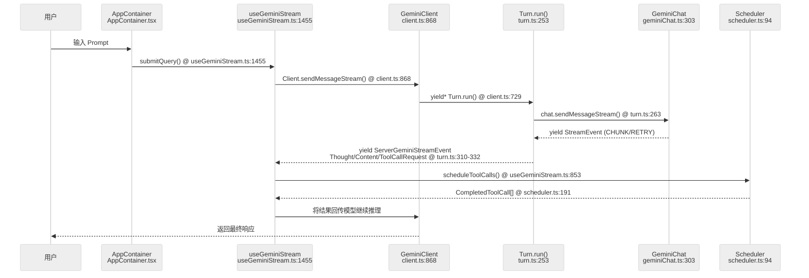
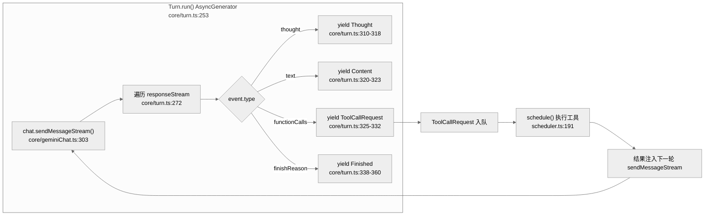

# 核心执行循环：Agent 决策链与 LLM 调用

Gemini CLI 的核心是一个由模型驱动的**自治执行循环**。它不仅仅是单次交互，而是能够根据模型反馈持续调用工具直到任务完成的过程。

## 1. Agent 循环序列图

整个循环跨越了 UI 宿主层、模型客户端层与工具调度层。

**涉及文件：**
- `packages/cli/src/ui/AppContainer.tsx` — React TUI 容器，接收用户输入
- `packages/cli/src/ui/hooks/useGeminiStream.ts` — 流式 Hook，管理 submitQuery 与事件处理
- `packages/core/src/core/client.ts` — GeminiClient，循环控制核心
- `packages/core/src/core/turn.ts` — Turn，AsyncGenerator 事件流
- `packages/core/src/core/geminiChat.ts` — GeminiChat，LLM API 封装
- `packages/core/src/scheduler/scheduler.ts` — Scheduler，工具调度器



### 1.2 循环反馈路径（ToolCall 触发重入）

**涉及文件：**
- `packages/core/src/core/turn.ts:253` — `Turn.run()` AsyncGenerator，遍历 LLM 响应流
- `packages/core/src/scheduler/scheduler.ts:191` — `Scheduler.schedule()`，执行工具并返回结果



## 2. Agent 决策链的关键环节

### 2.1 Prompt 构建：PromptProvider

Prompt 不是硬编码的模板，而是由 `PromptProvider` 动态生成的。

| 函数 | 文件:行号 | 职责 |
|---|---|---|
| `PromptProvider.getCoreSystemPrompt()` | `prompts/promptProvider.ts:42` | 汇总审批模式、可用工具列表、挂载的技能 |
| `getCoreSystemPrompt()` (snippets) | `prompts/snippets.ts:121` | 实际生成系统提示词模板 |

- **系统提示词 (Core System Prompt)**：汇总审批模式、可用工具列表、挂载的技能。
- **上下文感知**：自动包含当前工作区的 `GEMINI.md`、用户记忆 (User Memory) 和 tracker 状态。
- **行号与引用**：生成的提示词会指导模型如何引用代码片段及文件路径。

### 2.2 LLM 调用与流处理：GeminiChat

`packages/core/src/core/geminiChat.ts:303` 封装了底层的模型通信：

| 函数 | 文件:行号 | 职责 |
|---|---|---|
| `GeminiChat.sendMessageStream()` | `core/geminiChat.ts:303` | 发起流式请求，返回 AsyncGenerator |
| `streamWithRetries()` | `core/geminiChat.ts:352` | 三层重试机制：外层指数退避、中层 API 调用、内层事件转换 |
| `makeApiCallAndProcessStream()` | `core/geminiChat.ts:约400` | 处理 SSE 流并 yield CHUNK |
| `ChatRecordingService.recordMessage()` | `services/chatRecordingService.ts:244` | 写用户消息到存储层 |
| `ChatRecordingService.recordToolCalls()` | `services/chatRecordingService.ts:340` | 写工具调用记录到存储层 |

- **流式响应 (Streaming)**：通过 `sendMessageStream()` 将原始流拆分为文本、`thought` (思考过程) 和 `tool_call` 事件。
- **回合持久化 (Turn Recording)**：每轮对话及工具结果都会通过 `recordMessage()` 和 `recordToolCalls()` 写回存储层。

### 2.3 消息编排：Turn

`packages/core/src/core/turn.ts:238` 是具体的"回合"控制器：

| 函数 | 文件:行号 | 职责 |
|---|---|---|
| `class Turn` | `core/turn.ts:238` | 回合控制器 |
| `Turn.run()` AsyncGenerator | `core/turn.ts:253` | 逐事件 yield Thought/Content/ToolCallRequest/Finished |
| `Turn.handlePendingFunctionCall()` | `core/turn.ts:约200` | 解析 function call 并生成 tool call ID |
| `Turn.callCounter` | `core/turn.ts:239` | 生成 tool call ID，不负责循环检测 |

- **内容路由**：将模型输出的混合内容分发给 UI 渲染或工具调度。Turn 本身只解析和路由，不执行工具。
- **事件生成**：Turn 是 AsyncGenerator，逐事件 yield `Thought` / `Content` / `ToolCallRequest` / `Finished` 等，而非批量返回。
- **循环计数**：`callCounter` 追踪 pending tool calls 数量，但真正的循环检测在 `Client.loopDetector` 中进行。

## 3. 工具执行与回注 (Feedback Loop)

循环的核心在于其**闭环特性**：

| 步骤 | 函数调用 | 文件:行号 |
|---|---|---|
| 1. 模型输出 ToolCallRequest | `Turn.run()` yield ToolCallRequest | `core/turn.ts:325-332` |
| 2. 提交给调度器 | `scheduleToolCalls()` | `useGeminiStream.ts:853` |
| 3. 调度器执行工具 | `Scheduler.schedule()` | `scheduler/scheduler.ts:191` |
| 4. 工具执行完成 | `ToolExecutor.execute()` | `scheduler/scheduler.ts:约128` |
| 5. 结果回传给模型 | 作为 `message` 参数再调 `sendMessageStream` | `core/geminiChat.ts:319` |

`useGeminiStream` 中的 `scheduleToolCalls` 来自 `useToolScheduler` hook：

| 函数 | 文件:行号 |
|---|---|
| `useToolScheduler()` | `cli/ui/hooks/useToolScheduler.ts:67` |
| `scheduleToolCalls()` (从 hook 解构) | `useGeminiStream.ts:287` |

## 4. 关键代码定位

### 4.1 循环控制核心（GeminiClient）

| 函数 | 文件:行号 | 职责 |
|---|---|---|
| `GeminiClient.sendMessageStream()` | `core/client.ts:868` | 公开入口，AsyncGenerator，调用 `processTurn` |
| `Client.processTurn()` | `core/client.ts:585` | 内部私有方法，yield* `Turn.run()` 并处理循环检测 |
| `Client.loopDetector` | `core/client.ts:99` | `LoopDetectionService` 实例 |
| `LoopDetectionService.turnStarted()` | `services/loopDetectionService.ts:261` | 在每个 turn 开始前调用，判断是否已达循环上限 |
| `LoopDetectionService.addAndCheck()` | `services/loopDetectionService.ts:186` | 每个事件都调用，检测同一组工具被反复调用 |
| `LoopEventType.LoopDetected` | `core/client.ts:674` | 检测到循环时 yield 此事件 |

### 4.2 回合控制器（Turn）

| 函数 | 文件:行号 | 职责 |
|---|---|---|
| `Turn.run()` AsyncGenerator | `core/turn.ts:253` | 核心事件流：yield Thought/Content/ToolCallRequest/Finished |
| `Turn.handlePendingFunctionCall()` | `core/turn.ts:约200` | 解析 function call part，生成 `ToolCallRequest` 事件 |

### 4.3 流式会话封装（GeminiChat）

| 函数 | 文件:行号 | 职责 |
|---|---|---|
| `GeminiChat.sendMessageStream()` | `core/geminiChat.ts:303` | 公开 API，写入历史记录后调用 `streamWithRetries` |
| `streamWithRetries()` AsyncGenerator | `core/geminiChat.ts:352` | 外层重试循环（指数退避），中层 yield 事件 |
| `makeApiCallAndProcessStream()` | `core/geminiChat.ts:约400` | 内层：实际 API 调用，解析 SSE，yield CHUNK |

### 4.4 系统提示词生成

| 函数 | 文件:行号 | 职责 |
|---|---|---|
| `PromptProvider.getCoreSystemPrompt()` | `prompts/promptProvider.ts:42` | 汇总工具列表/审批模式/上下文 |
| `getCoreSystemPrompt()` (snippets) | `prompts/snippets.ts:121` | 实际模板插值生成 |

## 5. 技术深度：AsyncGenerator 流式架构

### 5.1 Turn.run() 作为 AsyncGenerator

`Turn.run()` (`core/turn.ts:253`) 是一个 **AsyncGenerator**：

```typescript
async *run(
  modelConfigKey: ModelConfigKey,
  req: PartListUnion,
  signal: AbortSignal,
  displayContent?: PartListUnion,
  role: LlmRole = LlmRole.MAIN,
): AsyncGenerator<ServerGeminiStreamEvent>
```

`yield` 的事件类型定义在 `core/turn.ts:220-235`：

| 事件类型 | 触发位置 | 含义 |
|---|---|---|
| `Thought` | `turn.ts:310-318` | 模型思考过程 |
| `Content` | `turn.ts:320-323` | 文本内容 |
| `ToolCallRequest` | `turn.ts:325-332` | 请求执行工具 |
| `Retry` | `turn.ts:278-281` | 需要重试 |
| `Finished` | `turn.ts:338-360` | 回合结束 |
| `UserCancelled` | `turn.ts:274` | 用户取消 |
| `AgentExecutionBlocked` | `turn.ts:292-298` | 执行被阻止 |

### 5.2 sendMessageStream() 的 3 层包装

`geminiChat.ts:303` 的 `streamWithRetries` (`geminiChat.ts:352`) 实现了 3 层：

| 层级 | 位置 | 职责 |
|---|---|---|
| **外层重试循环** | `geminiChat.ts:358` | `attempt < maxAttempts`，429 降级时指数退避 |
| **中层 API 调用** | `geminiChat.ts:372` | `makeApiCallAndProcessStream()` 处理 SSE 流并 yield CHUNK |
| **内层事件转换** | `geminiChat.ts:约380` | 将 `GenerateContentResponse` 拆解为 Thought/Content/FunctionCall 事件 |

### 5.3 循环检测机制

循环检测由 `LoopDetectionService` (`services/loopDetectionService.ts`) 实现：

| 函数 | 文件:行号 | 触发时机 |
|---|---|---|
| `loopDetector.turnStarted()` | `loopDetectionService.ts:261` | 在每个 turn 开始时调用一次，返回 `LoopDetectionResult` |
| `loopDetector.addAndCheck()` | `loopDetectionService.ts:186` | `processTurn()` 中每个事件都会调用一次 |

检测逻辑 (`client.ts:672-675`)：

```typescript
const loopResult = await this.loopDetector.turnStarted(signal);
if (loopResult.count > 1) {
  yield { type: GeminiEventType.LoopDetected };
  return turn;
}
```

当检测到模型反复调用同一组工具时，触发 `LoopDetected` 事件，防止无限消耗 Token。`Turn.callCounter` 只负责生成 tool call ID，不负责检测。

## 6. 代码质量评估 (Code Quality Assessment)

### 6.1 优点
- **AsyncGenerator 模式优雅**：事件流部分消费使 UI 可以逐步渲染，无需等完整响应。
- **重试逻辑透明**：429 降级在 `sendMessageStream` 内部自动处理，上层无需感知。
- **类型安全的事件联合**：`ServerGeminiStreamEvent` 联合类型覆盖 18 种事件，TypeScript 穷举检查。

### 6.2 改进点
- **`Turn.run()` 方法较长**：`Turn.run()` 约 150 行，包含了事件解析、finishReason 判断等多重逻辑；循环检测实际在 `Client.loopDetector` 而非 Turn 内部，建议考虑按事件类型拆分方法。
- **流式事件与 UI 状态绑定隐晦**：`useGeminiStream` hook 的实现分散在多个文件中，追踪"用户看到 Thought 的完整路径"较困难。
- **Scheduler 批次控制缺失**：当模型快速连续输出大量 `FunctionCall` 时，`useGeminiStream` 中的 `scheduleToolCalls` 可能被瞬时淹没，建议在 UI 层增加批次控制而非在 Turn 层。

### 6.3 章节导航 (Chapter Breakdown)

| 子章节 | 核心议题 | 关键源码 |
|---|---|---|
| §1 序列图 | main loop 全链路 | `useGeminiStream.ts:1455` → `client.ts:868` → `turn.ts:253` |
| §2 决策链 | PromptProvider / GeminiChat / Turn | `promptProvider.ts:42` / `geminiChat.ts:303` / `turn.ts:238` |
| §3 工具执行 | Scheduler 闭环反馈 | `scheduler.ts:191` / `useGeminiStream.ts:853` |
| §4 代码定位 | 循环控制核心 | `client.ts:585` / `loopDetectionService.ts:186` |
| §5 AsyncGenerator | Turn.run 事件流 / streamWithRetries 三层 | `turn.ts:253` / `geminiChat.ts:352` |
| §6 代码质量 | 缺陷分析 | - |

---

> 关联阅读：[04-tool-system.md](./04-tool-system.md) 了解工具是如何被执行与授权的。
