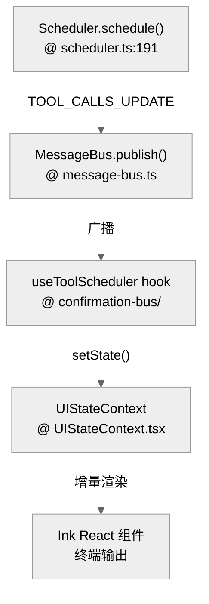
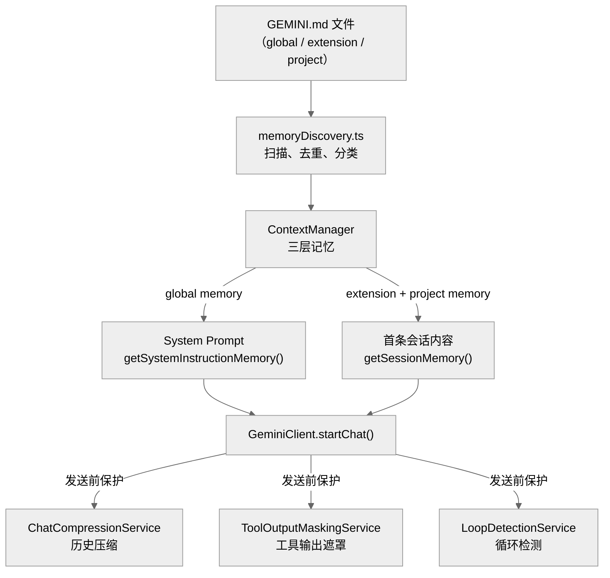

# Gemini CLI 的状态、会话与记忆系统

Gemini CLI 是一个有状态的 Agent 系统，其运行时行为由三个紧密协作的子系统共同支撑：**状态管理**（会话持久化与并发控制）、**上下文管理**（分层记忆注入、历史压缩与循环保护）、以及**记忆系统**（`GEMINI.md` 分层记忆与 `save_memory` 工具）。本章将三者合并讲解，帮助读者建立完整的系统视图。

**目录**

- [1. 概述](#1-概述)
- [2. 实现机制](#2-实现机制)
  - [2.1 状态管理](#21-状态管理)
  - [2.2 上下文管理](#22-上下文管理)
  - [2.3 记忆系统](#23-记忆系统)
- [3. 实际使用模式](#3-实际使用模式)
- [4. 代码示例](#4-代码示例)
- [5. 关键函数清单](#5-关键函数清单)
- [6. 代码质量评估](#6-代码质量评估)

---

## 1. 概述

三个子系统各司其职，又相互依赖：

- **状态管理**负责把会话数据落盘（`Storage` + `ChatRecordingService`），并在进程重启后通过 `--resume` 恢复；同时通过 `Scheduler` 和 `MessageBus` 协调并发工具执行，将状态变化投影到 Ink UI。
- **上下文管理**负责在每次向模型发送请求前，把正确的记忆、历史和工具输出组装成合适大小的上下文窗口；包括分层注入、自动压缩、工具输出遮罩和循环检测。
- **记忆系统**负责持久化跨会话的知识：以 `GEMINI.md` 为主载体，通过 `HierarchicalMemory` 三层结构（global / extension / project）组织，并提供 `save_memory` 工具和 `/memory` 命令供运行时读写。

三者的协作链路如下：记忆系统提供持久化知识 → 上下文管理在每轮请求前将其注入上下文窗口 → 状态管理确保会话历史和工具执行状态的一致性与可恢复性。

---

## 2. 实现机制

### 2.1 状态管理

#### 核心状态组件

| 组件 | 代码路径 | 关键方法 | 职责 |
|---|---|---|---|
| **Storage** | `packages/core/src/config/storage.ts` | `initialize()`, `getProjectTempDir()` | 计算全局/项目级存储根目录，提供会话与策略文件落点 |
| **ChatRecordingService** | `packages/core/src/core/recordingContentGenerator.ts` | `recordMessage()` | 实时捕获交互并序列化落盘 |
| **UIStateContext** | `packages/cli/src/ui/contexts/UIStateContext.tsx` | `useUIState()` | UI 状态容器，持有当前会话的渲染状态 |
| **MessageBus** | `packages/core/src/confirmation-bus/message-bus.ts` | `publish()`, `subscribe()` | 事件总线广播，解耦工具执行层与 UI 层 |
| **SessionSelector** | `packages/cli/src/utils/sessionUtils.ts` | `resolveSession()` | `--resume` 参数解析、会话查询与恢复入口 |
| **GitService** | `packages/core/src/services/gitService.ts` | `getDiff()` | Checkpoint 时捕获 Git 状态 |

#### 会话持久化与恢复

会话状态并不是一次性保存的，而是伴随每一轮交互增量更新的。

当用户运行 `gemini --resume <id>` 时：

1. `SessionSelector.resolveSession()` 将会话 ID 解析为具体的存储路径。
2. `Config` 初始化时从 `Storage` 加载对应的 `ChatHistory`。
3. `GeminiChat` 构造函数验证加载的历史记录（`packages/core/src/core/geminiChat.ts:256-271`）。
4. 系统恢复上下文，Agent 可以继续之前的对话而无需重新输入。

系统还会周期性地或在关键节点创建 checkpoint，不仅包含对话文本，还包含：

- **Git 状态**：捕获当前工作区的 diff（由 `GitService` 提供）。
- **环境变量**：保存执行过程中必要的上下文环境变量。

#### 并发控制与状态投影

Gemini CLI 的并发模型基于**事件总线（Message Bus）**的状态投影：

- **工具并发**：`Scheduler` 允许只读工具（如 `ls` 或 `read_file`）并行执行；写操作被顺序化以防竞态。
- **提交控制**：`useGeminiStream.submitQuery()` 在有活跃流时会拒绝新的用户提交。
- **UI 增量渲染**：React + Ink 的组合使复杂的 Agent 状态可以被增量投影到终端，而不是频繁重绘整个屏幕。

#### 关键代码定位

- **持久化根目录与路径计算**：`packages/core/src/config/storage.ts`
- **UI 状态主入口**：`packages/cli/src/ui/contexts/UIStateContext.tsx`
- **会话恢复核心逻辑**：`packages/cli/src/gemini.tsx:553-585`
- **历史验证**：`packages/core/src/core/geminiChat.ts:256-271`

---

### 2.2 上下文管理

上下文管理并不是一个单独的 `budget.ts` 或 `truncation.ts` 模块，而是由多条链路共同完成：记忆加载、系统提示词注入、会话历史裁剪、工具输出遮罩，以及循环检测。

#### 四层上下文结构

Gemini CLI 的上下文由四层组成：

1. **系统提示词中的全局记忆**：由 `Config.getSystemInstructionMemory()` 提供，在 `GeminiClient.startChat()` / `updateSystemInstruction()` 中传给 `getCoreSystemPrompt()`。
2. **会话级注入的扩展与项目记忆**：JIT context 打开时，`Config.getSessionMemory()` 把 extension/project memory 包装成 `<loaded_context>` 片段放入对话内容，而不是直接塞进 system prompt。
3. **`GeminiChat` 保存的对话历史**：同时维护完整历史与"curated history"，发送请求时优先使用后者。
4. **发送前保护层**：`GeminiClient` 在真正调用模型前会尝试压缩历史、遮罩大体积工具输出，并做循环与上下文溢出检查。

#### 分层记忆进入上下文

`packages/core/src/services/contextManager.ts` 把记忆分成三层：global memory、extension memory、project memory。这些内容来自 `packages/core/src/utils/memoryDiscovery.ts`，后者扫描 `GEMINI.md` 及其别名文件，按来源分类、去重、拼接。

当 `experimentalJitContext` 打开时，配置层采用更细的策略：

- `Config.getSystemInstructionMemory()` 只返回 **global memory**
- `Config.getSessionMemory()` 返回 **extension + project memory**
- `ContextManager.discoverContext()` 还能在访问具体路径时，按需加载子目录里的补充记忆

这意味着当前的上下文管理已经不是"固定窗口里塞完整历史"的单层模型，而是"系统级 + 会话级 + 按需发现"的分层结构。

#### 历史压缩与上下文窗口保护

当前默认和预览模型的 token 上限统一为 `1_048_576`（见 `packages/core/src/core/tokenLimits.ts`）。

`GeminiClient` 在真正流式发送前，会先调用 `tryCompressChat()`，由 `packages/core/src/services/chatCompressionService.ts` 实现：

- 默认在上下文约达模型上限的 **50%** 时尝试压缩
- 尽量保留最近约 **30%** 的历史
- 对超大的旧工具输出，不直接丢弃，而是截断后把完整内容落到项目临时目录

除了压缩，`GeminiClient` 还会调用 `ToolOutputMaskingService` 对历史中过于臃肿的工具输出进一步瘦身。`Config.getTruncateToolOutputThreshold()` 会根据当前剩余上下文动态收紧输出阈值。

如果这些措施之后本次请求仍可能超出窗口，客户端会发出 `GeminiEventType.ContextWindowWillOverflow` 事件，而不是盲目继续提交。

#### 循环检测

`packages/core/src/services/loopDetectionService.ts` 提供完整的循环检测，接入点在 `packages/core/src/core/client.ts`，包含三类检测：

- **完全相同的工具调用重复**：对 `tool name + args` 做哈希，连续重复超过阈值（**5次**）判定为循环
- **内容 chanting / 重复输出**：检测流式文本片段的重复模式，阈值为 **10次**
- **LLM 辅助检查**：单个 prompt 内经过 **30 个 turn** 后启动，定期让模型判断当前是否陷入"无进展循环"

该检测器支持按 session 关闭，不是写死在主循环里。

#### GeminiChat 历史

`packages/core/src/core/geminiChat.ts` 维护完整对话历史，包含：模型文本、`functionCall`、`functionResponse`、思考片段与补充内容。

`getHistory(curated = true)` 会过滤掉无效或空的 model turn，减少把脏历史继续传给模型的概率。

#### 关键源码锚点

| 主题 | 代码锚点 | 说明 |
| --- | --- | --- |
| 分层记忆加载 | `packages/core/src/services/contextManager.ts` | 管 global / extension / project 三层记忆 |
| 记忆发现 | `packages/core/src/utils/memoryDiscovery.ts` | 扫描、分类、去重 `GEMINI.md` |
| 系统提示词记忆注入 | `packages/core/src/config/config.ts` | `getSystemInstructionMemory()` / `getSessionMemory()` |
| 会话历史维护 | `packages/core/src/core/geminiChat.ts` | 保存完整历史并导出 curated history |
| 自动压缩 | `packages/core/src/services/chatCompressionService.ts` | 压缩历史并处理大工具输出 |
| 发送前保护 | `packages/core/src/core/client.ts` | 压缩、遮罩、溢出预警 |
| 循环检测 | `packages/core/src/services/loopDetectionService.ts` | 工具重复、内容重复、LLM 辅助检测 |
| token 上限 | `packages/core/src/core/tokenLimits.ts` | 当前默认模型窗口上限 |

---

### 2.3 记忆系统

#### GEMINI.md 主载体

从 `packages/core/src/tools/memoryTool.ts` 可以看到，默认上下文文件名是：

```
DEFAULT_CONTEXT_FILENAME = 'GEMINI.md'
```

这个文件名还能通过 `setGeminiMdFilename()` 被改写，源码并不假定永远只有一个固定文件名。

#### 分层记忆 HierarchicalMemory

`packages/core/src/config/memory.ts` 定义了 `HierarchicalMemory`，包含三层：

- `global`：全局记忆，进入 system prompt
- `extension`：扩展记忆，作为会话内容注入
- `project`：项目记忆，作为会话内容注入

`ContextManager` 会把发现到的记忆内容分别放进这三层，而不是简单拼成一大段字符串后到处传递。

#### 记忆发现机制

核心逻辑在 `packages/core/src/utils/memoryDiscovery.ts`，负责：

- 扫描 `GEMINI.md` 及其别名
- 区分 global / project 路径来源
- 读取文件内容
- 做文件身份去重，避免大小写路径或符号链接导致重复加载
- 处理 import 场景

在此基础上，`ContextManager.refresh()` 把结果整理成 global / extension / project 三层记忆。如果开启 JIT context，`discoverContext()` 还会在访问某个具体路径时，按需加载该路径向上到项目根目录之间的补充记忆。

#### Memory 进入对话

`packages/core/src/config/config.ts` 里的分流逻辑：

- `getSystemInstructionMemory()`：提供给 system prompt 的记忆（仅 global memory）
- `getSessionMemory()`：提供给首条会话上下文注入的记忆（extension + project memory）
- `getUserMemory()`：对外暴露当前完整记忆视图

当 JIT context 打开时，extension + project memory 会被包进 `<loaded_context>`、`<extension_context>`、`<project_context>` 标签中作为会话内容注入，而不是统一塞到 system prompt。

#### save_memory 工具实现

`packages/core/src/tools/memoryTool.ts` 的实现很直接：

1. 读取当前全局 memory 文件
2. 在 `## Gemini Added Memories` 段落下追加条目
3. 需要时展示 diff 并请求确认
4. 最终把结果写回磁盘

写入内容会做简单清洗，例如把换行压成单行，避免把任意 markdown 结构直接注进去。所以更准确的描述是：`save_memory` 是一个**显式的文件修改工具**，存储目标默认是全局 `GEMINI.md` 类文件，而不是独立的 `memory.json` 键值数据库。

#### /memory 命令

`packages/core/src/commands/memory.ts` 提供四类操作：

- `showMemory`：显示当前记忆内容
- `addMemory`：最终转成 `save_memory` 工具调用
- `refreshMemory`：重新扫描 memory 文件并更新 system instruction
- `listMemoryFiles`：列出当前实际生效的 memory 文件路径

这说明 memory 不是"启动时读一次就结束"，而是支持运行时刷新和显式追加。

#### 当前没有的能力

和很多"长期记忆系统"想象图不同，当前 Gemini CLI 没有实现：

- 向量检索
- 语义搜索
- 结构化 KV 记忆库
- 自动总结再写回 memory

目前的核心仍然是"层级 markdown 记忆 + 显式工具写入 + 运行时重新装载"。

#### 关键源码锚点

| 主题 | 代码锚点 | 说明 |
| --- | --- | --- |
| 记忆结构 | `packages/core/src/config/memory.ts` | `HierarchicalMemory` 定义 |
| 记忆发现 | `packages/core/src/utils/memoryDiscovery.ts` | 扫描、去重、分类 `GEMINI.md` |
| 记忆装载 | `packages/core/src/services/contextManager.ts` | 管理 global / extension / project memory |
| 配置侧注入 | `packages/core/src/config/config.ts` | system memory 与 session memory 分流 |
| 记忆写入工具 | `packages/core/src/tools/memoryTool.ts` | `save_memory` 的真实实现 |
| Slash 命令包装 | `packages/core/src/commands/memory.ts` | `/memory` 系列命令 |

---

## 3. 实际使用模式

三个子系统在实际场景中的协同方式：

**场景一：启动新会话**

1. `Storage` 初始化存储路径，`ContextManager` 扫描 `GEMINI.md` 文件（`memoryDiscovery`）。
2. global memory 注入 system prompt，extension/project memory 作为首条会话内容注入（JIT context 模式）。
3. `GeminiChat` 以空历史启动，`ChatRecordingService` 开始增量落盘。

**场景二：长会话中的上下文保护**

1. 每轮请求前，`GeminiClient` 检查当前 token 用量。
2. 达到 50% 阈值时，`ChatCompressionService` 自动压缩历史，保留最近 30%，大工具输出落盘。
3. `ToolOutputMaskingService` 对历史中的臃肿工具输出二次瘦身。
4. `LoopDetectionService` 持续监控工具调用和内容重复，30 轮后启动 LLM 辅助检查。

**场景三：Agent 写入记忆**

1. Agent 调用 `save_memory` 工具，`memoryTool.ts` 读取全局 `GEMINI.md`。
2. 在 `## Gemini Added Memories` 段落下追加条目，展示 diff 请求确认，写回磁盘。
3. 用户也可通过 `/memory refresh` 命令触发 `ContextManager.refresh()`，让新记忆立即生效于当前会话。

**场景四：恢复历史会话**

1. 用户运行 `gemini --resume <id>`，`SessionSelector.resolveSession()` 解析存储路径。
2. `Config` 从 `Storage` 加载 `ChatHistory`，`GeminiChat` 构造函数验证历史记录。
3. `ContextManager` 重新扫描 `GEMINI.md`，确保记忆与恢复的历史一致。
4. `Scheduler` 和 `MessageBus` 重新就绪，等待新的用户输入。

---

## 4. 代码示例

### 并发控制与状态投影（Mermaid）



### 上下文分层注入示意（Mermaid）



### save_memory 写入流程（TypeScript 伪代码）

```typescript
// packages/core/src/tools/memoryTool.ts（简化示意）
async function saveMemory(content: string): Promise<void> {
  // 1. 读取全局 GEMINI.md
  const memoryFile = await readGlobalMemoryFile();

  // 2. 在 "## Gemini Added Memories" 段落下追加
  const updated = appendToSection(
    memoryFile,
    '## Gemini Added Memories',
    sanitize(content)  // 换行压成单行，避免注入任意 markdown 结构
  );

  // 3. 展示 diff 并请求确认
  await showDiffAndConfirm(memoryFile, updated);

  // 4. 写回磁盘
  await writeGlobalMemoryFile(updated);
}
```

### 历史压缩策略（TypeScript 伪代码）

```typescript
// packages/core/src/services/chatCompressionService.ts（简化示意）
class ChatCompressionService {
  // 默认在上下文达到模型上限 50% 时触发
  private readonly COMPRESSION_THRESHOLD = 0.5;
  // 保留最近约 30% 的历史
  private readonly RETENTION_RATIO = 0.3;

  async compress(history: Content[], tokenLimit: number): Promise<Content[]> {
    const currentTokens = estimateTokens(history);
    if (currentTokens / tokenLimit < this.COMPRESSION_THRESHOLD) {
      return history; // 未达阈值，不压缩
    }

    const retainCount = Math.floor(history.length * this.RETENTION_RATIO);
    const toCompress = history.slice(0, history.length - retainCount);
    const toRetain = history.slice(history.length - retainCount);

    // 大工具输出落盘而非截断丢弃
    for (const turn of toCompress) {
      if (isLargeToolOutput(turn)) {
        await spillToDisk(turn);
      }
    }

    return [createSummaryTurn(toCompress), ...toRetain];
  }
}
```

---

## 5. 关键函数清单

合并三章的函数与组件清单：

| 函数 / 类型 | 文件 | 职责 |
|---|---|---|
| `Storage.initialize()` | `packages/core/src/config/storage.ts` | 计算全局/项目级存储根目录 |
| `ChatRecordingService.recordMessage()` | `packages/core/src/core/recordingContentGenerator.ts` | 实时捕获交互并序列化落盘 |
| `SessionSelector.resolveSession()` | `packages/cli/src/utils/sessionUtils.ts` | `--resume` 参数解析与会话恢复入口 |
| `GitService.getDiff()` | `packages/core/src/services/gitService.ts` | Checkpoint 时捕获 Git 状态 |
| `MessageBus.publish()` / `subscribe()` | `packages/core/src/confirmation-bus/message-bus.ts` | 事件总线广播，解耦工具执行与 UI |
| `Scheduler.schedule()` | `packages/core/src/` | 只读工具并行、写操作顺序化 |
| `useGeminiStream.submitQuery()` | `packages/cli/src/` | 有活跃流时拒绝新提交 |
| `ContextManager.refresh()` | `packages/core/src/services/contextManager.ts` | 重新扫描并整理三层记忆 |
| `ContextManager.discoverContext()` | `packages/core/src/services/contextManager.ts` | 按需路径发现子目录补充记忆（JIT） |
| `memoryDiscovery` | `packages/core/src/utils/memoryDiscovery.ts` | 扫描 `GEMINI.md` 及别名，按来源分类、去重 |
| `Config.getSystemInstructionMemory()` | `packages/core/src/config/config.ts` | 返回用于 system prompt 的 global memory |
| `Config.getSessionMemory()` | `packages/core/src/config/config.ts` | 返回用于对话内注入的 extension/project memory |
| `Config.getTruncateToolOutputThreshold()` | `packages/core/src/config/config.ts` | 根据剩余上下文动态收紧工具输出阈值 |
| `GeminiChat.getHistory(curated)` | `packages/core/src/core/geminiChat.ts` | 返回过滤空 turn 后的对话历史 |
| `GeminiClient.tryCompressChat()` | `packages/core/src/core/client.ts` | 发送前触发历史压缩 |
| `ChatCompressionService.compress()` | `packages/core/src/services/chatCompressionService.ts` | 保留最近 30%，大工具输出落盘 |
| `ToolOutputMaskingService` | `packages/core/src/services/` | 对历史中过大的工具输出二次瘦身 |
| `LoopDetectionService` | `packages/core/src/services/loopDetectionService.ts` | 三类检测：工具重复（阈值5）、内容重复（阈值10）、LLM辅助（30轮后） |
| `tokenLimits` | `packages/core/src/core/tokenLimits.ts` | 返回当前模型窗口上限（默认 1,048,576 tokens） |
| `HierarchicalMemory` | `packages/core/src/config/memory.ts` | global / extension / project 三层记忆结构定义 |
| `setGeminiMdFilename()` | `packages/core/src/tools/memoryTool.ts` | 改写默认记忆文件名 |
| `save_memory` 工具 | `packages/core/src/tools/memoryTool.ts` | 读取 `GEMINI.md`，追加条目，展示 diff，写回磁盘 |
| `/memory` 命令 | `packages/core/src/commands/memory.ts` | showMemory / addMemory / refreshMemory / listMemoryFiles |

---

## 6. 代码质量评估

### 优点

- **MessageBus 解耦**：工具执行状态通过事件总线广播，`Scheduler` 不直接依赖 UI 层，架构边界清晰。
- **Checkpoint 包含 Git 状态**：确保 Agent 恢复时可还原完整工作区上下文，不仅仅是对话文本。
- **三层记忆分层注入**：global memory 进 system prompt，extension/project memory 作为对话内容（JIT），按需加载而非全量预注入，减少 token 浪费。
- **`ChatCompressionService` 智能保留策略**：保留最近 30% + 大工具输出落盘而非截断丢弃，比简单删前文语义损失更小。
- **`LoopDetectionService` 三层保障**：工具哈希 + 内容重复 + LLM 辅助，覆盖了纯规则难以检测的语义无进展循环。
- **`GEMINI.md` 是主载体**：记忆直接存入 Markdown 文件，版本控制友好，human-readable，无需专用数据库。
- **`save_memory` 工具语义透明**：Agent 调用 `save_memory` 本质是修改 `GEMINI.md` 文件，用户可直接读写，无"隐藏"状态。
- **分层记忆优先级可控**：global → extension → project 三层，项目记忆可覆盖全局记忆，开发者可针对项目定制 AI 行为。

### 风险与改进点

- **React Context 状态镜像开销大**：`UIStateContext` 在长会话下持有大量历史消息，可能导致 Ink 重绘卡顿，建议引入虚拟化列表。
- **Storage 无原子性保证**：多进程并发写入同一会话文件时缺乏文件锁机制，存在写覆盖风险。
- **Checkpoint 频率不透明**：没有明确配置项控制 checkpoint 间隔，高频工具调用场景下可能产生大量磁盘 IO。
- **压缩触发阈值（50%）不可配置**：当前硬编码在 `ChatCompressionService` 内，不同场景（代码生成 vs 长文档处理）可能需要不同策略。
- **`ContextManager.discoverContext()` 无缓存失效机制**：按需加载子目录记忆时，若文件在会话中被修改，缓存可能返回过时内容。
- **`ToolOutputMaskingService` 遮罩策略不透明**：文档和代码注释未详细说明哪些条件触发遮罩，以及遮罩后模型是否知道内容被省略。
- **无长期记忆归纳机制**：`GEMINI.md` 会随使用不断增长，无自动归纳/压缩旧记忆的机制，长期使用会形成 token 消耗日益增大的问题。
- **记忆写操作无冲突检测**：多个并发会话同时修改同一个 `GEMINI.md` 时，无文件锁或合并机制，可能产生写覆盖。
- **记忆与对话历史是两套存储**：`GEMINI.md` 记忆和 `ChatRecordingService` 的 conversation JSON 互不感知，记忆召回完全依赖 system prompt 注入，不能按 session 作用域隔离。

---

> 关联阅读：[07-error-security.md](./07-error-security.md) 了解在状态异常时系统如何进行错误处理与自愈。
>
> **跨工具对比**：Gemini CLI 的 JSON 会话文件方案（替换写）最直接，但缺少事务保证。完整的四工具状态持久化对比见 **[hello-opencode/39-durable-state-comparison.md](../hello-opencode/39-durable-state-comparison.md)**。
