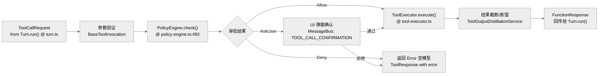

# 工具调用机制：Tool 注册、权限策略与执行闭环

工具系统（Tool System）是 Gemini CLI 具备实际行动能力的核心。它通过一整套安全策略和调度框架，将 LLM 的决策转化为本地代码执行。

## 1. 核心抽象与角色（含源码行号）

| 角色 | 代码路径 | 关键方法 | 行号 | 职责 |
|---|---|---|---|---|
| **ToolRegistry** | `packages/core/src/tools/tool-registry.ts` | `discoverAllTools()` | :200 | 工具发现与注册 |
| **ToolRegistry** | `packages/core/src/tools/tool-registry.ts` | `getFunctionDeclarations()` | :300+ | 导出 JSON Schema 给模型 |
| **PolicyEngine** | `packages/core/src/policy/policy-engine.ts` | `checkShellCommand()` | :336 | 风险评估与决策 |
| **Scheduler** | `packages/core/src/scheduler/scheduler.ts` | `schedule()` | :191 | 工具调用编排入口 |
| **ToolExecutor** | `packages/core/src/scheduler/tool-executor.ts` | `execute()` | — | 实际执行 + 输出截断 |
| **DiscoveredToolInvocation** | `packages/core/src/tools/tool-registry.ts` | `execute()` | :55 | 命令工具的子进程执行 |

## 2. 工具注册与发现 (Discovery)

系统启动时，`Config` 会调用 `ToolRegistry.discoverAllTools()`。
- **内建工具**：如 `grep_search`、`read_file`、`run_shell_command`。
- **命令工具 (Command Tools)**：基于特定脚本发现的工具。
- **MCP 工具**：从配置的 MCP Server（通过 `McpClientManager`）动态加载的工具。

模型在 `getFunctionDeclarations()`（`gemini-cli/packages/core/src/tools/tool-registry.ts`）阶段看到这些工具的 JSON Schema 定义。

## 3. 工具执行流水线 (Pipeline)

一个工具调用的生命周期遵循以下严格步骤：

## 4. 权限策略 (Tool Policy) 的实现

`PolicyEngine.checkShellCommand()` 是最核心的安全防御点。
- **静态规则**：根据工具名和参数（如 Shell 命令中的关键词）进行正则匹配。
- **模式分支**：
    - `YOLO`：全自动执行，无需用户确认。
    - `AUTO_EDIT`：对文件修改操作自动确认，但敏感命令仍需确认。
    - `INTERACTIVE`：默认模式，高风险操作必须用户通过 TUI 确认。
- **安全检查器 (Checkers)**：例如检查是否尝试修改敏感系统文件或环境变量。

## 5. 关键机制：输出截断与蒸馏

当工具输出过大（超过 Token 限制）时，`ToolExecutor` 会触发保护机制：
- **截断 (Truncation)**：保留头部和尾部，中间部分用占位符替代，并将完整输出保存至临时文件。
- **蒸馏 (Distillation)**：调用 `ToolOutputDistillationService` 利用模型对输出进行摘要压缩。

## 6. 代码质量评估 (Code Quality Assessment)

### 6.1 优点
- **PolicyEngine 策略可扩展**：规则以插件形式注册，新增规则只需实现 `Rule` 接口，无需修改核心逻辑。
- **Scheduler 与 Policy 解耦**：`Scheduler` 通过 `checkPolicy()` 调用 Policy，结果不影响 Scheduler 自身状态。

### 6.2 改进点
- **`DiscoveredToolInvocation.execute()` 使用子进程 `spawn`**：`tool-registry.ts:55` 通过 `child_process.spawn` 执行命令工具，存在 shell 注入风险，尽管 PolicyEngine 会预检，但建议对参数做二次 `shell-quote` 转义。
- **工具发现链路复杂**：`discoverAllTools()` 涉及文件系统扫描、MCPServer 连接、Shell 命令探测多个阶段，启动时延影响明显。
- **输出蒸馏缺少基准**：未验证蒸馏后的压缩率与语义保真度，生产环境可能出现信息丢失。

---

> 关联阅读：[06-extension-mcp.md](./06-extension-mcp.md) 了解如何通过 MCP 扩展新的工具。
