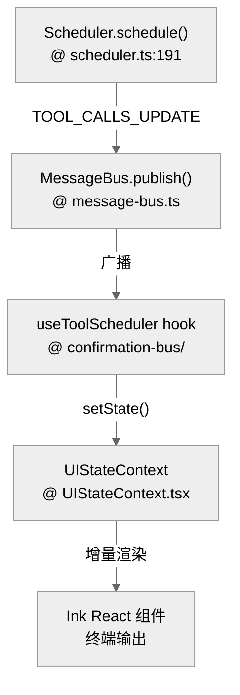

# 状态管理：会话持久化与并发控制

Gemini CLI 是一个有状态的 Agent 系统。它需要管理长会话历史、并发工具执行状态，以及在进程重启后恢复会话的能力。

**目录**

- [1. 核心状态组件（含源码行号）](#1-核心状态组件含源码行号)
- [2. 会话持久化与恢复 (Resume)](#2-会话持久化与恢复-resume)
- [3. 并发控制与状态投影](#3-并发控制与状态投影)
- [4. 关键代码定位](#4-关键代码定位)
- [5. 代码质量评估 (Code Quality Assessment)](#5-代码质量评估-code-quality-assessment)

---

## 1. 核心状态组件（含源码行号）

| 组件 | 代码路径 | 关键方法 | 行号 | 职责 |
|---|---|---|---|---|
| **Storage** | `packages/core/src/config/storage.ts` | `initialize()`, `getProjectTempDir()` | — | 计算全局/项目级存储根目录，提供会话与策略文件落点 |
| **ChatRecordingService** | `packages/core/src/core/recordingContentGenerator.ts` | `recordMessage()` | — | 实时捕获交互并序列化落盘 |
| **UIStateContext** | `packages/cli/src/ui/contexts/UIStateContext.tsx` | `useUIState()` | — | UI 状态容器 |
| **MessageBus** | `packages/core/src/confirmation-bus/message-bus.ts` | `publish()`, `subscribe()` | — | 事件总线广播 |
| **SessionSelector** | `packages/cli/src/utils/sessionUtils.ts` | `resolveSession()` | — | `--resume` 参数解析、会话查询与恢复入口 |
| **GitService** | `packages/core/src/services/gitService.ts` | `getDiff()` | — | Checkpoint 时捕获 Git 状态 |

## 2. 会话持久化与恢复 (Resume)

会话状态并不是一次性保存的，而是伴随每一轮交互增量更新的。

### 2.1 会话恢复流程
当用户运行 `gemini --resume <id>` 时：
1. `SessionSelector.resolveSession()` 将会话 ID 解析为具体的存储路径。
2. `Config` 初始化时从 `Storage` 加载对应的 `ChatHistory`。
3. `GeminiChat` 构造函数验证加载的历史记录（`gemini-cli/packages/core/src/core/geminiChat.ts:256-271`）。
4. 系统恢复上下文，Agent 可以继续之前的对话而无需重新输入。

### 2.2 状态落盘：Checkpointing
系统会周期性地或在关键节点创建 checkpoint。这不仅包含对话文本，还包含：
- **Git 状态**：捕获当前工作区的 diff（由 `GitService` 提供）。
- **环境变量**：保存执行过程中必要的上下文环境变量。

## 3. 并发控制与状态投影

Gemini CLI 的并发模型是基于 **事件总线 (Message Bus)** 的状态投影。

- **工具并发**：`Scheduler` 允许只读工具（如 `ls` 或 `read_file`）并行执行。为了防止竞态，写操作会被顺序化。
- **提交控制**：`useGeminiStream.submitQuery()` 在有活跃流时会拒绝新的用户提交。
- **UI 增量渲染**：React + Ink 的组合使得复杂的 Agent 状态可以被增量投影到终端，而不是频繁地重绘整个屏幕。

## 4. 关键代码定位

- **持久化根目录与路径计算**：`packages/core/src/config/storage.ts`
- **UI 状态主入口**：`packages/cli/src/ui/contexts/UIStateContext.tsx`
- **会话恢复核心逻辑**：`packages/cli/src/gemini.tsx:553-585`
- **历史验证**：`packages/core/src/core/geminiChat.ts:256-271` (GeminiChat 构造函数中验证加载的 ChatHistory)

## 5. 代码质量评估 (Code Quality Assessment)

### 5.1 优点
- **MessageBus 解耦**：工具执行状态通过事件总线广播，Scheduler 不直接依赖 UI 层。
- **Checkpoint 包含 Git 状态**：确保 Agent 恢复时可还原完整工作区上下文。

### 5.2 改进点
- **React Context 状态镜像开销大**：`UIStateContext` 在长会话下持有大量历史消息，可能导致 Ink 重绘卡顿，建议引入虚拟化列表。
- **Storage 无原子性保证**：多进程并发写入同一会话文件时缺乏文件锁机制。
- **Checkpoint 频率不透明**：没有明确配置项控制 checkpoint 间隔，高频工具调用场景下可能产生大量磁盘 IO。

---

> 关联阅读：[07-error-security.md](./07-error-security.md) 了解在状态异常时系统如何进行错误处理与自愈。
>
> **跨工具对比**：Gemini CLI 的 JSON 会话文件方案（替换写）最直接，但缺少事务保证。完整的四工具状态持久化对比见 **[hello-opencode/39-durable-state-comparison.md](../hello-opencode/39-durable-state-comparison.md)**。
