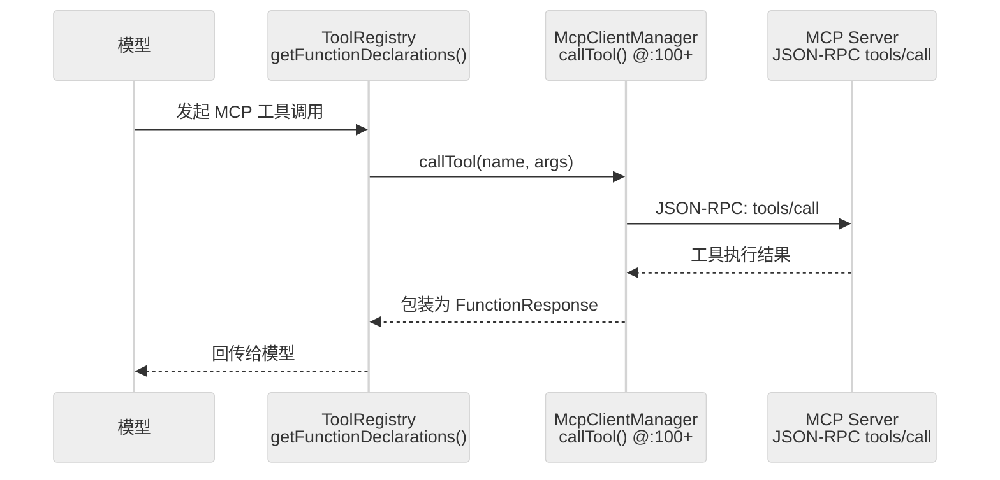

# 扩展性：MCP 与扩展机制的加载与隔离

Gemini CLI 的扩展性主要体现在两方面：**MCP (Model Context Protocol)** 的集成与**内建扩展 (Extensions)** 的加载。它允许系统在不修改内核的情况下，动态获得新的工具、资源和提示词能力。

## 1. MCP 集成机制

MCP 是 Gemini CLI 扩展能力的基石。它将外部服务的工具能力映射到本地 Agent 中。

### 1.1 McpClientManager：连接枢纽
`packages/core/src/tools/mcp-client-manager.ts` 是 MCP 的核心。
- **配置与发现**：读取 `settings` 中定义的 MCP 服务器列表。
- **声明映射**：将 MCP 服务器暴露的 `tools` 转换为 Gemini 的 `FunctionDeclaration`。
- **协议适配**：处理 JSON-RPC 通信，将 Agent 的工具调用请求转发给远端服务器。

### 1.2 MCP 工具执行流

## 2. 核心函数清单 (Function List)

| 函数/类 | 文件路径 | 行号 | 职责 |
|---|---|---|---|
| `McpClientManager` | `packages/core/src/tools/mcp-client-manager.ts` | — | MCP 连接管理与工具映射 |
| `McpClientManager.callTool()` | `packages/core/src/tools/mcp-client-manager.ts` | :100+ | 转发工具调用至 MCP Server |
| `McpClient` | `packages/core/src/tools/mcp-client.ts` | — | 单个 MCP Server 的 JSON-RPC 客户端 |
| `activate-skill.ts` | `packages/core/src/tools/activate-skill.ts` | — | Skill 动态激活 |
| `extensions.ts` | `packages/core/src/commands/extensions.ts` | — | 内建扩展加载入口 |
| `Config.createToolRegistry()` | `packages/core/src/config/config.ts` | — | 工具注册（内建 + MCP） |

## 2. 内建扩展与技能 (Extensions & Skills)

除了 MCP，系统还支持通过 `packages/core/src/commands/extensions.ts` 加载内建扩展。
- **Extensions**：通常是更高层的功能模块，如特定的 IDE 适配或大型工作流。
- **Skills**：即插即用的功能片段（如 `packages/core/src/skills`），可以动态挂载到 `Config` 中。

## 3. 隔离与安全性

扩展的加载并不是无限制的，它受到多重隔离机制的保护：
- **工作区信任 (Workspace Trust)**：系统会校验 `trustedFolders.ts`，只有在受信任的目录下才会加载 `.env` 或工作区特定的扩展。
- **沙箱隔离 (Sandbox)**：如果是通过 `--sandbox` 启动，所有扩展代码都在受限环境下执行，无法直接访问敏感宿主资源。
- **权限拦截**：无论工具源自 MCP 还是内建扩展，其执行都必须经过 `PolicyEngine` 的统一审批。

## 4. 如何新增一个工具：修改点指南

### 情况 A：通过外部 MCP Server 扩展
1. 运行一个符合 MCP 协议的服务器。
2. 在 `gemini configure` 或配置文件中添加服务器地址。
3. **无需修改源码**：Agent 会在启动时自动发现并注册该工具。

### 情况 B：新增仓库内建工具
1. 在 `packages/core/src/tools` 下定义新的 `BaseToolInvocation` 实现。
2. 在 `packages/core/src/config/config.ts` 的 `createToolRegistry()` 中进行手动注册。
3. （可选）在 `packages/cli/src/ui` 中添加自定义的工具渲染组件。

## 5. 代码质量评估 (Code Quality Assessment)

### 5.1 优点
- **MCP 工具透明接入**：无需修改内核代码，只需配置 MCP Server 地址即可动态扩展。
- **技能系统即插即用**：`activate-skill.ts` 允许运行时动态挂载功能片段。

### 5.2 改进点
- **MCP Server 连接缺乏熔断**：如果某个 MCP Server 无响应或挂起，`McpClientManager` 可能无限等待，影响整体 Agent 响应，建议引入 per-Server 超时与重试。
- **Skill 注册点隐蔽**：`Config._initialize()` 中的技能挂载逻辑分散，不易发现新 Skill 需要在此处注册。
- **Extension 缺少沙箱隔离保障**：内建扩展（`extensions.ts`）与 MCP 工具不同，不经过 MCP 沙箱通道，如果扩展直接调用 Node.js API（如 `fs`），PolicyEngine 无法拦截。

---

> 关联阅读：[01-architecture.md](./01-architecture.md) 了解扩展是如何被组装进全局 Config 的。
