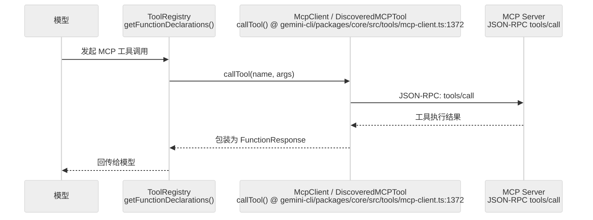

# 扩展性：MCP 与扩展机制的加载与隔离

Gemini CLI 的扩展性主要体现在两方面：**MCP (Model Context Protocol)** 的集成与**内建扩展 (Extensions)** 的加载。它允许系统在不修改内核的情况下，动态获得新的工具、资源和提示词能力。

**目录**

- [1. MCP 集成机制](#1-mcp-集成机制)
- [2. 核心函数清单 (Function List)](#2-核心函数清单-function-list)
- [3. 内建扩展与技能 (Extensions & Skills)](#3-内建扩展与技能-extensions-skills)
- [4. 隔离与安全性](#4-隔离与安全性)
- [5. 如何新增一个工具：修改点指南](#5-如何新增一个工具修改点指南)
- [6. 代码质量评估 (Code Quality Assessment)](#6-代码质量评估-code-quality-assessment)

---

## 1. MCP 集成机制

MCP 是 Gemini CLI 扩展能力的基石。它将外部服务的工具能力映射到本地 Agent 中。

### 1.1 McpClientManager：连接枢纽
`gemini-cli/packages/core/src/tools/mcp-client-manager.ts:34` 是 MCP 的核心。
- **配置与发现**：读取 `settings` 中定义的 MCP 服务器列表。
- **声明映射**：将 MCP 服务器暴露的 `tools` 转换为 Gemini 的 `FunctionDeclaration`。
- **协议适配**：处理 JSON-RPC 通信，将 Agent 的工具调用请求转发给远端服务器。

### 1.2 MCP 工具执行流

## 2. 核心函数清单 (Function List)

| 函数/类 | 文件路径 | 行号 | 职责 |
|---|---|---|---|
| `McpClientManager` | `gemini-cli/packages/core/src/tools/mcp-client-manager.ts` | 34 | MCP 连接管理、发现状态、server lifecycle |
| `McpClientManager.discoverAllMcpTools()` | `gemini-cli/packages/core/src/tools/mcp-client-manager.ts` | 535 | 遍历配置 server，连接并发现工具 |
| `McpClient.connect()` | `gemini-cli/packages/core/src/tools/mcp-client.ts` | 183 | 单 server 连接入口 |
| `McpClient.discoverInto()` | `gemini-cli/packages/core/src/tools/mcp-client.ts` | 226 | 将 MCP tools/resources/prompts 注册进 Gemini CLI |
| `discoverTools()` | `gemini-cli/packages/core/src/tools/mcp-client.ts` | 1272 | 拉取并校验 MCP tool declarations |
| `DiscoveredMCPToolInvocation.callTool()` | `gemini-cli/packages/core/src/tools/mcp-client.ts` | 1372 | 发起 JSON-RPC `tools/call`，带 per-request timeout |
| `createTransport()` | `gemini-cli/packages/core/src/tools/mcp-client.ts` | 2167 | 根据 stdio / HTTP / SSE 配置创建传输 |
| `DiscoveredMCPTool.shouldConfirmExecute()` | `gemini-cli/packages/core/src/tools/mcp-tool.ts` | 202 | 对 MCP server/tool trust 和 allowlist 做审批判断 |
| `activate-skill.ts` | `gemini-cli/packages/core/src/tools/activate-skill.ts` | 1 | Skill 动态激活工具 |

## 3. 内建扩展与技能 (Extensions & Skills)

除了 MCP，系统还支持通过 `gemini-cli/packages/core/src/commands/extensions.ts` 加载内建扩展。
- **Extensions**：通常是更高层的功能模块，如特定的 IDE 适配或大型工作流。
- **Skills**：即插即用的功能片段（如 `gemini-cli/packages/core/src/skills`），可以动态挂载到 `Config` 中。

## 4. 隔离与安全性

扩展的加载并不是无限制的，它受到多重隔离机制的保护：
- **工作区信任 (Workspace Trust)**：系统会校验 `trustedFolders.ts`，只有在受信任的目录下才会加载 `.env` 或工作区特定的扩展。
- **沙箱隔离 (Sandbox)**：如果是通过 `--sandbox` 启动，所有扩展代码都在受限环境下执行，无法直接访问敏感宿主资源。
- **权限拦截**：无论工具源自 MCP 还是内建扩展，其执行都必须经过 `PolicyEngine` 的统一审批。
- **MCP stdio 信任边界**：`createTransport()` 会阻止未受信任工作区启动 stdio server，因为 stdio server 本质上是本地命令执行。
- **远程 MCP 认证边界**：HTTP/SSE server 支持 OAuth token storage、自动发现和手动 `/mcp auth` 路径；失败会通过 diagnostic 进入 UI，而不是静默吞掉。

## 5. 如何新增一个工具：修改点指南

### 情况 A：通过外部 MCP Server 扩展
1. 运行一个符合 MCP 协议的服务器。
2. 在 `gemini configure` 或配置文件中添加服务器地址。
3. **无需修改源码**：Agent 会在启动时自动发现并注册该工具。

### 情况 B：新增仓库内建工具
1. 在 `gemini-cli/packages/core/src/tools` 下定义新的 `BaseToolInvocation` 实现。
2. 在 `gemini-cli/packages/core/src/config/config.ts` 的 `createToolRegistry()` 中进行手动注册。
3. （可选）在 `gemini-cli/packages/cli/src/ui` 中添加自定义的工具渲染组件。

## 6. 代码质量评估 (Code Quality Assessment)

### 6.1 优点
- **MCP 工具透明接入**：无需修改内核代码，只需配置 MCP Server 地址即可动态扩展。
- **技能系统即插即用**：`activate-skill.ts` 允许运行时动态挂载功能片段。

### 6.2 改进点
- **MCP Server 发现是并行但状态粗粒度**：`McpClientManager` 有 discovery state 和 per-server last error，但 UI 只能看到较粗的 server 状态，建议增加每个 server 的阶段状态（connecting/discovering/registering）。
- **Skill 注册点隐蔽**：`Config._initialize()` 中的技能挂载逻辑分散，不易发现新 Skill 需要在此处注册。
- **Extension 缺少沙箱隔离保障**：内建扩展（`extensions.ts`）与 MCP 工具不同，不经过 MCP 沙箱通道，如果扩展直接调用 Node.js API（如 `fs`），PolicyEngine 无法拦截。

---

> 关联阅读：[01-architecture.md](./01-architecture.md) 了解扩展是如何被组装进全局 Config 的。

## 7. 横向对齐补强：MCP 是工具发现层，不是独立 agent

Gemini CLI 的 MCP 文档需要和 `13-skill-system.md`、`14-plugin-system.md` 分清边界：MCP 主要贡献工具、prompt/resource 能力；Skill 主要贡献模型可见指令；Plugin/配置则影响发现和信任边界。

| 扩展面 | Gemini 侧关注点 | 对齐章节 |
| --- | --- | --- |
| MCP server | 工具发现、调用、连接状态、错误恢复 | `24-mcp-system.md` |
| ToolRegistry | 把 MCP 工具并入统一工具集合 | `05-tool-system.md` |
| PolicyEngine | MCP 工具执行前仍需要策略判断 | `07-error-security.md` |
| PromptProvider | MCP 不是 system prompt 主模板来源 | `11-prompt-system.md` |

横向看，Gemini CLI 的 MCP 路径比 OpenCode 少 durable state 负担，比 Codex 少 sandbox 耦合，比 Claude Code 少插件市场复杂度。

## MCP 连接生命周期与失败恢复

| 阶段 | Gemini 侧边界 | 失败恢复 | 对齐章节 |
| --- | --- | --- | --- |
| Extension/config 发现 | extension loader 读取配置并合并 MCP server 定义 | 配置缺失时不注册 server，CLI 仍可运行 | `14-plugin-system.md` |
| Client 连接 | MCP manager 建立 server 连接并记录状态 | 连接失败进入 last error / 状态提示 | `24-mcp-system.md` |
| 工具发现 | ToolRegistry 把 MCP tools 并入统一工具集合 | 发现失败只影响该 server 的工具可见性 | `05-tool-system.md` |
| 执行调度 | Scheduler 对 MCP 工具仍走确认/调度链路 | 工具调用失败作为 tool error 反馈模型 | `07-error-security.md` |
| Auth 刷新 | auth provider 处理需要授权的 server | 授权失败不应污染其他 server | `24-mcp-system.md` |

源码上可从 `gemini-cli/packages/core/src/utils/extensionLoader.ts:75`、`gemini-cli/packages/core/src/utils/extensionLoader.ts:183` 看扩展配置进入点，从 `gemini-cli/packages/core/src/tools/tool-registry.ts:269` 看工具刷新，从 `gemini-cli/packages/core/src/scheduler/scheduler.ts:191` 看 MCP 工具执行仍回到统一调度。
