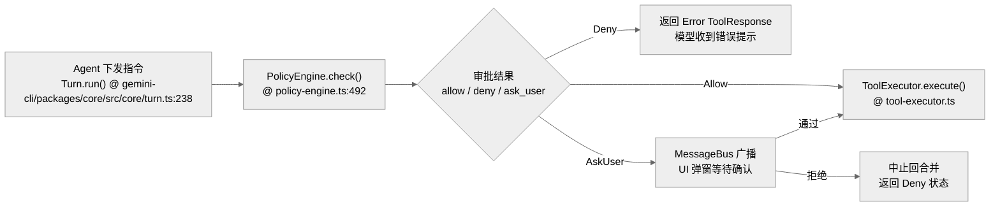

# 错误处理与安全性：Agent 的自愈与边界防护

作为一个具有本地代码执行能力的 Agent，安全性（Security）与鲁棒性（Robustness）是 Gemini CLI 的生命线。

**目录**

- [1. 深度安全防御体系](#1-深度安全防御体系)
- [2. 错误处理与自愈 (Self-Healing)](#2-错误处理与自愈-self-healing)
- [3. 安全审批流 (Confirmation Flow)](#3-安全审批流-confirmation-flow)
- [4. 关键代码定位](#4-关键代码定位)
- [5. 核心函数清单 (Function List)](#5-核心函数清单-function-list)
- [6. 代码质量评估 (Code Quality Assessment)](#6-代码质量评估-code-quality-assessment)

---

## 1. 深度安全防御体系

Gemini CLI 采用多层嵌套防御机制，确保 Agent 在处理复杂任务时不越权、不泄密。

| 防御层 | 实现模块 | 核心机制 | 行号 |
| --- | --- | --- | --- |
| **沙箱层 (Sandbox)** | `gemini-cli/packages/core/src/services/sandboxManager.ts` | **物理隔离**：结合 Linux/macOS/Windows sandbox manager 限制文件系统与命令执行。 | 1 |
| **策略层 (Policy)** | `gemini-cli/packages/core/src/policy/policy-engine.ts` | **逻辑控制**：`PolicyEngine.check()` 实时评估风险 | 492 |
| **环境层 (Env)** | `gemini-cli/packages/core/src/services/environmentSanitization.ts` | **数据清洗**：`sanitizeEnvironment()` 过滤环境变量 | 13 |
| **工作区层 (Trust)** | `gemini-cli/packages/cli/src/config/trustedFolders.ts` | **信任校验**：限制未信任目录中的 MCP stdio、扩展安装和 include dirs | 1 |

### 1.1 敏感文件防泄漏 (Secret Masking)
在执行 `grep_search` 或 `read_file` 时，系统会自动避开 `.git`、`node_modules`、`.env` 等目录。此外，在 Linux 沙箱模式下，会使用 mask file 覆盖宿主的敏感路径（如 `/etc/shadow`）。

## 2. 错误处理与自愈 (Self-Healing)

系统不仅要捕获错误，还要尝试从模型生成的错误指令中恢复。

### 2.1 请求级重试
`GeminiClient` 和 `GeminiChat` 都内置了 `retryWithBackoff()`（`gemini-cli/packages/core/src/utils/retry.ts:198`）：
- **429 降级**：当触发速率限制时，自动进行指数退避重试。
- **坏流恢复**：`GeminiChat.sendMessageStream()` 对模型产出的无效或截断响应进行实时纠偏。
- **连接期/流中错误分层**：`GeminiChat` 在连接阶段使用 `retryWithBackoff()`，流中错误则通过 retry marker 通知 UI 丢弃部分输出，避免半截响应进入最终历史。

### 2.2 工具执行级的异常捕获
`Scheduler` 在调用 `ToolExecutor` 时会包裹完整的 try-catch。
- **软错误 (Soft Error)**：如文件不存在。错误信息被格式化为 `ToolResponse` 返回给模型，提示模型修正指令。
- **硬错误 (Hard Error)**：如沙箱崩溃。系统会触发 `uncaughtException` 兜底，并引导用户进行重启或环境检查。

## 3. 安全审批流 (Confirmation Flow)

- **YOLO 模式下的例外**：即使用户开启了 `--yolo` 模式，某些极高风险的操作（如删除关键目录）仍可能被 `PolicyEngine` 强制拦截或要求二次确认。

## 4. 关键代码定位

- **策略引擎核心**：`gemini-cli/packages/core/src/policy/policy-engine.ts:492` (`check()`), `gemini-cli/packages/core/src/policy/policy-engine.ts:336` (`checkShellCommand()`)
- **沙箱管理器**：`gemini-cli/packages/core/src/services/sandboxManager.ts`
- **环境变量清洗**：`gemini-cli/packages/core/src/services/environmentSanitization.ts:13` (`sanitizeEnvironment()`)
- **重试机制**：`gemini-cli/packages/core/src/utils/retry.ts:198` (`retryWithBackoff()`), `gemini-cli/packages/core/src/core/geminiChat.ts:304` (`sendMessageStream()`)

## 5. 核心函数清单 (Function List)

| 函数/类 | 文件路径 | 行号 | 职责 |
|---|---|---|---|
| `PolicyEngine.check()` | `gemini-cli/packages/core/src/policy/policy-engine.ts` | 492 | 工具调用风险评估 |
| `PolicyEngine.checkShellCommand()` | `gemini-cli/packages/core/src/policy/policy-engine.ts` | 336 | Shell 命令 parser + policy 规则匹配 |
| `retryWithBackoff()` | `gemini-cli/packages/core/src/utils/retry.ts` | 198 | 429、网络错误和连接期错误的指数退避 |
| `GeminiChat.sendMessageStream()` | `gemini-cli/packages/core/src/core/geminiChat.ts` | 304 | 模型流式响应、流中 retry marker、历史记录 |
| `Scheduler.schedule()` | `gemini-cli/packages/core/src/scheduler/scheduler.ts` | 191 | 工具执行调度与状态推进 |
| `ToolExecutor.execute()` | `gemini-cli/packages/core/src/scheduler/tool-executor.ts` | 60 | 软错误格式化为 ToolResponse |
| `sanitizeEnvironment()` | `gemini-cli/packages/core/src/services/environmentSanitization.ts` | 13 | 环境变量过滤 |
| `createTransport()` | `gemini-cli/packages/core/src/tools/mcp-client.ts` | 2167 | MCP stdio/HTTP/SSE 传输创建，包含 trust 检查 |

## 6. 代码质量评估 (Code Quality Assessment)

### 6.1 优点
- **4 层防御体系完整**：沙箱（物理）→ PolicyEngine（逻辑）→ Env 清洗（数据）→ Trust 校验（工作区），纵深防御设计清晰。
- **YOLO 模式有强制例外**：即使 `--yolo` 也无法绕过极高风险操作，安全性不退让。

### 6.2 改进点
- **PolicyEngine 规则数量不透明**：外部用户无法直观了解当前策略覆盖了哪些 pattern，debug "为什么这个命令被拦截" 较困难。
- **沙箱检测非原子性**：`loadSandboxConfig()` 检测与拉起之间存在时间窗口，非沙箱模式的进程可能已在做危险操作。
- **错误恢复路径不完整**：`uncaughtException` 仅引导重启，缺乏现场保护（如 checkpoint 强制落盘），重启后可能丢失当前会话状态。
- **MCP 与本地工具使用两套风险面**：MCP stdio 的危险点在 server 启动，内建 shell/edit 的危险点在每次 tool call；建议在调试输出里明确标注风险来自“server transport”还是“tool invocation”。

---

> 关联阅读：[08-performance.md](./08-performance.md) 了解安全检查对系统性能的影响。

## 7. 横向对齐补强：安全边界集中在 PolicyEngine + Scheduler

Gemini CLI 的安全模型不能只看 shell sandbox。模型发出的工具调用会先进入 Scheduler，再由 PolicyEngine 判断是否允许、拒绝或需要确认。

| 安全面 | 源码入口 | 横向对比 |
| --- | --- | --- |
| 策略判断 | `gemini-cli/packages/core/src/policy/policy-engine.ts` | 对应 Codex approval policy、OpenCode Permission、Claude permission hook |
| 调度闸门 | `gemini-cli/packages/core/src/scheduler/policy.ts` | 把 tool request 映射为策略请求 |
| 执行状态 | `gemini-cli/packages/core/src/scheduler/scheduler.ts` | 承担确认、执行、失败回传 |
| 循环保护 | `gemini-cli/packages/core/src/services/loopDetectionService.ts` | Gemini 特有的 turn 前/流中 loop detection |

横向看，Gemini 的安全优势是 TypeScript 路径清楚；弱点是 sandbox 强度不如 Codex，需要文档明确哪些风险由 PolicyEngine 管，哪些风险仍落在具体工具实现。
