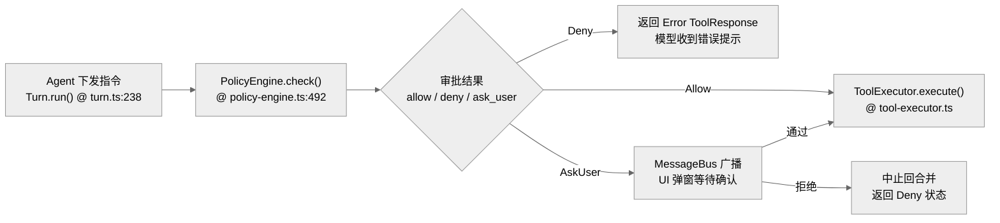

# 错误处理与安全性：Agent 的自愈与边界防护

作为一个具有本地代码执行能力的 Agent，安全性（Security）与鲁棒性（Robustness）是 Gemini CLI 的生命线。

**目录**

- [1. 深度安全防御体系](#1-深度安全防御体系)
- [2. 错误处理与自愈 (Self-Healing)](#2-错误处理与自愈-self-healing)
- [3. 安全审批流 (Confirmation Flow)](#3-安全审批流-confirmation-flow)
- [4. 关键代码定位](#4-关键代码定位)
- [5. 核心函数清单 (Function List)](#5-核心函数清单-function-list)
- [6. 代码质量评估 (Code Quality Assessment)](#6-代码质量评估-code-quality-assessment)

---

## 1. 深度安全防御体系

Gemini CLI 采用多层嵌套防御机制，确保 Agent 在处理复杂任务时不越权、不泄密。

| 防御层 | 实现模块 | 核心机制 | 行号 |
| --- | --- | --- | --- |
| **沙箱层 (Sandbox)** | `cli/src/sandbox` | **物理隔离**：利用 `bubblewrap` (Linux) 或子进程隔离，限制文件系统与网络访问。 | — |
| **策略层 (Policy)** | `core/src/policy/policy-engine.ts` | **逻辑控制**：`PolicyEngine.check()` 实时评估风险 | :492 |
| **环境层 (Env)** | `cli/src/config/env` | **数据清洗**：`sanitizeEnvVar` 白名单环境变量过滤 | — |
| **工作区层 (Trust)** | `cli/src/config/trustedFolders.ts` | **信任校验**：禁用非信任目录的自动执行 | — |

### 1.1 敏感文件防泄漏 (Secret Masking)
在执行 `grep_search` 或 `read_file` 时，系统会自动避开 `.git`、`node_modules`、`.env` 等目录。此外，在 Linux 沙箱模式下，会使用 mask file 覆盖宿主的敏感路径（如 `/etc/shadow`）。

## 2. 错误处理与自愈 (Self-Healing)

系统不仅要捕获错误，还要尝试从模型生成的错误指令中恢复。

### 2.1 请求级重试
`GeminiClient.generateContent()`（`gemini-cli/packages/core/src/core/client.ts`）内置了 `retryWithBackoff`：
- **429 降级**：当触发速率限制时，自动进行指数退避重试。
- **坏流恢复**：`GeminiChat.sendMessageStream()` 对模型产出的无效或截断响应进行实时纠偏。

### 2.2 工具执行级的异常捕获
`Scheduler` 在调用 `ToolExecutor` 时会包裹完整的 try-catch。
- **软错误 (Soft Error)**：如文件不存在。错误信息被格式化为 `ToolResponse` 返回给模型，提示模型修正指令。
- **硬错误 (Hard Error)**：如沙箱崩溃。系统会触发 `uncaughtException` 兜底，并引导用户进行重启或环境检查。

## 3. 安全审批流 (Confirmation Flow)

- **YOLO 模式下的例外**：即使用户开启了 `--yolo` 模式，某些极高风险的操作（如删除关键目录）仍可能被 `PolicyEngine` 强制拦截或要求二次确认。

## 4. 关键代码定位

- **策略引擎核心**：`packages/core/src/policy/policy-engine.ts` (`check()` @ :492, `checkShellCommand()` @ :336)
- **沙箱管理器**：`packages/cli/src/config/sandboxPolicyManager.ts`
- **环境变量清洗**：`packages/cli/src/config/env.ts` (`sanitizeEnvVar`)
- **重试机制**：`packages/core/src/utils/retry.ts` (`retryWithBackoff`) + `geminiChat.ts:303` (内层重试循环)

## 5. 核心函数清单 (Function List)

| 函数/类 | 文件路径 | 行号 | 职责 |
|---|---|---|---|
| `PolicyEngine.check()` | `packages/core/src/policy/policy-engine.ts` | :492 | 工具调用风险评估 |
| `PolicyEngine.checkShellCommand()` | `packages/core/src/policy/policy-engine.ts` | :336 | Shell 命令正则规则匹配 |
| `retryWithBackoff()` | `packages/core/src/utils/retry.ts` | — | 429 降级指数退避 |
| `Scheduler.schedule()` | `packages/core/src/scheduler/scheduler.ts` | :191 | 工具执行 try-catch 封装 |
| `ToolExecutor.execute()` | `packages/core/src/scheduler/tool-executor.ts` | — | 软错误格式化为 ToolResponse |
| `sanitizeEnvVar()` | `packages/cli/src/config/env.ts` | — | 环境变量白名单过滤 |
| `trustedFolders.validate()` | `packages/cli/src/config/trustedFolders.ts` | — | 工作区信任校验 |

## 6. 代码质量评估 (Code Quality Assessment)

### 6.1 优点
- **4 层防御体系完整**：沙箱（物理）→ PolicyEngine（逻辑）→ Env 清洗（数据）→ Trust 校验（工作区），纵深防御设计清晰。
- **YOLO 模式有强制例外**：即使 `--yolo` 也无法绕过极高风险操作，安全性不退让。

### 6.2 改进点
- **PolicyEngine 规则数量不透明**：外部用户无法直观了解当前策略覆盖了哪些 pattern，debug "为什么这个命令被拦截" 较困难。
- **沙箱检测非原子性**：`loadSandboxConfig()` 检测与拉起之间存在时间窗口，非沙箱模式的进程可能已在做危险操作。
- **错误恢复路径不完整**：`uncaughtException` 仅引导重启，缺乏现场保护（如 checkpoint 强制落盘），重启后可能丢失当前会话状态。

---

> 关联阅读：[08-performance.md](./08-performance.md) 了解安全检查对系统性能的影响。
