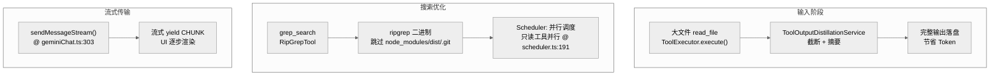

# 性能与代码质量：大仓库处理与架构评估

Gemini CLI 在处理超大规模代码库（数百万行代码）和长周期会话时，面临着严峻的性能挑战。系统通过一系列工程化手段来平衡模型推理成本与本地执行效率。

## 1. 性能关键路径 Mermaid 图

## 2. 核心函数清单 (Function List)

| 函数/类 | 文件路径 | 行号 | 性能相关职责 |
|---|---|---|---|
| `RipGrepTool.execute()` | `packages/core/src/tools/ripGrep.ts` | — | 调用 ripgrep 二进制，跳过 node_modules |
| `GrepTool.execute()` | `packages/core/src/tools/grep.ts` | — | fallback grep 实现 |
| `ToolExecutor.execute()` | `packages/core/src/scheduler/tool-executor.ts` | — | 检测输出大小，超阈值触发蒸馏 |
| `ToolOutputDistillationService` | `packages/core/src/tools/` | — | 调用模型对大输出进行摘要压缩 |
| `Scheduler.schedule()` | `packages/core/src/scheduler/scheduler.ts` | :191 | 只读工具并行调度 |
| `sendMessageStream()` | `packages/core/src/core/geminiChat.ts` | :303 | AsyncGenerator 流式 yield |
| `tokenLimit.check()` | `packages/core/src/core/tokenLimits.ts` | — | Token 数量预估与截断 |
| `canUseRipgrep()` | `packages/core/src/tools/ripGrep.ts` | — | 检测 ripgrep 可用性 |

## 3. 大文件与大输出的处理优化

### 3.1 工具输出蒸馏 (Distillation)
当工具执行（如 `cat` 一个 10MB 的文件）产生的输出过大时，`ToolExecutor` 会调用 `ToolOutputDistillationService`：
- **实时压缩**：利用模型的能力对冗长的输出进行摘要。
- **本地落盘**：完整输出保存在本地磁盘，仅将摘要发给 LLM，既节省 Token 又保证了后续任务的上下文完整性。

### 3.2 搜索性能优化
为了在大型 Monorepo 中高效搜索，内建工具集成了 `ripgrep` 等高性能二进制程序：
- **路径排除**：在检索时默认跳过 `node_modules`、`dist` 和 `.git`。
- **并行调度**：`Scheduler` 允许只读工具并行执行，极大地缩短了扫描多个文件的时间。

## 4. 性能测试保障

项目在 `integration-tests/` 中包含了专门的性能与行为回归用例：
- `policy-headless.test.ts`（`gemini-cli/integration-tests/policy-headless.test.ts`）：验证无头模式下的策略决策速度。
- `browser-agent.test.ts`（`gemini-cli/integration-tests/browser-agent.test.ts`）：验证加载真实浏览器时的端到端响应时间。

## 5. 代码质量分析 (Pros & Cons)

### 5.1 架构优点
- **高解耦性**：`Config` 类作为 Composition Root 组装核心依赖，使得 CLI 和 SDK 可以轻松共用逻辑。
- **高可观察性**：通过 `MessageBus` 实现了详细的运行状态投影，便于调试与交互反馈。
- **安全优先设计**：沙箱与 Policy 引擎不是外挂件，而是深度耦合在启动与执行链路中。
- **流式架构高效**：AsyncGenerator 使 UI 可以增量渲染，无需等待完整响应。

### 5.2 潜在改进点
- **文件臃肿**：`AppContainer.tsx` 和 `Config.ts`（3726 行）等核心文件已经超过 1000 行，业务逻辑与组装逻辑混杂，维护门槛较高。
- **状态镜像开销**：UI 层维护了一份与运行时核心近似镜像的状态，长会话下可能导致渲染卡顿，可考虑进一步下放状态管理职责。
- **Prompt 动态性过高**：复杂的 Prompt 构建分支使得调试"模型为什么没看到某工具"变得困难。
- **蒸馏缺乏量化指标**：未在 benchmark 中验证蒸馏压缩率与语义保真度。
- **Checkpoint IO 频率不透明**：没有配置项控制 checkpoint 间隔，高频工具调用时可能产生大量磁盘 IO。

## 6. 总结与改进建议

| 优先级 | 改进建议 | 影响 |
|---|---|---|
| **高** | 引入更轻量的状态分发机制（Zustand），减少超大 React Context 带来的无效重绘 | UI 渲染性能 |
| **高** | 模块化 Prompt 生成器：将 `getCoreSystemPrompt()` 拆分为独立插件 | 可调试性 |
| **中** | 持久化上下文增强：引入 RAG 机制处理极长历史记录 | 长会话质量 |
| **中** | 添加蒸馏基准测试，量化压缩率与语义保真度 | 可靠性 |
| **中** | 添加可配置的 Checkpoint 频率控制 | IO 性能 |

---

> 关联阅读：[00-gemini-cli_ko.md](./00-gemini-cli_ko.md) 回到分析主索引。
