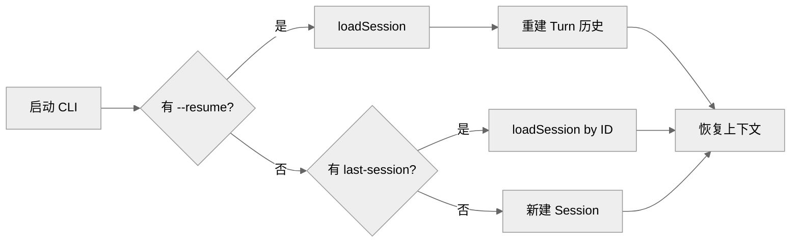

# Gemini CLI Session 持久化与会话恢复

本文档分析 Gemini CLI 的 Session 持久化与恢复机制。

## 1. Session 在 Gemini CLI 里的定位

### 1.1 基本架构

Gemini CLI 的 Session 机制是轻量级的：

- Session 是聊天历史的容器
- 通过 Storage 接口持久化
- 支持通过 ID 恢复历史会话

### 1.2 与其他项目的对比

| 特性 | Claude Code | Codex | OpenCode | Gemini CLI |
| --- | --- | --- | --- | --- |
| Session 管理 | 完整 | Thread 协议 | SQLite | JSON 文件 |
| Resume | 支持 | 支持 | 支持 | 基础 |
| Checkpoint | 支持 | Turn 粒度 | 支持 | 无 |
| History | 完整 | 完整 | 完整 | 基础 |

---

## 2. Session 数据结构

### 2.1 Session 接口

```typescript
interface Session {
  id: string
  createdAt: Date
  updatedAt: Date
  messages: Message[]
  metadata: SessionMetadata
}

interface SessionMetadata {
  model?: string
  temperature?: number
  tools?: string[]
}
```

### 2.2 Message 结构

```typescript
interface Message {
  id: string
  role: 'user' | 'model'
  parts: Part[]
  createdAt: Date
}

type Part = TextPart | ToolCallPart | ToolResultPart

interface TextPart {
  type: 'text'
  text: string
}

interface ToolCallPart {
  type: 'tool-call'
  tool: string
  input: Record<string, any>
}

interface ToolResultPart {
  type: 'tool-result'
  tool: string
  output: any
}
```

---

## 3. Storage 接口

### 3.1 Storage 抽象

```typescript
interface Storage {
  // 保存会话
  saveSession(session: Session): Promise<void>

  // 加载会话
  loadSession(id: string): Promise<Session | null>

  // 列出所有会话
  listSessions(): Promise<SessionSummary[]>

  // 删除会话
  deleteSession(id: string): Promise<void>
}
```

### 3.2 JsonStorage 实现

```typescript
class JsonStorage implements Storage {
  constructor(private dir: string) {}

  async saveSession(session: Session): Promise<void> {
    const path = `${this.dir}/${session.id}.json`
    await fs.writeFile(path, JSON.stringify(session, null, 2))
  }

  async loadSession(id: string): Promise<Session | null> {
    const path = `${this.dir}/${id}.json`
    if (!await fs.pathExists(path)) return null
    const content = await fs.readFile(path, 'utf-8')
    return JSON.parse(content)
  }

  async listSessions(): Promise<SessionSummary[]> {
    const files = await fs.readdir(this.dir)
    const sessions = await Promise.all(
      files
        .filter(f => f.endsWith('.json'))
        .map(f => this.loadSession(f.replace('.json', '')))
    )
    return sessions.map(s => ({
      id: s.id,
      createdAt: s.createdAt,
      updatedAt: s.updatedAt,
      messageCount: s.messages.length
    }))
  }
}
```

---

## 4. 会话恢复流程

### 4.1 恢复时机

| 时机 | 触发条件 |
| --- | --- |
| 启动时 | 检测到已有 session ID |
| resume 参数 | 用户指定 `--resume <session-id>` |
| 对话中 | Session 被持久化后 |

### 4.2 恢复流程



### 4.3 上下文重建

```typescript
async function resumeSession(id: string): Promise<Context> {
  const session = await storage.loadSession(id)
  if (!session) throw new Error(`Session ${id} not found`)

  // 重建消息历史
  const messages = session.messages.map(m => ({
    role: m.role,
    parts: m.parts
  }))

  // 重建工具状态
  const tools = session.metadata.tools || []

  return { messages, tools, sessionId: id }
}
```

---

## 5. Checkpoint 机制

### 5.1 Checkpoint 时机

| 时机 | 触发 |
| --- | --- |
| Turn 结束 | 每个 Turn 完成 |
| 工具调用后 | 工具返回结果 |
| 定期 | 5 分钟间隔 |

### 5.2 Checkpoint 数据

```typescript
interface Checkpoint {
  id: string
  sessionId: string
  turnId: string
  createdAt: Date
  messages: Message[]
  context: {
    usedTokens: number
    remainingTokens: number
  }
}
```

### 5.3 与 Storage 的关系

```
Session (持久化文件)
├── metadata.json (会话元信息)
├── checkpoint-001.json (Turn 1 检查点)
├── checkpoint-002.json (Turn 2 检查点)
└── ...
```

---

## 6. 与 OpenCode 的 Session 对比

### 6.1 主要差异

| 特性 | OpenCode | Gemini CLI |
| --- | --- | --- |
| 存储后端 | SQLite | JSON 文件 |
| Session 协议 | 完整 Thread 协议 | 简化版 |
| Checkpoint | 完整 | 无 |
| 并发控制 | 支持多线程 | 无 |
| 远程 Session | 支持 | 无 |

### 6.2 OpenCode 的 Thread 协议

OpenCode 有更完整的 Session 管理：

```typescript
// OpenCode 的 Thread 结构
interface Thread {
  id: string
  turns: Turn[]
  items: ThreadItem[]
  metadata: ThreadMetadata
}

interface Turn {
  id: string
  status: 'pending' | 'running' | 'completed' | 'failed'
  items: TurnItem[]
}
```

---

## 7. 当前限制

### 7.1 缺失的能力

| 能力 | OpenCode 有 | Gemini CLI 状态 |
| --- | --- | --- |
| Checkpoint | 完整 | 无 |
| 并发控制 | 多 Thread | 无 |
| 远程 Session | app-server | 无 |
| Session 协议 | 标准化 | 简化版 |
| 自动恢复 | 完整 | 基础 |

### 7.2 改进建议

1. **实现 Checkpoint**：定期保存检查点
2. **增强恢复**：支持部分失败恢复
3. **并发控制**：支持多 Session 并行

---

## 8. 关键源码锚点

| 主题 | 代码锚点 | 说明 |
| --- | --- | --- |
| Storage | `packages/core/src/storage/storage.ts` | 存储接口 |
| JsonStorage | `packages/core/src/storage/json-storage.ts` | JSON 实现 |
| Session | `packages/core/src/session.ts` | Session 类型 |
| Checkpoint | `packages/core/src/checkpoint.ts` | 检查点机制 |

---

## 9. 总结

Gemini CLI 的 Session 机制相比 OpenCode 较为基础：

1. **Session**：JSON 文件存储的简化版
2. **Storage 接口**：本地文件系统
3. **恢复流程**：基于 ID 的简单恢复
4. **Checkpoint**：当前未实现

缺少 OpenCode 的 Checkpoint、Thread 协议和并发控制机制。对于简单场景，当前架构足以支撑。

---

> 关联阅读：[05-state-management.md](./05-state-management.md) 了解状态管理详情。
