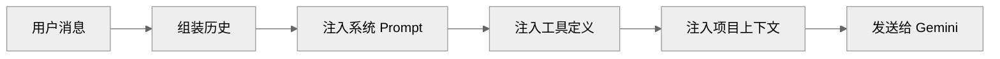

# Gemini CLI Prompt 系统：PromptProvider、工具提示与上下文组装

本文档分析 Gemini CLI 的 Prompt 生成与上下文组装机制。

## 1. Prompt 系统在 Gemini CLI 里的定位

### 1.1 基本架构

Gemini CLI 的 Prompt 系统围绕 `PromptProvider` 构建：

- 动态生成系统级 Prompt
- 组装工具描述和上下文
- 管理多轮对话的 Prompt 模板

### 1.2 与其他项目的对比

| 特性 | Claude Code | Codex | OpenCode | Gemini CLI |
| --- | --- | --- | --- | --- |
| Prompt 抽象 | PromptService | 分散 | PromptRegistry | PromptProvider |
| 工具提示 | tools.md | 内嵌 | 动态注入 | 静态模板 |
| 上下文组装 | 完整 | Thread | 完整 | 基础 |
| Few-shot | 支持 | 无 | 支持 | 无 |

---

## 2. PromptProvider

### 2.1 接口定义

```typescript
interface PromptProvider {
  // 获取核心系统 Prompt
  getCoreSystemPrompt(): string

  // 获取工具定义 Prompt
  getToolsPrompt(tools: Tool[]): string

  // 组装完整上下文
  assembleContext(request: Request): AssembledContext
}
```

### 2.2 实现结构

```typescript
class DefaultPromptProvider implements PromptProvider {
  constructor(
    private config: Config,
    private tools: ToolRegistry,
    private templates: PromptTemplates
  ) {}

  getCoreSystemPrompt(): string {
    return this.templates.get('system')
  }

  getToolsPrompt(tools: Tool[]): string {
    return tools.map(t => this.formatTool(t)).join('\n\n')
  }

  assembleContext(request: Request): AssembledContext {
    return {
      system: this.getCoreSystemPrompt(),
      tools: this.getToolsPrompt(this.tools.getEnabled()),
      history: request.history,
      userMessage: request.message
    }
  }
}
```

---

## 3. 工具提示词

### 3.1 工具描述格式

```typescript
function formatTool(tool: Tool): string {
  return `## ${tool.name}

${tool.description}

### 输入参数
${Object.entries(tool.parameters)
  .map(([name, param]) => `- \`${name}\` (${param.type}): ${param.description}`)
  .join('\n')}

### 示例
\`\`\`${tool.examples?.[0] || '// no example'}\`\`\``
}
```

### 3.2 工具分类

| 类别 | 工具 | 说明 |
| --- | --- | --- |
| 文件 | Read, Write, Edit | 文件操作 |
| 搜索 | Glob, Grep | 代码搜索 |
| 执行 | Bash | 命令执行 |
| 工具 | WebSearch | 外部查询 |

### 3.3 工具提示模板

```markdown
## 可用工具

当你需要执行操作时，使用以下格式：

<tool-call>
<tool name="tool-name">
<parameter name="param1">value1</parameter>
</tool>
</tool-call>

等待工具结果后，我会继续。
```

---

## 4. 上下文组装

### 4.1 组装流程



### 4.2 上下文对象

```typescript
interface AssembledContext {
  system: string      // 系统级 Prompt
  tools: string       // 工具定义
  history: Message[]  // 对话历史
  userMessage: string // 当前用户消息
  metadata: {
    projectPath: string
    projectType?: string
    model: string
  }
}
```

### 4.3 历史管理

```typescript
function manageHistory(
  history: Message[],
  budget: MessageBudget
): Message[] {
  // 从最新开始，保留最近的消息
  const result: Message[] = []
  let remaining = budget.remainingTokens

  for (let i = history.length - 1; i >= 0; i--) {
    const msg = history[i]
    const tokens = estimateTokens(msg)

    if (remaining >= tokens) {
      result.unshift(msg)
      remaining -= tokens
    } else {
      break
    }
  }

  return result
}
```

---

## 5. 系统级 Prompt

### 5.1 默认系统 Prompt

```markdown
你是一个有帮助的 AI 编程助手。

你的职责：
1. 理解和执行用户的编程任务
2. 使用提供的工具完成文件操作、搜索、代码修改
3. 在执行危险操作前请求确认
4. 清晰地解释你正在做什么

限制：
- 不要修改你不理解的文件
- 不要执行你没有明确授权的命令
- 如果不确定，请询问用户
```

### 5.2 项目特定 Prompt

```typescript
function buildProjectPrompt(projectInfo: ProjectInfo): string {
  const parts = [
    `当前项目：${projectInfo.name}`,
    `项目路径：${projectInfo.path}`,
    projectInfo.language ? `编程语言：${projectInfo.language}` : null,
    projectInfo.buildTool ? `构建工具：${projectInfo.buildTool}` : null,
  ].filter(Boolean)

  return parts.join('\n')
}
```

---

## 6. 与 Claude Code 的 Prompt 对比

### 6.1 主要差异

| 特性 | Claude Code | Gemini CLI |
| --- | --- | --- |
| Prompt 服务 | 完整 PromptService | PromptProvider |
| 工具格式 | XML 标签 | Markdown + JSON |
| Few-shot | 支持 | 不支持 |
| 动态注入 | 完整 | 基础 |
| 自定义模板 | 支持 | 不支持 |

### 6.2 Claude Code 的 PromptService

```typescript
// Claude Code 的 PromptService
class PromptService {
  getSystemPrompt(context: Context): string
  getToolsPrompt(tools: Tool[]): string
  getUserMessage(request: Request): string
  injectContext(context: Context): void
}
```

---

## 7. 改进建议

### 7.1 短期增强

1. **Few-shot 支持**：添加示例学习
2. **动态工具提示**：根据任务类型选择工具
3. **项目模板**：支持项目级别的 Prompt 定制

### 7.2 长期规划

| 能力 | 实现建议 |
| --- | --- |
| Prompt 缓存 | 缓存常用 Prompt 组合 |
| 模板系统 | 支持用户自定义模板 |
| 动态 Few-shot | 根据任务动态注入示例 |

---

## 8. 关键源码锚点

| 主题 | 代码锚点 | 说明 |
| --- | --- | --- |
| PromptProvider | `packages/core/src/prompts/prompt-provider.ts` | Prompt 生成 |
| 工具格式化 | `packages/core/src/prompts/tool-formatter.ts` | 工具描述 |
| 上下文组装 | `packages/core/src/prompts/context-assembler.ts` | 上下文组装 |
| 模板管理 | `packages/core/src/prompts/templates.ts` | Prompt 模板 |

---

## 9. 总结

Gemini CLI 的 Prompt 系统相比 Claude Code 较为基础：

1. **PromptProvider**：简单的 Prompt 生成器
2. **工具提示**：Markdown 格式的静态模板
3. **上下文组装**：基础的贪婪历史管理
4. **系统 Prompt**：预定义的静态模板

缺少 Claude Code 的 PromptService 抽象、动态注入、few-shot 支持。对于简单场景，当前架构足以支撑。

---

> 关联阅读：[04-tool-system.md](./04-tool-system.md) 了解工具系统详情。
