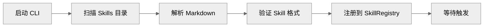

# Gemini CLI Skill 系统：Skills 加载、Markdown 定义与 Prompt 注入

本文档分析 Gemini CLI 的 Skill 扩展机制。

## 1. Skill 系统在 Gemini CLI 里的定位

### 1.1 基本架构

Gemini CLI 的 Skill 系统用于扩展 Agent 能力：

- Skill 是预定义的 Prompt 模板
- 通过 Markdown 文件定义
- 在启动时加载到上下文中

### 1.2 与其他项目的对比

| 特性 | Claude Code | Codex | OpenCode | Gemini CLI |
| --- | --- | --- | --- | --- |
| Skill 格式 | Markdown | 无 | Markdown | Markdown |
| 加载时机 | 启动/动态 | 无 | 启动时 | 启动时 |
| 作用域 | 全局/项目 | 无 | 全局 | 全局 |
| 工具注入 | 支持 | 无 | 支持 | 部分 |

---

## 2. Skill 定义格式

### 2.1 Markdown 结构

```markdown
# skill-name

## 描述
这个 Skill 做什么

## 触发条件
当用户请求涉及 xxx 时激活

## Prompt 模板
你是一个 xxx 专家...

## 可用工具
- tool1
- tool2

## 示例
用户: xxx
助手: xxx
```

### 2.2 Skill 元数据

```typescript
interface Skill {
  id: string
  name: string
  description: string
  trigger: string[]          // 触发关键词
  prompt: string             // 系统级 Prompt
  tools: string[]            // 启用的工具
  examples?: Example[]       // 示例对话
}
```

### 2.3 示例 Skill

```markdown
# git-expert

## 描述
提供 Git 操作的专业建议

## 触发条件
["git", "commit", "branch", "merge", "rebase"]

## Prompt 模板
你是一个 Git 专家，帮助用户解决 Git 相关问题。
优先使用简单的 git 命令，避免复杂操作。

## 可用工具
- Bash (仅限 git 命令)

## 示例
用户: 如何撤销最后一次提交?
助手: 使用 git revert HEAD 可以安全地撤销...
```

---

## 3. Skill 加载机制

### 3.1 加载流程



### 3.2 SkillRegistry

```typescript
interface SkillRegistry {
  register(skill: Skill): void
  get(name: string): Skill | null
  getAll(): Skill[]
  getByTrigger(text: string): Skill[]
}

class DefaultSkillRegistry implements SkillRegistry {
  private skills: Map<string, Skill> = new Map()

  async loadFromDirectory(dir: string): Promise<void> {
    const files = await glob(`${dir}/**/*.md`)
    for (const file of files) {
      const skill = await this.parseSkill(file)
      this.register(skill)
    }
  }

  getByTrigger(text: string): Skill[] {
    const lower = text.toLowerCase()
    return Array.from(this.skills.values())
      .filter(s => s.trigger.some(t => lower.includes(t)))
  }
}
```

### 3.3 加载位置

| 位置 | 说明 |
| --- | --- |
| `~/.gemini/skills/` | 全局 Skills |
| `./.gemini/skills/` | 项目级 Skills |

---

## 4. Skill 与 Prompt 注入

### 4.1 注入时机

```typescript
function assembleContext(request: Request): AssembledContext {
  const base = this.getBaseContext()

  // 检测触发的 Skills
  const triggeredSkills = this.skillRegistry.getByTrigger(request.message)

  // 注入 Skill Prompt
  const skillPrompts = triggeredSkills.map(s => s.prompt)
  const combinedSystem = [base.system, ...skillPrompts].join('\n\n')

  return {
    ...base,
    system: combinedSystem
  }
}
```

### 4.2 工具限制

```typescript
function getToolsForSkills(skills: Skill[]): Tool[] {
  const enabledToolNames = new Set<string>()
  skills.forEach(s => s.tools.forEach(t => enabledToolNames.add(t)))

  return this.toolRegistry.getAll()
    .filter(t => enabledToolNames.has(t.name))
}
```

---

## 5. 与 OpenCode 的 Skill 对比

### 5.1 OpenCode 的 Skill 系统

OpenCode 有更完整的 Skill 支持：

```typescript
// OpenCode 的 Skill 结构
interface Skill {
  id: string
  name: string
  trigger: string | RegExp
  prompt: string | PromptTemplate
  tools?: ToolDefinition[]
  examples?: Example[]
  metadata: {
    author?: string
    version?: string
    tags?: string[]
  }
}
```

### 5.2 主要差异

| 特性 | OpenCode | Gemini CLI |
| --- | --- | --- |
| 工具注入 | 完整 | 部分 |
| 正则触发 | 支持 | 仅字符串 |
| Skill 版本 | 支持 | 无 |
| Skill 市场 | 支持 | 无 |

### 5.3 OpenCode 的五层 Skill 架构

| 层 | 说明 |
| --- | --- |
| 配置层 | settings.json 中声明 |
| 注册层 | SkillRegistry 管理 |
| 触发层 | 正则/字符串匹配 |
| 加载层 | 动态加载 Markdown |
| 执行层 | 注入到 Prompt |

---

## 6. 当前限制

### 6.1 缺失的能力

| 能力 | OpenCode 有 | Gemini CLI 状态 |
| --- | --- | --- |
| 正则触发 | 支持 | 无 |
| Skill 版本 | 支持 | 无 |
| Skill 市场 | 支持 | 无 |
| 工具完整注入 | 完整 | 部分 |
| Skill 依赖 | 支持 | 无 |

### 6.2 改进建议

1. **正则触发**：支持正则表达式匹配
2. **Skill 版本**：添加版本管理
3. **工具完整注入**：完善工具参数

---

## 7. 关键源码锚点

| 主题 | 代码锚点 | 说明 |
| --- | --- | --- |
| SkillRegistry | `packages/core/src/skills/skill-registry.ts` | Skill 注册表 |
| Skill 解析 | `packages/core/src/skills/skill-parser.ts` | Markdown 解析 |
| Skill 注入 | `packages/core/src/skills/skill-injector.ts` | Prompt 注入 |
| Skill 格式 | `packages/core/src/skills/skill-schema.ts` | 类型定义 |

---

## 8. 总结

Gemini CLI 的 Skill 系统相比 OpenCode 较为基础：

1. **Skill 格式**：Markdown 定义
2. **加载**：启动时扫描目录
3. **触发**：字符串匹配
4. **注入**：简单 Prompt 拼接

缺少 OpenCode 的正则触发、版本管理、Skill 市场等机制。对于简单的 Prompt 扩展，当前架构足以支撑。

---

> 关联阅读：[06-extension-mcp.md](./06-extension-mcp.md) 了解 MCP 扩展机制。
