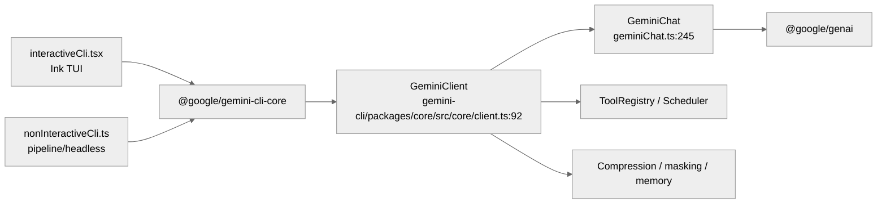

# Gemini CLI SDK 与传输层：`GeminiClient`、`GeminiChat` 与 CLI 复用层

这部分最容易被写成“Gemini CLI 直接调 `@google/genai`，没有中间层”。这种说法不完整。当前仓库里确实没有像 Codex app-server 那样的独立宿主协议，但已经形成了清晰的内部复用层。

**目录**

- [1. 真实分层](#1-真实分层)
- [2. `GeminiChat` 是模型传输的底层适配器](#2-geminichat-是模型传输的底层适配器)
- [3. `GeminiClient` 是真正的会话编排器](#3-geminiclient-是真正的会话编排器)
- [4. 交互模式和 headless 模式共用同一套核心层](#4-交互模式和-headless-模式共用同一套核心层)
- [5. 传输不只有模型 API 一条线](#5-传输不只有模型-api-一条线)
- [6. 当前边界](#6-当前边界)
- [7. 关键源码锚点](#7-关键源码锚点)
- [8. 关键函数清单](#8-关键函数清单)

---

## 1. 真实分层

当前主链路可以概括为：

`interactiveCli.tsx / nonInteractiveCli.ts` -> `@google/gemini-cli-core` -> `GeminiClient` -> `GeminiChat` -> `@google/genai`

这里的关键点有两个：

- `packages/core` 本身就是 CLI 复用层
- `GeminiClient` 和 `GeminiChat` 并不只是 SDK 的简单薄包装，它们还负责会话恢复、工具声明、压缩、循环保护、IDE 上下文注入等行为

## 2. `GeminiChat` 是模型传输的底层适配器

`gemini-cli/packages/core/src/core/geminiChat.ts` 是最贴近模型 API 的一层。

文件开头已经写明：它基于 `js-genai` 的 chat 逻辑改造过，目的是绕过 function response 校验上的一个已知问题。换句话说，它不是“直接拿 SDK 原样调用”，而是带着兼容性修补的一层适配。

这层负责：

- 持有 `systemInstruction`
- 持有 `tools`
- 持有完整对话历史
- 执行流式请求
- 处理中途重试
- 记录会话内容到 `ChatRecordingService`

如果只把 Gemini CLI 描述成“CLI + @google/genai”，会漏掉这层非常关键的状态和协议兼容逻辑。

## 3. `GeminiClient` 是真正的会话编排器

`gemini-cli/packages/core/src/core/client.ts` 中的 `GeminiClient` 负责把“模型聊天”升级成“可执行代理循环”：

- `startChat()`：基于当前工具集、system prompt 和历史启动 `GeminiChat`
- `resumeChat()`：把恢复出来的历史重新挂回会话
- `setTools()`：按模型能力重建函数声明
- `updateSystemInstruction()`：记忆变化后更新 system prompt
- `tryCompressChat()`：上下文膨胀时压缩历史

所以，如果要找 Gemini CLI 里最接近“内部 SDK 会话对象”的东西，应该看 `GeminiClient`，而不是想象中的 `gemini-client.ts`。

## 4. 交互模式和 headless 模式共用同一套核心层

### 4.1 非交互模式

`gemini-cli/packages/cli/src/nonInteractiveCli.ts` 并不是另一套独立实现。它会：

- 读取输入和恢复信息
- 初始化 `GeminiClient`
- 必要时 `resumeChat()`
- 使用同一套 `Scheduler`
- 处理 slash command 与 `@` 文件注入
- 按文本或 JSON streaming 方式输出结果

### 4.2 交互模式

`gemini-cli/packages/cli/src/interactiveCli.tsx` 则负责：

- 启动 Ink TUI
- 创建 `AppContainer`
- 复用同一个 `Config`
- 把同一套 core 能力接入 UI

因此，Gemini CLI 的“多宿主”并不是 Web / Desktop / Server 那种多端，而是“交互式 TUI 与非交互式 CLI 共享一套 core runtime”。

## 5. 传输不只有模型 API 一条线

如果只看模型调用，Gemini CLI 主要通过 `@google/genai` 工作。但仓库里其实还存在两类额外 transport：

- **MCP transport**：`stdio` / `SSE` / `Streamable HTTP`
- **A2A transport**：远程 agent 调用

不过需要区分：

- 这些 transport 属于扩展系统与远程 agent 系统
- 它们不是主模型请求的 transport 替身

也就是说，Gemini CLI 当前没有统一的“全宿主总线协议”，但也绝不是只有一条 HTTP 请求链路。

## 6. 当前边界

按当前源码，更准确的结论是：

- 有内部复用层：`packages/core`
- 有模型会话编排层：`GeminiClient`
- 有底层聊天适配层：`GeminiChat`
- 有交互与非交互两种 CLI 宿主
- 没有独立的 app-server / browser / desktop runtime

## 7. 关键源码锚点

| 主题 | 代码锚点 | 说明 |
| --- | --- | --- |
| 会话编排 | `gemini-cli/packages/core/src/core/client.ts:92` | `GeminiClient`，负责会话、工具、压缩与恢复 |
| 模型聊天适配 | `gemini-cli/packages/core/src/core/geminiChat.ts:245` | 封装流式模型调用与历史维护 |
| 非交互宿主 | `gemini-cli/packages/cli/src/nonInteractiveCli.ts:308` | headless / pipeline 执行入口 |
| 交互宿主 | `gemini-cli/packages/cli/src/interactiveCli.tsx:154` | Ink TUI 启动入口与渲染性能记录 |
| 会话恢复数据 | `gemini-cli/packages/core/src/services/chatRecordingService.ts` | 持久化与恢复 conversation JSON |

## 8. 关键函数清单

| 函数/类 | 源码锚点 | 作用 |
|---|---|---|
| `GeminiClient` | `gemini-cli/packages/core/src/core/client.ts:92` | core 层会话编排对象 |
| `GeminiClient.setTools()` | `gemini-cli/packages/core/src/core/client.ts:294` | 根据模型和 registry 重建工具声明 |
| `GeminiClient.resumeChat()` | `gemini-cli/packages/core/src/core/client.ts:323` | 用恢复历史重建 `GeminiChat` |
| `GeminiClient.updateSystemInstruction()` | `gemini-cli/packages/core/src/core/client.ts:354` | 重新生成并写入 system instruction |
| `GeminiClient.startChat()` | `gemini-cli/packages/core/src/core/client.ts:364` | 创建底层 `GeminiChat` |
| `GeminiClient.sendMessageStream()` | `gemini-cli/packages/core/src/core/client.ts:883` | Agent turn 的流式入口，衔接工具调用和上下文压缩 |
| `GeminiClient.tryCompressChat()` | `gemini-cli/packages/core/src/core/client.ts:1174` | 上下文膨胀时触发压缩 |
| `GeminiChat.sendMessageStream()` | `gemini-cli/packages/core/src/core/geminiChat.ts:304` | 调用模型流、处理 retry marker、记录历史 |
| `GeminiChat.setTools()` | `gemini-cli/packages/core/src/core/geminiChat.ts:845` | 更新底层模型会话的 function declarations |

---

## 代码质量评估

**优点**

- **`GeminiClient` 统一编排 + `GeminiChat` 专注传输**：两层职责分离，`GeminiChat` 只管 API 调用和历史维护，`GeminiClient` 负责压缩/遮罩/循环检测，各层可独立测试。
- **交互/非交互模式共用同一核心层**：CLI 和 SDK 复用同一套 `GeminiClient` + `GeminiChat`，不维护两套传输代码，降低一致性风险。
- **Model 配置即 transport 行为**：`modelConfig.getModelId()` 决定连接哪个端点，切换模型不需要修改 client 代码，方便 A/B 测试。

**风险与改进点**

## 横向对齐补强：SDK 复用 core，而不是复制 CLI

Gemini CLI 的 SDK/transport 应按 `packages/core` 为中心阅读。CLI、SDK、A2A server 都是 core 能力的不同宿主。

| 宿主 | 源码入口 | 复用方式 |
| --- | --- | --- |
| CLI | `gemini-cli/packages/cli/src` | Ink/TUI 或 non-interactive 调用 core client |
| SDK | `gemini-cli/packages/sdk/src/session.ts` | 包装 `GeminiClient.sendMessageStream()` 并处理工具结果 |
| A2A server | `gemini-cli/packages/a2a-server/src` | 把 core client 和 Scheduler 暴露为远程任务接口 |
| Core client | `gemini-cli/packages/core/src/core/client.ts` | 统一模型流、tool call、loop detection 基础能力 |

这使 Gemini CLI 的横向定位介于 Codex 和 OpenCode 之间：它不像 Codex 那样由 Rust runtime 统摄，也不像 OpenCode 那样 server-first，而是 TypeScript core-first。

- **`GeminiChat` 对话历史无分页加载**：所有历史存在内存中，长会话下内存占用随会话长度线性增长，无 lazy load 机制。
- **传输层无背压机制**：SSE 流式响应时若 UI 消费慢，没有流量控制来避免大量 chunk 在内存中积压。
- **SDK 分发依赖 `@google/genai`**：直接依赖 Google 的 SDK，版本升级时可能带来不兼容变更，且无法在 API 层做 mock 测试而不修改源码。

## 源码锚点补强：Transport 是 TypeScript core-first

| 源码位置 | 说明 | 横向意义 |
| --- | --- | --- |
| `gemini-cli/packages/core/src/core/client.ts:92` | `GeminiClient` 统一 core 能力 | 对应 Codex Rust core |
| `gemini-cli/packages/core/src/core/geminiChat.ts:245` | `GeminiChat` 模型聊天适配层 | 最贴近 Google SDK |
| `gemini-cli/packages/core/src/core/geminiChat.ts:304` | `sendMessageStream()` 底层模型流 | 对应 Codex/OpenCode streaming |
| `gemini-cli/packages/cli/src/nonInteractiveCli.ts:308` | 非交互宿主入口 | 对应 Codex `exec` |
| `gemini-cli/packages/cli/src/interactiveCli.tsx:154` | Ink/TUI 宿主入口 | 对应 Claude/Codex TUI |
| `gemini-cli/packages/core/src/services/chatRecordingService.ts:249` | conversation 持久化服务 | 连接 resume/transport 状态 |
