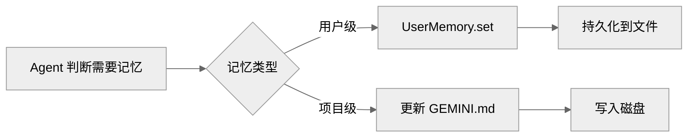
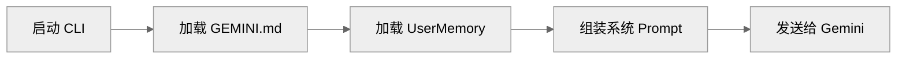

# Gemini CLI Memory 系统：UserMemory、项目上下文与 GEMINI.md

本文档分析 Gemini CLI 的 Memory 持久化机制。

## 1. Memory 在 Gemini CLI 里的定位

### 1.1 基本架构

Gemini CLI 的 Memory 系统包含两层：

1. **UserMemory**：用户级持久化记忆
2. **GEMINI.md**：项目级上下文定义

### 1.2 与其他项目的对比

| 特性 | Claude Code | Codex | OpenCode | Gemini CLI |
| --- | --- | --- | --- | --- |
| 持久记忆 | 支持 | 有限 | 完整 | 基础 |
| 项目上下文 | CLAUDE.md | 无 | ProjectMemory | GEMINI.md |
| 全局记忆 | 支持 | 无 | 支持 | 无 |
| 自动摘要 | 支持 | 无 | 支持 | 无 |

---

## 2. UserMemory

### 2.1 架构

```typescript
interface UserMemory {
  // 读取记忆
  get(key: string): Promise<string | null>

  // 写入记忆
  set(key: string, value: string): Promise<void>

  // 删除记忆
  delete(key: string): Promise<void>

  // 搜索记忆
  search(query: string): Promise<MemoryEntry[]>

  // 列出所有记忆
  list(): Promise<MemoryEntry[]>
}

interface MemoryEntry {
  key: string
  value: string
  createdAt: Date
  updatedAt: Date
  tags?: string[]
}
```

### 2.2 存储后端

```typescript
class JsonFileMemory implements UserMemory {
  constructor(private filePath: string) {}

  async get(key: string): Promise<string | null> {
    const memories = await this.load()
    return memories[key]?.value || null
  }

  async set(key: string, value: string): Promise<void> {
    const memories = await this.load()
    memories[key] = {
      value,
      createdAt: memories[key]?.createdAt || new Date(),
      updatedAt: new Date()
    }
    await this.save(memories)
  }

  private async load(): Promise<Record<string, MemoryEntry>> {
    if (!await fs.pathExists(this.filePath)) {
      return {}
    }
    const content = await fs.readFile(this.filePath, 'utf-8')
    return JSON.parse(content)
  }
}
```

### 2.3 存储位置

| 位置 | 说明 |
| --- | --- |
| `~/.gemini/memory.json` | 用户级记忆 |

---

## 3. GEMINI.md

### 3.1 文件格式

```markdown
# GEMINI.md

## 项目描述
这是一个用于...

## 关键文件
- `src/` - 源代码
- `tests/` - 测试
- `docs/` - 文档

## 构建指令
```bash
npm install
npm run build
```

## 约定
- 使用 TypeScript
- 遵循 ESLint 规则

## 注意事项
- 不要修改 `vendor/` 目录
- 生产环境使用 `npm run start`
```

### 3.2 加载时机

```typescript
async function loadProjectContext(
  projectPath: string
): Promise<string | null> {
  const geminiMdPath = path.join(projectPath, 'GEMINI.md')

  if (!await fs.pathExists(geminiMdPath)) {
    return null
  }

  return await fs.readFile(geminiMdPath, 'utf-8')
}
```

### 3.3 注入到 Prompt

```typescript
function assembleContext(request: Request): AssembledContext {
  const base = this.getBaseContext()

  // 加载项目上下文
  const projectContext = await loadProjectContext(request.projectPath)

  return {
    ...base,
    system: [
      base.system,
      projectContext ? `\n\n## 项目上下文\n${projectContext}` : ''
    ].join('\n')
  }
}
```

---

## 4. 与 Claude Code 的 Memory 对比

### 4.1 Claude Code 的 Memory 分层

Claude Code 有更完整的 Memory 系统：

```typescript
// Claude Code 的 Memory 分层
interface MemorySystem {
  // 工作记忆（短期）
  workingMemory: WorkingMemory

  // 项目记忆（中期）
  projectMemory: ProjectMemory

  // 持久记忆（长期）
  persistentMemory: PersistentMemory

  // 语义记忆
  semanticMemory: SemanticMemory
}
```

### 4.2 主要差异

| 特性 | Claude Code | Gemini CLI |
| --- | --- | --- |
| 分层 | 完整 | 简单 |
| 自动摘要 | 支持 | 无 |
| 语义搜索 | 支持 | 无 |
| 全局记忆 | 支持 | 无 |
| 项目记忆 | CLAUDE.md | GEMINI.md |

### 4.3 CLAUDE.md vs GEMINI.md

| 特性 | CLAUDE.md | GEMINI.md |
| --- | --- | --- |
| 位置 | 项目根目录 | 项目根目录 |
| 用途 | Agent 上下文 | 项目文档 |
| 自动加载 | 是 | 是 |
| 动态更新 | 支持 | 不支持 |

---

## 5. Memory 使用流程

### 5.1 写入流程



### 5.2 读取流程



### 5.3 搜索流程

```typescript
async function searchMemory(
  query: string
): Promise<MemoryEntry[]> {
  const memories = await this.memory.list()
  const queryLower = query.toLowerCase()

  return memories.filter(m =>
    m.key.toLowerCase().includes(queryLower) ||
    m.value.toLowerCase().includes(queryLower)
  )
}
```

---

## 6. 当前限制

### 6.1 缺失的能力

| 能力 | Claude Code 有 | Gemini CLI 状态 |
| --- | --- | --- |
| 自动摘要 | 支持 | 无 |
| 语义搜索 | 支持 | 无 |
| 全局记忆 | 支持 | 无 |
| 动态更新 | 支持 | 无 |
| 记忆分层 | 完整 | 简单 |

### 6.2 改进建议

1. **自动摘要**：当记忆接近阈值时自动摘要
2. **语义搜索**：使用嵌入向量搜索
3. **全局记忆**：支持跨项目记忆

---

## 7. 关键源码锚点

| 主题 | 代码锚点 | 说明 |
| --- | --- | --- |
| UserMemory | `packages/core/src/memory/user-memory.ts` | 用户记忆 |
| GEMINI.md | `packages/core/src/memory/project-context.ts` | 项目上下文 |
| Memory 存储 | `packages/core/src/memory/json-memory.ts` | JSON 存储 |
| 上下文组装 | `packages/core/src/prompts/context-assembler.ts` | 上下文组装 |

---

## 8. 总结

Gemini CLI 的 Memory 系统相比 Claude Code 较为基础：

1. **UserMemory**：简单的 JSON 文件存储
2. **GEMINI.md**：静态项目文档
3. **无自动摘要**：需要手动管理
4. **无语义搜索**：仅支持字符串匹配

缺少 Claude Code 的自动摘要、语义搜索、全局记忆和动态更新等机制。对于简单的项目上下文，当前架构足以支撑。

---

> 关联阅读：[12-prompt-system.md](./12-prompt-system.md) 了解 Prompt 组装详情。
