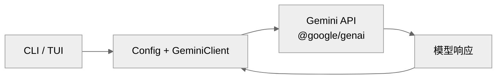
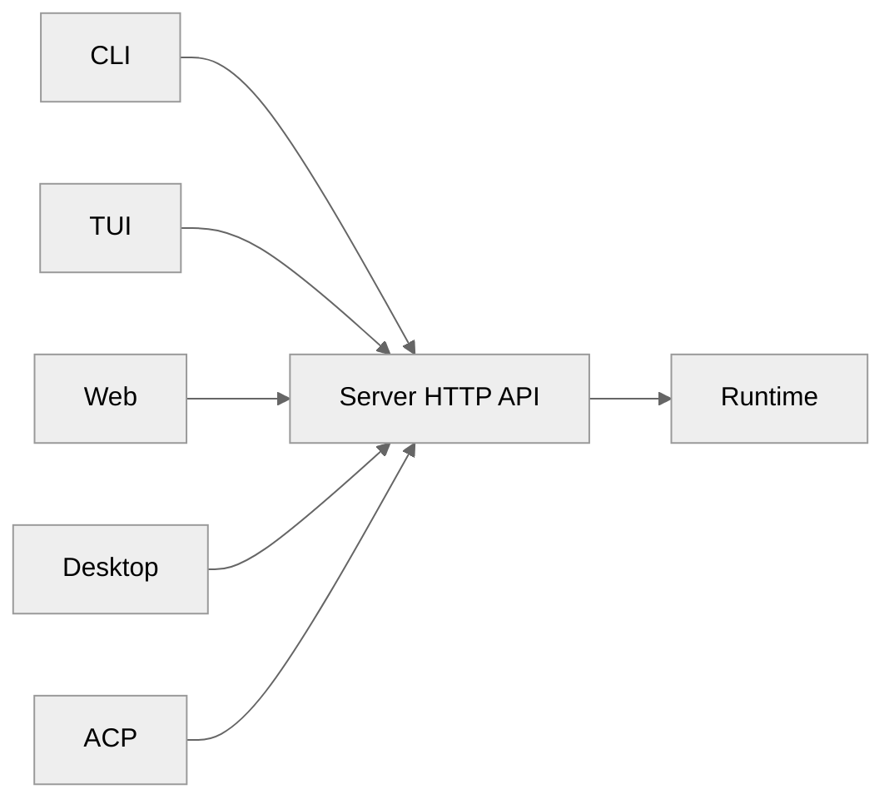

# Gemini CLI SDK 与传输层：GeminiClient、@google/genai 与 Headless 模式

本文档分析 Gemini CLI 的 SDK 架构与传输层实现。

## 1. SDK 与传输层在 Gemini CLI 里的定位

### 1.1 基本架构

Gemini CLI 采用相对简单的客户端-服务端架构：



### 1.2 与其他项目的对比

| 特性 | Claude Code | Codex | OpenCode | Gemini CLI |
| --- | --- | --- | --- | --- |
| 多宿主 | CLI/SDK/Bridge | CLI/SDK/app-server | CLI/TUI/Web/Desktop | CLI |
| 传输协议 | WebSocket/SSE/Hybrid | WebSocket/HTTPS | HTTP/SSE | HTTPS |
| SDK 抽象 | QueryEngine | TypeScript SDK | HTTP API | @google/genai |
| 远程模式 | Bridge System | app-server | Web/Desktop | 无 |

---

## 2. GeminiClient

### 2.1 接口定义

`packages/core/src/core/gemini-client.ts`：

```typescript
class GeminiClient {
  private config: Config
  private model: string

  async sendMessage(
    prompt: string,
    options?: SendMessageOptions
  ): Promise<GenerateContentResult>

  async sendMessageStream(
    prompt: string,
    options?: SendMessageOptions
  ): Promise<AsyncIterable<GenerateContentResponse>>
}

interface SendMessageOptions {
  temperature?: number
  maxTokens?: number
  topP?: number
  topK?: number
}
```

### 2.2 配置管理

```typescript
interface GeminiCLIConfig {
  apiKey: string
  model: string
  baseUrl?: string
  temperature?: number
  maxTokens?: number
  timeout?: number
}
```

---

## 3. @google/genai SDK

### 3.1 初始化

```typescript
import { GoogleGenAI } from '@google/genai'

const ai = new GoogleGenAI({ apiKey: 'YOUR_API_KEY' })
```

### 3.2 非流式调用

```typescript
const response = await ai.models.generateContent({
  model: 'gemini-2.0-flash',
  contents: [{ role: 'user', parts: [{ text: prompt }] }],
  config: {
    temperature: 0.7,
    maxOutputTokens: 1000
  }
})
```

### 3.3 流式调用

```typescript
async *sendMessageStream(
  prompt: string
): AsyncIterable<GenerateContentStreamResponse> {
  const result = await this.client.models.generateContentStream({
    model: this.model,
    contents: [{ role: 'user', parts: [{ text: prompt }] }]
  })

  for await (const chunk of result) {
    yield chunk
  }
}
```

---

## 4. Headless 模式

### 4.1 Headless CLI

`packages/cli/src/non-interactive-cli.ts`：

```typescript
async function runNonInteractive(
  prompt: string,
  options: NonInteractiveOptions
): Promise<string> {
  const config = await initializeApp(options)
  const client = new GeminiClient(config)

  const response = await client.sendMessage(prompt, {
    mode: 'non-interactive'
  })

  return response.text
}
```

### 4.2 使用场景

| 场景 | 使用方式 |
| --- | --- |
| CI/CD | `gemini --non-interactive --prompt "..."` |
| 脚本自动化 | 通过 stdout 获取结果 |
| 管道集成 | 与其他工具组合使用 |

---

## 5. 与 Claude Code 的 QueryEngine 对比

### 5.1 Claude Code 的 QueryEngine

Claude Code 的 `QueryEngine` 是更复杂的抽象：

```typescript
class QueryEngine {
  query(request: QueryRequest): Promise<QueryResponse>
  queryStream(request: QueryRequest): AsyncIterable<QueryEvent>
  resume(sessionId: string): Promise<void>
  getState(): AppState
}
```

### 5.2 主要差异

| 特性 | Claude Code QueryEngine | Gemini CLI GeminiClient |
| --- | --- | --- |
| Session 管理 | 完整 | 无 |
| Resume | 支持 | 不支持 |
| Context 管理 | 完整 | 基础 |
| 流式支持 | HybridTransport | @google/genai 内置 |
| Hook | 支持 | 不支持 |

---

## 6. 传输层对比

### 6.1 各项目传输方式

| 项目 | 宿主传输 | 模型传输 |
| --- | --- | --- |
| Claude Code | WebSocket/SSE/HybridTransport | HTTP + SSE |
| Codex | stdio / WebSocket | Responses WebSocket / HTTPS SSE |
| OpenCode | HTTP / WebSocket | HTTP / SSE |
| Gemini CLI | - | HTTPS / HTTP |

### 6.2 Gemini CLI 的传输特点

- **宿主传输**：相对简单，主要本地执行
- **模型传输**：使用 @google/genai SDK 封装

---

## 7. 多端复用

### 7.1 当前状态

Gemini CLI **不支持真正的多端复用**：

- CLI 是唯一宿主
- 无远程会话
- 无 Bridge System
- 无 SDK 抽象层

### 7.2 与 OpenCode 的对比

OpenCode 支持完整的多宿主：



Gemini CLI 更接近单宿主架构。

---

## 8. 改进建议

### 8.1 缺失能力

| 能力 | Claude Code | Codex | OpenCode | Gemini CLI |
| --- | --- | --- | --- | --- |
| 多宿主 | CLI/SDK/Bridge | CLI/SDK/app-server | CLI/TUI/Web/Desktop | CLI |
| 远程会话 | Bridge System | app-server | Web/Desktop | 无 |
| Session 持久化 | 完整 | 完整 | SQLite | 基础 JSON |
| SDK 抽象 | QueryEngine | TypeScript SDK | HTTP API | @google/genai |
| 混合传输 | HybridTransport | WebSocket | HTTP/SSE | HTTPS |

### 8.2 改进建议

1. **增强 Headless SDK**：提供更完整的 SDK 抽象
2. **Session 持久化**：实现完整的 Session 管理和 Resume
3. **远程模式**：支持远程会话和桥接
4. **多端复用**：参考 OpenCode 的 Server 架构

---

## 9. 关键源码锚点

| 主题 | 代码锚点 | 说明 |
| --- | --- | --- |
| GeminiClient | `packages/core/src/core/gemini-client.ts` | 核心客户端 |
| Headless | `packages/cli/src/non-interactive-cli.ts` | 非交互执行 |
| Config | `packages/cli/src/config/config.ts` | 配置管理 |
| API 调用 | `packages/core/src/core/gemini-chat.ts` | 聊天实现 |

---

## 10. 总结

Gemini CLI 的 SDK 和传输层采用相对简洁的方案：

1. **GeminiClient**：基于 @google/genai SDK 的简单封装
2. **Headless CLI**：支持非交互式远程执行
3. **配置管理**：通过 Config 类统一管理
4. **传输**：主要依赖 @google/genai SDK 的内置传输

相比 Claude Code 的 QueryEngine、OpenCode 的多宿主 HTTP Server，Gemini CLI 的方案更简洁但功能有限。对于需要 SDK 抽象、多端复用和远程会话的场景，当前架构可能需要进一步增强。

---

> 关联阅读：[03-agent-loop.md](./03-agent-loop.md) 了解 GeminiClient 如何驱动 Agent 循环。
