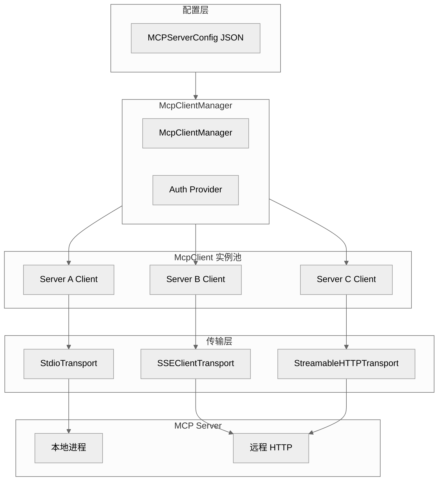
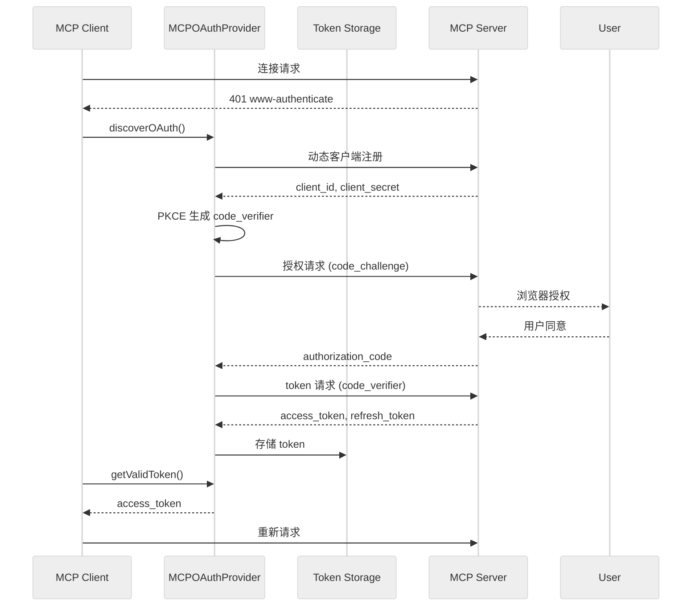
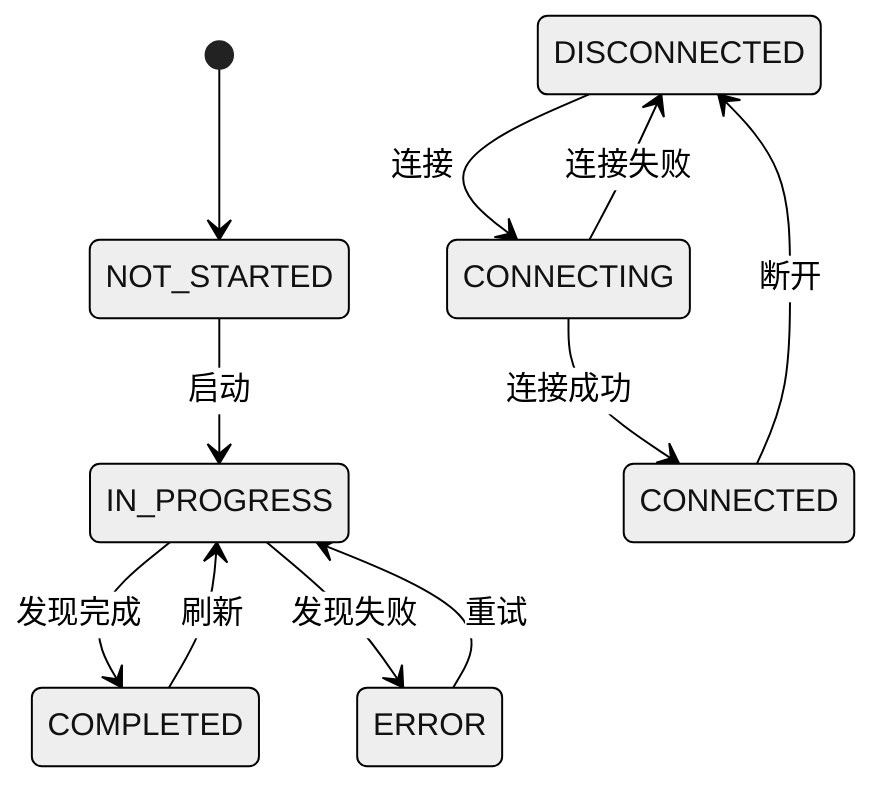

# Gemini CLI 的 MCP 系统

本篇讨论 MCP 客户端、传输层、认证体系、工具/提示词发现，以及与 Gemini CLI 工具总线的集成。


**目录**

- [1. MCP 系统概述](#1-mcp-系统概述)
- [2. 核心组件](#2-核心组件)
- [3. 传输层实现](#3-传输层实现)
- [4. 认证体系](#4-认证体系)
- [5. 工具发现与注册](#5-工具发现与注册)
- [6. 提示词发现](#6-提示词发现)
- [7. 动态更新处理](#7-动态更新处理)
- [8. 配置格式](#8-配置格式)
- [9. MCP 状态机](#9-mcp-状态机)
- [10. 与 Claude Code 的差异](#10-与-claude-code-的差异)
- [11. 关键源码锚点](#11-关键源码锚点)

---

## 1. MCP 系统概述



## 2. 核心组件

### 2.1 组件拓扑

| 组件 | 路径 | 职责 |
|------|------|------|
| McpClientManager | `packages/core/src/tools/mcp-client-manager.ts` | 客户端生命周期管理 |
| McpClient | `packages/core/src/tools/mcp-client.ts` | 单个 MCP 服务器连接 |
| Auth Provider | `packages/core/src/mcp/auth-provider.ts` | 认证抽象接口 |
| MCPOAuthProvider | `packages/core/src/mcp/oauth-provider.ts` | OAuth 2.0 实现 |
| Google Auth Provider | `packages/core/src/mcp/google-auth-provider.ts` | Google 凭据 |
| SA Impersonation Provider | `packages/core/src/mcp/sa-impersonation-provider.ts` | 服务账号模拟 |
| Token Storage | `packages/core/src/mcp/oauth-token-storage.ts` | Token 持久化 |

## 3. 传输层实现

### 3.1 传输类型选择

```typescript
// packages/core/src/tools/mcp-client.ts

function createTransport(config: MCPServerConfig): Transport {
  // 1. 有 command → StdioTransport (本地进程)
  if (config.command) {
    return new StdioClientTransport({
      command: config.command,
      args: config.args || [],
      env: finalEnv,
      cwd: config.cwd,
      stderr: 'pipe',
    });
  }

  // 2. 有 httpUrl + type:'sse' → SSEClientTransport
  if (config.url && config.type === 'sse') {
    return new SSEClientTransport(new URL(config.url), {
      requestInit: { headers: { Authorization: `Bearer ${token}` } },
    });
  }

  // 3. 有 url + type:'http' → StreamableHTTPClientTransport
  if (config.url && config.type === 'http') {
    return new StreamableHTTPClientTransport(new URL(config.url), {
      requestInit: { headers },
      authProvider,
    });
  }

  // 4. 默认: StreamableHTTP，失败时回退 SSE
  return new StreamableHTTPClientTransport(new URL(config.url), ...);
}
```

### 3.2 StdioTransport 流程

```mermaid
---
config:
  theme: neutral
---
flowchart TB
    A[spawn(command, args)] --> B[子进程 stdin/stdout]
    B --> C[send message]
    C --> D[JSON.stringify]
    D --> E[stdin.write]
    E --> F[stdout.on data]
    F --> G[messageBuffer]
    G --> H[handleMessage]
    H --> I[JSON.parse]
    I --> J[通知处理器]
```

## 4. 认证体系

### 4.1 认证类型

```typescript
// packages/core/src/mcp/auth-provider.ts

enum AuthProviderType {
  GOOGLE_CREDENTIALS,           // Google 应用默认凭据
  SERVICE_ACCOUNT_IMPERSONATION, // SA 模拟
  OAUTH,                        // OAuth 2.0 PKCE
}

interface AuthProvider {
  getAuthHeader(serverName: string): Promise<string | null>;
  refreshTokenIfNeeded(serverName: string): Promise<void>;
}
```

### 4.2 OAuth 流程



## 5. 工具发现与注册

### 5.1 工具发现流程

```mermaid
---
config:
  theme: neutral
---
flowchart LR
    A[listTools()] --> B[McpTool[]]
    B --> C{过滤}
    C -->|已启用| D[McpCallableTool]
    C -->|已禁用| E[跳过]
    D --> F[DiscoveredMCPTool]
    F --> G[ToolRegistry]
    G --> H[Agent 工具集]
```

### 5.2 工具调用

```typescript
// packages/core/src/tools/mcp-client.ts

class McpCallableTool implements CallableTool {
  async callTool(functionCalls: FunctionCall[]): Promise<Part[]> {
    const results = [];

    for (const call of functionCalls) {
      const result = await this.client.callTool({
        name: call.name,
        arguments: call.args,
        _meta: { progressToken },  // 进度通知支持
      }, undefined, { timeout });

      results.push({
        functionResponse: {
          name: call.name,
          response: result,
        },
      });
    }

    return results;
  }
}
```

## 6. 提示词发现

### 6.1 MCP Prompts 作为 Slash 命令

```mermaid
---
config:
  theme: neutral
---
flowchart TB
    A[MCP listPrompts()] --> B[MCPPrompt[]]
    B --> C[McpPromptLoader]
    C --> D[SlashCommand]
    D --> E[CommandService]
    E --> F[用户 /promptName]
    F --> G[prompt.invoke()]
    G --> H[MCP getPrompt]
    H --> I[返回消息]
    I --> J[提交给模型]
```

## 7. 动态更新处理

### 7.1 List-Changed 通知

```typescript
// packages/core/src/tools/mcp-client.ts

private registerNotificationHandlers(): void {
  // 工具列表变更
  this.client.setNotificationHandler(
    ToolListChangedNotificationSchema,
    async () => {
      await this.refreshTools();
    }
  );

  // 资源列表变更
  this.client.setNotificationHandler(
    ResourceListChangedNotificationSchema,
    async () => {
      await this.refreshResources();
    }
  );

  // 提示词列表变更
  this.client.setNotificationHandler(
    PromptListChangedNotificationSchema,
    async () => {
      await this.refreshPrompts();
    }
  );
}

// Coalescing Pattern: 合并突发刷新请求
private async refreshTools(): Promise<void> {
  if (this.isRefreshingTools) {
    this.pendingToolRefresh = true;  // 标记等待下一次刷新
    return;
  }

  do {
    this.isRefreshingTools = true;
    this.pendingToolRefresh = false;
    // ... 执行刷新
  } while (this.pendingToolRefresh);
}
```

## 8. 配置格式

### 8.1 MCPServerConfig

```typescript
// packages/core/src/tools/types.ts

interface MCPServerConfig {
  name: string;
  command?: string;           // StdioTransport
  args?: string[];
  env?: Record<string, string>;
  cwd?: string;
  url?: string;              // HTTP/SSE/StreamableHTTP
  type?: 'http' | 'sse';     // 传输类型
  auth?: {
    type: 'google_credentials'
       | 'service_account_impersonation'
       | 'oauth';
    // ... 类型相关配置
  };
}
```

### 8.2 配置来源

```mermaid
---
config:
  theme: neutral
---
flowchart LR
    A[~/.gemini/mcp.json] --> B[MCPServerConfig[]]
    C[项目 .gemini/mcp.json] --> B
    B --> D[McpClientManager]
```

## 9. MCP 状态机



## 10. 与 Claude Code 的差异

| 特性 | Claude Code | Gemini CLI |
|------|-------------|------------|
| 传输类型 | Stdio, SSE, HTTP, WebSocket, in-process | Stdio, SSE, StreamableHTTP |
| 认证 | XAA, OAuth, Bearer Token | Google Credentials, SA 模拟, OAuth PKCE |
| 工具发现 | `loadMcpTools()` | `discoverTools()` |
| 进度通知 | `progressToken` | `_meta.progressToken` |
| 动态更新 | `ToolListChangedNotification` | 同上 + Coalescing Pattern |

## 11. 关键源码锚点

| 主题 | 代码锚点 | 说明 |
|------|----------|------|
| 客户端管理 | `packages/core/src/tools/mcp-client-manager.ts` | 生命周期管理 |
| 客户端实现 | `packages/core/src/tools/mcp-client.ts` | 单服务器连接 |
| OAuth | `packages/core/src/mcp/oauth-provider.ts` | OAuth 2.0 实现 |
| Google 认证 | `packages/core/src/mcp/google-auth-provider.ts` | 应用默认凭据 |
| Token 存储 | `packages/core/src/mcp/oauth-token-storage.ts` | 安全存储 |
| 提示词加载 | `packages/cli/src/services/McpPromptLoader.ts` | MCP → Slash 命令 |
| 工具包装 | `packages/core/src/agents/browser/mcpToolWrapper.ts` | 工具适配 |

---

*文档版本: 1.0*
*分析日期: 2026-04-06*

---

## 代码质量评估

**优点**

- **5 状态机清晰**：`connected/disabled/failed/needs_auth/needs_client_registration` 状态转移有完整定义，auth flow 与连接 flow 解耦，错误处理分支明确。
- **MCP prompt 与 slash command 统一**：MCP server 的 prompt 模板被自动投影为 slash command，用户无需区分"MCP prompt"和"内建命令"。
- **动态工具更新支持热刷新**：`ToolsChanged` 事件驱动 tool list 刷新，MCP server 添加新工具无需重启 Gemini CLI。

**风险与改进点**

- **MCP server 连接无全局超时**：`McpClientManager` 等待 stdio server 握手时无超时上限，MCP server 启动慢会阻塞整个 CLI 初始化。
- **认证令牌存储在进程内存**：OAuth2 令牌由 `mcp/auth.ts` 管理，进程重启后需要重新认证，无持久化 token 缓存机制。
- **工具名称 sanitize 后无冲突检测**：多个 MCP server 产生同名工具时，后注册的会静默覆盖前者，无冲突日志或报警。
