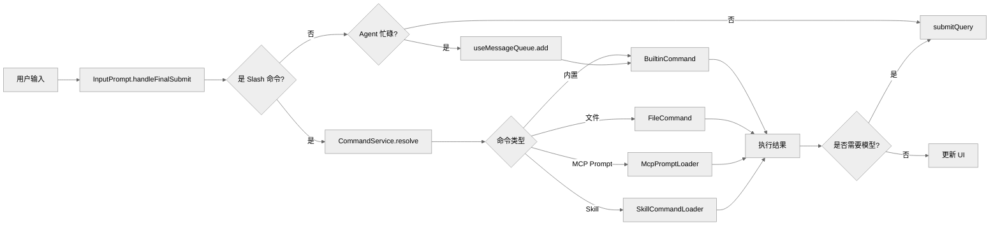
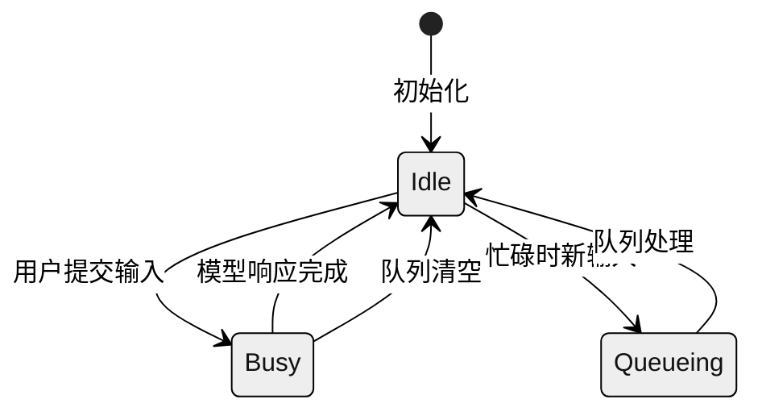

# 用户输入、Slash 命令与队列分发

本篇梳理 Gemini CLI 中用户提交输入后，系统如何完成输入分类、命令匹配和队列调度的完整流程。


**目录**

- [1. 整体架构](#1-整体架构)
- [2. 输入流程图](#2-输入流程图)
- [3. 命令服务 (CommandService)](#3-命令服务-commandservice)
- [4. Slash 命令执行](#4-slash-命令执行)
- [5. 消息队列机制](#5-消息队列机制)
- [6. Shell 状态管理](#6-shell-状态管理)
- [7. 关键源码锚点](#7-关键源码锚点)
- [8. 与 Claude Code 的差异](#8-与-claude-code-的差异)
- [9. 总结](#9-总结)

---

## 1. 整体架构

Gemini CLI 的输入处理涉及以下核心模块：

| 模块 | 路径 | 职责 |
|------|------|------|
| 交互式 CLI | `packages/cli/src/interactiveCli.tsx` | 输入总入口 |
| 命令服务 | `packages/cli/src/services/CommandService.ts` | 命令加载与匹配 |
| Slash 命令处理器 | `packages/cli/src/ui/hooks/slashCommandProcessor.ts` | slash 命令执行 |
| Shell 命令处理器 | `packages/cli/src/ui/hooks/shellCommandProcessor.ts` | bash/本地命令 |
| 消息队列 | `packages/cli/src/ui/hooks/useMessageQueue.ts` | 忙碌时输入排队 |
| Shell 状态机 | `packages/cli/src/ui/hooks/shellReducer.ts` | UI 状态管理 |
| 命令类型定义 | `packages/cli/src/ui/commands/types.ts` | 数据结构 |

## 2. 输入流程图



## 3. 命令服务 (CommandService)

### 3.1 命令加载器体系

```mermaid
---
config:
  theme: neutral
---
flowchart TB
    A[CommandService.create]
    A --> B[并行加载所有命令]
    B --> C[BuiltinCommandLoader]
    B --> D[FileCommandLoader]
    B --> E[McpPromptLoader]
    B --> F[SkillCommandLoader]
    C -.-> G1[内置命令: /help, /clear, /model, /exit]
    D -.-> G2[Toml 文件: ~/.gemini/commands/*.toml]
    E -.-> G3[MCP Prompts: listPrompts()]
    F -.-> G4[Skills: 技能系统]
    G1 --> H[SlashCommandResolver.resolve]
    G2 --> H
    G3 --> H
    G4 --> H
    H --> I[CommandService]
    I --> J{冲突检测}
    J -->|有冲突| K[标记冲突命令]
    J -->|无冲突| L[返回冻结命令集]
```

### 3.2 命令类型

```typescript
// packages/cli/src/ui/commands/types.ts

interface SlashCommand {
  name: string;
  altNames?: string[];        // 命令别名
  description: string;
  kind: CommandKind;           // BUILT_IN | USER_FILE | MCP_PROMPT | SKILL | AGENT
  action?: (context: CommandContext, args: string) => SlashCommandActionReturn;
  subCommands?: SlashCommand[]; // 子命令支持
  isSafeConcurrent?: boolean;  // agent 忙碌时是否可执行
}

type SlashCommandActionReturn =
  | { type: 'message', content: string }           // 本地消息
  | { type: 'dialog', dialog: DialogKind }         // 弹窗
  | { type: 'tool', toolName: string, toolArgs: Record<string, unknown> } // 工具调用
  | { type: 'load_history', cursor: string }       // 加载历史
  | { type: 'submit_prompt', content: string }      // 转 prompt 给模型
  | { type: 'quit', messages: Message[] }          // 退出
```

## 4. Slash 命令执行

### 4.1 命令解析流程

```typescript
// packages/cli/src/ui/hooks/slashCommandProcessor.ts

async function handleSlashCommand(input: string, context: CommandContext) {
  // 1. 解析命令名和参数
  const { commandName, args } = parseSlashCommand(input);

  // 2. 查找匹配命令
  const command = await commandService.resolve(commandName);

  // 3. 执行命令 action
  const result = await command.action(context, args);

  // 4. 根据结果类型处理
  switch (result.type) {
    case 'submit_prompt':
      return submitToAgent(result.content);
    case 'message':
      return showLocalMessage(result.content);
    case 'dialog':
      return openDialog(result.dialog);
    // ...
  }
}
```

### 4.2 MCP Prompt 命令

MCP 服务器提供的 prompts 可以作为 slash 命令调用：

```typescript
// packages/cli/src/services/McpPromptLoader.ts

export class McpPromptLoader implements ICommandLoader {
  async loadCommands(signal: AbortSignal): Promise<SlashCommand[]> {
    const prompts = await this.mcpClientManager.getAllPrompts();

    return prompts.map(prompt => ({
      name: prompt.name,
      description: prompt.description || `MCP prompt from ${prompt.serverName}`,
      kind: CommandKind.MCP_PROMPT,
      action: async (context, args) => {
        // 调用 MCP prompt
        const result = await prompt.invoke(parseArgs(args));

        if (result.messages) {
          // 转换为 prompt 提交给模型
          return { type: 'submit_prompt', content: result.messages };
        }

        return { type: 'message', content: 'Prompt executed' };
      },
    }));
  }
}
```

## 5. 消息队列机制

### 5.1 状态机



### 5.2 队列实现

```typescript
// packages/cli/src/ui/hooks/useMessageQueue.ts

interface MessageQueueState {
  messageQueue: string[];  // 待发送消息队列
  isQueueProcessing: boolean;
}

// 核心流程：当 agent 忙碌时，输入被加入队列
function addMessage(message: string) {
  setMessageQueue(prev => [...prev, message.trim()]);
}

// 当 streamingState 变为 Idle 且 MCP 就绪时，自动发送队列消息
useEffect(() => {
  if (streamingState === StreamingState.Idle &&
      isMcpReady &&
      messageQueue.length > 0) {
    const combinedMessage = messageQueue.join('\n\n');
    clearQueue();
    submitQuery(combinedMessage);
  }
}, [streamingState, isMcpReady, messageQueue]);
```

## 6. Shell 状态管理

```typescript
// packages/cli/src/ui/hooks/shellReducer.ts

type StreamingState =
  | { status: 'idle' }
  | { status: 'streaming' }
  | { status: 'done' }
  | { status: 'error'; error: string };

interface ShellState {
  streamingState: StreamingState;
  messages: Message[];
  isMcpReady: boolean;
  activeTools: string[];
}

// 状态转换
function shellReducer(state: ShellState, action: ShellAction): ShellState {
  switch (action.type) {
    case 'SUBMIT':
      return {
        ...state,
        streamingState: { status: 'streaming' },
        messages: [...state.messages, action.message],
      };
    case 'TOOL_CALL':
      return {
        ...state,
        activeTools: [...state.activeTools, action.toolName],
      };
    case 'TOOL_RESULT':
      return {
        ...state,
        activeTools: state.activeTools.filter(t => t !== action.toolName),
        messages: [...state.messages, action.result],
      };
    // ...
  }
}
```

## 7. 关键源码锚点

| 主题 | 代码锚点 | 说明 |
|------|----------|------|
| CLI 入口 | `packages/cli/src/interactiveCli.tsx` | 交互式 CLI 入口 |
| 命令服务 | `packages/cli/src/services/CommandService.ts:45-90` | 命令加载与匹配 |
| 命令类型 | `packages/cli/src/ui/commands/types.ts` | 数据结构定义 |
| Slash 处理器 | `packages/cli/src/ui/hooks/slashCommandProcessor.ts` | slash 命令执行 |
| Shell 状态 | `packages/cli/src/ui/hooks/shellReducer.ts` | 状态机管理 |
| 消息队列 | `packages/cli/src/ui/hooks/useMessageQueue.ts` | 队列管理 |

## 8. 与 Claude Code 的差异

| 特性 | Claude Code | Gemini CLI |
|------|-------------|------------|
| 队列实现 | `messageQueueManager.ts` + `queueProcessor.ts` | `useMessageQueue.ts` (React hook) |
| 命令来源 | 内置 + 文件 + MCP + 技能 | 内置 + Toml 文件 + MCP Prompt + 技能 |
| 并发控制 | `QueryGuard` 同步闸门 | `StreamingState` 状态机 |
| 忙碌策略 | 排队 + 打断 + 提示 | 直接队列 + 自动发送 |

## 9. 总结

Gemini CLI 的输入层特点：

1. **命令服务统一入口**：通过 `CommandService` 并行加载多种命令来源
2. **React 风格状态管理**：使用 hook 管理队列和状态
3. **MCP Prompt 集成**：MCP prompts 无缝作为 slash 命令暴露
4. **自动队列处理**：忙碌时自动排队，空闲时自动发送

---

*文档版本: 1.0*
*分析日期: 2026-04-06*

---

## 代码质量评估

**优点**

- **CommandService 将命令路由与执行分离**：slash command 路由逻辑集中在 `CommandService`，不散落在 UI 组件内，新增命令只需注册而无需修改路由代码。
- **消息队列支持多路输入**：键盘输入、文件输入、`--message` 参数通过同一队列归一化，CLI 入口不区分来源，扩展新输入源成本低。
- **Shell 状态隔离不污染对话历史**：Shell 执行结果以独立状态管理，不直接混入 conversation 历史，对话可回放而不受 shell 状态影响。

**风险与改进点**

- **消息队列无限速机制**：若用户快速粘贴大量输入，队列可能积压过多消息，当前无 backpressure 或输入速率限制。
- **Slash 命令实现分散**：各 slash command 的 handler 分布在多个文件中，没有统一的 command package 边界，维护时查找成本高。
- **CommandService 无命令超时**：长时间运行的命令（如需要等待 MCP server 响应的命令）没有超时，会无限阻塞 CLI。
