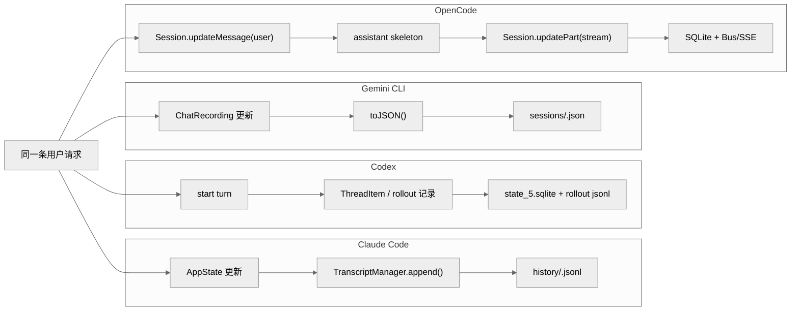
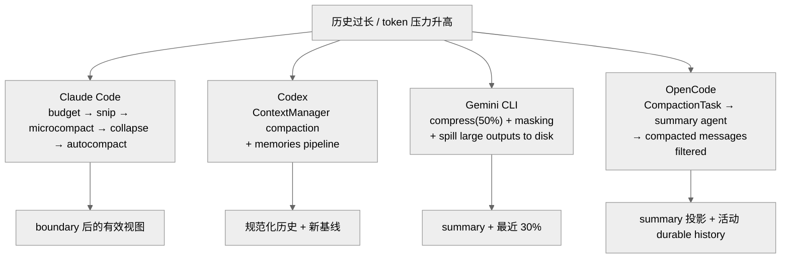

# 上下文、状态与记忆工程对比

Agent 的判断质量取决于它在当前时刻能看到什么。这个"能看到什么"——即上下文——不是固定的，而是由工程设计决定的。如果上下文设计得好，Agent 在每次响应时都能访问到相关的历史决策、项目规则、用户偏好；如果设计得差，Agent 每次都从一张白纸开始，反复犯同样的错误，或者在不相关的信息里迷失方向。

记忆工程的核心挑战是一个矛盾：上下文窗口是有限的，而有价值的信息是无限累积的。解决这个矛盾的策略——什么该保留、什么该压缩、什么该丢弃——直接决定了 Agent 的长期可靠性。这是"上下文与记忆"这个维度被单独分析的原因：它不只是技术细节，它决定了 Agent 能否跨 session 持续地、可靠地学习和改进。

---

## 1. Context 分层治理

Context 分层是指：把不同来源、不同时效、不同权威性的信息分别组织，而不是把所有信息混合成一个大的文本块。分层的价值在于：工程师可以预测哪类信息在哪个位置，Agent 可以通过信息的"位置"推断其权威性，系统可以按层次分别更新和失效信息。

### Claude Code

`claude-code/src/context.ts:116-189` 把 context 分为 System Context 和 User Context 两层：

```typescript
export const getSystemContext = memoize(async (): Promise<{ [k: string]: string }> => {
  // gitStatus — 当前 git 仓库状态
  // cacheBreaker — 仅 Anthropic 内部（ant-only）
})

export const getUserContext = memoize(async (): Promise<{ [k: string]: string }> => {
  // claudeMd — CLAUDE.md 文件内容
  // currentDate — 当前日期
})
```

两层都使用 `memoize()` 缓存，生命周期是整个 conversation。这意味着：CLAUDE.md 内容在 conversation 期间不会重新读取，即使文件在 conversation 中被修改。这是一个有意识的性能优化，但也意味着实时规则变更无法在当前 session 里立即生效。

在上下文治理层，Claude Code 引入了 **compact boundary** 机制：REPL 保留完整 scrollback，但模型只看最近 boundary 之后的消息，UI 历史 ≠ 模型上下文。这个切断点是整个梯度上下文体系的基础。梯度体系从轻到重依次为：tool result budget（预算裁剪）→ snip（直接删消息）→ microcompact（细粒度压缩）→ context collapse（维护投影视图）→ autocompact（重型重写）。每一层只在上一层不足时才介入，不是每轮固定跑完整条链。

### Codex

Codex 的 Context 分层更复杂，因为它是跨 session 的。`stage_one_system.md` 的 Phase 1 每次从 rollout 历史里提取结构化上下文，`consolidation.md` 的 Phase 2 把多次 Phase 1 的输出整合成全局记忆。这意味着 Codex 的"当前上下文"不只是当前 session 的信息，而是包含了历史 session 的提炼。从控制论角度看，这是跨 session 的状态持久化——是四个工程里唯一真正实现了这一点的。

`ContextManager` 同时承担三件事，构成 Codex 上下文分层的核心：

1. **历史规范化**：`for_prompt()` 会丢掉不适合发给模型的项，并在无图像输入模态时剥离图片内容。
2. **上下文基线维护**：`reference_context_item` 记录下一轮 settings diff 的参考快照；发生 compaction、rollback 或历史替换时，这个基线会一起被重置。
3. **窗口压力治理**：`estimate_token_count_with_base_instructions()` 用近似 token 估算配合 compaction 任务判断是否需要压缩。

`project_doc.rs::get_user_instructions()` 构造 `base_instructions` 时，先取 `config.user_instructions`，再按"项目根 → 当前目录"的顺序拼接所有 `AGENTS.md`，受 `project_doc_max_bytes` 限制，超出预算时截断。这意味着 Codex 的项目级约束不是某个单点 prompt 文件，而是配置层和目录层共同生成的 developer context。

### Gemini CLI

`gemini-cli/packages/core/src/config/memory.ts` 的 `HierarchicalMemory` 接口定义了三层：

```typescript
export interface HierarchicalMemory {
  global?: string      // 全局配置，所有项目共享
  extension?: string   // 扩展级配置
  project?: string     // 项目级配置，最高优先级
}
```

三层的分离使不同的责任方可以控制不同层次的规则：全局层由系统管理员或用户偏好设置，project 层由项目团队维护。这是典型的关注点分离在记忆系统里的实现。

Gemini CLI 采用 **JIT context 分层注入**策略，而非全量预注入：`Config.getSystemInstructionMemory()` 只返回 global memory 进入 system prompt；`Config.getSessionMemory()` 返回 extension + project memory，作为首条会话内容注入（包裹在 `<loaded_context>`、`<extension_context>`、`<project_context>` 标签中），而不是统一塞到 system prompt。`ContextManager.discoverContext()` 还能在访问具体路径时，按需加载子目录里的补充记忆。这意味着当前的上下文管理已经不是"固定窗口里塞完整历史"的单层模型，而是"系统级 + 会话级 + 按需发现"的分层结构。

### OpenCode

`opencode/packages/opencode/src/skill/index.ts:143-157` 通过 `Config.directories()` 扫描目录来发现 Skill 文件。Context 分层不是显式定义的，而是通过目录结构隐式表达的：越靠近项目的目录里的 Skill，优先级越高。这是声明式的分层，但对不熟悉约定的工程师来说，需要先理解目录扫描逻辑才能推断优先级。

OpenCode 的上下文来自六个来源：用户原始输入、文件/MCP/agent 附件展开、provider/agent 基础提示、环境/技能/指令文件、运行时提醒、durable history 投影。这六个来源经过三层编译：**输入编译**（`createUserMessage()` 把文件展开成 synthetic text、把 `@agent` 改写成上下文提示）→ **system 编译**（`system.ts` 四层叠加：agent.prompt + 运行时片段 + user.system）→ **历史投影**（`toModelMessages()` 把 durable history 转成 AI SDK `ModelMessage[]`）。OpenCode 的上下文不是"message string + system string"，而是一份 runtime 编译产物。

---

## 2. Compact/裁剪策略

当对话历史超过上下文窗口时，必须有一套机制来决定保留什么、丢弃什么。这个决策——Compact 策略——比表面看起来更重要：丢弃错误的信息会让 Agent 失去关键上下文，而不丢弃任何信息会让 Agent 很快无法继续工作。Compact 策略的质量，决定了 Agent 长会话的可靠性上限。

### Claude Code

Claude Code 的 Compact 策略是四个工程里最精细的梯度体系。触发点包括 `/clear` 和 `/compact` 命令，以及 autocompact 阈值（`effectiveContextWindow - 13_000`）。完整的梯度链路为：

- **tool result budget**：避免单条 tool result 直接撑爆上下文，做最小粒度的预算裁剪。
- **snip**：直接删掉中间区段消息，不生成摘要替代旧内容，通过 `parentUuid` 重连消息链。
- **microcompact**：有两条路径——time-based（直接把旧 `tool_result.content` 清成空壳占位）和 cached（通过 `cache_edits` 在 API 层编辑 cache，本地消息不改）。
- **context collapse**：维护 collapse store，每轮按 commit log 重放成投影视图，collapse summary 不住在 REPL message array 里。
- **autocompact**：命中阈值后先试 `SessionMemory compact`（快路径，利用已有 notes 保留最近消息尾部），只有快路径走不通时才回退到 `compactConversation()`（传统 full compact summary，`NO_TOOLS_PREAMBLE` 强制 compaction agent 只输出结构化 summary，不调用任何工具）。
- **reactive compact**：真正出现 API overflow 或 prompt-too-long 时的恢复式压缩，不是立即终止。

这说明上下文管理同时包含预防式压缩和失败后恢复式压缩两类能力。

### Codex

Codex 的 compaction 机制集中在 `ContextManager` 内部。`auto_compact_limit` 在 `run_turn()` 入口检查 token 预算，触发 compaction 任务时 `ContextManager` 压缩历史，`reference_context_item` 基线随之重置，memories pipeline 将压缩前的关键信息异步固化到 `~/.codex/memories/`。

memories pipeline 还有一个 **memory_mode_polluted 降级**机制：一旦上下文掺入外部 MCP 或 web search 结果（由 `mcp_tool_call.rs` 标记），memory 会被主动降级，避免把高噪声输入错误固化为长期记忆。配置里的 `no_memories_if_mcp_or_web_search` 控制这一行为。

### Gemini CLI

`packages/core/src/services/chatCompressionService.ts` 实现了 **ChatCompressionService**，策略如下：

- 默认在上下文约达模型上限的 **50%** 时触发压缩
- 尽量保留最近约 **30%** 的历史
- 对超大的旧工具输出，不直接丢弃，而是截断后把完整内容落到项目临时目录（落盘而非截断丢弃，比简单删前文语义损失更小）

除了压缩，`GeminiClient` 还会调用 **ToolOutputMaskingService** 对历史中过于臃肿的工具输出进一步瘦身。`Config.getTruncateToolOutputThreshold()` 会根据当前剩余上下文动态收紧输出阈值。如果这些措施之后本次请求仍可能超出窗口，客户端会发出 `GeminiEventType.ContextWindowWillOverflow` 事件，而不是盲目继续提交。

### OpenCode

OpenCode 的 compaction 触发链路为：**CompactionTask → summary agent → SessionProcessor.process() → 生成 summary assistant message → SessionSummary.summarize() 被调用 → 写 session_diff + Session.setSummary()**。

`MessageV2.filterCompacted()` 过滤已压缩历史，确保模型不会看到已被 summary 替换的旧消息。compaction 后历史被 summary 替换，原始消息从活跃 durable 中移除，无法在当前 session 中恢复原始 turn 级别的工具调用详情——这是 OpenCode compaction 不可逆的代价。

---

## 3. 知识作为系统记录

知识版本化（Knowledge as System Record）是指：把 Agent 使用的规则、偏好、历史决策作为可审计的系统记录，而不是散落在对话历史里、无法追溯的临时信息。版本化的知识可以在不同 session 间传递、在代码审查中可见、在规则变更时有迹可循。

### Claude Code

`claude-code/src/utils/claudemd.ts:790-1074` 的 `getMemoryFiles()` 发现并加载四层 CLAUDE.md 文件：

```
Managed (/etc/claude-code/CLAUDE.md) — 系统管理员管理
User (~/.claude/CLAUDE.md) — 用户全局记忆
Project (CLAUDE.md, .claude/CLAUDE.md, .claude/rules/*.md) — 项目记忆
Local (CLAUDE.local.md) — 本地私有记忆（通常 .gitignore）
```

`@include` 指令支持从一个 CLAUDE.md 引用另一个文件，实现知识复用。Project 层的 CLAUDE.md 进入 Git 版本控制，意味着规则变更有完整的历史记录和变更原因。

Claude Code 还引入了 **KAIROS daily log 模式**：启用后，`loadMemoryPrompt()` 切换到 `buildAssistantDailyLogPrompt()`，每轮有价值的信息 append 到当天 `logs/YYYY/MM/YYYY-MM-DD.md`，不直接维护 `MEMORY.md`（append-only 日志流，而非语义化可更新的 topic files）。定期或手动触发 `/dream`，由 `buildConsolidationPrompt()` 把 daily log 蒸馏回 topic files 和 `MEMORY.md` index（四步：Orient → Gather recent signal → Consolidate → Prune and index）。

**team memory scope** 维度（`src/memdir/teamMemPrompts.ts`）启用后，durable memory 增加 scope 维度：type（user / feedback / project / reference）× scope（private / shared team），`buildCombinedMemoryPrompt()` 要求模型在写入前判断内容应归属 private 还是 team。

### Codex

`codex/codex-rs/core/templates/memories/consolidation.md` 的 Phase 2 产物包括 `raw_memories.md`（原始记忆合并）和 `rollout_summaries/`（每次 rollout 的摘要）。这些产物存储在 DB 里，有时间戳和 usage_count，支持基于使用频率的知识衰减（`max_unused_days` 窗口）。Codex 的知识版本化最完整：不只是"文件在 Git 里"，而是"知识有时间戳、有使用统计、有主动遗忘机制"。

memories pipeline 采用**两阶段 consolidation**：phase1（`memories/phase1.rs`）选择 rollout、提取 stage-1 raw memories；phase2（`memories/phase2.rs`）选择可用 raw memories、做去重评分筛选。这套 pipeline 的中心不是当前 turn，而是已经落盘的 rollout，因此 memory 更偏离线整理，而不是每轮都做复杂注入。

### Gemini CLI

`gemini-cli/packages/core/src/tools/memoryTool.ts` 实现了 Memory Tool，Agent 可以通过工具调用来读写记忆（`getAllGeminiMdFilenames()` 发现所有 GEMINI.md 文件）。记忆存储在文件系统里，通过 Git 版本化。Agent 可访问记忆工具，意味着它可以主动写入记忆，而不只是被动读取规则——这是 Gemini CLI 记忆系统的独特能力。

**save_memory 工具实现**（`packages/core/src/tools/memoryTool.ts`）很直接：读取当前全局 memory 文件 → 在 `## Gemini Added Memories` 段落下追加条目（写入内容做简单清洗，把换行压成单行，避免把任意 markdown 结构直接注进去）→ 展示 diff 并请求确认 → 写回磁盘。所以 `save_memory` 是一个**显式的文件修改工具**，存储目标默认是全局 `GEMINI.md` 类文件，而不是独立的 `memory.json` 键值数据库。

### OpenCode

`opencode/packages/opencode/src/skill/index.ts:71-102` 的 Skill 解析通过 Zod Schema 验证 frontmatter 结构：

```typescript
const parsed = Info.pick({ name: true, description: true }).safeParse(md.data)
```

Skill 文件是知识的主要载体，存储在文件系统里。没有 DB 层的时间戳或使用统计，知识版本化完全依赖文件系统 + Git。

OpenCode 的 **SessionSummary** 是记忆系统的核心，定位更准确的说法是"session 级别的文件变更追踪系统"：每个 step 的开始/结束快照构成一个可差分的版本链，`FileDiff` 包含 `additions/deletions/changes`（不是模糊文字），diff 数据存在 `Storage`（JSON 文件）里，通过 `Bus.publish` 实时推给前端。`computeDiff()` 从 message history 中找最早和最晚的 step 快照（step-start/step-finish 快照边界），调用 `Snapshot.diffFull(from, to)` 计算 diff，写进 `Storage.write(["session_diff", sessionID])`。

---

## 4. Progressive Disclosure 实现

Progressive Disclosure（渐进式揭示）在 UX 设计里指"只在需要时显示复杂信息"，在 Agent 上下文工程里，它指"Agent 只在需要时加载相关信息，而不是一次性把所有知识塞进上下文"。实现好的 Progressive Disclosure 能降低上下文噪音、提高 Agent 的响应精度，并延长在给定上下文窗口内可以维持的有效对话长度。

### Claude Code

`claudemd.ts:1-26` 的注释指出文件按"优先级倒序加载"（后加载的优先级更高）。但这是一次性全量加载——所有 CLAUDE.md 文件的内容都被加入 System Prompt，没有延迟加载或按需加载。这是 Progressive Disclosure 的反模式。

实验路径上，Claude Code 实现了**按需召回（relevant memory recall）**（`src/memdir/findRelevantMemories.ts`）：

- 异步 prefetch，不阻塞主回合；到 collect point 还没完成就直接跳过
- 只读 frontmatter manifest，再由 Sonnet side query 选择相关 memory
- 精确度优先于召回率：只选明显有用的 memory，**最多选 5 个**，不确定就不选
- 选中的 memory 以 `relevant_memories` attachment 形式注入当前 turn

这是 Claude Code 在 Progressive Disclosure 方向上最接近"按需加载"的实现，但目前仍属实验路径。

### Codex

`default.md` 的 276 行按节（Personality → AGENTS.md spec → Planning → Task execution → Validating）组织。每个节负责不同的任务阶段，这是一种隐式的 Progressive Disclosure：不同阶段的 Agent 关注不同的节，而不是每次都处理整个文档。节与节之间有清晰的边界，Agent 可以通过节标题快速定位相关规则。

**AGENTS.md 层级发现**（`project_doc.rs`）受 `project_doc_max_bytes` 限制，超出预算时截断，避免把整个项目文档树无限制地塞进上下文。这是 Codex 在 Progressive Disclosure 上的主要工程约束：不是"按需加载"，而是"有上限的层级拼接"。

### Gemini CLI

`snippets.ts:123-151` 的 `getCoreSystemPrompt()` 通过条件渲染（`options.planningWorkflow ? renderPlanningWorkflow : renderPrimaryWorkflows`）实现了真正的 Progressive Disclosure：不同的 Agent 模式激活不同的 Snippet 组合，不相关的 Snippet 不被包含。这使 System Prompt 的内容和当前任务模式高度相关，减少了噪音。

Gemini CLI 还实现了 **LoopDetectionService**（`packages/core/src/services/loopDetectionService.ts`），包含三类检测：

- **完全相同的工具调用重复**：对 `tool name + args` 做哈希，连续重复超过阈值（**5 次**）判定为循环
- **内容 chanting / 重复输出**：检测流式文本片段的重复模式，阈值为 **10 次**
- **LLM 辅助检查**：单个 prompt 内经过 **30 个 turn** 后启动，定期让模型判断当前是否陷入"无进展循环"

循环检测是 Progressive Disclosure 的防御性实现：当 Agent 陷入重复模式时主动中断，而不是让无效的上下文继续膨胀。

### OpenCode

Skill 系统在 `sign()` 函数里（`skill/index.ts`）把 Skill 定义分散在多处（`skill/index.ts`、`permission/index.ts`、`config/config.ts`）。这是适度的分散，不是 Progressive Disclosure 的积极实现，但至少避免了百科全书式的单点聚合。

OpenCode 的 **InstructionPrompt loaded/claim 机制**（`instruction.ts:168-190`）是 Progressive Disclosure 的一个具体实现：`InstructionPrompt.loaded(messages)` 会从历史里的 `read` 工具结果 metadata 中提取已经加载过的 instruction 路径；`claim/clear` 用于避免同一 message 内重复注入。当 agent 读取一个深层文件时，OpenCode 还能补发现该子目录局部的 `AGENTS.md`/`CLAUDE.md`（`InstructionPrompt.resolve()` 在 `168-190` 围绕被读取的文件路径向上查找尚未加载的 instruction 文件），实现了"读到哪里、发现到哪里"的按需加载。

---

## 5. 四工具 state / session / memory 详细对比

前面 1-4 节主要讨论上下文如何被组织、压缩和按需揭示。但如果再往下切一层，会发现四个工具对 **state**、**session**、**memory** 这三个词本身的定义就不一样。这一层差异会直接决定：哪些对象只是运行态，哪些对象才是可恢复的 durable 边界；长会话压缩后保留的是对话视图、线程协议、recording 文件，还是可重放的消息树；记忆到底是长期知识库、会话摘要，还是文件变更追踪。

### 5.1 概念模型：四个工具到底在管理什么

先拆清三个概念：

- **state**：当前进程里正在变化、要驱动 UI 或执行器的运行态。
- **session**：一段可以 resume、fork、继续对话的交互边界。
- **memory**：跨轮次甚至跨会话保留的知识、摘要或结构化衍生物。

| 维度 | Claude Code | Codex | Gemini CLI | OpenCode |
|------|-------------|-------|------------|----------|
| **state 是什么** | 进程内 `AppState` + store / selector 驱动的 UI 运行态 | `SessionState / ActiveTurn` 运行态 + `Thread / Turn / ThreadItem` 协议状态 | `Scheduler / MessageBus / UIStateContext` + recording 运行态 | 内存 `SessionStatus` + durable `Session / MessageV2 / Part` |
| **session 是什么** | transcript 文件边界 + compact boundary 后的有效模型视图 | `Thread` 是会话容器，`Turn` 是轮次边界 | `ChatRecording` JSON 文件就是整个会话 | `SessionTable` 一条 session 记录，下面挂 message / part 树 |
| **memory 是什么** | `MEMORY.md`、topic files、KAIROS daily log、SessionMemory notes | `AGENTS.md` 长期记忆 + memories pipeline 提取的会话经验 | `GEMINI.md` 三层记忆 + `save_memory` 工具写入 | `session_diff`、summary、instruction 重发现，更偏 session memory |
| **模型真正读到什么** | compact 后历史 + relevant memories + 系统提示 | `ContextManager` 规范化历史 + `AGENTS.md` + tool spec + memories 结果 | global memory 进 system，extension/project memory 进会话内容 | durable history 投影 + instruction stack + runtime reminders + tool set |
| **最像单一事实来源的对象** | transcript 负责恢复，`AppState` 负责当前运行 | thread / rollout 是线程事实源 | `ChatRecording` 是事实源，UI 状态只是投影 | SQLite durable state 是事实源，UI / SSE 是投影 |

这意味着四个工具根本不是在解同一道题：

- **Claude Code** 的重点是把运行态做轻，把 transcript 和 memory 文件做强。
- **Codex** 的重点是把会话提升成线程协议，让 resume、fork、服务化都建立在同一对象模型上。
- **Gemini CLI** 的重点是让 session 和 memory 都保持文件化、透明、易修改。
- **OpenCode** 的重点是把多前端共享的事实源压到 durable session 对象里。

```mermaid
%%{init: {'theme': 'neutral'}}%%
flowchart TB
    subgraph Claude["Claude Code"]
        C1["Runtime State\nAppState / Store"]
        C2["Session Boundary\ntranscript + compact boundary"]
        C3["Memory\nMEMORY.md / KAIROS / SessionMemory"]
        C1 --> C2 --> C3
    end

    subgraph Codex["Codex"]
        X1["Runtime State\nSessionState / ActiveTurn"]
        X2["Session Boundary\nThread / Turn / ThreadItem"]
        X3["Memory\nAGENTS.md + memories pipeline"]
        X1 --> X2 --> X3
    end

    subgraph Gemini["Gemini CLI"]
        G1["Runtime State\nScheduler / MessageBus / UIState"]
        G2["Session Boundary\nChatRecording JSON"]
        G3["Memory\nHierarchical GEMINI.md"]
        G1 --> G2 --> G3
    end

    subgraph OpenCode["OpenCode"]
        O1["Runtime State\nSessionStatus"]
        O2["Session Boundary\nSession / MessageV2 / Part"]
        O3["Memory\nsession_diff / summary"]
        O1 --> O2 --> O3
    end
```



### 5.2 实现模型：写入、恢复、压缩、分叉如何落地

概念差异最终会落在实现路径上：

| 维度 | Claude Code | Codex | Gemini CLI | OpenCode |
|------|-------------|-------|------------|----------|
| **持久化后端** | JSONL transcript | SQLite WAL + rollout / logs | JSON session file | SQLite + `Storage` JSON |
| **写入时机** | transcript entry 追加写，运行态主要留内存 | 线程元数据写 SQLite，rollout 持续记录 | recording 增量更新后整体重写 JSON | message / part 流式写库 |
| **恢复粒度** | 读 transcript，重建 compact boundary | 按 `thread_id` / rollout 恢复到 `Thread / Turn / Item` | 读取 recording JSON 恢复整段会话 | `MessageV2.stream()` + `hydrate()` 回放整个 session |
| **长会话治理** | snip / microcompact / collapse / autocompact 梯度体系 | `ContextManager` compaction + memories pipeline | `ChatCompressionService` + `ToolOutputMaskingService` | `CompactionTask` + summary agent + `filterCompacted()` |
| **fork / 分支** | 复制 transcript 或从某边界继续 | `fork_thread()` 基于 rollout 截断 | 复制 JSON recording | 父子 session / `parent_id` |
| **事务与一致性** | 很弱 | SQLite ACID + WAL | 很弱 | `Database.effect()` 保证先写库后发事件 |
| **多端共享友好度** | 偏单端 | 强 | 中 | 最强 |

如果从工程取舍角度概括：

1. **Claude Code** 用最容易读懂的 durable 形式，换取较弱的事务和结构化边界。
2. **Codex** 用最完整的线程协议，换取更高的系统复杂度。
3. **Gemini CLI** 用最直接的文件式 session/memory，换取较弱的并发保护。
4. **OpenCode** 用最细粒度的 durable 写回，换取更重的状态系统和更高的实现复杂度。

### 5.3 场景 A：同一轮输入如何落盘

假设四个工具都收到同一个请求：

> "请把 `src/auth.ts` 改成支持 refresh token，并解释改动。"

它们写盘的语义边界并不一样：

| 工具 | 先写什么 | 中间过程怎么存 | 最后恢复时看到什么 |
|------|----------|----------------|--------------------|
| Claude Code | transcript entry | token 级过程主要留在运行态，最终追加 entry | transcript entries |
| Codex | 新 `Turn` / rollout 事件 | `ThreadItem`、command、file change 按协议落盘 | `Thread / Turn / ThreadItem` |
| Gemini CLI | `ChatRecording.turns[]` | 录制服务更新会话对象，再整体重写 JSON | 一份 recording |
| OpenCode | `user message` 先入库，assistant skeleton 预分配 | `part` 按流持续写入，Bus/SSE 同步投影 | `Session / Message / Part` 可回放链 |



这个图最能说明 OpenCode 和其他三个的根本区别：OpenCode 不是"响应结束后记账"，而是**先分配 durable 宿主，再持续写入流事件**。

### 5.4 场景 B：长会话如何控长又保形

真正困难的问题不是"怎么删历史"，而是"删完之后，下一轮 prompt 还像不像原来的会话"。

| 工具 | 控长主策略 | 保形方式 |
|------|-----------|---------|
| Claude Code | tool result budget → snip → microcompact → collapse → autocompact | compact boundary、SessionMemory、relevant memory recall 共同维持语义连续 |
| Codex | `ContextManager` + compaction + memories pipeline | 压缩历史后重建 `reference_context_item` 基线，并让 memories pipeline 异步补知识 |
| Gemini CLI | `ChatCompressionService` + `ToolOutputMaskingService` | 保留最近约 30%，旧大输出落盘 |
| OpenCode | `CompactionTask` → summary agent → `filterCompacted()` | 用 durable summary 显式替换旧历史，后续只投影活动历史 |



这里的关键差异是：

- Claude Code 的保形重点是**上下文治理链**；
- Codex 的保形重点是**线程协议和 context baseline**；
- Gemini CLI 的保形重点是**别让大输出拖垮窗口**；
- OpenCode 的保形重点是**把压缩也写成 durable state 的一部分**。

### 5.5 场景 C：跨会话知识如何回流到下一轮 prompt

如果昨天已经讨论过"统一用 `sqlx`"、"测试必须带 integration test"、"这个子目录有特殊 `AGENTS.md` 规则"，四个工具回流知识的方式也不同：

| 工具 | 长期知识载体 | 进入 prompt 的方式 | 关键取舍 |
|------|--------------|-------------------|---------|
| Claude Code | `MEMORY.md`、topic files、KAIROS daily log、SessionMemory | system prompt + relevant memory attachment + compact notes | 召回更智能，但系统复杂度最高 |
| Codex | `AGENTS.md` + memories pipeline 结果 | `project_doc.rs` 拼 base instructions，memory pipeline 异步补充 | 长期知识显式，短期经验半自动 |
| Gemini CLI | global / extension / project `GEMINI.md` | global 进 system，extension / project 进会话内容 | 文件系统透明，但越久越容易膨胀 |
| OpenCode | `AGENTS.md` / `CLAUDE.md` / `CONTEXT.md` 栈 + `session_diff` / summary | instruction stack + durable history 投影 + reminder | 更像 session 续航，不像独立长期知识库 |

```mermaid
%%{init: {'theme': 'neutral'}}%%
flowchart LR
    subgraph Claude["Claude Code"]
        direction LR
        C1["MEMORY.md / KAIROS / SessionMemory"]
        C2["relevant recall + system prompt"]
        C1 --> C2
    end

    subgraph Codex["Codex"]
        direction LR
        X1["AGENTS.md + memories pipeline"]
        X2["project_doc + build_prompt()"]
        X1 --> X2
    end

    subgraph Gemini["Gemini CLI"]
        direction LR
        G1["GEMINI.md\n(global / extension / project)"]
        G2["system memory + session memory"]
        G1 --> G2
    end

    subgraph OpenCode["OpenCode"]
        direction LR
        O1["Instruction files + session_diff + summary"]
        O2["instruction stack + toModelMessages()"]
        O1 --> O2
    end

    C2 ~~~ X1
    X2 ~~~ G1
    G2 ~~~ O1
```



这一节最重要的结论是：**OpenCode 当前的 memory 更偏会话记忆，而不是长期知识记忆**。如果不先把概念拆开，就会误以为四个工具都在实现同一种 memory backend。

---

## Agent 可访问信息边界

理解"Agent 能看到什么"和"Agent 不能看到什么"，对治理 Agent 行为至关重要。信息边界定义了 Agent 决策的数据基础，也定义了 Agent 不应该期望自己知道什么。

所有四个工程的 Agent 都无法感知超出其工具和上下文之外的信息：Slack 消息、Google Docs 内容、人脑里的隐性知识——这些对 Agent 不存在，除非被显式地工具化并注入上下文。这个边界对 harness 设计的含义是：任何团队想让 Agent 考虑的信息，都必须通过可见渠道（文件、工具、上下文）明确传递，而不能假设 Agent "自然会知道"。

| 工程 | 上下文组成 | 信息边界 |
|------|-----------|---------|
| Claude Code | System/User Context + CLAUDE.md 四层 + compact boundary 梯度体系 | git status, date, CLAUDE.md 内容，relevant memory recall（最多5个） |
| Codex | 当前 session + Phase 1/2 记忆整合 + ContextManager 三件事 | rollout 历史提炼 + 当前任务，MCP/web search 污染时降级 |
| Gemini CLI | GEMINI.md 三层（JIT 分层注入）+ Tool 调用结果 | global memory 进 system prompt，extension/project memory 作会话内容注入 |
| OpenCode | Skill 文件 + Config + Permission + 六来源三层编译 | 目录内 Skill + 配置，loaded/claim 机制避免重复注入 |

---

## 总结对比表

| 维度 | Claude Code | Codex | Gemini CLI | OpenCode |
|------|-------------|-------|------------|----------|
| Context 分层 | System/User 两层 + compact boundary 梯度体系 | Phase 1/2 跨 session 分离 + ContextManager 三件事，最深 | Global/Ext/Project 三层，JIT 分层注入 | 六来源三层编译，目录堆栈隐式分层 |
| Compact 策略 | 梯度体系（tool result budget→snip→microcompact→context collapse→autocompact→reactive compact），autocompact 先试 SessionMemory 快路径 | ContextManager compaction + memories pipeline memory_mode_polluted 降级 | ChatCompressionService（50%触发、保留最近30%、大工具输出落盘）+ ToolOutputMaskingService | CompactionTask→summary agent→SessionSummary.summarize()，不可逆 |
| 知识版本化 | Git + 文件系统（四层）+ KAIROS daily log + team memory scope | DB + 时间戳 + 使用统计 + 两阶段 consolidation，最完整 | 文件系统 + Agent 可主动写入（save_memory 追加到 ## Gemini Added Memories） | 文件系统（无使用统计）+ SessionSummary 文件级 diff 追踪 |
| Progressive Disclosure | 实验路径：relevant memory recall（最多5个，Sonnet side query，异步prefetch） | AGENTS.md 层级发现（project_doc_max_bytes 限制） | 条件 Snippet 渲染 + LoopDetectionService（工具重复阈值5、内容重复阈值10、LLM辅助30轮后） | InstructionPrompt loaded/claim 机制（避免重复灌上下文） |
| 综合评分 (1-5) | **3** | **4** | **3** | **2** |

上下文与记忆工程的分析揭示了一个关键差异：Codex 是唯一把记忆当作工程系统设计（有 DB、时间戳、使用统计、遗忘机制）的工程，其他三个都把记忆视为文件系统操作。这个差异在[熵管理](./08-entropy-management.md)这个维度会体现得更明显——记忆系统的工程化程度，直接决定了知识库腐烂的速度。接下来先看[可驾驭性](./07-harnessability.md)，它从代码库结构的角度回答"这个工程是否本身就容易被 harness"。

---

## 参考链接

- Claude Code 状态、会话与记忆系统：[../hello-claude-code/04-state-session-memory.md](../hello-claude-code/04-state-session-memory.md)
- Codex 状态、会话与记忆系统：[../hello-codex/04-state-session-memory.md](../hello-codex/04-state-session-memory.md)
- Gemini CLI 状态、会话与记忆系统：[../hello-gemini-cli/04-state-session-memory.md](../hello-gemini-cli/04-state-session-memory.md)
- OpenCode 状态、会话与记忆系统：[../hello-opencode/04-state-session-memory.md](../hello-opencode/04-state-session-memory.md)
- 四工具 state / session / memory 对比：[本章第 5 节](#5-四工具-state--session--memory-详细对比)
