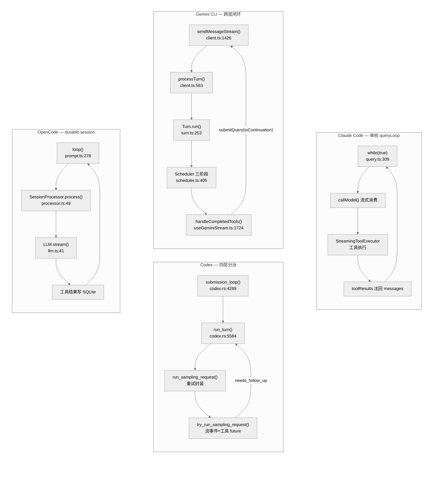
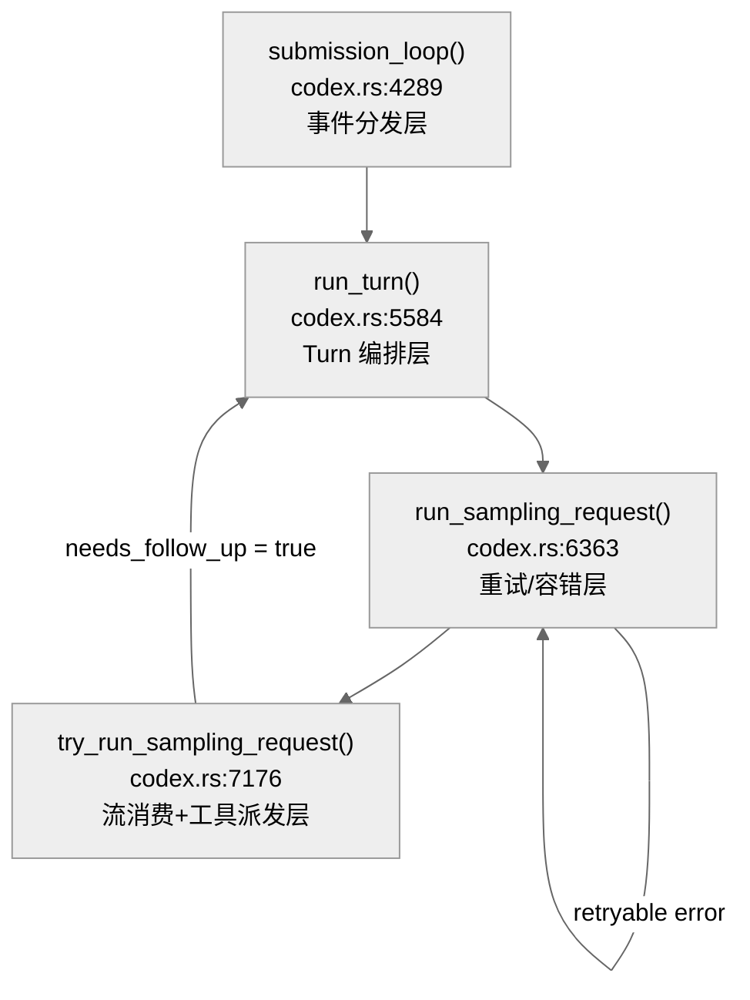
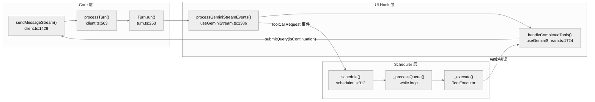
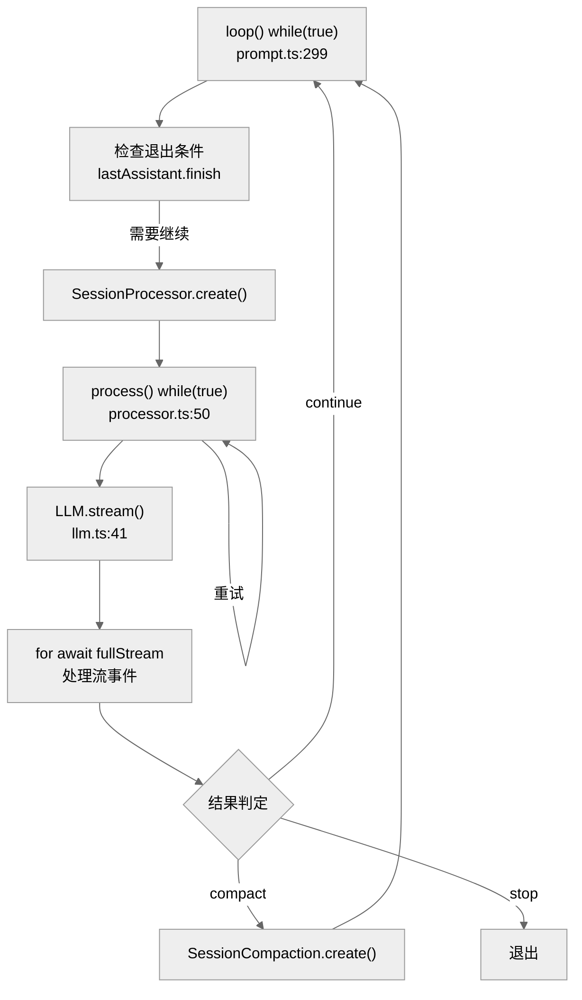

<!-- markdownlint-disable MD060, MD024 -->

# Agent Loop 闭环拓扑对比

这篇是 `hello-harness` 中专门对应四份执行环路分析的章节：

- [`../hello-claude-code/03-agent-loop.md`](../hello-claude-code/03-agent-loop.md)
- [`../hello-codex/03-agent-loop.md`](../hello-codex/03-agent-loop.md)
- [`../hello-gemini-cli/03-agent-loop.md`](../hello-gemini-cli/03-agent-loop.md)
- [`../hello-opencode/03-agent-loop.md`](../hello-opencode/03-agent-loop.md)

---

## 1. 为什么 Agent Loop 值得单独深挖

Harness 视角下，Agent Loop 不只是"模型调用然后执行工具"的 while 循环。它是整个控制系统真正落地的位置——控制平面决定规则从哪里来，前馈决定规则怎样在行动前进入上下文，反馈决定偏差怎样被检测和纠正；但这些最终都要在一条循环里实现为真实行为。

对选型读者来说，Agent Loop 的设计直接影响：

- **延迟**：闭环路径越短、跨层跳转越少，单 turn 延迟越低
- **可治理性**：控制点（审批、hook、policy）能不能自然地插入 loop，决定了安全围栏的实施成本
- **可恢复性**：loop 崩溃后能否 resume，取决于状态存储在内存还是持久层
- **并发吞吐**：多个工具调用能否并行执行，受限于 loop 内的并发控制策略
- **可扩展性**：新工具、新 provider、新 hook 是否能在不改动 loop 核心的情况下接入

因此本文从源码层面逐行剖析四个工程的 Agent Loop 实现，给出精确到代码行的技术对比。

---

## 2. 四种闭环拓扑总览



---

## 3. Claude Code：单核 `queryLoop` 深度解析

### 3.1 主循环结构

Claude Code 的全部闭环逻辑集中在 `claude-code/src/query.ts` 的 `queryLoop()` 异步生成器中。

**入口签名** — `claude-code/src/query.ts:241-248`：

```typescript
async function* queryLoop(
  params: QueryParams,
  consumedCommandUuids: string[],
): AsyncGenerator<
  StreamEvent | RequestStartEvent | Message | TombstoneMessage | ToolUseSummaryMessage,
  Terminal
>
```

**核心状态对象** — `claude-code/src/query.ts:271-282`：

```typescript
let state: State = {
  messages: params.messages,
  toolUseContext: params.toolUseContext,
  maxOutputTokensOverride: params.maxOutputTokensOverride,
  autoCompactTracking: undefined,
  stopHookActive: undefined,
  maxOutputTokensRecoveryCount: 0,
  hasAttemptedReactiveCompact: false,
  turnCount: 1,
  pendingToolUseSummary: undefined,
  transition: undefined,
}
```

**循环条件** — `claude-code/src/query.ts:309`：`while (true)`，通过显式 `return` 退出。这意味着所有退出路径都必须走 `return { reason: '...' }`。

### 3.2 单次迭代生命周期

每次迭代依序执行以下阶段：

| 阶段 | 代码位置 | 职责 |
|------|----------|------|
| 状态解构 | `query.ts:311-324` | 从 `state` 解构当前迭代所需字段 |
| History Snip | `query.ts:346-353` | 特性门控下的历史裁剪 |
| Microcompact | `query.ts:353-375` | 每轮迭代前的轻量上下文压缩 |
| Autocompact | `query.ts:404-545` | 主动式上下文摘要（满足 token 阈值时触发） |
| 构建 system prompt | `query.ts:550-700` | 组装系统提示词、工具定义、memory |
| 流式模型调用 | `query.ts:735-1060` | `deps.callModel()` 消费 SSE 流 |
| 工具检测与执行 | `query.ts:980-1000` | 累积 `tool_use` 块，设置 `needsFollowUp` |
| 工具结果收集 | `query.ts:1375-1430` | 运行 `runTools()` 或 `StreamingToolExecutor` |
| 错误恢复 | `query.ts:1171-1260` | reactive compact、max_output_tokens recovery |
| 退出/继续判断 | `query.ts:1243-1380` & `1705-1720` | `needsFollowUp` 和 `maxTurns` |

### 3.3 工具结果回注机制

工具执行完毕后，结果通过 continue site 注入下一迭代（`query.ts:1710-1720`）：

```typescript
const next: State = {
  messages: [...messagesForQuery, ...assistantMessages, ...toolResults],
  toolUseContext: toolUseContextWithQueryTracking,
  turnCount: nextTurnCount,
  transition: { reason: 'next_turn' },
}
state = next  // loop continues with injected tool_results
```

注意这是**内存态拼接**——工具结果直接合并到 `messages` 数组，然后传给下一次 `callModel()`。没有任何持久化层介入。

### 3.4 并发工具执行

Claude Code 拥有两套工具执行引擎：

**1. 批处理模式** — `claude-code/src/services/tools/toolOrchestration.ts:20-120`

`runTools()` 函数将工具调用按 `isConcurrencySafe` 属性分区（`partitionToolCalls()`，行 96-119）：

```typescript
function partitionToolCalls(toolUseMessages, toolUseContext): Batch[] {
  return toolUseMessages.reduce((acc, toolUse) => {
    const tool = findToolByName(toolUseContext.options.tools, toolUse.name)
    const isConcurrencySafe = tool?.isConcurrencySafe(parsedInput.data) || false
    if (isConcurrencySafe && acc[acc.length - 1]?.isConcurrencySafe) {
      acc[acc.length - 1].blocks.push(toolUse)  // 合并到同一批
    } else {
      acc.push({ isConcurrencySafe, blocks: [toolUse] })  // 新建批次
    }
    return acc
  }, [])
}
```

规则是：连续的只读工具合并为一批并发执行，遇到写操作工具则独立成批串行。

最大并发度由环境变量控制（`toolOrchestration.ts:9-11`）：

```typescript
function getMaxToolUseConcurrency(): number {
  return parseInt(process.env.CLAUDE_CODE_MAX_TOOL_USE_CONCURRENCY || '', 10) || 10
}
```

**2. 流式并发模式** — `claude-code/src/services/tools/StreamingToolExecutor.ts`

`StreamingToolExecutor` 在模型还在流式输出时就开始执行已完成的工具调用。其核心并发控制（行 137-143）：

```typescript
private canExecuteTool(isConcurrencySafe: boolean): boolean {
  const executingTools = this.tools.filter(t => t.status === 'executing')
  return (
    executingTools.length === 0 ||
    (isConcurrencySafe && executingTools.every(t => t.isConcurrencySafe))
  )
}
```

当模型流输出一个完整的 `tool_use` 块时，`addTool()`（行 83）立即将其排入队列并调用 `processQueue()`（行 153）尝试启动执行。这实现了**流式推理与工具执行的流水线并行**。

### 3.5 三级上下文压缩

Claude Code 拥有业界最复杂的上下文压缩体系：

| 级别 | 函数 | 代码位置 | 触发条件 |
|------|------|----------|----------|
| Microcompact | `deps.microcompact()` | `query.ts:353-375` | **每轮迭代**都运行 |
| Autocompact | `deps.autocompact()` | `query.ts:404-545` | token 接近上限（主动） |
| Reactive Compact | `reactiveCompact.tryReactiveCompact()` | `query.ts:1171-1220` | API 返回 `prompt_too_long`（被动） |
| History Snip | `snipModule.snipCompactIfNeeded()` | `query.ts:346-353` | 特性门控 |

### 3.6 错误恢复

**模型 fallback** — `query.ts:735-1060`：

```typescript
while (attemptWithFallback) {
  attemptWithFallback = false
  try {
    for await (const message of deps.callModel({...})) { /* 处理流 */ }
  } catch (innerError) {
    if (innerError instanceof FallbackTriggeredError && fallbackModel) {
      currentModel = fallbackModel
      attemptWithFallback = true  // 用备选模型重试
      continue
    }
    throw innerError
  }
}
```

**Max Output Tokens 恢复** — `query.ts:1206-1260`：

最多重试 3 次（`MAX_OUTPUT_TOKENS_RECOVERY_LIMIT = 3`，行 164）。每次注入一条 meta 消息 `"Output token limit hit. Resume directly..."`，要求模型从断点继续。

### 3.7 退出条件

| 退出路径 | 代码位置 | 条件 |
|----------|----------|------|
| 正常完成 | `query.ts:1336` | `!needsFollowUp` 且无待恢复错误 |
| 达到 maxTurns | `query.ts:1705-1710` | `nextTurnCount > maxTurns` |
| 用户中断 | `query.ts:984-1048` | `abortController.signal.aborted` |
| Stop hook 阻止 | `query.ts:1243-1380` | hook 返回 stop 指令 |
| 无法恢复的错误 | `query.ts:1171-1220` | reactive compact 和 max_tokens 恢复都失败 |

### 3.8 关键函数清单

| 函数 | 文件:行 | 职责 |
|------|---------|------|
| `queryLoop()` | `src/query.ts:241` | 主闭环生成器 |
| `runTools()` | `src/services/tools/toolOrchestration.ts:20` | 批处理工具编排 |
| `partitionToolCalls()` | `src/services/tools/toolOrchestration.ts:96` | 并发安全分区 |
| `StreamingToolExecutor.addTool()` | `src/services/tools/StreamingToolExecutor.ts:83` | 流式工具入队 |
| `StreamingToolExecutor.canExecuteTool()` | `src/services/tools/StreamingToolExecutor.ts:137` | 并发门控 |
| `queryModelWithStreaming()` | `src/services/api/claude.ts:753` | SSE 流消费 |
| `withRetry()` | `src/services/api/withRetry.ts:178` | 协议层重试 |

---

## 4. Codex：四层分治闭环深度解析

### 4.1 分层架构

Codex 是四个工程中层次最分明的。整条执行链在 `codex/codex-rs/core/src/codex.rs` 中分为四层：



### 4.2 第一层：submission_loop() — 事件分发

**位置** — `codex/codex-rs/core/src/codex.rs:4289-4475`

```rust
async fn submission_loop(
    sess: Arc<Session>, config: Arc<Config>, rx_sub: Receiver<Submission>
) {
    while let Ok(sub) = rx_sub.recv().await {
        match sub.op.clone() {
            Op::Interrupt => { handlers::interrupt(&sess).await; }
            Op::UserInput { .. } | Op::UserTurn { .. } => {
                handlers::user_input_or_turn(...).await;
            }
            Op::ExecApproval { id, turn_id, decision } => {
                handlers::exec_approval(...).await;
            }
            Op::PatchApproval { id, decision } => { ... }
            Op::ThreadRollback { num_turns } => { ... }
            Op::Shutdown => { return; }  // 唯一退出点
            // ... 更多 Op 变体
        }
    }
}
```

这一层用**有界异步通道**（容量 512）接收外部操作。每个 `Op` 变体有独立的 handler。**关键设计**：`Op::Interrupt`、`Op::ExecApproval`、`Op::PatchApproval` 和 `Op::ThreadRollback` 都可以在 turn 运行期间被处理——这意味着审批和中断是**非阻塞地插入**闭环的，而不是在 loop 体内轮询检查。

### 4.3 第二层：run_turn() — Turn 编排

**位置** — `codex/codex-rs/core/src/codex.rs:5584-6052`

`run_turn()` 是单次对话轮的完整生命周期：

```rust
pub(crate) async fn run_turn(
    sess: Arc<Session>,
    turn_context: Arc<TurnContext>,
    input: Vec<UserInput>,
    prewarmed_client_session: Option<ModelClientSession>,
    cancellation_token: CancellationToken,
) -> Option<String> {
    // 1. Pre-sampling compaction          (line 5596)
    run_pre_sampling_compact(...).await;

    // 2. Context recording                (line 5608)
    sess.record_context_updates_and_set_reference_context_item(...).await;

    // 3. MCP/Plugin tool collection       (lines 5612-5645)
    // 4. Skill injection                  (lines 5671-5689)
    // 5. Client session preparation       (line 5804)

    loop {  // <-- 内部采样循环 (line 5810)
        let sampling_request_input = sess.clone_history()
            .await
            .for_prompt(&turn_context.model_info.input_modalities);

        match run_sampling_request(...).await {
            Ok(SamplingRequestResult { needs_follow_up, last_agent_message }) => {
                let total_usage_tokens = sess.get_total_token_usage().await;
                let token_limit_reached = total_usage_tokens >= auto_compact_limit;

                if token_limit_reached && needs_follow_up {
                    run_auto_compact(...).await;  // line 5908
                    continue;  // 压缩后重新采样
                }
                if !needs_follow_up {
                    // 运行 stop hooks、after_agent hooks
                    break;  // line 5922
                }
                continue;  // 工具结果已注录，继续采样
            }
            Err(CodexErr::TurnAborted) => break,
            Err(e) => { /* 发送错误事件 */ break; }
        }
    }
}
```

**关键洞察**：`run_turn()` 的 `loop` 是**采样级循环**——每次 `run_sampling_request()` 返回后，根据 `needs_follow_up` 决定是否继续。这是工具结果回注的实际闭合点。

### 4.4 第三层：run_sampling_request() — 重试封装

**位置** — `codex/codex-rs/core/src/codex.rs:6363-6510`

```rust
loop {
    let err = match try_run_sampling_request(...).await {
        Ok(output) => return Ok(output),
        Err(CodexErr::ContextWindowExceeded) => {
            sess.set_total_tokens_full(&turn_context).await;
            return Err(CodexErr::ContextWindowExceeded);
        }
        Err(err) => err,
    };

    if !err.is_retryable() { return Err(err); }

    let max_retries = turn_context.provider.stream_max_retries();
    if retries >= max_retries
       && client_session.try_switch_fallback_transport(...)
    {
        // WebSocket → HTTPS 传输层降级 (line 6441)
        retries = 0;
        continue;
    }
    if retries < max_retries {
        retries += 1;
        let delay = backoff(retries);  // 指数退避
        tokio::time::sleep(delay).await;
    } else {
        return Err(err);
    }
}
```

**三级容错策略**：

1. 可重试错误 → 指数退避重试
2. 达到重试上限 → 尝试传输层降级（WebSocket → HTTPS）
3. 降级后继续失败 → 上抛不可恢复错误

### 4.5 第四层：try_run_sampling_request() — 流消费 + 工具派发

**位置** — `codex/codex-rs/core/src/codex.rs:7176-7450`

```rust
let mut stream = client_session
    .stream(prompt, &turn_context.model_info, ...)
    .or_cancel(&cancellation_token)
    .await??;

let mut in_flight: FuturesOrdered<BoxFuture<...>> = FuturesOrdered::new();
let mut needs_follow_up = false;

loop {
    let event = match stream.next()
        .or_cancel(&cancellation_token).await {
        Ok(event) => event,
        Err(CancelErr::Cancelled) => break Err(CodexErr::TurnAborted),
    };

    match event {
        Some(Ok(ResponseEvent::OutputItemDone(item))) => {
            // 工具派发 (line 7263-7270)
            if let Ok(Some(call)) = ToolRouter::build_tool_call(...).await {
                let tool_future = Box::pin(
                    ctx.tool_runtime.clone()
                       .handle_tool_call(call, cancellation_token)
                );
                in_flight.push_back(tool_future);
                needs_follow_up = true;
            }
        }
        Some(Ok(ResponseEvent::OutputTextDelta(delta))) => {
            // 流式文本推送
        }
        Some(Ok(ResponseEvent::Completed { token_usage })) => {
            needs_follow_up |= sess.has_pending_input().await;
            break Ok(SamplingRequestResult { needs_follow_up, last_agent_message });
        }
        // ...
    }
}
```

**关键设计**：工具调用的 future 被推入 `FuturesOrdered`（行 7212），这意味着**工具在模型流式输出期间就开始并行执行**，但结果按顺序收集。这与 Claude Code 的 `StreamingToolExecutor` 思路一致，但 Codex 使用 Rust 的 `FuturesOrdered` 实现，开销更低。

### 4.6 并发工具执行

**位置** — `codex/codex-rs/core/src/tools/parallel.rs`

```rust
pub(crate) struct ToolCallRuntime {
    router: Arc<ToolRouter>,
    session: Arc<Session>,
    turn_context: Arc<TurnContext>,
    tracker: SharedTurnDiffTracker,
    parallel_execution: Arc<RwLock<()>>,  // 读写锁控制并发
}
```

并发策略（`parallel.rs:105-121`）：

```rust
let _guard = if supports_parallel {
    Either::Left(lock.read().await)   // 读锁 → 允许并行
} else {
    Either::Right(lock.write().await) // 写锁 → 互斥执行
};
```

这是一个优雅的 `RwLock` 模式：只读工具获取读锁（共享），写入型工具获取写锁（互斥）。这比 Claude Code 的 `partitionToolCalls` 分批策略更细粒度——不需要预先分区，锁竞争自然实现排序。

### 4.7 审批系统嵌入

Codex 的审批不在 loop 内部轮询，而是通过 `Op::ExecApproval` 和 `Op::PatchApproval` 异步注入 `submission_loop`：

- **Exec 审批** — `codex.rs:4382-4391`：通过 `approval_store` 查找待审批项，解除工具执行阻塞
- **Patch 审批** — `codex.rs:2976-3012`：发射 `ApplyPatchApprovalRequestEvent`，用户决策后路由到 `apply_patch` 模块
- **Thread 回滚** — `codex.rs:5110-5193`：`thread_rollback()` 从历史中移除最后 N 个 turn

### 4.8 关键函数清单

| 函数 | 文件:行 | 职责 |
|------|---------|------|
| `submission_loop()` | `codex.rs:4289` | Op 事件分发，最外层 |
| `run_turn()` | `codex.rs:5584` | Turn 生命周期编排 |
| `run_sampling_request()` | `codex.rs:6363` | 重试 + 传输降级封装 |
| `try_run_sampling_request()` | `codex.rs:7176` | 流消费 + 工具 future 派发 |
| `handle_output_item_done()` | `stream_events_utils.rs:197` | 输出项完成处理 |
| `ToolCallRuntime.handle_tool_call()` | `tools/parallel.rs:48` | 读写锁并发执行 |
| `ToolRouter::build_tool_call()` | `tools/registry.rs:200` | 工具调用构建 |
| `run_auto_compact()` | `codex.rs:6134` | 自动上下文压缩 |
| `thread_rollback()` | `codex.rs:5110` | 历史回滚 |

---

## 5. Gemini CLI：跨层闭环深度解析

### 5.1 三层异步生成器栈

Gemini CLI 的闭环跨越三个层次的异步生成器，加上一个 UI hook 层完成闭合：



### 5.2 sendMessageStream() — 编排入口

**位置** — `gemini-cli/packages/core/src/core/client.ts:1426`

```typescript
async *sendMessageStream(message, signal, options) {
  // Line 1475: 委托给 processTurn()
  yield* this.processTurn(...)
  // Lines 1482-1520: After-Agent hook 与递归续行
}
```

**MAX_TURNS 硬限制** — `client.ts:79`：

```typescript
const MAX_TURNS = 100
```

### 5.3 processTurn() — 单 Turn 编排

**位置** — `gemini-cli/packages/core/src/core/client.ts:563`

这是 Gemini CLI 最复杂的函数，包含了大量前置检查：

| 阶段 | 代码行 | 职责 |
|------|--------|------|
| Before-Agent Hook | `563-583` | 可拦截、阻止执行 |
| Turn 计数 | `585-590` | 强制 `MAX_TURNS` 限制 |
| 上下文压缩 | `598` | `tryCompressChat()` |
| 输出遮罩 | `603` | `toolOutputMaskingService.mask()` |
| **Loop Detection** | `629-641` | 检测重复模式，触发恢复 |
| IDE 上下文注入 | `607-628` | 编辑器上下文增量追踪 |
| 模型路由 | `643-684` | 模型选择与 stickiness |
| Token 窗口检查 | `595-605` | 请求前 token 估算 |
| Turn.run() 流消费 | `691-742` | 消费 Turn 事件生成器 |
| Next-Speaker 检查 | `748-768` | 模型期待响应时自动续行 |

**Loop Detection 实现**（`client.ts:629-641`）是 Gemini CLI 独有的：

```typescript
const loopResult = await this.loopDetector.turnStarted(signal);
if (loopResult.count > 1) {
  yield { type: GeminiEventType.LoopDetected };
  return turn;  // 强制停止
} else if (loopResult.count === 1) {
  if (boundedTurns <= 1) {
    yield { type: GeminiEventType.MaxSessionTurns };
    return turn;
  }
  return yield* this._recoverFromLoop(...);  // 注入反馈消息尝试恢复
}
```

这是一个**两级响应机制**：第一次检测到循环模式时尝试注入反馈消息恢复；第二次仍然循环则强制终止。其他三个工程都没有这种主动的循环模式检测。

### 5.4 Turn.run() — 模型流解析

**位置** — `gemini-cli/packages/core/src/core/turn.ts:253-340`

```typescript
async *run(modelConfigKey, req, signal, displayContent, role) {
  const responseStream = await this.chat.sendMessageStream(
    modelConfigKey, req, this.prompt_id, signal, role, displayContent
  );

  for await (const streamEvent of responseStream) {
    if (signal?.aborted) {
      yield { type: GeminiEventType.UserCancelled };
      return;
    }
    const resp = streamEvent.value;
    const parts = resp.candidates?.[0]?.content?.parts ?? [];

    // Thought 处理 (行 273-282)
    for (const part of parts) {
      if (part.thought) {
        yield { type: GeminiEventType.Thought, value: parseThought(part.text) };
      }
    }

    // Text 内容 (行 284-287)
    const text = getResponseText(resp);
    if (text) yield { type: GeminiEventType.Content, value: text };

    // Function Call 提取 (行 289-295)
    const functionCalls = resp.functionCalls ?? [];
    for (const fnCall of functionCalls) {
      yield this.handlePendingFunctionCall(fnCall);  // → ToolCallRequest
    }

    // Finish Reason (行 300-310)
    if (resp.candidates?.[0]?.finishReason) {
      yield { type: GeminiEventType.Finished, value: {...} };
    }
  }
}
```

注意 `Turn.run()` **只负责解析和转发事件**，不执行任何工具。工具执行发生在完全不同的层。

### 5.5 Scheduler — 三阶段工具执行

**位置** — `gemini-cli/packages/core/src/scheduler/scheduler.ts:405-504`

Scheduler 使用一个 while 循环 + 三阶段处理：

```typescript
private async _processQueue(signal: AbortSignal): Promise<void> {
  while (this.state.queueLength > 0 || this.state.isActive) {
    const shouldContinue = await this._processNextItem(signal);
    if (!shouldContinue) break;
  }
}
```

每次迭代的三阶段（`_processNextItem()`，行 411-504）：

**Phase 1 — 验证**（行 446-453）：

```typescript
const validatingCalls = activeCalls.filter(c => c.status === 'Validating');
await Promise.all(
  validatingCalls.map(c => this._processValidatingCall(c, signal))
);
```

验证包含：hook 检查、policy 评估、用户确认（可能进入 `AwaitingApproval` 状态）。

**Phase 2 — 执行**（行 456-476）：

```typescript
const scheduledCalls = activeCalls.filter(c => c.status === 'Scheduled');
const allReady = activeCalls.every(
  c => c.status === 'Scheduled' || this.isTerminal(c.status)
);
if (allReady && scheduledCalls.length > 0) {
  await Promise.all(
    scheduledCalls.map(c => this._execute(c, signal))
  );
}
```

**Phase 3 — 终结**（行 479-483）：

```typescript
for (const call of activeCalls) {
  if (this.isTerminal(call.status)) {
    this.state.finalizeCall(call.request.callId);
  }
}
```

**并发控制**（`scheduler.ts:549-558`）：

```typescript
private _isParallelizable(request: ToolCallRequestInfo): boolean {
  if (request.args) {
    const wait = request.args['wait_for_previous'];
    if (typeof wait === 'boolean') return !wait;
  }
  return true;  // 默认并行
}
```

Gemini CLI 把并发控制权交给**模型端**：模型可以在工具参数中设置 `wait_for_previous: true` 来要求串行执行。这与 Claude Code/Codex 在客户端判断 `isConcurrencySafe` 的策略截然不同。

### 5.6 handleCompletedTools() — 闭合点

**位置** — `gemini-cli/packages/cli/src/ui/hooks/useGeminiStream.ts:1724-1858`

```typescript
const handleCompletedTools = useCallback(
  async (completedToolCallsFromScheduler) => {
    const completedAndReady = completedToolCallsFromScheduler.filter(
      (tc) => ['success', 'error', 'cancelled'].includes(tc.status)
             && tc.response?.responseParts
    );
    markToolsAsSubmitted(completedAndReady.map(t => t.request.callId));

    const geminiTools = completedAndReady.filter(
      t => !t.request.isClientInitiated
    );
    if (geminiTools.length === 0) return;

    // 把工具结果重新提交给模型 — 这是闭合点
    await submitQuery(buildToolResponseMessages(geminiTools), {
      isContinuation: true
    });
  }
)
```

**这是 Gemini CLI 与其他三者最大的区别**：闭环的闭合发生在 **UI hook 层**，而不是 core 内部。`submitQuery(..., { isContinuation: true })` 重新进入 `sendMessageStream()`，完成完整闭环。

### 5.7 工具状态机

```
ToolCallRequestInfo
    │
    ▼
Validating ──→ AwaitingApproval ──→ Scheduled ──→ Executing ──→ Terminal
    │                                     │              │        (success/error/cancelled)
    │                                     │              │
    └──→ Error (验证失败)                  └──→ Error     └──→ Cancelled
```

### 5.8 关键函数清单

| 函数 | 文件:行 | 职责 |
|------|---------|------|
| `sendMessageStream()` | `core/src/core/client.ts:1426` | 编排入口生成器 |
| `processTurn()` | `core/src/core/client.ts:563` | Turn 前置检查 + 编排 |
| `Turn.run()` | `core/src/core/turn.ts:253` | 模型流事件解析 |
| `_recoverFromLoop()` | `core/src/core/client.ts:778` | 循环检测恢复 |
| `Scheduler.schedule()` | `core/src/scheduler/scheduler.ts:312` | 工具调度入口 |
| `Scheduler._processQueue()` | `core/src/scheduler/scheduler.ts:405` | 三阶段处理循环 |
| `Scheduler._isParallelizable()` | `core/src/scheduler/scheduler.ts:549` | 模型端并发控制 |
| `ToolExecutor.execute()` | `core/src/scheduler/tool-executor.ts:56` | 工具执行包装 |
| `handleCompletedTools()` | `cli/src/ui/hooks/useGeminiStream.ts:1724` | 闭环闭合点 |
| `processGeminiStreamEvents()` | `cli/src/ui/hooks/useGeminiStream.ts:1386` | UI 层事件消费 |

---

## 6. OpenCode：durable session loop 深度解析

### 6.1 双层循环结构

OpenCode 的闭环由 `prompt.ts` 的外层 `loop()` 和 `processor.ts` 的内层 `process()` 组成：



### 6.2 外层 loop() — 状态驱动

**位置** — `opencode/packages/opencode/src/session/prompt.ts:278-715`

```typescript
export const loop = fn(LoopInput, async (input) => {
  let step = 0
  const session = await Session.get(sessionID)

  while (true) {  // line 299
    if (abort.aborted) break

    // 从 SQLite 重建消息历史（每轮都做！）
    let msgs = await MessageV2.filterCompacted(MessageV2.stream(sessionID))

    let lastUser, lastAssistant, lastFinished
    for (let i = msgs.length - 1; i >= 0; i--) { /* 查找最后的用户/助手消息 */ }

    // 退出条件：助手完成且不是 tool-calls (line 318-329)
    if (lastAssistant?.finish
        && !["tool-calls", "unknown"].includes(lastAssistant.finish)
        && lastUser.id < lastAssistant.id) {
      break
    }

    step++
    const processor = SessionProcessor.create({...})
    const result = await processor.process({...})

    if (result === "stop") break
    if (result === "compact") {
      await SessionCompaction.create({...})
    }
    // continue → 下一轮迭代
  }
})
```

**关键设计差异**：OpenCode 每轮迭代都通过 `MessageV2.filterCompacted(MessageV2.stream(sessionID))` **从 SQLite 重建完整消息历史**。其他三个工程都在内存中累积 messages。这意味着：

- ✅ 任意时刻 crash 后可以 resume（消息已持久化）
- ✅ 外部观察者可以实时查询对话状态
- ❌ 每轮迭代有额外的 DB 读取开销

### 6.3 内层 process() — 流处理 + 重试

**位置** — `opencode/packages/opencode/src/session/processor.ts:27-384`

`SessionProcessor.create()` 返回一个闭包对象，持有以下状态：

```typescript
const toolcalls: Record<string, MessageV2.ToolPart> = {}
let blocked = false
let attempt = 0
let needsCompaction = false
```

`process()` 自身也是一个 `while(true)` 循环，用于**重试**：

```typescript
async process(streamInput) {
  while (true) {  // line 50 — 重试循环
    try {
      const stream = await LLM.stream(streamInput)  // line 51

      for await (const value of stream.fullStream) {  // line 53
        switch (value.type) {
          case "tool-call":
            // Doom loop 检测 (lines 103-117)
            // 权限请求
            // 写入 SQLite: Session.updatePart(...)
            break

          case "tool-result":
            // 更新工具 part 状态为 completed (lines 157-188)
            await Session.updatePart({ ...match,
              state: { status: "completed", output: value.output.output,
                       time: { start, end: Date.now() } }
            })
            break

          case "tool-error":
            if (value.error instanceof Permission.RejectedError) {
              blocked = shouldBreak  // line 225
            }
            break

          case "finish-step":
            // 计算 token 用量，检查溢出 (lines 246-302)
            if (await SessionCompaction.isOverflow({tokens, model})) {
              needsCompaction = true
            }
            break
        }
        if (needsCompaction) break  // line 352
      }
    } catch (e) {
      // 重试逻辑 (lines 354-377)
      const retry = SessionRetry.retryable(error)
      if (retry !== undefined) {
        attempt++
        const delay = SessionRetry.delay(attempt, error)
        await SessionRetry.sleep(delay, input.abort)
        continue  // 重试整个流
      }
    }

    if (needsCompaction) return "compact"
    if (blocked) return "stop"
    return "continue"
  }
}
```

### 6.4 Doom Loop 检测

**位置** — `opencode/packages/opencode/src/session/processor.ts:21, 103-117`

```typescript
const DOOM_LOOP_THRESHOLD = 3

// 在 tool-call 事件处理中：
const lastThree = parts.slice(-DOOM_LOOP_THRESHOLD)
if (lastThree.length === DOOM_LOOP_THRESHOLD &&
    lastThree.every(p => p.type === "tool"
                      && p.tool === value.toolName
                      && JSON.stringify(p.state.input) === JSON.stringify(value.input))) {
  await Permission.ask({ permission: "doom_loop", ... })
}
```

这是一个**严格的精确匹配检测**：连续 3 次完全相同的工具名 + 参数才触发。而 Gemini CLI 的 `loopDetector` 使用更复杂的模式匹配。

### 6.5 工具执行与 AI SDK 集成

**位置** — `opencode/packages/opencode/src/session/prompt.ts:766-951`

OpenCode 使用 Vercel AI SDK 的 `streamText()` + `tool()` 原语。工具执行由 SDK 自动调度——当模型返回 `tool_use` 时，SDK 会自动调用注册的 `execute` 函数：

```typescript
for (const item of await ToolRegistry.tools({modelID, providerID}, input.agent)) {
  tools[item.id] = tool({
    description: item.description,
    inputSchema: jsonSchema(schema),
    async execute(args, options) {
      const ctx = context(args, options)
      await Plugin.trigger("tool.execute.before", { tool: item.id }, { args })
      const result = await item.execute(args, ctx)
      await Plugin.trigger("tool.execute.after", { tool: item.id }, result)
      return result
    }
  })
}
```

**工具权限包装**（`prompt.ts:815-820`）：

```typescript
async ask(req) {
  await Permission.ask({
    ...req,
    sessionID: input.session.id,
    ruleset: Permission.merge(input.agent.permission, input.session.permission ?? [])
  })
}
```

权限检查直接内嵌在工具 context 中，每次工具调用时通过 `ctx.ask()` 触发。

### 6.6 SQLite 持久化

**Schema** — `opencode/packages/opencode/src/session/session.sql.ts`

```
SessionTable────────┬──────MessageTable──────┬──────PartTable
  id (PK)          │      id (PK)           │     id (PK)
  project_id (FK)  │      session_id (FK)   │     message_id (FK)
  title            │      data (JSON)       │     session_id (FK)
  permission       │      time_created      │     data (JSON)
  time_created     │                        │     time_created
```

**写入时机**：

| 操作 | 触发函数 | 写入内容 |
|------|----------|----------|
| 用户消息创建 | `Session.updateMessage()` | MessageTable |
| 助手消息骨架 | `Session.updateMessage()` | MessageTable(finish=null) |
| 工具开始 | `Session.updatePart()` | PartTable(status=running) |
| 工具完成 | `Session.updatePart()` | PartTable(status=completed) |
| 文本增量 | `Session.updatePartDelta()` | **仅 Bus 推送，不写 DB** |
| 步骤完成 | `Session.updateMessage()` | MessageTable(finish, tokens) |

注意 text delta 只通过 Bus 推送，不写 DB——这是 OpenCode 在性能和持久性之间的折中。

### 6.7 Bus 事件系统

**位置** — `opencode/packages/opencode/src/bus/index.ts:41-65`

```typescript
export async function publish<Def extends BusEvent.Definition>(
  def: Def, properties: z.output<Def["properties"]>
) {
  const payload = { type: def.type, properties }
  for (const sub of state().subscriptions.get(def.type) ?? []) {
    pending.push(sub(payload))
  }
  GlobalBus.emit("event", { directory: Instance.directory, payload })
}
```

Bus 是 OpenCode 的**观察者层**——TUI、LSP 客户端、外部工具都通过订阅 Bus 事件获取实时更新。这使得 Agent Loop 的状态对外部可见，而不需要轮询数据库。

### 6.8 重试策略

**位置** — `opencode/packages/opencode/src/session/retry.ts:26-98`

```typescript
export function delay(attempt: number, error?: MessageV2.APIError) {
  // 优先使用服务器端 retry-after 头
  if (error?.data.responseHeaders) {
    const retryAfterMs = error.data.responseHeaders["retry-after-ms"]
    if (retryAfterMs) return Number.parseFloat(retryAfterMs)
  }
  // 否则指数退避
  return Math.min(
    RETRY_INITIAL_DELAY * Math.pow(RETRY_BACKOFF_FACTOR, attempt - 1),
    RETRY_MAX_DELAY_NO_HEADERS  // 30s 上限
  )
}

export function retryable(error: NamedError): string | undefined {
  if (MessageV2.ContextOverflowError.isInstance(error)) return undefined  // 不重试上下文溢出
  if (MessageV2.APIError.isInstance(error)) {
    if (!error.data.isRetryable) return undefined
    return error.data.message
  }
}
```

**特殊处理**：`ContextOverflowError` 不进入重试，而是返回到外层 `loop()` 触发 compaction。

### 6.9 关键函数清单

| 函数 | 文件:行 | 职责 |
|------|---------|------|
| `prompt()` | `session/prompt.ts:162` | 用户消息创建 + 调用 loop |
| `loop()` | `session/prompt.ts:278` | 外层 while(true) 状态驱动 |
| `SessionProcessor.create()` | `session/processor.ts:27` | Processor 工厂 |
| `process()` | `session/processor.ts:49` | 内层流处理 + 重试 |
| `LLM.stream()` | `session/llm.ts:41` | 模型请求构建 |
| `resolveTools()` | `session/prompt.ts:766` | 工具注册表构建 |
| `toModelMessages()` | `session/message-v2.ts:559` | 消息格式转换 + 工具结果注入 |
| `filterCompacted()` | `session/message-v2.ts:882` | 压缩后消息过滤 |
| `SessionCompaction.isOverflow()` | `session/compaction.ts:31` | 上下文溢出检测 |
| `SessionRetry.delay()` | `session/retry.ts:26` | 重试退避策略 |
| `Permission.ask()` | `permission/index.ts:179` | 权限请求（阻塞式） |

---

## 7. 核心维度横向对比

### 7.1 循环结构对比

| 维度 | Claude Code | Codex | Gemini CLI | OpenCode |
|------|-------------|-------|------------|----------|
| 循环层数 | 1 层 `while(true)` | 4 层嵌套 | 3 层生成器 + UI 续行 | 2 层 `while(true)` |
| 循环条件 | 无条件，显式 `return` | 通道 `recv()` + `needs_follow_up` | 生成器 `yield*` + `submitQuery` | DB 查询 lastAssistant.finish |
| 状态承载 | `State` 内存对象 | `Session` + `ContextManager` | 事件流 + hook 状态 | SQLite + Bus |
| 主函数行数 | ~1500 行 | ~500 行/层 | ~200 行/层 | ~450 行外 + ~350 行内 |

### 7.2 工具结果回注对比

| 工程 | 回注位置 | 回注方式 | 代码引用 |
|------|----------|----------|----------|
| Claude Code | `query.ts:1710-1720` continue site | 拼接到 `state.messages` 数组 | 内存态直接拼接 |
| Codex | `codex.rs:5810` loop continue | `sess.record_conversation_items()` 写入 history | 通过 ContextManager |
| Gemini CLI | `useGeminiStream.ts:1811` | `submitQuery(toolResults, {isContinuation})` | 重新进入 sendMessageStream |
| OpenCode | `processor.ts:157-188` | `Session.updatePart()` 写 SQLite | DB → `toModelMessages()` 重建 |

### 7.3 工具并发控制对比

| 工程 | 并发策略 | 并发决策方 | 最大并发 | 代码引用 |
|------|----------|------------|----------|----------|
| Claude Code | 分批：连续只读合批并发 | **客户端** `isConcurrencySafe()` 判断 | `CLAUDE_CODE_MAX_TOOL_USE_CONCURRENCY=10` | `toolOrchestration.ts:96-119` |
| Codex | RwLock：读锁共享/写锁互斥 | **客户端** `tool_supports_parallel()` | 无硬限制（锁自然排序） | `tools/parallel.rs:105-121` |
| Gemini CLI | 默认并行，`wait_for_previous` 控制串行 | **模型端** 通过工具参数 | 无硬限制 | `scheduler.ts:549-558` |
| OpenCode | AI SDK 内置（自动调度） | **SDK 层** | 取决于 AI SDK 实现 | `prompt.ts:766` (tool 注册) |

### 7.4 错误恢复对比

| 维度 | Claude Code | Codex | Gemini CLI | OpenCode |
|------|-------------|-------|------------|----------|
| 重试策略 | `withRetry` + fallback 模型 | 指数退避 + 传输降级 | 生成器级 Retry 事件 | `SessionRetry.delay()` + header 感知 |
| Context 溢出 | 三级压缩（micro/auto/reactive） | `run_auto_compact` + `ContextWindowExceeded` | `tryCompressChat()` + token masking | `SessionCompaction.isOverflow()` → prune |
| Max Tokens | 3 次恢复重试（注入 meta 消息） | 无专门处理 | 无专门处理 | 无专门处理 |
| 传输降级 | 无 | WebSocket → HTTPS | 无 | 无 |
| 模型降级 | `FallbackTriggeredError` → fallback model | 无 | 模型路由 + stickiness | 无 |

### 7.5 Loop Detection 对比

| 工程 | 检测机制 | 响应策略 | 代码引用 |
|------|----------|----------|----------|
| Claude Code | 无内置 loop detection | 依赖 maxTurns 硬限制 | `query.ts:1705-1710` |
| Codex | 无内置 loop detection | 依赖 token 限制 | `codex.rs:5906-5915` |
| Gemini CLI | `loopDetector` 模式匹配 | 两级：反馈恢复 → 强制终止 | `client.ts:629-641` |
| OpenCode | `DOOM_LOOP_THRESHOLD=3` 精确匹配 | 要求用户确认 | `processor.ts:103-117` |

### 7.6 上下文压缩对比

| 工程 | 压缩层级 | 触发方式 | 压缩粒度 | 代码引用 |
|------|----------|----------|----------|----------|
| Claude Code | 4 级（snip/micro/auto/reactive） | 每轮(micro) / 阈值(auto) / 错误(reactive) | 消息级摘要 | `query.ts:346-545, 1171-1220` |
| Codex | 2 级（pre-sampling / auto） | 采样前 / token 达阈值 | 远程或内联 compact | `codex.rs:5596, 6134` |
| Gemini CLI | 2 级（compress / mask） | token 估算前 / 大输出 | 聊天压缩 + 输出遮罩 | `client.ts:598, 603` |
| OpenCode | 2 级（prune / compaction） | `finish-step` 事件后 | 旧工具输出裁剪 + session 压缩 | `compaction.ts:31-95` |

---

## 8. 选型决策矩阵

### 8.1 按业务场景推荐

| 业务场景 | 推荐工程 | 理由 |
|----------|----------|------|
| **低延迟交互式编码** | Claude Code | 单核 loop 无跨层跳转，工具结果直接在内存拼接回注，路径最短 |
| **企业级安全合规** | Codex | 四层分治有天然的控制点插入位置；RwLock 并发 + 异步审批通道 + thread rollback |
| **复杂交互式 TUI 产品** | Gemini CLI | 闭环在 UI hook 层闭合，确认框/提示/重试/loop detection 呈现自然 |
| **长时持久化任务** | OpenCode | SQLite durable state，crash recovery 无损；Bus 系统支持外部观察 |
| **多 provider 兼容** | OpenCode | AI SDK 抽象层，`LLM.stream()` 通过 `streamText()` 适配所有 provider |
| **流式推理工具流水线** | Claude Code / Codex | 两者都支持模型流式输出期间提前执行工具 |
| **可审计/可回放** | OpenCode | 所有状态写入 SQLite，天然支持 event replay |
| **嵌入其他产品** | Codex | core 层与 UI 完全解耦；通道式通信，可替换前端 |

### 8.2 工程权衡

| 维度 | 最强者 | 代价 |
|------|--------|------|
| 回路最短 | Claude Code | 主循环 ~1500 行，所有横切关注点耦合在同一函数 |
| 分层最清晰 | Codex | 4 层调用栈深（`codex.rs` 单文件 7000+ 行），调试时需要理解每层职责边界 |
| 可插桩最灵活 | Gemini CLI | 闭环跨 core/CLI 两个包，不能独立于 UI 层运行 core |
| 持久性最强 | OpenCode | 每轮迭代都从 SQLite 重建历史，DB I/O 在关键路径上 |
| 错误恢复最完善 | Claude Code | 三级压缩 + fallback 模型 + max_tokens 恢复，但复杂度高 |
| 并发控制最优雅 | Codex | RwLock 模式简洁，但需要每个工具正确声明 `supports_parallel` |

---

## 9. 结论

四种 Agent Loop 代表了四种不同的工程哲学：

- **Claude Code** — **单内核聚合**：把一切塞进一个 `while(true)`，换取最短执行路径和最直接的状态控制。适合对延迟敏感、由 Anthropic 官方维护的单模型场景
- **Codex** — **控制器分层**：四层职责清晰分离，每层只处理一种控制维度（事件分发 / Turn 编排 / 重试容错 / 流消费）。适合需要在多个控制点插入策略的企业场景
- **Gemini CLI** — **事件驱动跨层**：闭环由 core 和 UI 共同持有，事件通过异步生成器流动。适合 TUI 交互丰富、需要灵活插桩的产品场景
- **OpenCode** — **持久化优先**：loop 以 SQLite 为状态中心，每次迭代重建上下文。适合需要 crash recovery、event replay 和对接多 provider 的场景

选型时，先明确你的核心诉求在上述四个象限中的哪一个，再顺着对应的代码路径评估集成成本。
