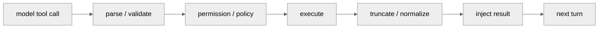

<!-- markdownlint-disable MD060, MD024 -->

# 工具治理横向对比

对应项目章节：

- `hello-claude-code/05-tool-system.md`
- `hello-codex/05-tool-system.md`
- `hello-gemini-cli/05-tool-system.md`
- `hello-opencode/05-tool-system.md`

## 1. 一句话结论

| 项目 | 工具治理模型 |
| --- | --- |
| Claude Code | 工具协议、权限 hook、批处理/流式执行紧耦合在 `query()` 主链路旁 |
| Codex | Rust runtime 中央化治理，approval、sandbox、tool output 截断都在运行时闭环内 |
| Gemini CLI | ToolRegistry + Scheduler + PolicyEngine，模型流结束后批量调度工具 |
| OpenCode | ToolRegistry + Permission + Durable Part，工具状态是持久历史的一部分 |

## 2. 生命周期对比

四个项目都符合这条闭环，但差异在控制点的位置：

| 控制点 | Claude | Codex | Gemini | OpenCode |
| --- | --- | --- | --- | --- |
| 工具声明 | prompt/tool schema 侧 | Rust tool spec | ToolRegistry | ToolRegistry/tools |
| 权限判定 | hook + permission context | approval policy + sandbox | PolicyEngine + scheduler | Permission rule + persisted approval |
| 并发模型 | 支持批次和 streaming executor | futures/turn loop 内控制 | Scheduler 批量调度 | Session loop + durable part |
| 结果归一 | tool_result message | ToolOutput/截断策略 | ToolResult/蒸馏 | part 状态写回 |
| 安全边界 | 反编译快照需谨慎确认 | 最强，sandbox 是核心设计 | policy 清楚但执行仍依赖工具实现 | durable 可审计，交互阻塞成本较高 |

## 3. 代表源码证据

| 项目 | Registry / Schema | Permission / Policy | Execution / Result |
| --- | --- | --- | --- |
| Claude Code | `claude-code/src/Tool.ts:123`, `claude-code/src/tools.ts` | `claude-code/src/hooks/useCanUseTool.tsx`, `claude-code/src/services/tools/toolOrchestration.ts` | `claude-code/src/services/tools/toolExecution.ts`, `claude-code/src/services/tools/StreamingToolExecutor.ts` |
| Codex | `codex/codex-rs/core/src/tools/spec.rs:32` | `codex/codex-rs/core/src/tools/orchestrator.rs:111`, `codex/codex-rs/core/src/exec_policy.rs:234` | `codex/codex-rs/core/src/tools/handlers/unified_exec.rs:170` |
| Gemini CLI | `gemini-cli/packages/core/src/tools/tool-registry.ts:352` | `gemini-cli/packages/core/src/policy/policy-engine.ts` | `gemini-cli/packages/core/src/scheduler/scheduler.ts:191`, `gemini-cli/packages/core/src/scheduler/tool-executor.ts:60` |
| OpenCode | `opencode/packages/opencode/src/tool/registry.ts:36` | `opencode/packages/opencode/src/permission/evaluate.ts:9`, `opencode/packages/opencode/src/permission/index.ts:166` | `opencode/packages/opencode/src/session/index.ts:423` |

## 4. 文档完善要求

每个项目的 `05-tool-system.md` 应固定包含五段：

1. 工具来源：内建、MCP、plugin、skill、custom command。
2. 权限入口：谁做 allow/deny/ask，审批结果是否持久化。
3. 执行模型：串行、并行、批处理、流式执行。
4. 结果回注：如何回到 message/history/part/thread item。
5. 风险点：sandbox 缺口、参数校验、输出截断、权限缓存。

## 5. 合并后的读法

选安全治理优先看 Codex；选可审计 durable history 看 OpenCode；选 prompt/tool 深度编排看 Claude Code；选轻量 TypeScript monorepo 和 policy 可读性看 Gemini CLI。

