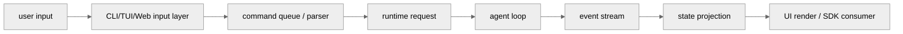

<!-- markdownlint-disable MD060, MD024 -->

# 入口、传输与 UI 状态横向对比

对应项目章节：

- `15-sdk-transport.md`
- `20-repl-and-state.md`
- `21-bridge-system.md`
- `23-input-command-queue.md`

## 1. 为什么这几章需要合并读

用户请求进入 agent 之前，会先经过入口、输入队列、UI 状态和传输协议。单看 agent loop 容易忽略一个事实：很多行为差异不是模型层造成的，而是入口层决定的。

## 2. 对比矩阵

| 项目 | 主入口 | UI/交互 | 传输/桥接 | 状态投影 |
| --- | --- | --- | --- | --- |
| Claude Code | React TUI / SDK / headless | React state + hooks | SDK transport / bridge | stream event 驱动 UI |
| Codex | Rust CLI/TUI/app-server | Ratatui + event loop | JSON event / HTTP / WebSocket | thread event 投影 |
| Gemini CLI | packages/cli + core | Ink TUI | Headless / IDE / MCP | hook + stream callback |
| OpenCode | CLI/TUI/Web/Desktop/serve | 多表面共享 server contract | Hono server / SSE / SDK | Bus/SSE + durable state |

## 3. 代表源码证据

| 项目 | 输入 / 队列 | Runtime 请求 | Event / 状态投影 |
| --- | --- | --- | --- |
| Claude Code | `claude-code/src/query.ts:241`, `claude-code/src/hooks` | `claude-code/src/query.ts:323`, `claude-code/src/services/tools/toolOrchestration.ts` | `claude-code/src/query.ts:337`, `claude-code/src/services/tools/StreamingToolExecutor.ts` |
| Codex | `codex/codex-rs/tui/src/app.rs`, `codex/codex-rs/app-server/src/codex_message_processor.rs:6360` | `codex/codex-rs/core/src/codex.rs:697`, `codex/codex-rs/core/src/codex.rs:4289` | `codex/codex-rs/tui/src/app_server_session.rs:397`, `codex/codex-rs/core/src/codex.rs:5584` |
| Gemini CLI | `gemini-cli/packages/cli/src/ui/hooks/useMcpStatus.ts:15`, `gemini-cli/packages/core/src/core/client.ts:868` | `gemini-cli/packages/core/src/core/client.ts:585`, `gemini-cli/packages/core/src/core/turn.ts:253` | `gemini-cli/packages/core/src/core/client.ts:925`, `gemini-cli/packages/core/src/core/turn.ts:404` |
| OpenCode | `opencode/packages/opencode/src/server/routes/session.ts:819`, `opencode/packages/opencode/src/session/prompt.ts:162` | `opencode/packages/opencode/src/session/prompt.ts:278`, `opencode/packages/opencode/src/session/prompt.ts:2013` | `opencode/packages/opencode/src/session/processor.ts:46`, `opencode/packages/opencode/src/server/routes/session.ts` |

## 4. 生命周期合并图

## 5. 统一章节要求

| 章节 | 统一主题 |
| --- | --- |
| 15 | SDK、transport、headless/server/API 如何复用 runtime |
| 20 | REPL/TUI 与 agent state 如何同步 |
| 21 | bridge、IDE、remote、external host 如何接入 |
| 23 | slash command、自然语言、队列、取消、中断如何进入 loop |

## 6. 横向结论

OpenCode 的入口面最宽，因为 server contract 是中心；Codex 的 runtime 边界最清楚，因为 Rust event protocol 是中心；Claude Code 的 UI 和 agent loop 耦合更深；Gemini CLI 的 core/cli 分层适合阅读和扩展，但需要在文档里补足状态投影细节。

