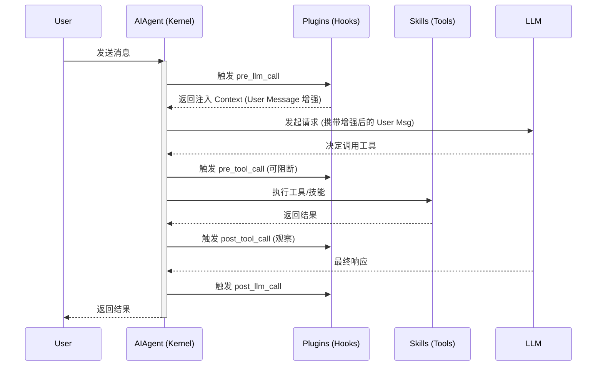

# Hermes 架构解析 (三)：扩展篇 · 插件与技能开发全指南 (v2026.4.16)

本指南旨在通过剖析 Hermes 的内核逻辑（`AIAgent` 运转循环），指导开发者如何编写高性能、低成本的 **技能 (Skills)** 与 **插件 (Plugins)**。v0.10.0 大幅增强了插件能力——新增 Dashboard 插件系统、主题系统、Tool Gateway 托管后端、工具级钩子等。

---

## 1. 核心架构：扩展介入点

在 Hermes 的 6 层架构中，扩展机制主要作用于 **Capability Layer (能力层)** 和 **Control Layer (控制层)**。其介入逻辑如下：



---

## 2. 工具发现：三阶段加载 (v0.10.0)

v0.10.0 中，工具发现由原来的单一阶段拆分为三个阶段（见 `model_tools.py` L29-144）：

```python
# 阶段 1：内置工具
from tools.registry import discover_builtin_tools, registry
discover_builtin_tools()   # AST 扫描 tools/*.py，自动导入含 registry.register() 的模块

# 阶段 2：MCP 工具
from tools.mcp_tool import discover_mcp_tools
discover_mcp_tools()       # 读取 MCP 服务器配置，注册外部工具

# 阶段 3：插件工具
from hermes_cli.plugins import discover_plugins
discover_plugins()         # 加载用户/项目/pip 插件，可注册自定义工具和 Toolset
```

此外，`model_tools.py` 还会在运行时**动态重写工具 Schema**：
- 根据可用的沙盒工具（`daytona`、`modal`）动态调整 `execute_code` 的参数描述
- 当 `web_search` / `web_extract` 不可用时，修改 `browser_navigate` 的描述以提示 LLM 使用浏览器替代

---

## 3. 技能 (Skills)：渐进式披露 (Progressive Disclosure)

Hermes 的技能系统遵循 Anthropic 推荐的**渐进式披露架构**，旨在将 Token 消耗控制在最低。

### 3.1 内核运转逻辑
1.  **Tier 1 (Discovery)**：`skills_list` 工具仅向 LLM 暴露技能的 `name` 和 `description`（存放在 `skills_tool.py` 的内存索引中）。此时 LLM 知道"有这个工具"，但不知道"怎么用"。
2.  **Tier 2 (Activation)**：当 LLM 调用 `skill_view(name)` 时，`skills_tool` 会实时读取 `~/.hermes/skills/<name>/SKILL.md`。
3.  **Tier 3 (Injection)**：读取的内容会通过 `AIAgent` 的 `_manage_skills_context` 逻辑，作为"参考资料"插入到当前的 **System Prompt** 中。这样，技能指令只有在真正被需要时才会占用上下文。

### 3.2 v0.10.0 技能管理增强

- **Skills Guard** (`tools/skills_guard.py`)：为技能执行添加安全防护层，校验技能的 `requires_tools` 依赖、限制高危操作。
- **Skills Hub** (`hermes_cli/skills_hub.py`)：扩展了技能的管理能力——支持从远程仓库发现、安装和更新技能包。

### 3.3 开发实践：编写高效的 SKILL.md
```markdown
---
name: code-architect
description: 分析代码依赖并绘制图表 (仅在需要深度重构建议时调用)
metadata:
  hermes:
    requires_tools: [terminal, read_file]
---

# 运转指令
1. 运行 `grep -r "import" .` 建立初步依赖图。
2. 识别循环依赖并标记为 [WARNING]。
3. 必须输出 Mermaid 格式的图表。
```

---

## 4. 插件 (Plugins)：内核钩子与缓存优化

插件是侵入式的，它们直接运行在 `AIAgent` 的 `_run_conversation_loop` 循环中。

### 4.1 核心机制：`pre_llm_call` 的秘密
Hermes 插件系统的一个精妙设计是：**上下文永远注入到 User Message 尾部，而非 System Prompt。**

*   **源码逻辑**（见 `run_agent.py` L8448-8482）：
    ```python
    # Plugin hook: pre_llm_call
    _pre_results = _invoke_hook("pre_llm_call", ...)
    # 插件返回的 context 被拼接到 original_user_message
    _plugin_user_context = "\n\n".join([r["context"] for r in _pre_results])
    ```
*   **为什么这么做？**
    1.  **Prompt Cache 命中**：System Prompt 在 Hermes 中包含模型指令、工具定义和已加载技能，体积庞大且相对静态。
    2.  **避免失效**：如果插件修改了 System Prompt，每一轮对话都会导致缓存失效，Token 成本飙升。
    3.  **时效性**：将 RAG 知识或系统状态（如 CPU 负载）作为"用户当前感知的环境"喂给 LLM，逻辑上更符合 Tool-use 规范。

### 4.2 工具级钩子：`pre_tool_call` / `post_tool_call` (v0.9.0+)

v0.9.0 起，`model_tools.py` 的 `handle_function_call()` 在每次工具调用前后都会触发钩子：

```python
# model_tools.py L457-517
# 工具执行前
invoke_hook("pre_tool_call", tool_name=name, args=args, task_id=task_id)

# ... 执行工具 ...

# 工具执行后
invoke_hook("post_tool_call", tool_name=name, args=args, result=result, task_id=task_id)
```

**`pre_tool_call` 的阻断能力**：插件可以从 `pre_tool_call` 返回 `{"block": "原因"}` 来阻止工具执行。Hermes 通过 `get_pre_tool_call_block_message()` 检查第一个有效的阻断指令，将其作为工具结果返回给 LLM，而不实际执行该工具。

```python
# 示例：阻止危险的终端命令
def _on_pre_tool_call(tool_name, args, **kwargs):
    if tool_name == "terminal" and "rm -rf" in args.get("command", ""):
        return {"block": "禁止执行破坏性命令"}

def register(ctx):
    ctx.register_hook("pre_tool_call", _on_pre_tool_call)
```

### 4.3 完整钩子一览 (v0.10.0)

| 钩子 | 触发时机 | 返回值 |
|------|---------|--------|
| `pre_llm_call` | 每轮对话 LLM 调用前 | `{"context": "..."}` 注入用户消息 |
| `post_llm_call` | LLM 响应后 | 忽略 |
| `pre_tool_call` | 每次工具执行前 | `{"block": "原因"}` 阻断执行；或忽略 |
| `post_tool_call` | 每次工具返回后 | 忽略 |
| `on_session_start` | 会话开始时 | 忽略 |
| `on_session_end` | 会话结束时 | 忽略 |

### 4.4 插件提供的 Toolset

插件不仅可以注册单个工具，还可以定义完整的 **Toolset**（工具集）。通过 `hermes_cli.plugins.get_plugin_toolsets()`，插件定义的工具集会被合并到全局 Toolset 配置中，与内置的 `web`、`terminal`、`file` 等 Toolset 同等对待。

### 4.5 实践：开发一个系统监控插件
**`~/.hermes/plugins/sys_monitor/__init__.py`**:
```python
def _on_pre_llm_call(**kwargs):
    # 这一行返回的内容会直接被 AIAgent 塞进当前 turn 的用户消息里
    cpu = get_cpu_load() 
    return {"context": f"[系统实时状态: CPU负载 {cpu}%]"}

def _on_pre_tool_call(tool_name, args, **kwargs):
    # 观察所有工具调用
    log_tool_usage(tool_name, args)

def register(ctx):
    ctx.register_hook("pre_llm_call", _on_pre_llm_call)
    ctx.register_hook("pre_tool_call", _on_pre_tool_call)
```

---

## 5. Dashboard 插件系统 (v0.9.0+)

这是 v0.9.0 引入的**重大新能力**——插件可以向 Web Dashboard 注入自定义 UI 标签页。

### 5.1 架构概览

```
plugins/
  my-plugin/
    __init__.py          # Python 端：钩子注册
    dashboard/
      manifest.json      # 声明式清单：标签页名称、路径、入口 JS
      dist/
        index.js         # 打包后的前端组件
        styles.css       # 可选：自定义样式
      api.py             # 可选：插件专属 API 端点
```

### 5.2 Manifest 格式

```json
{
  "name": "my-plugin",
  "label": "我的插件",
  "tab_path": "/dashboard/my-plugin",
  "position": 50,
  "entry_js": "dist/index.js",
  "entry_css": "dist/styles.css",
  "api": "api.py"
}
```

- **`position`**：标签页排序权重，数值越小越靠前
- **`api`**：可选的 Python 模块，由 `web_server.py` 加载并注册为 API 路由

### 5.3 前端注册机制

Dashboard 在启动时通过 `/api/dashboard/plugins` 获取所有插件清单，然后依次加载各插件的 JS/CSS 资源。插件通过全局对象注册自身：

```javascript
// 插件入口 JS
const MyPluginTab = () => {
  const sdk = window.__HERMES_PLUGIN_SDK__;  // 访问插件 SDK
  // sdk 提供 API 调用、状态管理、主题变量等
  return <div>自定义内容</div>;
};

window.__HERMES_PLUGINS__.register("my-plugin", MyPluginTab);
```

- **`window.__HERMES_PLUGINS__`**：插件注册表，Dashboard 从中读取组件并渲染为标签页
- **`window.__HERMES_PLUGIN_SDK__`**：SDK 对象，提供与 Hermes 后端通信的统一接口

### 5.4 示例

Hermes 自带 `plugins/example-dashboard/`，展示了完整的 Dashboard 插件开发流程。

---

## 6. Dashboard 主题系统 (v0.10.0)

Web Dashboard 新增了主题系统，支持运行时切换外观：

- **主题预设**：存放于 `web/src/themes/`，每个主题定义颜色、字体等 CSS 变量
- **ThemeSwitcher 组件** (`web/src/components/ThemeSwitcher.tsx`)：用户可在 Dashboard 界面实时切换主题
- **服务端自定义主题**：服务器可通过 API 下发自定义主题配置，实现企业品牌定制

---

## 7. Tool Gateway：托管后端模式 (v0.10.0)

v0.10.0 引入了全新的扩展模式——**Tool Gateway**（工具网关）。这不是传统意义上的"工具"或"技能"，而是一种**托管后端 (Managed Backend)** 模式。

### 7.1 工作原理

Nous Portal 订阅用户可以通过 Tool Gateway 获得托管版本的以下工具：
- Web 搜索
- 图像生成
- 文字转语音 (TTS)
- 浏览器操作

工具本身的接口不变，但后端执行由 Nous Portal 服务器承担——无需用户自行配置 API Key 或部署服务。

### 7.2 核心实现

- **`tools/managed_tool_gateway.py`**：网关工具的入口，处理与 Nous Portal 的通信
- **`tools/tool_backend_helpers.py`**：后端解析辅助函数，决定每个工具使用本地后端还是网关后端
- **配置方式**：在 `config.yaml` 中按工具粒度设置 `use_gateway: true`

### 7.3 设计意义

这是一种新的扩展范式：**工具的"接口"与"后端"分离**。同一个 `web_search` 工具，可以由本地 Exa API、Firecrawl 或 Nous Portal Gateway 提供后端，对 LLM 完全透明。

---

## 8. 新增工具扩展模式 (v0.10.0)

v0.10.0 增加了多个工具文件，体现了不同的扩展模式：

| 工具文件 | 扩展模式 | 说明 |
|---------|---------|------|
| `managed_tool_gateway.py` | 托管后端 | Nous Portal 网关 |
| `tool_backend_helpers.py` | 后端解析 | 本地/网关后端路由 |
| `clarify_tool.py` | 交互式工具 | 向用户发起追问 |
| `memory_tool.py` | 记忆操作 | 长期记忆 CRUD |
| `homeassistant_tool.py` | IoT 集成 | Home Assistant 控制 |
| `cronjob_tools.py` | 定时任务 | Cron 计划执行 |
| `mcp_oauth.py` | 认证扩展 | MCP OAuth 支持 |
| `browser_providers/*` | 可插拔后端 | 浏览器多后端：base、browserbase、browser_use、firecrawl |

**浏览器 Provider 模式** 值得特别关注：`browser_providers/` 目录抽象出了统一的浏览器接口，不同后端（本地 Playwright、Browserbase 云端、Browser Use AI、Firecrawl）实现同一接口，工具层无需感知差异。

---

## 9. 扩展能力的"权重"与冲突

当多个扩展同时工作时，Hermes 遵循以下优先级：
1.  **System Prompt (最高)**：由 `AIAgent._build_system_prompt()` (L3335) 内核定义，包含固定的工具调用规则。
2.  **Skill Context (次之)**：由 `skill_view` 动态注入，作为 System Prompt 的补充。
3.  **Plugin Context (灵活)**：注入在 User Message 中，作为 LLM 理解当前环境的"临时感知"。
4.  **Tool Gateway (透明)**：后端切换对 LLM 不可见，不影响上下文权重。

### 冲突处理原则
*   如果插件修改了全局变量（如 `self.model`），它将影响后续整个生命周期的决策。
*   如果多个插件同时注册了 `pre_llm_call`，Hermes 会按目录名排序依次执行，并用 `\n\n` 拼接所有返回的 `context`。
*   如果多个插件注册了 `pre_tool_call` 且都返回阻断指令，仅第一个有效（`get_pre_tool_call_block_message()` 取首个）。

---

## 10. 调试建议

要观察机制是否按预期运转，可以使用以下命令：
*   **查看插件加载状态**：`hermes status`。
*   **查看当前 Session 的工具集**：`/tools` (在交互式 Shell 中)。
*   **跟踪 Hook 注入**：启动时设置 `export HERMES_LOG_LEVEL=DEBUG`，观察 `AIAgent` 日志中 `pre_llm_call results` 的输出。
*   **查看工具发现阶段**：DEBUG 日志中搜索 `discover_builtin_tools`、`discover_mcp_tools`、`discover_plugins` 可追踪三阶段加载过程。
*   **Dashboard 插件调试**：浏览器控制台检查 `window.__HERMES_PLUGINS__` 对象，确认插件已注册。
