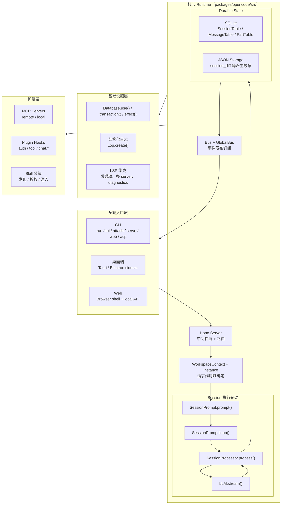

# OpenCode 架构全景：目录结构、分层模型、核心抽象

> 基于 `opencode` `v1.3.2`（tag `v1.3.2`，commit `0dcdf5f529dced23d8452c9aa5f166abb24d8f7c`）源码校对

---

## 1. 整体架构总览



---

## 2. 目录结构与核心模块

### 2.1 packages/opencode/src 主目录

| 目录/文件 | 职责 |
|---------|------|
| `index.ts` | CLI middleware 入口，Log/init/migration 注册 |
| `global/index.ts` | XDG 目录、缓存版本、进程级全局路径计算 |
| `config/config.ts` | Config.get() 主实现：多来源配置合并、plugin 加载 |
| `config/paths.ts` | 项目配置发现（opencode.jsonc）和 .opencode 目录遍历 |
| `server/server.ts` | Hono app：middleware 链、路由挂载 |
| `server/routes/session.ts` | /session/:id/message 等核心 session 路由 |
| `server/routes/event.ts` | /event SSE 端点（Bus 投影） |
| `server/routes/global.ts` | /global/event 端点（GlobalBus 投影） |
| `session/prompt.ts` | prompt() / loop()：输入编译和执行状态机 |
| `session/processor.ts` | processor.process()：消费单轮 LLM 流事件 |
| `session/llm.ts` | LLM.stream() 封装、provider 调用 |
| `session/system.ts` | system prompt 编译 |
| `session/index.ts` | Session.updateMessage() / updatePart() 落库 |
| `session/message-v2.ts` | MessageV2 durable 模型和 toModelMessages() 投影 |
| `session/status.ts` | SessionStatus（busy/retry/idle）实例作用域状态 |
| `session/compaction.ts` | Compaction 自愈机制 |
| `session/retry.ts` | 重试策略与退避 |
| `session/revert.ts` | 文件快照 + history 清理 |
| `session/summary.ts` | Session 级别文件变更追踪与摘要管理 |
| `session/session.sql.ts` | SQLite 表结构定义 |
| `tool/registry.ts` | ToolRegistry：内建工具、自定义工具、plugin 工具汇总 |
| `tool/read.ts` | ReadTool：文件读取 |
| `tool/write.ts` | WriteTool：文件写入 |
| `tool/edit.ts` | EditTool：行级别编辑 |
| `tool/apply_patch.ts` | ApplyPatchTool：patch 应用 |
| `tool/task.ts` | TaskTool：subagent 执行 |
| `tool/skill.ts` | SkillTool：技能加载 |
| `tool/bash.ts` | Bash/Shell 工具 |
| `tool/lsp.ts` | LspTool（实验态） |
| `tool/external-directory.ts` | external_directory 权限检测 |
| `provider/provider.ts` | provider prompt 编译和模型调用封装 |
| `mcp/index.ts` | MCP 命名空间：五状态机、OAuth、tool/prompt/resource 投影 |
| `mcp/auth.ts` | MCP 凭证存储 |
| `plugin/index.ts` | Plugin.init() 和 plugin 动态加载 |
| `skill/index.ts` | Skill service：发现、缓存、授权 |
| `skill/discovery.ts` | 远端 skill pack 下载 |
| `bus/index.ts` | Bus（instance-scoped） |
| `bus/global.ts` | GlobalBus（进程级） |
| `storage/db.ts` | Database.use() / transaction() / effect() SQLite 封装 |
| `storage/storage.ts` | JSON Storage（session_diff 等派生数据） |
| `project/bootstrap.ts` | InstanceBootstrap() 固定服务装配顺序 |
| `project/instance.ts` | Instance / WorkspaceContext 请求作用域绑定 |
| `project/project.ts` | Project.fromDirectory()、sandbox 发现 |
| `lsp/index.ts` | LSP 门面与调度层 |
| `lsp/server.ts` | LSPServer：扩展名匹配、root 发现、spawn 方式 |
| `lsp/client.ts` | LSP client：JSON-RPC stdio 通信 |
| `permission/index.ts` | Permission 规则引擎：allow/deny/ask |
| `question/index.ts` | Question 机制：问题澄清 |
| `snapshot/index.ts` | Snapshot 快照管理 |
| `worktree/index.ts` | Worktree 创建、bootstrap、ready/failed 事件 |
| `vcs/index.ts` | VCS/git 集成 |
| `util/log.ts` | 结构化日志 |
| `util/fn.ts` | zod schema 封装函数 |

---

## 3. 分层模型

### 3.1 六层架构

| 层 | 层级名称 | 核心职责 |
|----|---------|---------|
| L1 | 多端入口层 | CLI/TUI/Web/Desktop/ACP 统一收束到 HTTP/SSE contract |
| L2 | HTTP Server 层 | 认证、日志、CORS、WorkspaceContext、Instance 绑定、路由分发 |
| L3 | Session 执行骨架 | prompt 编译、loop 编排、processor 流处理、LLM 调用 |
| L4 | Durable State 层 | SQLite/JSON Storage 持久化、Bus 事件发布、MessageV2 投影 |
| L5 | 扩展接口层 | MCP、Plugin、Skill、Custom Tool 汇入统一接口 |
| L6 | 基础设施层 | Log、Bus/GBus、Effect、SQLite 封装、LSP |

---

## 4. 核心抽象

### 4.1 Session：Durable 执行容器

`Session.Info`（`session/index.ts:122-164`）关键字段：

| 字段 | 语义 |
|------|------|
| `projectID` | 归属工程 |
| `workspaceID` | 归属 workspace |
| `directory` | 当前请求目录 |
| `parentID` | 父 session（fork/child）|
| `permission` | 当前 session 权限规则集 |
| `summary` | 加权 additions/deletions/files 计数 |
| `revert` | 回滚状态：messageID / partID / snapshot / diff |

**关键性质**：Session 不是"聊天框"，而是 durable 执行边界对象。

### 4.2 MessageV2：消息头与部件分离

| 类型 | 职责 |
|------|------|
| `User` header | agent / model / system / format / variant |
| `Assistant` header | parentID / providerID / tokens / cost / finish / error |
| `Part[]` | text / reasoning / tool / step-start / step-finish / patch / subtask / compaction |

**关键性质**：message 是 envelope/header，part 是 body/typed nodes。

### 4.3 ToolPart.state：工具调用状态机

四状态（`message-v2.ts:267-344`）：

| 状态 | 携带数据 |
|------|---------|
| `pending` | `input` 结构化参数 |
| `running` | `input` + `title` + `metadata` + `time.start` |
| `completed` | `output` + `attachments` + `metadata` + `time.start/end` |
| `error` | `error` 文本 + `time.start/end` |

### 4.4 Provider：模型调用抽象

`provider/provider.ts` 承担：
- 模型发现：`getProvider()`、`getModel()`、`getLanguage()`
- 认证管理：`ProviderAuth` 支持 env/api/custom/provider auth
- 请求构造：`streamText()` 参数拼装、middleware 包装
- 兼容补丁：OpenAI OAuth、LiteLLM、GitLab Workflow、tool call repair

### 4.5 Instance：请求作用域单例

- 每个 `directory` 有独立缓存的 instance
- 包含：`worktree`、`project`、`bus`、`permission`、`sessionStatus`、`lsp` 等作用域单例
- 通过 `WorkspaceContext.provide()` 和 `Instance.provide()` 在请求入口处绑定

---

## 5. Bun Runtime 能力使用

### 5.1 Bun.serve

`server/server.ts` 使用 `Bun.serve()`：

```ts
Bun.serve({
  fetch: app.fetch,
  websocket,
  port: opts.port,
  hostname: opts.hostname,
})
```

**优势**：原生 HTTP/1.1 + HTTP/2、内置 WebSocket、自动 TLS

### 5.2 Bun.spawn

`mcp/index.ts`、`tool/bash.ts` 使用 `Bun.spawn()`：

```ts
Bun.spawn({
  cmd: args,
  cwd: Instance.directory,
  env: { ...process.env, ...env },
  stdout: "pipe",
  stderr: "pipe",
})
```

### 5.3 Bun 与 Node.js 差异点

| 能力 | Bun | Node.js |
|------|-----|---------|
| HTTP Server | `Bun.serve()` 原生高性能 | `node:http` 或 Express/Fastify |
| WebSocket | 内置 `websocket` 选项 | `ws` 库 |
| Shell | `Bun.$` 模板语法 | `child_process.exec/spawn` |
| SQLite | 内置 `Bun.sql()` | `better-sqlite3` |
| 构建 | `bun build` 原生 ESM/CJS | `esbuild`/`webpack` |

---

## 6. 关键函数清单

| 函数/类 | 文件坐标 | 功能描述 |
|---------|---------|---------|
| `SessionPrompt.prompt()` | `session/prompt.ts:162-188` | 外部请求入口，先落 durable user message，再决定是否进入 loop |
| `SessionPrompt.loop()` | `session/prompt.ts:242-756` | Session 级状态机：处理 subtask/compaction/overflow，调度 normal round |
| `SessionProcessor.process()` | `session/processor.ts:46-425` | 消费单轮 LLM 流事件，写入 reasoning/text/tool/step/patch |
| `LLM.stream()` | `session/llm.ts:48-285` | 封装 provider 请求，构造 streamText 参数 |
| `Session.updateMessage()` | `session/index.ts:686-706` | upsert message 头到 SQLite |
| `Session.updatePart()` | `session/index.ts:755-776` | upsert part 快照到 PartTable |
| `Session.updatePartDelta()` | `session/index.ts:778-789` | 发布 part 增量事件（不写库）|
| `MessageV2.toModelMessages()` | `message-v2.ts:559-792` | 把 durable history 投影成 AI SDK ModelMessage[] |
| `MessageV2.filterCompacted()` | `message-v2.ts:882-898` | 过滤已压缩的历史，返回活动历史 |
| `Database.use()` | `storage/db.ts:121-146` | 提供 DB 上下文，自动封装 transaction/effect |
| `Bus.publish()` | `bus/index.ts:41-64` | 发布事件到实例订阅者和 GlobalBus |
| `ToolRegistry.tools()` | `tool/registry.ts:85-190` | 汇总内建工具、plugin 工具、MCP 工具、custom 工具 |
| `Plugin.init()` | `plugin/index.ts:47-165` | 初始化 plugin hooks，触发 config hook |
| `MCP.tools()` | `mcp/index.ts:606-646` | 把 MCP tool 转换成 AI SDK Tool |
| `InstanceBootstrap()` | `project/bootstrap.ts:15-24` | 固定顺序初始化各服务 |
| `Project.fromDirectory()` | `project/project.ts` | 发现 sandbox、project.worktree、sandboxes[] |

---

## 7. 架构设计哲学：固定骨架 + 晚绑定

### 固定骨架 6 个硬编码交接点

| 固定点 | 被写死的事情 |
|-------|------------|
| 输入先落 durable history | `prompt()` 总是先 `createUserMessage()` |
| 每轮从历史重建状态 | `loop()` 每轮重新 `MessageV2.filterCompacted(MessageV2.stream())` |
| 分支种类固定 | loop 只识别 subtask/compaction/overflow/normal round |
| assistant skeleton 先写 | normal round 必须先 `Session.updateMessage(assistant skeleton)` |
| 单轮只消费模型流 | `processor` 只围绕 `LLM.stream().fullStream` 写 |
| 投影方式固定 | 模型总是看到 `MessageV2.toModelMessages()` 产物 |

### 晚绑定点

| 晚绑定点 | 绑定时机 |
|---------|---------|
| transport | 最外层：CLI/TUI/Web/Desktop/ACP 各自选择 |
| request scope | 进入 server 后：WorkspaceContext + Instance.provide() |
| agent/model/variant | loop 执行前：`Agent.get()` + `Provider.getModel()` |
| system prompt | `LLM.stream()` 前：多层拼接 |
| tool set | 两次裁剪：`resolveTools()` + `LLM.resolveTools()` |

---

## 8. 优缺点分析

### 优点

1. **Durable 天然支持恢复**：每步都压回 durable history，崩溃后只需重放
2. **多宿主复用成本低**：transport 只需接到 HTTP/SSE contract
3. **扩展集中管理**：Plugin/MCP/Skill 都汇入统一接口，不撕裂主骨架
4. **Instance 作用域隔离**：每个 workspace/project 有独立状态，互不干扰
5. **Bun runtime 高性能**：原生 HTTP/WS、SQLite、流处理优势

### 缺点/限制

1. **新分支类型需改 loop()**：想增加 session 级分支，通常要直接改 `prompt.ts`
2. **新 durable node 困难**：完全独立于 `MessageV2.Part` 的对象会非常别扭
3. **兼容性集中在少数节点**：provider 兼容、tool 兼容、消息投影兼容堆积在 `llm.ts`
4. **Plugin 安全边界弱**：默认是 trusted code execution，不适合运行不信任代码
5. **多数 hook 无隔离**：坏 plugin 可直接打断主链路
