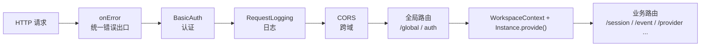
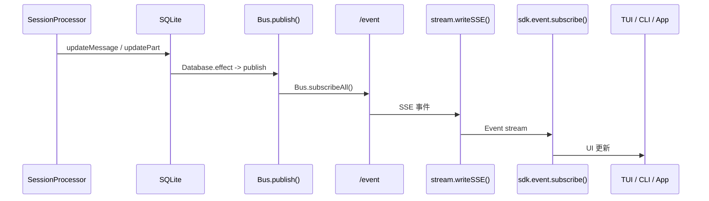

# OpenCode 启动链路：入口点、CLI/TUI/Web 多表面初始化、Server 启动顺序

> 基于 `opencode` `v1.3.2`（tag `v1.3.2`，commit `0dcdf5f529dced23d8452c9aa5f166abb24d8f7c`）源码校对

---

## 1. 多端入口总览

| 入口 | 代码坐标 | 传输方式 | 最后进入哪里 |
|------|---------|---------|-------------|
| 默认 TUI (`opencode`) | `src/index.ts:126-151`、`cli/cmd/tui/thread.ts:66-231` | 本地 worker RPC，必要时也可起外部 HTTP server | 同一套 `Server.fetch()` / `/event` 协议 |
| 一次性 `run` | `cli/cmd/run.ts:221-675` | 本地 in-process fetch 或远端 HTTP attach | `session.prompt` / `session.command` |
| `attach <url>` | `cli/cmd/tui/attach.ts:9-88` | 远端 HTTP + SSE | 远端 server 的 `/session`、`/event` |
| `serve` | `cli/cmd/serve.ts:9-23` | 纯 HTTP server | `Server.listen()` |
| `web` | `cli/cmd/web.ts:31-80` | 本地 HTTP server，再打开浏览器 | `Server.listen()`，未知路径代理到 `app.opencode.ai` |
| `acp` | `cli/cmd/acp.ts:12-69`、`acp/agent.ts` | stdin/stdout NDJSON + 本地 HTTP SDK | 同一套 `/session`、`/permission`、`/event` |
| 桌面端 | `packages/desktop/src/index.tsx:432-458`、`packages/desktop-electron/src/main/server.ts:32-57` | sidecar server + `@opencode-ai/app` | 同一套 HTTP/SSE server 连接 |

**结论**：OpenCode 没有多套 runtime，只有多套 transport 和宿主。

---

## 2. 四段启动链路

### 2.1 启动阶段总览

| 阶段 | 代码坐标 | 真正在做什么 |
|------|---------|------------|
| import 阶段 | `global/index.ts:14-40` | 准备 XDG 目录、缓存版本、和 cache version 校验 |
| CLI middleware 阶段 | `index.ts:67-123` | 初始化日志、环境变量、首次 SQLite/JSON migration |
| 配置编译阶段 | `config/config.ts:79-260`、`config/paths.ts:10-144` | 按优先级叠加 config，装载 .opencode 下的 commands/agents/modes/plugins |
| 实例 bootstrap 阶段 | `project/bootstrap.ts:15-30` | 固定顺序初始化 Plugin、Format、LSP、File、Watcher、VCS、Snapshot |

---

## 3. import 阶段

`global/index.ts:14-40` 在模块加载时就做了两件事：

1. 计算 `Global.Path.data/cache/config/state/log/bin`
2. 确保这些目录存在，并校验 `cache/version`

**说明**：OpenCode 不是等命令 handler 里才懒创建工作目录，而是在进程 import 阶段就先把配置根目录、日志目录、缓存目录、二进制缓存目录全部准备好。

---

## 4. CLI middleware 阶段

`index.ts:50-123` 当前最重要的不是命令注册，而是全局 middleware：

1. `Log.init(...)` 打开日志系统
2. 写入 `AGENT=1`、`OPENCODE=1`、`OPENCODE_PID` 环境变量
3. 打启动日志
4. 检查 `Global.Path.data/opencode.db`
5. 若数据库不存在，则执行一次性迁移（JSON -> SQLite）

---

## 5. 默认 TUI 入口

`cli/cmd/tui/thread.ts:66-231` 把"本地 worker 模式"和"外部 server 模式"统一成同一套前端依赖：

### 5.1 TUI 主线程不直接碰 runtime

`132-169` 会先启动 `Worker`，通过 `Rpc.client()` 与 worker 通信。

### 5.2 worker 暴露三类能力

`cli/cmd/tui/worker.ts:101-151` 暴露了：

1. `fetch`：把任意 HTTP 请求转发给 `Server.Default().fetch()`
2. `event`：把本地 `/event` 订阅转成 RPC 事件
3. `server`：按需起真实 `Server.listen()`

### 5.3 UI 自己并不知道后面是本地还是远端

`thread.ts:186-223` 最终只把 `{ url, fetch, events }` 交给 `tui()`。`tui()` 消费的是抽象后的 SDK provider。

**这就是 OpenCode TUI 的核心设计**：UI 永远只面对 session 协议，不面对 session 实现。

---

## 6. `run` 命令：两条 transport 路径

`cli/cmd/run.ts:221-675` 的核心结构是**输入整理 → transport 选择 → SDK 请求 → 事件消费**四步。

### 6.1 本地模式（默认）

```ts
// run.ts:667-673
const fetchFn = async (input, init) =>
  Server.Default().fetch(new Request(input, init))
```

直接调 Hono `app.fetch()`，整个过程没有任何网络 IO。

### 6.2 远端模式（`--attach <url>`）

```ts
// run.ts:655-664
createOpencodeClient({ baseUrl: args.attach, headers: { Authorization: `Basic ${credentials}` } })
```

经过真实 TCP 栈，directory 必须显式通过 `x-opencode-directory` header 传给 server。

---

## 7. Server 启动顺序

### 7.1 `Server.createApp()` 的中间件链



### 7.2 上下文绑定

`server.ts:192-218`：

1. 从 query `workspace` 或 header `x-opencode-workspace` 取 `workspaceID`
2. 从 query `directory` 或 header `x-opencode-directory` 取目录
3. 进入 `WorkspaceContext.provide(...)`
4. 再进入 `Instance.provide({ directory, init: InstanceBootstrap, fn })`

从这一层往后，路由里读到的 `Instance.directory`、`Instance.worktree`、`Instance.project` 对应的就是当前请求指向的工程。

---

## 8. `InstanceBootstrap()` 固定服务装配

`project/bootstrap.ts:15-24` 固定启动顺序：

1. `Plugin.init()`
2. `ShareNext.init()`
3. `Format.init()`
4. `LSP.init()`
5. `File.init()`
6. `FileWatcher.init()`
7. `Vcs.init()`
8. `Snapshot.init()`

**固定装配、延迟执行**：bootstrap 的风格是先把服务图挂好，具体执行延迟到首次命中。

---

## 9. 事件流：SSE 与 Bus

### 9.1 两层事件作用域

| 接口 | 作用域 | 代码坐标 |
|------|-------|---------|
| `/event` | 当前 Instance | `server/routes/event.ts:13-84` |
| `/global/event` | 全局（跨 Instance）| `server/routes/global.ts:43-124` |

### 9.2 SSE 链路



---

## 10. 关键源码定位

| 主题 | 源码文件 |
|------|---------|
| CLI 入口 | `packages/opencode/src/index.ts` |
| 默认命令 | `cli/cmd/tui/thread.ts` |
| TUI worker | `cli/cmd/tui/worker.ts` |
| run 命令 | `cli/cmd/run.ts` |
| attach 命令 | `cli/cmd/tui/attach.ts` |
| serve 命令 | `cli/cmd/serve.ts` |
| web 命令 | `cli/cmd/web.ts` |
| ACP | `cli/cmd/acp.ts`、`acp/agent.ts` |
| Server + 中间件 | `server/server.ts` |
| Session 路由 | `server/routes/session.ts` |
| Event SSE | `server/routes/event.ts` |
| Global SSE | `server/routes/global.ts` |
| Instance bootstrap | `project/bootstrap.ts` |
| Config 编译 | `config/config.ts` |
| XDG 目录 | `global/index.ts` |
| SQLite 封装 | `storage/db.ts` |
