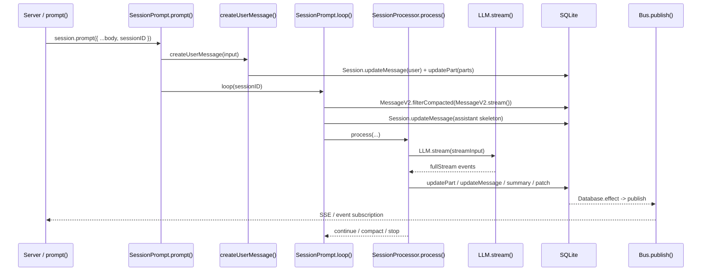
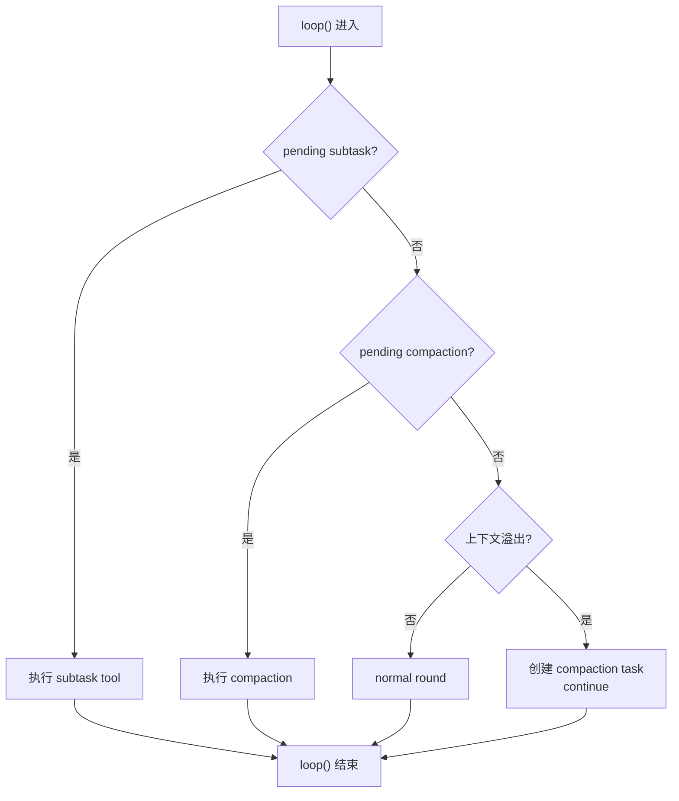
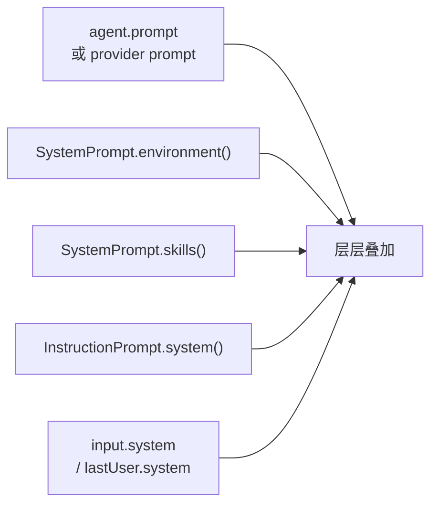

# OpenCode 核心执行循环：Session Loop、Prompt 编译、LLM 调用、流式响应处理

> 基于 `opencode` `v1.3.2`（tag `v1.3.2`，commit `0dcdf5f529dced23d8452c9aa5f166abb24d8f7c`）源码校对

---

**目录**

- [1. 执行链路总览](#1-执行链路总览)
- [2. `prompt()` 主流程](#2-prompt-主流程)
- [3. 输入编译：`createUserMessage()`](#3-输入编译createusermessage)
- [4. `loop()` 状态机](#4-loop-状态机)
- [5. `SessionProcessor.process()`](#5-sessionprocessorprocess)
- [6. `LLM.stream()`](#6-llmstream)
- [7. 关键函数清单](#7-关键函数清单)

---

## 1. 执行链路总览



---

## 2. `prompt()` 主流程

`session/prompt.ts:162-188` 只有 27 行，但执行顺序是硬编码的：

1. `Session.get(input.sessionID)` 取 session
2. `SessionRevert.cleanup(session)` 清理可能遗留的 revert 临时状态
3. `createUserMessage(input)` 把这次输入编译并写进 durable history
4. `Session.touch(input.sessionID)` 更新时间戳
5. 把旧的 `tools` 输入翻译成 `Permission.Ruleset`
6. 判断 `noReply`：如果只想落 user message，不想继续推理，就直接返回；否则才进入 `loop({ sessionID })`

**关键点**：

- `revert cleanup` 一定发生在新输入之前
- `createUserMessage()` 一定发生在 `loop()` 之前，loop 随后读取的是 durable history

---

## 3. 输入编译：`createUserMessage()`

`session/prompt.ts:986-1386` 把用户输入编译成 durable parts。

### 3.1 Part 编译路径

| part 类型 | 编译行为 |
|---------|---------|
| `text` | 原样直通 |
| `file` | 文本文件执行 `ReadTool`，内容内联成 synthetic text；目录列出条目；二进制转 data URL |
| `agent` | 生成 synthetic text 提示模型调用 task 工具 |
| `subtask` | 原样直通，等 `loop()` 识别 |
| MCP resource | 先读取资源，再写成 synthetic text + 原始 file part |

### 3.2 文件展开逻辑

`prompt.ts:1126-1242` 对文本文件会：

1. 还原文件 URL 成本地路径
2. 如果带了 `start/end` 行号范围，转成 `ReadTool` 的 `offset/limit`
3. 执行 `ReadTool.execute()` 获取文件内容
4. 把 `result.output` 写成 synthetic text
5. 保留原始 `file` part

### 3.3 路径解析规则

`prompt.ts:205-209` 有两条规则：

1. `~/` 开头按用户 home 目录展开
2. 其他相对路径都以 `Instance.worktree` 为根做 `path.resolve()`

---

## 4. `loop()` 状态机

`session/prompt.ts:242-756` 是 Session 级状态机。

### 4.1 Session 级并发闸门

| 操作 | 函数 | 语义 |
|------|------|------|
| 第一次进入占住运行权 | `start(sessionID)` | 创建 `AbortController`，建 `callbacks` 队列 |
| 恢复原 loop 时重用 abort signal | `resume(sessionID)` | 直接取出已有的 `abort.signal` |
| 释放运行态 | `cancel(sessionID)` | `abort.abort()`，状态置回 `idle` |

**同一 session 同时只有一条主循环在推进**。

### 4.2 每轮状态推导

`session/prompt.ts:291-329`：

1. `msgs = filterCompacted(stream(sessionID))` 从 durable history 重放
2. 从尾到头扫描，推导 `lastUser`、`lastAssistant`、`lastFinished`、`tasks`
3. 满足"最近 assistant 已完整结束"就退出

### 4.3 分支判断顺序



### 4.4 normal round 的执行

`session/prompt.ts:571-708`：

1. `insertReminders()` 注入 plan/build 模式提醒
2. 先落一条 assistant skeleton
3. 创建 `SessionProcessor`
4. `resolveTools()` 构造本轮可执行工具集
5. 拼 system prompt（多层叠加）
6. `processor.process()` 消费 LLM 流事件

---

## 5. `SessionProcessor.process()`

`session/processor.ts:46-425` 充当"流事件到 durable writes 的翻译器"。

### 5.1 AI SDK fullStream 21 种状态

| 分组 | 状态 | OpenCode 处理 |
|------|------|--------------|
| 文本 | `text-start/delta/end` | 创建 text part，增量广播，收尾写快照 |
| 推理 | `reasoning-start/delta/end` | 创建 reasoning part，增量广播，收尾写快照 |
| 工具 | `tool-input-start/delta/end` | 当前忽略（不持久化参数生成过程）|
| 工具 | `tool-call` | pending → running，做 doom-loop 检测 |
| 工具 | `tool-result/error` | running → completed/error |
| Step | `start-step` | 记录 snapshot |
| Step | `finish-step` | 写 step-finish part、patch、summary、overflow 检测 |
| 生命周期 | `start` | session status 设为 busy |
| 生命周期 | `finish` | 当前忽略 |
| 生命周期 | `error` | 进入 retry/stop/compact 分支 |

### 5.2 tool part 状态机

```
pending → running → completed
                └→ error
```

### 5.3 doom loop 检测

`session/processor.ts:21, 103-117`：

```typescript
const DOOM_LOOP_THRESHOLD = 3

// 在 tool-call 事件处理中：
const lastThree = parts.slice(-DOOM_LOOP_THRESHOLD)
if (lastThree.length === DOOM_LOOP_THRESHOLD &&
    lastThree.every(p => p.type === "tool"
                      && p.tool === value.toolName
                      && JSON.stringify(p.state.input) === JSON.stringify(value.input))) {
  await Permission.ask({ permission: "doom_loop", ... })
}
```

连续 3 次**完全相同**的工具名 + 参数（JSON 严格匹配）才触发权限询问。这比 Gemini CLI 的 `loopDetector`（基于 LLM 分析的模式检测）更保守但更精确。

### 5.4 重试策略

`processor.ts:354-377` 中的错误处理区分两类错误：

| 错误类型 | 处理方式 | 代码位置 |
|----------|----------|----------|
| `ContextOverflowError` | 不重试，设置 `needsCompaction = true` | `processor.ts:354-360` |
| 可重试 API 错误 | 指数退避重试 | `processor.ts:362-377` |
| 不可重试 API 错误 | 标记 error，return "stop" | `processor.ts:375` |

**退避策略** — `session/retry.ts:26-60`：

```typescript
export function delay(attempt: number, error?: MessageV2.APIError) {
  // 优先使用服务器端 retry-after 头
  if (error?.data.responseHeaders) {
    const retryAfterMs = error.data.responseHeaders["retry-after-ms"]
    if (retryAfterMs) return Number.parseFloat(retryAfterMs)
  }
  // 否则指数退避，上限 30s
  return Math.min(
    RETRY_INITIAL_DELAY * Math.pow(RETRY_BACKOFF_FACTOR, attempt - 1),
    RETRY_MAX_DELAY_NO_HEADERS
  )
}
```

特色：优先使用服务器端 `retry-after-ms` / `retry-after` 响应头，而非盲目退避。

### 5.5 SQLite 写入时机

| 操作 | 触发函数 | 写入目标 | 是否在关键路径 |
|------|----------|----------|----------------|
| 用户消息创建 | `Session.updateMessage()` | MessageTable | 是（loop 前） |
| 助手消息骨架 | `Session.updateMessage()` | MessageTable(finish=null) | 是 |
| 工具开始 | `Session.updatePart()` | PartTable(status=running) | 是 |
| 工具完成 | `Session.updatePart()` | PartTable(status=completed) | 是 |
| **文本增量** | `Session.updatePartDelta()` | **仅 Bus 推送，不写 DB** | 否 |
| 步骤完成 | `Session.updateMessage()` | MessageTable(finish, tokens) | 是 |

**关键折中**：text delta 只通过 Bus 推送，不持久化到 SQLite。这避免了高频 token 流导致的 DB I/O 瓶颈，但代价是 crash 时可能丢失未完成步骤的文本增量。

### 5.6 Bus 事件系统

`bus/index.ts:41-65` 是 OpenCode 的观察者层，所有状态变更通过 Bus 发布：

```typescript
export async function publish<Def extends BusEvent.Definition>(
  def: Def, properties: z.output<Def["properties"]>
) {
  const payload = { type: def.type, properties }
  for (const sub of state().subscriptions.get(def.type) ?? []) {
    pending.push(sub(payload))
  }
  GlobalBus.emit("event", { directory: Instance.directory, payload })
}
```

消息相关事件定义（`message-v2.ts:530`）：

```typescript
export const Event = {
  Updated: BusEvent.define("message.updated", z.object({ info: Info })),
  PartUpdated: BusEvent.define("message.part.updated", z.object({ part: Part })),
  PartDelta: BusEvent.define("message.part.delta", z.object({
    sessionID, messageID, partID, field: z.string(), delta: z.string()
  }))
}
```

TUI、LSP 客户端、外部工具通过订阅 Bus 事件获取实时更新，无需轮询数据库。

### 5.7 每轮从 DB 重建历史

`loop()` 每轮迭代都执行（`prompt.ts:305`）：

```typescript
let msgs = await MessageV2.filterCompacted(MessageV2.stream(sessionID))
```

`filterCompacted()`（`message-v2.ts:882-895`）过滤已压缩的消息：

```typescript
export async function filterCompacted(stream: AsyncIterable<MessageV2.WithParts>) {
  const result = [] as MessageV2.WithParts[]
  const completed = new Set<string>()
  for await (const msg of stream) {
    result.push(msg)
    if (msg.info.role === "assistant" && msg.info.summary && msg.info.finish && !msg.info.error)
      completed.add(msg.info.parentID)
    if (msg.info.role === "user" && completed.has(msg.info.id) && msg.parts.some(p => p.type === "compaction"))
      break  // 遇到压缩点就停止——之前的消息已被摘要替代
  }
  result.reverse()
  return result
}
```

**这是 OpenCode 与其他三者最大的差异**：每轮都从持久层重建，而非内存累积。这确保了 crash recovery 的完整性，但增加了 DB I/O 开销。

### 5.8 上下文压缩

**溢出检测** — `compaction.ts:31-45`：

```typescript
export async function isOverflow(input: { tokens; model }) {
  const context = input.model.limit.context
  const reserved = config.compaction?.reserved ?? Math.min(20_000, maxOutputTokens)
  const usable = input.model.limit.input ? input.model.limit.input - reserved : context - maxOutputTokens
  return count >= usable
}
```

**旧工具输出裁剪** — `compaction.ts:55-95`：

保护最近 2 个 turn 的工具输出不被裁剪；超过 `PRUNE_PROTECT`（40,000 tokens）阈值的旧工具输出标记为 `compacted`，下次 `toModelMessages()` 时替换为 `"[Old tool result content cleared]"`。

---

## 6. `LLM.stream()`

`session/llm.ts:48-285` 封装 provider 请求。

### 6.1 system prompt 组装顺序



### 6.2 model 参数优先级

```
provider transform 默认值 → model.options → agent.options → variant
```

### 6.3 工具集两次裁剪

1. `resolveTools()`：内建工具、插件工具、MCP 工具 + metadata/permission/plugin hooks
2. `LLM.resolveTools()`：按 agent/session/user permission 再删掉禁用工具

### 6.4 provider 兼容层

- OpenAI OAuth：走 `instructions` 字段，不拼 system messages
- LiteLLM/Anthropic proxy：必要时补 `_noop` 工具
- GitLab Workflow model：把远端 tool call 接回本地工具系统
- `experimental_repairToolCall`：大小写修复或打回 `invalid`

### 6.5 工具执行与 AI SDK 集成

OpenCode 使用 Vercel AI SDK 的 `streamText()` + `tool()` 原语实现工具自动调度。工具注册在 `resolveTools()`（`prompt.ts:766-951`）中完成：

```typescript
for (const item of await ToolRegistry.tools({modelID, providerID}, input.agent)) {
  tools[item.id] = tool({
    description: item.description,
    inputSchema: jsonSchema(schema),
    async execute(args, options) {
      const ctx = context(args, options)
      await Plugin.trigger("tool.execute.before", { tool: item.id }, { args })
      const result = await item.execute(args, ctx)
      await Plugin.trigger("tool.execute.after", { tool: item.id }, result)
      return result
    }
  })
}
```

与其他三个工程不同的是，OpenCode 的工具执行由 **AI SDK 自动调度**——当模型返回 `tool_use` 时，SDK 内部自动调用注册的 `execute` 函数。OpenCode 不需要手动解析 `tool_use` 块并分发执行。

**权限嵌入** — 每个工具的 context 中内嵌 `ask()` 方法（`prompt.ts:815-820`）：

```typescript
async ask(req) {
  await Permission.ask({
    ...req,
    sessionID: input.session.id,
    ruleset: Permission.merge(input.agent.permission, input.session.permission ?? [])
  })
}
```

权限是阻塞式的（通过 `Deferred.await()`），工具执行会暂停直到用户响应。

### 6.6 工具结果注入路径

工具结果通过 `toModelMessages()`（`message-v2.ts:559`）从 SQLite 重建后注入模型：

1. `processor.ts:157-188`：工具完成时 `Session.updatePart()` 写入 PartTable
2. `prompt.ts:305`：下一轮 `loop()` 从 DB 读取完整消息历史
3. `message-v2.ts:689-710`：`toModelMessages()` 将 completed tool part 转为 AI SDK 格式

```typescript
if (part.state.status === "completed") {
  const outputText = part.state.time.compacted
    ? "[Old tool result content cleared]"
    : part.state.output
  // 注入 tool result 到模型消息
}
```

已压缩的工具输出替换为占位文本，节省 token。

---

## 7. 关键函数清单

| 函数 | 文件坐标 | 功能 |
|------|---------|------|
| `SessionPrompt.prompt()` | `prompt.ts:162-188` | 外部请求入口，先落 durable user message，再决定是否进入 loop |
| `createUserMessage()` | `prompt.ts:986-1386` | 把输入编译成 durable user message/parts |
| `resolvePromptParts()` | `prompt.ts:191-240` | 解析模板里的文件/目录/agent 引用 |
| `SessionPrompt.loop()` | `prompt.ts:242-756` | Session 级状态机：subtask/compaction/overflow/normal round |
| `insertReminders()` | `prompt.ts:1389-1527` | 注入 plan/build 模式提醒 |
| `SessionProcessor.process()` | `processor.ts:46-425` | 消费 LLM 流事件，写入 durable parts |
| `LLM.stream()` | `llm.ts:48-285` | 封装 provider 请求，构造 streamText 参数 |
| `SystemPrompt.environment()` | `system.ts:28-53` | 环境信息注入 |
| `SystemPrompt.skills()` | `system.ts:55-67` | 技能目录注入 |
| `InstructionPrompt.system()` | `instruction.ts:72-142` | AGENTS/CLAUDE 指令加载 |
| `SessionPrompt.resolveTools()` | `prompt.ts:766-953` | 构造本轮可执行工具集 |
| `MessageV2.toModelMessages()` | `message-v2.ts:559` | 消息格式转换 + 工具结果注入 |
| `MessageV2.filterCompacted()` | `message-v2.ts:882` | 压缩后消息过滤 |
| `SessionCompaction.isOverflow()` | `compaction.ts:31` | 上下文溢出检测 |
| `SessionRetry.delay()` | `retry.ts:26` | 重试退避策略（支持 server hint） |
| `Permission.ask()` | `permission/index.ts:179` | 权限请求（阻塞式 Deferred） |
| `Bus.publish()` | `bus/index.ts:41` | 事件发布（驱动 TUI/LSP 更新） |

---

## 代码质量评估

**优点**

- **AI SDK 优先，provider 中立**：`LLM.stream()` 通过 `streamText()` 统一适配多模型，切换 provider 只需改配置，不影响 loop 逻辑。
- **固定骨架 + 晚绑定**：`SessionPrompt.loop()` 是固定入口，tools、prompt、compaction 逻辑通过 Effect-ts 依赖注入，便于独立测试。
- **Durable streaming**：`SessionProcessor.process()` 将流事件实时写入 SQLite，进程崩溃不丢状态，resume 有原始数据可回放。
- **结构化 compaction**：`isOverflow()` 和 compaction 路径明确分支，避免了静默截断上下文的隐患。

**风险与改进点**

- **Effect-ts 学习曲线高**：整个 loop 依赖 Effect fiber + Layer 的依赖注入体系，新贡献者上手成本较高，错误栈的可读性也比 Promise 链差。
- **SQLite 写入为关键路径**：流事件实时写库增加了 I/O 延迟；在写密集场景（高频 token 流）下，若磁盘 I/O 成为瓶颈，会直接影响 LLM 响应呈现速度。
- **`loop()` 是单一大函数**：`prompt.ts:242-756` 超过 500 行，承载了 subtask / compaction / overflow / normal round 四条分支，测试和局部修改的代价较高。
- **工具结果缺乏结构化错误分类**：工具执行失败后只有字符串错误信息，模型无法据此区分"工具崩溃"还是"工具返回无效结果"，影响 loop 的自愈路径。
