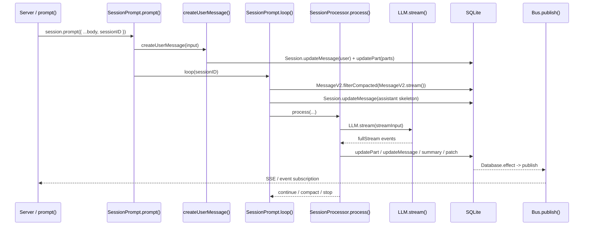
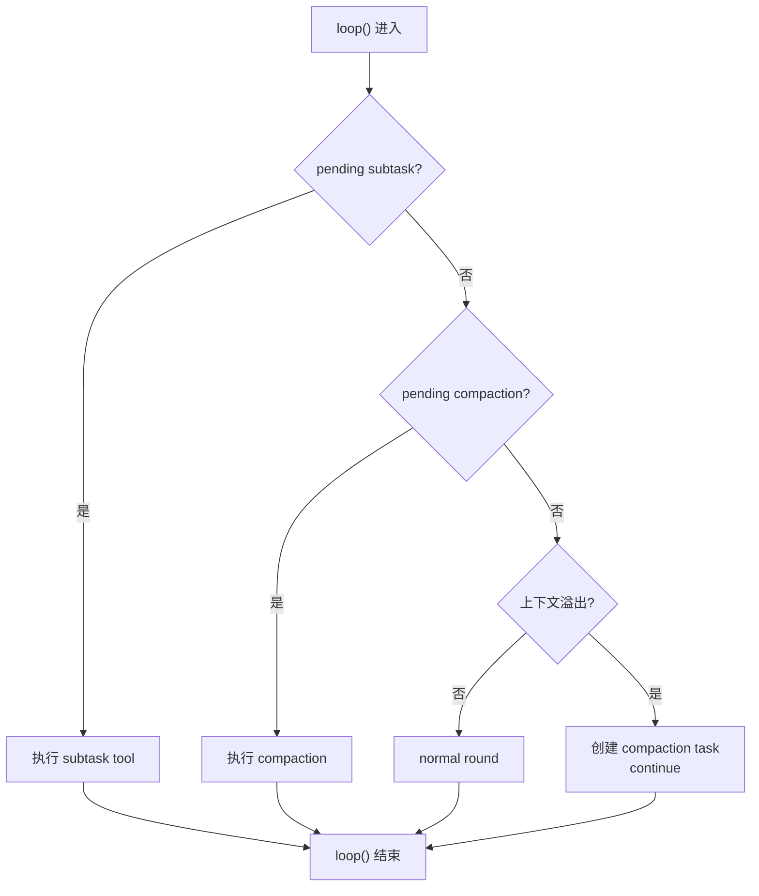
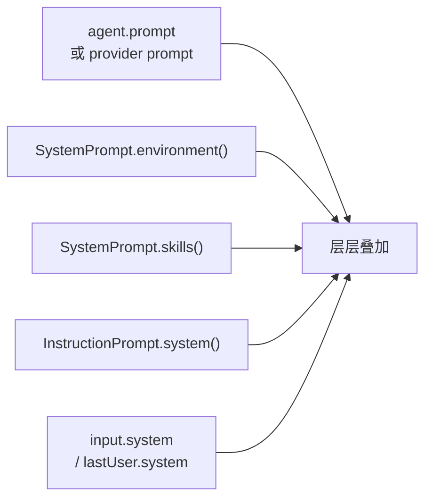

# OpenCode 核心执行循环：Session Loop、Prompt 编译、LLM 调用、流式响应处理

> 基于 `opencode` `v1.3.2`（tag `v1.3.2`，commit `0dcdf5f529dced23d8452c9aa5f166abb24d8f7c`）源码校对

---

## 1. 执行链路总览



---

## 2. `prompt()` 主流程

`session/prompt.ts:162-188` 只有 27 行，但执行顺序是硬编码的：

1. `Session.get(input.sessionID)` 取 session
2. `SessionRevert.cleanup(session)` 清理可能遗留的 revert 临时状态
3. `createUserMessage(input)` 把这次输入编译并写进 durable history
4. `Session.touch(input.sessionID)` 更新时间戳
5. 把旧的 `tools` 输入翻译成 `Permission.Ruleset`
6. 判断 `noReply`：如果只想落 user message，不想继续推理，就直接返回；否则才进入 `loop({ sessionID })`

**关键点**：
- `revert cleanup` 一定发生在新输入之前
- `createUserMessage()` 一定发生在 `loop()` 之前，loop 随后读取的是 durable history

---

## 3. 输入编译：`createUserMessage()`

`session/prompt.ts:986-1386` 把用户输入编译成 durable parts。

### 3.1 Part 编译路径

| part 类型 | 编译行为 |
|---------|---------|
| `text` | 原样直通 |
| `file` | 文本文件执行 `ReadTool`，内容内联成 synthetic text；目录列出条目；二进制转 data URL |
| `agent` | 生成 synthetic text 提示模型调用 task 工具 |
| `subtask` | 原样直通，等 `loop()` 识别 |
| MCP resource | 先读取资源，再写成 synthetic text + 原始 file part |

### 3.2 文件展开逻辑

`prompt.ts:1126-1242` 对文本文件会：

1. 还原文件 URL 成本地路径
2. 如果带了 `start/end` 行号范围，转成 `ReadTool` 的 `offset/limit`
3. 执行 `ReadTool.execute()` 获取文件内容
4. 把 `result.output` 写成 synthetic text
5. 保留原始 `file` part

### 3.3 路径解析规则

`prompt.ts:205-209` 有两条规则：

1. `~/` 开头按用户 home 目录展开
2. 其他相对路径都以 `Instance.worktree` 为根做 `path.resolve()`

---

## 4. `loop()` 状态机

`session/prompt.ts:242-756` 是 Session 级状态机。

### 4.1 Session 级并发闸门

| 操作 | 函数 | 语义 |
|------|------|------|
| 第一次进入占住运行权 | `start(sessionID)` | 创建 `AbortController`，建 `callbacks` 队列 |
| 恢复原 loop 时重用 abort signal | `resume(sessionID)` | 直接取出已有的 `abort.signal` |
| 释放运行态 | `cancel(sessionID)` | `abort.abort()`，状态置回 `idle` |

**同一 session 同时只有一条主循环在推进**。

### 4.2 每轮状态推导

`session/prompt.ts:291-329`：

1. `msgs = filterCompacted(stream(sessionID))` 从 durable history 重放
2. 从尾到头扫描，推导 `lastUser`、`lastAssistant`、`lastFinished`、`tasks`
3. 满足"最近 assistant 已完整结束"就退出

### 4.3 分支判断顺序



### 4.4 normal round 的执行

`session/prompt.ts:571-708`：

1. `insertReminders()` 注入 plan/build 模式提醒
2. 先落一条 assistant skeleton
3. 创建 `SessionProcessor`
4. `resolveTools()` 构造本轮可执行工具集
5. 拼 system prompt（多层叠加）
6. `processor.process()` 消费 LLM 流事件

---

## 5. `SessionProcessor.process()`

`session/processor.ts:46-425` 充当"流事件到 durable writes 的翻译器"。

### 5.1 AI SDK fullStream 21 种状态

| 分组 | 状态 | OpenCode 处理 |
|------|------|--------------|
| 文本 | `text-start/delta/end` | 创建 text part，增量广播，收尾写快照 |
| 推理 | `reasoning-start/delta/end` | 创建 reasoning part，增量广播，收尾写快照 |
| 工具 | `tool-input-start/delta/end` | 当前忽略（不持久化参数生成过程）|
| 工具 | `tool-call` | pending → running，做 doom-loop 检测 |
| 工具 | `tool-result/error` | running → completed/error |
| Step | `start-step` | 记录 snapshot |
| Step | `finish-step` | 写 step-finish part、patch、summary、overflow 检测 |
| 生命周期 | `start` | session status 设为 busy |
| 生命周期 | `finish` | 当前忽略 |
| 生命周期 | `error` | 进入 retry/stop/compact 分支 |

### 5.2 tool part 状态机

```
pending → running → completed
                └→ error
```

### 5.3 doom loop 检测

`session/processor.ts:152-176`：连续三次同工具同输入时触发权限询问。

---

## 6. `LLM.stream()`

`session/llm.ts:48-285` 封装 provider 请求。

### 6.1 system prompt 组装顺序



### 6.2 model 参数优先级

```
provider transform 默认值 → model.options → agent.options → variant
```

### 6.3 工具集两次裁剪

1. `resolveTools()`：内建工具、插件工具、MCP 工具 + metadata/permission/plugin hooks
2. `LLM.resolveTools()`：按 agent/session/user permission 再删掉禁用工具

### 6.4 provider 兼容层

- OpenAI OAuth：走 `instructions` 字段，不拼 system messages
- LiteLLM/Anthropic proxy：必要时补 `_noop` 工具
- GitLab Workflow model：把远端 tool call 接回本地工具系统
- `experimental_repairToolCall`：大小写修复或打回 `invalid`

---

## 7. 关键函数清单

| 函数 | 文件坐标 | 功能 |
|------|---------|------|
| `SessionPrompt.prompt()` | `prompt.ts:162-188` | 外部请求入口，先落 durable user message，再决定是否进入 loop |
| `createUserMessage()` | `prompt.ts:986-1386` | 把输入编译成 durable user message/parts |
| `resolvePromptParts()` | `prompt.ts:191-240` | 解析模板里的文件/目录/agent 引用 |
| `SessionPrompt.loop()` | `prompt.ts:242-756` | Session 级状态机：subtask/compaction/overflow/normal round |
| `insertReminders()` | `prompt.ts:1389-1527` | 注入 plan/build 模式提醒 |
| `SessionProcessor.process()` | `processor.ts:46-425` | 消费 LLM 流事件，写入 durable parts |
| `LLM.stream()` | `llm.ts:48-285` | 封装 provider 请求，构造 streamText 参数 |
| `SystemPrompt.environment()` | `system.ts:28-53` | 环境信息注入 |
| `SystemPrompt.skills()` | `system.ts:55-67` | 技能目录注入 |
| `InstructionPrompt.system()` | `instruction.ts:72-142` | AGENTS/CLAUDE 指令加载 |
| `SessionPrompt.resolveTools()` | `prompt.ts:766-953` | 构造本轮可执行工具集 |
