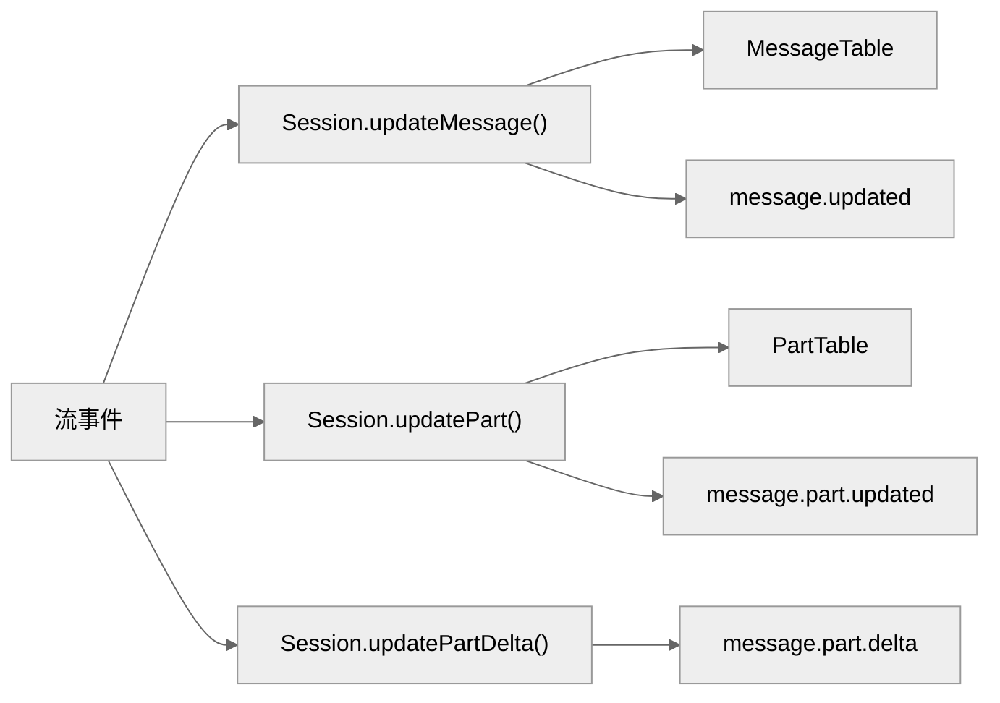
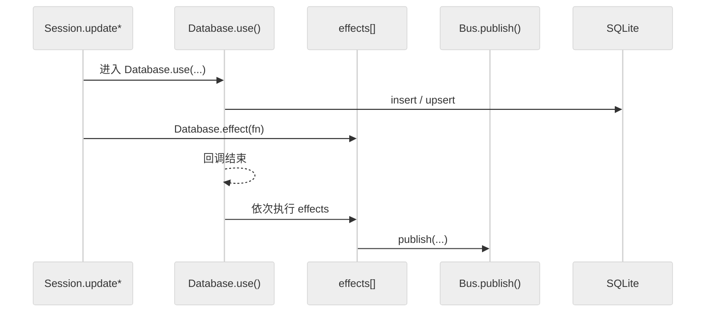
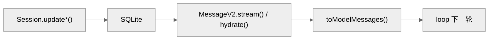

# OpenCode 的状态、会话与记忆系统

> 基于 `opencode` `v1.3.2`（tag `v1.3.2`，commit `0dcdf5f529dced23d8452c9aa5f166abb24d8f7c`）源码校对

本章把三个紧密协作的子系统放在同一条主线上讲：**状态管理**负责把每轮对话可靠写入 SQLite；**上下文管理**负责在调用模型前，把这些持久化对象重新编译成 prompt；**记忆系统**负责在 compaction 或 session 收束时，把文件变更和摘要沉淀为可恢复、可展示的 durable 信息。它们共同构成 OpenCode 的"认知基础设施"。

---

**目录**

- [1. 概述：三个子系统如何协同工作](#1-概述三个子系统如何协同工作)
- [2. 实现机制](#2-实现机制)
  - [2.1 状态管理](#21-状态管理)
  - [2.2 上下文管理](#22-上下文管理)
  - [2.3 记忆系统](#23-记忆系统)
- [3. 实际使用模式](#3-实际使用模式)
- [4. 代码示例](#4-代码示例)
- [5. 关键函数清单](#5-关键函数清单)
- [6. 代码质量评估](#6-代码质量评估)

---

## 1. 概述：三个子系统如何协同工作

OpenCode 的运行时可以概括成一句话：**先写库，再发事件，最后编译上下文**。

| 子系统 | 核心职责 | 主要代码位置 |
|--------|---------|------------|
| 状态管理 | 把每轮对话的 `message` / `part` 可靠写入 SQLite，并通过 Bus 广播事件 | `session/index.ts`、`storage/db.ts`、`message-v2.ts` |
| 上下文管理 | 在调用模型前，把持久化历史、指令文件、运行时提醒编译成 `ModelMessage[]` | `session/prompt.ts`、`session/system.ts`、`session/llm.ts` |
| 记忆系统 | 在 compaction / session 收束时，从 step 快照边界计算 diff，写回 durable state | `session/summary.ts`、`snapshot/index.ts` |

三者的协作顺序如下：

1. 每轮 LLM 流事件到来，**状态管理**先把 `message` / `part` 写进 SQLite。
2. 下一轮开始前，**上下文管理**从 SQLite 读出历史，叠加指令和提醒，编译成 prompt。
3. compaction 触发时，**记忆系统**从 step 快照计算 diff，写回 `session_diff` 和 session summary。

---

## 2. 实现机制

### 2.1 状态管理

#### 2.1.1 Durable State 写入口

`session/index.ts:686-789` 集中了三组写入口：

| API | 语义 | 代码坐标 |
|-----|------|---------|
| `Session.updateMessage()` | upsert message 头 | `686-706` |
| `Session.updatePart()` | upsert part 快照 | `755-776` |
| `Session.updatePartDelta()` | 发布 part 增量事件，不写库 | `778-789` |

#### 2.1.2 SQLite 三张核心表

| 表 | 关键列 | 存什么 |
|---|--------|-------|
| `SessionTable` | `project_id / workspace_id / parent_id / directory / title / summary / revert / permission` | session 边界 |
| `MessageTable` | `session_id / time_created / data(json)` | message header |
| `PartTable` | `message_id / session_id / time_created / data(json)` | part 体 |

`MessageTable.data` 和 `PartTable.data` 只存 `Omit<Info, 'id' | 'sessionID'>` 的 JSON，真正的 ID 和关系边界仍走关系型列。

#### 2.1.3 `Database.effect()` 保证"先写库再发事件"

`storage/db.ts:121-146` 通过 `Database.effect()` 机制，确保副作用在 SQLite 写入完成后才执行，消除"已通知但未持久化"的窗口。

#### 2.1.4 Message 与 Part 的关系

| 层 | 职责 |
|---|------|
| message header | 轮次边界：`role / agent / model / tokens / cost / finish` |
| part | 轮次内部节点：`text / reasoning / tool / step / patch` |
| durable 写入 | message 和 part 分开存 |
| 实时渲染 | 前端主要消费 part |
| 回放时组装 | `hydrate()` 把 `message + parts[]` 组装成 `WithParts` |

`MessageV2.WithParts[]` 是 durable history 回放的基本单位。

#### 2.1.5 三条消费链

OpenCode 的事件流可以拆成三条独立消费链：

- **实时链**：`LLM.stream()` → `SessionProcessor.process()` → `Session.update*()` → `Bus.publish()` → SSE → UI
- **跨实例聚合链**：`Bus.publish()` → `GlobalBus.emit()` → `/global/event` → GlobalSDK SSE → 按 directory 分发
- **Durable 回放链**：`Session.update*()` → SQLite → `MessageV2.stream() / hydrate()` → `toModelMessages()` → 下一轮 loop

#### 2.1.6 MessageV2 关键函数

| 函数 | 文件坐标 | 功能 |
|------|---------|------|
| `MessageV2.stream()` | `message-v2.ts:827-849` | 按"新到旧"产出消息 |
| `MessageV2.filterCompacted()` | `message-v2.ts:882-898` | 过滤已压缩历史，返回活动历史 |
| `MessageV2.hydrate()` | `message-v2.ts:533-557` | 把 message rows 与 part rows 组装成 `WithParts` |
| `MessageV2.toModelMessages()` | `message-v2.ts:559-792` | 把 durable history 投影成 AI SDK `ModelMessage[]` |
| `MessageV2.page()` | `message-v2.ts:794-813` | 分页读取，按 `time_created desc` |

#### 2.1.7 并发占位机制

**assistant skeleton 先写**：`session/prompt.ts:591-620` 在 normal round 开始前，先 `Session.updateMessage(assistant skeleton)` 创建一条空的 assistant message。OpenCode 不是"先收到流再决定往哪里写"，而是先分配 durable 宿主，再持续向里灌 part。

**reasoning / text 占位 part**：`processor.ts:63-80`、`291-304` 在流事件到来时，先创建空 part 占位，再增量更新。

#### 2.1.8 SessionStatus 与 Durable State 的区别

| 对象 | 存储位置 | 语义 |
|------|---------|------|
| `Session.Info` | SQLite `SessionTable` | durable 执行边界 |
| `MessageV2.Info` | SQLite `MessageTable` | durable 轮次边界 |
| `MessageV2.Part` | SQLite `PartTable` | durable 轮次内部节点 |
| `SessionStatus` | 内存 `Map<SessionID, Info>` | 运行态（busy / retry / idle） |

`SessionStatus` 故意不进 SQLite，因为它不适合持久化回放。

#### 2.1.9 Snapshot 与 Diff

- **Snapshot 记录**：`snapshot/index.ts` 在每个 step 开始时记录快照 ID。
- **Diff 计算**：`session/summary.ts:144-169` 从 message history 中找最早和最晚的 step 快照，调用 `Snapshot.diffFull(from, to)` 计算 diff，写进 `Storage.write(["session_diff", sessionID])`。
- **Compaction 中的 Diff**：`session/compaction.ts` 在 replay 时把旧 replay parts 复制回来，media 附件降级成文本提示。

---

### 2.2 上下文管理

#### 2.2.1 六个上下文来源

在 `v1.3.2` 中，送进模型的上下文主要来自 6 个来源：

| 来源 | 代码坐标 | 在哪一层进入 |
|------|---------|------------|
| 用户原始输入 | `session/prompt.ts:986-1386` | `createUserMessage()` 编译 part |
| 文件 / MCP / agent 附件展开 | `prompt.ts:1000-1325` | 仍属于 user message 编译阶段 |
| provider / agent 基础提示 | `session/system.ts:18-26`、`session/llm.ts:70-82` | `LLM.stream()` 组 system |
| 环境 / 技能 / 指令文件 | `system.ts:28-67`、`instruction.ts:72-142` | `prompt.ts:675-685` |
| 运行时提醒 | `prompt.ts:1389-1527`、`655-668` | `insertReminders()` 与 queued user reminder |
| durable history 投影 | `message-v2.ts:559-792` | `toModelMessages()` |

OpenCode 的上下文不是"一条 system string + 一串 messages"，而是一份运行时编译产物。

#### 2.2.2 输入侧改写

**文件展开成 synthetic text**：`createUserMessage()` 对 file part 的处理是主动解释而不是惰性引用：

1. 文本文件会主动跑 `ReadTool`，把内容或片段变成 synthetic text。
2. 目录会被列出条目，再写成 synthetic text。
3. MCP resource 会先被读取，再写成 synthetic text。
4. 二进制文件和图片 / PDF 会保留为 file attachment。

因此 durable history 里记录的不是"用户附了个路径"，而是"系统如何理解这个附件"。

**`@agent` 改写成 orchestration hint**：`1303-1325` 不直接执行子任务，而是写入一条 synthetic text，明确告诉模型这段上下文要被拿去生成 subtask prompt、应调用 `task` 工具、subagent 类型是什么。本质上是把编排提示预编译进上下文。

#### 2.2.3 指令系统三种读取方式

**system 级指令**：`instruction.ts:72-142` 的 `systemPaths()` / `system()` 会搜集：

1. 工程内向上查找的 `AGENTS.md` / `CLAUDE.md` / `CONTEXT.md`
2. 全局配置目录里的 `AGENTS.md`
3. `~/.claude/CLAUDE.md`
4. `config.instructions` 声明的额外本地文件和 URL

**read tool 触发的局部指令发现**：`InstructionPrompt.resolve()` 在 `168-190` 会围绕某个被读取的文件路径，向上查找尚未加载、也未被当前 message claim 过的 instruction 文件。调用点在 `tool/read.ts:118`，所以当 agent 读到更深层目录时，OpenCode 还能补发现该子目录局部的 instruction。

**loaded / claim 机制避免重复灌上下文**：`InstructionPrompt.loaded(messages)` 会从历史里的 `read` 工具结果 metadata 中提取已经加载过的 instruction 路径；`claim/clear` 用于避免同一 message 内重复注入。

#### 2.2.4 system prompt 真实组装顺序

普通推理分支里，`prompt.ts:675-685` 先准备环境 prompt、技能说明、指令文件内容；随后 `llm.ts:70-82` 做最后组合：

1. `agent.prompt` 或 provider prompt
2. 运行时 system 片段
3. `user.system` 顶层补丁

因此一条很长的 system prompt 往往是 runtime 多层合并的结果，而不是来自某个单点模板文件。

#### 2.2.5 运行时提醒

**plan / build reminder**：`prompt.ts:1389-1527` 会根据当前 agent、上轮 agent 和实验 flag：

1. 给 `plan` agent 注入 plan mode 限制说明。
2. 从 `plan` 切回 `build` 时插入 build-switch 提醒。
3. 在实验 plan mode 下把计划文件路径和工作流规则写进 synthetic text。

plan / build 切换不是 UI 状态，而是被明确编译进 durable / synthetic context。

**queued user message reminder**：`655-668` 会把上轮 assistant 之后插入的新 user 文本临时包成 `<system-reminder>`，提醒模型优先处理后来的消息。这一步不回写数据库，但会影响本轮的模型感知顺序。

#### 2.2.6 Durable history 投影

`MessageV2.toModelMessages()` 负责把 durable history 转成 AI SDK `ModelMessage[]`。

**user 侧投影规则**：

- `text` → user text part
- 非文本 file → user file part
- `compaction` → `"What did we do so far?"`
- `subtask` → `"The following tool was executed by the user"`

**assistant 侧投影规则**：

- `text`
- `reasoning`
- `tool-call` / `tool-result` / `tool-error`
- `step-start`

未完成的 tool call 会被补成 `"Tool execution was interrupted"` 的 error result，避免 provider 看到悬挂的 tool-use 块。

**media-in-tool-result 兼容**：若 provider 不支持 tool result 里带 media，`703-778` 会把图片 / PDF 附件抽出来，再额外注入一条 user file message。这是模型上下文兼容层，不是 UI 行为。

#### 2.2.7 工具集合裁剪

OpenCode 当前的工具上下文有两层裁剪：

1. `SessionPrompt.resolveTools()` 先构造本地工具、插件工具、MCP 工具，并挂上 `metadata` / `permission` / `plugin hooks`。
2. `LLM.resolveTools()` 再根据 agent / session / user 的 permission 规则删掉禁用工具。

模型看到的 tool set 是"当前轮次 + 当前 agent + 当前权限上下文"下的最终结果，不是静态注册表快照。

---

### 2.3 记忆系统

#### 2.3.1 SessionSummary 三个导出函数

`packages/opencode/src/session/summary.ts` 当前导出三个函数：

| 函数 | 代码位置 | 做什么 |
|------|---------|-------|
| `summarize` | `71-89` | 对指定 message 触发 session 摘要和 message 摘要两条计算 |
| `diff` | `123-142` | 读取 / 规范化 `session_diff`，返回 `FileDiff[]` |
| `computeDiff` | `144-169` | 从 message history 的 step 快照中计算 diff |

#### 2.3.2 `summarize` 完整流程

`71-89` 的 `summarize` 实际上调用两条并行计算路径：

```ts
await Promise.all([
  summarizeSession({ sessionID, messages: all }),
  summarizeMessage({ sessionID, messages: all }),
])
```

**`summarizeSession`（`91-106`）** 会：

1. `computeDiff(messages)` 得到 `FileDiff[]`
2. 把 `additions / deletions / files` 总计数写回 `Session.setSummary()`
3. 把完整 `FileDiff[]` 写入 `Storage` 的 `session_diff`
4. 通过 `Bus` 发布 `Session.Event.Diff`

**`summarizeMessage`（`108-121`）** 会：

1. 找到指定 `messageID` 对应的 user message 及其后续 assistant 兄弟节点
2. 只对这个子区间调用 `computeDiff()`
3. 把结果合并进 `userMsg.summary.diffs`

因此每个 compaction summary message 携带的 diff 是"到这个 message 为止的增量"，不是全量 session diff。

#### 2.3.3 Diff 计算起点与终点

`computeDiff()`（`144-169`）的核心逻辑是**从 message history 中找最早和最晚的 step 快照**：

1. 找起点：遍历所有 part，第一个遇到 `step-start.snapshot` 就记下。
2. 找终点：遍历所有 part，所有 `step-finish.snapshot` 都更新，最后一个就是终点。
3. 起点和终点都找到后，调用 `Snapshot.diffFull(from, to)`。

关键推论：

- diff 不来自编辑器保存事件，也不直接来自 `git diff`，而来自 step 快照边界。
- 如果一轮 session 内没有任何 step，`computeDiff()` 返回空数组。
- 快照本身存放在 `Snapshot` 服务里。

#### 2.3.4 `diff` 函数读取端

`diff()`（`123-142`）是读取侧：

1. 从 `Storage.read(["session_diff", sessionID])` 读取缓存。
2. 对每个条目的 `file` 字段做 Git 路径规范化，处理 octal-escaped 形式。
3. 如果规范化后文件名变化了，就回写更新后的列表。
4. 返回最终 `FileDiff[]`。

#### 2.3.5 为什么它更像"会话记忆"而不是"长期知识库"

OpenCode 当前章节里的"记忆"并不是 Claude Code / Gemini CLI 那种可长期累积的知识文件系统，而是**session 级别的文件变更追踪与摘要**：

| 维度 | OpenCode 当前实现 |
|------|------------------|
| 文件级 | 由 step 开始 / 结束快照构成可差分版本链 |
| 变更级 | `FileDiff` 包含 `additions / deletions / changes` |
| 持久化级 | diff 数据存在 `Storage`（JSON 文件）里，不是纯内存态 |
| 传播级 | 通过 `Bus.publish` 实时推给前端，不靠轮询 |

更准确地说，`SessionSummary` 的定位是：**session 级文件变更追踪系统**，而"摘要"只是其中一个投影。

#### 2.3.6 和 Compaction 的关系

compaction 会触发 `summary` agent 生成 summary message，触发链路是：

```text
CompactionTask → summary agent → SessionProcessor.process()
  → 生成 summary assistant message
  → SessionSummary.summarize() 被调用
  → 写 session_diff + Session.setSummary()
```

`SessionSummary` 既是 compaction 的消费者，也是 summary 数据的 durable 写回层。

---

## 3. 实际使用模式

三个子系统在 OpenCode 里的协同方式如下。

### 4.1 普通对话轮次

```text
用户输入
  → 上下文管理：createUserMessage() 编译 user message/parts（文件展开、@agent 改写）
  → 状态管理：Session.updateMessage(user) 写入 SQLite
  → 上下文管理：prompt.ts 叠加 system prompt（provider + 环境 + 指令文件 + 运行时提醒）
  → 上下文管理：toModelMessages() 把 durable history 投影成 ModelMessage[]
  → LLM.stream() 调用模型
  → 状态管理：assistant skeleton 先写，流事件持续写 part
  → Bus 广播 SSE 事件 → UI 实时渲染
```

### 4.2 Session Resume（跨实例恢复）

```text
新实例启动
  → MessageV2.stream() 从 SQLite 读出全量消息
  → MessageV2.filterCompacted() 过滤已压缩历史
  → toModelMessages() 重新投影成 ModelMessage[]
  → 继续对话，模型感知到完整历史
```

### 4.3 Compaction 触发时

```text
历史超过阈值
  → CompactionTask 触发 summary agent
  → summary agent 生成 summary assistant message
  → SessionSummary.summarize()
    → summarizeSession：computeDiff() → 写 session_diff + Session.setSummary() + Bus.publish
    → summarizeMessage：对子区间 computeDiff() → 写 userMsg.summary.diffs
  → 旧历史标记为 compacted
  → filterCompacted() 后续过滤掉旧历史
  → compaction part 在 toModelMessages() 中投影为 "What did we do so far?"
```

### 4.4 工具调用与文件变更追踪

```text
agent 执行 write / patch 工具
  → step-start 时：Snapshot.track() 记录快照 ID
  → 工具执行，文件发生变更
  → step-finish 时：记录终点快照 ID
  → computeDiff(from, to) 计算 FileDiff[]
  → 写入 Storage["session_diff", sessionID]
  → Bus.publish(Session.Event.Diff) → 前端 diff 面板更新
```

---

## 4. 代码示例

### 5.1 Durable State 写入口流程



### 5.2 `Database.effect()` 保证"先写库再发事件"



### 5.3 实时消费链


### 5.4 Durable 回放链



### 5.5 SessionSummary 并行计算

```ts
// session/summary.ts:71-89
await Promise.all([
  summarizeSession({ sessionID, messages: all }),
  summarizeMessage({ sessionID, messages: all }),
])
```

---

## 5. 关键函数清单

### 6.1 状态管理

| 函数 | 文件坐标 | 功能 |
|------|---------|------|
| `Session.updateMessage()` | `session/index.ts:686-706` | upsert message 头 |
| `Session.updatePart()` | `session/index.ts:755-776` | upsert part 快照 |
| `Session.updatePartDelta()` | `session/index.ts:778-789` | 发布 part 增量事件，不写库 |
| `Database.use()` | `storage/db.ts:121-146` | 提供 DB 上下文，封装 transaction / effect |
| `Database.effect()` | `storage/db.ts:140-146` | 延迟执行副作用，先写库再发事件 |
| `MessageV2.stream()` | `message-v2.ts:827-849` | 按"新到旧"产出消息 |
| `MessageV2.filterCompacted()` | `message-v2.ts:882-898` | 过滤已压缩历史 |
| `MessageV2.hydrate()` | `message-v2.ts:533-557` | 组装 `message + parts[]` |
| `MessageV2.toModelMessages()` | `message-v2.ts:559-792` | 投影成 AI SDK `ModelMessage[]` |
| `MessageV2.page()` | `message-v2.ts:794-813` | 分页读取 |
| `Snapshot.track()` | `snapshot/index.ts` | 记录文件快照 |

### 6.2 上下文管理

| 函数 / 类型 | 文件 | 职责 |
|----------|------|------|
| `resolvePromptParts()` | `session/prompt.ts` | 将模板引用预编译成具体 part |
| `createUserMessage()` | `session/prompt.ts:986-1386` | 编译 user message / parts，处理文件展开和 `@agent` 改写 |
| `insertReminders()` | `session/prompt.ts:1389-1527` | 注入 plan / build 运行时提醒 |
| `system.ts` 层叠器 | `session/system.ts:18-67` | 组装 system prompt：provider + environment + instructions + skill |
| `InstructionPrompt.systemPaths()` | `instruction.ts:72-142` | 搜集所有 `AGENTS.md` / `CLAUDE.md` 路径 |
| `InstructionPrompt.resolve()` | `instruction.ts:168-190` | 围绕读取路径向上发现局部指令文件 |
| `SessionPrompt.resolveTools()` | `session/prompt.ts` | 构造本地 / 插件 / MCP 工具集合 |
| `LLM.resolveTools()` | `session/llm.ts` | 按权限规则裁剪工具集合 |
| `DurableHistory.filterCompacted()` | `session/index.ts` | 过滤已 compact 的历史，仅向模型投影有效消息 |

### 6.3 记忆系统

| 函数 / 类型 | 文件 | 职责 |
|----------|------|------|
| `SessionSummary.summarize()` | `session/summary.ts:71-89` | 主入口：并行触发 session 级和 message 级摘要 |
| `summarizeSession()` | `session/summary.ts:91-106` | 写 session 级聚合 diff 和计数 |
| `summarizeMessage()` | `session/summary.ts:108-121` | 写 message 级细粒度 diff |
| `SessionSummary.diff()` | `session/summary.ts:123-142` | 读取 / 规范化 `session_diff` |
| `SessionSummary.computeDiff()` | `session/summary.ts:144-169` | 从 step 快照边界计算 diff |
| `Snapshot.diffFull()` | `snapshot/index.ts` | 计算两个快照之间的完整文件 diff |
| `Compaction.compact()` | `session/compact.ts` | 将旧历史压缩为 compact session，以 summary 替换原始消息 |

---

## 6. 代码质量评估

### 6.1 优点

**状态管理**

- **Durable State 模式完整**：所有可观测状态都以 SQLite 为单一事实来源，UI 通过 SSE 投影实时订阅，避免内存态和持久化态双轨漂移。
- **事件溯源链清晰**：`MessageV2.stream()` 能回放全量消息，`filterCompacted()` 能折叠旧历史，使 session resume 和 compaction 都能精确重建。
- **副作用顺序正确**：`Database.effect()` 先写库再发事件，避免出现"前端收到了状态，但数据库还没落盘"的窗口。

**上下文管理**

- **运行时编译模型明确**：输入、指令、环境、reminder、durable history 各自独立，再在 `LLM.stream()` 前汇总。
- **局部 instruction 发现很强**：agent 读到更深路径时还能补发现新 `AGENTS.md` / `CLAUDE.md`，适合大仓库分目录治理。
- **工具集合晚绑定**：tool set 不是全局固定表，而是随 agent、session、permission 动态裁剪。

**记忆系统**

- **diff 是结构化对象**：不是模糊文本摘要，而是 `FileDiff[]`，更适合前端展示和 session 恢复。
- **summary 与 compaction 解耦**：`summarize()` 负责提炼 durable 记忆，`compact()` 负责裁剪历史，两者职责分离。
- **session 级记忆语义清晰**：OpenCode 不装作自己有完整长期知识库，而是把 session 续航做扎实。

### 6.2 风险与改进点

**状态管理**

- **SQLite 写放大明显**：高频流事件导致单次写请求很多，若负载升高，锁竞争和 IO 延迟会直接影响 UI 体验。
- **`toModelMessages()` 体量过大**：同一函数同时处理消息投影、tool result 修补、media 兼容，分支复杂，单元测试矩阵很重。
- **Snapshot schema 演进风险**：快照格式若升级，目前看不到很强的版本边界，未来迁移成本可能偏高。

**上下文管理**

- **多层 instruction 冲突仍交给模型兜底**：目录局部 instruction 很灵活，但如果上层和下层相互矛盾，当前没有正式冲突解析器。
- **缺少显式 token 预算总账**：文件展开、skill、instruction、history 都可能放大 token，总量控制仍偏隐式。
- **OpenCode 的 memory 更偏 session，不偏长期知识**：如果拿它和 Claude / Gemini 的长期 memory 系统对齐，用户预期容易失真。

**记忆系统**

- **compaction 不可逆**：旧历史被 summary 替换后，当前活动视图不再保留原始 turn 级细节。
- **diff 计算仍有全量扫描成本**：长会话里每次从头找 step 起止点，潜在成为热点。
- **长期知识沉淀能力较弱**：没有独立的 memory DB、topic files 或自动 consolidation，跨会话知识主要还是依赖 instruction 文件，而不是 memory backend。

---

*文档版本: 2.1*
*分析日期: 2026-04-10*
*合并自: 05-state-management.md、11-context-management.md、16-memory-system.md*
