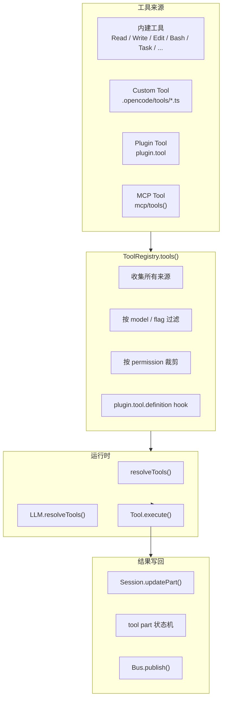
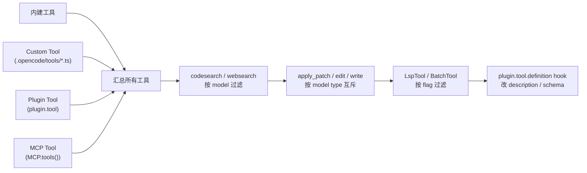
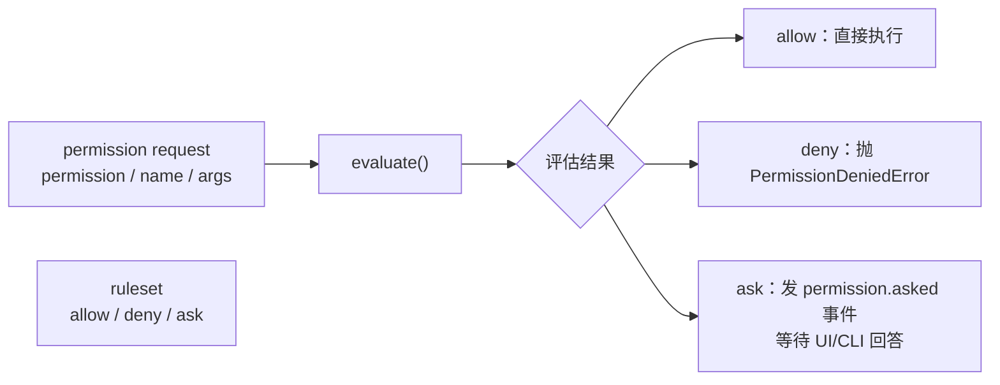
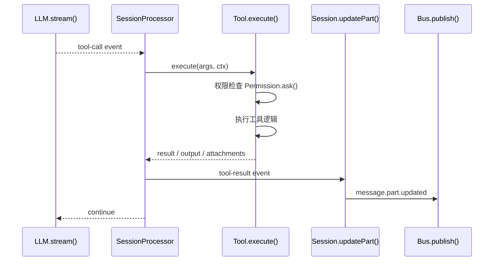

# OpenCode 工具调用机制：Tool 注册、权限控制、执行闭环、结果写回 Durable State

> 基于 `opencode` `v1.3.2`（tag `v1.3.2`，commit `0dcdf5f529dced23d8452c9aa5f166abb24d8f7c`）源码校对

---

## 1. 工具系统架构总览



---

## 2. 工具注册与汇总

### 2.1 四类工具来源

| 来源 | 代码坐标 | 注册方式 |
|------|---------|---------|
| 内建工具 | `tool/*.ts` | 直接导入注册 |
| Custom Tool | `tool/registry.ts:85-98` | 扫描 `.opencode/tools/*.ts` |
| Plugin Tool | `tool/registry.ts:100-105` | `Plugin.list()` 的 `plugin.tool` |
| MCP Tool | `mcp/index.ts:606-646` | `MCP.tools()` |

### 2.2 `ToolRegistry.tools()`

`tool/registry.ts:85-190` 是"所有工具真正汇总"的地方：



### 2.3 工具可见性裁剪

`tool/registry.ts:112-136`、`llm.ts:296-307` 分两次裁剪：

1. **第一次裁剪**（`tool/registry.ts`）：按 model、flag、互斥关系过滤
2. **第二次裁剪**（`llm.ts`）：按 agent permission、session permission、user 显式禁用

---

## 3. 权限控制系统

### 3.1 Permission 规则引擎

`permission/index.ts:166-267`：



### 3.2 规则求值顺序

`permission/index.ts`：
1. 先用 ruleset 求 `allow/deny/ask`
2. `deny` 直接抛 `PermissionDeniedError`
3. `ask` 创建 pending request，发布 `permission.asked`
4. 等待 UI/CLI 通过 `/permission/:requestID/reply` 回答

### 3.3 批准规则持久化

`reply === "always"` 会把批准规则写进 `PermissionTable`，对同项目后续请求生效。

---

## 4. 工具执行闭环

### 4.1 tool 调用完整链路



### 4.2 `Tool.Context` 提供的回调

`session/prompt.ts:431-456` 传给 TaskTool 的 context：

```ts
{
  metadata(input)  // 允许 TaskTool 在运行中补写当前 tool part 的标题和元数据
  ask(req)       // 权限检查时，把 subagent 权限和 session 权限合并后再发起 Permission.ask()
}
```

### 4.3 doom loop 检测

`session/processor.ts:152-176`：连续三次同工具同输入时触发 `Permission.ask({ permission: "doom_loop" })`。

---

## 5. 结果写回 Durable State

### 5.1 tool part 状态机

| 状态 | 触发时机 | 写库操作 |
|------|---------|---------|
| `pending` | `tool-input-start` | `Session.updatePart(pending)` |
| `running` | `tool-call` | `Session.updatePart(running)` + doom-loop 检测 |
| `completed` | `tool-result` | `Session.updatePart(completed)` + output / attachments |
| `error` | `tool-error` | `Session.updatePart(error)` |

### 5.2 退出前清理

`session/processor.ts:402-418`：即使中途出现异常，processor 仍会把所有未完成 tool part 改成 `error: "Tool execution aborted"`。

---

## 6. 关键函数清单

| 函数/类 | 文件坐标 | 功能 |
|---------|---------|------|
| `ToolRegistry.tools()` | `tool/registry.ts:85-190` | 汇总所有来源工具，按 model/flag/permission 过滤 |
| `ToolRegistry.state()` | `tool/registry.ts:85-105` | Custom tool 扫描：`.opencode/tools/*.ts` |
| `Permission.evaluate()` | `permission/index.ts:166-267` | 规则求值：allow / deny / ask |
| `Permission.ask()` | `permission/index.ts` | 发起权限询问请求 |
| `Tool.execute()` | 各 tool 文件 | 工具执行逻辑 |
| `SessionProcessor.process()` | `processor.ts:46-425` | 消费 tool-call / tool-result / tool-error 事件 |
| `Session.updatePart()` | `session/index.ts:755-776` | 写 tool part 快照 |
| `Session.updatePartDelta()` | `session/index.ts:778-789` | 发布 part 增量事件 |
| `resolveTools()` | `prompt.ts:766-953` | 构造本轮可执行工具集 |
| `LLM.resolveTools()` | `llm.ts:296-307` | 按权限再裁剪工具 |

---

## 7. 各工具职责

| 工具 | 文件 | 职责 |
|------|------|------|
| ReadTool | `tool/read.ts` | 文件/目录读取，LSP 预热 |
| WriteTool | `tool/write.ts` | 文件写入，写后 LSP.touchFile + diagnostics |
| EditTool | `tool/edit.ts` | 行级别编辑，写后 diagnostics 纠错 |
| ApplyPatchTool | `tool/apply_patch.ts` | patch 应用，diff 纠错 |
| BashTool | `tool/bash.ts` | Shell 命令执行 |
| TaskTool | `tool/task.ts` | Subagent 执行（新建/恢复 child session）|
| SkillTool | `tool/skill.ts` | 技能包加载 |
| LspTool | `tool/lsp.ts` | LSP 显式查询（实验态）|

---

## 8. plugin Hook 对工具的影响

| Hook | 调用点 | 作用 |
|------|-------|------|
| `tool` | `ToolRegistry.state()` | 向 runtime 注入自定义 tool |
| `tool.definition` | `ToolRegistry.tools()` | 在 tool 暴露给模型前改 description/schema |
| `tool.execute.before` | `SessionPrompt.loop()` | 改 tool args |
| `tool.execute.after` | `SessionPrompt.loop()` | 改 tool title/output/metadata |
