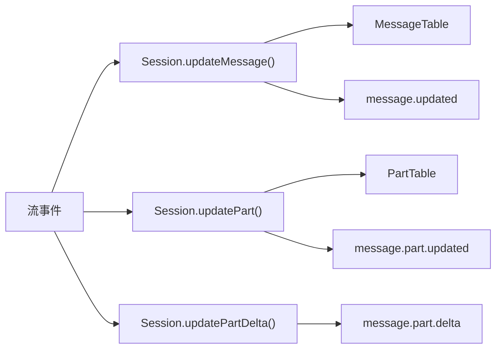
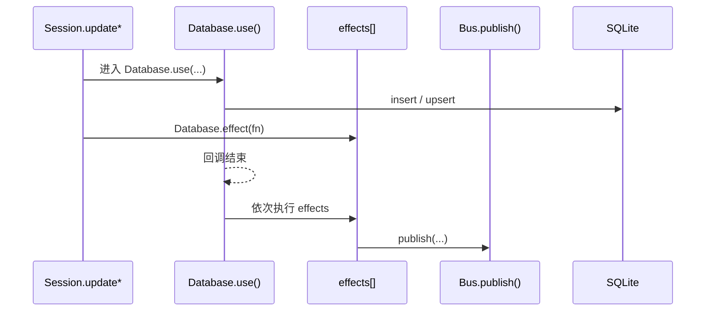
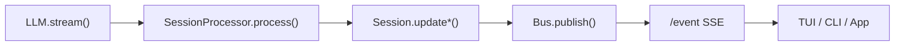
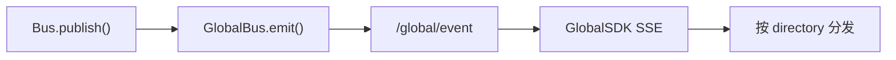
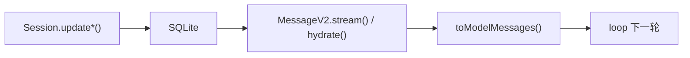

# OpenCode 状态管理：Durable State、消息持久化、并发占位与历史回放

> 基于 `opencode` `v1.3.2`（tag `v1.3.2`，commit `0dcdf5f529dced23d8452c9aa5f166abb24d8f7c`）源码校对

---

## 1. Durable State 写入口

`session/index.ts:686-789` 集中了三组写入口：

| API | 语义 | 代码坐标 |
|-----|------|---------|
| `Session.updateMessage()` | upsert message 头 | `686-706` |
| `Session.updatePart()` | upsert part 快照 | `755-776` |
| `Session.updatePartDelta()` | 发布 part 增量事件（不写库）| `778-789` |

---

## 2. SQLite 表结构

### 2.1 三张核心表

| 表 | 关键列 | 存什么 |
|---|--------|-------|
| `SessionTable` | `project_id / workspace_id / parent_id / directory / title / summary / revert / permission` | session 边界 |
| `MessageTable` | `session_id / time_created / data(json)` | message header |
| `PartTable` | `message_id / session_id / time_created / data(json)` | part 体 |

**关键设计**：`MessageTable.data` 和 `PartTable.data` 只存 `Omit<Info, 'id' | 'sessionID'>` 的 JSON，ID 和外键列走关系型列。

---

## 3. `Database.effect()` 保证"先写库再发事件"

`storage/db.ts:121-146`：

---

## 4. Message 与 Part 的关系

### 4.1 五层建模

| 层 | 职责 |
|---|------|
| message header | 轮次边界：role / agent / model / tokens / cost / finish |
| part | 轮次内部节点：text / reasoning / tool / step / patch |
| durable 写入 | message 和 part 分开存 |
| 实时渲染 | 主要消费 part |
| 回放时组装 | `hydrate()` 把 message + parts[] 组装成 `WithParts` |

### 4.2 durable history 回放单位

`MessageV2.WithParts[]` = message + parts[]，不是孤立的 header 或孤立的 part。

---

## 5. 三条消费链

### 5.1 实时链

### 5.2 跨实例聚合链

### 5.3 Durable 回放链

---

## 6. MessageV2 关键函数

| 函数 | 文件坐标 | 功能 |
|------|---------|------|
| `MessageV2.stream()` | `message-v2.ts:827-849` | 按"新到旧"产出消息 |
| `MessageV2.filterCompacted()` | `message-v2.ts:882-898` | 过滤已压缩历史，返回活动历史 |
| `MessageV2.hydrate()` | `message-v2.ts:533-557` | 把 message rows 与 part rows 组装成 `WithParts` |
| `MessageV2.toModelMessages()` | `message-v2.ts:559-792` | 把 durable history 投影成 AI SDK `ModelMessage[]` |
| `MessageV2.page()` | `message-v2.ts:794-813` | 分页读取，按 `time_created desc` |

---

## 7. 并发占位机制

### 7.1 assistant skeleton 先写

`session/prompt.ts:591-620`：normal round 开始前，先 `Session.updateMessage(assistant skeleton)` 创建一条空的 assistant message。

**意义**：processor 从来不是"先拿到流，再决定往哪里写"，而是"先拿到一条 durable assistant 宿主，再把流事件持续写进去"。

### 7.2 reasoning / text 占位 part

`processor.ts:63-80`、`291-304`：流事件到来时，先创建空 part 占位，再增量更新。

---

## 8. SessionStatus 与 Durable State 的区别

| 对象 | 存储位置 | 语义 |
|------|---------|------|
| `Session.Info` | SQLite `SessionTable` | durable 执行边界 |
| `MessageV2.Info` | SQLite `MessageTable` | durable 轮次边界 |
| `MessageV2.Part` | SQLite `PartTable` | durable 轮次内部节点 |
| `SessionStatus` | 内存 `Map<SessionID, Info>` | 运行态（busy/retry/idle）|

**说明**：`SessionStatus` 存在内存中，不进 SQLite，因为它不适合持久化回放。

---

## 9. Snapshot 与 Diff

### 9.1 Snapshot 记录

`snapshot/index.ts`：每个 step 开始时记录快照 ID。

### 9.2 Diff 计算

`session/summary.ts:144-169`：

1. 从 message history 中找最早和最晚的 step 快照
2. 调用 `Snapshot.diffFull(from, to)` 计算 diff
3. 写进 `Storage.write(["session_diff", sessionID])`

### 9.3 Compaction 中的 Diff

`session/compaction.ts`：
- replay 时把旧 replay parts 复制回来
- media 附件降级成文本提示

---

## 10. 关键函数清单

| 函数 | 文件坐标 | 功能 |
|------|---------|------|
| `Session.updateMessage()` | `session/index.ts:686-706` | upsert message 头 |
| `Session.updatePart()` | `session/index.ts:755-776` | upsert part 快照 |
| `Session.updatePartDelta()` | `session/index.ts:778-789` | 发布 part 增量事件 |
| `Database.use()` | `storage/db.ts:121-146` | 提供 DB 上下文，封装 transaction/effect |
| `Database.effect()` | `storage/db.ts:140-146` | 延迟执行副作用（先写库，再发事件）|
| `MessageV2.stream()` | `message-v2.ts:827-849` | 按"新到旧"产出消息 |
| `MessageV2.filterCompacted()` | `message-v2.ts:882-898` | 过滤已压缩历史 |
| `MessageV2.hydrate()` | `message-v2.ts:533-557` | 组装 message + parts[] |
| `MessageV2.toModelMessages()` | `message-v2.ts:559-792` | 投影成 AI SDK ModelMessage[] |
| `SessionSummary.computeDiff()` | `session/summary.ts:144-169` | 计算 session diff |
| `SessionSummary.summarize()` | `session/summary.ts:71-89` | 触发 session 摘要和 message 摘要 |
| `Snapshot.track()` | `snapshot/index.ts` | 记录文件快照 |
