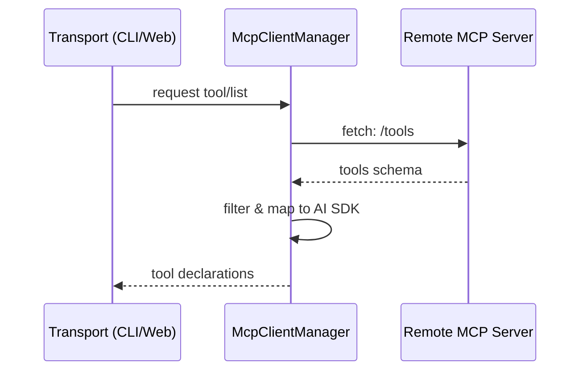

# OpenCode 扩展性：MCP 集成链路、Plugin 加载、新增工具的修改点

> 基于 `opencode` `v1.3.2`（tag `v1.3.2`，commit `0dcdf5f529dced23d8452c9aa5f166abb24d8f7c`）源码校对

---

## 1. 扩展入口总览

| 扩展入口 | 代码坐标 | 最终落在哪里 |
|---------|---------|------------|
| Plugin hooks | `plugin/index.ts:47-165` | 挂到 bus event、tool definition 和其他 hook 点 |
| MCP servers | `mcp/index.ts` | 产出 tool、prompt、resource 和连接状态 |
| Custom tools | `tool/registry.ts:85-105` | 变成 runtime 可调用 Tool |
| Commands | `command/index.ts:63-157` | 变成 slash command / prompt template |
| Skills | `skill/index.ts:126-226` | 变成 skill 列表，也可折叠进 command 和 prompt |

### 1.2 McpClientManager：连接枢纽
`packages/opencode/src/mcp/index.ts` 是 MCP 的核心。
- **配置与发现**：读取 `settings` 中定义的 MCP 服务器列表。
- **声明映射**：将 MCP 服务器暴露的 `tools` 转换为 Gemini 的 `FunctionDeclaration`。
- **协议适配**：利用 Bun 的 `fetch` 和 `ReadableStream` 实现轻量级 SSE 转发（`mcp/index.ts:606-646`）。
- **凭证隔离**：通过 `mcp/auth.ts` 管理不同 server 的 OAuth2 令牌。

### 1.3 MCP 集成架构图


---

## 2. MCP 集成链路

### 2.1 MCP 五状态机

`mcp/index.ts:67-109`：

| 状态 | 含义 |
|------|------|
| `connected` | 已连接：成功建立 transport 并完成 handshake |
| `disabled` | 已禁用：`mcp.enabled === false` 或从未配置 |
| `failed` | 连接失败：transport 连接失败或无法获取 tool list |
| `needs_auth` | 需认证：OAuth 流程需要用户授权 |
| `needs_client_registration` | 需客户端注册：server 不支持动态注册 |

### 2.2 两类 MCP Server

| 类型 | 连接方式 | 代码坐标 |
|------|---------|---------|
| 远程 MCP | `StreamableHTTPClientTransport` 或 `SSEClientTransport` | `mcp/index.ts:325-446` |
| 本地 MCP | `StdioClientTransport`，cwd = `Instance.directory` | `mcp/index.ts:448-490` |

### 2.3 MCP 对外暴露四类能力

| MCP 角色 | 导出函数 | 在 runtime 里的投影 |
|---------|---------|------------------|
| 工具来源 | `tools()` | 变成 agent 可调用的 Tool |
| Prompt 模板 | `prompts()` | 变成 slash command 模板 |
| Resource | `resources()` / `readResource()` | 变成可读取的上下文 |
| 事件源 | `ToolsChanged` BusEvent | MCP server 发 `ToolListChangedNotification` 时触发刷新 |

### 2.4 Tool 投影过程

`mcp/index.ts:606-646`：

```ts
result[sanitizedClientName + "_" + sanitizedToolName] = await convertMcpTool(mcpTool, client, timeout)
```

工具名称会做安全 sanitize（替换非法字符为 `_`），最终 tool name 格式是 `clientName_toolName`。

---

## 3. Plugin 系统

### 3.1 Plugin 不是工具列表，而是一组 Hook

`plugin/index.ts:47-165`：Plugin 是 runtime 内部的高权限 hook 编排层。

### 3.2 PluginInput 提供的上下文

| 字段 | 含义 |
|------|------|
| `client` | 内嵌 SDK client，`fetch` 直接走 `Server.Default().fetch()` |
| `project` | 当前实例绑定的 project 信息 |
| `directory` | 当前工作目录 |
| `worktree` | worktree 根 |
| `serverUrl` | 当前 server URL |
| `$` | `Bun.$` shell 能力 |

### 3.3 Plugin Hook 全景

| Hook | 调用点 | 作用 |
|------|-------|------|
| `config` | `Plugin.init()` 装载完成后 | 让 plugin 读取最终配置 |
| `event` | `Plugin.init()` 里 `Bus.subscribeAll()` | 旁路观察 instance 级 bus event |
| `auth` | `ProviderAuth.methods/authorize/callback` | 自定义 provider 登录方式 |
| `tool` | `ToolRegistry.state()` | 向 runtime 注入自定义 tool |
| `tool.definition` | `ToolRegistry.tools()` | 在 tool 暴露给模型前改 description/schema |
| `chat.message` | `SessionPrompt.createUserMessage()` | 在 user message/parts 落库前改写 |
| `chat.params` | `session/llm.ts` | 改 temperature/topP/topK/provider options |
| `chat.headers` | `session/llm.ts` | 改 provider 请求头 |
| `tool.execute.before` | `SessionPrompt.loop()` | 改 tool args |
| `tool.execute.after` | `SessionPrompt.loop()` | 改 tool title/output/metadata |
| `shell.env` | `tool/bash.ts`、`pty/index.ts` | 给 shell / PTY 注入环境变量 |

### 3.4 Plugin 语义

`Plugin.trigger(name, input, output)`：
1. 取出当前 instance 的 `hooks[]`
2. 逐个取 `hook[name]`
3. 若存在则 `await fn(input, output)`
4. 最后把同一个 `output` 对象返回

**关键性质**：
- 调用顺序严格串行
- 冲突策略是"后写覆盖前写"
- 某个 hook 抛错，整条调用链就会报错

---

## 4. Skill 系统

### 4.1 Skill 五层结构

| 层 | 代码坐标 | 角色 |
|---|---------|------|
| 发现层 | `skill/index.ts:15-166` | 从全局目录、项目目录、`.opencode`、显式路径和远端 URL 收集 `SKILL.md` |
| 远端拉取层 | `skill/discovery.ts:11-100` | 从 `index.json` 下载 skill pack 到本地 cache |
| 运行时服务层 | `skill/index.ts:168-226` | 暴露 `get/all/dirs/available`，并做 lazy ensure |
| 注入层 | `system.ts:55-65`、`prompt.ts:676-679` | 把"可用技能列表"编进 system prompt |
| 交互层 | `tool/skill.ts:8-90`、`command/index.ts:142-153` | 把 Skill 继续投影成 `skill` tool 和 slash command 来源 |

### 4.2 Skill 三个对外投影面

1. **system prompt**：技能目录注入
2. **skill tool**：按需加载完整技能包
3. **slash command**：Skill 自动生成 command

---

## 5. Command 系统

`command/index.ts:63-157`：

当前 command 列表由四部分拼成：
1. 内建 `init` / `review`
2. `cfg.command` 里的显式命令
3. `MCP.prompts()` 导出的 prompt
4. `Skill.all()` 导出的技能

---

## 6. 新增工具的修改点

### 6.1 新增内建工具

需要修改：
- `tool/registry.ts` 注册新工具
- `tool/*.ts` 实现新工具文件
- `tool/execute-map.ts` 或类似执行映射

### 6.2 新增 Custom Tool

需要修改：
- 创建 `.opencode/tools/*.ts` 文件
- 不需要修改核心代码，ToolRegistry 会自动扫描

### 6.3 新增 MCP Tool

需要修改：
- `mcp/index.ts` 中添加 MCP server 连接逻辑
- 或通过配置 `mcp` 添加远程/本地 MCP server

### 6.4 新增 Plugin Tool

需要修改：
- 创建 plugin 文件，导出 tool hook
- 在 `Plugin.init()` 中被加载

### 6.5 新增 Skill

需要修改：
- 创建 `SKILL.md` 文件
- 放在 `~/.claude/skills/`、`.claude/skills/`、`.opencode/skills/` 或配置路径中

---

## 7. 扩展能力汇总表

| 扩展能力 | 汇入接口 | 是否修改核心代码 |
|---------|---------|---------------|
| Custom Tool | `.opencode/tools/*.ts` | 否 |
| MCP Server | 配置 `mcp` | 否 |
| Plugin Tool | `Plugin.list()` | 是（plugin 文件）|
| Skill | `Skill.all()` | 否 |
| Command | 配置 `command` 或 MCP prompts | 否 |
| 内建 Tool | `tool/registry.ts` | 是 |
| LSP Server | 配置 `lsp` | 否 |

---

## 8. 关键源码定位

| 主题 | 源码文件 |
|------|---------|
| MCP 集成 | `mcp/index.ts` |
| MCP OAuth | `mcp/auth.ts`、`mcp/oauth-provider.ts`、`mcp/oauth-callback.ts` |
| Plugin 加载 | `plugin/index.ts` |
| Plugin 内建 | `plugin/codex.ts`、`plugin/copilot.ts` |
| Skill 系统 | `skill/index.ts` |
| Skill 远端拉取 | `skill/discovery.ts` |
| Tool 注册 | `tool/registry.ts` |
| Command 注册 | `command/index.ts` |
| Config 扩展发现 | `config/config.ts:143-166` |
