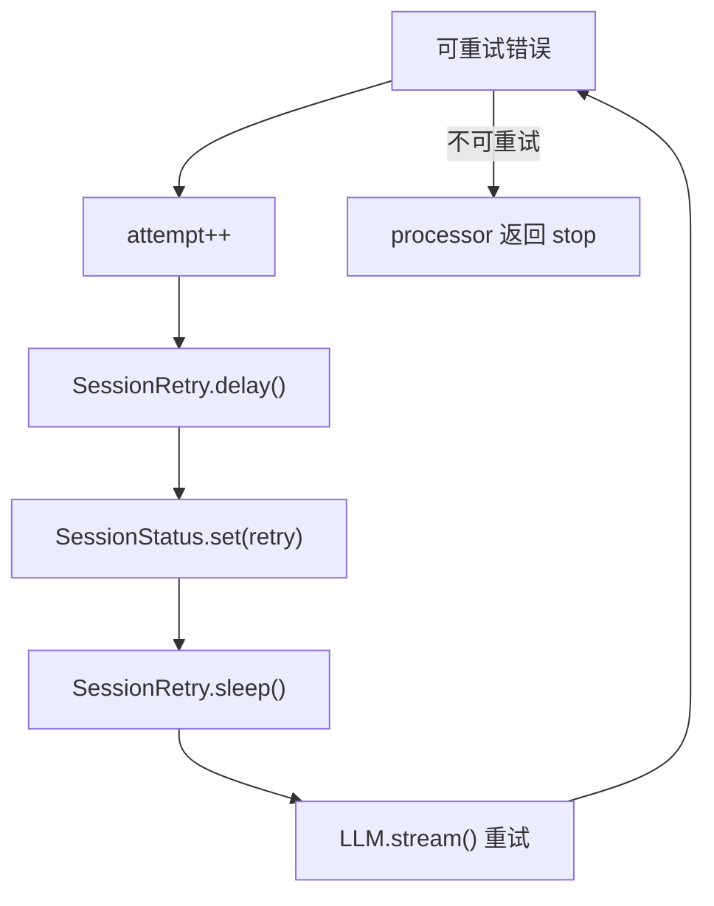
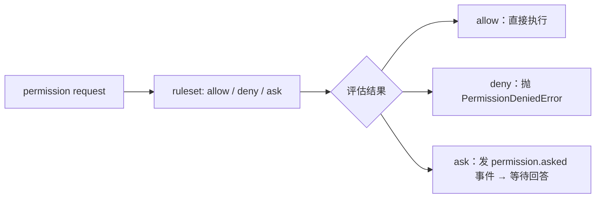

# OpenCode 错误处理与安全性：异常捕获、重试策略、认证鉴权、敏感信息隔离

> 基于 `opencode` `v1.3.2`（tag `v1.3.2`，commit `0dcdf5f529dced23d8452c9aa5f166abb24d8f7c`）源码校对

---

## 1. 错误归一化

### 1.1 错误类型映射

`message-v2.ts:900-987` 的 `fromError()` 把底层异常映射成 runtime 能处理的错误对象：

| 错误类型 | 含义 |
|---------|------|
| `AbortedError` | 用户取消/超时 |
| `AuthError` | 认证失败 |
| `APIError` | Provider API 错误 |
| `ContextOverflowError` | 上下文溢出 |
| `StructuredOutputError` | 结构化输出格式错误 |
| `NamedError.Unknown` | 未知错误 |

### 1.2 归一化价值

provider、网络、系统调用错误先被规约进统一语义，processor 后续只需要按错误类别做策略分支。

---

## 2. 重试策略

### 2.1 delay 计算优先级

`session/retry.ts:28-100`：

1. `retry-after-ms`
2. `retry-after`
3. HTTP 日期格式的 `retry-after`
4. 否则退回指数退避

**说明**：不是固定 `2s -> 4s -> 8s`，而是尊重 provider 头信息。

### 2.2 retryable 判断

`session/retry.ts` 的 `retryable(error)`：
1. 明确排除 `ContextOverflowError`
2. 只对 `APIError.isRetryable === true` 的错误重试
3. 特判 `FreeUsageLimitError`、`Overloaded`、`too_many_requests`、`rate_limit`

### 2.3 retry 流程

---

## 3. 上下文溢出自愈

### 3.1 软溢出 vs 硬溢出

| 类型 | 触发条件 | 处理方式 |
|------|---------|---------|
| 软溢出 | 正常 finish 后判断 token 接近上限 | `SessionCompaction.isOverflow()` → 创建 compaction task |
| 硬溢出 | provider 直接返回 `ContextOverflowError` | `needsCompaction = true` → 返回 `"compact"` |

### 3.2 Compaction 自愈

`session/compaction.ts:102-297`：

1. 找到 overflow 之前最近一条未 compaction 的 user message 作为 `replay`
2. 压缩完成后重新写一条 user message，复制原 `agent/model/format/tools/system/variant`
3. 把旧 replay parts 复制回来
4. 如果找不到可 replay 的历史，则写 synthetic continue message

---

## 4. Permission 与 Question 机制

### 4.1 Permission 流程

### 4.2 Question 机制

`question/index.ts:131-220`：
1. 创建 pending question request
2. 发布 `question.asked`
3. 阻塞等待回答
4. 回答后生成"用户已回答你的问题"形式的工具输出

### 4.3 被拒绝时 loop 是否停止

`processor.ts:49`：`shouldBreak = experimental?.continue_loop_on_deny !== true`

默认情况下 permission/question 被拒绝会让本轮 stop；只有显式打开实验开关才允许继续 loop。

---

## 5. Session 并发控制

### 5.1 busy 状态

`SessionPrompt.assertNotBusy(sessionID)`：新操作撞上正在运行的 session 时抛 `Session.BusyError`。

### 5.2 cancel 机制

`SessionPrompt.cancel()`：
1. abort 当前 controller
2. 删除 session 占位
3. 把状态切回 `idle`

shell、loop、task tool 都会监听这个 abort signal。

---

## 6. Revert 机制

### 6.1 revert 流程

`session/revert.ts:24-80`：
1. 找到目标 message 或 part
2. 从目标之后收集所有 `patch` part
3. 用 `Snapshot.revert(patches)` 回滚文件系统
4. 记录 `session.revert = { messageID, partID?, snapshot, diff }`

### 6.2 cleanup 清理

`session/revert.ts:91-137`：
- 回滚整条 message：删除该 message 及其后的所有消息
- 回滚 part：只删除目标 part 及之后的 parts
- 删除完成后清空 `session.revert`

### 6.3 unrevert 恢复

`snapshot/revert.ts:82-89`：用 `Snapshot.restore(snapshot)` 恢复文件现场，再清掉 `session.revert`。

---

## 7. 认证鉴权

### 7.1 Provider Auth 体系

`provider/auth.ts`：三层认证方式：
1. env（环境变量）
2. api（API key）
3. custom（自定义 provider auth）

### 7.2 内建认证 Plugin

| Plugin | Provider | 功能 |
|--------|---------|------|
| `CodexAuthPlugin` | `openai` | ChatGPT/Codex OAuth |
| `CopilotAuthPlugin` | `github-copilot` | GitHub device flow |
| `GitlabAuthPlugin` | GitLab | OAuth |
| `PoeAuthPlugin` | Poe | OAuth |

### 7.3 Plugin Auth 覆盖语义

`Plugin.init()` 先 push 内建 hooks，再 push 用户 hooks。同一个 provider key 后写覆盖前写。

---

## 8. 敏感信息隔离

### 8.1 API Key 处理

- env 方式：通过 `ProviderAuth` 从环境变量读取
- config 方式：通过 `Config.get()` 从配置读取
- Plugin 方式：通过 plugin 的 `auth.loader()` 动态获取

### 8.2 MCP OAuth 凭证

`mcp/auth.ts`：tokens、codeVerifier、oauthState 写进 `~/.local/share/opencode/mcp-auth.json`，不进 SQLite。

### 8.3 external_directory 权限

`tool/external-directory.ts`：sandbox 内路径不会触发 `external_directory` 权限提示。

---

## 9. 关键函数清单

| 函数 | 文件坐标 | 功能 |
|------|---------|------|
| `MessageV2.fromError()` | `message-v2.ts:900-987` | 错误归一化 |
| `SessionRetry.retryable()` | `session/retry.ts:28-100` | 判断是否可重试 |
| `SessionRetry.delay()` | `session/retry.ts` | 计算退避时间 |
| `SessionProcessor.process()` | `processor.ts:354-387` | catch 分支处理 retry/overflow/fatal error |
| `Permission.evaluate()` | `permission/index.ts:166-267` | 规则求值 |
| `SessionCompaction.isOverflow()` | `session/compaction.ts` | 判断上下文是否溢出 |
| `SessionCompaction.process()` | `session/compaction.ts:102-297` | 执行 compaction 自愈 |
| `SessionRevert.cleanup()` | `session/revert.ts:91-137` | 清理 revert 状态 |
| `SessionPrompt.assertNotBusy()` | `prompt.ts` | busy 状态检测 |
| `SessionPrompt.cancel()` | `prompt.ts:260-272` | 释放运行态 |
| `Snapshot.revert()` | `snapshot/index.ts` | 文件系统回滚 |
| `Snapshot.restore()` | `snapshot/index.ts` | 文件系统恢复 |
