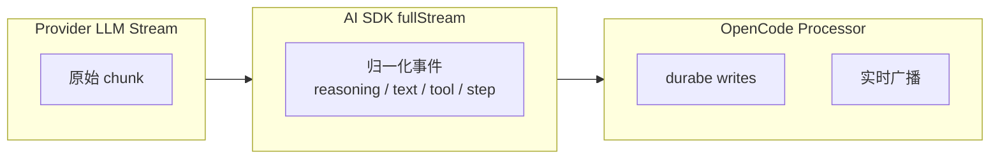
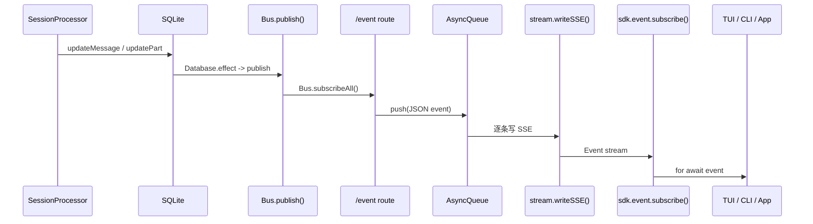

# OpenCode 性能与代码质量：流式传输、SSE、Bun Runtime 优势、优缺点分析

> 基于 `opencode` `v1.3.2`（tag `v1.3.2`，commit `0dcdf5f529dced23d8452c9aa5f166abb24d8f7c`）源码校对

---


**目录**

- [1. 流式传输架构](#1-流式传输架构)
- [2. SSE 实时推送](#2-sse-实时推送)
- [3. Bun Runtime 优势](#3-bun-runtime-优势)
- [4. 性能优化机制](#4-性能优化机制)
- [5. 代码质量评估](#5-代码质量评估)
- [6. 设计哲学总结](#6-设计哲学总结)
- [7. 关键源码定位](#7-关键源码定位)

---

## 1. 流式传输架构

### 1.1 双层流



### 1.2 AI SDK fullStream 21 种状态

| 分组 | 状态 | OpenCode 处理 |
|------|------|--------------|
| 文本 | `text-start/delta/end` | 增量写 text part |
| 推理 | `reasoning-start/delta/end` | 增量写 reasoning part |
| 工具 | `tool-input-start/delta/end` | 当前忽略 |
| 工具 | `tool-call` | pending → running |
| 工具 | `tool-result/error` | completed/error |
| Step | `start-step` | 记录 snapshot |
| Step | `finish-step` | 写 step-finish / patch / summary |
| 生命周期 | `start` | session status busy |
| 生命周期 | `finish` | 忽略 |
| 生命周期 | `error` | 进入 retry/stop/compact |

### 1.2 Bun 原生持久化加速
- **Bun.sql 零开销访问**：OpenCode 放弃了传统 ORM，直接使用 Bun 内置的 SQLite 引擎（`packages/opencode/src/storage/db.ts`）。
- **原子性保障**：利用 Bun 的同步写入特性，确保 `updatePartDelta` 在高频并发下依然能维持顺序一致性。

### 1.3 MCP 流式集成深度
- **SSE 透明转发**：在 `packages/opencode/src/mcp/index.ts` 中，利用 Bun 原生支持的 `ReadableStream` 直接将远程 MCP Server 的事件透传至前端，避免了中间层序列化开销。

---

## 2. SSE 实时推送

### 2.1 SSE 链路



### 2.2 两层事件作用域

| 接口 | 作用域 | 代码坐标 |
|------|-------|---------|
| `/event` | 当前 Instance | `server/routes/event.ts:13-84` |
| `/global/event` | 全局（跨 Instance）| `server/routes/global.ts:43-124` |

---

## 3. Bun Runtime 优势

### 3.1 Bun.serve

`server/server.ts`：

```ts
Bun.serve({
  fetch: app.fetch,
  websocket,
  port: opts.port,
  hostname: opts.hostname,
})
```

**优势**：
- 原生 HTTP/1.1 + HTTP/2 支持
- 内置 WebSocket 支持
- 自动 TLS（通过 `serveTLS`）
- 比 Node.js `http` 模块更高的吞吐量

### 3.2 Bun.spawn

`mcp/index.ts`、`tool/bash.ts`：

```ts
Bun.spawn({
  cmd: args,
  cwd: Instance.directory,
  env: { ...process.env, ...env },
  stdout: "pipe",
  stderr: "pipe",
})
```

**优势**：
- 比 Node.js `child_process` 更快的进程启动
- 原生 `stdout`/`stderr` 流处理
- 内置 IPC 能力

### 3.3 Bun.$ Shell

`plugin/index.ts`：

```ts
Bun.$`git status --short`
```

**优势**：
- 模板字符串语法，链式调用
- 自动流式输出捕获
- 内置 `glob`、`expand`、`quiet` 等修饰符

### 3.4 Bun vs Node.js 差异

| 能力 | Bun | Node.js |
|------|-----|---------|
| HTTP Server | `Bun.serve()` 原生高性能 | `node:http` 或 Express/Fastify |
| WebSocket | 内置 `websocket` 选项 | `ws` 库 |
| Shell | `Bun.$` 模板语法 | `child_process.exec/spawn` |
| SQLite | 内置 `Bun.sql()` | `better-sqlite3` |
| 构建 | `bun build` 原生 ESM/CJS | `esbuild`/`webpack` |
| 安装 | `bun install` 比 npm 快 | `npm install` |

---

## 4. 性能优化机制

### 4.1 增量写 vs 全量写

| 类型 | API | 场景 |
|------|-----|------|
| 全量写 | `Session.updatePart()` | text/reasoning 结束 |
| 增量写 | `Session.updatePartDelta()` | text/reasoning delta |
| 实时广播 | `Bus.publish()` | part delta 事件 |

### 4.2 LSP 懒启动

`lsp/index.ts`：
- **eager init**：runtime 先知道有哪些 server 可用
- **lazy spawn**：真正启动要看文件是否命中

### 4.3 MCP 连接复用

`mcp/index.ts`：
- 同一 `(root + serverID)` 的多个请求复用同一个 client
- `spawning` map 防止并发去重
- `broken` set 隔离失败

### 4.4 Database effect 批处理

`storage/db.ts:121-146`：
- `effect` 不会立刻执行，而是先塞进队列
- 等主事务写完再统一执行
- 减少数据库 fsync 次数

---

## 关键函数清单

| 函数/类型 | 文件 | 职责 |
|----------|------|------|
| `Session.updatePartDelta()` | `session/index.ts:778-789` | 流式增量写 text/reasoning delta 到 SQLite |
| `Session.updatePart()` | `session/index.ts` | 批量写完整 part（流结束时触发）|
| `Bus.publish()` | — | 将 durable 写操作广播为 SSE 事件，驱动实时推送 |
| `fullStream` 处理器 | `session/processor.ts` | 消费 AI SDK 21 种状态，分发 durable 写 + 广播事件 |
| `db.effect()` | `storage/db.ts:121-146` | 批处理 database effect，事务完成后统一执行，减少 fsync |
| `Bun.serve()` | `server/server.ts` | Bun 原生 HTTP server 启动入口，内置 WebSocket 支持 |
| `McpClientManager` (复用逻辑) | `mcp/index.ts` | 相同 `(root+serverID)` 复用同一 client，`spawning` map 防重 |
| `Lsp.start()` (lazy) | `lsp/index.ts` | LSP server 懒启动：eager init + lazy spawn by file match |

---

## 5. 代码质量评估

### 5.1 优点

1. **Durable 天然支持恢复**
   - 每步都压回 durable history，崩溃后只需重放
   - 同一份 durable history 支撑恢复、fork、compaction、多端订阅

2. **多宿主复用成本低**
   - transport 只需接到 HTTP/SSE contract
   - CLI/TUI/Web/Desktop/ACP 复用同一套 runtime

3. **扩展集中管理**
   - Plugin/MCP/Skill 都汇入统一接口
   - 不撕裂主骨架

4. **Instance 作用域隔离**
   - 每个 workspace/project 有独立状态
   - 互不干扰

5. **Bun runtime 高性能**
   - 原生 HTTP/WS、SQLite、流处理优势
   - 比 Node.js 更快的进程启动

### 5.2 缺点/限制

1. **新分支类型需改 loop()**
   - 想增加 session 级分支，通常要直接改 `prompt.ts`
   - 扩展点在边缘，不在中心调度器

2. **新 durable node 困难**
   - 完全独立于 `MessageV2.Part` 的对象会非常别扭
   - 所有高级能力最终都回写到 session/message/part 模型

3. **兼容性集中在少数节点**
   - provider 兼容、tool 兼容、消息投影兼容堆积在 `llm.ts`
   - 容易形成"关键节点过载"

4. **Plugin 安全边界弱**
   - 默认是 trusted code execution
   - 不适合运行不信任代码

5. **多数 hook 无隔离**
   - 坏 plugin 可直接打断主链路
   - 只有 config hook 做容错

6. **SQLite 单点**
   - 单文件 SQLite 不适合高并发写入场景
   - 多 workspace 并发时可能成为瓶颈

7. **超长历史压测**
   - 当前 `MessageV2.filterCompacted` 在处理万级 Part 时存在内存压力，建议引入滑动窗口加载。

8. **SQLite 锁竞争**
   - 在大规模并发 subtask 场景下，SQLite 的写锁可能成为瓶颈，建议探索 Bun 的 `WAL` 模式深度配置。

---

## 6. 设计哲学总结

### 6.1 固定骨架 + 晚绑定

OpenCode 的设计哲学是：

> 把 `prompt -> loop -> processor -> durable history` 这条主骨架写死，再把 transport、workspace、agent、system、tools、provider 全部推迟到临近执行时晚绑定。

### 6.2 为什么骨架是固定的

1. **可恢复性是骨架天然支持**：每个关键步骤都被压回 durable history
2. **多宿主复用成本很低**：transport 接到 HTTP/SSE 就能复用全部 runtime
3. **复杂性被集中在少数边缘节点**：`llm.ts`、`message-v2.ts`、`tool/registry.ts`、`server/server.ts`

### 6.3 代价

1. 想增加一种全新的 session 级分支，通常要直接改 `loop()`
2. 想增加一种完全独立于 `MessageV2.Part` 的执行对象，会非常别扭
3. provider 兼容、tool 兼容、消息投影兼容都会往少数关键节点堆积

---

## 7. 关键源码定位

| 主题 | 源码文件 |
|------|---------|
| AI SDK fullStream 处理 | `session/processor.ts` |
| SSE 端点 | `server/routes/event.ts`、`server/routes/global.ts` |
| Bun.serve | `server/server.ts` |
| Bun.spawn | `mcp/index.ts`、`tool/bash.ts` |
| Database effect | `storage/db.ts` |
| LSP 懒启动 | `lsp/index.ts` |
| MCP 连接复用 | `mcp/index.ts` |
| 增量写 | `session/index.ts:778-789` |
