# OpenCode Durable State 如何写入、传播与再投影

> 本文基于 `opencode` `v1.3.2`（tag `v1.3.2`，commit `0dcdf5f529dced23d8452c9aa5f166abb24d8f7c`）源码校对
> 核心代码：`packages/opencode/src/session/processor.ts`、`session/index.ts`、`session/message-v2.ts`

A06 已经说明请求如何进入 `streamText()`。A07 接着说明返回流如何在 `SessionProcessor.process()` 中被消费，如何经由 `Session.updateMessage()`、`Session.updatePart()`、`Session.updatePartDelta()` 进入 durable state，如何通过 `Bus` 与 SSE 发给前端，以及如何通过 `MessageV2.*` 重新投影给 `loop()` 和下一轮模型调用。

---


**目录**

- [1. A07 覆盖的主线范围](#1-a07-覆盖的主线范围)
- [2. Durable 写入口集中在 `Session.update*`](#2-durable-写入口集中在-sessionupdate)
- [3. `Database.effect()` 保证了“先写库，再发事件”](#3-databaseeffect-保证了先写库再发事件)
- [4. `processor` 用这三组 API 把流事件翻译成 durable state](#4-processor-用这三组-api-把流事件翻译成-durable-state)
- [5. `SessionStatus` 属于运行态，不进入 durable history](#5-sessionstatus-属于运行态不进入-durable-history)
- [6. Durable 写入完成后，事件怎样传播到前端](#6-durable-写入完成后事件怎样传播到前端)
- [7. durable rows 怎样重新读成 runtime 可消费对象](#7-durable-rows-怎样重新读成-runtime-可消费对象)
- [8. 同一份 durable history 还要重新投影回模型上下文](#8-同一份-durable-history-还要重新投影回模型上下文)
- [9. A06 与 A07 在这里闭环](#9-a06-与-a07-在这里闭环)

---

## 1. A07 覆盖的主线范围

`packages/opencode/src/session/processor.ts:54`

```ts
const stream = await LLM.stream(streamInput)

for await (const event of stream.fullStream) {
  Session.updatePart(...)
  Session.updatePartDelta(...)
  Session.updateMessage(...)
}

Bus.publish(...)
SSE 推送
MessageV2.stream()
MessageV2.toModelMessages()
```

这条链回答四个问题：

1. `LLM.stream()` 返回的事件流怎样变成 message/part 写操作。
2. 哪些内容会进入 SQLite，哪些内容只作为实时事件广播。
3. durable 写入完成后，前端怎样收到更新。
4. 下一轮 `loop()` 怎样重新读取这份 history。

下文图表统一配色约定：

1. 绿色：生产端 / 写入端 / 状态变更发起者
2. 蓝色：消费端 / 读侧 / 最终订阅者
3. 黄色：桥接 / 转发 / 发布 / SSE 传输层
4. 灰色：durable 存储 / 持久化真相源

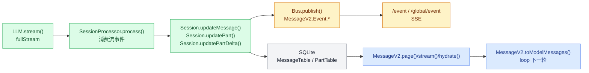

---

## 2. Durable 写入口集中在 `Session.update*`

`packages/opencode/src/session/index.ts:686-789`

这一层是整条后半程的核心，因为 processor 只是事件分发器，写 durable state 的入口只有三组 API。

| API | 代码坐标 | 语义 |
| --- | --- | --- |
| `Session.updateMessage()` | `session/index.ts:686-706` | upsert 一条 message 头信息 |
| `Session.updatePart()` | `session/index.ts:755-776` | upsert 一条完整 part 快照 |
| `Session.updatePartDelta()` | `session/index.ts:778-789` | 发布 part 增量事件 |

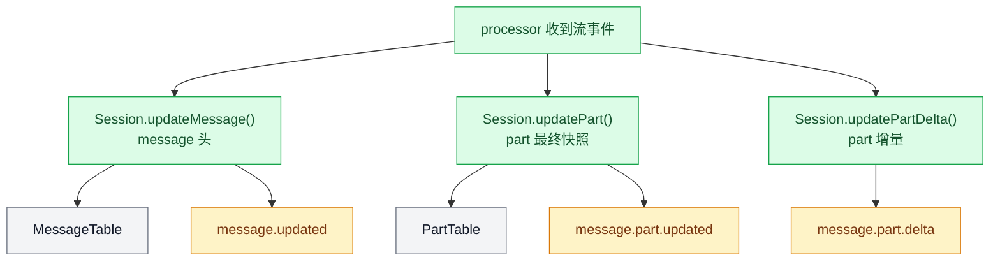

### 2.1 `updateMessage()` 写入 message 头

`686-706`

这里的执行顺序很清晰：

1. `687-688` 拆出 `id`、`sessionID` 和 `data`。
2. `689-698` 把 message upsert 到 `MessageTable`。
3. `699-703` 通过 `Database.effect()` 延迟发布 `MessageV2.Event.Updated`。

因此，message 级 durable 真相源位于 `MessageTable`。

```mermaid
flowchart LR
    Input["MessageV2.Info"]
    Split["拆出 id / sessionID / data"]
    Upsert["upsert MessageTable"]
    Effect["Database.effect(...)"]
    Publish["Bus.publish(message.updated)"]

    Input --> Split --> Upsert --> Effect --> Publish

    classDef producer fill:#DCFCE7,stroke:#16A34A,color:#14532D;
    classDef consumer fill:#DBEAFE,stroke:#2563EB,color:#1E3A8A;
    classDef bridge fill:#FEF3C7,stroke:#D97706,color:#78350F;
    classDef storage fill:#F3F4F6,stroke:#6B7280,color:#111827;

    class Input producer;
    class Publish bridge;
    class Split,Effect bridge;
    class Upsert storage;
```

### 2.2 `updatePart()` 写入 part 最终快照

`755-776`

这条路径与 `updateMessage()` 对称：

1. `756-757` 拆出 `id/messageID/sessionID/data`。
2. `758-768` 把 part upsert 到 `PartTable`。
3. `769-773` 延迟发布 `MessageV2.Event.PartUpdated`。

`PartTable` 保存的是 part 的最终快照。这也是 UI 与后续 replay 的稳定依据。

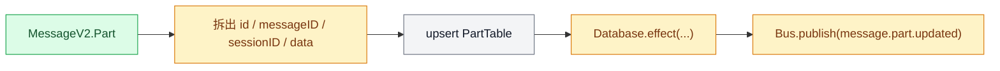

### 2.3 `updatePartDelta()` 负责实时增量广播

`778-789`

这一段没有数据库写操作，只有：

1. `787` 发布 `MessageV2.Event.PartDelta`

这意味着：

1. `reasoning-delta` 与 `text-delta` 主要承担实时渲染职责。
2. 最终 durable 状态仍由 `updatePart()` 写入的完整快照承担。

OpenCode 当前采用的是“增量事件 + 最终快照”的组合模型。

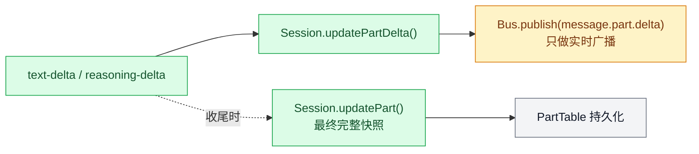

### 2.4 `zod` -- durable-state 协议层

核心代码：

1. `packages/opencode/src/session/message-v2.ts:18-495`
2. `packages/opencode/src/util/fn.ts:3-19`
3. `packages/opencode/src/bus/bus-event.ts:12-33`

`zod` 本质上是 TypeScript 生态里常用的 runtime schema / validation 库；在 OpenCode 这里，它不是拿来做页面表单，而是拿来定义 message、part、event 这些跨层对象的协议。

如果只看 `updateMessage()` / `updatePart()` 的数据库写入，容易觉得 `zod` 只是“TypeScript 旁边再放一份 schema”。但在 A07 这条链里，它实际承担的是**运行时协议定义**：

1. `MessageV2.Info`、`MessageV2.Part`、`MessageV2.WithParts` 用 `zod` 定义了 message、part、投影对象的真实 shape。
2. `fn(schema, cb)` 会在真正执行业务前先 `schema.parse(input)`，所以 `Session.updateMessage()`、`Session.updatePart()`、`Session.updatePartDelta()` 不是“相信调用方”，而是先过一层 runtime 校验。
3. `BusEvent.define(type, properties)` 给每种 bus event 绑定 payload schema；`BusEvent.payloads()` 再把所有事件拼成 discriminated union，供 `/event` OpenAPI 描述和 SDK 类型生成使用。
4. SQLite 的 `MessageTable.data` / `PartTable.data` 只是 JSON blob，数据库本身不理解这些字段的细粒度结构；`zod` 在这里补上的正是“能写什么、事件长什么样、投影应该长什么样”这层约束。

换句话说，`zod` 在 A07 里解决的不是“前端表单校验”那类问题，而是下面这几个 durable-state 风险：

1. 防止 malformed message/part 在写库前混进 durable history。
2. 防止 `tool` / `reasoning` / `text` 这些 discriminated union 在演进时失去统一协议。
3. 让 Bus/SSE/SDK/UI 围绕同一套事件 shape 协作，而不是每层各自猜 payload。
4. 让 `toModelMessages()`、`hydrate()`、分页 cursor 这些读侧逻辑有一套稳定的对象模型可依赖。

这里还有一个很值得点明的边界：

1. `update*` 入口是**硬校验**，因为它们走了 `fn(...).parse(...)`。
2. 但 `message-v2.ts` 读数据库时，`info(row)` / `part(row)` 主要是 cast，不是每次都重新 `parse`。
3. `Bus.publish()` 也不会对 `properties` 再执行一次 `zod.parse()`；bus 层的 `zod` 主要承担 schema 注册、OpenAPI 描述和类型约束，真正的硬校验更多发生在 `fn(...)` 包起来的入口上。

所以这里的 `zod` 更像“**写入边界 guard + 共享协议定义**”，而不是“数据库读路径上的全量防御式解码器”。

---

## 3. `Database.effect()` 保证了“先写库，再发事件”

`packages/opencode/src/storage/db.ts:126-146`

这条执行顺序需要单独说明，因为它决定了 Bus 事件与 durable state 的先后关系。

### 3.1 `Database.use()` 会收集副作用并延后执行

`126-138`

当当前调用栈没有 DB 上下文时：

1. `131` 新建 `effects` 数组。
2. `132` 执行业务回调。
3. `133` 在回调结束后依次执行收集到的 `effects`。

这意味着 `updateMessage()` 与 `updatePart()` 中登记的 `Database.effect(...)`，会在 insert/upsert 完成后运行。

### 3.2 `Database.effect()` 负责登记延迟执行的副作用

`140-146`

1. 有 DB 上下文时，把副作用函数压入 `effects`。
2. 没有 DB 上下文时，直接执行。

在 session 写路径中，`Database.effect()` 承担的语义非常稳定：

1. 先完成 durable write
2. 再发布 Bus 事件

因此，前端和其他订阅方收到的事件，始终对应一份已经写入数据库的状态。

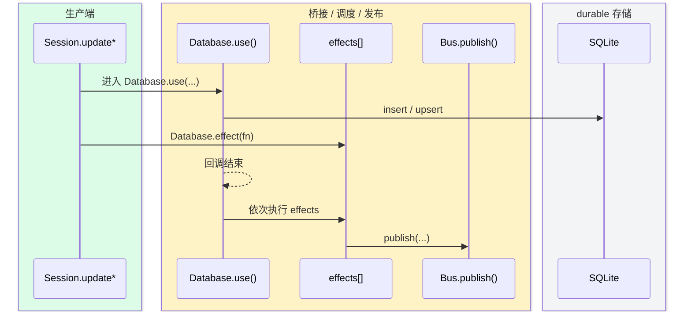

---

## 4. `processor` 用这三组 API 把流事件翻译成 durable state

`packages/opencode/src/session/processor.ts:56-420`

A05 已经详细解释了 processor 内部的事件分类。A07 重点关注“这些事件怎样进入 durable write path”。

### 4.1 reasoning 与 text 采用“占位 part + delta + 最终快照”模式

对应代码：

1. `reasoning-start` -> `Session.updatePart(...)`，见 `63-80`
2. `reasoning-delta` -> `Session.updatePartDelta(...)`，见 `82-95`
3. `reasoning-end` -> `Session.updatePart(...)`，见 `97-110`
4. `text-start` -> `Session.updatePart(...)`，见 `291-304`
5. `text-delta` -> `Session.updatePartDelta(...)`，见 `306-318`
6. `text-end` -> `Session.updatePart(...)`，见 `320-341`

这组事件形成了固定模式：

1. 先创建一个 durable 占位 part。
2. 中间增量通过 `PartDelta` 事件持续广播。
3. 结束时写回完整快照。

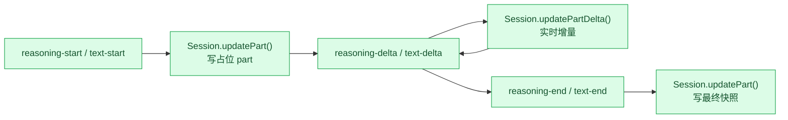

### 4.2 tool part 形成显式状态机

对应代码：

1. `tool-input-start` -> `pending`，见 `112-127`
2. `tool-call` -> `running`，见 `135-180`
3. `tool-result` -> `completed`，见 `181-203`
4. `tool-error` -> `error`，见 `205-230`

因此，tool 执行轨迹会在 durable history 中表现为一条完整状态机。

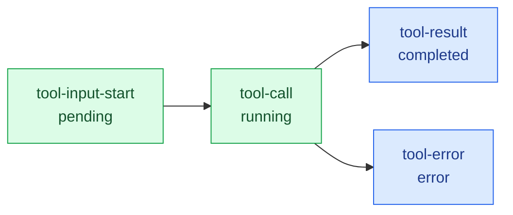

### 4.3 `finish-step` 决定 assistant message 的完成态

`245-289`

这一段决定了 assistant 主消息何时定型：

1. `246-250` 计算 usage 与 cost。
2. `251-253` 更新 `assistantMessage.finish`、`cost`、`tokens`。
3. `254-263` 写入 `step-finish` part。
4. `265-278` 根据 snapshot patch 追加 `patch` part。
5. `264` 用 `Session.updateMessage(...)` 把主消息状态写回。

因此，assistant message 的 durable 完成态落在 `finish-step` 这一组写操作上。

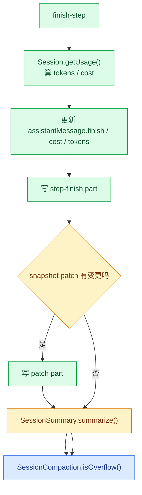

### 4.4 退出前的清理会收口未完成状态

`388-420`

即便中途出现异常，processor 仍会：

1. 尝试补一次 `patch`，见 `388-401`
2. 把所有未完成 tool part 改成 `error: "Tool execution aborted"`，见 `402-418`
3. 给 assistant message 补 `time.completed`，见 `419-420`

这样可以确保 durable history 中不会留下悬空的 running tool part。

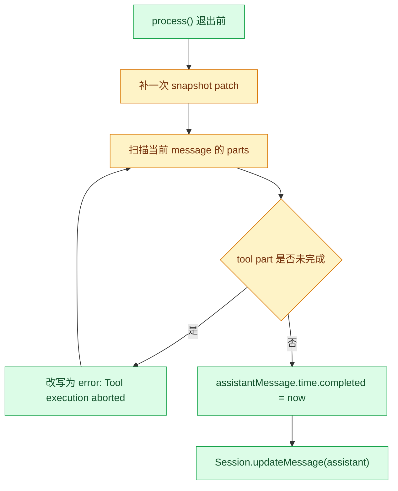

---

## 5. `SessionStatus` 属于运行态，不进入 durable history

`packages/opencode/src/session/status.ts:9-99`

message 与 part history 承担 durable 会话记录；`SessionStatus` 负责 instance-local 运行态。

### 5.1 `SessionStatus.Info` 只有三种值

`10-24`

1. `idle`
2. `retry`
3. `busy`

### 5.2 状态保存在内存 `Map` 中

`55-83`

`58-60` 使用 `InstanceState.make(...)` 构建的是 `Map<SessionID, Info>`。这张表不进入 `MessageTable` 与 `PartTable`。

### 5.3 `set()` 会广播事件，并在 `idle` 时删除内存项

`71-80`

1. `73` 发布 `session.status`
2. `74-77` 处理 `idle`，同时发布兼容事件 `session.idle`
3. 其余状态写入 `Map`

这套状态适合表达当前实例的运行情况，不承担会话历史恢复职责。

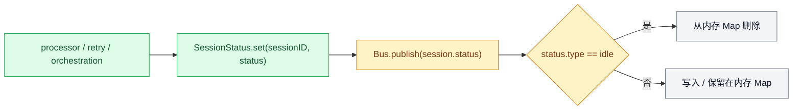

---

## 6. Durable 写入完成后，事件怎样传播到前端

这一段连接 durable write 与外部可见效果。

### 6.1 `Bus.publish()` 同时通知本地订阅者和全局总线

`packages/opencode/src/bus/index.ts:41-64`

执行过程分成三步：

1. `45-48` 组出统一的 `{ type, properties }` payload
2. `53-58` 通知当前实例的精确订阅者和 `*` 订阅者
3. `59-62` 用 `GlobalBus.emit("event", ...)` 把事件转发给全局总线

这条链保证了当前实例和全局视角都能收到更新。

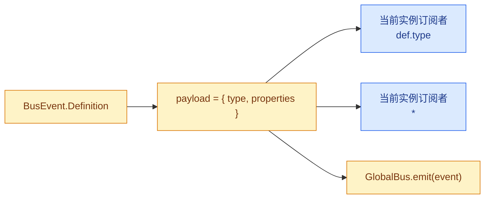

### 6.2 `/event` 把当前实例的 Bus 暴露成 SSE

`packages/opencode/src/server/routes/event.ts:13-84`

关键路径是：

1. `35-36` 用 `streamSSE` 与 `AsyncQueue` 建立事件流
2. `56-61` 通过 `Bus.subscribeAll(...)` 订阅当前实例所有事件
3. `77` 把事件写成 SSE

CLI/TUI/Web 在当前实例里看到的 message/part 更新，来自这条 SSE 通道。

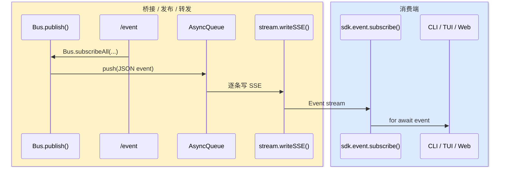

### 6.3 `/global/event` 暴露跨实例 SSE

`packages/opencode/src/server/routes/global.ts:43-124`

这一层改为监听 `GlobalBus`：

1. `98-101` 注册 `GlobalBus` 事件处理器
2. 事件负载额外携带 `directory`

全局视角可以据此同时观测多个实例。

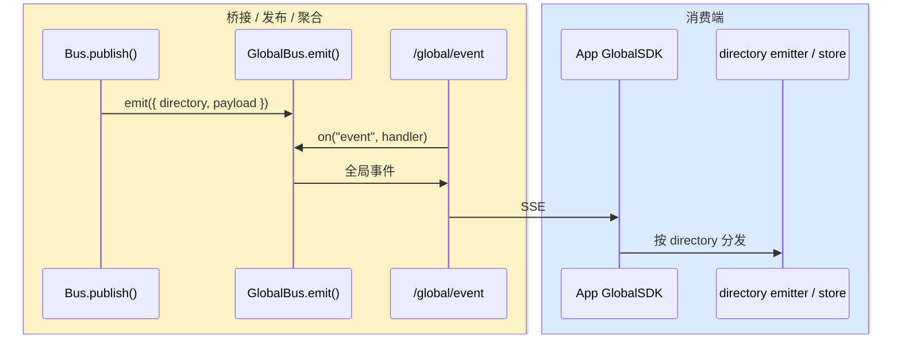

### 6.4 `publish/subscribe` 的调用链，要分清生产者链、消费者链和回放链

如果把 `publish()` / `subscribeAll()` 单独拿出来看，很容易误解成“Bus 就是状态同步本身”。其实 A07 里至少有三条链同时存在：

#### 6.4.1 同实例实时链：生产者把增量和快照推给当前前端

```ts
LLM.stream()
  -> SessionProcessor.process()
  -> Session.updatePart() / updateMessage() / updatePartDelta()
  -> Bus.publish(MessageV2.Event.*)
  -> Bus.subscribeAll(...)          // /event 路由、本地 plugin 等订阅者
  -> stream.writeSSE({ data })
  -> sdk.event.subscribe()
  -> for await (const event of events.stream)
  -> TUI / CLI / App store reducer
```

这条链里：

1. **生产者**主要是 `SessionProcessor.process()`。
2. 它把模型流事件翻译成 `Session.update*()` 调用。
3. `updateMessage()` / `updatePart()` 先写 SQLite，再经 `Database.effect()` 触发 `Bus.publish(...)`。
4. `updatePartDelta()` 不写库，直接发 `message.part.delta`，只服务实时渲染。
5. `/event` 路由通过 `Bus.subscribeAll(...)` 把本实例所有事件转成 SSE。
6. SDK 的 `event.subscribe()` 拿到 SSE 后，CLI/TUI/App 再各自更新本地 store 或终端渲染。

从消费者角度看，这条链上的典型消费者有三类：

1. `packages/opencode/src/server/routes/event.ts`：把本地 bus 变成 SSE。
2. `packages/opencode/src/plugin/index.ts`：`Plugin.init()` 里 `Bus.subscribeAll(...)`，让 plugin 旁路观察事件。
3. `packages/opencode/src/cli/cmd/run.ts`、`cli/cmd/tui/context/sdk.tsx`、`packages/app/src/context/global-sync/event-reducer.ts`：把事件投影成终端输出或前端 store。


#### 6.4.2 跨实例聚合链：同一个 `publish()` 再向上冒泡到 `GlobalBus`

```ts
Bus.publish(...)
  -> GlobalBus.emit("event", { directory, payload })
  -> /global/event
  -> app GlobalSDK SSE loop
  -> emitter.emit(directory, payload)
  -> applyGlobalEvent() / applyDirectoryEvent()
```

这里继续沿用同一个 `Bus.publish()` 作为桥接链起点；它在通知本地订阅者之后，还会继续 `GlobalBus.emit("event", ...)`。

于是：

1. `/event` 面向“当前实例”的订阅者。
2. `/global/event` 面向“跨目录/跨实例”的聚合订阅者。
3. App 里的 `GlobalSDK` 再按 `directory` 分发，把不同工作区的事件送进各自 store。

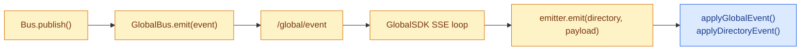

#### 6.4.3 Durable 回放链：这条链根本不靠 subscribe

```ts
Session.updateMessage() / Session.updatePart()
  -> SQLite

之后任意时刻

MessageV2.page() / stream() / hydrate()
  -> MessageV2.toModelMessages()
  -> loop() 下一轮推理 / HTTP 查询 / 历史回放
```

这条链非常关键，因为它解释了 OpenCode 为什么是 durable 的：

1. `publish/subscribe` 解决的是**低延迟通知**。
2. SQLite + `MessageV2.page()/stream()/hydrate()` 解决的是**重连、恢复、fork、分页回放**。
3. 就算某个前端错过了 `message.part.delta`，后续仍可以靠 `message.part.updated` 的最终快照，或者直接重新 bootstrap durable state，把真相补回来。


因此，A07 里“生产者/消费者怎样穿起流程”并不是一条单线：

1. **生产 durable 真相源**的是 `Session.updateMessage()` / `Session.updatePart()`。
2. **把实时事件发布到桥接链**的是 `Bus.publish()`。
3. **消费实时事件**的是 `/event`、`/global/event`、plugin、CLI、TUI、App store。
4. **消费 durable 真相源**的是 `MessageV2.stream()`、`hydrate()`、`toModelMessages()` 和下一轮 `loop()`。

---

## 7. durable rows 怎样重新读成 runtime 可消费对象

`packages/opencode/src/session/message-v2.ts:533-898`

写入完成后，系统还要把这些 rows 重新组织成 `WithParts`、历史流与模型上下文。

### 7.1 `hydrate()` 把 message rows 与 part rows 组装成 `WithParts`

`533-557`

这一段的步骤很稳定：

1. `534` 收集 message IDs
2. `537-544` 批量查询 part rows
3. `545-550` 依据 `message_id` 分组
4. `553-556` 组装成 `{ info, parts }`

运行时广泛使用的 `MessageV2.WithParts`，就是由这一步得到的投影对象。

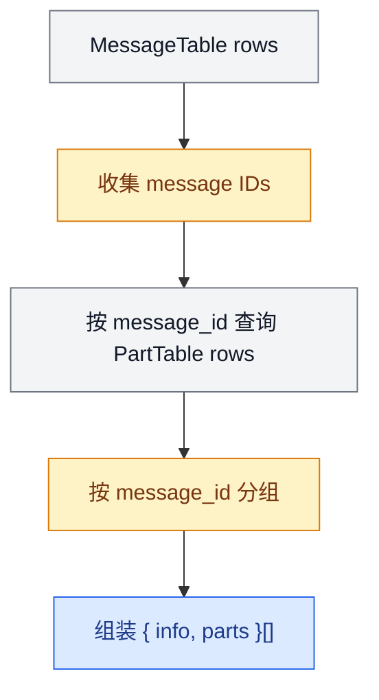

### 7.2 `page()` 与 `stream()` 负责回放 history

`794-850`

1. `805-813` `page()` 按 `time_created desc, id desc` 读取最新消息
2. `827-828` 反转当前页顺序
3. `838-849` `stream()` 再按“新到旧”持续 `yield`

`MessageV2.stream(sessionID)` 因此会按“新到旧”产出消息。这也是 `loop()` 收尾时能直接取到最新 assistant message 的原因。

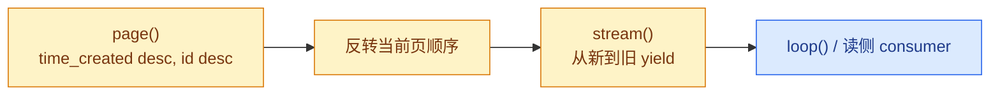

### 7.3 `filterCompacted()` 负责压缩历史视图

`882-898`

这一段会：

1. 跟踪已经被 summary 覆盖的 user turn
2. 遇到对应 compaction user message 后停止向更老历史继续扩展
3. 最后返回“旧到新”的活动历史数组

loop 与 UI 平常看到的是这份经过 compaction 处理后的活动历史。

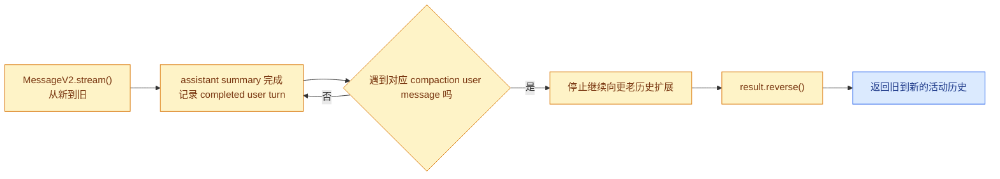

---

## 8. 同一份 durable history 还要重新投影回模型上下文

`packages/opencode/src/session/message-v2.ts:559-792`

这一步把 A07 再次接回 A06。

### 8.1 `toModelMessages()` 把 durable `WithParts[]` 转成 AI SDK `ModelMessage[]`

用户消息部分：

1. `623-666` 把 `text`、非文本 `file`、`compaction`、`subtask` 重新翻译成 user message
2. 文本文件和目录在 prompt 阶段已经展开，这里只保留应当再次进入模型的内容

assistant 消息部分：

1. `681-759` 把 `text`、`reasoning`、`tool` 投影成 assistant message parts
2. `697-748` 根据 tool part 状态生成不同类型的 tool output
3. `760-778` 某些 provider 不支持 tool result 中的媒体内容时，会追加一条 synthetic user message 承接媒体附件

```mermaid
flowchart TD
    Durable["MessageV2.WithParts[]"]
    Role{"msg.info.role"}
    User["user parts -> user ModelMessage"]
    Assistant["text / reasoning / tool<br/>-> assistant ModelMessage"]
    Media{"provider 支持<br/>tool result media 吗"}
    Synthetic["追加 synthetic user message<br/>承接媒体附件"]
    Out["ModelMessage[]"]

    Durable --> Role
    Role -- user --> User --> Out
    Role -- assistant --> Assistant --> Media
    Media -- 是 --> Out
    Media -- 否 --> Synthetic --> Out

    classDef consumer fill:#DBEAFE,stroke:#2563EB,color:#1E3A8A;
    classDef bridge fill:#FEF3C7,stroke:#D97706,color:#78350F;
    classDef storage fill:#F3F4F6,stroke:#6B7280,color:#111827;

    class User,Assistant,Synthetic,Out consumer;
    class Role,Media bridge;
    class Durable storage;
```

### 8.2 同一份 durable history 支撑三条消费链

1. loop 的下一轮推理上下文
2. SSE 历史与实时投影
3. HTTP 查询与分页回放

OpenCode 围绕这份 durable message/part history 组织运行时，不同消费侧再按各自需求生成投影。

```mermaid
flowchart TD
    Durable["durable message / part history"]
    Loop["loop()<br/>下一轮推理上下文"]
    SSE["SSE / 实时 UI 投影"]
    HTTP["HTTP 查询 / 分页回放"]

    Durable --> Loop
    Durable --> SSE
    Durable --> HTTP

    classDef consumer fill:#DBEAFE,stroke:#2563EB,color:#1E3A8A;
    classDef bridge fill:#FEF3C7,stroke:#D97706,color:#78350F;
    classDef storage fill:#F3F4F6,stroke:#6B7280,color:#111827;

    class Loop,HTTP consumer;
    class SSE bridge;
    class Durable storage;
```

---

## 9. A06 与 A07 在这里闭环

把 A06 与 A07 连起来看，主线非常完整：

1. A06 说明请求如何进入 `streamText()`
2. A07 说明返回流如何写入 durable state
3. 同一份 durable state 又会被 SSE、`loop()` 和 `toModelMessages()` 重新消费

这条闭环支撑了 OpenCode 的恢复、fork、compaction、多端订阅与历史重放。A 系列到这里完成了从入口、路由、输入编译、编排、模型请求到 durable state 投影的完整主线。


---

## 关键函数清单

| 函数/类型 | 文件 | 职责 |
|----------|------|------|
| `Session.update*()` API | `session/index.ts` | Durable 写入口：updateMessage/updatePart/updatePartDelta 三级粒度写库 |
| `Database.effect()` | `storage/db.ts:121-146` | 事务效果批处理：先写库再发事件，保证 durable → event 顺序 |
| `SessionProcessor.process()` | `session/processor.ts` | 将流事件翻译成 durable part 更新的核心处理器 |
| `Session.messages()` | `session/index.ts` | 从 SQLite 重新加载 durable rows，重建运行时对象树 |
| `DurableHistory.toModel()` | — | 将 durable history 重新投影回模型可消费消息格式 |
| `Bus.publish()` | — | durable 写完成后广播事件，驱动 SSE 推送前端 |

---

## 代码质量评估

**优点**

- **"先写库，再发事件"排序保证**：`Database.effect()` 确保 durable 写操作在事件广播前完成，前端收到 SSE 事件时数据已经持久化。
- **Durable 天然支持恢复**：所有会话状态压回 SQLite，崩溃后只需重载 durable rows，`processor` 的幂等性保证重放安全。
- **多端订阅共享同一 durable history**：TUI/Web/ACP 都从同一份 durable history 读数据，无需维护多份状态副本。

**风险与改进点**

- **`SessionStatus` 运行态不进入 durable**：session 运行状态存在内存中，崩溃后 status 归零，恢复会话时 UI 无法还原"已完成步骤"的视觉状态。
- **`Database.effect()` 批处理延迟不可控**：effect 队列在主事务后才执行，若事务量大，批处理延迟可能使前端 SSE 推送滞后，影响实时感知。
- **大量并发写导致 SQLite WAL 压力**：多工具并发调用时，每个工具结果分别触发 durable 写，SQLite WAL 文件在高并发下可能快速增长。
