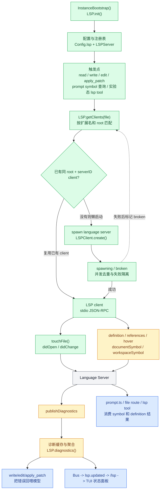
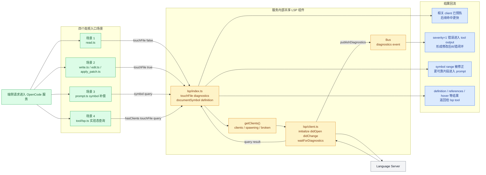

# OpenCode 深度专题 B07：LSP，代码理解、符号定位与诊断反馈是怎样接进主链路的

> 本文基于 `opencode` `v1.3.2`（tag `v1.3.2`，commit `0dcdf5f529dced23d8452c9aa5f166abb24d8f7c`）源码校对

很多 agent 项目把 LSP(Language Server Protocol) 讲成“编辑器增强”或“一个可选工具”。OpenCode 当前实现更接近另一种思路：LSP 是一层**按文件类型懒启动、按工程根分片、为 runtime 提供代码理解与诊断回路的基础设施**。它既不是主执行器，也不是纯 UI 附件，但会直接影响 read、prompt 编译、编辑后纠错和状态面板。

---


**目录**

- [1. 当前 LSP 架构不是一个点，而是五层](#1-当前-lsp-架构不是一个点而是五层)
- [2. 启动时只初始化能力，不急着起所有语言服务器](#2-启动时只初始化能力不急着起所有语言服务器)
- [3. 配置模型不是只支持开关，还支持覆写和自定义](#3-配置模型不是只支持开关还支持覆写和自定义)
- [4. 一份文件不一定只对应一个 LSP server](#4-一份文件不一定只对应一个-lsp-server)
- [5. root 发现是 LSP 能不能工作好的前提](#5-root-发现是-lsp-能不能工作好的前提)
- [6. 懒启动过程里，OpenCode 还做了失败隔离和并发去重](#6-懒启动过程里opencode-还做了失败隔离和并发去重)
- [7. `LSPClient` 真正做的是“把文件系统变化翻译成 LSP 事件”](#7-lspclient-真正做的是把文件系统变化翻译成-lsp-事件)
- [8. diagnostics 是 OpenCode 接 LSP 的第一公民](#8-diagnostics-是-opencode-接-lsp-的第一公民)
- [9. LSP 真正嵌进主链路的地方，是读写循环](#9-lsp-真正嵌进主链路的地方是读写循环)
- [10. 符号能力已经接进 prompt 编译，但用得很克制](#10-符号能力已经接进-prompt-编译但用得很克制)
- [11. 对外暴露面分成“稳定面”和“实验面”](#11-对外暴露面分成稳定面和实验面)
- [12. LSP 在 OpenCode 里实际发挥作用的四个场景](#12-lsp-在-opencode-里实际发挥作用的四个场景)
- [13. 把 B07 压成一句代码级结论](#13-把-b07-压成一句代码级结论)

---

## 1. 当前 LSP 架构不是一个点，而是五层

| 层 | 代码坐标 | 角色 |
| --- | --- | --- |
| 配置层 | `packages/opencode/src/config/config.ts:1152-1187` | 定义 `lsp` 配置 schema，允许关闭、覆写内建 server、注册自定义 server。 |
| server 注册层 | `packages/opencode/src/lsp/server.ts:35-53`、`95+` | 声明每种语言 server 的扩展名匹配、root 发现和 spawn 方式。 |
| runtime 调度层 | `packages/opencode/src/lsp/index.ts:80-300` | 维护 `servers/clients/broken/spawning` 状态，按文件懒启动 client。 |
| JSON-RPC client 层 | `packages/opencode/src/lsp/client.ts:43-245` | 跟具体 LSP 进程做 stdio 通信，接收 diagnostics，推送 didOpen/didChange。 |
| 消费层 | `tool/read.ts:215-217`、`tool/write.ts:54-82`、`tool/edit.ts:146-160`、`tool/apply_patch.ts:234-269`、`session/prompt.ts:1148-1167` | 把 LSP 能力接回主链路。 |

所以 OpenCode 的 LSP 不是“给模型多开了个查询接口”，而是“在文件读写循环旁边挂了一层代码语义反馈”。

### 1.1 LSP 在 OpenCode 里的工作原理总图

下面这张图可以先建立一个整体心智模型：OpenCode 并不是在启动时一次性拉起所有语言服务器，而是先注册能力；等到 `read`、`write`、`edit`、`apply_patch`、prompt 编译里的 symbol 查询，或者实验态 `lsp` tool 真正命中文件时，再按 `扩展名 + root` 找 client，必要时懒启动 language server。后续同一个 `(root, serverID)` 会被复用，文件变化通过 `didOpen` / `didChange` 主动同步给 server，再把 diagnostics 和 symbol 结果接回主链路。



这张图里其实有两条并行但会共享 client 的链：

1. `touchFile -> diagnostics -> 编辑后纠错`，这是当前最常用的一条。
2. `symbol/query -> prompt/file route/lsp tool`，这是代码理解与定位链。

二者共享同一套 client 复用、root 分片、懒启动和失败隔离机制。

---

## 2. 启动时只初始化能力，不急着起所有语言服务器

`InstanceBootstrap()` 很早就会调用 `LSP.init()`，见 `packages/opencode/src/project/bootstrap.ts:15-22`。但这里做的不是把所有 LSP server 全部拉起，而只是把状态容器准备好。

`packages/opencode/src/lsp/index.ts:80-140` 当前初始化逻辑是：

1. 先读 `Config.get()`。
2. 若 `cfg.lsp === false`，直接全局禁用。
3. 把 `LSPServer` 里的内建 server 注册进 `servers`。
4. 应用实验 flag 和用户配置覆写。
5. 建立 `broken`、`clients`、`spawning` 三组运行态。

这里最关键的结论是：**LSP 是 eager init、lazy spawn。**

也就是说，runtime 会先知道“有哪些 server 可用”，但真正启动某个 LSP 进程，要等某个文件真的触发了它。

---

## 3. 配置模型不是只支持开关，还支持覆写和自定义

`packages/opencode/src/config/config.ts:1152-1187` 里的 `lsp` 配置支持三种模式：

1. `false`：全局禁用全部 LSP。
2. 内建 server 覆写：例如改 `command`、`env`、`initialization`，或设 `disabled: true`。
3. 自定义 server：只要提供 `command`，并给非内建 server 补 `extensions`。

这一段 schema 还显式做了校验：

1. 如果名字命中内建 `LSPServer`，可以不写 `extensions`。
2. 如果是自定义 server，`extensions` 必填。

说明 OpenCode 把 LSP 看成“可配置 runtime 组件”，不是写死在代码里的硬编码列表。

另外还有两组很关键的运行时开关，定义在 `packages/opencode/src/flag/flag.ts:26`、`63-64`：

1. `OPENCODE_DISABLE_LSP_DOWNLOAD`：禁止自动下载缺失的语言服务器。
2. `OPENCODE_EXPERIMENTAL_LSP_TY`：启用 `ty`，并在 `packages/opencode/src/lsp/index.ts:65-77` 里把 `pyright` 挤掉。

这说明 Python LSP 在当前版本里其实是一个可切换的实现位，而不是固定死绑到 `pyright`。

---

## 4. 一份文件不一定只对应一个 LSP server

这点非常关键，也是最容易被忽略的一点。

`packages/opencode/src/lsp/index.ts:178-261` 的 `getClients(file)` 并不是“找到一个最匹配 server 就结束”，而是：

1. 遍历当前启用的全部 servers。
2. 用扩展名过滤。
3. 调每个 server 自己的 `root(file)` 判断当前文件是否落在它负责的工程根里。
4. 对每个 `(root + serverID)` 去重、复用或懒启动。
5. 把所有匹配 client 全部收集起来。

这意味着对一个前端工程文件，OpenCode 可能同时挂上：

1. `typescript`
2. `eslint`
3. `oxlint`
4. `biome`
5. `vue`（若是 `.vue`）

也就是说，这里不是“一个语言一个 server”，而是“一个文件可以叠多层代码智能与诊断来源”。

`diagnostics()` 也印证了这一点。`packages/opencode/src/lsp/index.ts:291-300` 会把所有已连接 client 的诊断结果聚合到同一个 `Record<string, Diagnostic[]>` 里，而不是只取单一来源。

---

## 5. root 发现是 LSP 能不能工作好的前提

`packages/opencode/src/lsp/server.ts:35-53` 的 `NearestRoot(...)` 是当前 root 发现的公共骨架：从当前文件目录向上找标记文件，必要时支持排除条件，找不到时再退回 `Instance.directory`。

各语言 server 再在这个骨架上编码各自的“工程边界”：

1. `typescript` 用锁文件找 JS/TS 工程根，并显式排除 `deno.json`，见 `lsp/server.ts:95-122`。
2. `gopls` 优先 `go.work`，再退回 `go.mod` / `go.sum`，见 `366-386`。
3. `ty` / `pyright` 围绕 `pyproject.toml`、`requirements.txt`、`pyrightconfig.json` 等 Python 项目标记工作，见 `447-509`、`511-558`。
4. `bash`、`dockerfile` 这种弱工程边界语言，则直接退到 `Instance.directory`，见 `1643-1680`、`1855-1892`。

所以 LSP 在 OpenCode 里不是“按整个 workspace 起一份大进程”，而更像“按文件命中的项目根分仓启动”。

同时，各 server 的 `spawn()` 策略也不完全一样：

1. 有些要求本机已有工具链，例如 `deno`、`gopls`、`dart`、`ocaml-lsp`。
2. 有些会优先找本地 binary，找不到再自动下载或安装，例如 `vue-language-server`、`pyright`、`bash-language-server`、`terraform-ls`。
3. 有些还会把 server-specific `initialization` 一并传给 LSP client。

所以 OpenCode 宣称的“LSP 开箱即用”，本质上是“能本地复用就复用，必要时在运行期补安装”，而不是所有语言都内嵌在二进制里。

---

## 6. 懒启动过程里，OpenCode 还做了失败隔离和并发去重

`packages/opencode/src/lsp/index.ts:183-258` 的调度逻辑有三个很实用的保护：

### 6.1 `broken`

某个 `(root + serverID)` 一旦 spawn 或 initialize 失败，就会进 `broken` 集合，后续不再反复重试。

### 6.2 `spawning`

若同一时刻多个请求都命中了同一个 LSP server/root，对应 promise 会被放进 `spawning` map，其余调用直接等这一个 in-flight 结果，避免重复拉进程。

### 6.3 复用已连接 client

一旦 `s.clients` 里已有同一个 `(root, serverID)`，后续直接复用，而不是重新建连接。

这三点组合起来，说明它不是“每次调用工具就临时起个语言服务器”，而是有明确复用策略的长期运行部件。

---

## 7. `LSPClient` 真正做的是“把文件系统变化翻译成 LSP 事件”

`packages/opencode/src/lsp/client.ts:43-245` 这一层很值得细看。

### 7.1 连接协议就是标准 stdio JSON-RPC

`47-50` 用 `createMessageConnection(...)` 把 child process 的 stdin/stdout 接成 LSP 连接。

### 7.2 初始化会同时发 `initialize` 和配置

`82-134` 会：

1. 发送 `initialize`
2. 带上 `rootUri`、`workspaceFolders`
3. 注入 `initializationOptions`
4. 声明 `didOpen` / `didChange` / `publishDiagnostics` 等能力
5. 初始化后再补一个 `workspace/didChangeConfiguration`

所以 OpenCode 并不是“起个 server 就直接发 query”，而是把自己当作一个相对完整的 LSP client。

### 7.3 `touchFile()` 最终会走 `didOpen` 或 `didChange`

`149-205` 的 `notify.open()` 会先读文件内容，再：

1. 若这个文件第一次进入当前 client，发 `workspace/didChangeWatchedFiles` + `textDocument/didOpen`
2. 若之前已打开过，则发 `workspace/didChangeWatchedFiles` + `textDocument/didChange`

换句话说，OpenCode 的 LSP 视图不是“假定 server 自己监控磁盘”，而是 runtime 主动把文件内容同步给它。

---

## 8. diagnostics 是 OpenCode 接 LSP 的第一公民

从源码看，当前 LSP 接入最核心的产物不是 definition，也不是 hover，而是 diagnostics。

`packages/opencode/src/lsp/client.ts:53-63` 收到 `textDocument/publishDiagnostics` 后会：

1. 把结果写进本地 `Map<path, Diagnostic[]>`
2. 通过 `Bus.publish(Event.Diagnostics, ...)` 广播

`210-237` 的 `waitForDiagnostics()` 又做了两件事：

1. 订阅同路径、同 server 的 diagnostics 事件
2. 做一个 `150ms` debounce，给语义诊断等 follow-up 留窗口

然后 `packages/opencode/src/lsp/index.ts:277-289` 的 `touchFile(file, true)` 会把 `notify.open()` 和 `waitForDiagnostics()` 绑在一起，形成“通知 server + 等诊断回来”的最小闭环。

这条闭环后面直接喂给了编辑类工具。

---

## 9. LSP 真正嵌进主链路的地方，是读写循环

### 9.1 `read` 只预热，不阻塞主流程

`packages/opencode/src/tool/read.ts:215-217` 在读完文件后只做一件事：

```ts
LSP.touchFile(filepath, false)
```

注释也写得很直白：`just warms the lsp client`。

也就是说，OpenCode 当前不会为了“读文件”同步等待 LSP 结果，但会趁机把相关语言 server 热起来，为后续符号查询和诊断做准备。

### 9.2 `write` / `edit` / `apply_patch` 会把 diagnostics 直接反馈给模型

这三类编辑工具在写盘后都会：

1. `LSP.touchFile(..., true)`
2. `LSP.diagnostics()`
3. 把 severity=1 的错误格式化进 tool output

对应位置分别是：

1. `packages/opencode/src/tool/write.ts:54-82`
2. `packages/opencode/src/tool/edit.ts:146-160`
3. `packages/opencode/src/tool/apply_patch.ts:234-269`

这说明 LSP 在 OpenCode 当前最重要的 runtime 价值是：

1. 不是帮模型“理解一切”
2. 而是让模型在编辑后立即看到编译/静态分析报错

也就是把“修改代码”闭成“修改 -> 诊断 -> 再修正”的反馈回路。

---

## 10. 符号能力已经接进 prompt 编译，但用得很克制

LSP 并不是只在 edit 后校验。

`packages/opencode/src/session/prompt.ts:1148-1167` 当前有一个非常典型的用法：当 `file:` part 带了 `start/end` 查询参数，而且某些 server 的 `workspace/symbol` 只返回了退化 range 时，会再调用一次 `LSP.documentSymbol()` 去修正 symbol 的完整区间。

这段代码的含义是：

1. OpenCode 已经承认 `workspace/symbol` 的结果不总是够用。
2. 真正要把“符号附件”稳定地转成文件片段时，还得回到 document 级 symbol 树补精度。

`packages/opencode/src/session/message-v2.ts:153-160` 里也能看到对应的数据结构，`SymbolSource` 会把 `path`、`range`、`name`、`kind` 一并存下来。

因此，LSP 在主链路里的第二个价值是：**帮 prompt 编译阶段把“符号引用”变成更可靠的文件片段。**

---

## 11. 对外暴露面分成“稳定面”和“实验面”

### 11.1 稳定面：状态查询和 UI 刷新

`packages/opencode/src/server/server.ts:458-475` 暴露了 `GET /lsp`，返回 `LSP.status()`。

这里有个很重要的细节：`status()` 只枚举已经连接成功的 client，见 `packages/opencode/src/lsp/index.ts:163-175`。也就是说，它展示的是**当前已激活的 LSP 状态**，不是“配置里声明过的所有 server”。

TUI 侧在 `packages/opencode/src/cli/cmd/tui/context/sync.tsx:343-345` 监听 `lsp.updated` 后，会重新请求一次 `sdk.client.lsp.status()` 刷新状态面板。

### 11.2 实验面：显式 `lsp` 工具

`packages/opencode/src/tool/registry.ts:124-132` 里，`LspTool` 只有在 `OPENCODE_EXPERIMENTAL_LSP_TOOL` 打开时才会注册。

`packages/opencode/src/tool/lsp.ts:23-84` 又说明这个工具是一个独立 permission 面：

1. 调用前必须过 `permission: "lsp"`
2. 要先 `hasClients(file)`
3. 再 `touchFile(file, true)`
4. 然后才允许 definition / references / hover / call hierarchy 等操作

所以 OpenCode 当前的态度很明确：LSP 作为 runtime 底座已经在用，但把它完整开放成模型主动可调用工具，仍然算实验能力。

### 11.3 半开放面：API 已留口，但还没真正放量

`packages/opencode/src/server/routes/file.ts:86-115` 里有个 `/find/symbol` 路由，OpenAPI 描述和 schema 都写好了，但真正逻辑被注释掉，当前直接 `return c.json([])`。

这说明工程已经预留了“把 workspace symbol 搜索纳入公共 API”的位置，但在 `v1.3.2`，这条能力还没有正式对外稳定开放。

---

## 12. LSP 在 OpenCode 里实际发挥作用的四个场景

如果把前面的实现细节压回“runtime 到底在什么时候真的用上了 LSP”，当前最值得记住的是下面四个场景。

### 12.1 先看端到服务、再到服务内部的组件交互

前一版图把“场景流转”画出来了，但你如果要真正建立工程级心智模型，还需要再补一层：**谁是入口，谁是统一门面，谁在维护 client 池，谁真正和外部 language server 通信，结果又是怎样回流到工具、prompt 和 TUI 的。**

下面这张图专门补“组件关系 + 交互方向”。

```mermaid
flowchart LR
    subgraph End["端侧"]
        UI["TUI / CLI / Desktop / SDK"]
    end

    subgraph Service["OpenCode 服务进程"]
        subgraph Entry["入口与消费层"]
            Prompt["SessionPrompt.loop()<br/>prompt.ts"]
            Read["read.ts"]
            Edit["write.ts / edit.ts / apply_patch.ts"]
            LspTool["tool/lsp.ts<br/>实验态显式查询"]
            Status["server /lsp<br/>TUI sync"]
        end

        subgraph Facade["LSP 门面与调度层"]
            LSPMod["lsp/index.ts<br/>init status getClients<br/>touchFile diagnostics query"]
            Registry["LSPServer + Config.lsp<br/>extensions root spawn"]
            Pool["clients / spawning / broken"]
        end

        subgraph ClientLayer["LSP client 与事件层"]
            Client["lsp/client.ts<br/>initialize didOpen didChange<br/>waitForDiagnostics"]
            Bus["Bus<br/>lsp.updated + diagnostics event"]
        end
    end

    subgraph External["外部 Language Server 进程"]
        LS["typescript / eslint / gopls / pyright / ..."]
    end

    UI -->|发起会话与查看状态| Prompt
    UI -->|查询 LSP 状态| Status

    Prompt -->|symbol 补偿查询| LSPMod
    Read -->|touchFile false| LSPMod
    Edit -->|touchFile true + diagnostics| LSPMod
    LspTool -->|definition refs hover 等| LSPMod
    Status -->|status()| LSPMod

    LSPMod -->|按扩展名与 root 选 server| Registry
    LSPMod -->|复用或创建 client| Pool
    Pool -->|create or reuse| Client
    Client -->|JSON RPC stdio| LS
    LS -->|diagnostics and query result| Client

    Client -->|publish diagnostics| Bus
    Client -->|返回 query 结果| LSPMod

    Bus -->|waitForDiagnostics / diagnostics()| Edit
    Bus -->|lsp.updated| Status
    LSPMod -->|symbol range result| Prompt
    LSPMod -->|definition hover refs result| LspTool
    LSPMod -->|connected clients| Status

    classDef endSide fill:#DBEAFE,stroke:#2563EB,color:#1E3A8A;
    classDef entry fill:#DCFCE7,stroke:#16A34A,color:#14532D;
    classDef facade fill:#FEF3C7,stroke:#D97706,color:#78350F;
    classDef client fill:#FDE68A,stroke:#B45309,color:#78350F;
    classDef external fill:#F3F4F6,stroke:#6B7280,color:#111827;

    class UI endSide;
    class Prompt,Read,Edit,LspTool,Status entry;
    class LSPMod,Registry,Pool,Bus facade;
    class Client client;
    class LS external;
```

这张图要点有三个：

1. 端侧不会直接碰 language server，而是统一通过 OpenCode 服务里的入口层和 `LSP` 门面层转发。
2. `lsp/index.ts` 才是 LSP 子系统的统一调度门面；`LSPServer` 负责“有哪些 server、扩展名和 root 怎么匹配、如何 spawn”，`LSPClient` 负责真正的 JSON-RPC 通信。
3. 回流有两条路：`query result` 直接回到调用者模块，`diagnostics` 先进入 `Bus`，再喂给 `waitForDiagnostics()`、`diagnostics()` 聚合和 TUI 状态刷新。

### 12.2 再看四个高频场景总图

这张图不再只画“步骤”，而是把四个高频场景怎样穿过同一套 LSP 组件，也一并压在一张图里。



### 12.3 场景一：`read` 只是预热，不阻塞主流程

对应代码：`packages/opencode/src/tool/read.ts:215-217`

这里的动作非常克制：

1. 文件读完后调用 `LSP.touchFile(filepath, false)`
2. 不等待 diagnostics
3. 不把 symbol 结果直接塞回本次 read 输出

所以它的作用不是“读文件时顺便做智能分析”，而是：

1. 让匹配的 `(root + serverID)` client 提前连起来
2. 让后续的 symbol 查询和 diagnostics 能更快命中

也就是说，LSP 在 `read` 环节承担的是**预热基础设施**，不是主结果生产者。

### 12.4 场景二：`write/edit/apply_patch` 后立即回收 diagnostics

对应代码：

1. `packages/opencode/src/tool/write.ts:54-82`
2. `packages/opencode/src/tool/edit.ts:146-160`
3. `packages/opencode/src/tool/apply_patch.ts:234-269`

这是 LSP 当前最核心、最高频的实际用途：

1. 编辑工具先把变更落盘
2. 再 `LSP.touchFile(..., true)`，让 runtime 主动把新文件内容同步给 language server
3. 等 `publishDiagnostics` 回来
4. 用 `LSP.diagnostics()` 聚合所有 client 的诊断
5. 把严重错误格式化进 tool output，让模型继续修

所以在 OpenCode 里，LSP 最重要的价值不是抽象意义上的“代码智能”，而是非常具体的：

1. 把编辑行为闭成“修改 -> 诊断 -> 再修正”的反馈回路
2. 让模型在同一轮或下一轮里直接看到静态分析/编译级错误

### 12.5 场景三：prompt 编译时补 symbol 区间精度

对应代码：`packages/opencode/src/session/prompt.ts:1148-1167`

这条链比较隐蔽，但很关键。

当 prompt 编译阶段要把某个 symbol 变成具体文件片段时，如果某些 server 给出的 `workspace/symbol` 结果只有退化 range，OpenCode 会：

1. 继续调用 `LSP.documentSymbol()`
2. 用 document 级 symbol 树修正更完整的区间
3. 再把修正后的片段送进上下文

所以这里 LSP 发挥的作用不是“替代 read/grep”，而是：

1. 给 `file:` / symbol 引用补精度
2. 降低送进模型的代码片段范围不准、截断不对的风险

### 12.6 场景四：实验态把 LSP 显式暴露成 tool

对应代码：

1. `packages/opencode/src/tool/registry.ts:124-132`
2. `packages/opencode/src/tool/lsp.ts:23-84`

默认情况下，LSP 虽然已经在 runtime 内部工作，但并不会完整暴露给模型直接调用。只有打开 `OPENCODE_EXPERIMENTAL_LSP_TOOL` 后，模型才会得到一组显式查询能力：

1. `definition`
2. `references`
3. `hover`
4. `documentSymbol`
5. `workspaceSymbol`
6. `implementation`
7. `call hierarchy`

而且这条链也不是直接裸调，而是要先过：

1. `permission: "lsp"`
2. `hasClients(file)`
3. `touchFile(file, true)`

所以这一层说明的是：

1. OpenCode 工程内部已经把 LSP 当作基础设施
2. 但对模型显式开放这组能力仍然很克制，只放在实验面

### 12.7 把这四个场景压成一句话

如果只记一条总判断，可以记成：

1. `read` 阶段，LSP 负责预热。
2. `write/edit/apply_patch` 阶段，LSP 负责诊断闭环。
3. `prompt` 编译阶段，LSP 负责 symbol 精度补偿。
4. 实验态 `lsp` tool 阶段，LSP 才变成显式查询接口。

---

## 13. 把 B07 压成一句代码级结论

OpenCode 当前对 LSP 的使用方式，可以压成四句话：

1. **它是懒启动、按 root 分片、允许多 server 叠加的代码智能层。**
2. **它最重要的现实用途不是 query，而是 diagnostics 反馈回路。**
3. **它已经参与 prompt 编译中的符号定位修正，但仍然是辅助层，不取代 `read` / `grep` / durable history。**
4. **工程内部已经把 LSP 当基础设施来组织，但对模型直接暴露这层能力依然保持克制，只开放了实验面和状态面。**

所以如果要一句话概括 B07：

> 在 OpenCode 里，LSP 不是“外挂工具”，而是围绕文件读写主链路搭起来的一层语义校验与符号补偿基础设施。


---

## 关键函数清单

| 函数/类型 | 文件 | 职责 |
|----------|------|------|
| `Lsp.start()` | `lsp/index.ts` | LSP server 懒启动：eager init + lazy spawn by file match |
| `LSPClient.openDocument()` | `lsp/index.ts` | 将文件打开事件通知 LSP，建立文档跟踪 |
| `LSPClient.getDiagnostics()` | `lsp/index.ts` | 获取文件的 diagnostic 列表（lint errors/warnings）|
| `Lsp.symbols()` | `lsp/index.ts` | 请求文件符号列表，嵌入 prompt 编译（克制使用）|
| `Config.lsp` 配置 | `config/config.ts` | LSP server 配置：per-language server 定义、disable/enable 开关 |
| `root.discover()` | `lsp/index.ts` | 发现当前项目的 workspace root，用于 LSP initialize 请求 |

---

## 代码质量评估

**优点**

- **Diagnostics 是 LSP 集成的第一公民**：`getDiagnostics()` 是最常用的 LSP 接口，与工具调用结果直接结合，赋予模型代码错误感知能力。
- **懒启动隔离失败**：`Lsp.start()` lazy spawn 意味着未命中 LSP server 的文件类型不会触发 server 启动失败，不影响其他功能。
- **并发去重防止重复启动**：多个文件同时打开时，`spawning` map 确保同一语言的 LSP server 只启动一次，不会并发启动多个实例。

**风险与改进点**

- **符号能力被显式限制**：注释中明确标注符号能力"用得很克制（experimental）"，说明 LSP 符号查询的稳定性和精确度存在未解问题，依赖此功能的高级分析不可靠。
- **Root 发现成功率影响 LSP 效果**：`root.discover()` 失败时 LSP server 以当前目录为 root，可能导致 monorepo 场景下 LSP 上下文不准确（如 Go workspace 跨模块引用失配）。
- **多语言 LSP server 进程管理开销大**：大型 monorepo 可能启动 3-5 个 LSP server 进程，无进程池或资源上限，可能在内存受限环境下造成资源竞争。
