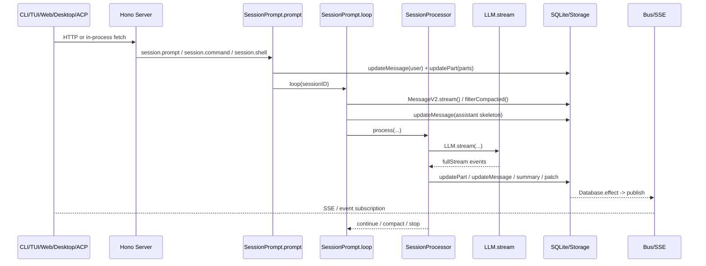

# 执行主线索引：OpenCode 运行主线深度解析

> 本文基于 `opencode` `v1.3.2`（tag `v1.3.2`，commit `0dcdf5f529dced23d8452c9aa5f166abb24d8f7c`）源码校对。当前仓库里，承载这条主线的实际文件编号已经调整；下文统一按现有文件名列出，避免继续引用旧编号。

这条主线可以压成一句话：

```text
入口宿主 -> Server -> SessionPrompt.prompt -> SessionPrompt.loop -> SessionProcessor.process -> LLM.stream -> Durable State -> Bus/SSE
```

---

## 1. 当前主线文档分别卡在哪一跳

| 文件 | 主文件 | 核心交接点 | 这一跳回答什么 |
| --- | --- | --- | --- |
| [17-sdk-transport.md](./17-sdk-transport.md) | `src/index.ts`、`cli/cmd/run.ts`、`cli/cmd/tui/*`、桌面壳 | 入口怎样收束成同一套 HTTP/SSE contract | CLI/TUI/Web/Attach/ACP/Desktop 为什么最后都能打到同一个 server |
| [26-server-routing.md](./26-server-routing.md) | `server/server.ts`、`server/routes/session.ts` | 请求怎样获得 `WorkspaceContext` / `Instance` | Hono app 怎样完成认证、实例绑定、路由装配并进入 `/session` |
| [12-prompt-system.md](./12-prompt-system.md) | `session/prompt.ts` | `POST /session/:id/message` 怎样变成 durable user message | text/file/agent/subtask parts 怎样被编译、改写和落库 |
| [27-session-loop.md](./27-session-loop.md) | `session/prompt.ts` | `loop()` 如何从 durable history 推导下一轮动作 | 并发占位、历史回放、subtask、compaction、overflow、normal round 怎样串成一台状态机 |
| [28-stream-processor.md](./28-stream-processor.md) | `session/processor.ts` | `SessionProcessor.process()` 如何消费单轮流事件 | reasoning、text、tool、step、patch、error 怎样写回 durable history |
| [29-llm-request.md](./29-llm-request.md) | `session/llm.ts`、`session/system.ts`、`provider/provider.ts` | 进入模型前的最后一次编译 | provider prompt、system、tools、headers、options、middleware 怎样拼起来 |
| [10-session-resume.md](./10-session-resume.md) | `session/processor.ts`、`session/index.ts`、`message-v2.ts` | 模型流怎样写回 durable state | reasoning、text、tool、step、patch 事件怎样落库并重新投影给前端 |

---

## 2. 默认执行链的 10 步

1. `opencode/package.json:8-18`
   `dev` 把开发态启动送进 `packages/opencode/src/index.ts`。
2. `packages/opencode/src/index.ts:67-147`
   初始化日志、环境变量、SQLite 迁移，并注册所有命令。
3. `cli/cmd/tui/thread.ts:66-230`
   默认 `$0 [project]` 命令解析目录、启动 worker、选择内嵌还是真实 HTTP transport。
4. `cli/cmd/tui/worker.ts:47-154`
   用 `Server.Default().fetch()` 和 `sdk.event.subscribe()` 把 UI 接到 runtime。
5. `server/server.ts:55-253`
   请求经过 `onError -> auth -> logging -> CORS -> WorkspaceContext -> Instance.provide -> route mount`。
6. `server/routes/session.ts:783-821`
   `/session/:sessionID/message` 调 `SessionPrompt.prompt({ ...body, sessionID })`。
7. `session/prompt.ts:162-188`
   `prompt()` 先 `createUserMessage(input)`，把本次输入编译进 durable history。
8. `session/prompt.ts:278-756`
   `loop()` 每轮回放 `MessageV2.stream()`，判断这轮该走 subtask、compaction，还是 normal round。
9. `session/processor.ts:46-425`
   `processor.process()` 只消费这一轮 `LLM.stream()` 产出的事件流。
10. `session/index.ts`、`message-v2.ts`
    `Session.updateMessage()` / `updatePart()` 把结果写回 SQLite，再通过 `Bus` / SSE 投影出去。

---

## 3. 产物怎样逐跳变化



阅读这张图时，重点盯住每一步生成的 durable 产物：

1. 入口层产出的是一个 HTTP/RPC 请求。
2. `prompt()` 产出的是 durable user message / parts。
3. `loop()` 产出的是本轮要执行的分支，以及一条 assistant skeleton。
4. `processor` 产出的是一串 durable parts 和 assistant finish/error/tokens。
5. 前端订阅到的是数据库写回后的事件投影。

---

## 4. 为什么主线必须和专题稿一起读

| 主线节点 | 需要补哪篇专题稿 |
| --- | --- |
| 入口与 transport | [19-settings-config.md](./19-settings-config.md)、[31-infra.md](./31-infra.md) |
| 输入编译 | [30-model.md](./30-model.md)、[11-context-management.md](./11-context-management.md) |
| 编排主线 | [13-multi-agent.md](./13-multi-agent.md)、[18-resilience.md](./18-resilience.md) |
| 模型请求 | [11-context-management.md](./11-context-management.md)、[34-design-philosophy.md](./34-design-philosophy.md)、[23-bridge-system.md](./23-bridge-system.md) |
| durable 写回 | [31-infra.md](./31-infra.md) |

原因很简单：主线稿回答“代码怎么走”，专题稿回答“为什么这条路能稳定成立”。

---

## 5. 读主线时先立住 4 个判断

1. 请求作用域先于 session：`WorkspaceContext` / `Instance` 会先绑定到请求上，后面的 `/session` 路由才开始工作。
2. `prompt()` 先写 durable 输入，再决定要不要回复；它不会一上来就碰模型。
3. `loop()` 每轮都重新回放历史，而不是依赖某个常驻 conversation 对象。
4. `processor` 只负责单轮，不负责全局调度；它的输出是 `"continue" | "compact" | "stop"`，由 `loop()` 再决定下一步。

只要这 4 件事没看偏，`11-17` 这条主线的边界就不会混。

---

## 6. 推荐阅读顺序

1. 先读 [17-sdk-transport.md](./17-sdk-transport.md) 和 [26-server-routing.md](./26-server-routing.md)，把 transport 边界和 runtime 边界切开。
2. 再读 [12-prompt-system.md](./12-prompt-system.md) 到 [28-stream-processor.md](./28-stream-processor.md)，把 `prompt -> loop -> processor` 的交接链吃透。
3. 接着看 [29-llm-request.md](./29-llm-request.md) 和 [10-session-resume.md](./10-session-resume.md)，理解“请求怎样发出去、结果怎样落回来”。
4. 最后回看 [30-model.md](./30-model.md)、[11-context-management.md](./11-context-management.md)、[13-multi-agent.md](./13-multi-agent.md)、[18-resilience.md](./18-resilience.md)、[31-infra.md](./31-infra.md)、[19-settings-config.md](./19-settings-config.md) 和 [23-bridge-system.md](./23-bridge-system.md)，补对象模型、上下文工程、韧性、基础设施，以及启动配置和扩展系统。
