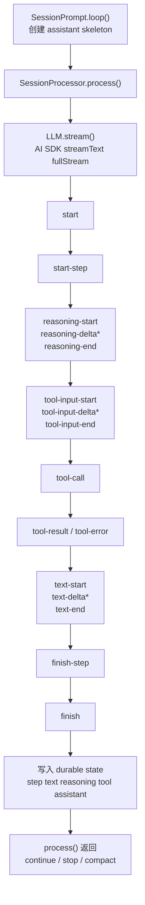

# OpenCode A06：`LLM.stream()`

> 本文基于 `opencode` `v1.3.2`（tag `v1.3.2`，commit `0dcdf5f529dced23d8452c9aa5f166abb24d8f7c`）源码校对

A06 进入模型请求出站链路。在 `v1.3.2` 中，大模型请求会经过 system prompt 选择、环境注入、指令文件加载、tool set 包装、provider 参数合并、兼容补丁和 AI SDK middleware 多层处理。

---

## 1. 入口坐标

这条调用链的关键代码有四组：

| 环节 | 代码坐标 | 作用 |
| --- | --- | --- |
| `processor -> llm` 交接 | `packages/opencode/src/session/processor.ts:46-56` | 单轮执行开始，调用 `LLM.stream()`。 |
| system prompt 组装 | `packages/opencode/src/session/prompt.ts:675-685`、`session/system.ts:17-67`、`session/instruction.ts:72-191` | provider prompt、环境信息、技能、AGENTS/CLAUDE 指令等被合并。 |
| provider/tool/params 绑定 | `packages/opencode/src/session/llm.ts:48-285` | 选择 language model、参数、headers、tools，并最终调用 `streamText()`。 |
| provider 适配 | `packages/opencode/src/provider/provider.ts:1319-1487` | `getProvider`、`getModel`、`getLanguage`、`defaultModel`、`parseModel`。 |

---

## 2. system prompt 由四层来源叠加组成

在 `v1.3.2` 中，system prompt 分两段生成。

### 2.1 `prompt.ts` 先准备“运行时上下文层”

普通推理分支里，`675-685` 会先拼出：

1. `SystemPrompt.environment(model)`：环境信息，见 `session/system.ts:28-53`
2. `SystemPrompt.skills(agent)`：技能目录和说明，见 `55-67`
3. `InstructionPrompt.system()`：AGENTS.md / CLAUDE.md / config instructions / URL instructions，见 `instruction.ts:117-142`

如果本轮是 JSON schema 输出，还会额外追加结构化输出强制指令。

### 2.2 `llm.ts` 再决定 provider/agent/user 级覆盖顺序

`session/llm.ts:70-82` 的最终顺序是：

1. 若 agent 自带 `prompt`，优先它；否则退回 `SystemPrompt.provider(model)`
2. 再接上 `input.system`，也就是上一层准备好的环境/技能/指令
3. 最后再接 `input.user.system`

这个顺序非常重要，因为它说明：

1. provider prompt 是最底层基座。
2. 环境和指令文件在它上面叠。
3. 用户显式传进来的 `system` 才是最后一层补丁。

OpenCode 的 system prompt 由多层来源按固定顺序拼接。

---

## 3. provider prompt 的选择是硬编码策略，不是配置文件规则

`packages/opencode/src/session/system.ts:18-26` 当前内置的 provider prompt (`packages/opencode/src/session/prompt/`)选择逻辑很直接：

1. `gpt-4` / `o1` / `o3` 走 `PROMPT_BEAST` `packages/opencode/src/session/prompt/beast.txt`
2. 其他 `gpt*` 走 `PROMPT_CODEX` `packages/opencode/src/session/prompt/codex.txt`
3. `gemini-*` 走 `PROMPT_GEMINI` `packages/opencode/src/session/prompt/gemini.txt`
4. `claude*` 走 `PROMPT_ANTHROPIC` `packages/opencode/src/session/prompt/anthropic.txt`
5. `trinity` 走 `PROMPT_TRINITY` `packages/opencode/src/session/prompt/trinity.txt`
6. 否则走 `PROMPT_DEFAULT` `packages/opencode/src/session/prompt/default.txt`

provider prompt 的选择由 runtime 中的模型家族策略直接决定。

---

## 4. 环境层和指令层各自提供了什么

### 4.1 环境层

`SystemPrompt.environment()` 会把以下信息注入 system：

1. 当前精确模型 ID
2. `Instance.directory`
3. `Instance.worktree`
4. 当前目录是否是 git repo
5. 平台
6. 当天日期

这些信息会在服务端 runtime 发请求前注入 system。

### 4.2 指令层

`InstructionPrompt.systemPaths()` / `system()` 会依次搜集：

1. 项目内自下而上的 `AGENTS.md` / `CLAUDE.md` / `CONTEXT.md`
2. 全局 `~/.config/opencode/AGENTS.md` 或 `~/.claude/CLAUDE.md`
3. `config.instructions` 里声明的额外文件或 URL

项目级 agent 指令会在 LLM 调用前统一拉取并写入 system prompt。

---

## 5. model 参数的优先级也在代码里写死了

`session/llm.ts:97-111` 先拿到：

1. `base`：small model 选项或普通 provider transform 选项
2. `input.model.options`
3. `input.agent.options`
4. `variant`

然后按顺序 `mergeDeep`。

这意味着参数优先级是：

1. provider transform 的默认值
2. model 自带选项
3. agent 自带选项
4. 当前 user message 选择的 variant

这条 precedence chain 稳定且清晰。

---

## 6. 进入 `streamText()` 之前，工具系统已经被包了两层

### 6.1 第一层：`prompt.ts` 把本地工具、插件工具、MCP 工具都包装成 AI SDK Tool

`SessionPrompt.resolveTools()` 在 `766-953` 里会：

1. 从 `ToolRegistry.tools(...)` 取到可用工具定义。
2. 用 `ProviderTransform.schema()` 做 schema 适配。
3. 给每个工具包上统一的 `Tool.Context`：
   - `metadata()`
   - `ask()`
   - 当前 session/message/callID/messages
4. 统一插入 plugin `tool.execute.before/after` 钩子。
5. 把 MCP tool 结果整理成文本输出和附件。

`LLM.stream()` 接收到的 `input.tools` 已经是一套经过 runtime 包装的 AI SDK Tool。

### 6.2 第二层：`llm.ts` 再按权限裁一次

`session/llm.ts:296-307` 会根据：

1. agent permission
2. session permission
3. user message 级的 `tools` 开关

再删掉被禁用的工具。

工具可用性分两步完成：

1. 先生成所有候选工具。
2. 再在发请求前做一次 late pruning。

---

## 7. `LLM.stream()` 里的 provider 兼容层有四块

### 7.1 OpenAI OAuth 走 `instructions` 字段，不拼 system messages

`67-69` 检测 `provider.id === "openai"` 且 auth 类型是 oauth；命中后：

1. `options.instructions = system.join("\n")`
2. `messages` 不再手动 prepend `system` message，而是直接用 `input.messages`

这一步用于兼容 provider 协议差异。

### 7.2 LiteLLM/Anthropic 代理兼容：必要时补一个 `_noop` 工具

`168-186` 会在“历史里含 tool calls，但当前没有 active tools”时注入一个永远不会被调用的 `_noop`。这是为某些 LiteLLM/Anthropic proxy 必须要求 `tools` 字段存在而准备的兼容补丁。

### 7.3 GitLab Workflow model：把远端 workflow tool call 接回本地工具系统

`188-214` 如果 language model 是 `GitLabWorkflowLanguageModel`，会挂一个 `toolExecutor`：

1. 解析远端请求里的 `toolName` / `argsJson`
2. 调本地 `tools[toolName].execute(...)`
3. 再把 result/output/title/metadata 返回给 workflow 服务

GitLab workflow 会把远端 workflow tool call 反向桥接回 OpenCode 的工具系统。

### 7.4 tool call repair：大小写修复或打回 `invalid`

`222-242` 的 `experimental_repairToolCall` 会：

1. 若只是大小写不对且小写版工具存在，则修成小写工具名。
2. 否则把它改成 `invalid` 工具，并把错误放进 input JSON。

这一步做在协议层，而不是做在 processor 里。

---

## 8. 最后一步：`streamText()` 之前还有 middleware

`272-285` 用 `wrapLanguageModel()` 包了一层 middleware。唯一的 middleware 会在 stream 请求时：

1. 取到 `args.params.prompt`
2. 再用 `ProviderTransform.message(...)` 做 provider-specific prompt 转换

发给 provider 的 prompt 会在最后一刻再经过一次 provider transform。

这也是 OpenCode 当前“固定骨架 + 最晚绑定”的一个典型例子。

---

## 9. `streamText()` 调用时最终带上了什么

`220-293` 里最终传给 `streamText()` 的关键字段有：

1. `temperature/topP/topK`
2. `providerOptions`
3. `activeTools` / `tools` / `toolChoice`
4. `maxOutputTokens`
5. `abortSignal`
6. provider/model headers
7. `messages`
8. telemetry metadata

其中 headers 还会自动带上：

1. `x-opencode-project`
2. `x-opencode-session`
3. `x-opencode-request`
4. `x-opencode-client`

前提是 providerID 以 `opencode` 开头。

A06 的终点是一轮 provider-aware 的 `streamText()` 调用，整份 session runtime 上下文已经在这里压缩完成。

---

## 10. AI SDK `streamText().fullStream` 一共有多少种状态

> streamText <https://ai-sdk.dev/docs/reference/ai-sdk-core/stream-text>

这一段重新把 `streamText()` 的状态集合梳一遍，因为如果不先分清“AI SDK 暴露了哪些状态”和“OpenCode 真正消费了哪些状态”，后面的时序就会越看越乱。

先说结论：

1. 对 OpenCode 可见的，是 AI SDK `streamText()` 返回结果里的 `fullStream`。
2. 在当前依赖版本 `ai@5.0.124` 里，`fullStream` 一共有 **21 种**状态。
3. OpenCode 的 `SessionProcessor.process()` 对其中 **17 种**写了显式 `case`。
4. 这 17 种里，真正参与 durable write 或控制流的有 **14 种**；另外 **3 种**目前只是显式忽略。
5. 还有 **4 种** AI SDK 状态，OpenCode 当前没有接，落到 `default -> log.info("unhandled")`。

### 10.1 先分清：OpenCode面对的是 `fullStream`，不是 provider 原始流

AI SDK 内部更底一层还有 single-request stream part，例如 `stream-start`、`response-metadata` 这些状态；但 OpenCode `processor.ts` 实际消费的是：

```ts
const stream = await LLM.stream(streamInput)

for await (const value of stream.fullStream) {
  switch (value.type) { ... }
}
```

**也就是说，OpenCode看到的不是 provider 原始 chunk，而是 AI SDK 已经归一化、并补上 step 语义后的 `TextStreamPart`。**

对 OpenCode 来说，应该盯住的是 `fullStream` 这一层。

### 10.2 `fullStream` 的 21 种状态，可以分成 4 组

#### 10.2.1 文本与推理：6 种

1. `text-start`
2. `text-delta`
3. `text-end`
4. `reasoning-start`
5. `reasoning-delta`
6. `reasoning-end`

#### 10.2.2 工具调用：6 种

1. `tool-input-start`
2. `tool-input-delta`
3. `tool-input-end`
4. `tool-call`
5. `tool-result`
6. `tool-error`

#### 10.2.3 生命周期与控制：6 种

1. `start-step`
2. `finish-step`
3. `start`
4. `finish`
5. `abort`
6. `error`

#### 10.2.4 旁路内容与原始块：3 种

1. `source`
2. `file`
3. `raw`

所以总数是：

`6 + 6 + 6 + 3 = 21`

### 10.3 OpenCode 实际用了几种：17 种显式处理，14 种真正参与语义

`packages/opencode/src/session/processor.ts:56-353`

processor 里显式写了 `case` 的有 17 种：

1. `start`
2. `reasoning-start`
3. `reasoning-delta`
4. `reasoning-end`
5. `tool-input-start`
6. `tool-input-delta`
7. `tool-input-end`
8. `tool-call`
9. `tool-result`
10. `tool-error`
11. `error`
12. `start-step`
13. `finish-step`
14. `text-start`
15. `text-delta`
16. `text-end`
17. `finish`

但这里还要再拆一层：

#### 10.3.1 真正做了事的：14 种

1. `start`
2. `reasoning-start`
3. `reasoning-delta`
4. `reasoning-end`
5. `tool-input-start`
6. `tool-call`
7. `tool-result`
8. `tool-error`
9. `error`
10. `start-step`
11. `finish-step`
12. `text-start`
13. `text-delta`
14. `text-end`

#### 10.3.2 显式接了，但当前是 no-op 的：3 种

1. `tool-input-delta`
2. `tool-input-end`
3. `finish`

#### 10.3.3 AI SDK 有，但 OpenCode 当前没接的：4 种

1. `abort`
2. `source`
3. `file`
4. `raw`

所以如果你问“OpenCode 用到了几种”，最准确的回答有三档：

1. **显式 `case` 接住了 17 种**
2. **其中真正参与 durable write / 控制流的是 14 种**
3. **另外 4 种 AI SDK 状态目前没有接入 OpenCode 主线**

### 10.4 用一张表看“AI SDK 全集”和“OpenCode 使用子集”

| 分组 | AI SDK `fullStream` 状态 | OpenCode 是否显式处理 | 当前作用 |
| --- | --- | --- | --- |
| 文本 | `text-start` | 是 | 建立 text part 占位 |
| 文本 | `text-delta` | 是 | 广播文本增量 |
| 文本 | `text-end` | 是 | 收口最终文本，并触发 text complete plugin |
| 推理 | `reasoning-start` | 是 | 建立 reasoning part 占位 |
| 推理 | `reasoning-delta` | 是 | 广播 reasoning 增量 |
| 推理 | `reasoning-end` | 是 | 收口最终 reasoning |
| 工具 | `tool-input-start` | 是 | 建立 pending tool part |
| 工具 | `tool-input-delta` | 是 | 当前忽略 |
| 工具 | `tool-input-end` | 是 | 当前忽略 |
| 工具 | `tool-call` | 是 | tool part 切到 running，并做 doom-loop 检测 |
| 工具 | `tool-result` | 是 | tool part 切到 completed |
| 工具 | `tool-error` | 是 | tool part 切到 error，并可能 block 当前轮 |
| 生命周期 | `start` | 是 | 把 session status 设成 busy |
| 生命周期 | `start-step` | 是 | 建 step-start part，并记录 snapshot |
| 生命周期 | `finish-step` | 是 | 写 step-finish / patch / finish / cost / tokens |
| 生命周期 | `finish` | 是 | 当前显式忽略 |
| 生命周期 | `abort` | 否 | 当前未单独处理 |
| 生命周期 | `error` | 是 | 抛错进入 retry / stop / compact 分支 |
| 旁路 | `source` | 否 | 当前未持久化进 A07 主线 |
| 旁路 | `file` | 否 | 当前未持久化进 A07 主线 |
| 旁路 | `raw` | 否 | 当前未消费原始 provider chunk |

### 10.5 一次典型轮次里，这些状态按什么时序出现

注意这里说的是“典型时序”，不是每轮都必须把 21 种走全。

最常见的一轮 assistant 过程大致是：



这里最容易混淆的点有两个：

1. `start` 是整条 `streamText()` 结果开始。
2. `start-step` 是当前 AI SDK step 开始真正产出内容。

在 OpenCode 当前默认配置下，通常一条 `LLM.stream()` 只跑 1 个 AI SDK step，所以这两个点很近，但语义并不相同。

### 10.6 按前因后果，OpenCode 对每类状态具体做了什么

#### 10.6.1 `start`

前因：

AI SDK 已经建立好本次 `streamText()`，开始发出高层流事件。

后果：

1. processor 立刻 `SessionStatus.set(sessionID, { type: "busy" })`
2. 这不是 durable part，而是运行态广播

#### 10.6.2 `start-step`

前因：

AI SDK 内部当前 step 收到第一个有效 chunk，确定“这一次 LLM call 真正开始产出”。

后果：

1. processor 调 `Snapshot.track()`
2. 写一条 `step-start` part
3. 后面 patch / summary / overflow 都会围绕这次 snapshot 收口

#### 10.6.3 `reasoning-*`

前因：

provider 或 middleware 把思维链/推理内容作为 reasoning stream part 暴露出来。

后果：

1. `reasoning-start` 建空 reasoning part
2. `reasoning-delta` 走 `updatePartDelta()` 广播
3. `reasoning-end` 写最终快照

#### 10.6.4 `tool-input-*`

前因：

模型正在构造某个工具调用及其输入参数。

后果：

1. `tool-input-start` 先创建一个 `pending` tool part
2. `tool-input-delta` / `tool-input-end` 当前没有被 OpenCode 持久化利用
3. 真正决定工具进入执行态的是后面的 `tool-call`

这说明 OpenCode 目前并不想把“参数逐字生成过程”存成 durable history，只想保留稳定的调用状态机。

#### 10.6.5 `tool-call`

前因：

AI SDK 已经把工具名和输入解析出来，准备执行工具。

后果：

1. processor 把 tool part 从 `pending` 改成 `running`
2. 把 `value.input` 作为稳定输入写入
3. 做一次 doom-loop 检测，必要时触发权限询问

#### 10.6.6 `tool-result` / `tool-error`

前因：

工具执行结束，成功或失败。

后果：

1. 成功时写 `completed`
2. 失败时写 `error`
3. 权限拒绝和问题拒绝会进一步影响外层 loop 是否停机

#### 10.6.7 `text-*`

前因：

模型开始输出面向用户的正文。

后果：

1. `text-start` 建空 text part
2. `text-delta` 广播实时正文增量
3. `text-end` 在收尾前还会先过 `experimental.text.complete` plugin，再写最终文本

#### 10.6.8 `finish-step`

前因：

当前 AI SDK step 已经结束，AI SDK 在 step flush 时给出本轮 `usage`、`finishReason`、`response metadata`。

后果：

1. 计算 usage/cost
2. 更新 `assistantMessage.finish`
3. 写 `step-finish` part
4. 计算并写 `patch`
5. 触发 `SessionSummary.summarize()`
6. 判断是否 overflow，从而影响后续 compaction

所以 `finish-step` 是 A06 到 A07 的真正交接点。

#### 10.6.9 `finish`

前因：

整个 `streamText()` 结果结束，而且 AI SDK 决定不再继续下一 step。

后果：

OpenCode 当前 `case "finish": break`，基本忽略它。因为当前真正需要的 finish/cost/tokens 信息已经在 `finish-step` 里拿到了。

#### 10.6.10 `error`

前因：

streaming、provider、tool repair 或中间层发生异常。

后果：

1. processor 直接 `throw value.error`
2. 统一进入 `catch`
3. 再决定是 retry、compact、还是 stop

#### 10.6.11 `abort` / `source` / `file` / `raw`

这 4 种状态 AI SDK `fullStream` 有定义，但当前 OpenCode A06/A07 主线没有单独接住。

这意味着：

1. `abort` 没有专门分支
2. `source` / `file` 没有映射到 durable parts
3. `raw` provider chunk 也没有进入当前 durable-state 主线

如果未来要把 citation、generated file、provider raw telemetry 做进 durable history，最自然的入口就是补这些分支。

### 10.7 为什么 OpenCode 不让 AI SDK 自动继续下一 step

`packages/opencode/src/session/llm.ts:220-293`
`packages/opencode/src/session/prompt.ts:296-331,583-720`

这里是当前设计最关键的地方：

1. OpenCode 调 `streamText({...})` 时没有传 `stopWhen`
2. 所以 AI SDK 走默认 `stepCountIs(1)`
3. 单次 `LLM.stream()` 默认只跑 1 个 AI SDK step
4. 真正的“要不要再来一轮”由外层 `SessionPrompt.loop()` 决定

外层判断依据是：

1. `processor.message.finish`
2. 是否为 `tool-calls` / `unknown`
3. 是否 overflow
4. 是否 blocked
5. 是否 error

所以当前 OpenCode 的结构不是：

`一次 streamText() 内部自动多步跑完`

而是：

`一次 streamText() -> durable write -> 外层 loop 重新读 history -> 再决定要不要下一轮`

这也是它能把 retry、compaction、fork、恢复、多端同步都挂在同一份 durable history 上的原因。

---

## 11. A06 和 A07 的边界

A06 讲的是请求怎样被拼出来、怎样发出去；A07 才讲返回流怎样被解释成 durable part/message。

两者之间的边界非常清楚：

1. `LLM.stream()` 负责生成 `fullStream`
2. `SessionProcessor.process()` 负责消费 `fullStream`

所以如果你要找“为什么这个请求这样发”，看 A06；如果你要找“为什么前端能看到 reasoning/tool/patch 这些 part”，看 A07。

