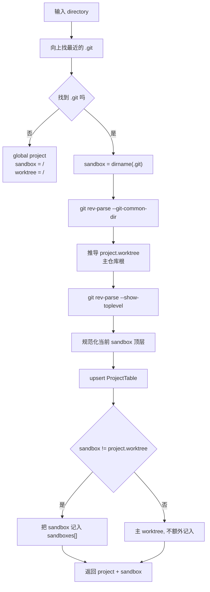

# OpenCode 深度专题 B11：Worktree 与 Sandbox 机制

> 本文基于 `opencode` `v1.3.2`（tag `v1.3.2`，commit `0dcdf5f529dced23d8452c9aa5f166abb24d8f7c`）源码校对

`B08` 已经讲了项目级 runtime 的启动装配，但有一个关键概念在那篇里没有单独展开：`sandbox` 在 OpenCode 里的真实含义。与其望文生义，不如先把代码语义钉住：它不是 Docker/VM/firejail 这类系统级隔离，而是"当前目录所属的那个 Git worktree 边界"。B11 就专门把这个机制拆清楚。

---

## 1. 先把 `sandbox` 的代码语义钉住

如果先看 `packages/opencode/src/project/project.ts` 的 `Project.fromDirectory()`，再看 `project/instance.ts` 里 `Instance.provide()` 如何消费结果，就会发现 `sandbox` 根本不是 Docker、VM、`firejail` 这一类“操作系统隔离沙箱”。

在当前代码里，它更接近下面这个意思：

1. **对当前 project 来说，当前请求命中的那个工作副本根目录**。
2. 在普通 Git 仓库里，它通常就是你当前打开的那个 worktree 根目录。
3. 在 Git linked worktree 场景下，它表示“某个具体 worktree 目录”，而不是主仓库根目录。
4. OpenCode 用它来限定：
   - 向上查找配置和指令时的停止边界
   - 哪些路径算“仍在当前项目内”
   - 当前 instance 的运行上下文里，路径该相对谁来显示

所以更准确的话应该是：

- `sandbox` 是 **工作副本边界**
- 不是 **系统级执行隔离**

---

## 2. 四个最容易混淆的概念

先把这四个名词分开，否则后面很容易看乱：

| 名称 | 含义 | 典型值 |
|---|---|---|
| `directory` | 当前请求/当前会话真正进入的目录 | `/repo/packages/web` |
| `sandbox` | 当前目录所属的那个 worktree 顶层目录 | `/repo` 或 `~/.local/share/opencode/worktree/<project-id>/calm-cabin` |
| `Instance.worktree` | 当前 instance 使用的 worktree 根；在代码里它实际被赋值为 `sandbox` | 同上 |
| `Project.Info.worktree` | project 级别记录的“主 worktree / common git root” | 主仓库根目录，例如 `/repo` |

这几个字段最容易混淆的地方在于：

1. `Project.fromDirectory()` 会同时返回 `project` 和 `sandbox`
2. `Instance.boot()` 不会把 `project.worktree` 塞给 `Instance.worktree`
3. 它实际塞进去的是 `sandbox`

也就是说：

- `Project.Info.worktree` 更像 **这个 project 的主根**
- `Instance.worktree` 更像 **当前正在运行的那个 sandbox 根**

这在 linked worktree 场景里尤其关键。

---

## 3. 一个例子看懂三层路径

假设你有一个主仓库：

```text
$HOME/src/opencode
```

然后 OpenCode 又创建了一个 linked worktree：

```text
$HOME/.local/share/opencode/worktree/abc123/calm-cabin
```

如果你现在是在这个目录里启动：

```text
$HOME/.local/share/opencode/worktree/abc123/calm-cabin/packages/opencode
```

那么三层路径大概会是：

- `Instance.directory`
  `$HOME/.local/share/opencode/worktree/abc123/calm-cabin/packages/opencode`
- `sandbox`
  `$HOME/.local/share/opencode/worktree/abc123/calm-cabin`
- `Instance.worktree`
  `$HOME/.local/share/opencode/worktree/abc123/calm-cabin`
- `Project.Info.worktree`
  `$HOME/src/opencode`

换句话说：

- 当前运行视角在 linked worktree 里
- 但 project 身份仍然归属于主仓库那一组 Git 历史

---

## 4. `sandbox` 是怎么识别出来的

识别逻辑都在 `packages/opencode/src/project/project.ts` 的 `Project.fromDirectory()` 里。

它大致分两段：

1. **从当前目录向上找最近的 `.git`**
2. **再通过 Git 自己算出当前 sandbox 和 project 主 worktree**

核心步骤可以压缩成下面这条链：



把源码翻成白话就是：

### 4.1 第一步：先找最近的 `.git`

OpenCode 会从当前 `directory` 一路往上找 `.git`。

因此：

- 如果你在主仓库的子目录里启动，找到的是主仓库根下的 `.git`
- 如果你在 linked worktree 的子目录里启动，找到的是 linked worktree 根下的 `.git`

这一步决定了“当前到底落在哪个工作副本里”。

### 4.2 第二步：先把最近 `.git` 所在目录当成 `sandbox`

代码先取：

```text
sandbox = dirname(.git)
```

这就把“最近命中的 worktree 顶层”先定下来了。

### 4.3 第三步：再算 project 的主根

接着它跑：

```bash
git rev-parse --git-common-dir
```

这一步的作用是：

- 在普通主仓库里，`sandbox` 和 `project.worktree` 往往相同
- 在 linked worktree 里，`project.worktree` 会回到主仓库那一边

所以 linked worktree 场景里才会出现：

- `sandbox != project.worktree`

### 4.4 第四步：把“额外 sandbox”记到数据库

当 `sandbox !== project.worktree` 时，OpenCode 会把这个目录追加到 `Project.Info.sandboxes`。

这意味着：

- 主仓库根本身不算“额外 sandbox”
- 额外创建出来的 linked worktree 才会被记进 `sandboxes[]`

所以 `sandboxes[]` 实际上更接近：

- “这个 project 目前有哪些附属 worktree 目录”

而不是：

- “所有可能的运行目录集合”

---

## 5. 启动时 `sandbox` 怎么进入运行时

这部分的关键代码在 `packages/opencode/src/project/instance.ts`。

`Instance.provide({ directory, init, fn })` 做两件事：

1. 先用 `directory` 做 cache key
2. 首次命中时调用 `Project.fromDirectory(directory)`，把返回的 `sandbox` 放进 `ctx.worktree`

所以运行时上下文其实长这样：

- `ctx.directory = 当前请求目录`
- `ctx.worktree = sandbox`
- `ctx.project = Project.Info`

这里有一个非常关键但很容易漏掉的点：

### 5.1 instance 是按 `directory` 缓存的，不是按 `sandbox` 缓存的

也就是说：

- 从 `/repo/packages/a` 进入一次
- 再从 `/repo/packages/b` 进入一次

即使它们最后都解析到同一个 `sandbox=/repo`，OpenCode 仍然可能建立两个不同的 instance 缓存，因为 cache key 是 `directory`。

所以：

- `sandbox` 决定边界
- `directory` 决定当前 instance 视角

这是理解运行时行为最重要的一层。

---

## 6. 请求执行时，OpenCode 怎么命中正确的 sandbox

真正把请求路由到 sandbox 的，不是“每个 sandbox 一个常驻进程”，而是：

1. 请求里带 `directory`
2. server 中间件读这个目录
3. `Instance.provide(directory, init: InstanceBootstrap, fn: next)` 用目录拿到正确的运行上下文

在 `packages/opencode/src/server/server.ts` 里，中间件会优先读：

- query 里的 `directory`
- header 里的 `x-opencode-directory`
- 否则退回 `process.cwd()`

然后再去 `Instance.provide(...)`。

因此每次请求本质上都是：

1. 给定一个目录
2. 解析它属于哪个 sandbox
3. 拿到这个目录对应的 instance
4. 在这个上下文里执行业务逻辑

所以 OpenCode 的“sandbox 执行”更准确地说是：

- **按目录分派**
- **按 instance 上下文执行**
- **由 sandbox 提供边界约束**

---

## 7. 新建 sandbox 的完整流程

如果是 OpenCode 主动帮你创建一个新 sandbox，它走的是 `packages/opencode/src/worktree/index.ts` 里的 `Worktree.create()` / `createFromInfo()`。

这条链路不是抽象概念，而是真的会创建 Git linked worktree：

### 7.1 先生成目录和分支信息

OpenCode 会在：

```text
Global.Path.data/worktree/<project-id>/
```

下面挑一个名字，例如：

```text
calm-cabin
```

然后配一条分支：

```text
opencode/calm-cabin
```

### 7.2 再执行 `git worktree add`

它实际跑的是：

```bash
git worktree add --no-checkout -b <branch> <directory>
```

这一步结束后，新 worktree 的目录已经存在，但代码还没完全 checkout 到位。

### 7.3 把新目录登记到 `Project.sandboxes`

随后它会调用：

- `Project.addSandbox(project.id, info.directory)`

这一步的意义是：

- project 级数据库里知道“我多了一个附属 sandbox”

### 7.4 再对新目录做一次真正 bootstrap

接着它会：

1. 在新目录里 `git reset --hard`
2. `Instance.provide({ directory: info.directory, init: InstanceBootstrap })`
3. 发出 `worktree.ready` 或 `worktree.failed`
4. 执行项目配置的 startup script

所以新 sandbox 不是只建了个目录就算完，而是还会做一轮真正的 instance 启动。

---

## 8. sandbox 在运行期到底影响什么

它至少影响下面五类事情：

### 8.1 配置向上查找的停止边界

`ConfigPaths.projectFiles()` 和 `ConfigPaths.directories()` 都是从 `Instance.directory` 往上找，但最多只找到 `Instance.worktree` 为止。

这意味着：

- 你可以在当前目录和 sandbox 根之间放 `.opencode` / `opencode.json[c]`
- OpenCode 会加载这些配置
- 但不会越过 sandbox 根继续往别的工作副本找

### 8.2 `AGENTS.md` / `CLAUDE.md` / 指令文件的查找边界

`session/instruction.ts` 同样是：

- 从 `Instance.directory` 往上找
- 到 `Instance.worktree` 停止

所以 sandbox 也是 instruction prompt 的边界。

### 8.3 外部目录权限判断

`Instance.containsPath()` 会认为下面两类路径都算“当前项目内”：

1. `Instance.directory` 里面的路径
2. `Instance.worktree` 里面的路径

这带来的效果是：

- 某个文件虽然不在当前 cwd 下
- 但只要它还在当前 sandbox 里
- 就不会触发 `external_directory` 权限提示

### 8.4 UI 和工具里的相对路径显示

很多工具输出都用：

```text
path.relative(Instance.worktree, target)
```

所以你在 TUI 里看到的大部分路径，其实是“相对于 sandbox 根”的，而不是相对于当前 cwd。

### 8.5 Git / VCS / worktree 管理命令的基准根

很多 Git 相关操作会基于：

- `Instance.worktree`
- 或 `Instance.project.worktree`

前者偏当前 sandbox，后者偏 project 主根。linked worktree 场景下，这两个值不一定相同。

---

## 9. 非 Git 项目是个特殊分支

如果当前目录一路往上都找不到 `.git`，`Project.fromDirectory()` 会返回：

- `project.id = global`
- `sandbox = /`
- `worktree = /`

这显然不是“真实项目根”，而是一种退化表示。

因此代码里又补了一个保护：

- 如果 `Instance.worktree === "/"`，`Instance.containsPath()` 不会直接把所有绝对路径都当成“在项目里”

所以对非 Git 项目来说：

- `sandbox=/` 更像“没有可靠 VCS 边界”
- 不是“真的把整个磁盘当成当前 sandbox”

---

## 10. 最容易说错的三句话

下面三句话都不够准确：

1. “sandbox 就是 project 根目录”
   实际上 linked worktree 场景里，当前 sandbox 可以不是主 project 根。
2. “sandbox 就是当前 cwd”
   实际上 `sandbox` 是当前 worktree 顶层，`cwd` 只是 `Instance.directory`。
3. “sandbox 是执行隔离环境”
   实际上它主要是路径边界和运行上下文建模，不是容器化隔离。

更准确的表述应该是：

- OpenCode 用 `sandbox` 表示“当前目录所属的工作副本根”
- 用 `directory` 表示“当前请求真正进入的位置”
- 用 `project.worktree` 表示“这个 project 的主 Git 根”

---

## 11. 把本篇压成一句代码级结论

如果只记一句话，记这个：

> OpenCode 的 `sandbox` 本质上是“当前运行命中的 worktree 边界”，它决定配置查找、权限边界和路径语义；真正的 instance 生命周期则是按 `directory` 创建和缓存的。

---

## 12. 关键源码定位

- `packages/opencode/src/project/project.ts`
  `Project.fromDirectory()` 负责发现 `sandbox`、`project.worktree` 与 `sandboxes[]`
- `packages/opencode/src/project/instance.ts`
  `Instance.provide()` 负责把 `sandbox` 放进运行时上下文
- `packages/opencode/src/server/server.ts`
  每个请求按 `directory` 命中对应 instance
- `packages/opencode/src/worktree/index.ts`
  新 sandbox 的创建、bootstrap、ready/failed 事件都在这里
- `packages/opencode/src/control-plane/adaptors/worktree.ts`
  workspace 模式下通过 `x-opencode-directory` 把请求路由到具体 sandbox
- `packages/opencode/src/config/paths.ts`
  配置向上查找以 `Instance.worktree` 为停止边界
- `packages/opencode/src/session/instruction.ts`
  `AGENTS.md` / `CLAUDE.md` / instructions 的向上查找同样止于 sandbox
- `packages/opencode/src/tool/external-directory.ts`
  sandbox 内路径不会触发 `external_directory` 权限

