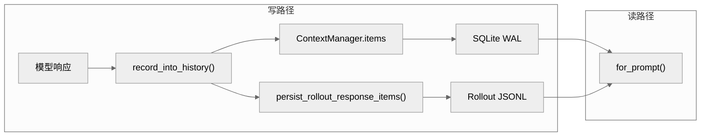
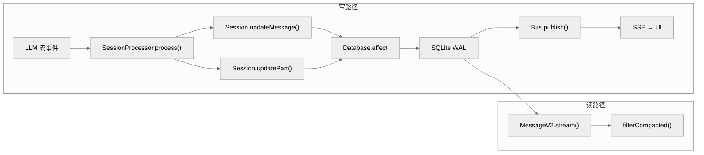

# 跨工具对比：四大 AI Coding CLI 的状态持久化方案

> 本章横向对比 Claude Code、Codex、Gemini CLI 和 OpenCode 四个工具的状态持久化架构。基础状态管理专题请分别阅读各工具的第 5 章。本章聚焦"Durable State"——对话、消息、工具调用如何落地，以及各自的技术取舍。

**目录**

- [1. 四工具状态方案总览](#1-四工具状态方案总览)
- [2. Claude Code：Transcript 文件流](#2-claude-code-transcript-文件流)
- [3. Codex：SQLite WAL + Rollout JSONL](#3-codex-sqlite-wal--rollout-jsonl)
- [4. Gemini CLI：JSON 会话文件](#4-gemini-cli-json-会话文件)
- [5. OpenCode：SQLite + Effect-ts](#5-opencode-sqlite--effect-ts)
- [6. 横向对比表](#6-横向对比表)
- [7. 技术取舍分析](#7-技术取舍分析)

---

## 1. 四工具状态方案总览

| 工具 | 存储方案 | 存储位置 | 事务模型 | 消息粒度 |
|------|---------|---------|---------|---------|
| Claude Code | JSON Lines 转录文件 | `~/.claude/history/` | 无事务，追加写 | Transcript Entry |
| Codex | SQLite WAL + JSONL | `~/.codex/threads/` | SQLite ACID + WAL | Thread → Turn → ThreadItem |
| Gemini CLI | JSON Session 文件 | `~/.gemini/sessions/` | 无事务，替换写 | ChatRecording |
| OpenCode | SQLite + Effect-ts | `.opencode/*.db` | Effect.ts 事务层 | MessageV2 → Part → Step |

---

## 2. Claude Code：Transcript 文件流

**持久化方式**：JSON Lines（追加写），每个 Transcript Entry 一行

**存储路径**：`~/.claude/history/<session_id>.jsonl`

### 架构

```
用户输入 / 模型响应
       ↓
  AppState（内存）
       ↓
  onChangeAppState 钩子
       ↓
  TranscriptManager.write_entry()  → 追加到 .jsonl
```

### 数据模型

```json
// Transcript Entry（一条一行）
{
  "type": "user"|"assistant"|"tool_use"|"tool_result",
  "session_id": "...",
  "timestamp": 1712345678,
  "message": { ... },
  "tool_calls": [...],
  "usage": { "input_tokens": 100, "output_tokens": 50 }
}
```

### 关键特性

- **Append-only**：不修改历史，只追加新 Entry
- **无 session 分叉**：通过复制完整文件实现 fork
- **无压缩**：长会话文件无限增长，需要外部 compaction
- **跨平台**：文件系统路径，不依赖特定数据库

### 会话恢复（resume）

```typescript
// resume 时读取整个 .jsonl，重建 AppState
TranscriptManager.readSession(sessionId)
  .forEach(entry => store.dispatch(addEntry(entry)))
```

---

## 3. Codex：SQLite WAL + Rollout JSONL

**持久化方式**：双写——SQLite（结构化数据）+ JSONL（rollout 记录）

**存储路径**：
- SQLite：`~/.codex/threads/<thread_id>.db`
- Rollout：`~/.codex/rollout/<turn_id>.jsonl`

### 架构



### 三层状态模型

Codex 使用严格的三层结构：
- **Thread**：线程级元信息（ID、状态、模型、来源）
- **Turn**：回合级信息（ID、错误状态）
- **ThreadItem**：内容项（UserMessage、AgentMessage、ToolCall、Reasoning 等）

### WAL 模式

SQLite 使用 WAL（Write-Ahead Logging）而非默认的 rollback journal：
- 读操作不阻塞写操作
- 写操作不阻塞读操作
- 适合 Codex 的单写多读场景

### Rollout JSONL

每个 Turn 产生一个 JSONL 文件，记录完整的流式事件序列（用于 replay 和调试）：

```jsonl
{"event": "ResponseEvent::Created", "turn_id": "t1"}
{"event": "ResponseEvent::OutputItemAdded", "item_id": "i1", "content": "..."}
{"event": "ResponseEvent::Completed", "usage": {...}}
```

---

## 4. Gemini CLI：JSON 会话文件

**持久化方式**：单个 JSON 文件（替换写），ChatRecording 结构

**存储路径**：`~/.gemini/sessions/<session_id>.json`

### 架构

```
用户输入 / 模型响应
       ↓
  ChatRecordingService（内存）
       ↓
  ChatRecording.toJSON()  →  整个文件序列化为 JSON
       ↓
  fs.writeFileSync()  →  替换写入 .json
```

### 数据模型

```typescript
interface ChatRecording {
  id: string
  createdAt: number
  updatedAt: number
  turns: Turn[]           // 所有对话轮次
  systemInstruction: {...} // 系统指令
  toolResults: ToolResult[] // 工具执行结果缓存
  memories: Memory[]       // 长期记忆
}
```

### 关键特性

- **替换写**：每次更新重写整个文件（无追加）
- **包含工具结果**：将工具调用结果直接嵌入 recording
- **包含 Memory**：会话级记忆与 recording 一起存储
- **无 WAL**：简单可靠，但频繁写入时需完整重序列化

---

## 5. OpenCode：SQLite + Effect-ts

**持久化方式**：SQLite（Effect-ts 事务封装），每条消息/Part 独立写库

**存储路径**：`.opencode/<session_id>.db`

### 架构



### 核心概念

**MessageV2** 是 OpenCode 的核心持久化对象：

```typescript
interface MessageV2 {
  id: string
  sessionId: string
  role: "user" | "assistant"
  parts: Part[]              // 可变部分（逐步写回）
  summary?: string            // compaction 后的摘要
  compacted: boolean          // 是否已压缩
  parentId?: string           // 消息树关系
}
```

**Part** 是流式写回的基本单位：
- `TextPart` / `ReasoningPart` / `ToolCallPart` / `ToolResultPart`
- 每个 Part 可独立更新（`updatePart()`），无需重写整个消息

### Effect-ts 事务层

OpenCode 的 SQLite 访问通过 Effect-ts 封装：

```typescript
// 写操作通过 Effect 层
const writeEffect = Effect.gen(function* () {
  const db = yield* Database
  yield* db.transaction(() =>
    Effect.gen(function* () {
      yield* Session.insert(s)
      yield* Message.insert(m)
      yield* Part.insertBatch(parts)
    })
  )
})
```

- **事务保证原子性**：消息 + Parts + summary 在同一事务中写入
- **Effect Retry**：写入失败自动重试
- **Bus 事件驱动**：SQLite 写成功后通过 Bus 通知 SSE 前端

### Compaction

```typescript
// compaction 时，将整个 Message 链压缩为摘要
// compacted=true 的 Message 保留，但 parts 被替换为 summary
Message { compacted: true, summary: "用户要求实现 xxx 功能..." }
```

---

## 6. 横向对比表

| 维度 | Claude Code | Codex | Gemini CLI | OpenCode |
|------|------------|-------|-----------|----------|
| **存储格式** | JSONL（追加）| SQLite + JSONL | JSON（替换）| SQLite + Effect |
| **事务模型** | 无 | SQLite ACID | 无 | Effect.ts 事务 |
| **消息粒度** | Transcript Entry | ThreadItem | Turn | MessageV2 + Part |
| **流式写回** | 否（整轮结束写）| 否（Turn 结束写）| 否 | **是（逐 Part 写）** |
| **压缩机制** | 无内置 | `compact.rs` LLM 摘要 | 有限（超出 context）| Compaction + filter |
| **Session Fork** | 文件复制 | `fork_thread()` | 复制 JSON | `opencode fork` |
| **Undo 支持** | 无 | GhostSnapshot（Git）| 无 | 无 |
| **外部可读** | 是（标准 JSONL）| 是（SQLite JSONL）| 是（标准 JSON）| 否（SQLite）|
| **多 Session 并发** | 独立文件 | 独立 SQLite | 独立 JSON | 独立 DB |
| **历史大小管理** | 外部 | GhostSnapshot 清理 | 外部 | Compaction |

---

## 7. 技术取舍分析

### 为什么 OpenCode 选 SQLite + Effect-ts？

OpenCode 是唯一一个"每条消息都立即落库"的系统。核心原因是：
- **多端订阅**：CLI/TUI/Web/Desktop 共享同一 server，SQLite 作为 Single Source of Truth，通过 Bus/SSE 推送投影到各端
- **Effect-ts 强迫正确性**：事务边界由类型系统保证，忘记提交会报编译错误
- **Part 级粒度**：工具调用结果逐步流式写回，用户在工具执行中途就能看到部分结果

代价：实现复杂度高，SQLite 成为单点（无分片/集群方案）。

### 为什么 Codex 选双写（SQLite + JSONL）？

SQLite 存结构化数据（Thread/Turn 元信息），JSONL 存完整的流事件序列。分离的好处是：
- **Rollout 可独立分析**：完整的流事件序列对于调试、重放、性能分析至关重要
- **SQLite 只存元信息**：不会因为大量工具调用导致 SQLite 行数爆炸

### 为什么 Claude Code 和 Gemini CLI 选简单格式？

两者都是追加/替换 JSON 文件，零依赖：
- **无运维负担**：不需要 SQLite，不需要 migrations
- **外部可读**：用户可以直接 `cat` 或 `jq` 处理 transcript
- **取舍**：牺牲了事务安全、原子写回、并发控制

### 谁的状态系统最成熟？

**OpenCode 最成熟**（最重），**Codex 最完善**（最全面），**Claude Code 最轻**（最简单），**Gemini CLI 最直接**（最薄）。

OpenCode 的 Part 级流式写回和 Effect-ts 事务是其他三个工具都没有的特性，代表了最精细的状态控制粒度。Codex 的 GhostSnapshot 是唯一一个实现了 Undo 能力的工具。Claude Code 的 Transcript 虽然简单，但胜在透明可读，是用户最容易理解和调试的方案。

---

*文档版本: 1.0*
*分析日期: 2026-04-08*
