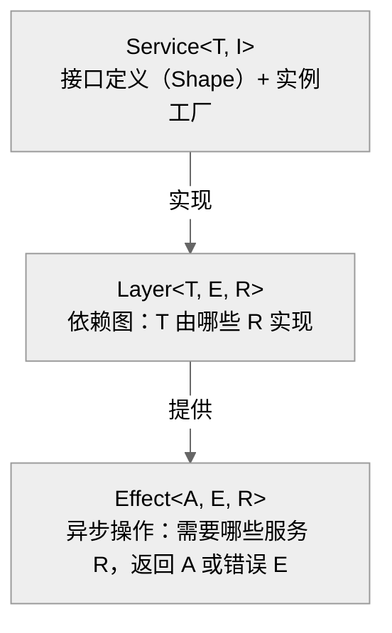

# Effect-ts 依赖注入：Service/Layer/Effect 骨架与晚绑定策略

OpenCode 是四个工具中唯一一个全程使用 Effect-ts 作为应用骨架的框架。从类型安全的依赖注入，到异步操作的事务封装，再到纤维（Fiber）生命周期管理，Effect-ts 贯穿了 OpenCode 的每一个角落。


**目录**

- [1. Effect-ts 三元素：Service / Layer / Effect](#1-effect-ts-三元素service--layer--effect)
- [2. Service 定义模式](#2-service-定义模式)
- [3. Layer 组合与依赖图](#3-layer-组合与依赖图)
- [4. InstanceState：多实例作用域模式](#4-instancestate多实例作用域模式)
- [5. Effect.fn 与操作追踪](#5-effectfn-与操作追踪)
- [6. 晚绑定：从 CLI 到 TUI 到 Web 的服务复用](#6-晚绑定从-cli-到-tui-到-web-的服务复用)
- [7. 与其他工具的依赖注入对比](#7-与其他工具的依赖注入对比)
- [8. 关键函数清单](#8-关键函数清单)

---

## 1. Effect-ts 三元素：Service / Layer / Effect

Effect-ts 的核心是三个互相配合的概念：



| 概念 | Effect-ts 含义 | OpenCode 对应 |
|------|---------------|-------------|
| **Service** | 带类型标识的接口 + 运行时工厂 | `ServiceMap.Service<T, I>("@opencode/Xxx")` |
| **Layer** | 依赖图：此 Service 依赖哪些下游 Service | `Layer.effect(Xxx.Service, Effect.gen(...))` |
| **Effect** | 带依赖的异步计算 | `Effect.gen(function* () { yield* Svc; ... })` |
| **ManagedRuntime** | Layer 图的运行时，执行 Effect | `ManagedRuntime.make(layer)` |

### Service 的声明

```typescript
// snapshot/index.ts:60
export class Service extends ServiceMap.Service<Service, Interface>()("@opencode/Snapshot") {}

// skill/index.ts:181
export class Service extends ServiceMap.Service<Service, Interface>()("@opencode/Skill") {}
```

`ServiceMap.Service<T, I>(tag)` 创建的类有两个类型参数：
- `T` — 实例类型（实现类本身）
- `I` — Shape/Interface（实例提供的接口）

tag 字符串（`"@opencode/Snapshot"`）是运行时的唯一标识，用于 Layer 查找。

### Layer 的构建

```typescript
// snapshot/index.ts:62-355
export const layer: Layer.Layer<Service, never,
  AppFileSystem.Service | ChildProcessSpawner.ChildProcessSpawner> =
  Layer.effect(
    Service,
    Effect.gen(function* () {
      const fs = yield* AppFileSystem.Service   // 声明依赖
      const spawner = yield* ChildProcessSpawner.ChildProcessSpawner
      // ... 构建 Service 实例
      return Service.of({ init, cleanup, track, patch, ... })
    }),
  )
```

`Layer.effect` 的三个类型参数：
- `Service` — 此 Layer 提供的 Service
- `never` — 此 Layer 本身不产生错误
- `AppFileSystem.Service | ...` — 此 Layer 依赖的下游 Service

### Effect 的执行

```typescript
// effect/run-service.ts:6-13
export function makeRunPromise<I, S, E>(
  service: ServiceMap.Service<I, S>,
  layer: Layer.Layer<I, E>
) {
  let rt: ManagedRuntime.ManagedRuntime<I, E> | undefined
  return <A, Err>(fn: (svc: S) => Effect.Effect<A, Err, I>, options?) => {
    rt ??= ManagedRuntime.make(layer, { memoMap })
    return rt.runPromise(service.use(fn), options)
  }
}
```

## 2. Service 定义模式

### 2.1 简单 Service（纯内存）

Skill Service 的 Shape 是一个接口，定义 4 个只读方法：

```typescript
// skill/index.ts:64-69
export interface Interface {
  readonly get: (name: string) => Effect.Effect<Info | undefined>
  readonly all: () => Effect.Effect<Info[]>
  readonly dirs: () => Effect.Effect<string[]>
  readonly available: (agent?: Agent.Info) => Effect.Effect<Info[]>
}
```

实现中，每个方法都通过 `Effect.fn` 命名，并在内部调用 `InstanceState.get(state)` 获得当前工作区的缓存数据。

### 2.2 带状态的 Service（ScopedCache）

Snapshot Service 的 Shape 包含 7 个方法，对应快照的 track/patch/restore/revert/diff 等操作：

```typescript
// snapshot/index.ts:49-58
export interface Interface {
  readonly init: () => Effect.Effect<void>
  readonly cleanup: () => Effect.Effect<void>
  readonly track: () => Effect.Effect<string | undefined>
  readonly patch: (hash: string) => Effect.Effect<Snapshot.Patch>
  readonly restore: (snapshot: string) => Effect.Effect<void>
  readonly revert: (patches: Snapshot.Patch[]) => Effect.Effect<void>
  readonly diff: (hash: string) => Effect.Effect<string>
  readonly diffFull: (from: string, to: string) => Effect.Effect<Snapshot.FileDiff[]>
}
```

其内部状态 `State` 由 `InstanceState.make()` 构造，存储每个工作区独立的快照 Git 仓库路径。

### 2.3 带子依赖的 Service

Installation Service 的 Layer 依赖 `HttpClient` 和 `ChildProcessSpawner`：

```typescript
// installation/index.ts:101-104
export const layer: Layer.Layer<Service, never,
  HttpClient.HttpClient | ChildProcessSpawner.ChildProcessSpawner> =
  Layer.effect(Service, Effect.gen(function* () {
    const http = yield* HttpClient.HttpClient
    const spawner = yield* ChildProcessSpawner.ChildProcessSpawner
    // ...
  }))
```

### 2.4 纯 Effect Service（无状态）

InstanceContext 本身就是 Effect 层的一部分，定义 Shape 但不直接实例化：

```typescript
// effect/instance-context.ts:4-10
export declare namespace InstanceContext {
  export interface Shape {
    readonly directory: string
    readonly worktree: string
    readonly project: Project.Info
  }
}

export class InstanceContext extends ServiceMap.Service<InstanceContext, InstanceContext.Shape>()(
  "opencode/InstanceContext",
) {}
```

## 3. Layer 组合与依赖图

### 3.1 defaultLayer 管道

每个 Service 导出一个 `defaultLayer`，通过 `Layer.provide` 逐步补全依赖：

```typescript
// snapshot/index.ts:357-362
export const defaultLayer = layer.pipe(
  Layer.provide(CrossSpawnSpawner.layer),   // ChildProcessSpawner
  Layer.provide(AppFileSystem.defaultLayer), // AppFileSystem
  Layer.provide(NodeFileSystem.layer),       // FileSystem
  Layer.provide(NodePath.layer),             // Path
)

// skill/index.ts:223
export const defaultLayer: Layer.Layer<Service> =
  layer.pipe(Layer.provide(Discovery.defaultLayer))

// installation/index.ts:342-347
export const defaultLayer = layer.pipe(
  Layer.provide(FetchHttpClient.layer),
  Layer.provide(CrossSpawnSpawner.layer),
  Layer.provide(NodeFileSystem.layer),
  Layer.provide(NodePath.layer),
)
```

### 3.2 依赖图解析

```
ManagedRuntime
    └── Snapshot.defaultLayer
            ├── Layer.provide(CrossSpawnSpawner.layer)
            │       └── Layer.effect(ChildProcessSpawner)
            │               └── [FileSystem, Path]
            ├── Layer.provide(AppFileSystem.defaultLayer)
            │       └── AppFileSystem.layer
            │               └── [NodeFileSystem, NodePath]
            ├── Layer.provide(NodeFileSystem.layer)
            └── Layer.provide(NodePath.layer)
```

Layer 的 `pipe(Layer.provide(...))` 是**从右到左**补全依赖：右侧 Layer 提供的 Service 被注入到左侧 Layer 的 `yield*` 槽位中。

### 3.3 CrossSpawnSpawner：Effect-gen 内的 spawn 封装

`cross-spawn-spawner.ts` 是 Effect-ts 依赖图中最复杂的叶子节点（无下游 Service 依赖）：

```typescript
// effect/cross-spawn-spawner.ts:96-471
export const make = Effect.gen(function* () {
  const fs = yield* FileSystem.FileSystem   // 直接依赖 effect/FileSystem
  const path = yield* Path.Path             // 直接依赖 effect/Path
  // ...
  return makeSpawner(spawnCommand)
})

export const layer: Layer.Layer<ChildProcessSpawner, never,
  FileSystem.FileSystem | Path.Path> =
  Layer.effect(ChildProcessSpawner, make)
```

它将 `cross-spawn` 库（Node.js child_process）封装为 Effect-safe 的 `ChildProcessSpawner` Service，提供了：
- 标准命令（spawn）、管道命令（piped）、信号 kill
- FD 转发（stdin/stdout/stderr + 额外文件描述符）
- PTY 支持（通过 additionalFds）

### 3.4 memoMap 全局共享

```typescript
// effect/run-service.ts:4
export const memoMap = Layer.makeMemoMapUnsafe()
```

`memoMap` 在进程级别共享，确保同一 Service 在同一 Layer 图中只实例化一次。所有 `ManagedRuntime` 实例都传入这个共享的 memoMap。

## 4. InstanceState：多实例作用域模式

OpenCode 的关键创新在于**每个工作区（worktree）有独立的状态缓存**，这通过 `InstanceState` 实现。

### 4.1 问题背景

CLI 工具（如 `opencode --dir /path/to/project`）可能在不同工作目录并发运行，每个目录需要独立的：
- 快照 Git 仓库
- Skill 扫描缓存
- 配置读取

如果直接在 Service 中存储这些数据，就会产生跨工作区的状态污染。

### 4.2 ScopedCache 实现

```typescript
// effect/instance-state.ts:13-29
export const make = <A, E, R>(
  init: (ctx: Shape) => Effect.Effect<A, E, R | Scope.Scope>,
): Effect.Effect<InstanceState<A, E, Exclude<R, Scope.Scope>>, never, R | Scope.Scope> =>
  Effect.gen(function* () {
    const cache = yield* ScopedCache.make<string, A, E, R>({
      capacity: Number.POSITIVE_INFINITY,
      lookup: () => init(Instance.current),   // 每次查找时取当前工作区
    })

    const off = registerDisposer((directory) =>
      Effect.runPromise(ScopedCache.invalidate(cache, directory))  // 目录退出时清理
    )
    yield* Effect.addFinalizer(() => Effect.sync(off))

    return { [TypeId]: TypeId, cache }
  })
```

`ScopedCache` 以工作区目录为 key，实现**按需创建/懒加载**：
- 第一次 `InstanceState.get(state)` 时调用 `init(ctx)` 构建该工作区的缓存
- 后续访问直接返回缓存值
- 工作区退出时通过 `registerDisposer` 清理

### 4.3 Snapshot + InstanceState 联动

```typescript
// snapshot/index.ts:68-326
const state = yield* InstanceState.make<State>(
  Effect.fn("Snapshot.state")(function* (ctx) {
    // ctx.directory — 工作区目录
    // ctx.worktree — worktree 根目录
    // ctx.project.id — 项目 ID
    const gitdir = path.join(Global.Path.data, "snapshot", ctx.project.id)
    return { directory: ctx.directory, worktree: ctx.worktree, gitdir, vcs: ctx.vcs,
      /* cleanup, track, patch, restore, revert, diff, diffFull */ }
  }),
)
```

每个工作区在 `.opencode/snapshot/<project-id>/` 下有独立的 Git 仓库作为快照存储。

### 4.4 实例注册与清理

```typescript
// effect/instance-registry.ts
const disposers = new Set<(directory: string) => Promise<void>>()

export function registerDisposer(disposer: (directory: string) => Promise<void>) {
  disposers.add(disposer)
  return () => { disposers.delete(disposer) }
}

export async function disposeInstance(directory: string) {
  await Promise.allSettled([...disposers].map(d => d(directory)))
}
```

当一个工作区退出时，`disposeInstance(directory)` 通知所有已注册的 ScopedCache 实例清理该目录对应的缓存条目。

## 5. Effect.fn 与操作追踪

### 5.1 命名效应函数

OpenCode 在 `Effect.fn` 包装每个服务方法，使日志和追踪更清晰：

```typescript
// snapshot/index.ts:329-352
return Service.of({
  init: Effect.fn("Snapshot.init")(function* () {
    yield* InstanceState.get(state)
  }),
  cleanup: Effect.fn("Snapshot.cleanup")(function* () {
    return yield* InstanceState.useEffect(state, (s) => s.cleanup())
  }),
  track: Effect.fn("Snapshot.track")(function* () {
    return yield* InstanceState.useEffect(state, (s) => s.track())
  }),
  // ...
})
```

### 5.2 fn vs fnUntraced

| 函数 | 行为 |
|------|------|
| `Effect.fn("name")(f)` | 创建命名 Effect，可在追踪系统中识别 |
| `Effect.fnUntraced(f)` | 创建未追踪 Effect，用于高频内部操作（如每次工具调用的参数构造） |

Snapshot 中大量使用 `fnUntraced` 是因为 `git` 命令和 `fs.exists` 调用非常频繁，开启追踪会产生巨大开销。

### 5.3 ScopedCache 与 Effect.gen

```typescript
// effect/instance-state.ts:17-20
const cache = yield* ScopedCache.make<string, A, E, R>({
  capacity: Number.POSITIVE_INFINITY,
  lookup: () => init(Instance.current),
})
```

注意这里 `lookup` 接收的是一个**同步函数**而非 Effect——`ScopedCache` 内部会在正确的 Scope 上下文中调用 `init`，用户无需关心 Scope 管理。

## 6. 晚绑定：从 CLI 到 TUI 到 Web 的服务复用

### 6.1 makeRunPromise：同步入口到 Effect 世界

```typescript
// effect/run-service.ts:6-13
export function makeRunPromise<I, S, E>(
  service: ServiceMap.Service<I, S>,
  layer: Layer.Layer<I, E>
) {
  let rt: ManagedRuntime.ManagedRuntime<I, E> | undefined
  return <A, Err>(fn: (svc: S) => Effect.Effect<A, Err, I>, options?) => {
    rt ??= ManagedRuntime.make(layer, { memoMap })  // 懒初始化
    return rt.runPromise(service.use(fn), options)
  }
}
```

每个 Service 导出 `runPromise` 包装：

```typescript
// snapshot/index.ts:364
const runPromise = makeRunPromise(Service, defaultLayer)
export async function track() {
  return runPromise((svc) => svc.track())
}
```

### 6.2 晚绑定的实现

"晚绑定"体现在三个层次：

1. **Service 实例懒初始化**：`ManagedRuntime` 在第一次调用 `runPromise` 时才构建，整个 Layer 图延迟到真正需要时才实例化。

2. **InstanceState 按需缓存**：每个工作区的状态在首次访问时才创建，不是一次性全部初始化。

3. **不同表面的 Layer 图差异**：同一 Service 可以用不同的 Layer 实例化——CLI 用文件系统 Layer，TUI 用 Ink 输出 Layer，Web 用 SSE Layer，但 API 接口完全相同。

### 6.3 Service 一等公民

Effect-ts 的设计使得 Service 本身可以被当作函数传递：

```typescript
// effect/run-service.ts:9
return rt.runPromise(service.use(fn), options)
//                     ^^^^^^^^^^^^
//                     Service → Effect<A, E, I>
```

`service.use(fn)` 将 Service 实例 `S` 传给用户函数 `fn: (svc: S) => Effect<A, Err, I>`，构建出完整的 Effect 依赖图。

## 7. 与其他工具的依赖注入对比

| 维度 | Claude Code | Codex | Gemini CLI | OpenCode |
|------|------------|-------|-----------|----------|
| **依赖注入模式** | 无 DI（直接 import）| 无 DI（Rust struct 传参）| 无 DI（React Context）| Effect-ts Layer/Service |
| **异步模型** | Promise / async-await | Tokio async | Observable stream | Effect<A, E, R> |
| **生命周期管理** | React hooks + manual | Rust Drop trait | React hooks | ManagedRuntime + Scope |
| **类型安全的错误** | `catch` + 类型断言 | `Result<T, E>` | `catchError` | `Effect<A, E, R>` 编译期 |
| **并发控制** | 手动 Promise.all | Tokio channel | RxJS operators | Effect 并发 combinator |
| **晚绑定能力** | 无 | 无 | Context 注入 | Layer 组合替换 |

**Effect-ts 的优势**：
- 错误类型 `E` 在编译期与成功类型 `A` 并存，无需运行时类型判断
- Layer 替换可以在测试时注入 Mock Service，不改业务代码
- Fiber 调度天然支持取消、超时、并发上限

**代价**：
- 学习曲线陡峭——`Effect.gen` 的生成器语法与 Promise/async-await 完全不同
- 调试困难——Fiber 堆栈不直观，`yield*` 的调用链难以追踪
- 与 Node.js 生态集成需要额外适配（如 `effect/unstable/process`）

## 8. 关键函数清单

| 函数/类型 | 文件 | 行号 | 职责 |
|----------|------|------|------|
| `ServiceMap.Service` | — | — | Service 基类声明 |
| `Layer.effect` | — | — | 从 Effect 构建 Layer |
| `Layer.provide` | — | — | 组合 Layer：注入下游依赖 |
| `Layer.makeMemoMapUnsafe` | `effect/run-service.ts` | 4 | 进程级 Service 单例缓存 |
| `makeRunPromise` | `effect/run-service.ts` | 6 | 同步入口 → Effect 执行 |
| `ManagedRuntime.make` | `effect/run-service.ts` | 10 | 构建 Layer 图的运行时 |
| `Service.of` | `snapshot/index.ts` | 328 | 返回 Service 实例 |
| `InstanceState.make` | `effect/instance-state.ts` | 13 | 创建工作区作用域缓存 |
| `ScopedCache.make` | `effect/instance-state.ts` | 17 | 按目录 key 缓存 |
| `InstanceState.get` | `effect/instance-state.ts` | 31 | 获取当前工作区的缓存值 |
| `registerDisposer` | `effect/instance-registry.ts` | 3 | 注册工作区退出清理函数 |
| `Effect.fn` | `snapshot/index.ts` | 329 | 命名 Effect（可追踪）|
| `Effect.fnUntraced` | `snapshot/index.ts` | 79 | 未追踪 Effect（高频调用）|
| `CrossSpawnSpawner.layer` | `effect/cross-spawn-spawner.ts` | 473 | cross-spawn → Effect-safe 封装 |
| `Snapshot.layer` | `snapshot/index.ts` | 62 | Snapshot Service 的 Layer |
| `Skill.layer` | `skill/index.ts` | 183 | Skill Service 的 Layer |

---

*文档版本: 1.0*
*分析日期: 2026-04-07*
