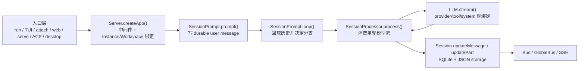

# OpenCode 源码深度解析 README

> 本文档基于 `opencode` `v1.3.2`（tag `v1.3.2`，commit `0dcdf5f529dced23d8452c9aa5f166abb24d8f7c`）源码校对；目标不是复述目录说明，而是把 OpenCode 的默认执行主线、补充专题与推荐阅读顺序交代清楚。

---

## 1. 先记住这 8 个源码跳点

如果只沿默认 `bun dev` / `opencode` 主线阅读，最关键的跳点其实只有 8 个：

| 跳点 | 代码坐标 | 真正发生了什么 |
| --- | --- | --- |
| 仓库启动脚本 | `opencode/package.json:8-18` | `dev` 把默认开发启动送进 `packages/opencode/src/index.ts`。 |
| CLI 总入口 | `packages/opencode/src/index.ts:50-169` | 初始化日志、环境变量、SQLite 迁移，并注册所有命令。 |
| 默认命令 | `cli/cmd/tui/thread.ts:66-230` | `$0 [project]` 不是直接跑 agent，而是先切目录、拉 worker、选 transport。 |
| TUI worker | `cli/cmd/tui/worker.ts:47-154` | 用 `Server.Default().fetch()` 和 `/event` 订阅把本地 runtime 暴露给 UI。 |
| HTTP 边界 | `server/server.ts:55-253` | 认证、日志、CORS、`WorkspaceContext`、`Instance.provide()` 和路由挂载都在这里。 |
| Session 路由 | `server/routes/session.ts:783-859` | `/session/:id/message`、`prompt_async` 等入口把请求送进 `SessionPrompt.prompt()`。 |
| Session 主骨架 | `session/prompt.ts:162-756` | `prompt()` 写入 durable user message，`loop()` 决定 subtask、compaction 或 normal round。 |
| 单轮执行器 | `session/processor.ts:27-429`、`session/llm.ts:48-294` | `processor` 消费模型流并写回，`LLM.stream()` 做 provider/tool/system 的晚绑定。 |

这套文档真正围绕的，就是这 8 个跳点之间的交接关系。

---

## 2. OpenCode 的固定骨架

无论入口是 `run`、默认 TUI、`attach`、`serve`、`web`、ACP 还是桌面 sidecar，最后都会收束到同一条骨架：

阅读时有两个判断必须先立住：

1. `loop()` 每轮都重新从 durable history 求状态，不依赖某个常驻会话对象。
2. subtask、compaction、retry、revert、permission 都没有旁路状态机，最后仍回写到 `Session / MessageV2 / Part / Bus` 这一组统一对象。

---

## 3. 目录如何组织

本目录现在分成三层：

### 3.1 `01-08`：核心总览

这 8 篇是压缩后的主文档，适合第一次阅读时先建立整体心智模型。

| 文件 | 主题 |
| --- | --- |
| [01-architecture.md](./01-architecture.md) | 架构全景：目录结构、分层模型、核心抽象 |
| [02-startup-flow.md](./02-startup-flow.md) | 启动链路：入口点、CLI/TUI/Web 多表面初始化、Server 启动顺序 |
| [03-agent-loop.md](./03-agent-loop.md) | 核心执行循环：Session loop、Prompt 编译、LLM 调用、流式响应处理 |
| [04-tool-system.md](./04-tool-system.md) | 工具调用机制：Tool 注册、权限控制、执行闭环、结果写回 Durable State |
| [05-state-management.md](./05-state-management.md) | 状态管理：Durable State、消息持久化、并发占位与历史回放 |
| [06-extension-mcp.md](./06-extension-mcp.md) | 扩展性：MCP 集成链路、Plugin 加载、新增工具的修改点 |
| [07-error-security.md](./07-error-security.md) | 错误处理与安全性：异常捕获、重试策略、认证鉴权、敏感信息隔离 |
| [08-performance.md](./08-performance.md) | 性能与代码质量：流式传输、SSE、Bun Runtime 优势、优缺点分析 |

### 3.2 `10-17`：执行主线深挖

这一组顺着调用链走，专门解释“请求怎样一跳一跳落到 durable state”。

| 文件 | 作用 |
| --- | --- |
| [10-mainline-index.md](./10-mainline-index.md) | 执行主线索引 |
| [11-entry-transports.md](./11-entry-transports.md) | 入口与传输适配 |
| [12-server-routing.md](./12-server-routing.md) | Server 与路由边界 |
| [13-prompt-compilation.md](./13-prompt-compilation.md) | 输入编译 |
| [14-session-loop.md](./14-session-loop.md) | Session Loop |
| [15-stream-processor.md](./15-stream-processor.md) | Stream Processor |
| [16-llm-request.md](./16-llm-request.md) | 模型请求 |
| [17-durable-state.md](./17-durable-state.md) | Durable State 写回 |

### 3.3 `20-37`：专题与补充

这一组解释为什么主线能够稳定成立，并补上调试与插件深挖。

| 文件 | 作用 |
| --- | --- |
| [20-model.md](./20-model.md) | Durable 对象模型 |
| [21-context.md](./21-context.md) | 上下文工程 |
| [22-orchestration.md](./22-orchestration.md) | 高级编排 |
| [23-resilience.md](./23-resilience.md) | 韧性机制 |
| [24-infra.md](./24-infra.md) | 基础设施 |
| [25-observability.md](./25-observability.md) | 可观测性 |
| [26-lsp.md](./26-lsp.md) | LSP 集成 |
| [27-startup-config.md](./27-startup-config.md) | 启动与配置加载 |
| [28-extension-surface.md](./28-extension-surface.md) | 扩展面 |
| [29-skill-system.md](./29-skill-system.md) | Skill 系统 |
| [30-worktree-sandbox.md](./30-worktree-sandbox.md) | Worktree 与 Sandbox |
| [31-memory.md](./31-memory.md) | Memory |
| [32-mcp.md](./32-mcp.md) | MCP 细节 |
| [33-design-philosophy.md](./33-design-philosophy.md) | 设计哲学 |
| [34-prompt-diff.md](./34-prompt-diff.md) | 提示词对比 |
| [35-debugging.md](./35-debugging.md) | 调试指南 |
| [36-plugin-system.md](./36-plugin-system.md) | Plugin 系统深挖 |
| [37-project-init-analysis.md](./37-project-init-analysis.md) | 项目初始化分析报告 |

---

## 4. 推荐阅读顺序

### 4.1 想快速建立整体地图

1. [00-opencode_ko.md](./00-opencode_ko.md)
2. [01-architecture.md](./01-architecture.md)
3. [02-startup-flow.md](./02-startup-flow.md)
4. [03-agent-loop.md](./03-agent-loop.md)
5. [05-state-management.md](./05-state-management.md)

### 4.2 想严格顺着执行链阅读

1. [10-mainline-index.md](./10-mainline-index.md)
2. [11-entry-transports.md](./11-entry-transports.md)
3. [12-server-routing.md](./12-server-routing.md)
4. [13-prompt-compilation.md](./13-prompt-compilation.md)
5. [14-session-loop.md](./14-session-loop.md)
6. [15-stream-processor.md](./15-stream-processor.md)
7. [16-llm-request.md](./16-llm-request.md)
8. [17-durable-state.md](./17-durable-state.md)

### 4.3 想补结构性背景

1. [20-model.md](./20-model.md)
2. [21-context.md](./21-context.md)
3. [22-orchestration.md](./22-orchestration.md)
4. [23-resilience.md](./23-resilience.md)
5. [24-infra.md](./24-infra.md)
6. [28-extension-surface.md](./28-extension-surface.md)
7. [29-skill-system.md](./29-skill-system.md)
8. [32-mcp.md](./32-mcp.md)
9. [33-design-philosophy.md](./33-design-philosophy.md)

---

## 5. 读源码前先修正 5 个误解

1. `Session` 不是聊天框，而是 durable 执行容器。
2. `/session/:id/message` 不是 token SSE 通道，真正的实时流在 `/event` 与 `/global/event`。
3. 默认 TUI 并不是直接调 runtime 函数，而是通过 worker 和本地化 HTTP contract 访问同一套 server。
4. Subagent 不是线程复用，而是父子 session 关系。
5. Compaction 不是偷偷删历史，而是显式插入 `compaction` / `summary` 再在回放时折叠。

