% OpenCode 源码深度解析
% 基于 OpenCode v1.3.2（Bun + Effect-ts）
% feuyeux

# OpenCode 源码深度解析

*基于 OpenCode v1.3.2（Bun + Effect-ts）*

---

## OpenCode 架构全景：目录结构、分层模型、核心抽象

# OpenCode 架构全景：目录结构、分层模型、核心抽象

> 基于 `opencode` `v1.3.2`（tag `v1.3.2`，commit `0dcdf5f529dced23d8452c9aa5f166abb24d8f7c`）源码校对

---

## 1. 整体架构总览

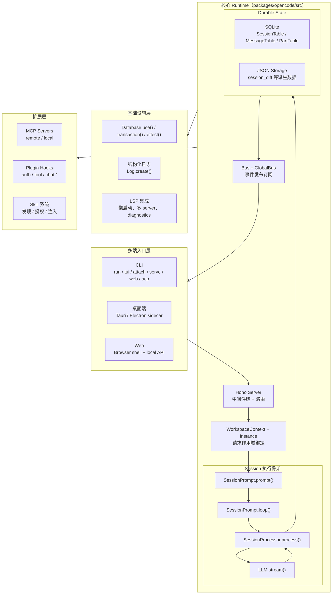

---

## 2. 目录结构与核心模块

### 2.1 packages/opencode/src 主目录

| 目录/文件 | 职责 |
|---------|------|
| `index.ts` | CLI middleware 入口，Log/init/migration 注册 |
| `global/index.ts` | XDG 目录、缓存版本、进程级全局路径计算 |
| `config/config.ts` | Config.get() 主实现：多来源配置合并、plugin 加载 |
| `config/paths.ts` | 项目配置发现（opencode.jsonc）和 .opencode 目录遍历 |
| `server/server.ts` | Hono app：middleware 链、路由挂载 |
| `server/routes/session.ts` | /session/:id/message 等核心 session 路由 |
| `server/routes/event.ts` | /event SSE 端点（Bus 投影） |
| `server/routes/global.ts` | /global/event 端点（GlobalBus 投影） |
| `session/prompt.ts` | prompt() / loop()：输入编译和执行状态机 |
| `session/processor.ts` | processor.process()：消费单轮 LLM 流事件 |
| `session/llm.ts` | LLM.stream() 封装、provider 调用 |
| `session/system.ts` | system prompt 编译 |
| `session/index.ts` | Session.updateMessage() / updatePart() 落库 |
| `session/message-v2.ts` | MessageV2 durable 模型和 toModelMessages() 投影 |
| `session/status.ts` | SessionStatus（busy/retry/idle）实例作用域状态 |
| `session/compaction.ts` | Compaction 自愈机制 |
| `session/retry.ts` | 重试策略与退避 |
| `session/revert.ts` | 文件快照 + history 清理 |
| `session/summary.ts` | Session 级别文件变更追踪与摘要管理 |
| `session/session.sql.ts` | SQLite 表结构定义 |
| `tool/registry.ts` | ToolRegistry：内建工具、自定义工具、plugin 工具汇总 |
| `tool/read.ts` | ReadTool：文件读取 |
| `tool/write.ts` | WriteTool：文件写入 |
| `tool/edit.ts` | EditTool：行级别编辑 |
| `tool/apply_patch.ts` | ApplyPatchTool：patch 应用 |
| `tool/task.ts` | TaskTool：subagent 执行 |
| `tool/skill.ts` | SkillTool：技能加载 |
| `tool/bash.ts` | Bash/Shell 工具 |
| `tool/lsp.ts` | LspTool（实验态） |
| `tool/external-directory.ts` | external_directory 权限检测 |
| `provider/provider.ts` | provider prompt 编译和模型调用封装 |
| `mcp/index.ts` | MCP 命名空间：五状态机、OAuth、tool/prompt/resource 投影 |
| `mcp/auth.ts` | MCP 凭证存储 |
| `plugin/index.ts` | Plugin.init() 和 plugin 动态加载 |
| `skill/index.ts` | Skill service：发现、缓存、授权 |
| `skill/discovery.ts` | 远端 skill pack 下载 |
| `bus/index.ts` | Bus（instance-scoped） |
| `bus/global.ts` | GlobalBus（进程级） |
| `storage/db.ts` | Database.use() / transaction() / effect() SQLite 封装 |
| `storage/storage.ts` | JSON Storage（session_diff 等派生数据） |
| `project/bootstrap.ts` | InstanceBootstrap() 固定服务装配顺序 |
| `project/instance.ts` | Instance / WorkspaceContext 请求作用域绑定 |
| `project/project.ts` | Project.fromDirectory()、sandbox 发现 |
| `lsp/index.ts` | LSP 门面与调度层 |
| `lsp/server.ts` | LSPServer：扩展名匹配、root 发现、spawn 方式 |
| `lsp/client.ts` | LSP client：JSON-RPC stdio 通信 |
| `permission/index.ts` | Permission 规则引擎：allow/deny/ask |
| `question/index.ts` | Question 机制：问题澄清 |
| `snapshot/index.ts` | Snapshot 快照管理 |
| `worktree/index.ts` | Worktree 创建、bootstrap、ready/failed 事件 |
| `vcs/index.ts` | VCS/git 集成 |
| `util/log.ts` | 结构化日志 |
| `util/fn.ts` | zod schema 封装函数 |

---

## 3. 分层模型

### 3.1 六层架构

| 层 | 层级名称 | 核心职责 |
|----|---------|---------|
| L1 | 多端入口层 | CLI/TUI/Web/Desktop/ACP 统一收束到 HTTP/SSE contract |
| L2 | HTTP Server 层 | 认证、日志、CORS、WorkspaceContext、Instance 绑定、路由分发 |
| L3 | Session 执行骨架 | prompt 编译、loop 编排、processor 流处理、LLM 调用 |
| L4 | Durable State 层 | SQLite/JSON Storage 持久化、Bus 事件发布、MessageV2 投影 |
| L5 | 扩展接口层 | MCP、Plugin、Skill、Custom Tool 汇入统一接口 |
| L6 | 基础设施层 | Log、Bus/GBus、Effect、SQLite 封装、LSP |

---

## 4. 核心抽象

### 4.1 Session：Durable 执行容器

`Session.Info`（`session/index.ts:122-164`）关键字段：

| 字段 | 语义 |
|------|------|
| `projectID` | 归属工程 |
| `workspaceID` | 归属 workspace |
| `directory` | 当前请求目录 |
| `parentID` | 父 session（fork/child）|
| `permission` | 当前 session 权限规则集 |
| `summary` | 加权 additions/deletions/files 计数 |
| `revert` | 回滚状态：messageID / partID / snapshot / diff |

**关键性质**：Session 不是"聊天框"，而是 durable 执行边界对象。

### 4.2 MessageV2：消息头与部件分离

| 类型 | 职责 |
|------|------|
| `User` header | agent / model / system / format / variant |
| `Assistant` header | parentID / providerID / tokens / cost / finish / error |
| `Part[]` | text / reasoning / tool / step-start / step-finish / patch / subtask / compaction |

**关键性质**：message 是 envelope/header，part 是 body/typed nodes。

### 4.3 ToolPart.state：工具调用状态机

四状态（`message-v2.ts:267-344`）：

| 状态 | 携带数据 |
|------|---------|
| `pending` | `input` 结构化参数 |
| `running` | `input` + `title` + `metadata` + `time.start` |
| `completed` | `output` + `attachments` + `metadata` + `time.start/end` |
| `error` | `error` 文本 + `time.start/end` |

### 4.4 Provider：模型调用抽象

`provider/provider.ts` 承担：
- 模型发现：`getProvider()`、`getModel()`、`getLanguage()`
- 认证管理：`ProviderAuth` 支持 env/api/custom/provider auth
- 请求构造：`streamText()` 参数拼装、middleware 包装
- 兼容补丁：OpenAI OAuth、LiteLLM、GitLab Workflow、tool call repair

### 4.5 Instance：请求作用域单例

- 每个 `directory` 有独立缓存的 instance
- 包含：`worktree`、`project`、`bus`、`permission`、`sessionStatus`、`lsp` 等作用域单例
- 通过 `WorkspaceContext.provide()` 和 `Instance.provide()` 在请求入口处绑定

---

## 5. Bun Runtime 能力使用

### 5.1 Bun.serve

`server/server.ts` 使用 `Bun.serve()`：

```ts
Bun.serve({
  fetch: app.fetch,
  websocket,
  port: opts.port,
  hostname: opts.hostname,
})
```

**优势**：原生 HTTP/1.1 + HTTP/2、内置 WebSocket、自动 TLS

### 5.2 Bun.spawn

`mcp/index.ts`、`tool/bash.ts` 使用 `Bun.spawn()`：

```ts
Bun.spawn({
  cmd: args,
  cwd: Instance.directory,
  env: { ...process.env, ...env },
  stdout: "pipe",
  stderr: "pipe",
})
```

### 5.3 Bun 与 Node.js 差异点

| 能力 | Bun | Node.js |
|------|-----|---------|
| HTTP Server | `Bun.serve()` 原生高性能 | `node:http` 或 Express/Fastify |
| WebSocket | 内置 `websocket` 选项 | `ws` 库 |
| Shell | `Bun.$` 模板语法 | `child_process.exec/spawn` |
| SQLite | 内置 `Bun.sql()` | `better-sqlite3` |
| 构建 | `bun build` 原生 ESM/CJS | `esbuild`/`webpack` |

---

## 6. 关键函数清单

| 函数/类 | 文件坐标 | 功能描述 |
|---------|---------|---------|
| `SessionPrompt.prompt()` | `session/prompt.ts:162-188` | 外部请求入口，先落 durable user message，再决定是否进入 loop |
| `SessionPrompt.loop()` | `session/prompt.ts:242-756` | Session 级状态机：处理 subtask/compaction/overflow，调度 normal round |
| `SessionProcessor.process()` | `session/processor.ts:46-425` | 消费单轮 LLM 流事件，写入 reasoning/text/tool/step/patch |
| `LLM.stream()` | `session/llm.ts:48-285` | 封装 provider 请求，构造 streamText 参数 |
| `Session.updateMessage()` | `session/index.ts:686-706` | upsert message 头到 SQLite |
| `Session.updatePart()` | `session/index.ts:755-776` | upsert part 快照到 PartTable |
| `Session.updatePartDelta()` | `session/index.ts:778-789` | 发布 part 增量事件（不写库）|
| `MessageV2.toModelMessages()` | `message-v2.ts:559-792` | 把 durable history 投影成 AI SDK ModelMessage[] |
| `MessageV2.filterCompacted()` | `message-v2.ts:882-898` | 过滤已压缩的历史，返回活动历史 |
| `Database.use()` | `storage/db.ts:121-146` | 提供 DB 上下文，自动封装 transaction/effect |
| `Bus.publish()` | `bus/index.ts:41-64` | 发布事件到实例订阅者和 GlobalBus |
| `ToolRegistry.tools()` | `tool/registry.ts:85-190` | 汇总内建工具、plugin 工具、MCP 工具、custom 工具 |
| `Plugin.init()` | `plugin/index.ts:47-165` | 初始化 plugin hooks，触发 config hook |
| `MCP.tools()` | `mcp/index.ts:606-646` | 把 MCP tool 转换成 AI SDK Tool |
| `InstanceBootstrap()` | `project/bootstrap.ts:15-24` | 固定顺序初始化各服务 |
| `Project.fromDirectory()` | `project/project.ts` | 发现 sandbox、project.worktree、sandboxes[] |

---

## 7. 架构设计哲学：固定骨架 + 晚绑定

### 固定骨架 6 个硬编码交接点

| 固定点 | 被写死的事情 |
|-------|------------|
| 输入先落 durable history | `prompt()` 总是先 `createUserMessage()` |
| 每轮从历史重建状态 | `loop()` 每轮重新 `MessageV2.filterCompacted(MessageV2.stream())` |
| 分支种类固定 | loop 只识别 subtask/compaction/overflow/normal round |
| assistant skeleton 先写 | normal round 必须先 `Session.updateMessage(assistant skeleton)` |
| 单轮只消费模型流 | `processor` 只围绕 `LLM.stream().fullStream` 写 |
| 投影方式固定 | 模型总是看到 `MessageV2.toModelMessages()` 产物 |

### 晚绑定点

| 晚绑定点 | 绑定时机 |
|---------|---------|
| transport | 最外层：CLI/TUI/Web/Desktop/ACP 各自选择 |
| request scope | 进入 server 后：WorkspaceContext + Instance.provide() |
| agent/model/variant | loop 执行前：`Agent.get()` + `Provider.getModel()` |
| system prompt | `LLM.stream()` 前：多层拼接 |
| tool set | 两次裁剪：`resolveTools()` + `LLM.resolveTools()` |

---

## 8. 优缺点分析

### 优点

1. **Durable 天然支持恢复**：每步都压回 durable history，崩溃后只需重放
2. **多宿主复用成本低**：transport 只需接到 HTTP/SSE contract
3. **扩展集中管理**：Plugin/MCP/Skill 都汇入统一接口，不撕裂主骨架
4. **Instance 作用域隔离**：每个 workspace/project 有独立状态，互不干扰
5. **Bun runtime 高性能**：原生 HTTP/WS、SQLite、流处理优势

### 缺点/限制

1. **新分支类型需改 loop()**：想增加 session 级分支，通常要直接改 `prompt.ts`
2. **新 durable node 困难**：完全独立于 `MessageV2.Part` 的对象会非常别扭
3. **兼容性集中在少数节点**：provider 兼容、tool 兼容、消息投影兼容堆积在 `llm.ts`
4. **Plugin 安全边界弱**：默认是 trusted code execution，不适合运行不信任代码
5. **多数 hook 无隔离**：坏 plugin 可直接打断主链路

## OpenCode 启动链路：入口点、CLI/TUI/Web 多表面初始化、Server 启动顺序

# OpenCode 启动链路：入口点、CLI/TUI/Web 多表面初始化、Server 启动顺序

> 基于 `opencode` `v1.3.2`（tag `v1.3.2`，commit `0dcdf5f529dced23d8452c9aa5f166abb24d8f7c`）源码校对

---

## 1. 多端入口总览

| 入口 | 代码坐标 | 传输方式 | 最后进入哪里 |
|------|---------|---------|-------------|
| 默认 TUI (`opencode`) | `src/index.ts:126-151`、`cli/cmd/tui/thread.ts:66-231` | 本地 worker RPC，必要时也可起外部 HTTP server | 同一套 `Server.fetch()` / `/event` 协议 |
| 一次性 `run` | `cli/cmd/run.ts:221-675` | 本地 in-process fetch 或远端 HTTP attach | `session.prompt` / `session.command` |
| `attach <url>` | `cli/cmd/tui/attach.ts:9-88` | 远端 HTTP + SSE | 远端 server 的 `/session`、`/event` |
| `serve` | `cli/cmd/serve.ts:9-23` | 纯 HTTP server | `Server.listen()` |
| `web` | `cli/cmd/web.ts:31-80` | 本地 HTTP server，再打开浏览器 | `Server.listen()`，未知路径代理到 `app.opencode.ai` |
| `acp` | `cli/cmd/acp.ts:12-69`、`acp/agent.ts` | stdin/stdout NDJSON + 本地 HTTP SDK | 同一套 `/session`、`/permission`、`/event` |
| 桌面端 | `packages/desktop/src/index.tsx:432-458`、`packages/desktop-electron/src/main/server.ts:32-57` | sidecar server + `@opencode-ai/app` | 同一套 HTTP/SSE server 连接 |

**结论**：OpenCode 没有多套 runtime，只有多套 transport 和宿主。

---

## 2. 四段启动链路

### 2.1 启动阶段总览

| 阶段 | 代码坐标 | 真正在做什么 |
|------|---------|------------|
| import 阶段 | `global/index.ts:14-40` | 准备 XDG 目录、缓存版本、和 cache version 校验 |
| CLI middleware 阶段 | `index.ts:67-123` | 初始化日志、环境变量、首次 SQLite/JSON migration |
| 配置编译阶段 | `config/config.ts:79-260`、`config/paths.ts:10-144` | 按优先级叠加 config，装载 .opencode 下的 commands/agents/modes/plugins |
| 实例 bootstrap 阶段 | `project/bootstrap.ts:15-30` | 固定顺序初始化 Plugin、Format、LSP、File、Watcher、VCS、Snapshot |

---

## 3. import 阶段

`global/index.ts:14-40` 在模块加载时就做了两件事：

1. 计算 `Global.Path.data/cache/config/state/log/bin`
2. 确保这些目录存在，并校验 `cache/version`

**说明**：OpenCode 不是等命令 handler 里才懒创建工作目录，而是在进程 import 阶段就先把配置根目录、日志目录、缓存目录、二进制缓存目录全部准备好。

---

## 4. CLI middleware 阶段

`index.ts:50-123` 当前最重要的不是命令注册，而是全局 middleware：

1. `Log.init(...)` 打开日志系统
2. 写入 `AGENT=1`、`OPENCODE=1`、`OPENCODE_PID` 环境变量
3. 打启动日志
4. 检查 `Global.Path.data/opencode.db`
5. 若数据库不存在，则执行一次性迁移（JSON -> SQLite）

---

## 5. 默认 TUI 入口

`cli/cmd/tui/thread.ts:66-231` 把"本地 worker 模式"和"外部 server 模式"统一成同一套前端依赖：

### 5.1 TUI 主线程不直接碰 runtime

`132-169` 会先启动 `Worker`，通过 `Rpc.client()` 与 worker 通信。

### 5.2 worker 暴露三类能力

`cli/cmd/tui/worker.ts:101-151` 暴露了：

1. `fetch`：把任意 HTTP 请求转发给 `Server.Default().fetch()`
2. `event`：把本地 `/event` 订阅转成 RPC 事件
3. `server`：按需起真实 `Server.listen()`

### 5.3 UI 自己并不知道后面是本地还是远端

`thread.ts:186-223` 最终只把 `{ url, fetch, events }` 交给 `tui()`。`tui()` 消费的是抽象后的 SDK provider。

**这就是 OpenCode TUI 的核心设计**：UI 永远只面对 session 协议，不面对 session 实现。

---

## 6. `run` 命令：两条 transport 路径

`cli/cmd/run.ts:221-675` 的核心结构是**输入整理 → transport 选择 → SDK 请求 → 事件消费**四步。

### 6.1 本地模式（默认）

```ts
// run.ts:667-673
const fetchFn = async (input, init) =>
  Server.Default().fetch(new Request(input, init))
```

直接调 Hono `app.fetch()`，整个过程没有任何网络 IO。

### 6.2 远端模式（`--attach <url>`）

```ts
// run.ts:655-664
createOpencodeClient({ baseUrl: args.attach, headers: { Authorization: `Basic ${credentials}` } })
```

经过真实 TCP 栈，directory 必须显式通过 `x-opencode-directory` header 传给 server。

---

## 7. Server 启动顺序

### 7.1 `Server.createApp()` 的中间件链

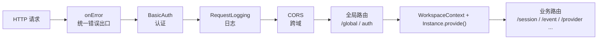

### 7.2 上下文绑定

`server.ts:192-218`：

1. 从 query `workspace` 或 header `x-opencode-workspace` 取 `workspaceID`
2. 从 query `directory` 或 header `x-opencode-directory` 取目录
3. 进入 `WorkspaceContext.provide(...)`
4. 再进入 `Instance.provide({ directory, init: InstanceBootstrap, fn })`

从这一层往后，路由里读到的 `Instance.directory`、`Instance.worktree`、`Instance.project` 对应的就是当前请求指向的工程。

---

## 8. `InstanceBootstrap()` 固定服务装配

`project/bootstrap.ts:15-24` 固定启动顺序：

1. `Plugin.init()`
2. `ShareNext.init()`
3. `Format.init()`
4. `LSP.init()`
5. `File.init()`
6. `FileWatcher.init()`
7. `Vcs.init()`
8. `Snapshot.init()`

**固定装配、延迟执行**：bootstrap 的风格是先把服务图挂好，具体执行延迟到首次命中。

---

## 9. 事件流：SSE 与 Bus

### 9.1 两层事件作用域

| 接口 | 作用域 | 代码坐标 |
|------|-------|---------|
| `/event` | 当前 Instance | `server/routes/event.ts:13-84` |
| `/global/event` | 全局（跨 Instance）| `server/routes/global.ts:43-124` |

### 9.2 SSE 链路

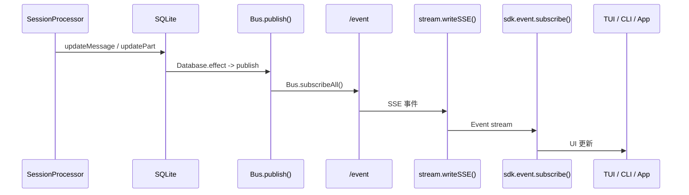

---

## 10. 关键源码定位

| 主题 | 源码文件 |
|------|---------|
| CLI 入口 | `packages/opencode/src/index.ts` |
| 默认命令 | `cli/cmd/tui/thread.ts` |
| TUI worker | `cli/cmd/tui/worker.ts` |
| run 命令 | `cli/cmd/run.ts` |
| attach 命令 | `cli/cmd/tui/attach.ts` |
| serve 命令 | `cli/cmd/serve.ts` |
| web 命令 | `cli/cmd/web.ts` |
| ACP | `cli/cmd/acp.ts`、`acp/agent.ts` |
| Server + 中间件 | `server/server.ts` |
| Session 路由 | `server/routes/session.ts` |
| Event SSE | `server/routes/event.ts` |
| Global SSE | `server/routes/global.ts` |
| Instance bootstrap | `project/bootstrap.ts` |
| Config 编译 | `config/config.ts` |
| XDG 目录 | `global/index.ts` |
| SQLite 封装 | `storage/db.ts` |

## OpenCode 核心执行循环：Session Loop、Prompt 编译、LLM 调用、流式响应处理

# OpenCode 核心执行循环：Session Loop、Prompt 编译、LLM 调用、流式响应处理

> 基于 `opencode` `v1.3.2`（tag `v1.3.2`，commit `0dcdf5f529dced23d8452c9aa5f166abb24d8f7c`）源码校对

---

## 1. 执行链路总览

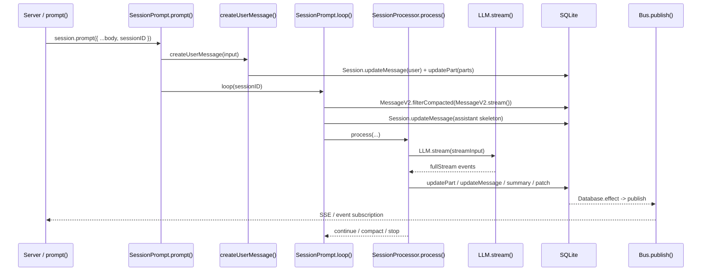

---

## 2. `prompt()` 主流程

`session/prompt.ts:162-188` 只有 27 行，但执行顺序是硬编码的：

1. `Session.get(input.sessionID)` 取 session
2. `SessionRevert.cleanup(session)` 清理可能遗留的 revert 临时状态
3. `createUserMessage(input)` 把这次输入编译并写进 durable history
4. `Session.touch(input.sessionID)` 更新时间戳
5. 把旧的 `tools` 输入翻译成 `Permission.Ruleset`
6. 判断 `noReply`：如果只想落 user message，不想继续推理，就直接返回；否则才进入 `loop({ sessionID })`

**关键点**：
- `revert cleanup` 一定发生在新输入之前
- `createUserMessage()` 一定发生在 `loop()` 之前，loop 随后读取的是 durable history

---

## 3. 输入编译：`createUserMessage()`

`session/prompt.ts:986-1386` 把用户输入编译成 durable parts。

### 3.1 Part 编译路径

| part 类型 | 编译行为 |
|---------|---------|
| `text` | 原样直通 |
| `file` | 文本文件执行 `ReadTool`，内容内联成 synthetic text；目录列出条目；二进制转 data URL |
| `agent` | 生成 synthetic text 提示模型调用 task 工具 |
| `subtask` | 原样直通，等 `loop()` 识别 |
| MCP resource | 先读取资源，再写成 synthetic text + 原始 file part |

### 3.2 文件展开逻辑

`prompt.ts:1126-1242` 对文本文件会：

1. 还原文件 URL 成本地路径
2. 如果带了 `start/end` 行号范围，转成 `ReadTool` 的 `offset/limit`
3. 执行 `ReadTool.execute()` 获取文件内容
4. 把 `result.output` 写成 synthetic text
5. 保留原始 `file` part

### 3.3 路径解析规则

`prompt.ts:205-209` 有两条规则：

1. `~/` 开头按用户 home 目录展开
2. 其他相对路径都以 `Instance.worktree` 为根做 `path.resolve()`

---

## 4. `loop()` 状态机

`session/prompt.ts:242-756` 是 Session 级状态机。

### 4.1 Session 级并发闸门

| 操作 | 函数 | 语义 |
|------|------|------|
| 第一次进入占住运行权 | `start(sessionID)` | 创建 `AbortController`，建 `callbacks` 队列 |
| 恢复原 loop 时重用 abort signal | `resume(sessionID)` | 直接取出已有的 `abort.signal` |
| 释放运行态 | `cancel(sessionID)` | `abort.abort()`，状态置回 `idle` |

**同一 session 同时只有一条主循环在推进**。

### 4.2 每轮状态推导

`session/prompt.ts:291-329`：

1. `msgs = filterCompacted(stream(sessionID))` 从 durable history 重放
2. 从尾到头扫描，推导 `lastUser`、`lastAssistant`、`lastFinished`、`tasks`
3. 满足"最近 assistant 已完整结束"就退出

### 4.3 分支判断顺序

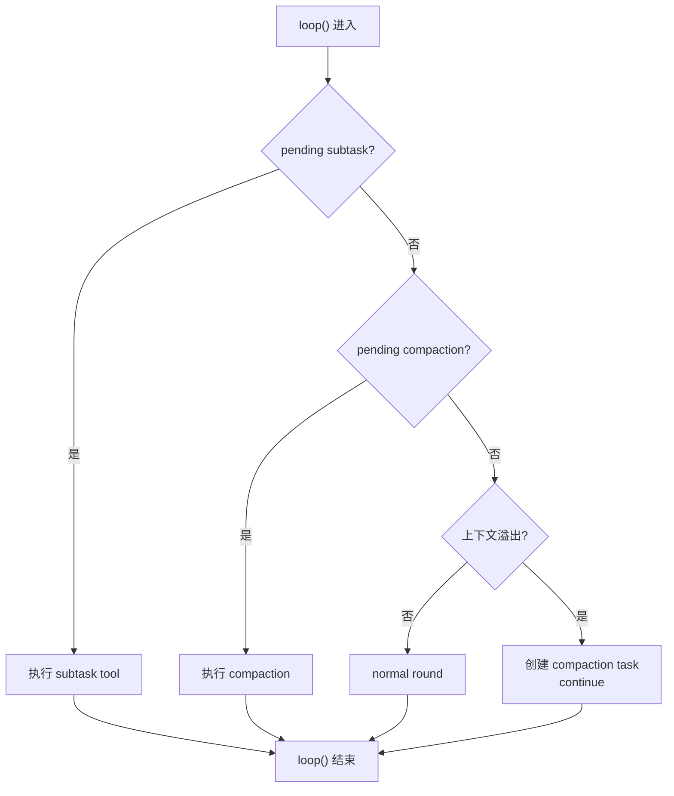

### 4.4 normal round 的执行

`session/prompt.ts:571-708`：

1. `insertReminders()` 注入 plan/build 模式提醒
2. 先落一条 assistant skeleton
3. 创建 `SessionProcessor`
4. `resolveTools()` 构造本轮可执行工具集
5. 拼 system prompt（多层叠加）
6. `processor.process()` 消费 LLM 流事件

---

## 5. `SessionProcessor.process()`

`session/processor.ts:46-425` 充当"流事件到 durable writes 的翻译器"。

### 5.1 AI SDK fullStream 21 种状态

| 分组 | 状态 | OpenCode 处理 |
|------|------|--------------|
| 文本 | `text-start/delta/end` | 创建 text part，增量广播，收尾写快照 |
| 推理 | `reasoning-start/delta/end` | 创建 reasoning part，增量广播，收尾写快照 |
| 工具 | `tool-input-start/delta/end` | 当前忽略（不持久化参数生成过程）|
| 工具 | `tool-call` | pending → running，做 doom-loop 检测 |
| 工具 | `tool-result/error` | running → completed/error |
| Step | `start-step` | 记录 snapshot |
| Step | `finish-step` | 写 step-finish part、patch、summary、overflow 检测 |
| 生命周期 | `start` | session status 设为 busy |
| 生命周期 | `finish` | 当前忽略 |
| 生命周期 | `error` | 进入 retry/stop/compact 分支 |

### 5.2 tool part 状态机

```
pending → running → completed
                └→ error
```

### 5.3 doom loop 检测

`session/processor.ts:152-176`：连续三次同工具同输入时触发权限询问。

---

## 6. `LLM.stream()`

`session/llm.ts:48-285` 封装 provider 请求。

### 6.1 system prompt 组装顺序

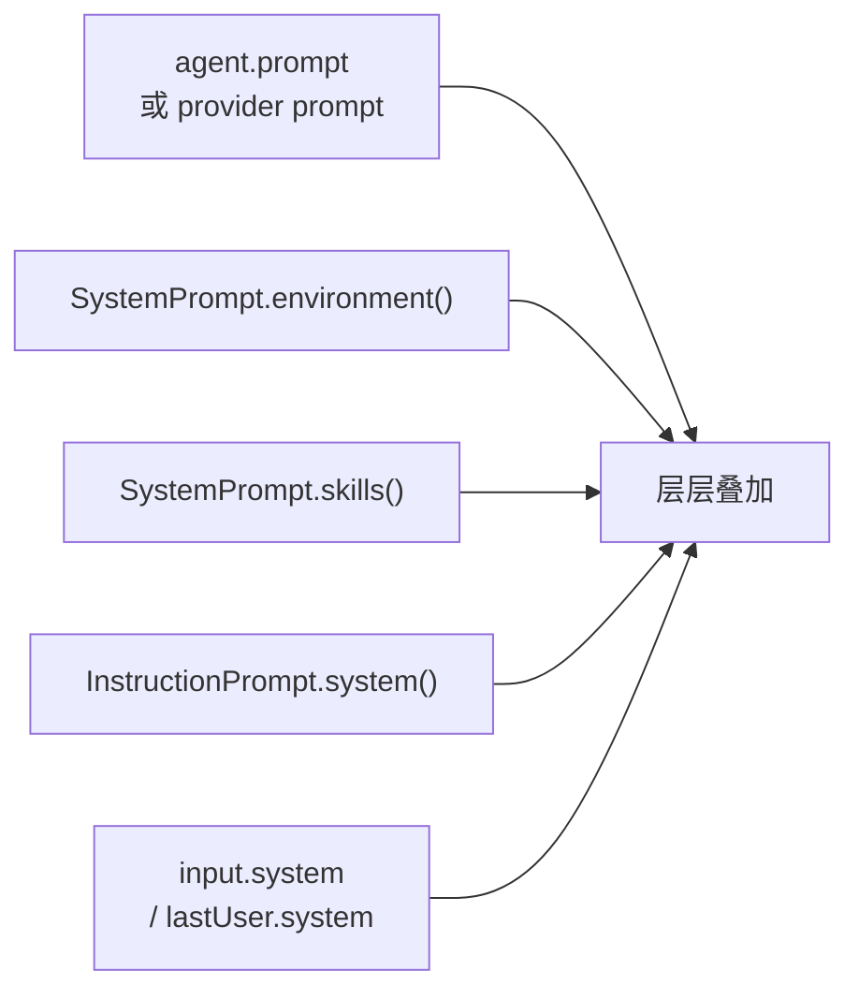

### 6.2 model 参数优先级

```
provider transform 默认值 → model.options → agent.options → variant
```

### 6.3 工具集两次裁剪

1. `resolveTools()`：内建工具、插件工具、MCP 工具 + metadata/permission/plugin hooks
2. `LLM.resolveTools()`：按 agent/session/user permission 再删掉禁用工具

### 6.4 provider 兼容层

- OpenAI OAuth：走 `instructions` 字段，不拼 system messages
- LiteLLM/Anthropic proxy：必要时补 `_noop` 工具
- GitLab Workflow model：把远端 tool call 接回本地工具系统
- `experimental_repairToolCall`：大小写修复或打回 `invalid`

---

## 7. 关键函数清单

| 函数 | 文件坐标 | 功能 |
|------|---------|------|
| `SessionPrompt.prompt()` | `prompt.ts:162-188` | 外部请求入口，先落 durable user message，再决定是否进入 loop |
| `createUserMessage()` | `prompt.ts:986-1386` | 把输入编译成 durable user message/parts |
| `resolvePromptParts()` | `prompt.ts:191-240` | 解析模板里的文件/目录/agent 引用 |
| `SessionPrompt.loop()` | `prompt.ts:242-756` | Session 级状态机：subtask/compaction/overflow/normal round |
| `insertReminders()` | `prompt.ts:1389-1527` | 注入 plan/build 模式提醒 |
| `SessionProcessor.process()` | `processor.ts:46-425` | 消费 LLM 流事件，写入 durable parts |
| `LLM.stream()` | `llm.ts:48-285` | 封装 provider 请求，构造 streamText 参数 |
| `SystemPrompt.environment()` | `system.ts:28-53` | 环境信息注入 |
| `SystemPrompt.skills()` | `system.ts:55-67` | 技能目录注入 |
| `InstructionPrompt.system()` | `instruction.ts:72-142` | AGENTS/CLAUDE 指令加载 |
| `SessionPrompt.resolveTools()` | `prompt.ts:766-953` | 构造本轮可执行工具集 |

## OpenCode 工具调用机制：Tool 注册、权限控制、执行闭环、结果写回 Durable State

# OpenCode 工具调用机制：Tool 注册、权限控制、执行闭环、结果写回 Durable State

> 基于 `opencode` `v1.3.2`（tag `v1.3.2`，commit `0dcdf5f529dced23d8452c9aa5f166abb24d8f7c`）源码校对

---

## 1. 工具系统架构总览

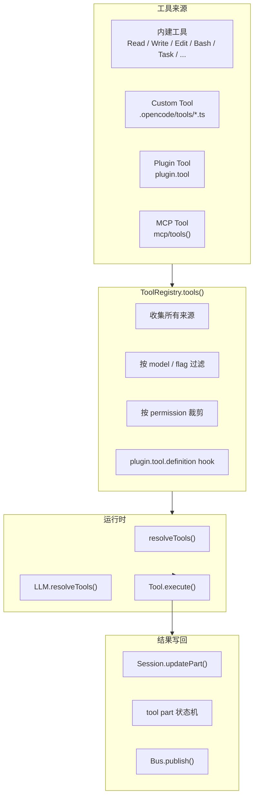

---

## 2. 工具注册与汇总

### 2.1 四类工具来源

| 来源 | 代码坐标 | 注册方式 |
|------|---------|---------|
| 内建工具 | `tool/*.ts` | 直接导入注册 |
| Custom Tool | `tool/registry.ts:85-98` | 扫描 `.opencode/tools/*.ts` |
| Plugin Tool | `tool/registry.ts:100-105` | `Plugin.list()` 的 `plugin.tool` |
| MCP Tool | `mcp/index.ts:606-646` | `MCP.tools()` |

### 2.2 `ToolRegistry.tools()`

`tool/registry.ts:85-190` 是"所有工具真正汇总"的地方：

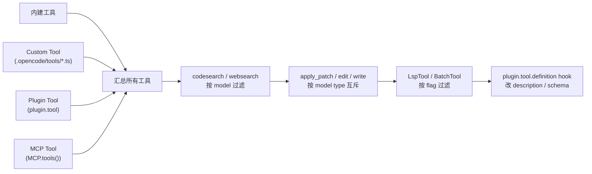

### 2.3 工具可见性裁剪

`tool/registry.ts:112-136`、`llm.ts:296-307` 分两次裁剪：

1. **第一次裁剪**（`tool/registry.ts`）：按 model、flag、互斥关系过滤
2. **第二次裁剪**（`llm.ts`）：按 agent permission、session permission、user 显式禁用

---

## 3. 权限控制系统

### 3.1 Permission 规则引擎

`permission/index.ts:166-267`：

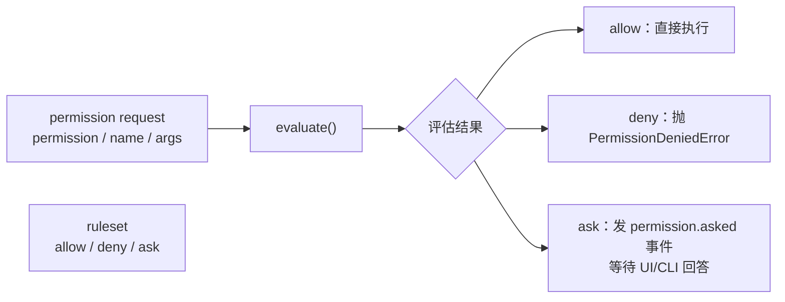

### 3.2 规则求值顺序

`permission/index.ts`：
1. 先用 ruleset 求 `allow/deny/ask`
2. `deny` 直接抛 `PermissionDeniedError`
3. `ask` 创建 pending request，发布 `permission.asked`
4. 等待 UI/CLI 通过 `/permission/:requestID/reply` 回答

### 3.3 批准规则持久化

`reply === "always"` 会把批准规则写进 `PermissionTable`，对同项目后续请求生效。

---

## 4. 工具执行闭环

### 4.1 tool 调用完整链路

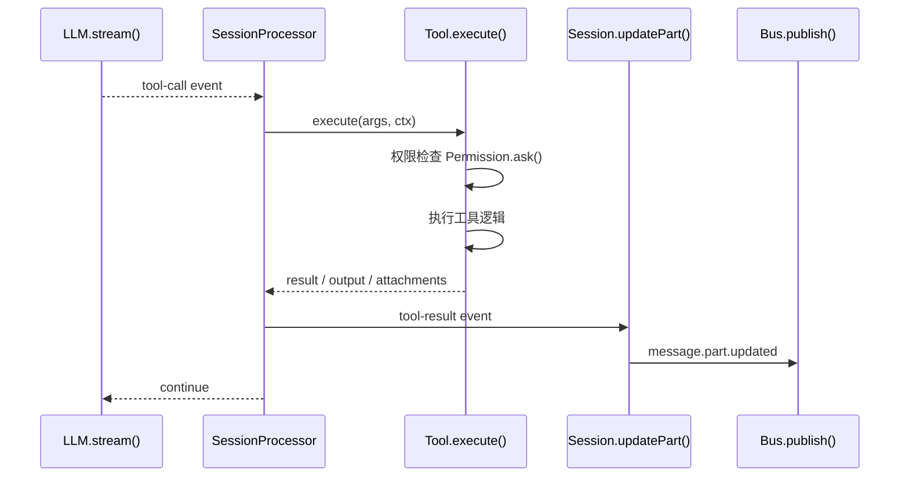

### 4.2 `Tool.Context` 提供的回调

`session/prompt.ts:431-456` 传给 TaskTool 的 context：

```ts
{
  metadata(input)  // 允许 TaskTool 在运行中补写当前 tool part 的标题和元数据
  ask(req)       // 权限检查时，把 subagent 权限和 session 权限合并后再发起 Permission.ask()
}
```

### 4.3 doom loop 检测

`session/processor.ts:152-176`：连续三次同工具同输入时触发 `Permission.ask({ permission: "doom_loop" })`。

---

## 5. 结果写回 Durable State

### 5.1 tool part 状态机

| 状态 | 触发时机 | 写库操作 |
|------|---------|---------|
| `pending` | `tool-input-start` | `Session.updatePart(pending)` |
| `running` | `tool-call` | `Session.updatePart(running)` + doom-loop 检测 |
| `completed` | `tool-result` | `Session.updatePart(completed)` + output / attachments |
| `error` | `tool-error` | `Session.updatePart(error)` |

### 5.2 退出前清理

`session/processor.ts:402-418`：即使中途出现异常，processor 仍会把所有未完成 tool part 改成 `error: "Tool execution aborted"`。

---

## 6. 关键函数清单

| 函数/类 | 文件坐标 | 功能 |
|---------|---------|------|
| `ToolRegistry.tools()` | `tool/registry.ts:85-190` | 汇总所有来源工具，按 model/flag/permission 过滤 |
| `ToolRegistry.state()` | `tool/registry.ts:85-105` | Custom tool 扫描：`.opencode/tools/*.ts` |
| `Permission.evaluate()` | `permission/index.ts:166-267` | 规则求值：allow / deny / ask |
| `Permission.ask()` | `permission/index.ts` | 发起权限询问请求 |
| `Tool.execute()` | 各 tool 文件 | 工具执行逻辑 |
| `SessionProcessor.process()` | `processor.ts:46-425` | 消费 tool-call / tool-result / tool-error 事件 |
| `Session.updatePart()` | `session/index.ts:755-776` | 写 tool part 快照 |
| `Session.updatePartDelta()` | `session/index.ts:778-789` | 发布 part 增量事件 |
| `resolveTools()` | `prompt.ts:766-953` | 构造本轮可执行工具集 |
| `LLM.resolveTools()` | `llm.ts:296-307` | 按权限再裁剪工具 |

---

## 7. 各工具职责

| 工具 | 文件 | 职责 |
|------|------|------|
| ReadTool | `tool/read.ts` | 文件/目录读取，LSP 预热 |
| WriteTool | `tool/write.ts` | 文件写入，写后 LSP.touchFile + diagnostics |
| EditTool | `tool/edit.ts` | 行级别编辑，写后 diagnostics 纠错 |
| ApplyPatchTool | `tool/apply_patch.ts` | patch 应用，diff 纠错 |
| BashTool | `tool/bash.ts` | Shell 命令执行 |
| TaskTool | `tool/task.ts` | Subagent 执行（新建/恢复 child session）|
| SkillTool | `tool/skill.ts` | 技能包加载 |
| LspTool | `tool/lsp.ts` | LSP 显式查询（实验态）|

---

## 8. plugin Hook 对工具的影响

| Hook | 调用点 | 作用 |
|------|-------|------|
| `tool` | `ToolRegistry.state()` | 向 runtime 注入自定义 tool |
| `tool.definition` | `ToolRegistry.tools()` | 在 tool 暴露给模型前改 description/schema |
| `tool.execute.before` | `SessionPrompt.loop()` | 改 tool args |
| `tool.execute.after` | `SessionPrompt.loop()` | 改 tool title/output/metadata |

## OpenCode 状态管理：Durable State、消息持久化、并发占位与历史回放

# OpenCode 状态管理：Durable State、消息持久化、并发占位与历史回放

> 基于 `opencode` `v1.3.2`（tag `v1.3.2`，commit `0dcdf5f529dced23d8452c9aa5f166abb24d8f7c`）源码校对

---

## 1. Durable State 写入口

`session/index.ts:686-789` 集中了三组写入口：

| API | 语义 | 代码坐标 |
|-----|------|---------|
| `Session.updateMessage()` | upsert message 头 | `686-706` |
| `Session.updatePart()` | upsert part 快照 | `755-776` |
| `Session.updatePartDelta()` | 发布 part 增量事件（不写库）| `778-789` |

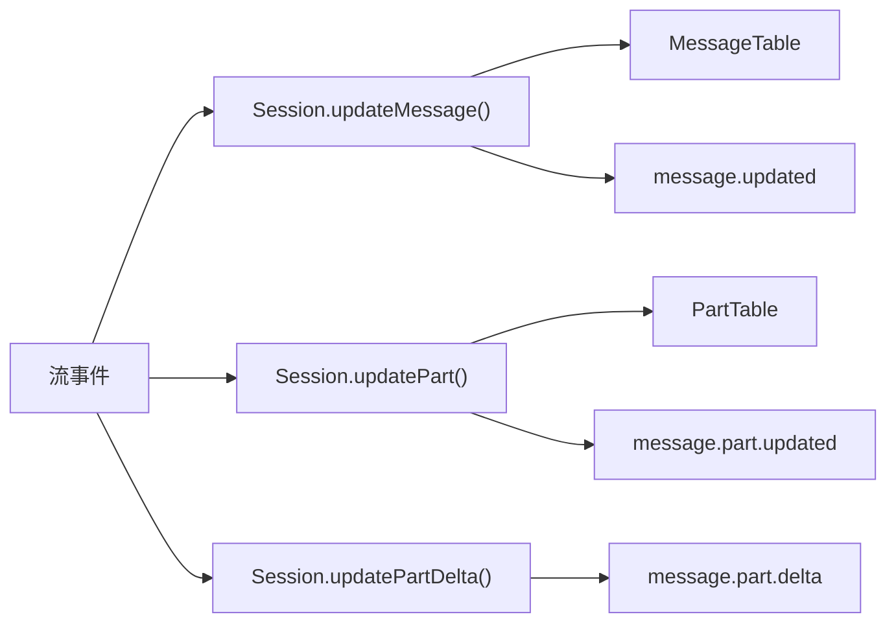

---

## 2. SQLite 表结构

### 2.1 三张核心表

| 表 | 关键列 | 存什么 |
|---|--------|-------|
| `SessionTable` | `project_id / workspace_id / parent_id / directory / title / summary / revert / permission` | session 边界 |
| `MessageTable` | `session_id / time_created / data(json)` | message header |
| `PartTable` | `message_id / session_id / time_created / data(json)` | part 体 |

**关键设计**：`MessageTable.data` 和 `PartTable.data` 只存 `Omit<Info, 'id' | 'sessionID'>` 的 JSON，ID 和外键列走关系型列。

---

## 3. `Database.effect()` 保证"先写库再发事件"

`storage/db.ts:121-146`：

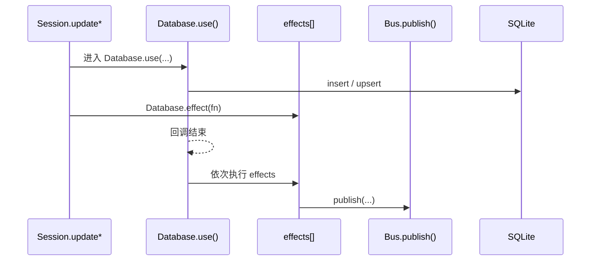

---

## 4. Message 与 Part 的关系

### 4.1 五层建模

| 层 | 职责 |
|---|------|
| message header | 轮次边界：role / agent / model / tokens / cost / finish |
| part | 轮次内部节点：text / reasoning / tool / step / patch |
| durable 写入 | message 和 part 分开存 |
| 实时渲染 | 主要消费 part |
| 回放时组装 | `hydrate()` 把 message + parts[] 组装成 `WithParts` |

### 4.2 durable history 回放单位

`MessageV2.WithParts[]` = message + parts[]，不是孤立的 header 或孤立的 part。

---

## 5. 三条消费链

### 5.1 实时链


### 5.2 跨实例聚合链


### 5.3 Durable 回放链


---

## 6. MessageV2 关键函数

| 函数 | 文件坐标 | 功能 |
|------|---------|------|
| `MessageV2.stream()` | `message-v2.ts:827-849` | 按"新到旧"产出消息 |
| `MessageV2.filterCompacted()` | `message-v2.ts:882-898` | 过滤已压缩历史，返回活动历史 |
| `MessageV2.hydrate()` | `message-v2.ts:533-557` | 把 message rows 与 part rows 组装成 `WithParts` |
| `MessageV2.toModelMessages()` | `message-v2.ts:559-792` | 把 durable history 投影成 AI SDK `ModelMessage[]` |
| `MessageV2.page()` | `message-v2.ts:794-813` | 分页读取，按 `time_created desc` |

---

## 7. 并发占位机制

### 7.1 assistant skeleton 先写

`session/prompt.ts:591-620`：normal round 开始前，先 `Session.updateMessage(assistant skeleton)` 创建一条空的 assistant message。

**意义**：processor 从来不是"先拿到流，再决定往哪里写"，而是"先拿到一条 durable assistant 宿主，再把流事件持续写进去"。

### 7.2 reasoning / text 占位 part

`processor.ts:63-80`、`291-304`：流事件到来时，先创建空 part 占位，再增量更新。

---

## 8. SessionStatus 与 Durable State 的区别

| 对象 | 存储位置 | 语义 |
|------|---------|------|
| `Session.Info` | SQLite `SessionTable` | durable 执行边界 |
| `MessageV2.Info` | SQLite `MessageTable` | durable 轮次边界 |
| `MessageV2.Part` | SQLite `PartTable` | durable 轮次内部节点 |
| `SessionStatus` | 内存 `Map<SessionID, Info>` | 运行态（busy/retry/idle）|

**说明**：`SessionStatus` 存在内存中，不进 SQLite，因为它不适合持久化回放。

---

## 9. Snapshot 与 Diff

### 9.1 Snapshot 记录

`snapshot/index.ts`：每个 step 开始时记录快照 ID。

### 9.2 Diff 计算

`session/summary.ts:144-169`：

1. 从 message history 中找最早和最晚的 step 快照
2. 调用 `Snapshot.diffFull(from, to)` 计算 diff
3. 写进 `Storage.write(["session_diff", sessionID])`

### 9.3 Compaction 中的 Diff

`session/compaction.ts`：
- replay 时把旧 replay parts 复制回来
- media 附件降级成文本提示

---

## 10. 关键函数清单

| 函数 | 文件坐标 | 功能 |
|------|---------|------|
| `Session.updateMessage()` | `session/index.ts:686-706` | upsert message 头 |
| `Session.updatePart()` | `session/index.ts:755-776` | upsert part 快照 |
| `Session.updatePartDelta()` | `session/index.ts:778-789` | 发布 part 增量事件 |
| `Database.use()` | `storage/db.ts:121-146` | 提供 DB 上下文，封装 transaction/effect |
| `Database.effect()` | `storage/db.ts:140-146` | 延迟执行副作用（先写库，再发事件）|
| `MessageV2.stream()` | `message-v2.ts:827-849` | 按"新到旧"产出消息 |
| `MessageV2.filterCompacted()` | `message-v2.ts:882-898` | 过滤已压缩历史 |
| `MessageV2.hydrate()` | `message-v2.ts:533-557` | 组装 message + parts[] |
| `MessageV2.toModelMessages()` | `message-v2.ts:559-792` | 投影成 AI SDK ModelMessage[] |
| `SessionSummary.computeDiff()` | `session/summary.ts:144-169` | 计算 session diff |
| `SessionSummary.summarize()` | `session/summary.ts:71-89` | 触发 session 摘要和 message 摘要 |
| `Snapshot.track()` | `snapshot/index.ts` | 记录文件快照 |

## OpenCode 扩展性：MCP 集成链路、Plugin 加载、新增工具的修改点

# OpenCode 扩展性：MCP 集成链路、Plugin 加载、新增工具的修改点

> 基于 `opencode` `v1.3.2`（tag `v1.3.2`，commit `0dcdf5f529dced23d8452c9aa5f166abb24d8f7c`）源码校对

---

## 1. 扩展入口总览

| 扩展入口 | 代码坐标 | 最终落在哪里 |
|---------|---------|------------|
| Plugin hooks | `plugin/index.ts:47-165` | 挂到 bus event、tool definition 和其他 hook 点 |
| MCP servers | `mcp/index.ts` | 产出 tool、prompt、resource 和连接状态 |
| Custom tools | `tool/registry.ts:85-105` | 变成 runtime 可调用 Tool |
| Commands | `command/index.ts:63-157` | 变成 slash command / prompt template |
| Skills | `skill/index.ts:126-226` | 变成 skill 列表，也可折叠进 command 和 prompt |

### 1.2 McpClientManager：连接枢纽
`packages/opencode/src/mcp/index.ts` 是 MCP 的核心。
- **配置与发现**：读取 `settings` 中定义的 MCP 服务器列表。
- **声明映射**：将 MCP 服务器暴露的 `tools` 转换为 Gemini 的 `FunctionDeclaration`。
- **协议适配**：利用 Bun 的 `fetch` 和 `ReadableStream` 实现轻量级 SSE 转发（`mcp/index.ts:606-646`）。
- **凭证隔离**：通过 `mcp/auth.ts` 管理不同 server 的 OAuth2 令牌。

### 1.3 MCP 集成架构图
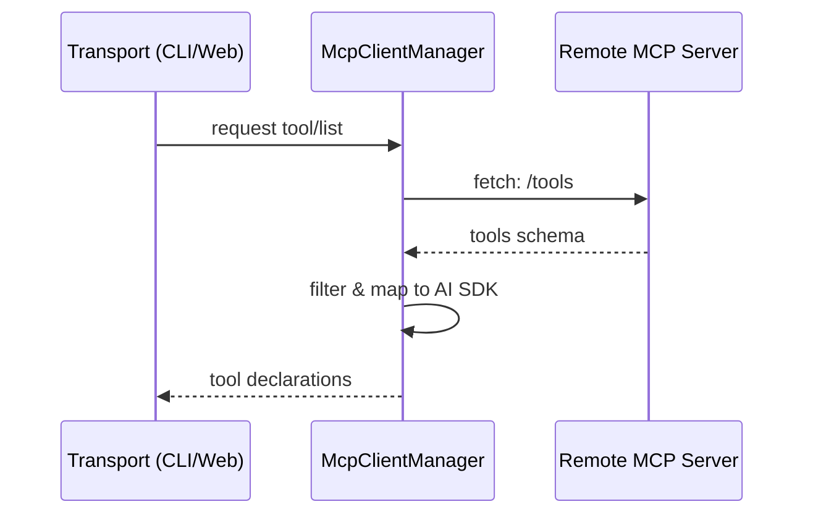

---

## 2. MCP 集成链路

### 2.1 MCP 五状态机

`mcp/index.ts:67-109`：

| 状态 | 含义 |
|------|------|
| `connected` | 已连接：成功建立 transport 并完成 handshake |
| `disabled` | 已禁用：`mcp.enabled === false` 或从未配置 |
| `failed` | 连接失败：transport 连接失败或无法获取 tool list |
| `needs_auth` | 需认证：OAuth 流程需要用户授权 |
| `needs_client_registration` | 需客户端注册：server 不支持动态注册 |

### 2.2 两类 MCP Server

| 类型 | 连接方式 | 代码坐标 |
|------|---------|---------|
| 远程 MCP | `StreamableHTTPClientTransport` 或 `SSEClientTransport` | `mcp/index.ts:325-446` |
| 本地 MCP | `StdioClientTransport`，cwd = `Instance.directory` | `mcp/index.ts:448-490` |

### 2.3 MCP 对外暴露四类能力

| MCP 角色 | 导出函数 | 在 runtime 里的投影 |
|---------|---------|------------------|
| 工具来源 | `tools()` | 变成 agent 可调用的 Tool |
| Prompt 模板 | `prompts()` | 变成 slash command 模板 |
| Resource | `resources()` / `readResource()` | 变成可读取的上下文 |
| 事件源 | `ToolsChanged` BusEvent | MCP server 发 `ToolListChangedNotification` 时触发刷新 |

### 2.4 Tool 投影过程

`mcp/index.ts:606-646`：

```ts
result[sanitizedClientName + "_" + sanitizedToolName] = await convertMcpTool(mcpTool, client, timeout)
```

工具名称会做安全 sanitize（替换非法字符为 `_`），最终 tool name 格式是 `clientName_toolName`。

---

## 3. Plugin 系统

### 3.1 Plugin 不是工具列表，而是一组 Hook

`plugin/index.ts:47-165`：Plugin 是 runtime 内部的高权限 hook 编排层。

### 3.2 PluginInput 提供的上下文

| 字段 | 含义 |
|------|------|
| `client` | 内嵌 SDK client，`fetch` 直接走 `Server.Default().fetch()` |
| `project` | 当前实例绑定的 project 信息 |
| `directory` | 当前工作目录 |
| `worktree` | worktree 根 |
| `serverUrl` | 当前 server URL |
| `$` | `Bun.$` shell 能力 |

### 3.3 Plugin Hook 全景

| Hook | 调用点 | 作用 |
|------|-------|------|
| `config` | `Plugin.init()` 装载完成后 | 让 plugin 读取最终配置 |
| `event` | `Plugin.init()` 里 `Bus.subscribeAll()` | 旁路观察 instance 级 bus event |
| `auth` | `ProviderAuth.methods/authorize/callback` | 自定义 provider 登录方式 |
| `tool` | `ToolRegistry.state()` | 向 runtime 注入自定义 tool |
| `tool.definition` | `ToolRegistry.tools()` | 在 tool 暴露给模型前改 description/schema |
| `chat.message` | `SessionPrompt.createUserMessage()` | 在 user message/parts 落库前改写 |
| `chat.params` | `session/llm.ts` | 改 temperature/topP/topK/provider options |
| `chat.headers` | `session/llm.ts` | 改 provider 请求头 |
| `tool.execute.before` | `SessionPrompt.loop()` | 改 tool args |
| `tool.execute.after` | `SessionPrompt.loop()` | 改 tool title/output/metadata |
| `shell.env` | `tool/bash.ts`、`pty/index.ts` | 给 shell / PTY 注入环境变量 |

### 3.4 Plugin 语义

`Plugin.trigger(name, input, output)`：
1. 取出当前 instance 的 `hooks[]`
2. 逐个取 `hook[name]`
3. 若存在则 `await fn(input, output)`
4. 最后把同一个 `output` 对象返回

**关键性质**：
- 调用顺序严格串行
- 冲突策略是"后写覆盖前写"
- 某个 hook 抛错，整条调用链就会报错

---

## 4. Skill 系统

### 4.1 Skill 五层结构

| 层 | 代码坐标 | 角色 |
|---|---------|------|
| 发现层 | `skill/index.ts:15-166` | 从全局目录、项目目录、`.opencode`、显式路径和远端 URL 收集 `SKILL.md` |
| 远端拉取层 | `skill/discovery.ts:11-100` | 从 `index.json` 下载 skill pack 到本地 cache |
| 运行时服务层 | `skill/index.ts:168-226` | 暴露 `get/all/dirs/available`，并做 lazy ensure |
| 注入层 | `system.ts:55-65`、`prompt.ts:676-679` | 把"可用技能列表"编进 system prompt |
| 交互层 | `tool/skill.ts:8-90`、`command/index.ts:142-153` | 把 Skill 继续投影成 `skill` tool 和 slash command 来源 |

### 4.2 Skill 三个对外投影面

1. **system prompt**：技能目录注入
2. **skill tool**：按需加载完整技能包
3. **slash command**：Skill 自动生成 command

---

## 5. Command 系统

`command/index.ts:63-157`：

当前 command 列表由四部分拼成：
1. 内建 `init` / `review`
2. `cfg.command` 里的显式命令
3. `MCP.prompts()` 导出的 prompt
4. `Skill.all()` 导出的技能

---

## 6. 新增工具的修改点

### 6.1 新增内建工具

需要修改：
- `tool/registry.ts` 注册新工具
- `tool/*.ts` 实现新工具文件
- `tool/execute-map.ts` 或类似执行映射

### 6.2 新增 Custom Tool

需要修改：
- 创建 `.opencode/tools/*.ts` 文件
- 不需要修改核心代码，ToolRegistry 会自动扫描

### 6.3 新增 MCP Tool

需要修改：
- `mcp/index.ts` 中添加 MCP server 连接逻辑
- 或通过配置 `mcp` 添加远程/本地 MCP server

### 6.4 新增 Plugin Tool

需要修改：
- 创建 plugin 文件，导出 tool hook
- 在 `Plugin.init()` 中被加载

### 6.5 新增 Skill

需要修改：
- 创建 `SKILL.md` 文件
- 放在 `~/.claude/skills/`、`.claude/skills/`、`.opencode/skills/` 或配置路径中

---

## 7. 扩展能力汇总表

| 扩展能力 | 汇入接口 | 是否修改核心代码 |
|---------|---------|---------------|
| Custom Tool | `.opencode/tools/*.ts` | 否 |
| MCP Server | 配置 `mcp` | 否 |
| Plugin Tool | `Plugin.list()` | 是（plugin 文件）|
| Skill | `Skill.all()` | 否 |
| Command | 配置 `command` 或 MCP prompts | 否 |
| 内建 Tool | `tool/registry.ts` | 是 |
| LSP Server | 配置 `lsp` | 否 |

---

## 8. 关键源码定位

| 主题 | 源码文件 |
|------|---------|
| MCP 集成 | `mcp/index.ts` |
| MCP OAuth | `mcp/auth.ts`、`mcp/oauth-provider.ts`、`mcp/oauth-callback.ts` |
| Plugin 加载 | `plugin/index.ts` |
| Plugin 内建 | `plugin/codex.ts`、`plugin/copilot.ts` |
| Skill 系统 | `skill/index.ts` |
| Skill 远端拉取 | `skill/discovery.ts` |
| Tool 注册 | `tool/registry.ts` |
| Command 注册 | `command/index.ts` |
| Config 扩展发现 | `config/config.ts:143-166` |

## OpenCode 错误处理与安全性：异常捕获、重试策略、认证鉴权、敏感信息隔离

# OpenCode 错误处理与安全性：异常捕获、重试策略、认证鉴权、敏感信息隔离

> 基于 `opencode` `v1.3.2`（tag `v1.3.2`，commit `0dcdf5f529dced23d8452c9aa5f166abb24d8f7c`）源码校对

---

## 1. 错误归一化

### 1.1 错误类型映射

`message-v2.ts:900-987` 的 `fromError()` 把底层异常映射成 runtime 能处理的错误对象：

| 错误类型 | 含义 |
|---------|------|
| `AbortedError` | 用户取消/超时 |
| `AuthError` | 认证失败 |
| `APIError` | Provider API 错误 |
| `ContextOverflowError` | 上下文溢出 |
| `StructuredOutputError` | 结构化输出格式错误 |
| `NamedError.Unknown` | 未知错误 |

### 1.2 归一化价值

provider、网络、系统调用错误先被规约进统一语义，processor 后续只需要按错误类别做策略分支。

---

## 2. 重试策略

### 2.1 delay 计算优先级

`session/retry.ts:28-100`：

1. `retry-after-ms`
2. `retry-after`
3. HTTP 日期格式的 `retry-after`
4. 否则退回指数退避

**说明**：不是固定 `2s -> 4s -> 8s`，而是尊重 provider 头信息。

### 2.2 retryable 判断

`session/retry.ts` 的 `retryable(error)`：
1. 明确排除 `ContextOverflowError`
2. 只对 `APIError.isRetryable === true` 的错误重试
3. 特判 `FreeUsageLimitError`、`Overloaded`、`too_many_requests`、`rate_limit`

### 2.3 retry 流程

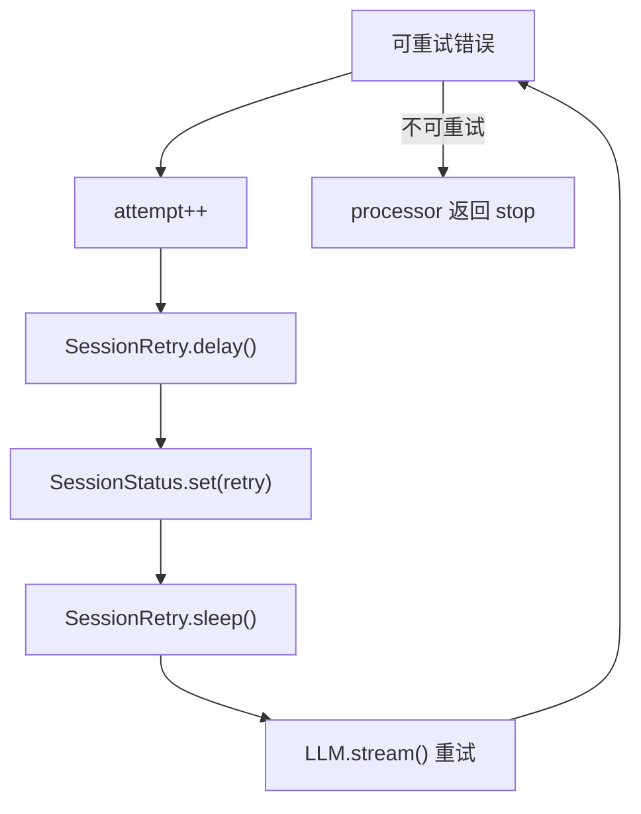

---

## 3. 上下文溢出自愈

### 3.1 软溢出 vs 硬溢出

| 类型 | 触发条件 | 处理方式 |
|------|---------|---------|
| 软溢出 | 正常 finish 后判断 token 接近上限 | `SessionCompaction.isOverflow()` → 创建 compaction task |
| 硬溢出 | provider 直接返回 `ContextOverflowError` | `needsCompaction = true` → 返回 `"compact"` |

### 3.2 Compaction 自愈

`session/compaction.ts:102-297`：

1. 找到 overflow 之前最近一条未 compaction 的 user message 作为 `replay`
2. 压缩完成后重新写一条 user message，复制原 `agent/model/format/tools/system/variant`
3. 把旧 replay parts 复制回来
4. 如果找不到可 replay 的历史，则写 synthetic continue message

---

## 4. Permission 与 Question 机制

### 4.1 Permission 流程

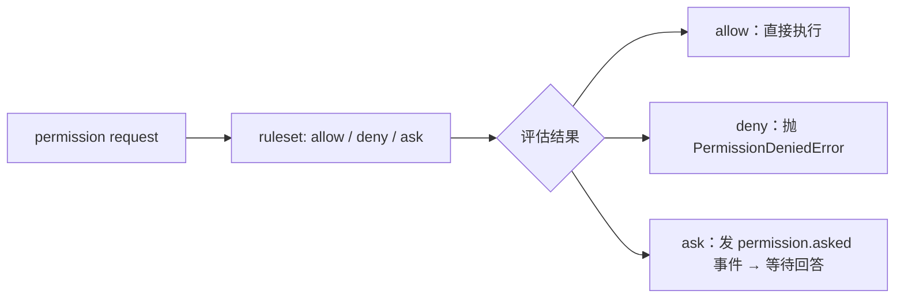

### 4.2 Question 机制

`question/index.ts:131-220`：
1. 创建 pending question request
2. 发布 `question.asked`
3. 阻塞等待回答
4. 回答后生成"用户已回答你的问题"形式的工具输出

### 4.3 被拒绝时 loop 是否停止

`processor.ts:49`：`shouldBreak = experimental?.continue_loop_on_deny !== true`

默认情况下 permission/question 被拒绝会让本轮 stop；只有显式打开实验开关才允许继续 loop。

---

## 5. Session 并发控制

### 5.1 busy 状态

`SessionPrompt.assertNotBusy(sessionID)`：新操作撞上正在运行的 session 时抛 `Session.BusyError`。

### 5.2 cancel 机制

`SessionPrompt.cancel()`：
1. abort 当前 controller
2. 删除 session 占位
3. 把状态切回 `idle`

shell、loop、task tool 都会监听这个 abort signal。

---

## 6. Revert 机制

### 6.1 revert 流程

`session/revert.ts:24-80`：
1. 找到目标 message 或 part
2. 从目标之后收集所有 `patch` part
3. 用 `Snapshot.revert(patches)` 回滚文件系统
4. 记录 `session.revert = { messageID, partID?, snapshot, diff }`

### 6.2 cleanup 清理

`session/revert.ts:91-137`：
- 回滚整条 message：删除该 message 及其后的所有消息
- 回滚 part：只删除目标 part 及之后的 parts
- 删除完成后清空 `session.revert`

### 6.3 unrevert 恢复

`snapshot/revert.ts:82-89`：用 `Snapshot.restore(snapshot)` 恢复文件现场，再清掉 `session.revert`。

---

## 7. 认证鉴权

### 7.1 Provider Auth 体系

`provider/auth.ts`：三层认证方式：
1. env（环境变量）
2. api（API key）
3. custom（自定义 provider auth）

### 7.2 内建认证 Plugin

| Plugin | Provider | 功能 |
|--------|---------|------|
| `CodexAuthPlugin` | `openai` | ChatGPT/Codex OAuth |
| `CopilotAuthPlugin` | `github-copilot` | GitHub device flow |
| `GitlabAuthPlugin` | GitLab | OAuth |
| `PoeAuthPlugin` | Poe | OAuth |

### 7.3 Plugin Auth 覆盖语义

`Plugin.init()` 先 push 内建 hooks，再 push 用户 hooks。同一个 provider key 后写覆盖前写。

---

## 8. 敏感信息隔离

### 8.1 API Key 处理

- env 方式：通过 `ProviderAuth` 从环境变量读取
- config 方式：通过 `Config.get()` 从配置读取
- Plugin 方式：通过 plugin 的 `auth.loader()` 动态获取

### 8.2 MCP OAuth 凭证

`mcp/auth.ts`：tokens、codeVerifier、oauthState 写进 `~/.local/share/opencode/mcp-auth.json`，不进 SQLite。

### 8.3 external_directory 权限

`tool/external-directory.ts`：sandbox 内路径不会触发 `external_directory` 权限提示。

---

## 9. 关键函数清单

| 函数 | 文件坐标 | 功能 |
|------|---------|------|
| `MessageV2.fromError()` | `message-v2.ts:900-987` | 错误归一化 |
| `SessionRetry.retryable()` | `session/retry.ts:28-100` | 判断是否可重试 |
| `SessionRetry.delay()` | `session/retry.ts` | 计算退避时间 |
| `SessionProcessor.process()` | `processor.ts:354-387` | catch 分支处理 retry/overflow/fatal error |
| `Permission.evaluate()` | `permission/index.ts:166-267` | 规则求值 |
| `SessionCompaction.isOverflow()` | `session/compaction.ts` | 判断上下文是否溢出 |
| `SessionCompaction.process()` | `session/compaction.ts:102-297` | 执行 compaction 自愈 |
| `SessionRevert.cleanup()` | `session/revert.ts:91-137` | 清理 revert 状态 |
| `SessionPrompt.assertNotBusy()` | `prompt.ts` | busy 状态检测 |
| `SessionPrompt.cancel()` | `prompt.ts:260-272` | 释放运行态 |
| `Snapshot.revert()` | `snapshot/index.ts` | 文件系统回滚 |
| `Snapshot.restore()` | `snapshot/index.ts` | 文件系统恢复 |

## OpenCode 性能与代码质量：流式传输、SSE、Bun Runtime 优势、优缺点分析

# OpenCode 性能与代码质量：流式传输、SSE、Bun Runtime 优势、优缺点分析

> 基于 `opencode` `v1.3.2`（tag `v1.3.2`，commit `0dcdf5f529dced23d8452c9aa5f166abb24d8f7c`）源码校对

---

## 1. 流式传输架构

### 1.1 双层流

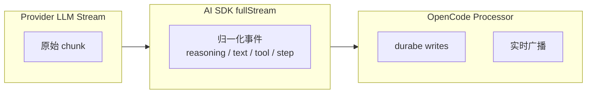

### 1.2 AI SDK fullStream 21 种状态

| 分组 | 状态 | OpenCode 处理 |
|------|------|--------------|
| 文本 | `text-start/delta/end` | 增量写 text part |
| 推理 | `reasoning-start/delta/end` | 增量写 reasoning part |
| 工具 | `tool-input-start/delta/end` | 当前忽略 |
| 工具 | `tool-call` | pending → running |
| 工具 | `tool-result/error` | completed/error |
| Step | `start-step` | 记录 snapshot |
| Step | `finish-step` | 写 step-finish / patch / summary |
| 生命周期 | `start` | session status busy |
| 生命周期 | `finish` | 忽略 |
| 生命周期 | `error` | 进入 retry/stop/compact |

### 1.2 Bun 原生持久化加速
- **Bun.sql 零开销访问**：OpenCode 放弃了传统 ORM，直接使用 Bun 内置的 SQLite 引擎（`packages/opencode/src/storage/db.ts`）。
- **原子性保障**：利用 Bun 的同步写入特性，确保 `updatePartDelta` 在高频并发下依然能维持顺序一致性。

### 1.3 MCP 流式集成深度
- **SSE 透明转发**：在 `packages/opencode/src/mcp/index.ts` 中，利用 Bun 原生支持的 `ReadableStream` 直接将远程 MCP Server 的事件透传至前端，避免了中间层序列化开销。

---

## 2. SSE 实时推送

### 2.1 SSE 链路

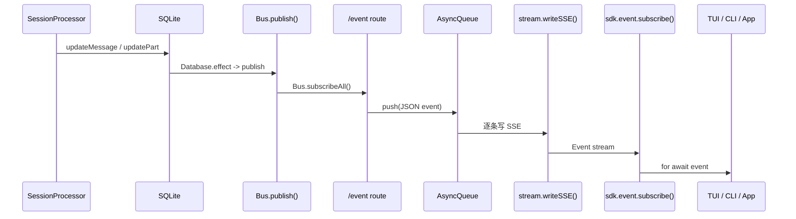

### 2.2 两层事件作用域

| 接口 | 作用域 | 代码坐标 |
|------|-------|---------|
| `/event` | 当前 Instance | `server/routes/event.ts:13-84` |
| `/global/event` | 全局（跨 Instance）| `server/routes/global.ts:43-124` |

---

## 3. Bun Runtime 优势

### 3.1 Bun.serve

`server/server.ts`：

```ts
Bun.serve({
  fetch: app.fetch,
  websocket,
  port: opts.port,
  hostname: opts.hostname,
})
```

**优势**：
- 原生 HTTP/1.1 + HTTP/2 支持
- 内置 WebSocket 支持
- 自动 TLS（通过 `serveTLS`）
- 比 Node.js `http` 模块更高的吞吐量

### 3.2 Bun.spawn

`mcp/index.ts`、`tool/bash.ts`：

```ts
Bun.spawn({
  cmd: args,
  cwd: Instance.directory,
  env: { ...process.env, ...env },
  stdout: "pipe",
  stderr: "pipe",
})
```

**优势**：
- 比 Node.js `child_process` 更快的进程启动
- 原生 `stdout`/`stderr` 流处理
- 内置 IPC 能力

### 3.3 Bun.$ Shell

`plugin/index.ts`：

```ts
Bun.$`git status --short`
```

**优势**：
- 模板字符串语法，链式调用
- 自动流式输出捕获
- 内置 `glob`、`expand`、`quiet` 等修饰符

### 3.4 Bun vs Node.js 差异

| 能力 | Bun | Node.js |
|------|-----|---------|
| HTTP Server | `Bun.serve()` 原生高性能 | `node:http` 或 Express/Fastify |
| WebSocket | 内置 `websocket` 选项 | `ws` 库 |
| Shell | `Bun.$` 模板语法 | `child_process.exec/spawn` |
| SQLite | 内置 `Bun.sql()` | `better-sqlite3` |
| 构建 | `bun build` 原生 ESM/CJS | `esbuild`/`webpack` |
| 安装 | `bun install` 比 npm 快 | `npm install` |

---

## 4. 性能优化机制

### 4.1 增量写 vs 全量写

| 类型 | API | 场景 |
|------|-----|------|
| 全量写 | `Session.updatePart()` | text/reasoning 结束 |
| 增量写 | `Session.updatePartDelta()` | text/reasoning delta |
| 实时广播 | `Bus.publish()` | part delta 事件 |

### 4.2 LSP 懒启动

`lsp/index.ts`：
- **eager init**：runtime 先知道有哪些 server 可用
- **lazy spawn**：真正启动要看文件是否命中

### 4.3 MCP 连接复用

`mcp/index.ts`：
- 同一 `(root + serverID)` 的多个请求复用同一个 client
- `spawning` map 防止并发去重
- `broken` set 隔离失败

### 4.4 Database effect 批处理

`storage/db.ts:121-146`：
- `effect` 不会立刻执行，而是先塞进队列
- 等主事务写完再统一执行
- 减少数据库 fsync 次数

---

## 5. 代码质量评估

### 5.1 优点

1. **Durable 天然支持恢复**
   - 每步都压回 durable history，崩溃后只需重放
   - 同一份 durable history 支撑恢复、fork、compaction、多端订阅

2. **多宿主复用成本低**
   - transport 只需接到 HTTP/SSE contract
   - CLI/TUI/Web/Desktop/ACP 复用同一套 runtime

3. **扩展集中管理**
   - Plugin/MCP/Skill 都汇入统一接口
   - 不撕裂主骨架

4. **Instance 作用域隔离**
   - 每个 workspace/project 有独立状态
   - 互不干扰

5. **Bun runtime 高性能**
   - 原生 HTTP/WS、SQLite、流处理优势
   - 比 Node.js 更快的进程启动

### 5.2 缺点/限制

1. **新分支类型需改 loop()**
   - 想增加 session 级分支，通常要直接改 `prompt.ts`
   - 扩展点在边缘，不在中心调度器

2. **新 durable node 困难**
   - 完全独立于 `MessageV2.Part` 的对象会非常别扭
   - 所有高级能力最终都回写到 session/message/part 模型

3. **兼容性集中在少数节点**
   - provider 兼容、tool 兼容、消息投影兼容堆积在 `llm.ts`
   - 容易形成"关键节点过载"

4. **Plugin 安全边界弱**
   - 默认是 trusted code execution
   - 不适合运行不信任代码

5. **多数 hook 无隔离**
   - 坏 plugin 可直接打断主链路
   - 只有 config hook 做容错

6. **SQLite 单点**
   - 单文件 SQLite 不适合高并发写入场景
   - 多 workspace 并发时可能成为瓶颈

7. **超长历史压测**
   - 当前 `MessageV2.filterCompacted` 在处理万级 Part 时存在内存压力，建议引入滑动窗口加载。

8. **SQLite 锁竞争**
   - 在大规模并发 subtask 场景下，SQLite 的写锁可能成为瓶颈，建议探索 Bun 的 `WAL` 模式深度配置。

---

## 6. 设计哲学总结

### 6.1 固定骨架 + 晚绑定

OpenCode 的设计哲学是：

> 把 `prompt -> loop -> processor -> durable history` 这条主骨架写死，再把 transport、workspace、agent、system、tools、provider 全部推迟到临近执行时晚绑定。

### 6.2 为什么骨架是固定的

1. **可恢复性是骨架天然支持**：每个关键步骤都被压回 durable history
2. **多宿主复用成本很低**：transport 接到 HTTP/SSE 就能复用全部 runtime
3. **复杂性被集中在少数边缘节点**：`llm.ts`、`message-v2.ts`、`tool/registry.ts`、`server/server.ts`

### 6.3 代价

1. 想增加一种全新的 session 级分支，通常要直接改 `loop()`
2. 想增加一种完全独立于 `MessageV2.Part` 的执行对象，会非常别扭
3. provider 兼容、tool 兼容、消息投影兼容都会往少数关键节点堆积

---

## 7. 关键源码定位

| 主题 | 源码文件 |
|------|---------|
| AI SDK fullStream 处理 | `session/processor.ts` |
| SSE 端点 | `server/routes/event.ts`、`server/routes/global.ts` |
| Bun.serve | `server/server.ts` |
| Bun.spawn | `mcp/index.ts`、`tool/bash.ts` |
| Database effect | `storage/db.ts` |
| LSP 懒启动 | `lsp/index.ts` |
| MCP 连接复用 | `mcp/index.ts` |
| 增量写 | `session/index.ts:778-789` |

## 执行主线索引：OpenCode 运行主线深度解析

# 执行主线索引：OpenCode 运行主线深度解析

> 本文基于 `opencode` `v1.3.2`（tag `v1.3.2`，commit `0dcdf5f529dced23d8452c9aa5f166abb24d8f7c`）源码校对。`10-17` 这组文档专门解释默认执行链上每一个函数交接点。

这条主线可以压成一句话：

```text
入口宿主 -> Server -> SessionPrompt.prompt -> SessionPrompt.loop -> SessionProcessor.process -> LLM.stream -> Durable State -> Bus/SSE
```

---

## 1. `10-17` 各篇分别卡在哪一跳

| 文件 | 主文件 | 核心交接点 | 这一跳回答什么 |
| --- | --- | --- | --- |
| [11-entry-transports.md](./11-entry-transports.md) | `src/index.ts`、`cli/cmd/run.ts`、`cli/cmd/tui/*`、桌面壳 | 入口怎样收束成同一套 HTTP/SSE contract | CLI/TUI/Web/Attach/ACP/Desktop 为什么最后都能打到同一个 server |
| [12-server-routing.md](./12-server-routing.md) | `server/server.ts`、`server/routes/session.ts` | 请求怎样获得 `WorkspaceContext` / `Instance` | Hono app 怎样完成认证、实例绑定、路由装配并进入 `/session` |
| [13-prompt-compilation.md](./13-prompt-compilation.md) | `session/prompt.ts` | `POST /session/:id/message` 怎样变成 durable user message | text/file/agent/subtask parts 怎样被编译、改写和落库 |
| [14-session-loop.md](./14-session-loop.md) | `session/prompt.ts` | `loop()` 如何从 durable history 推导下一轮动作 | 并发占位、历史回放、subtask、compaction、overflow、normal round 怎样串成一台状态机 |
| [15-stream-processor.md](./15-stream-processor.md) | `session/processor.ts` | `SessionProcessor.process()` 如何消费单轮流事件 | reasoning、text、tool、step、patch、error 怎样写回 durable history |
| [16-llm-request.md](./16-llm-request.md) | `session/llm.ts`、`session/system.ts`、`provider/provider.ts` | 进入模型前的最后一次编译 | provider prompt、system、tools、headers、options、middleware 怎样拼起来 |
| [17-durable-state.md](./17-durable-state.md) | `session/processor.ts`、`session/index.ts`、`message-v2.ts` | 模型流怎样写回 durable state | reasoning、text、tool、step、patch 事件怎样落库并重新投影给前端 |

---

## 2. 默认执行链的 10 步

1. `opencode/package.json:8-18`
   `dev` 把开发态启动送进 `packages/opencode/src/index.ts`。
2. `packages/opencode/src/index.ts:67-147`
   初始化日志、环境变量、SQLite 迁移，并注册所有命令。
3. `cli/cmd/tui/thread.ts:66-230`
   默认 `$0 [project]` 命令解析目录、启动 worker、选择内嵌还是真实 HTTP transport。
4. `cli/cmd/tui/worker.ts:47-154`
   用 `Server.Default().fetch()` 和 `sdk.event.subscribe()` 把 UI 接到 runtime。
5. `server/server.ts:55-253`
   请求经过 `onError -> auth -> logging -> CORS -> WorkspaceContext -> Instance.provide -> route mount`。
6. `server/routes/session.ts:783-821`
   `/session/:sessionID/message` 调 `SessionPrompt.prompt({ ...body, sessionID })`。
7. `session/prompt.ts:162-188`
   `prompt()` 先 `createUserMessage(input)`，把本次输入编译进 durable history。
8. `session/prompt.ts:278-756`
   `loop()` 每轮回放 `MessageV2.stream()`，判断这轮该走 subtask、compaction，还是 normal round。
9. `session/processor.ts:46-425`
   `processor.process()` 只消费这一轮 `LLM.stream()` 产出的事件流。
10. `session/index.ts`、`message-v2.ts`
    `Session.updateMessage()` / `updatePart()` 把结果写回 SQLite，再通过 `Bus` / SSE 投影出去。

---

## 3. 产物怎样逐跳变化

```mermaid
sequenceDiagram
    participant Entry as CLI/TUI/Web/Desktop/ACP
    participant Server as Hono Server
    participant Prompt as SessionPrompt.prompt
    participant SessionLoop as SessionPrompt.loop
    participant Proc as SessionProcessor
    participant LLM as LLM.stream
    participant DB as SQLite/Storage
    participant Bus as Bus/SSE

    Entry->>Server: HTTP or in-process fetch
    Server->>Prompt: session.prompt / session.command / session.shell
    Prompt->>DB: updateMessage(user) + updatePart(parts)
    Prompt->>SessionLoop: loop(sessionID)
    SessionLoop->>DB: MessageV2.stream() / filterCompacted()
    SessionLoop->>DB: updateMessage(assistant skeleton)
    SessionLoop->>Proc: process(...)
    Proc->>LLM: LLM.stream(...)
    LLM-->>Proc: fullStream events
    Proc->>DB: updatePart / updateMessage / summary / patch
    DB-->>Bus: Database.effect -> publish
    Bus-->Entry: SSE / event subscription
    Proc-->>SessionLoop: continue / compact / stop
```

阅读这张图时，重点盯住每一步生成的 durable 产物：

1. 入口层产出的是一个 HTTP/RPC 请求。
2. `prompt()` 产出的是 durable user message / parts。
3. `loop()` 产出的是本轮要执行的分支，以及一条 assistant skeleton。
4. `processor` 产出的是一串 durable parts 和 assistant finish/error/tokens。
5. 前端订阅到的是数据库写回后的事件投影。

---

## 4. 为什么主线必须和专题稿一起读

| 主线节点 | 需要补哪篇专题稿 |
| --- | --- |
| 11 入口与 transport | [27-startup-config.md](./27-startup-config.md)、[24-infra.md](./24-infra.md) |
| 13 输入编译 | [20-model.md](./20-model.md)、[21-context.md](./21-context.md) |
| 14-15 编排主线 | [22-orchestration.md](./22-orchestration.md)、[23-resilience.md](./23-resilience.md) |
| 16 模型请求 | [21-context.md](./21-context.md)、[33-design-philosophy.md](./33-design-philosophy.md)、[28-extension-surface.md](./28-extension-surface.md) |
| 17 durable 写回 | [24-infra.md](./24-infra.md) |

原因很简单：主线稿回答“代码怎么走”，专题稿回答“为什么这条路能稳定成立”。

---

## 5. 读主线时先立住 4 个判断

1. 请求作用域先于 session：`WorkspaceContext` / `Instance` 会先绑定到请求上，后面的 `/session` 路由才开始工作。
2. `prompt()` 先写 durable 输入，再决定要不要回复；它不会一上来就碰模型。
3. `loop()` 每轮都重新回放历史，而不是依赖某个常驻 conversation 对象。
4. `processor` 只负责单轮，不负责全局调度；它的输出是 `"continue" | "compact" | "stop"`，由 `loop()` 再决定下一步。

只要这 4 件事没看偏，`11-17` 这条主线的边界就不会混。

---

## 6. 推荐阅读顺序

1. 先读 [11-entry-transports.md](./11-entry-transports.md) 和 [12-server-routing.md](./12-server-routing.md)，把 transport 边界和 runtime 边界切开。
2. 再读 [13-prompt-compilation.md](./13-prompt-compilation.md) 到 [15-stream-processor.md](./15-stream-processor.md)，把 `prompt -> loop -> processor` 的交接链吃透。
3. 接着看 [16-llm-request.md](./16-llm-request.md) 和 [17-durable-state.md](./17-durable-state.md)，理解“请求怎样发出去、结果怎样落回来”。
4. 最后回看 [20-model.md](./20-model.md) 到 [29-skill-system.md](./29-skill-system.md)，补对象模型、上下文工程、韧性、基础设施，以及启动配置和扩展系统。

## OpenCode A01：多端入口与传输适配

# OpenCode A01：多端入口与传输适配

> 本文基于 `opencode` `v1.3.2`（tag `v1.3.2`，commit `0dcdf5f529dced23d8452c9aa5f166abb24d8f7c`）源码校对

OpenCode 的入口层覆盖默认 TUI、一次性 `run`、`attach`、`serve`、`web`、`acp`、桌面 sidecar 等多种形态。阅读这一层时，重点在于 transport 与宿主怎样收束到同一个 HTTP/session 协议上。

---

## 1. 入口总览

| 入口 | 代码坐标 | 传输方式 | 最后进入哪里 |
| --- | --- | --- | --- |
| 默认 TUI (`opencode`) | `packages/opencode/src/index.ts:126-151`、`cli/cmd/tui/thread.ts:66-231` | 本地 worker RPC，必要时也可起外部 HTTP server | 同一套 `Server.fetch()` / `/event` 协议 |
| 一次性 `run` | `cli/cmd/run.ts:221-675` | 本地 in-process fetch 或远端 HTTP attach | `session.prompt` / `session.command` |
| `attach <url>` | `cli/cmd/tui/attach.ts:9-88` | 远端 HTTP + SSE | 远端 server 的 `/session`、`/event` |
| `serve` | `cli/cmd/serve.ts:9-23` | 纯 HTTP server | `Server.listen()` |
| `web` | `cli/cmd/web.ts:31-80` | 本地 HTTP server，再打开浏览器 | `Server.listen()`，未知路径代理到 `app.opencode.ai` |
| `acp` | `cli/cmd/acp.ts:12-69`、`acp/agent.ts` | stdin/stdout NDJSON + 本地 HTTP SDK | 同一套 `/session`、`/permission`、`/event` |
| 桌面端 | `packages/desktop/src/index.tsx:432-458`、`packages/desktop-electron/src/main/server.ts:32-57` | sidecar server + `@opencode-ai/app` | 同一套 HTTP/SSE server 连接 |

结论先说在前面：**OpenCode 没有多套 runtime，只有多套 transport 和宿主。**

---

## 2. CLI 主进程先完成运行环境准备

入口注册位于 `packages/opencode/src/index.ts`：

1. `yargs` 注册所有命令，见 `50-151`。
2. 中间件里初始化日志、设置 `AGENT=1` / `OPENCODE=1` / `OPENCODE_PID`，见 `67-86`。
3. 首次启动时检查数据库并执行 JSON -> SQLite 迁移，见 `87-122`。

这一步的意义是：

1. 任何入口都共享同一个全局数据库和日志系统。
2. runtime 之前先完成安装态准备，后面的命令处理逻辑不需要再关心迁移问题。

`index.ts` 负责 CLI 壳层与全局初始化，各个子命令负责进入 agent runtime。

---

## 3. `run` 命令：两条 transport 路径的结构化解析

`RunCommand` `packages/opencode/src/cli/cmd/run.ts:221-675` 的核心结构是**输入整理 → transport 选择 → SDK 请求 → 事件消费**四步。其中 transport 选择最值得细读。

### 3.1 `run` 命令完整流程

```
输入整理 (306-394)
  → transport 选择：local fetchFn 或 remote baseUrl (655-673)
  → SDK 请求：session.prompt / session.command / session.shell
  → 事件消费：sdk.event.subscribe() → 终端渲染
```

### 3.2 两条 transport 路径

`run.ts:655-673` 根据 `--attach` 参数决定走哪条路径：

| | 本地模式（默认） | 远端模式（`--attach <url>`） |
|---|---|---|
| 代码位置 | `667-673` | `655-664` |
| transport 构造 | `fetchFn = req => Server.Default().fetch(req)` | `createOpencodeClient({ baseUrl, headers })` |
| HTTP 栈 | 无 — 直接调 Hono `app.fetch()` | 真实 TCP，发往远端 |
| basic auth | 无 | 有，带上 `Authorization` header |
| 目录参数 | 用 `process.cwd()`，无需传 | 必须通过 header/query 传 |
| 场景 | 本地一次性执行 | 连已有 server 做交互 |

#### 1. 本地模式：内存 fetch，绕过 socket 层

本地模式的 transport 构造是：

```ts
// run.ts:667-673
const fetchFn = async (input, init) =>
  Server.Default().fetch(new Request(input, init))
```

这里 `Server.Default()` 是 `lazy(() => createApp({}))` 的单例，`fetchFn` 把 SDK 发出的标准 `Request` 直接交给 Hono app 的 `fetch` handler。整个过程没有任何网络 IO，SDK 的 HTTP 语义在内存层就闭合了。

#### 2 远端模式：构造带 auth 的 SDK client

远端模式的 transport 构造是：

```ts
// run.ts:655-664
createOpencodeClient({ baseUrl: args.attach, headers: { Authorization: `Basic ${credentials}` } })
```

连到远端 server 时，SDK 请求经过真实 TCP 栈，directory 必须显式通过 `x-opencode-directory` header 传给 server（因为远端 server 的 `process.cwd()` 是 server 进程所在目录，不是客户端当前目录）。

### 3.3 事件消费：两条路径共用同一套 SSE 逻辑

`run.ts:411-558` 在**两条 transport 路径下执行完全相同的逻辑**：

```ts
await sdk.event.subscribe()   // 订阅 SSE
// 收到 message.part.updated  → 渲染到终端
// 收到 session.status        → 更新状态
// 收到 permission.asked    → 自动 deny
// 收到 session.error        → 打印错误
```

**关键事实**：`run` 的终端输出不来自 `prompt()` 的返回值，而来自 SSE 事件流。无论本地还是远端模式，`session.prompt()` 本身只返回最终 assistant message JSON，token 流和中间状态都通过 `/event` SSE 推回。

---

## 4. 默认 TUI 入口：transport 抽象比 `run` 更厚一层

`TuiThreadCommand`，位于 `packages/opencode/src/cli/cmd/tui/thread.ts:66-231`。

这一层把"本地 worker 模式"和"外部 server 模式"统一成同一套前端依赖：

### 4.1 TUI 主线程不直接碰 runtime

`132-169` 会先启动 `Worker`，通过 `Rpc.client()` 与 worker 通信。

### 4.2 worker 暴露三类能力

`packages/opencode/src/cli/cmd/tui/worker.ts:101-151` 暴露了：

1. `fetch`：把任意 HTTP 请求转发给 `Server.Default().fetch()`。
2. `event`：把本地 `/event` 订阅转成 RPC 事件。
3. `server`：按需起真实 `Server.listen()`。

所以 TUI 前端既可以：

1. 在默认场景下直接通过 worker 调本地 `Server.Default()`。
2. 在传了 `--port` / `--hostname` / `--mdns` 等参数时切换成外部 HTTP server。

### 4.3 UI 自己并不知道后面是本地还是远端

`thread.ts:186-223` 最终只把 `{ url, fetch, events }` 交给 `tui()`。`tui()` 消费的是抽象后的 SDK provider，而不是某个 runtime 单例。

这就是 OpenCode TUI 的一个核心设计：**UI 永远只面对 session 协议，不面对 session 实现。**

### 4.4 TUI 首屏加载：不是一次性全量渲染

TUI 主线程执行 `render()` 时，还要经历两层启动：先装配 Provider 树，再做分阶段同步。

#### 4.4.1 render 前有一次终端背景探测

主线程会先发一个 OSC 11 查询，用来判断当前终端主题更接近 `dark` 还是 `light`：

1. 临时把 `stdin` 设成 raw mode
2. 发送 `\x1b]11;?\x07`
3. 等待终端回传颜色并计算亮度
4. 超时则默认 `dark`

#### 4.4.2 Provider 树分四层

`render()` 时挂上的 Provider 可以粗略分成四层：

1. 基础运行层：`ArgsProvider`、`ExitProvider`、`KVProvider`、`ToastProvider`、`RouteProvider`
2. 通信与同步层：`TuiConfigProvider`、`SDKProvider`、`SyncProvider`
3. 本地 UI 状态层：`ThemeProvider`、`LocalProvider`、`KeybindProvider`、`DialogProvider`
4. 命令与历史层：`CommandProvider`、`FrecencyProvider`、`PromptHistoryProvider`、`PromptRefProvider`

#### 4.4.3 `SDKProvider`：UI 侧的通信入口

`SDKProvider` 负责创建 `createOpencodeClient(...)` 并维持事件流。关键行为包括：

- 默认 `baseUrl` 是 `http://opencode.internal`
- 会把当前 `directory` 一并传给 SDK
- 没有 `props.events` 时自己走 SSE；已有时直接消费 worker RPC 事件
- 事件先进入 16ms 批处理队列，再批量写入 UI
- 当前 session 切换 workspace 时，`setWorkspace()` 会重建 client，并让 worker 重启 event stream

#### 4.4.4 `SyncProvider.bootstrap()`：分两段把首屏数据灌进来

首屏同步分两阶段：

**阻塞阶段**会并发请求：

1. `config.providers`
2. `provider.list`
3. `app.agents`
4. `config.get`
5. 如果带了 `--continue`，还会阻塞等待 `session.list({ start: 30 days ago })`

只有这些返回后，状态才会从 `loading` 切到 `partial`。

**后台非阻塞阶段**继续拉：
`session.list` / `command.list` / `lsp.status` / `mcp.status` / `experimental.resource.list` / `formatter.status` / `session.status` / `provider.auth` / `vcs.get` / `path.get` / `workspace.list`

全部完成后才进入 `complete`。这也是首页能较快可交互的原因。

---

## 5. `attach`：远端 TUI 不是另一套产品，只是 transport 换成 HTTP

`packages/opencode/src/cli/cmd/tui/attach.ts:9-88` 做的事很克制：

1. 解析 URL、目录、continue/session/fork。
2. 读取本地 TUI 配置。
3. 组出远端 basic auth 头。
4. 把这些信息交给同一个 `tui()`。

它没有自己的 runtime，也不直接处理 session 数据。它只是在告诉 TUI：

1. SDK base URL 是远端地址。
2. 目录参数不一定本地存在，可能是远端路径。

`attach` 通过远端 HTTP transport 复用同一套 TUI 逻辑。

---

## 6. `serve` 与 `web`：一个是 headless server，一个是浏览器壳

### 6.1 `serve` 只负责把 server 起起来

`packages/opencode/src/cli/cmd/serve.ts:9-23` 基本等于：

1. 解析网络选项。
2. `Server.listen(opts)`。
3. 常驻不退出。

它没有 UI，也不会主动连接 session。

### 6.2 `web` 也只是先起 server，再打开浏览器

`packages/opencode/src/cli/cmd/web.ts:31-80`：

1. 一样调用 `Server.listen(opts)`。
2. 打印本地/局域网访问地址。
3. 调 `open()` 打开浏览器。

浏览器访问的是本地 server 暴露的 API 与被代理的远端 app shell；`packages/web` 负责官网与文档站点。

### 6.3 在 `v1.3.2` 中，未知路径会代理到 `https://app.opencode.ai`

`packages/opencode/src/server/server.ts:499-514` 的兜底路由会把任意未命中的路径代理到 `app.opencode.ai`，并重写 CSP。

因此：

1. `web` 命令启动的是本地 agent server。
2. 浏览器访问的是"本地 server 暴露的 API + 被代理过来的远端 app shell"。
3. `packages/web` 实际上是 Astro 文档/官网站点。
4. 交互前端代码位于 `packages/app`，桌面壳复用这一层。

这四点一定要分开。

---

## 7. ACP：把同一套 session 协议再包一层 Agent Client Protocol

`packages/opencode/src/cli/cmd/acp.ts:12-69` 做的事情是：

1. 本地 `bootstrap()`。
2. `Server.listen()` 起一个内部 server。
3. 用 `createOpencodeClient()` 连回这个 server。
4. 再把 stdin/stdout 包装成 ACP 的 NDJSON stream。

随后 `packages/opencode/src/acp/agent.ts` 里的 `ACP.Agent`：

1. 持续订阅 `sdk.global.event()`，把全局事件投给 ACP connection，见 `167-181`。
2. 把 permission request、session load/resume、新建会话、工具调用等 ACP 动作翻译回 SDK 请求。

ACP 通过协议适配器复用同一套 runtime。

---

## 8. 桌面端：Tauri 和 Electron 都是 sidecar 壳，不是第二个 runtime

这一节需要重点区分 UI 壳层与 agent runtime。

### 8.1 Tauri 版

Tauri 前端在 `packages/desktop/src/index.tsx:432-458` 通过 `commands.awaitInitialization()` 获取 sidecar server 地址和凭证，然后构造 `ServerConnection.Sidecar` 交给 `@opencode-ai/app`。

Rust 侧在 `packages/desktop/src-tauri/src/server.rs:87-127` 通过 `cli::serve(...)` 拉起本地 sidecar，并轮询 `/global/health` 等待就绪。

### 8.2 Electron 版

Electron 主进程在 `packages/desktop-electron/src/main/server.ts:32-57` 调 `spawnLocalServer()`，它内部会走 `packages/desktop-electron/src/main/cli.ts:123-195` 启一个 `serve` 子进程，再做健康检查。

Renderer 端再在 `packages/desktop-electron/src/renderer/index.tsx:252-290` 把 sidecar 连接组装成 `ServerConnection.Sidecar`。

### 8.3 两个桌面壳的共同点

1. UI 通过 server URL 连接 runtime。
2. agent 执行链仍由 `packages/opencode` 里的 sidecar 提供。
3. `@opencode-ai/app` 是复用的 UI 层，不是新的编排引擎。

桌面端把同一套 server 封装进桌面宿主，并继续复用已有的 UI 与 runtime。

---

## 9. 入口层统一了三件事

看完这些入口，可以把统一点归纳成三件事：

1. **统一协议**：最终都落到 `/session`、`/permission`、`/question`、`/event` 这些 server 路由。
2. **统一状态**：都读写同一个 SQLite/Storage durable state。
3. **统一 runtime**：agent 执行链集中在 `packages/opencode` 的 `SessionPrompt` / `SessionProcessor` / `LLM`。

入口层的差异，只是：

1. 谁来采集用户输入。
2. transport 是本地 fetch、worker RPC、远端 HTTP，还是 ACP NDJSON。
3. 宿主是终端、浏览器、桌面壳还是协议适配器。

## OpenCode A02：Server 与路由边界

# OpenCode A02：Server 与路由边界

> 本文基于 `opencode` `v1.3.2`（tag `v1.3.2`，commit `0dcdf5f529dced23d8452c9aa5f166abb24d8f7c`）源码校对

入口层之后，所有请求都会遇到同一个问题：怎样从一个 CLI/TUI/桌面/Web 入口，进入到当前工作目录、当前 workspace、当前 project 对应的 session runtime。这个边界就落在 `packages/opencode/src/server/server.ts` 和 `server/routes/*` 上。

---

## 概览：一条请求进入 runtime 要经历三个阶段

A01 解决了"多端入口如何收束到同一协议"，A02 要解决的是"请求进来之后，如何选中正确的工程上下文并分派到正确的处理函数"。

这条链可以划分为三个阶段：

```
HTTP 请求
  │
  ▼
第一阶段：基础设施层（与工程无关）
  onError → BasicAuth → RequestLogging → CORS
  此时请求还只是一个 HTTP 请求，不知道也不关心当前工程是谁。
  │
  ▼
第二阶段：上下文绑定层（划定工程边界）
  /global 路由（不依赖工程上下文的全局接口）
  → WorkspaceRouterMiddleware（workspace + directory 解析 + 绑定）
  → WorkspaceContext + Instance.provide（进入正确的 runtime 作用域）
  │
  ▼
第三阶段：业务路由层（依赖 Instance 的 API 面）
  /project → /session → /provider → /event → /mcp → /tui …
  从这里开始，请求进入某个 session 或 project 的业务域。
```

三层的核心区别在于：**第一层处理的是"HTTP 请求"，第二层处理的是"哪个工程"，第三层处理的才是"什么操作"**。

对应到代码文件：

- `server/server.ts:55-253` —— 前两个阶段的全部逻辑（中间件链 + 全局路由 + 上下文绑定）。
- `server/routes/session.ts` —— `/session` 路由，是 runtime 的 API 主入口。
- `server/routes/global.ts` —— `/global` 路由，全局事件和配置。
- `server/routes/event.ts` —— `/event` 路由，Instance 级 SSE。

---

## 第一阶段：基础设施层

`Server.createApp()` 最外层处理的是所有 HTTP 请求都要面对的通用问题，与"当前工程是谁"完全无关。

### 1.1 `onError` 是整条链的统一错误出口

`server.ts:58-76` 的 `onError` 是整条链的统一错误出口。后面的中间件和路由只管抛错，最后都由它收口成 HTTP 响应。

1. `NamedError` 会被转成稳定的 JSON 错误结构。
2. `NotFoundError` 返回 `404`，`Provider.ModelNotFoundError`、`ProviderAuthValidationFailed`、`Worktree*` 返回 `400`。
3. `HTTPException` 直接复用 Hono 已经准备好的响应。
4. 其他未知异常会被包成 `NamedError.Unknown`，并把 `stack` 或 `toString()` 写进 `message`。

所以这层解决的是"错误怎么出站"，不是"业务怎么处理"。

### 1.2 Basic auth 只挡业务请求

`server.ts:77-85` 这一层按三段式规则处理认证：

1. 如果是 `OPTIONS`，直接 `next()`，保证浏览器跨域预检先过。
2. 如果没配 `Flag.OPENCODE_SERVER_PASSWORD`，整层认证直接失效。
3. 只有真的配置了密码，才会用 `basicAuth()` 校验；用户名默认是 `opencode`，也可以被 `Flag.OPENCODE_SERVER_USERNAME` 覆盖。

这意味着浏览器里带 `Authorization` 的请求不会被 preflight 卡死，但正式请求仍然会被保护。

### 1.3 日志和 CORS 发生在任何工程上下文之前

`server.ts:86-128` 的日志和 CORS 都还不知道"当前工程是谁"。

1. 日志中间件先记录 `method/path`，`await next()` 之后再统计耗时；只有 `/log` 被显式跳过。
2. CORS 的 `origin()` 明确放行 `localhost`、`127.0.0.1`、Tauri 宿主、`https://*.opencode.ai`，以及 `createApp(opts)` 额外传入的白名单。

所以到这里为止，请求还只是"一个 HTTP 请求"，还没有进入 project/session 作用域。

---

## 第二阶段：上下文绑定层

基础设施就绪后，请求还缺少一个关键信息：**它指向哪个工程**。第二阶段的工作就是这件事。

### 2.1 先插入"全局接口"：与工程无关的边界

`server.ts:129-190` 先注册了 `/global`、`PUT /auth/:providerID`、`DELETE /auth/:providerID`，然后才去绑定 workspace 和 instance。

这个顺序本身就是语义：

1. `/global` 面向的是全局状态，不依赖某个具体目录。
2. `/auth/:providerID` 读写的是 provider 凭据，也不该绑定到某个 project。

`createApp()` 先挂"与工程无关"的接口，再挂"进入工程上下文后执行"的接口。

### 2.2 `WorkspaceContext + Instance` 才是 runtime 入口

`server.ts:192-218` 是整条链里的核心绑定层，请求会在这里进入某个 workspace 和目录。

1. 先从 query `workspace` 或 header `x-opencode-workspace` 取 `workspaceID`。
2. 再从 query `directory` 或 header `x-opencode-directory` 取目录；如果都没有，就退回 `process.cwd()`。
3. 目录值会先尝试 `decodeURIComponent()`，再经过 `Filesystem.resolve(...)` 规范化，避免后面拿到编码路径或相对路径。
4. 然后进入 `WorkspaceContext.provide(...)`。
5. 在这个上下文里，再进入 `Instance.provide({ directory, init: InstanceBootstrap, fn })`。

从这一层往后，路由里读到的 `Instance.directory`、`Instance.worktree`、`Instance.project` 对应的就是当前请求指向的工程。

多 workspace、多目录切换由 Server 在进入业务路由前完成上下文注入。

### 2.3 远端 workspace 会在这里被转发

紧接着的 `server.ts:219` 行 `WorkspaceRouterMiddleware` 还承担了一件额外的事：如果启用了 `Flag.OPENCODE_EXPERIMENTAL_WORKSPACES`，并且当前 workspace 是 remote，它会直接把请求转发给对应 adaptor。

`createApp()` 同时完成 workspace 选择与远端 workspace 转发决策。

---

## 第三阶段：业务路由层

上下文绑定完成后，请求进入"对某个工程做操作"的阶段。

### 3.1 路由总览与主入口

`server.ts:242-253` 当前挂载的核心路由有：

| 路由 | 职责 |
| --- | --- |
| `/global` | 全局 health、配置、事件流 |
| `/project` | project 级信息 |
| `/session` | 创建/更新/fork/message/prompt/command/revert 等核心 runtime 接口 |
| `/permission` | 权限请求回复 |
| `/question` | 问题澄清回复 |
| `/provider` | provider/model 配置 |
| `/event` | 当前 `Instance` 作用域下的 SSE 事件流 |
| `/mcp`、`/pty`、`/config`、`/tui` | 外围能力 |

当前工程里，把请求带入 agent runtime 的主入口是 `/session`。

### 3.2 `/session` 路由不只是 "send message"

`packages/opencode/src/server/routes/session.ts:27-1031` 比一般聊天服务要厚很多，它至少覆盖了：

#### 3.2.1 session 生命周期

1. `GET /session`：列 session。
2. `POST /session`：创建 session。
3. `PATCH /session/:id`：改标题、归档。
4. `POST /session/:id/fork`：fork session。
5. `DELETE /session/:id`：删 session。

#### 3.2.2 message/part 生命周期

1. `GET /session/:id/message`：列 message，支持 cursor 分页，见 `547-631`。
2. `GET /session/:id/message/:messageID`：取单条 message，见 `634-670`。
3. `DELETE /session/:id/message/:messageID`：删 message，见 `672-706`。
4. `PATCH /session/:id/message/:messageID/part/:partID`：直接改某个 part，见 `743-779`。

#### 3.2.3 runtime 动作

1. `POST /session/:id/message`：同步 prompt，见 `781-820`。
2. `POST /session/:id/prompt_async`：异步 prompt，见 `823-850`。
3. `POST /session/:id/command`：执行 command 模板，见 `854-888`。
4. `POST /session/:id/shell`：执行 shell 并写回 session，见 `891-920`。
5. `POST /session/:id/summarize`：主动创建 compaction 任务，见 `488-543`。
6. `POST /session/:id/revert` / `unrevert`：回滚与恢复，见 `923-985`。

所以 `/session` 不只是"聊天接口"，而是 runtime 级 API 面。

### 3.3 `POST /session/:id/message` 不是 token 流

这是当前文档里必须纠正的一点。

`session.ts:781-820` 的实现是：

1. 校验参数和 body。
2. 调 `SessionPrompt.prompt({ ...body, sessionID })`。
3. 把最终返回的 assistant message JSON 写回响应。

它用了 `hono/streaming` 的 `stream()`，但只是为了手动写 JSON，并没有把 token/reasoning/tool 事件直接通过这个响应体流出去。

实时通道位于：

1. `GET /event`，见 `server/routes/event.ts:13-84`
2. `GET /global/event`，见 `server/routes/global.ts:43-124`

这两个接口会把 `Bus` / `GlobalBus` 里的事件转成 SSE，CLI/TUI/桌面都是订阅这条流来刷新 UI 的。

### 3.4 `v1.3.2` 的事件作用域有两层

#### 3.4.1 `GET /event`

`server/routes/event.ts` 订阅的是当前 `Instance` 里的 `Bus.subscribeAll()`，因此它只看当前 directory/workspace 作用域里的事件。

#### 3.4.2 `GET /global/event`

`server/routes/global.ts` 订阅的是 `GlobalBus`，收到的是 `{ directory, payload }` 结构，适合桌面壳或控制平面监听多个 workspace/instance 的事件。

这也是为什么 `Bus.publish()` 里除了通知本地订阅者，还会额外 `GlobalBus.emit("event", { directory, payload })`。

### 3.5 `web` 命令背后的浏览器入口

`Server.createApp()` 的最后一个 `.all("/*")`，见 `server.ts:499-514`，会把所有未命中的路径代理到 `https://app.opencode.ai${path}`。

这意味着：

1. server 路由优先处理 API。
2. 浏览器页面路径由远端 app shell 提供。
3. 浏览器里脚本再回头调当前本地 server 的 API。

所以这里的 Server 既是 API server，也是 web 壳的反向代理入口。

---

## Server 层小结

`Server.createApp()` 定义了一条固定的进入顺序：

```
HTTP 请求
  → 兜底异常 → 认证 → 记录 → 放行跨域
  → 全局边界（与工程无关的接口）
  → 划定工程边界（workspace + directory → WorkspaceContext + Instance）
  → 业务路由（/session /project /provider /event …）
```

`Server.listen()` 相对直接：`createApp()` 后用 `Bun.serve({ fetch: app.fetch, websocket })` 暴露端口，支持端口回退（`port=0` 时先 `4096` 再随机），可选发布 mDNS。

理解 A02 之后，后续章节要带着两个前提继续读：

1. runtime 代码默认运行在已经绑定好的 `Instance`/`Workspace` 作用域里。
2. UI 更新主要靠 SSE 事件（`/event` / `/global/event`），而不是 prompt HTTP 响应体。

有了这两个坐标，再看 `13-17` 这条 `prompt -> loop -> processor -> llm -> writeback` 主线，就不会把 transport 和 runtime 混在一起。

## OpenCode A03：`SessionPrompt.prompt()`

# OpenCode A03：`SessionPrompt.prompt()`

> 本文基于 `opencode` `v1.3.2`（tag `v1.3.2`，commit `0dcdf5f529dced23d8452c9aa5f166abb24d8f7c`）源码校对
> 核心代码：`packages/opencode/src/session/prompt.ts`

A03 说明 `POST /session/:id/message` 如何进入 session runtime，并在 `prompt()` 层被编译成 durable user message。阅读这一层时，重点在于 user message 头、part 编译路径，以及 durable 写盘顺序。

---

## 1. `PromptInput` 定义了 prompt 阶段的中间表示

`packages/opencode/src/session/prompt.ts:95-159`

这一段先用 `zod` 定义 `PromptInput`。它的结构已经直接暴露出 OpenCode 对“用户输入”的理解方式：

1. `95-114` 是 message 级字段，包括 `sessionID`、`messageID`、`model`、`agent`、`noReply`、`tools`、`format`、`system`、`variant`。
2. `115-158` 的 `parts` 由 `text`、`file`、`agent`、`subtask` 四种 part 组成。
3. `106-111` 的 `tools` 明确被标成 `@deprecated`，说明旧时代“按 prompt 指定工具权限”的做法已经退位，权限应当归入 session 自身。

`prompt()` 的输入同时包含 message 级字段和结构化 parts，这套结构共同构成 prompt 阶段的中间表示。`prompt()` 的任务是把它编译成 durable history。

---

## 2. `prompt()` 主流程很短，但执行顺序是硬编码出来的

`packages/opencode/src/session/prompt.ts:162-188`

这一段只有 27 行，但顺序非常重要：

1. `163` 先 `Session.get(input.sessionID)` 取 session。
2. `164` 再 `SessionRevert.cleanup(session)`，把可能遗留的 revert 临时状态清理掉。
3. `166` 调 `createUserMessage(input)`，把这次输入编译并写进 durable history。
4. `167` 调 `Session.touch(input.sessionID)` 更新时间戳。
5. `169-182` 把旧的 `tools` 输入翻译成 `Permission.Ruleset`，再回写到 session。
6. `184-188` 判断 `noReply`。如果只想落 user message，不想继续推理，就直接返回；否则才进入 `loop({ sessionID })`。

这里至少有三个关键点：

1. `revert cleanup` 一定发生在新输入之前。否则后面读取历史时，会读到“逻辑上应当已经回滚，但物理上还没清掉”的中间态。
2. `createUserMessage()` 一定发生在 `loop()` 之前，loop 随后读取的是 durable history。
3. `tools` 兼容逻辑发生在写完 user message 之后，所以它补的是 session 权限，不是改写刚刚生成的 user message 本体。

`prompt()` 的职责边界因此很清楚：它负责“把外部请求变成 durable 状态”，而不是“亲自完成一轮模型推理”。

---

## 3. `resolvePromptParts()` 会先把模板里的引用预编译成 part

`packages/opencode/src/session/prompt.ts:191-240`

这段函数经常被忽略，但它很关键，因为 command 模板和普通 prompt 最终都要汇总到同一种 part 体系。

### 3.1 默认先放一条原始文本

`192-197` 先把整个 `template` 放成一个 `text` part。这保证了即使后面的文件引用一个都没解析出来，原始文本仍然会进入消息。

### 3.2 `ConfigMarkdown.files()` 负责抽出 `@file` / `@dir` 风格引用

`198-204` 会扫描模板里的引用，并用 `seen` 去重。同一个名字被写了多次时，只会补一次 file/agent part。

### 3.3 路径解析规则是写死的

`205-209` 有两条路径规则：

1. `~/` 开头按用户 home 目录展开。
2. 其他相对路径都以 `Instance.worktree` 为根做 `path.resolve()`。

模板里的文件引用统一相对项目 worktree 解析。

### 3.4 路径不存在时，代码会退化成“把名字当 agent 名”

`210-218` 先 `fs.stat(filepath)`。如果文件不存在，不会立刻报错，而是尝试 `Agent.get(name)`：

1. 能找到 agent，就生成 `agent` part。
2. 找不到，就什么都不加。

这就是为什么 `@plan`、`@build` 一类写法能在同一套 markdown 语法里工作。

### 3.5 目录和文件会变成不同 mime 的 `file` part

`221-236`：

1. 目录会生成 `mime: "application/x-directory"` 的 `file` part。
2. 普通文件会生成 `mime: "text/plain"` 的 `file` part。

这一步负责声明文件类型。具体展开逻辑在 `createUserMessage()` 中完成。

### 3.6 一个容易漏掉的实现细节

从 `200-237` 的写法看，`files.map(async ...)` 内部直接对共享 `parts` 数组做 `push`。因此附加 part 的实际插入顺序取决于各个异步 `stat()` / `Agent.get()` 何时完成，而不是严格按原始引用出现顺序稳定排序。这是从实现方式推出来的行为特征，不是接口文档里写出来的承诺。

---

## 4. `createUserMessage()` 先决定“这条 user message 由谁解释”

`packages/opencode/src/session/prompt.ts:986-1027`

`prompt()` 的重心其实在 `createUserMessage()`。这段开头先把 user message 的“头信息”定死。

### 4.1 先解析 agent，不存在就立刻报错

`987-998`：

1. `input.agent` 优先。
2. 否则退回 `Agent.defaultAgent()`。
3. 如果最终拿不到 agent，就列出可用 agent 名并抛错，同时通过 `Bus.publish(Session.Event.Error, ...)` 发事件。

agent 有效性在 user message 落盘前完成校验。

### 4.2 model 的选取顺序是三段式

`1000`：

1. `input.model`
2. `agent.model`
3. `lastModel(input.sessionID)`

这意味着如果用户这轮没显式指定 model，也没有 agent 预设，那么会沿用 session 最近一次 user message 的 model。

### 4.3 variant 不是无脑继承

`1001-1005` 先在“没有显式 `input.variant`，但 agent 有默认 `variant`”时，额外拉一次 model 信息。

`1005` 的逻辑非常严格：

1. 显式传入 `input.variant` 时直接用它。
2. 否则只有在 `agent.variant` 存在且当前 model 的 `variants` 里真有这个名字时，才继承 agent 默认 variant。

variant 只有在当前 model 支持时才会写入 user message。

### 4.4 user message 头信息在这里就已经 durable 化

`1007-1020` 组出 `info`：

1. `role` 固定是 `"user"`。
2. `agent`、`model`、`system`、`format`、`variant` 都直接写在消息头上。
3. `tools` 这个兼容字段也照样写入。

后面的 `loop()` 读取到的是完整 durable 的 user message 头。

### 4.5 `assign()` 的作用是给所有编译结果补稳定 part ID

`1023-1027` 定义了一个很小但很关键的辅助函数：

1. 如果 part 自带 `id`，就用 `PartID.make(part.id)` 规范化。
2. 否则生成新的 `PartID.ascending()`。

后面所有编译出的 parts，最终都会走这一步，保证落盘前就有稳定 ID。

---

## 5. 编译主体位于 `1029-1336`

`packages/opencode/src/session/prompt.ts:1029-1336`

这里的总框架是：

1. `1029-1030` 对 `input.parts` 做 `Promise.all(map(...))`。
2. 每个输入 part 都可能被扩展成“多个输出 part”。
3. `1336` 再把二维数组 `flat()`，最后统一 `assign()` 补 ID。

和前面的 `resolvePromptParts()` 不同，这里是“先按输入顺序 map，再统一 flatten”，所以顶层 `input.parts` 的展开顺序是稳定的。一个输入 part 自己展开出的多个 piece，也会保持它在当前分支里 `return` 的数组顺序。

---

## 6. `file` part 会被编译成模型可读上下文

`packages/opencode/src/session/prompt.ts:1031-1299`

这是整篇里最值得细读的一段，因为它决定了“附件”在 durable history 中究竟长什么样。

### 6.1 MCP resource：先写 synthetic 文本，再保留原 file part

`1031-1098`

如果 `part.source?.type === "resource"`，代码会走 MCP 资源分支：

1. `1037-1045` 先生成一条 synthetic text，说明正在读取哪个 MCP resource。
2. `1047-1051` 调 `MCP.readResource(clientName, uri)` 读取资源。
3. `1053-1078` 遍历返回内容：
   - 有 `text`，就转成 synthetic text part。
   - 有 `blob`，就写成 `[Binary content: ...]` 这种 synthetic text。
4. `1080-1084` 最后再把原始 `file` part 保留下来。
5. 如果读取失败，`1085-1094` 不会终止整个 prompt，而是补一条失败说明的 synthetic text。

MCP 资源会被编译成“说明文本 + 真实文本内容 + 原始附件元数据”的组合。

### 6.2 `data:text/plain`：直接把 data URL 解码进上下文

`1099-1125`

`url.protocol === "data:"` 且 `part.mime === "text/plain"` 时，代码返回三段内容：

1. 一条 synthetic text，模拟“调用了 Read tool，参数是哪个文件”，见 `1104-1110`。
2. 一条 synthetic text，正文是 `decodeDataUrl(part.url)` 解码出来的纯文本，见 `1111-1117`。
3. 最后一条仍然保留原始 `file` part，见 `1118-1123`。

所以文本 data URL 并不是让模型稍后自己解析；prompt 阶段就已经把文本内容内联进 history 了。

### 6.3 本地文本文件：`prompt()` 阶段真的会执行一次 `ReadTool`

`1126-1242`

这是最重的一条路径。

#### 6.3.1 先把 URL 还原成本地路径

`1127-1135`：

1. `fileURLToPath(part.url)` 得到真实文件路径。
2. `Filesystem.stat(filepath)` 看看它是不是目录。
3. 如果是目录，直接把 `part.mime` 改成 `application/x-directory`，后面就走目录分支。

#### 6.3.2 如果文件 URL 带了 `start/end`，会先计算读取窗口

`1137-1172`：

1. `1140-1143` 从 query string 读 `start/end`。
2. `1145-1170` 把它转成 `ReadTool` 所需的 `offset/limit`。
3. `1148-1166` 还有一层 LSP 补偿逻辑：如果 `start === end`，会尝试跑 `LSP.documentSymbol(filePathURI)`，补出更完整的 symbol range。

这说明 file part 里携带的行号范围，最终会被翻译成真实的 ReadTool 参数，而不是原封不动交给模型。

#### 6.3.3 再构造一条 synthetic 的“Read tool 调用记录”

`1172-1182` 先生成：

1. `filePath`
2. `offset`
3. `limit`

对应的 JSON 输入说明会写成一条 synthetic text，history 中会留下一条“runtime 读过这个文件片段”的痕迹。

#### 6.3.4 `ReadTool.execute()` 的输出会被直接写回当前 user message

`1184-1239`：

1. `1184` 先 `ReadTool.init()`。
2. `1186-1196` 人工构造一个只用于 prompt 编译阶段的 `Tool.Context`。
3. `1197` 执行 `t.execute(args, readCtx)`。
4. `1198-1204` 把 `result.output` 写成 synthetic text。
5. `1205-1214` 如果 `ReadTool` 顺便产出了附件，也一并作为 synthetic attachments 写入。
6. `1215-1221` 如果没有额外附件，才保留原始 `file` part。
7. `1223-1238` 若读取失败，不抛中断，而是发错误事件并补一条 synthetic text 说明失败原因。

文本文件会在 `prompt()` 阶段主动展开进 durable history。

### 6.4 目录也会走 `ReadTool`，但落盘形式不同

`1244-1278`

目录分支会：

1. 构造 `args = { filePath: filepath }`。
2. 直接调用 `ReadTool.execute()` 获取目录 listing。
3. 依次落三条 part：
   - synthetic text：记录 ReadTool 调用参数。
   - synthetic text：记录 listing 输出。
   - 原始目录 `file` part。

目录会连同展开后的 listing 一并进入 history。

### 6.5 二进制文件会被改写成 data URL，再落回新的 `file` part

`1280-1299`

如果既不是文本文件，也不是目录，这里会：

1. `1280` 先 `FileTime.read(...)` 记一次读取时间。
2. `1281-1288` 先补一条 synthetic text，仍然模拟“Read tool 被调用”。
3. `1289-1298` 不保留原来的 `file:` URL，而是把文件字节读出来，转成 `data:${part.mime};base64,...` 的新 `file` part。

这一步非常关键，因为 durable history 不能依赖一条将来可能失效的本地路径。把二进制读成 data URL，就是为了让后续回放仍然有稳定输入。

---

## 7. `agent` part 不会立即起子任务，它只会把“调用 task 工具”的意图编译进消息

`packages/opencode/src/session/prompt.ts:1303-1334`

这一段决定了 `@agent` 在 prompt 阶段到底意味着什么。

### 7.1 先根据当前 agent 权限做一次 `task` 权限评估

`1304-1306` 用的是：

1. 权限名：`"task"`
2. pattern：`part.name`
3. ruleset：当前会话 agent 的 `agent.permission`

如果评估结果是 `deny`，就会在后面附上一句 hint，强调“这是用户显式调用的 agent”。

### 7.2 最终落盘是“两段式结构”

`1307-1325` 返回的是两个 part：

1. 原始 `agent` part 本身。
2. 一条 synthetic text，正文是：
   - 使用上面的 message 和 context 生成 prompt；
   - 然后调用 `task` 工具；
   - 目标 subagent 是 `part.name`。

`agent` part 的语义是把用户的 agent 指令编译成下一轮模型必须看到的 durable 提示。

### 7.3 `subtask` / `text` 等其它 part 在这里基本直通

`1328-1334` 是默认分支。只要不是 `file` 或 `agent`，就原样补上 `messageID/sessionID` 返回。

这意味着：

1. `text` part 不会在这里被二次改写。
2. `subtask` part 也不会在这里执行，它只是被原样落成 user message 的一个 durable part，等 `loop()` 识别后再处理。

---

## 8. 编译结果还要经过插件、校验和 durable 写盘

`packages/opencode/src/session/prompt.ts:1338-1386`

### 8.1 先触发 `chat.message` 插件钩子

`1338-1351` 会调用：

1. 事件名：`"chat.message"`
2. 输入：`sessionID / agent / model / messageID / variant`
3. 输出对象：`{ message: info, parts }`

这里一个很细的实现特征是：代码没有接住 `Plugin.trigger()` 的返回值，而是直接继续往下走。因此从当前调用方式看，这个 hook 更像“原地观察/原地修改”切面，而不是显式接收一份新的返回对象。

### 8.2 再做一次 schema 校验，但校验失败只记日志，不会阻止保存

`1353-1376`：

1. `MessageV2.Info.safeParse(info)` 失败时，只写 error log。
2. 每个 `part` 也会单独 `safeParse`；失败同样只是记日志。

这里的校验承担落盘前哨兵角色，失败时记录日志并继续保存。

### 8.3 最终写盘顺序是先 message，后 parts

`1378-1380`：

1. 先 `Session.updateMessage(info)`。
2. 再逐个 `Session.updatePart(part)`。

这个顺序很重要，因为后续任何读取方都可以先 hydrate 到 message，再按 `messageID` 补 parts。

### 8.4 `createUserMessage()` 的返回值已经不是“原始输入”

`1383-1386` 返回的是：

1. `info`
2. `parts`

也就是已经过编译、补 ID、可能插入 synthetic text、可能内联文件内容、可能改写成 data URL 的 durable 产物。

---

## 9. 从代码行回头看，`prompt()` 完成了什么

把 `162-188` 和 `986-1386` 合起来看，`prompt()` 这一层至少实现了 5 件事：

1. 选定这轮 user message 的 `agent / model / variant / system / format`。
2. 把原始 `parts` 编译成 durable parts，而不是把原始输入原样存档。
3. 主动展开文件和目录，把模型需要看到的文本在 prompt 阶段就写进 history。
4. 把 `@agent` / `subtask` 这样的高级输入也变成 durable 编排信号。
5. 在 `noReply !== true` 时，把已经写好的 durable history 交给 `loop()` 继续调度。

`prompt()` 交给后续 runtime 的是一条能够被回放、被恢复、被分支、被压缩的 durable user message。A04 接着说明 `loop()` 如何根据这条 durable history 决定下一轮动作。

## OpenCode A04：`loop()`

# OpenCode A04：`loop()`

> 本文基于 `opencode` `v1.3.2`（tag `v1.3.2`，commit `0dcdf5f529dced23d8452c9aa5f166abb24d8f7c`）源码校对
> 核心代码：`packages/opencode/src/session/prompt.ts:242-756`

`loop()` 负责在 durable history 上推进 session。它的输入来自 `MessageV2.stream()`，每一轮都通过回放历史判断当前分支，并安排 subtask、compaction、overflow 处理和普通推理轮次。

---

## 1. `loop()` 之前，先有一套 session 级并发闸门

`packages/opencode/src/session/prompt.ts:242-289`

`loop()` 依赖前面三段配套状态机。

### 1.1 `start(sessionID)`：第一次进入 loop 时占住运行权

`242-251`

这一段会：

1. 读 `state()` 里的当前 session 运行表。
2. 如果这个 session 已经在跑，直接返回，不新建 controller。
3. 如果没在跑，就创建一个新的 `AbortController`，同时为这个 session 建一个 `callbacks` 队列。

同一个 session 的运行权由 `Instance.state(...)` 中的进程内状态维护。

### 1.2 `resume(sessionID)`：shell 等旁路流程恢复原 loop 时重用原来的 abort signal

`253-258`

如果 session 已经被 `start()` 占住，`resume()` 会直接把已有的 `abort.signal` 取出来，而不是再开一套新的循环。

### 1.3 `cancel(sessionID)`：释放运行态并把状态切回 idle

`260-272`

`cancel()` 做三件事：

1. 如果这个 session 当前没人占用，仍然会把 `SessionStatus` 设回 `idle`。
2. 如果正在运行，就 `abort.abort()`。
3. 无论哪种情况，最终都会 `delete s[sessionID]` 并把状态置为 `idle`。

### 1.4 `loop()` 入口先抢占，否则直接挂到等待队列

`278-289`

进入 `loop()` 时：

1. `281` 根据 `resume_existing` 决定是 `resume()` 还是 `start()`。
2. `282-287` 如果没拿到 `abort`，说明已经有一条 loop 在跑，这次调用不会重复执行，而是返回一个 `Promise` 并把 `resolve/reject` 推进 `callbacks`。
3. `289` 用 `defer(() => cancel(sessionID))` 保证这次 loop 结束后一定释放 session。

`loop()` 的第一步是占住当前 session 的执行权。

---

## 2. 进入 while 之后，`loop()` 每一轮都先从 durable history 重新推导状态

`packages/opencode/src/session/prompt.ts:291-319`

### 2.1 `structuredOutput` 和 `step` 是 loop 自己唯一保留的局部状态

`291-297`

这一轮 loop 局部维护的只有两类东西：

1. `structuredOutput`，用来接住 `StructuredOutput` 工具的成功结果。
2. `step`，记录当前 loop 第几轮。

除此之外，它并不缓存上一轮的 conversation 视图。

### 2.2 每一轮都把 session 状态切成 `busy`

`298-301`

每次 while 重新开始，都会：

1. `SessionStatus.set(sessionID, { type: "busy" })`
2. `log.info("loop", { step, sessionID })`
3. 如果 `abort.aborted`，立刻退出

busy 状态会在每轮开始时重新声明。

### 2.3 `msgs` 来自 `filterCompacted(stream(sessionID))`

`302`

这一行是整段代码的轴心：

1. `MessageV2.stream(sessionID)` 从 durable 存储里把消息流出来。
2. `MessageV2.filterCompacted(...)` 再把已经被 summary 覆盖掉的旧上下文过滤掉。

loop 使用经过 `filterCompacted()` 处理后的可见历史。

### 2.4 `304-319` 从尾到头扫描，推导 4 个关键状态

这段循环会得到：

1. `lastUser`
2. `lastAssistant`
3. `lastFinished`
4. `tasks`

逐行看它的意图：

1. `308-314` 从 `msgs.length - 1` 往前扫，也就是从最新消息往旧消息回退。
2. `310` 第一次遇到 user message，就记为 `lastUser`。
3. `311` 第一次遇到 assistant message，就记为 `lastAssistant`。
4. `312-313` 第一次遇到 `finish` 已存在的 assistant，就记为 `lastFinished`。
5. `315-318` 只要当前还没看到 `lastFinished`，就把这段“未完成尾巴”里的 `compaction` / `subtask` parts 收进 `tasks`。

`tasks` 收集的是未完成历史尾部中的编排 part。

---

## 3. 退出条件由 durable 字段直接决定

`packages/opencode/src/session/prompt.ts:321-329`

### 3.1 没有 `lastUser` 直接视为非法状态

`321`

这说明 loop 假设自己的最小输入是一条 durable user message；如果连它都没有，session history 就已经损坏。

### 3.2 满足“最近 assistant 已完整结束”就退出

`322-329` 的条件可以拆成三层：

1. `lastAssistant?.finish` 必须存在。
2. `finish` 不能是 `"tool-calls"` 或 `"unknown"`，因为这两种都代表还没彻底收口。
3. `lastUser.id < lastAssistant.id`，说明这条 assistant 的确是响应最新 user 的。

只要满足这三条，loop 就会认定“当前 session 已经有一条完成的 assistant answer”，于是直接 `break`。

这也是为什么 loop 能在崩溃恢复后继续工作：退出标准完全建立在 durable history 上，而不是某个内存标志位。

---

## 4. 第一步 side job 和 model 解析都发生在分支判断之前

`packages/opencode/src/session/prompt.ts:331-352`

### 4.1 `step++` 后，第一轮会异步触发标题生成

`331-338`

`step === 1` 时会调用 `ensureTitle(...)`，但这里没有 `await`。结合 `packages/opencode/src/session/prompt.ts:1975-2048` 可以看出：

1. 它只给 root session 生成标题。
2. 只会在默认标题、且当前是第一条真实 user message 时工作。
3. 它是旁路 side job，不阻塞主 loop。

### 4.2 每轮都按 `lastUser.model` 重新解析 model

`340-351`

每轮都会：

1. 按 `lastUser.model.providerID/modelID` 去 `Provider.getModel(...)`。
2. 如果 model 不存在，会发一个 `Session.Event.Error` 事件。
3. 最终把解析出来的 `model` 传给后面所有分支。

这说明 loop 并不相信 session 里还有某份现成的 model 对象缓存；它始终从 durable user message 头里的 model 描述重建本轮运行环境。

### 4.3 `task = tasks.pop()` 决定了 pending task 的消费顺序

`352`

这里有一个实现细节：

1. 前面 `308-318` 是从“新到旧”扫描，并把找到的 task 依次 `push` 进数组。
2. 这里再用 `pop()` 取任务。

因此当前 unfinished tail 里如果挂了多个 task，实际被执行的是其中较早的一项，也就是更靠近旧消息的一项。换句话说，这里实现的是“pending task 先来先处理”，而不是最新的先抢跑。

---

## 5. 分支一：`subtask` part 一旦挂在 history 里，loop 会主动把它清成一次 task tool 调用

`packages/opencode/src/session/prompt.ts:354-539`

这一段由 loop 显式发起一次工具执行分支。

### 5.1 先创建一条 assistant 宿主消息

`356-383`

代码先写一条 assistant message：

1. `parentID` 绑定到 `lastUser.id`。
2. `mode/agent` 直接写成 `task.agent`。
3. `modelID/providerID` 用的是 subtask 自己指定的 model，否则退回当前 `model`。
4. `cost/tokens/time` 这些运行统计字段从零初始化。

这说明 subtask tool 的输出也必须有一条正规的 assistant message 宿主，不能当作 invisible side effect。

### 5.2 再写一个 `tool` part，并把状态直接标为 `running`

`384-403`

这里写下来的 `tool` part 包含：

1. `tool: TaskTool.id`
2. `callID: ulid()`
3. `state.status: "running"`
4. `input.prompt / description / subagent_type / command`

父 session history 会留下“一次 task 工具正在执行”的 durable 轨迹。

### 5.3 执行前先触发插件钩子，再检查子 agent 是否存在

`404-430`

这一小段顺序是：

1. `404-409` 组好 `taskArgs`。
2. `410-418` 触发 `tool.execute.before`。
3. `420-430` `Agent.get(task.agent)`，找不到就列出可用 agent 并抛错。

subtask 的有效性检查发生在执行 `TaskTool.execute()` 之前。

### 5.4 `taskCtx` 把“如何回写 durable 状态”也一起交给了 `TaskTool`

`431-456`

`taskCtx` 不只是传运行参数，它还包含两条关键回调：

1. `metadata(input)`：允许 `TaskTool` 在运行中补写当前 tool part 的标题和元数据，见 `439-448`。
2. `ask(req)`：权限检查时，把 subagent 权限和 session 权限合并后再发起 `Permission.ask(...)`，见 `449-455`。

再加上 `437` 的 `extra: { bypassAgentCheck: true }`，可以看出这里是明确告诉 `TaskTool`：这次 subtask 是 loop 自己调度出来的，不要再走一遍上层 agent 显式调用检查。

### 5.5 执行完成后，loop 会把 tool 状态补成 completed 或 error

`457-512`

成功路径：

1. `462-467` 先把 result 附件补齐新的 `PartID`、`messageID`、`sessionID`。
2. `468-477` 触发 `tool.execute.after`。
3. `478-480` 把 assistant message 的 `finish` 写成 `"tool-calls"`，并写完成时间。
4. `481-497` 如果 tool 仍处于 `running`，就把它更新成 `completed`，连同 `title / metadata / output / attachments / end time` 一起写回。

失败路径：

1. `457-461` 把异常吞下，留在 `executionError` 里。
2. `498-511` 把 tool part 更新成 `error`，正文写成 `Tool execution failed: ...`。

### 5.6 command 触发的 subtask 还会补一条 synthetic user turn

`514-537`

如果 `task.command` 存在，loop 还会再插一条新的 synthetic user message，正文固定是：

`Summarize the task tool output above and continue with your task.`

注释 `515-517` 已经说明原因：某些推理模型需要稳定的 user 边界，这一条 synthetic user turn 用来修正会话节奏。

---

## 6. 分支二：pending compaction 会被优先消费

`packages/opencode/src/session/prompt.ts:542-553`

如果 `task?.type === "compaction"`，这一轮不会进入普通推理，而是直接：

1. 把当前 `msgs`、`parentID`、`abort`、`sessionID`、`auto`、`overflow` 打包交给 `SessionCompaction.process(...)`。
2. 如果 compaction 返回 `"stop"`，整个 loop 结束。
3. 否则继续下一轮 while。

compaction 属于 loop 级别的特殊调度路径。

---

## 7. 分支三：overflow 自愈通过 compaction task 完成

`packages/opencode/src/session/prompt.ts:556-569`

这一段检查的是“最近一条已完成 assistant 是否已经逼近上下文极限”：

1. `lastFinished` 必须存在。
2. 这条 assistant 不能本身就是 `summary`。
3. `SessionCompaction.isOverflow({ tokens: lastFinished.tokens, model })` 返回 true。

一旦命中，不会立刻终止，也不会直接在当前分支里做压缩，而是：

1. `562-567` 调 `SessionCompaction.create(...)`。
2. 把“需要 compaction”再次编码成一条新的 durable user message。
3. `568` `continue`，让下一轮 loop 去命中上面的 compaction 分支。

overflow 在 OpenCode 中会触发 durable 状态迁移。

---

## 8. 分支四：普通推理开始前，loop 会先把这一轮模型调用的全部上下文准备好

`packages/opencode/src/session/prompt.ts:571-708`

### 8.1 先解析 agent，并计算这是不是最后一步

`572-584`

这里做了三件事：

1. `Agent.get(lastUser.agent)`，拿当前轮次的 agent。
2. 如果 agent 不存在，像前面一样发错误事件并抛错。
3. `agent.steps ?? Infinity` 变成 `maxSteps`，再用 `step >= maxSteps` 得到 `isLastStep`。

“最大步数”这类策略判断由 loop 在调用模型之前完成。

### 8.2 `insertReminders()` 会在消息尾部补 plan/build 模式提醒

`585-589`

这一行会把 `msgs` 交给 `insertReminders(...)`。结合 `packages/opencode/src/session/prompt.ts:1389-1527` 可以看出：

1. 在普通模式下，`plan` agent 会被补一段 `PROMPT_PLAN`。
2. 从 `plan` 切回 `build` 时，会补 `BUILD_SWITCH`。
3. 新实验计划模式下，还会直接把 plan 工作流规则写成 synthetic text 插到 user message 上。

reminder 以 durable/半 durable 的 message-level 注入方式进入本轮上下文。

### 8.3 先落一条 assistant skeleton，再创建 `SessionProcessor`

`591-620`

这一段是普通推理分支的起点：

1. `592-616` 先 `Session.updateMessage(...)` 创建一条 assistant skeleton。
2. `591-620` 再用这条 skeleton 创建 `SessionProcessor.create(...)`。

这说明 processor 从来不是“先拿到流，再决定往哪里写”。它永远是“先拿到一条 durable assistant 宿主，再把流事件持续写进去”。

### 8.4 `bypassAgentCheck` 只在本轮 user message 显式带了 `agent` part 时开启

`623-625`

这里会去最后一条 user message 里找 `part.type === "agent"`。如果用户这轮明确写了 `@some-agent`，那后面工具上下文里的 `bypassAgentCheck` 才会是 `true`。

### 8.5 `resolveTools()` 构造的是一套“可执行且可回写 durable 状态”的工具集

`627-635`

结合同文件 `766-953` 可知，这里构造的每个工具都已经内嵌了：

1. `Permission.ask(...)`
2. `tool.execute.before/after` 插件钩子
3. 把附件补上 `PartID/messageID/sessionID`
4. 通过 `processor.partFromToolCall(...)` 回写当前 tool part metadata

这里生成的是本轮可执行的工具运行时。

### 8.6 JSON schema 输出通过额外注入 `StructuredOutput` 工具实现

`637-645`

如果 `lastUser.format?.type === "json_schema"`：

1. 就往 `tools` 里插入 `StructuredOutput`。
2. 成功时把结果存进外层 `structuredOutput` 变量。

这使得结构化输出被统一进“工具调用”这一套通道，而不是另开一条 provider 专属分支。

### 8.7 第一轮还会旁路触发一次 session summary

`647-652`

`step === 1` 时会异步调用 `SessionSummary.summarize(...)`。和标题生成一样，这里也没有 `await`，说明 summary 是旁路 side job，而不是当前轮次必须等待的主链步骤。

### 8.8 如果中途有新的 user text 插进来，本轮会临时包一层 `<system-reminder>`

`654-671`

`step > 1 && lastFinished` 时，loop 会扫描：

1. 所有 `id > lastFinished.id` 的 user message。
2. 其中非 synthetic、非 ignored、且有非空文本的 `text` part。

然后把 `part.text` 原地改写成：

1. `<system-reminder>`
2. `The user sent the following message:`
3. 原始文本
4. `Please address this message and continue with your tasks.`
5. `</system-reminder>`

这一步只发生在当前内存里的 `msgs` 上，不会重新 `Session.updatePart(...)` 落回数据库。它的作用是给模型补一个更强的“别忘了处理中途新消息”的提示。

### 8.9 最后拼出这一轮的模型输入

`673-708`

顺序是：

1. `673` 触发 `experimental.chat.messages.transform`，允许插件对当前内存消息视图做最后一次改写。
2. `676-681` 拼 system prompt，包括环境、skills、instruction prompt。
3. `682-685` 如果是 `json_schema` 模式，再追加结构化输出的系统提醒。
4. `687-708` 调 `processor.process(...)`，把：
   - `user`
   - `agent`
   - `permission`
   - `abort`
   - `sessionID`
   - `system`
   - `messages`
   - `tools`
   - `model`
   - `toolChoice`
   一次性交给 processor。

这里还有一个细节：

1. `694-695` 会先把 durable history 转成 model messages。
2. `696-703` 如果已经到最后一步，会额外在末尾补一条 assistant 消息，正文是 `MAX_STEPS`。

达到最大步数后，loop 会把一段提示文本追加到模型上下文末尾，由模型据此收尾。

---

## 9. `processor` 返回后，是否继续下一轮仍然由 loop 决定

`packages/opencode/src/session/prompt.ts:710-744`

### 9.1 `StructuredOutput` 成功时，loop 立刻把结果写回 assistant 并退出

`712-717`

只要外层 `structuredOutput !== undefined`：

1. `processor.message.structured = structuredOutput`
2. 如果还没 finish，就补成 `"stop"`
3. `Session.updateMessage(processor.message)`
4. `break`

结构化输出的最终裁定权由 loop 持有。

### 9.2 模型停下来了，但没按要求调用 `StructuredOutput` 工具，也会在这里被判错

`719-731`

先判断：

1. `processor.message.finish` 存在。
2. finish 不是 `"tool-calls"` 或 `"unknown"`。

如果模型确实已经停下了，且当前格式是 `json_schema`，但又没有走 `StructuredOutput`，loop 会构造一个 `StructuredOutputError` 写回 assistant，然后停止。

### 9.3 其它返回值只是一种调度信号

`734-744`

1. `result === "stop"`，直接结束。
2. `result === "compact"`，创建一条新的 compaction user message。
3. 其他情况 `continue`，再跑下一轮。

这里很能体现边界：processor 负责消费单轮事件流，而 loop 负责把 processor 的返回值翻译成“session 下一步该怎么办”。

---

## 10. 收尾阶段，loop 会重新相信 durable history，而不是内存里的局部变量

`packages/opencode/src/session/prompt.ts:746-755`

### 10.1 先做一次 tool result prune

`746`

这一步调用 `SessionCompaction.prune({ sessionID })`，会尝试把较旧、较重的工具输出标记为 compacted，降低后续上下文负担。

### 10.2 再从 durable history 里重新取“最终 assistant”

`747-755`

loop 最后会重新扫描 durable history：

1. `for await (const item of MessageV2.stream(sessionID))`
2. 跳过 user message
3. 遇到第一条 assistant 就把所有排队 callbacks resolve 掉，并把这条 message 返回

结合 `packages/opencode/src/session/message-v2.ts:838-849` 可知，`MessageV2.stream()` 是按“新到旧”产出消息的，所以这里拿到的就是当前 session 最新那条 assistant message。

这一步非常关键，因为它说明 loop 的最终真相源仍然是 durable history，而不是内存里那份执行对象。

---

## 11. `loop()` 形成一台 session 级状态机

把 `242-756` 串起来看，`loop()` 形成了下面这套状态机：

1. 占住 session 运行权，保证同一 session 同时只有一条主循环在推进。
2. 每轮重新回放 durable history，而不是依赖上轮返回值。
3. 从历史尾部推导 `lastUser / lastAssistant / lastFinished / tasks`。
4. 优先处理 pending subtask 和 pending compaction。
5. 在普通推理前检查 overflow，并把 overflow 重新编码成 durable compaction task。
6. 为普通推理准备 assistant skeleton、tool runtime、system prompt 和临时提醒。
7. 把单轮事件流交给 processor。
8. 再根据 processor 的返回信号做 session 级状态迁移。
9. 结束时重新从 durable history 取回最新 assistant 作为最终结果。

`loop()` 可以视为基于 durable history 的 session orchestration kernel。A05 接着说明 `SessionProcessor.process()` 如何把单轮 `LLM.stream()` 事件翻译成 durable parts。

## OpenCode A05：`SessionProcessor.process()`

# OpenCode A05：`SessionProcessor.process()` 

> 本文基于 `opencode` `v1.3.2`（tag `v1.3.2`，commit `0dcdf5f529dced23d8452c9aa5f166abb24d8f7c`）源码校对
> 核心代码：`packages/opencode/src/session/processor.ts`

如果说 `prompt()` 负责把外部输入编译进 history，`loop()` 负责决定“这轮该走哪条分支”，那 `processor` 干的就是第三件事：接住单轮 `LLM.stream()` 的事件流，并把 reasoning、text、tool、step、patch、finish、error 一类流式事件，一条条翻译成 durable writes。

它不决定下一个 agent，也不重新回放整个 session；它只处理“这一轮 assistant skeleton 已经建好之后，流进来的事件该怎么落盘”。

---

## 1. `create()` 只初始化单轮局部状态，不维护 session 全局历史

`packages/opencode/src/session/processor.ts:27-45`

`SessionProcessor.create(...)` 接收的输入只有 4 个：

1. `assistantMessage`
2. `sessionID`
3. `model`
4. `abort`

然后在 `33-37` 初始化 5 个局部变量：

1. `toolcalls`：当前轮里，`toolCallId -> MessageV2.ToolPart` 的映射表。
2. `snapshot`：当前 step 开始时的文件系统快照 ID。
3. `blocked`：是否因为权限拒绝或问题拒绝而要求外层停机。
4. `attempt`：当前轮的重试次数。
5. `needsCompaction`：是否因为上下文溢出而请求外层转去 compaction。

这已经说明 processor 的边界非常硬：

1. 它不持有整段 session 历史。
2. 它不关心上一轮 assistant 是谁。
3. 它只关心“这条 assistant skeleton 的这一轮流执行状态”。

---

## 2. `process()` 的主体其实是“带重试的单轮流解释器”

`packages/opencode/src/session/processor.ts:46-55`

### 2.1 每次 `process()` 开头先重置 compaction 标志

`47-49`

1. `log.info("process")`
2. `needsCompaction = false`
3. 读取配置项 `experimental?.continue_loop_on_deny`

其中 `49` 的 `shouldBreak` 很关键：如果配置没有显式打开 `continue_loop_on_deny === true`，那么后面一旦出现权限拒绝或问题拒绝，processor 就会把本轮标记成 `blocked`，要求 loop 停下来。

### 2.2 外层 `while (true)` 表示同一轮内的重试循环

`50-55`

这一层 while 的作用有三点：

1. 调一次 `LLM.stream(streamInput)`。
2. 如果中途命中可重试错误，就 sleep 后重来。
3. 否则结束当前 `process()`。

所以 processor 自己内部有 retry 机制，但这个 retry 只发生在同一轮 assistant skeleton 之内。

---

## 3. `56-353` 的核心就是：按事件类型把流翻译成 durable part 更新

`packages/opencode/src/session/processor.ts:56-353`

`const stream = await LLM.stream(streamInput)` 之后，整个 processor 的主体就是：

1. `for await (const value of stream.fullStream)`
2. `switch (value.type)`
3. 按事件类型执行 `Session.updateMessage()` / `Session.updatePart()` / `Session.updatePartDelta()`

processor 充当“流事件到 durable writes 的翻译器”。

---

## 4. `start` 和 `reasoning-*` 事件：先把推理痕迹落成 reasoning parts

`packages/opencode/src/session/processor.ts:59-110`

### 4.1 `start` 事件只做一件事：把 session 状态重新设成 busy

`59-61`

这说明 processor 也会在开始消费流时再次声明 session 正在运行。

### 4.2 `reasoning-start`：创建 reasoning part

`63-80`

如果当前 `value.id` 还不在 `reasoningMap` 里：

1. 生成新的 `PartID.ascending()`。
2. 创建 `type: "reasoning"` 的 part。
3. `text` 初始为空字符串。
4. `time.start` 记当前时间。
5. `metadata` 记 provider 附带元信息。
6. 立刻 `Session.updatePart(reasoningPart)` 落盘。

reasoning part 会在开始事件到来时先写一个 durable 占位 part，随后接收 delta，并在结束时写回完整快照。

### 4.3 `reasoning-delta`：用 `updatePartDelta()` 追加文本

`82-95`

如果 `value.id` 对应的 reasoning part 已存在：

1. 先在内存里的 `part.text` 上拼接。
2. 再用 `Session.updatePartDelta(...)` 把 delta 写进存储。
3. 如果 provider metadata 有更新，也会覆盖 `part.metadata`。

这里能看出 processor 对流式输出的设计取向：对于大文本 delta，它偏向增量写入，而不是每次都整段 `updatePart()`。

### 4.4 `reasoning-end`：补齐结束时间，再做一次整段 update

`97-110`

结束时会：

1. `trimEnd()` 去掉尾部空白。
2. 补 `time.end`。
3. 如果 metadata 有更新，再覆盖一次。
4. 用 `Session.updatePart(part)` 写回最终版。
5. `delete reasoningMap[value.id]` 清掉这段 reasoning 的运行态。

所以 reasoning part 的完整生命周期是：`start -> delta* -> end`。

---

## 5. `tool-*` 事件：processor 在本轮 assistant 内维护一套 tool part 状态机

`packages/opencode/src/session/processor.ts:112-230`

这是 processor 最重的一组分支，因为工具调用既有 pending/running/completed/error 状态，又要防止 doom loop。

### 5.1 `tool-input-start`：先创建一个 pending tool part

`112-127`

这里会写下：

1. `type: "tool"`
2. `tool: value.toolName`
3. `callID: value.id`
4. `state.status: "pending"`
5. `state.input: {}`
6. `state.raw: ""`

然后把这个 part 放进 `toolcalls[value.id]`。

这说明 processor 在拿到 `tool-call` 之前，就已经为这次工具调用创建了 durable 占位。

### 5.2 `tool-input-delta` 和 `tool-input-end` 当前实现里被完全忽略

`129-133`

这两种事件都直接 `break`。结合前面的 `raw: ""` 可以看出，当前实现并不会把流式工具输入正文逐字持久化下来；tool input 的持久化主要依赖后面的 `tool-call` 事件一次性写入 `value.input`。

### 5.3 `tool-call`：把 pending 状态切成 running，并顺手做 doom loop 检测

`135-180`

先看状态迁移：

1. `136` 按 `value.toolCallId` 找到之前的 pending part。
2. `138-149` 用 `Session.updatePart(...)` 把它更新成：
   - `status: "running"`
   - `input: value.input`
   - `time.start = Date.now()`
   - `metadata = value.providerMetadata`
3. 再把新 part 回填进 `toolcalls` 映射。

然后看 doom loop 检测：

1. `152` 取当前 assistant message 的所有 parts。
2. `153` 只看最后 `DOOM_LOOP_THRESHOLD = 3` 个。
3. `155-164` 要求这 3 个 part 同时满足：
   - 都是 `tool`
   - 工具名相同
   - 状态不是 `pending`
   - `state.input` 完全一致
4. 满足后，`165-176` 会对 `"doom_loop"` 权限发起一次 `Permission.ask(...)`。

这段逻辑很细：

1. 它只检查“当前 assistant message 的最近 3 次相同工具调用”，而不是整个 session。
2. 该检测会触发一次权限询问，由上层策略或用户决定是否继续。

### 5.4 `tool-result`：把 running tool part 补成 completed

`181-203`

只要 `match.state.status === "running"`，就会更新为：

1. `status: "completed"`
2. `input` 沿用 `value.input` 或旧 `match.state.input`
3. `output / metadata / title / attachments` 全部取自工具返回值
4. `time.start` 沿用原来的开始时间
5. `time.end` 记当前时间

然后 `delete toolcalls[value.toolCallId]`，表示这次工具调用的运行态已经闭合。

### 5.5 `tool-error`：把 running tool part 补成 error，并决定是否 block

`205-230`

错误路径和成功路径对应：

1. `208-219` 把 tool part 更新成 `status: "error"`，并记录错误文本。
2. `221-226` 如果错误是 `Permission.RejectedError` 或 `Question.RejectedError`，就把 `blocked = shouldBreak`。
3. 最后同样 `delete toolcalls[value.toolCallId]`。

这里的关键点是：processor 不直接决定“权限被拒绝后一定停机”。它先看配置 `shouldBreak`，再决定是否把这一轮标成 block。

---

## 6. `start-step` / `finish-step`：step part、usage、patch、summary、overflow 检测都在这里落盘

`packages/opencode/src/session/processor.ts:234-289`

### 6.1 `start-step`：记录快照并落一个 `step-start` part

`234-243`

代码会：

1. `snapshot = await Snapshot.track()`
2. 立刻写一个 `type: "step-start"` 的 part
3. 把这次快照 ID 也挂在 part 上

这说明“本 step 开始时工作区是什么状态”是 processor 主动记录的，而不是事后反推。

### 6.2 `finish-step`：更新 assistant 主消息的 finish/cost/tokens

`245-264`

结束一个 step 时，processor 会：

1. `246-250` 用 `Session.getUsage(...)` 统一算 usage/cost。
2. `251` 把 `assistantMessage.finish = value.finishReason`。
3. `252` 用 `+=` 累加 cost。
4. `253` 直接把 `assistantMessage.tokens = usage.tokens`。
5. `254-263` 再写一条 `type: "step-finish"` part，里面带 `reason / snapshot / tokens / cost`。
6. `264` 用 `Session.updateMessage(input.assistantMessage)` 更新 assistant 主消息。

这里有一个容易忽略的代码级事实：

1. `cost` 是累加。
2. `tokens` 是直接覆盖。

至于这是不是“累计 token”，要看 `Session.getUsage(...)` 返回的 `usage.tokens` 本身是不是累计值；从这一段代码字面上看，processor 自己并不做 token 累加。

### 6.3 如果快照对应的 patch 非空，还会补一个 `patch` part

`265-278`

1. `266` 计算 `Snapshot.patch(snapshot)`。
2. `267-276` 如果 `patch.files.length` 非零，就补一条 `type: "patch"` 的 part。
3. `277` 再把 `snapshot = undefined`，表示这个 step 的快照闭合了。

因此 patch part 由 processor 在 step 结束时统一对比工作区差异后生成。

### 6.4 step 结束时还会旁路触发 session summary，并检查 overflow

`279-289`

1. `279-282` 调 `SessionSummary.summarize(...)`，总结的是当前 assistant 的父 user message。
2. `283-288` 如果当前 assistant 不是 summary，且 `SessionCompaction.isOverflow(...)` 为真，就把 `needsCompaction = true`。

当前轮只设置 `needsCompaction` 标志，后续分支切换由 loop 决定。

---

## 7. `text-*` 事件：assistant 正文同样是增量落成 text parts

`packages/opencode/src/session/processor.ts:291-341`

### 7.1 `text-start`：先建一个空文本 part

`291-304`

这里会：

1. 生成新的 `PartID`
2. 创建 `type: "text"`
3. `text` 初始为空字符串
4. `time.start` 记当前时间
5. 附上 provider metadata
6. 立刻 `Session.updatePart(currentText)`

和 reasoning part 一样，正文文本也是先创建 durable 占位，再吃 delta。

### 7.2 `text-delta`：用 `updatePartDelta()` 追加正文

`306-318`

1. 先把 `value.text` 追加到 `currentText.text`
2. 再用 `Session.updatePartDelta(...)` 把增量写进去
3. 若 metadata 有更新，覆盖本地对象

这使得前端或订阅方可以实时看到 assistant 文本增长。

### 7.3 `text-end`：先走插件，再写最终文本

`320-341`

结束时 processor 会：

1. `322` 先 `trimEnd()`。
2. `323-331` 触发 `experimental.text.complete`，让插件有机会改写最终文本。
3. `332` 把插件返回的文本重新塞回 `currentText.text`。
4. `333-338` 更新 `time`、`metadata`，再 `Session.updatePart(currentText)`。
5. `340` 把 `currentText = undefined`。

这里有一个很细的实现特征：

`333-336` 把 `currentText.time` 重设成新的 `{ start: Date.now(), end: Date.now() }`。从代码字面看，最终 text part 保存的是收尾时间，而非完整的流式开始到结束时长。

---

## 8. 还有三种看起来小、但决定控制流的事件

`packages/opencode/src/session/processor.ts:343-353`

### 8.1 `finish` 事件当前不直接做任何写盘

`343-344`

这里直接 `break`。对 processor 来说，携带 finish reason、usage、cost 的关键事件是 `finish-step`，`finish` 事件本身不承担这部分写回。

### 8.2 未识别事件会记日志，但不会中断

`346-350`

processor 会把未知事件打到日志里，然后继续吃流。

### 8.3 只要 `needsCompaction` 被置真，就会提前跳出事件循环

`352`

一旦 step 结束时发现上下文已经接近极限，processor 会尽快把控制权交回 loop，由 loop 决定是否创建 compaction task。

---

## 9. `catch` 分支处理 retry、overflow 与 fatal error

`packages/opencode/src/session/processor.ts:354-387`

### 9.1 所有异常都会先转成 `MessageV2` 错误对象

`354-360`

processor 遇到异常后，会先统一走：

`const error = MessageV2.fromError(e, { providerID: input.model.providerID })`

这样后面无论是 API 错误、鉴权错误还是上下文溢出，都能统一进同一套消息 schema。

### 9.2 上下文溢出不会直接把 assistant 标成 fatal，而是请求 compaction

`360-366`

如果错误是 `ContextOverflowError`：

1. `needsCompaction = true`
2. 通过 `Bus.publish(Session.Event.Error, ...)` 广播错误事件

这里不会直接 `input.assistantMessage.error = ...` 然后返回 stop，因为 overflow 还有机会通过 compaction 自愈。

### 9.3 其它可重试错误会进入 retry 状态并 sleep

`367-379`

1. `SessionRetry.retryable(error)` 判断要不要重试。
2. `attempt++`
3. `SessionRetry.delay(...)` 算退避时间。
4. `SessionStatus.set(... type: "retry" ...)` 把状态切成 retry。
5. `SessionRetry.sleep(delay, input.abort)` 等待。
6. `continue` 回到外层 while，再重开一次 `LLM.stream(...)`。

这说明 retry 完全封装在 processor 内部，外层 loop 看不到这些中间尝试。

### 9.4 非重试错误会写进 assistant 主消息

`380-386`

当错误既不是 overflow，也不是 retryable 时，processor 会：

1. `input.assistantMessage.error = error`
2. 广播 `Session.Event.Error`
3. `SessionStatus.set(input.sessionID, { type: "idle" })`

fatal error 会直接写进当前 assistant skeleton。

---

## 10. 无论成功还是失败，processor 退出前都会做一轮统一清理

`packages/opencode/src/session/processor.ts:388-420`

### 10.1 如果还有挂着的快照，会在退出前补一次 patch

`388-401`

这段和 `finish-step` 里的 patch 逻辑类似，但它承担的是兜底责任：即便中途异常了，只要 `snapshot` 还没被清掉，也要尽量把 patch 写出来。

### 10.2 所有未完成的 tool part 都会被强制改成 error

`402-418`

processor 会重新把当前 assistant 的 parts 全读一遍：

1. 找出所有 `type === "tool"` 且状态既不是 `completed` 也不是 `error` 的 part。
2. 统一改成：
   - `status: "error"`
   - `error: "Tool execution aborted"`
   - `time.start/end` 记当前时间

这一步保证了 durable history 里不会留下悬空的 `pending/running` tool part。

### 10.3 assistant 主消息一定会被补完成时间并写回

`419-420`

无论前面发生了什么，退出前都会：

1. `input.assistantMessage.time.completed = Date.now()`
2. `Session.updateMessage(input.assistantMessage)`

所以 assistant skeleton 最终一定会收口成一条完整 durable message，只是它可能带 error，或者 finish reason 还没有成功值。

---

## 11. `421-424` 返回的是给 loop 的调度信号

`packages/opencode/src/session/processor.ts:421-424`

processor 最后只会返回三种值：

1. `needsCompaction` 为真，返回 `"compact"`
2. `blocked` 为真，或者 `assistantMessage.error` 已存在，返回 `"stop"`
3. 否则返回 `"continue"`

这里最关键的一点是：

1. assistant 文本、reasoning、tool output、patch、finish、error 都已经在前面落盘了。
2. 返回值本身只负责告诉外层 loop：“这一轮写完之后，session 下一步应该停、继续，还是转去 compaction。”

processor 的返回值承担控制信号角色。

---

## 12. 回到代码行，`SessionProcessor.process()` 实现了什么

把整段 `46-424` 串起来，processor 实现的是下面这套单轮运行时：

1. 调用 `LLM.stream()`，消费一轮模型事件流。
2. 把 reasoning、text、tool、step、patch 全部翻译成 durable parts。
3. 在工具调用层维护 pending/running/completed/error 状态机。
4. 对连续重复工具调用做 doom loop 检测。
5. 在 step 结束时记录 usage、cost、snapshot patch，并检查 overflow。
6. 对可重试错误做退避重试，对致命错误写回 assistant.error。
7. 退出前清掉未闭合工具状态，补齐 assistant 完成时间。
8. 最终只返回 `"continue" / "compact" / "stop"` 给 loop。

因此，processor 承担“单轮流事件 durable writer”的职责。`loop()` 与 `processor` 分层后，session 级调度和单轮事件写回各自独立。

## OpenCode A06：`LLM.stream()`

# OpenCode A06：`LLM.stream()`

> 本文基于 `opencode` `v1.3.2`（tag `v1.3.2`，commit `0dcdf5f529dced23d8452c9aa5f166abb24d8f7c`）源码校对

A06 进入模型请求出站链路。在 `v1.3.2` 中，大模型请求会经过 system prompt 选择、环境注入、指令文件加载、tool set 包装、provider 参数合并、兼容补丁和 AI SDK middleware 多层处理。

---

## 1. 入口坐标

这条调用链的关键代码有四组：

| 环节 | 代码坐标 | 作用 |
| --- | --- | --- |
| `processor -> llm` 交接 | `packages/opencode/src/session/processor.ts:46-56` | 单轮执行开始，调用 `LLM.stream()`。 |
| system prompt 组装 | `packages/opencode/src/session/prompt.ts:675-685`、`session/system.ts:17-67`、`session/instruction.ts:72-191` | provider prompt、环境信息、技能、AGENTS/CLAUDE 指令等被合并。 |
| provider/tool/params 绑定 | `packages/opencode/src/session/llm.ts:48-285` | 选择 language model、参数、headers、tools，并最终调用 `streamText()`。 |
| provider 适配 | `packages/opencode/src/provider/provider.ts:1319-1487` | `getProvider`、`getModel`、`getLanguage`、`defaultModel`、`parseModel`。 |

---

## 2. system prompt 由四层来源叠加组成

在 `v1.3.2` 中，system prompt 分两段生成。

### 2.1 `prompt.ts` 先准备“运行时上下文层”

普通推理分支里，`675-685` 会先拼出：

1. `SystemPrompt.environment(model)`：环境信息，见 `session/system.ts:28-53`
2. `SystemPrompt.skills(agent)`：技能目录和说明，见 `55-67`
3. `InstructionPrompt.system()`：AGENTS.md / CLAUDE.md / config instructions / URL instructions，见 `instruction.ts:117-142`

如果本轮是 JSON schema 输出，还会额外追加结构化输出强制指令。

### 2.2 `llm.ts` 再决定 provider/agent/user 级覆盖顺序

`session/llm.ts:70-82` 的最终顺序是：

1. 若 agent 自带 `prompt`，优先它；否则退回 `SystemPrompt.provider(model)`
2. 再接上 `input.system`，也就是上一层准备好的环境/技能/指令
3. 最后再接 `input.user.system`

这个顺序非常重要，因为它说明：

1. provider prompt 是最底层基座。
2. 环境和指令文件在它上面叠。
3. 用户显式传进来的 `system` 才是最后一层补丁。

OpenCode 的 system prompt 由多层来源按固定顺序拼接。

---

## 3. provider prompt 的选择是硬编码策略，不是配置文件规则

`packages/opencode/src/session/system.ts:18-26` 当前内置的 provider prompt (`packages/opencode/src/session/prompt/`)选择逻辑很直接：

1. `gpt-4` / `o1` / `o3` 走 `PROMPT_BEAST` `packages/opencode/src/session/prompt/beast.txt`
2. 其他 `gpt*` 走 `PROMPT_CODEX` `packages/opencode/src/session/prompt/codex.txt`
3. `gemini-*` 走 `PROMPT_GEMINI` `packages/opencode/src/session/prompt/gemini.txt`
4. `claude*` 走 `PROMPT_ANTHROPIC` `packages/opencode/src/session/prompt/anthropic.txt`
5. `trinity` 走 `PROMPT_TRINITY` `packages/opencode/src/session/prompt/trinity.txt`
6. 否则走 `PROMPT_DEFAULT` `packages/opencode/src/session/prompt/default.txt`

provider prompt 的选择由 runtime 中的模型家族策略直接决定。

---

## 4. 环境层和指令层各自提供了什么

### 4.1 环境层

`SystemPrompt.environment()` 会把以下信息注入 system：

1. 当前精确模型 ID
2. `Instance.directory`
3. `Instance.worktree`
4. 当前目录是否是 git repo
5. 平台
6. 当天日期

这些信息会在服务端 runtime 发请求前注入 system。

### 4.2 指令层

`InstructionPrompt.systemPaths()` / `system()` 会依次搜集：

1. 项目内自下而上的 `AGENTS.md` / `CLAUDE.md` / `CONTEXT.md`
2. 全局 `~/.config/opencode/AGENTS.md` 或 `~/.claude/CLAUDE.md`
3. `config.instructions` 里声明的额外文件或 URL

项目级 agent 指令会在 LLM 调用前统一拉取并写入 system prompt。

---

## 5. model 参数的优先级也在代码里写死了

`session/llm.ts:97-111` 先拿到：

1. `base`：small model 选项或普通 provider transform 选项
2. `input.model.options`
3. `input.agent.options`
4. `variant`

然后按顺序 `mergeDeep`。

这意味着参数优先级是：

1. provider transform 的默认值
2. model 自带选项
3. agent 自带选项
4. 当前 user message 选择的 variant

这条 precedence chain 稳定且清晰。

---

## 6. 进入 `streamText()` 之前，工具系统已经被包了两层

### 6.1 第一层：`prompt.ts` 把本地工具、插件工具、MCP 工具都包装成 AI SDK Tool

`SessionPrompt.resolveTools()` 在 `766-953` 里会：

1. 从 `ToolRegistry.tools(...)` 取到可用工具定义。
2. 用 `ProviderTransform.schema()` 做 schema 适配。
3. 给每个工具包上统一的 `Tool.Context`：
   - `metadata()`
   - `ask()`
   - 当前 session/message/callID/messages
4. 统一插入 plugin `tool.execute.before/after` 钩子。
5. 把 MCP tool 结果整理成文本输出和附件。

`LLM.stream()` 接收到的 `input.tools` 已经是一套经过 runtime 包装的 AI SDK Tool。

### 6.2 第二层：`llm.ts` 再按权限裁一次

`session/llm.ts:296-307` 会根据：

1. agent permission
2. session permission
3. user message 级的 `tools` 开关

再删掉被禁用的工具。

工具可用性分两步完成：

1. 先生成所有候选工具。
2. 再在发请求前做一次 late pruning。

---

## 7. `LLM.stream()` 里的 provider 兼容层有四块

### 7.1 OpenAI OAuth 走 `instructions` 字段，不拼 system messages

`67-69` 检测 `provider.id === "openai"` 且 auth 类型是 oauth；命中后：

1. `options.instructions = system.join("\n")`
2. `messages` 不再手动 prepend `system` message，而是直接用 `input.messages`

这一步用于兼容 provider 协议差异。

### 7.2 LiteLLM/Anthropic 代理兼容：必要时补一个 `_noop` 工具

`168-186` 会在“历史里含 tool calls，但当前没有 active tools”时注入一个永远不会被调用的 `_noop`。这是为某些 LiteLLM/Anthropic proxy 必须要求 `tools` 字段存在而准备的兼容补丁。

### 7.3 GitLab Workflow model：把远端 workflow tool call 接回本地工具系统

`188-214` 如果 language model 是 `GitLabWorkflowLanguageModel`，会挂一个 `toolExecutor`：

1. 解析远端请求里的 `toolName` / `argsJson`
2. 调本地 `tools[toolName].execute(...)`
3. 再把 result/output/title/metadata 返回给 workflow 服务

GitLab workflow 会把远端 workflow tool call 反向桥接回 OpenCode 的工具系统。

### 7.4 tool call repair：大小写修复或打回 `invalid`

`222-242` 的 `experimental_repairToolCall` 会：

1. 若只是大小写不对且小写版工具存在，则修成小写工具名。
2. 否则把它改成 `invalid` 工具，并把错误放进 input JSON。

这一步做在协议层，而不是做在 processor 里。

---

## 8. 最后一步：`streamText()` 之前还有 middleware

`272-285` 用 `wrapLanguageModel()` 包了一层 middleware。唯一的 middleware 会在 stream 请求时：

1. 取到 `args.params.prompt`
2. 再用 `ProviderTransform.message(...)` 做 provider-specific prompt 转换

发给 provider 的 prompt 会在最后一刻再经过一次 provider transform。

这也是 OpenCode 当前“固定骨架 + 最晚绑定”的一个典型例子。

---

## 9. `streamText()` 调用时最终带上了什么

`220-293` 里最终传给 `streamText()` 的关键字段有：

1. `temperature/topP/topK`
2. `providerOptions`
3. `activeTools` / `tools` / `toolChoice`
4. `maxOutputTokens`
5. `abortSignal`
6. provider/model headers
7. `messages`
8. telemetry metadata

其中 headers 还会自动带上：

1. `x-opencode-project`
2. `x-opencode-session`
3. `x-opencode-request`
4. `x-opencode-client`

前提是 providerID 以 `opencode` 开头。

A06 的终点是一轮 provider-aware 的 `streamText()` 调用，整份 session runtime 上下文已经在这里压缩完成。

---

## 10. AI SDK `streamText().fullStream` 一共有多少种状态

> streamText <https://ai-sdk.dev/docs/reference/ai-sdk-core/stream-text>

这一段重新把 `streamText()` 的状态集合梳一遍，因为如果不先分清“AI SDK 暴露了哪些状态”和“OpenCode 真正消费了哪些状态”，后面的时序就会越看越乱。

先说结论：

1. 对 OpenCode 可见的，是 AI SDK `streamText()` 返回结果里的 `fullStream`。
2. 在当前依赖版本 `ai@5.0.124` 里，`fullStream` 一共有 **21 种**状态。
3. OpenCode 的 `SessionProcessor.process()` 对其中 **17 种**写了显式 `case`。
4. 这 17 种里，真正参与 durable write 或控制流的有 **14 种**；另外 **3 种**目前只是显式忽略。
5. 还有 **4 种** AI SDK 状态，OpenCode 当前没有接，落到 `default -> log.info("unhandled")`。

### 10.1 先分清：OpenCode面对的是 `fullStream`，不是 provider 原始流

AI SDK 内部更底一层还有 single-request stream part，例如 `stream-start`、`response-metadata` 这些状态；但 OpenCode `processor.ts` 实际消费的是：

```ts
const stream = await LLM.stream(streamInput)

for await (const value of stream.fullStream) {
  switch (value.type) { ... }
}
```

**也就是说，OpenCode看到的不是 provider 原始 chunk，而是 AI SDK 已经归一化、并补上 step 语义后的 `TextStreamPart`。**

对 OpenCode 来说，应该盯住的是 `fullStream` 这一层。

### 10.2 `fullStream` 的 21 种状态，可以分成 4 组

#### 10.2.1 文本与推理：6 种

1. `text-start`
2. `text-delta`
3. `text-end`
4. `reasoning-start`
5. `reasoning-delta`
6. `reasoning-end`

#### 10.2.2 工具调用：6 种

1. `tool-input-start`
2. `tool-input-delta`
3. `tool-input-end`
4. `tool-call`
5. `tool-result`
6. `tool-error`

#### 10.2.3 生命周期与控制：6 种

1. `start-step`
2. `finish-step`
3. `start`
4. `finish`
5. `abort`
6. `error`

#### 10.2.4 旁路内容与原始块：3 种

1. `source`
2. `file`
3. `raw`

所以总数是：

`6 + 6 + 6 + 3 = 21`

### 10.3 OpenCode 实际用了几种：17 种显式处理，14 种真正参与语义

`packages/opencode/src/session/processor.ts:56-353`

processor 里显式写了 `case` 的有 17 种：

1. `start`
2. `reasoning-start`
3. `reasoning-delta`
4. `reasoning-end`
5. `tool-input-start`
6. `tool-input-delta`
7. `tool-input-end`
8. `tool-call`
9. `tool-result`
10. `tool-error`
11. `error`
12. `start-step`
13. `finish-step`
14. `text-start`
15. `text-delta`
16. `text-end`
17. `finish`

但这里还要再拆一层：

#### 10.3.1 真正做了事的：14 种

1. `start`
2. `reasoning-start`
3. `reasoning-delta`
4. `reasoning-end`
5. `tool-input-start`
6. `tool-call`
7. `tool-result`
8. `tool-error`
9. `error`
10. `start-step`
11. `finish-step`
12. `text-start`
13. `text-delta`
14. `text-end`

#### 10.3.2 显式接了，但当前是 no-op 的：3 种

1. `tool-input-delta`
2. `tool-input-end`
3. `finish`

#### 10.3.3 AI SDK 有，但 OpenCode 当前没接的：4 种

1. `abort`
2. `source`
3. `file`
4. `raw`

所以如果你问“OpenCode 用到了几种”，最准确的回答有三档：

1. **显式 `case` 接住了 17 种**
2. **其中真正参与 durable write / 控制流的是 14 种**
3. **另外 4 种 AI SDK 状态目前没有接入 OpenCode 主线**

### 10.4 用一张表看“AI SDK 全集”和“OpenCode 使用子集”

| 分组 | AI SDK `fullStream` 状态 | OpenCode 是否显式处理 | 当前作用 |
| --- | --- | --- | --- |
| 文本 | `text-start` | 是 | 建立 text part 占位 |
| 文本 | `text-delta` | 是 | 广播文本增量 |
| 文本 | `text-end` | 是 | 收口最终文本，并触发 text complete plugin |
| 推理 | `reasoning-start` | 是 | 建立 reasoning part 占位 |
| 推理 | `reasoning-delta` | 是 | 广播 reasoning 增量 |
| 推理 | `reasoning-end` | 是 | 收口最终 reasoning |
| 工具 | `tool-input-start` | 是 | 建立 pending tool part |
| 工具 | `tool-input-delta` | 是 | 当前忽略 |
| 工具 | `tool-input-end` | 是 | 当前忽略 |
| 工具 | `tool-call` | 是 | tool part 切到 running，并做 doom-loop 检测 |
| 工具 | `tool-result` | 是 | tool part 切到 completed |
| 工具 | `tool-error` | 是 | tool part 切到 error，并可能 block 当前轮 |
| 生命周期 | `start` | 是 | 把 session status 设成 busy |
| 生命周期 | `start-step` | 是 | 建 step-start part，并记录 snapshot |
| 生命周期 | `finish-step` | 是 | 写 step-finish / patch / finish / cost / tokens |
| 生命周期 | `finish` | 是 | 当前显式忽略 |
| 生命周期 | `abort` | 否 | 当前未单独处理 |
| 生命周期 | `error` | 是 | 抛错进入 retry / stop / compact 分支 |
| 旁路 | `source` | 否 | 当前未持久化进 A07 主线 |
| 旁路 | `file` | 否 | 当前未持久化进 A07 主线 |
| 旁路 | `raw` | 否 | 当前未消费原始 provider chunk |

### 10.5 一次典型轮次里，这些状态按什么时序出现

注意这里说的是“典型时序”，不是每轮都必须把 21 种走全。

最常见的一轮 assistant 过程大致是：

```mermaid
flowchart TD
    Loop["SessionPrompt.loop()<br/>创建 assistant skeleton"]
    Proc["SessionProcessor.process()"]
    LLM["LLM.stream()<br/>AI SDK streamText fullStream"]
    Start["start"]
    StartStep["start-step"]
    Reasoning["reasoning-start<br/>reasoning-delta*<br/>reasoning-end"]
    ToolInput["tool-input-start<br/>tool-input-delta*<br/>tool-input-end"]
    ToolCall["tool-call"]
    ToolResult["tool-result / tool-error"]
    Text["text-start<br/>text-delta*<br/>text-end"]
    FinishStep["finish-step"]
    Finish["finish"]
    Write["写入 durable state<br/>step text reasoning tool assistant"]
    Return["process() 返回<br/>continue / stop / compact"]

    Loop --> Proc --> LLM --> Start --> StartStep --> Reasoning --> ToolInput --> ToolCall --> ToolResult --> Text --> FinishStep --> Finish --> Write --> Return
```

这里最容易混淆的点有两个：

1. `start` 是整条 `streamText()` 结果开始。
2. `start-step` 是当前 AI SDK step 开始真正产出内容。

在 OpenCode 当前默认配置下，通常一条 `LLM.stream()` 只跑 1 个 AI SDK step，所以这两个点很近，但语义并不相同。

### 10.6 按前因后果，OpenCode 对每类状态具体做了什么

#### 10.6.1 `start`

前因：

AI SDK 已经建立好本次 `streamText()`，开始发出高层流事件。

后果：

1. processor 立刻 `SessionStatus.set(sessionID, { type: "busy" })`
2. 这不是 durable part，而是运行态广播

#### 10.6.2 `start-step`

前因：

AI SDK 内部当前 step 收到第一个有效 chunk，确定“这一次 LLM call 真正开始产出”。

后果：

1. processor 调 `Snapshot.track()`
2. 写一条 `step-start` part
3. 后面 patch / summary / overflow 都会围绕这次 snapshot 收口

#### 10.6.3 `reasoning-*`

前因：

provider 或 middleware 把思维链/推理内容作为 reasoning stream part 暴露出来。

后果：

1. `reasoning-start` 建空 reasoning part
2. `reasoning-delta` 走 `updatePartDelta()` 广播
3. `reasoning-end` 写最终快照

#### 10.6.4 `tool-input-*`

前因：

模型正在构造某个工具调用及其输入参数。

后果：

1. `tool-input-start` 先创建一个 `pending` tool part
2. `tool-input-delta` / `tool-input-end` 当前没有被 OpenCode 持久化利用
3. 真正决定工具进入执行态的是后面的 `tool-call`

这说明 OpenCode 目前并不想把“参数逐字生成过程”存成 durable history，只想保留稳定的调用状态机。

#### 10.6.5 `tool-call`

前因：

AI SDK 已经把工具名和输入解析出来，准备执行工具。

后果：

1. processor 把 tool part 从 `pending` 改成 `running`
2. 把 `value.input` 作为稳定输入写入
3. 做一次 doom-loop 检测，必要时触发权限询问

#### 10.6.6 `tool-result` / `tool-error`

前因：

工具执行结束，成功或失败。

后果：

1. 成功时写 `completed`
2. 失败时写 `error`
3. 权限拒绝和问题拒绝会进一步影响外层 loop 是否停机

#### 10.6.7 `text-*`

前因：

模型开始输出面向用户的正文。

后果：

1. `text-start` 建空 text part
2. `text-delta` 广播实时正文增量
3. `text-end` 在收尾前还会先过 `experimental.text.complete` plugin，再写最终文本

#### 10.6.8 `finish-step`

前因：

当前 AI SDK step 已经结束，AI SDK 在 step flush 时给出本轮 `usage`、`finishReason`、`response metadata`。

后果：

1. 计算 usage/cost
2. 更新 `assistantMessage.finish`
3. 写 `step-finish` part
4. 计算并写 `patch`
5. 触发 `SessionSummary.summarize()`
6. 判断是否 overflow，从而影响后续 compaction

所以 `finish-step` 是 A06 到 A07 的真正交接点。

#### 10.6.9 `finish`

前因：

整个 `streamText()` 结果结束，而且 AI SDK 决定不再继续下一 step。

后果：

OpenCode 当前 `case "finish": break`，基本忽略它。因为当前真正需要的 finish/cost/tokens 信息已经在 `finish-step` 里拿到了。

#### 10.6.10 `error`

前因：

streaming、provider、tool repair 或中间层发生异常。

后果：

1. processor 直接 `throw value.error`
2. 统一进入 `catch`
3. 再决定是 retry、compact、还是 stop

#### 10.6.11 `abort` / `source` / `file` / `raw`

这 4 种状态 AI SDK `fullStream` 有定义，但当前 OpenCode A06/A07 主线没有单独接住。

这意味着：

1. `abort` 没有专门分支
2. `source` / `file` 没有映射到 durable parts
3. `raw` provider chunk 也没有进入当前 durable-state 主线

如果未来要把 citation、generated file、provider raw telemetry 做进 durable history，最自然的入口就是补这些分支。

### 10.7 为什么 OpenCode 不让 AI SDK 自动继续下一 step

`packages/opencode/src/session/llm.ts:220-293`
`packages/opencode/src/session/prompt.ts:296-331,583-720`

这里是当前设计最关键的地方：

1. OpenCode 调 `streamText({...})` 时没有传 `stopWhen`
2. 所以 AI SDK 走默认 `stepCountIs(1)`
3. 单次 `LLM.stream()` 默认只跑 1 个 AI SDK step
4. 真正的“要不要再来一轮”由外层 `SessionPrompt.loop()` 决定

外层判断依据是：

1. `processor.message.finish`
2. 是否为 `tool-calls` / `unknown`
3. 是否 overflow
4. 是否 blocked
5. 是否 error

所以当前 OpenCode 的结构不是：

`一次 streamText() 内部自动多步跑完`

而是：

`一次 streamText() -> durable write -> 外层 loop 重新读 history -> 再决定要不要下一轮`

这也是它能把 retry、compaction、fork、恢复、多端同步都挂在同一份 durable history 上的原因。

---

## 11. A06 和 A07 的边界

A06 讲的是请求怎样被拼出来、怎样发出去；A07 才讲返回流怎样被解释成 durable part/message。

两者之间的边界非常清楚：

1. `LLM.stream()` 负责生成 `fullStream`
2. `SessionProcessor.process()` 负责消费 `fullStream`

所以如果你要找“为什么这个请求这样发”，看 A06；如果你要找“为什么前端能看到 reasoning/tool/patch 这些 part”，看 A07。

## OpenCode Durable State 如何写入、传播与再投影

# OpenCode Durable State 如何写入、传播与再投影

> 本文基于 `opencode` `v1.3.2`（tag `v1.3.2`，commit `0dcdf5f529dced23d8452c9aa5f166abb24d8f7c`）源码校对
> 核心代码：`packages/opencode/src/session/processor.ts`、`session/index.ts`、`session/message-v2.ts`

A06 已经说明请求如何进入 `streamText()`。A07 接着说明返回流如何在 `SessionProcessor.process()` 中被消费，如何经由 `Session.updateMessage()`、`Session.updatePart()`、`Session.updatePartDelta()` 进入 durable state，如何通过 `Bus` 与 SSE 发给前端，以及如何通过 `MessageV2.*` 重新投影给 `loop()` 和下一轮模型调用。

---

## 1. A07 覆盖的主线范围

`packages/opencode/src/session/processor.ts:54`

```ts
const stream = await LLM.stream(streamInput)

for await (const event of stream.fullStream) {
  Session.updatePart(...)
  Session.updatePartDelta(...)
  Session.updateMessage(...)
}

Bus.publish(...)
SSE 推送
MessageV2.stream()
MessageV2.toModelMessages()
```

这条链回答四个问题：

1. `LLM.stream()` 返回的事件流怎样变成 message/part 写操作。
2. 哪些内容会进入 SQLite，哪些内容只作为实时事件广播。
3. durable 写入完成后，前端怎样收到更新。
4. 下一轮 `loop()` 怎样重新读取这份 history。

下文图表统一配色约定：

1. 绿色：生产端 / 写入端 / 状态变更发起者
2. 蓝色：消费端 / 读侧 / 最终订阅者
3. 黄色：桥接 / 转发 / 发布 / SSE 传输层
4. 灰色：durable 存储 / 持久化真相源

```mermaid
flowchart LR
    LLM["LLM.stream()<br/>fullStream"]
    Proc["SessionProcessor.process()<br/>消费流事件"]
    Write["Session.updateMessage()<br/>Session.updatePart()<br/>Session.updatePartDelta()"]
    DB["SQLite<br/>MessageTable / PartTable"]
    Bus["Bus.publish()<br/>MessageV2.Event.*"]
    SSE["/event / /global/event<br/>SSE"]
    Read["MessageV2.page()/stream()/hydrate()"]
    Model["MessageV2.toModelMessages()<br/>loop 下一轮"]

    LLM --> Proc
    Proc --> Write
    Write --> DB
    Write --> Bus
    DB --> Read
    Bus --> SSE
    Read --> Model

    classDef producer fill:#DCFCE7,stroke:#16A34A,color:#14532D;
    classDef consumer fill:#DBEAFE,stroke:#2563EB,color:#1E3A8A;
    classDef bridge fill:#FEF3C7,stroke:#D97706,color:#78350F;
    classDef storage fill:#F3F4F6,stroke:#6B7280,color:#111827;

    class LLM,Proc,Write producer;
    class Read,Model consumer;
    class Bus,SSE bridge;
    class DB storage;
```

---

## 2. Durable 写入口集中在 `Session.update*`

`packages/opencode/src/session/index.ts:686-789`

这一层是整条后半程的核心，因为 processor 只是事件分发器，写 durable state 的入口只有三组 API。

| API | 代码坐标 | 语义 |
| --- | --- | --- |
| `Session.updateMessage()` | `session/index.ts:686-706` | upsert 一条 message 头信息 |
| `Session.updatePart()` | `session/index.ts:755-776` | upsert 一条完整 part 快照 |
| `Session.updatePartDelta()` | `session/index.ts:778-789` | 发布 part 增量事件 |

```mermaid
flowchart TD
    Event["processor 收到流事件"]
    Msg["Session.updateMessage()<br/>message 头"]
    Part["Session.updatePart()<br/>part 最终快照"]
    Delta["Session.updatePartDelta()<br/>part 增量"]
    MsgTable["MessageTable"]
    PartTable["PartTable"]
    BusMsg["message.updated"]
    BusPart["message.part.updated"]
    BusDelta["message.part.delta"]

    Event --> Msg
    Event --> Part
    Event --> Delta
    Msg --> MsgTable
    Msg --> BusMsg
    Part --> PartTable
    Part --> BusPart
    Delta --> BusDelta

    classDef producer fill:#DCFCE7,stroke:#16A34A,color:#14532D;
    classDef consumer fill:#DBEAFE,stroke:#2563EB,color:#1E3A8A;
    classDef bridge fill:#FEF3C7,stroke:#D97706,color:#78350F;
    classDef storage fill:#F3F4F6,stroke:#6B7280,color:#111827;

    class Event,Msg,Part,Delta producer;
    class BusMsg,BusPart,BusDelta bridge;
    class MsgTable,PartTable storage;
```

### 2.1 `updateMessage()` 写入 message 头

`686-706`

这里的执行顺序很清晰：

1. `687-688` 拆出 `id`、`sessionID` 和 `data`。
2. `689-698` 把 message upsert 到 `MessageTable`。
3. `699-703` 通过 `Database.effect()` 延迟发布 `MessageV2.Event.Updated`。

因此，message 级 durable 真相源位于 `MessageTable`。

```mermaid
flowchart LR
    Input["MessageV2.Info"]
    Split["拆出 id / sessionID / data"]
    Upsert["upsert MessageTable"]
    Effect["Database.effect(...)"]
    Publish["Bus.publish(message.updated)"]

    Input --> Split --> Upsert --> Effect --> Publish

    classDef producer fill:#DCFCE7,stroke:#16A34A,color:#14532D;
    classDef consumer fill:#DBEAFE,stroke:#2563EB,color:#1E3A8A;
    classDef bridge fill:#FEF3C7,stroke:#D97706,color:#78350F;
    classDef storage fill:#F3F4F6,stroke:#6B7280,color:#111827;

    class Input producer;
    class Publish bridge;
    class Split,Effect bridge;
    class Upsert storage;
```

### 2.2 `updatePart()` 写入 part 最终快照

`755-776`

这条路径与 `updateMessage()` 对称：

1. `756-757` 拆出 `id/messageID/sessionID/data`。
2. `758-768` 把 part upsert 到 `PartTable`。
3. `769-773` 延迟发布 `MessageV2.Event.PartUpdated`。

`PartTable` 保存的是 part 的最终快照。这也是 UI 与后续 replay 的稳定依据。

```mermaid
flowchart LR
    Input["MessageV2.Part"]
    Split["拆出 id / messageID / sessionID / data"]
    Upsert["upsert PartTable"]
    Effect["Database.effect(...)"]
    Publish["Bus.publish(message.part.updated)"]

    Input --> Split --> Upsert --> Effect --> Publish

    classDef producer fill:#DCFCE7,stroke:#16A34A,color:#14532D;
    classDef consumer fill:#DBEAFE,stroke:#2563EB,color:#1E3A8A;
    classDef bridge fill:#FEF3C7,stroke:#D97706,color:#78350F;
    classDef storage fill:#F3F4F6,stroke:#6B7280,color:#111827;

    class Input producer;
    class Publish bridge;
    class Split,Effect bridge;
    class Upsert storage;
```

### 2.3 `updatePartDelta()` 负责实时增量广播

`778-789`

这一段没有数据库写操作，只有：

1. `787` 发布 `MessageV2.Event.PartDelta`

这意味着：

1. `reasoning-delta` 与 `text-delta` 主要承担实时渲染职责。
2. 最终 durable 状态仍由 `updatePart()` 写入的完整快照承担。

OpenCode 当前采用的是“增量事件 + 最终快照”的组合模型。

```mermaid
flowchart LR
    DeltaIn["text-delta / reasoning-delta"]
    Broadcast["Session.updatePartDelta()"]
    Realtime["Bus.publish(message.part.delta)<br/>只做实时广播"]
    Snapshot["Session.updatePart()<br/>最终完整快照"]
    Durable["PartTable 持久化"]

    DeltaIn --> Broadcast --> Realtime
    DeltaIn -.收尾时.-> Snapshot --> Durable

    classDef producer fill:#DCFCE7,stroke:#16A34A,color:#14532D;
    classDef consumer fill:#DBEAFE,stroke:#2563EB,color:#1E3A8A;
    classDef bridge fill:#FEF3C7,stroke:#D97706,color:#78350F;
    classDef storage fill:#F3F4F6,stroke:#6B7280,color:#111827;

    class DeltaIn,Broadcast,Snapshot producer;
    class Realtime bridge;
    class Durable storage;
```

### 2.4 `zod` -- durable-state 协议层

核心代码：

1. `packages/opencode/src/session/message-v2.ts:18-495`
2. `packages/opencode/src/util/fn.ts:3-19`
3. `packages/opencode/src/bus/bus-event.ts:12-33`

`zod` 本质上是 TypeScript 生态里常用的 runtime schema / validation 库；在 OpenCode 这里，它不是拿来做页面表单，而是拿来定义 message、part、event 这些跨层对象的协议。

如果只看 `updateMessage()` / `updatePart()` 的数据库写入，容易觉得 `zod` 只是“TypeScript 旁边再放一份 schema”。但在 A07 这条链里，它实际承担的是**运行时协议定义**：

1. `MessageV2.Info`、`MessageV2.Part`、`MessageV2.WithParts` 用 `zod` 定义了 message、part、投影对象的真实 shape。
2. `fn(schema, cb)` 会在真正执行业务前先 `schema.parse(input)`，所以 `Session.updateMessage()`、`Session.updatePart()`、`Session.updatePartDelta()` 不是“相信调用方”，而是先过一层 runtime 校验。
3. `BusEvent.define(type, properties)` 给每种 bus event 绑定 payload schema；`BusEvent.payloads()` 再把所有事件拼成 discriminated union，供 `/event` OpenAPI 描述和 SDK 类型生成使用。
4. SQLite 的 `MessageTable.data` / `PartTable.data` 只是 JSON blob，数据库本身不理解这些字段的细粒度结构；`zod` 在这里补上的正是“能写什么、事件长什么样、投影应该长什么样”这层约束。

换句话说，`zod` 在 A07 里解决的不是“前端表单校验”那类问题，而是下面这几个 durable-state 风险：

1. 防止 malformed message/part 在写库前混进 durable history。
2. 防止 `tool` / `reasoning` / `text` 这些 discriminated union 在演进时失去统一协议。
3. 让 Bus/SSE/SDK/UI 围绕同一套事件 shape 协作，而不是每层各自猜 payload。
4. 让 `toModelMessages()`、`hydrate()`、分页 cursor 这些读侧逻辑有一套稳定的对象模型可依赖。

这里还有一个很值得点明的边界：

1. `update*` 入口是**硬校验**，因为它们走了 `fn(...).parse(...)`。
2. 但 `message-v2.ts` 读数据库时，`info(row)` / `part(row)` 主要是 cast，不是每次都重新 `parse`。
3. `Bus.publish()` 也不会对 `properties` 再执行一次 `zod.parse()`；bus 层的 `zod` 主要承担 schema 注册、OpenAPI 描述和类型约束，真正的硬校验更多发生在 `fn(...)` 包起来的入口上。

所以这里的 `zod` 更像“**写入边界 guard + 共享协议定义**”，而不是“数据库读路径上的全量防御式解码器”。

---

## 3. `Database.effect()` 保证了“先写库，再发事件”

`packages/opencode/src/storage/db.ts:126-146`

这条执行顺序需要单独说明，因为它决定了 Bus 事件与 durable state 的先后关系。

### 3.1 `Database.use()` 会收集副作用并延后执行

`126-138`

当当前调用栈没有 DB 上下文时：

1. `131` 新建 `effects` 数组。
2. `132` 执行业务回调。
3. `133` 在回调结束后依次执行收集到的 `effects`。

这意味着 `updateMessage()` 与 `updatePart()` 中登记的 `Database.effect(...)`，会在 insert/upsert 完成后运行。

### 3.2 `Database.effect()` 负责登记延迟执行的副作用

`140-146`

1. 有 DB 上下文时，把副作用函数压入 `effects`。
2. 没有 DB 上下文时，直接执行。

在 session 写路径中，`Database.effect()` 承担的语义非常稳定：

1. 先完成 durable write
2. 再发布 Bus 事件

因此，前端和其他订阅方收到的事件，始终对应一份已经写入数据库的状态。

```mermaid
sequenceDiagram
    box rgb(220,252,231) 生产端
    participant Caller as Session.update*
    end
    box rgb(254,243,199) 桥接 / 调度 / 发布
    participant DB as Database.use()
    participant Effect as effects[]
    participant Bus as Bus.publish()
    end
    box rgb(243,244,246) durable 存储
    participant SQL as SQLite
    end

    Caller->>DB: 进入 Database.use(...)
    DB->>SQL: insert / upsert
    Caller->>Effect: Database.effect(fn)
    DB-->>DB: 回调结束
    DB->>Effect: 依次执行 effects
    Effect->>Bus: publish(...)
```

---

## 4. `processor` 用这三组 API 把流事件翻译成 durable state

`packages/opencode/src/session/processor.ts:56-420`

A05 已经详细解释了 processor 内部的事件分类。A07 重点关注“这些事件怎样进入 durable write path”。

### 4.1 reasoning 与 text 采用“占位 part + delta + 最终快照”模式

对应代码：

1. `reasoning-start` -> `Session.updatePart(...)`，见 `63-80`
2. `reasoning-delta` -> `Session.updatePartDelta(...)`，见 `82-95`
3. `reasoning-end` -> `Session.updatePart(...)`，见 `97-110`
4. `text-start` -> `Session.updatePart(...)`，见 `291-304`
5. `text-delta` -> `Session.updatePartDelta(...)`，见 `306-318`
6. `text-end` -> `Session.updatePart(...)`，见 `320-341`

这组事件形成了固定模式：

1. 先创建一个 durable 占位 part。
2. 中间增量通过 `PartDelta` 事件持续广播。
3. 结束时写回完整快照。

```mermaid
flowchart LR
    Start["reasoning-start / text-start"]
    Placeholder["Session.updatePart()<br/>写占位 part"]
    Delta["reasoning-delta / text-delta"]
    Realtime["Session.updatePartDelta()<br/>实时增量"]
    End["reasoning-end / text-end"]
    Final["Session.updatePart()<br/>写最终快照"]

    Start --> Placeholder
    Placeholder --> Delta
    Delta --> Realtime
    Realtime --> Delta
    Delta --> End --> Final

    classDef producer fill:#DCFCE7,stroke:#16A34A,color:#14532D;
    classDef consumer fill:#DBEAFE,stroke:#2563EB,color:#1E3A8A;
    classDef bridge fill:#FEF3C7,stroke:#D97706,color:#78350F;
    classDef storage fill:#F3F4F6,stroke:#6B7280,color:#111827;

    class Start,Placeholder,Delta,Realtime,End,Final producer;
```

### 4.2 tool part 形成显式状态机

对应代码：

1. `tool-input-start` -> `pending`，见 `112-127`
2. `tool-call` -> `running`，见 `135-180`
3. `tool-result` -> `completed`，见 `181-203`
4. `tool-error` -> `error`，见 `205-230`

因此，tool 执行轨迹会在 durable history 中表现为一条完整状态机。

```mermaid
flowchart LR
    Pending["tool-input-start<br/>pending"]
    Running["tool-call<br/>running"]
    Done["tool-result<br/>completed"]
    Error["tool-error<br/>error"]

    Pending --> Running
    Running --> Done
    Running --> Error

    classDef producer fill:#DCFCE7,stroke:#16A34A,color:#14532D;
    classDef consumer fill:#DBEAFE,stroke:#2563EB,color:#1E3A8A;
    classDef bridge fill:#FEF3C7,stroke:#D97706,color:#78350F;

    class Pending,Running producer;
    class Done,Error consumer;
```

### 4.3 `finish-step` 决定 assistant message 的完成态

`245-289`

这一段决定了 assistant 主消息何时定型：

1. `246-250` 计算 usage 与 cost。
2. `251-253` 更新 `assistantMessage.finish`、`cost`、`tokens`。
3. `254-263` 写入 `step-finish` part。
4. `265-278` 根据 snapshot patch 追加 `patch` part。
5. `264` 用 `Session.updateMessage(...)` 把主消息状态写回。

因此，assistant message 的 durable 完成态落在 `finish-step` 这一组写操作上。

```mermaid
flowchart TD
    Finish["finish-step"]
    Usage["Session.getUsage()<br/>算 tokens / cost"]
    Msg["更新 assistantMessage.finish / cost / tokens"]
    StepPart["写 step-finish part"]
    Patch{"snapshot patch 有变更吗"}
    PatchPart["写 patch part"]
    Summary["SessionSummary.summarize()"]
    Overflow["SessionCompaction.isOverflow()"]

    Finish --> Usage --> Msg
    Msg --> StepPart
    StepPart --> Patch
    Patch -- 是 --> PatchPart --> Summary --> Overflow
    Patch -- 否 --> Summary --> Overflow

    classDef producer fill:#DCFCE7,stroke:#16A34A,color:#14532D;
    classDef consumer fill:#DBEAFE,stroke:#2563EB,color:#1E3A8A;
    classDef bridge fill:#FEF3C7,stroke:#D97706,color:#78350F;

    class Finish,Usage,Msg,StepPart,PatchPart producer;
    class Overflow consumer;
    class Patch,Summary bridge;
```

### 4.4 退出前的清理会收口未完成状态

`388-420`

即便中途出现异常，processor 仍会：

1. 尝试补一次 `patch`，见 `388-401`
2. 把所有未完成 tool part 改成 `error: "Tool execution aborted"`，见 `402-418`
3. 给 assistant message 补 `time.completed`，见 `419-420`

这样可以确保 durable history 中不会留下悬空的 running tool part。

```mermaid
flowchart TD
    Exit["process() 退出前"]
    Patch["补一次 snapshot patch"]
    Parts["扫描当前 message 的 parts"]
    Tool{"tool part 是否未完成"}
    Abort["改写为 error: Tool execution aborted"]
    Complete["assistantMessage.time.completed = now"]
    Save["Session.updateMessage(assistant)"]

    Exit --> Patch --> Parts --> Tool
    Tool -- 是 --> Abort --> Parts
    Tool -- 否 --> Complete --> Save

    classDef producer fill:#DCFCE7,stroke:#16A34A,color:#14532D;
    classDef bridge fill:#FEF3C7,stroke:#D97706,color:#78350F;

    class Exit,Abort,Complete,Save producer;
    class Patch,Parts,Tool bridge;
```

---

## 5. `SessionStatus` 属于运行态，不进入 durable history

`packages/opencode/src/session/status.ts:9-99`

message 与 part history 承担 durable 会话记录；`SessionStatus` 负责 instance-local 运行态。

### 5.1 `SessionStatus.Info` 只有三种值

`10-24`

1. `idle`
2. `retry`
3. `busy`

### 5.2 状态保存在内存 `Map` 中

`55-83`

`58-60` 使用 `InstanceState.make(...)` 构建的是 `Map<SessionID, Info>`。这张表不进入 `MessageTable` 与 `PartTable`。

### 5.3 `set()` 会广播事件，并在 `idle` 时删除内存项

`71-80`

1. `73` 发布 `session.status`
2. `74-77` 处理 `idle`，同时发布兼容事件 `session.idle`
3. 其余状态写入 `Map`

这套状态适合表达当前实例的运行情况，不承担会话历史恢复职责。

```mermaid
flowchart LR
    Source["processor / retry / orchestration"]
    Set["SessionStatus.set(sessionID, status)"]
    Publish["Bus.publish(session.status)"]
    Idle{"status.type == idle"}
    Delete["从内存 Map 删除"]
    Keep["写入 / 保留在内存 Map"]

    Source --> Set --> Publish --> Idle
    Idle -- 是 --> Delete
    Idle -- 否 --> Keep

    classDef producer fill:#DCFCE7,stroke:#16A34A,color:#14532D;
    classDef consumer fill:#DBEAFE,stroke:#2563EB,color:#1E3A8A;
    classDef bridge fill:#FEF3C7,stroke:#D97706,color:#78350F;
    classDef storage fill:#F3F4F6,stroke:#6B7280,color:#111827;

    class Source,Set producer;
    class Publish,Idle bridge;
    class Delete,Keep storage;
```

---

## 6. Durable 写入完成后，事件怎样传播到前端

这一段连接 durable write 与外部可见效果。

### 6.1 `Bus.publish()` 同时通知本地订阅者和全局总线

`packages/opencode/src/bus/index.ts:41-64`

执行过程分成三步：

1. `45-48` 组出统一的 `{ type, properties }` payload
2. `53-58` 通知当前实例的精确订阅者和 `*` 订阅者
3. `59-62` 用 `GlobalBus.emit("event", ...)` 把事件转发给全局总线

这条链保证了当前实例和全局视角都能收到更新。

```mermaid
flowchart LR
    Def["BusEvent.Definition"]
    Payload["payload = { type, properties }"]
    Local["当前实例订阅者<br/>def.type"]
    Wildcard["当前实例订阅者<br/>*"]
    Global["GlobalBus.emit(event)"]

    Def --> Payload
    Payload --> Local
    Payload --> Wildcard
    Payload --> Global

    classDef producer fill:#DCFCE7,stroke:#16A34A,color:#14532D;
    classDef consumer fill:#DBEAFE,stroke:#2563EB,color:#1E3A8A;
    classDef bridge fill:#FEF3C7,stroke:#D97706,color:#78350F;

    class Local,Wildcard consumer;
    class Def,Payload,Global bridge;
```

### 6.2 `/event` 把当前实例的 Bus 暴露成 SSE

`packages/opencode/src/server/routes/event.ts:13-84`

关键路径是：

1. `35-36` 用 `streamSSE` 与 `AsyncQueue` 建立事件流
2. `56-61` 通过 `Bus.subscribeAll(...)` 订阅当前实例所有事件
3. `77` 把事件写成 SSE

CLI/TUI/Web 在当前实例里看到的 message/part 更新，来自这条 SSE 通道。

```mermaid
sequenceDiagram
    box rgb(254,243,199) 桥接 / 发布 / 转发
    participant Bus as Bus.publish()
    participant Route as /event
    participant Queue as AsyncQueue
    participant SSE as stream.writeSSE()
    end
    box rgb(219,234,254) 消费端
    participant SDK as sdk.event.subscribe()
    participant UI as CLI / TUI / Web
    end

    Route->>Bus: Bus.subscribeAll(...)
    Bus->>Queue: push(JSON event)
    Queue->>SSE: 逐条写 SSE
    SSE->>SDK: Event stream
    SDK->>UI: for await event
```

### 6.3 `/global/event` 暴露跨实例 SSE

`packages/opencode/src/server/routes/global.ts:43-124`

这一层改为监听 `GlobalBus`：

1. `98-101` 注册 `GlobalBus` 事件处理器
2. 事件负载额外携带 `directory`

全局视角可以据此同时观测多个实例。

```mermaid
sequenceDiagram
    box rgb(254,243,199) 桥接 / 发布 / 聚合
    participant Bus as Bus.publish()
    participant Global as GlobalBus.emit()
    participant Route as /global/event
    end
    box rgb(219,234,254) 消费端
    participant SDK as App GlobalSDK
    participant Store as directory emitter / store
    end

    Bus->>Global: emit({ directory, payload })
    Route->>Global: on("event", handler)
    Global->>Route: 全局事件
    Route->>SDK: SSE
    SDK->>Store: 按 directory 分发
```

### 6.4 `publish/subscribe` 的调用链，要分清生产者链、消费者链和回放链

如果把 `publish()` / `subscribeAll()` 单独拿出来看，很容易误解成“Bus 就是状态同步本身”。其实 A07 里至少有三条链同时存在：

#### 6.4.1 同实例实时链：生产者把增量和快照推给当前前端

```ts
LLM.stream()
  -> SessionProcessor.process()
  -> Session.updatePart() / updateMessage() / updatePartDelta()
  -> Bus.publish(MessageV2.Event.*)
  -> Bus.subscribeAll(...)          // /event 路由、本地 plugin 等订阅者
  -> stream.writeSSE({ data })
  -> sdk.event.subscribe()
  -> for await (const event of events.stream)
  -> TUI / CLI / App store reducer
```

这条链里：

1. **生产者**主要是 `SessionProcessor.process()`。
2. 它把模型流事件翻译成 `Session.update*()` 调用。
3. `updateMessage()` / `updatePart()` 先写 SQLite，再经 `Database.effect()` 触发 `Bus.publish(...)`。
4. `updatePartDelta()` 不写库，直接发 `message.part.delta`，只服务实时渲染。
5. `/event` 路由通过 `Bus.subscribeAll(...)` 把本实例所有事件转成 SSE。
6. SDK 的 `event.subscribe()` 拿到 SSE 后，CLI/TUI/App 再各自更新本地 store 或终端渲染。

从消费者角度看，这条链上的典型消费者有三类：

1. `packages/opencode/src/server/routes/event.ts`：把本地 bus 变成 SSE。
2. `packages/opencode/src/plugin/index.ts`：`Plugin.init()` 里 `Bus.subscribeAll(...)`，让 plugin 旁路观察事件。
3. `packages/opencode/src/cli/cmd/run.ts`、`cli/cmd/tui/context/sdk.tsx`、`packages/app/src/context/global-sync/event-reducer.ts`：把事件投影成终端输出或前端 store。

```mermaid
flowchart LR
    LLM["LLM.stream()"]
    Proc["SessionProcessor.process()"]
    Update["Session.update*()"]
    Bus["Bus.publish(MessageV2.Event.*)"]
    EventRoute["/event<br/>Bus.subscribeAll()"]
    SSE["SSE"]
    SDK["sdk.event.subscribe()"]
    Consumer["CLI / TUI / App reducer"]

    LLM --> Proc --> Update --> Bus --> EventRoute --> SSE --> SDK --> Consumer

    classDef producer fill:#DCFCE7,stroke:#16A34A,color:#14532D;
    classDef consumer fill:#DBEAFE,stroke:#2563EB,color:#1E3A8A;
    classDef bridge fill:#FEF3C7,stroke:#D97706,color:#78350F;

    class LLM,Proc,Update producer;
    class SDK,Consumer consumer;
    class Bus,EventRoute,SSE bridge;
```

#### 6.4.2 跨实例聚合链：同一个 `publish()` 再向上冒泡到 `GlobalBus`

```ts
Bus.publish(...)
  -> GlobalBus.emit("event", { directory, payload })
  -> /global/event
  -> app GlobalSDK SSE loop
  -> emitter.emit(directory, payload)
  -> applyGlobalEvent() / applyDirectoryEvent()
```

这里继续沿用同一个 `Bus.publish()` 作为桥接链起点；它在通知本地订阅者之后，还会继续 `GlobalBus.emit("event", ...)`。

于是：

1. `/event` 面向“当前实例”的订阅者。
2. `/global/event` 面向“跨目录/跨实例”的聚合订阅者。
3. App 里的 `GlobalSDK` 再按 `directory` 分发，把不同工作区的事件送进各自 store。

```mermaid
flowchart LR
    Publish["Bus.publish()"]
    Global["GlobalBus.emit(event)"]
    Route["/global/event"]
    SDK["GlobalSDK SSE loop"]
    Emit["emitter.emit(directory, payload)"]
    Store["applyGlobalEvent()<br/>applyDirectoryEvent()"]

    Publish --> Global --> Route --> SDK --> Emit --> Store

    classDef producer fill:#DCFCE7,stroke:#16A34A,color:#14532D;
    classDef consumer fill:#DBEAFE,stroke:#2563EB,color:#1E3A8A;
    classDef bridge fill:#FEF3C7,stroke:#D97706,color:#78350F;

    class Publish,Global,Route,SDK,Emit bridge;
    class Store consumer;
```

#### 6.4.3 Durable 回放链：这条链根本不靠 subscribe

```ts
Session.updateMessage() / Session.updatePart()
  -> SQLite

之后任意时刻

MessageV2.page() / stream() / hydrate()
  -> MessageV2.toModelMessages()
  -> loop() 下一轮推理 / HTTP 查询 / 历史回放
```

这条链非常关键，因为它解释了 OpenCode 为什么是 durable 的：

1. `publish/subscribe` 解决的是**低延迟通知**。
2. SQLite + `MessageV2.page()/stream()/hydrate()` 解决的是**重连、恢复、fork、分页回放**。
3. 就算某个前端错过了 `message.part.delta`，后续仍可以靠 `message.part.updated` 的最终快照，或者直接重新 bootstrap durable state，把真相补回来。

```mermaid
flowchart LR
    Write["Session.updateMessage()<br/>Session.updatePart()"]
    DB["SQLite durable rows"]
    Read["MessageV2.page() / stream() / hydrate()"]
    Project["toModelMessages() / HTTP 查询 / 历史回放"]
    Next["loop 下一轮继续推理"]

    Write --> DB --> Read --> Project --> Next

    classDef producer fill:#DCFCE7,stroke:#16A34A,color:#14532D;
    classDef consumer fill:#DBEAFE,stroke:#2563EB,color:#1E3A8A;
    classDef storage fill:#F3F4F6,stroke:#6B7280,color:#111827;

    class Write producer;
    class Read,Project,Next consumer;
    class DB storage;
```

因此，A07 里“生产者/消费者怎样穿起流程”并不是一条单线：

1. **生产 durable 真相源**的是 `Session.updateMessage()` / `Session.updatePart()`。
2. **把实时事件发布到桥接链**的是 `Bus.publish()`。
3. **消费实时事件**的是 `/event`、`/global/event`、plugin、CLI、TUI、App store。
4. **消费 durable 真相源**的是 `MessageV2.stream()`、`hydrate()`、`toModelMessages()` 和下一轮 `loop()`。

---

## 7. durable rows 怎样重新读成 runtime 可消费对象

`packages/opencode/src/session/message-v2.ts:533-898`

写入完成后，系统还要把这些 rows 重新组织成 `WithParts`、历史流与模型上下文。

### 7.1 `hydrate()` 把 message rows 与 part rows 组装成 `WithParts`

`533-557`

这一段的步骤很稳定：

1. `534` 收集 message IDs
2. `537-544` 批量查询 part rows
3. `545-550` 依据 `message_id` 分组
4. `553-556` 组装成 `{ info, parts }`

运行时广泛使用的 `MessageV2.WithParts`，就是由这一步得到的投影对象。

```mermaid
flowchart TD
    MsgRows["MessageTable rows"]
    IDs["收集 message IDs"]
    PartRows["按 message_id 查询 PartTable rows"]
    Group["按 message_id 分组"]
    WithParts["组装 { info, parts }[]"]

    MsgRows --> IDs --> PartRows --> Group --> WithParts

    classDef consumer fill:#DBEAFE,stroke:#2563EB,color:#1E3A8A;
    classDef bridge fill:#FEF3C7,stroke:#D97706,color:#78350F;
    classDef storage fill:#F3F4F6,stroke:#6B7280,color:#111827;

    class IDs,Group bridge;
    class WithParts consumer;
    class MsgRows,PartRows storage;
```

### 7.2 `page()` 与 `stream()` 负责回放 history

`794-850`

1. `805-813` `page()` 按 `time_created desc, id desc` 读取最新消息
2. `827-828` 反转当前页顺序
3. `838-849` `stream()` 再按“新到旧”持续 `yield`

`MessageV2.stream(sessionID)` 因此会按“新到旧”产出消息。这也是 `loop()` 收尾时能直接取到最新 assistant message 的原因。

```mermaid
flowchart LR
    Page["page()<br/>time_created desc, id desc"]
    Reverse["反转当前页顺序"]
    Yield["stream()<br/>从新到旧 yield"]
    Loop["loop() / 读侧 consumer"]

    Page --> Reverse --> Yield --> Loop

    classDef consumer fill:#DBEAFE,stroke:#2563EB,color:#1E3A8A;
    classDef bridge fill:#FEF3C7,stroke:#D97706,color:#78350F;

    class Loop consumer;
    class Page,Reverse,Yield bridge;
```

### 7.3 `filterCompacted()` 负责压缩历史视图

`882-898`

这一段会：

1. 跟踪已经被 summary 覆盖的 user turn
2. 遇到对应 compaction user message 后停止向更老历史继续扩展
3. 最后返回“旧到新”的活动历史数组

loop 与 UI 平常看到的是这份经过 compaction 处理后的活动历史。

```mermaid
flowchart LR
    Stream["MessageV2.stream()<br/>从新到旧"]
    Mark["assistant summary 完成<br/>记录 completed user turn"]
    Hit{"遇到对应 compaction user message 吗"}
    Stop["停止继续向更老历史扩展"]
    Reverse["result.reverse()"]
    Active["返回旧到新的活动历史"]

    Stream --> Mark --> Hit
    Hit -- 否 --> Mark
    Hit -- 是 --> Stop --> Reverse --> Active

    classDef consumer fill:#DBEAFE,stroke:#2563EB,color:#1E3A8A;
    classDef bridge fill:#FEF3C7,stroke:#D97706,color:#78350F;

    class Active consumer;
    class Stream,Mark,Hit,Stop,Reverse bridge;
```

---

## 8. 同一份 durable history 还要重新投影回模型上下文

`packages/opencode/src/session/message-v2.ts:559-792`

这一步把 A07 再次接回 A06。

### 8.1 `toModelMessages()` 把 durable `WithParts[]` 转成 AI SDK `ModelMessage[]`

用户消息部分：

1. `623-666` 把 `text`、非文本 `file`、`compaction`、`subtask` 重新翻译成 user message
2. 文本文件和目录在 prompt 阶段已经展开，这里只保留应当再次进入模型的内容

assistant 消息部分：

1. `681-759` 把 `text`、`reasoning`、`tool` 投影成 assistant message parts
2. `697-748` 根据 tool part 状态生成不同类型的 tool output
3. `760-778` 某些 provider 不支持 tool result 中的媒体内容时，会追加一条 synthetic user message 承接媒体附件

```mermaid
flowchart TD
    Durable["MessageV2.WithParts[]"]
    Role{"msg.info.role"}
    User["user parts -> user ModelMessage"]
    Assistant["text / reasoning / tool<br/>-> assistant ModelMessage"]
    Media{"provider 支持<br/>tool result media 吗"}
    Synthetic["追加 synthetic user message<br/>承接媒体附件"]
    Out["ModelMessage[]"]

    Durable --> Role
    Role -- user --> User --> Out
    Role -- assistant --> Assistant --> Media
    Media -- 是 --> Out
    Media -- 否 --> Synthetic --> Out

    classDef consumer fill:#DBEAFE,stroke:#2563EB,color:#1E3A8A;
    classDef bridge fill:#FEF3C7,stroke:#D97706,color:#78350F;
    classDef storage fill:#F3F4F6,stroke:#6B7280,color:#111827;

    class User,Assistant,Synthetic,Out consumer;
    class Role,Media bridge;
    class Durable storage;
```

### 8.2 同一份 durable history 支撑三条消费链

1. loop 的下一轮推理上下文
2. SSE 历史与实时投影
3. HTTP 查询与分页回放

OpenCode 围绕这份 durable message/part history 组织运行时，不同消费侧再按各自需求生成投影。

```mermaid
flowchart TD
    Durable["durable message / part history"]
    Loop["loop()<br/>下一轮推理上下文"]
    SSE["SSE / 实时 UI 投影"]
    HTTP["HTTP 查询 / 分页回放"]

    Durable --> Loop
    Durable --> SSE
    Durable --> HTTP

    classDef consumer fill:#DBEAFE,stroke:#2563EB,color:#1E3A8A;
    classDef bridge fill:#FEF3C7,stroke:#D97706,color:#78350F;
    classDef storage fill:#F3F4F6,stroke:#6B7280,color:#111827;

    class Loop,HTTP consumer;
    class SSE bridge;
    class Durable storage;
```

---

## 9. A06 与 A07 在这里闭环

把 A06 与 A07 连起来看，主线非常完整：

1. A06 说明请求如何进入 `streamText()`
2. A07 说明返回流如何写入 durable state
3. 同一份 durable state 又会被 SSE、`loop()` 和 `toModelMessages()` 重新消费

这条闭环支撑了 OpenCode 的恢复、fork、compaction、多端订阅与历史重放。A 系列到这里完成了从入口、路由、输入编译、编排、模型请求到 durable state 投影的完整主线。

## OpenCode 深度专题 B01：Durable State 与对象模型

# OpenCode 深度专题 B01：Durable State 与对象模型

> 本文基于 `opencode` `v1.3.2`（tag `v1.3.2`，commit `0dcdf5f529dced23d8452c9aa5f166abb24d8f7c`）源码校对

A 线讲的是执行过程，B01 先把这条执行过程里最核心的对象讲透。OpenCode 当前 runtime 真正依赖的不是“对话字符串”和“工具调用日志”，而是三层 durable 对象：`Agent`、`Session`、`MessageV2/Part`。

---

## 1. 对象模型总览

| 对象 | 代码坐标 | 在系统里的角色 |
| --- | --- | --- |
| `Agent.Info` | `packages/opencode/src/agent/agent.ts:27-50` | 定义 agent 的静态能力边界：模式、权限、默认模型、prompt、steps。 |
| 内建 agents | `agent.ts:105-233` | `build`、`plan`、`general`、`explore`、`compaction`、`title`、`summary`。 |
| `Session.Info` | `packages/opencode/src/session/index.ts:54-109`、`122-164` | durable 执行容器，决定 project/workspace/directory/permission/revert/share 等边界。 |
| `MessageV2.User/Assistant` | `packages/opencode/src/session/message-v2.ts:351-448` | 单条用户/助手消息的 message header。 |
| `MessageV2.Part` | `message-v2.ts:81-395` | text/reasoning/file/tool/subtask/compaction/patch 等异构 part。 |
| `ToolPart.state` | `message-v2.ts:267-344` | 工具调用的 durable 状态机：`pending -> running -> completed/error`。 |

---

## 2. Agent 是静态规则集，不是执行实例

`Agent.Info` 里最重要的字段不是名字，而是这几个约束：

1. `mode`：`primary`、`subagent`、`all`
2. `permission`：工具与特殊能力的规则集
3. `model` / `variant` / `options`
4. `prompt`
5. `steps`

这说明在 `v1.3.2` 中，agent 本质上是：

1. 一套默认模型和参数
2. 一套工具权限
3. 一套行为提示词

它并不保存会话态；真正的运行态在 session 和 message history 里。

### 2.1 内建 agent 体现了 runtime 的固定角色分工

`agent.ts:105-233` 里当前内建 agents 的角色很清楚：

1. `build`：默认主 agent，可编辑、可提问、可进入 plan。
2. `plan`：只允许非常受限的编辑，核心目标是写 plan 文件。
3. `general` / `explore`：subagent。
4. `compaction` / `title` / `summary`：隐藏 agent，服务 runtime 内部任务。

因此 agent 不是“用户随便定义的 workflow 节点”，而是被 runtime 明确分配过职责的能力模板。

### 2.2 用户配置只是覆写模板，不会改变对象模型

`235-262` 会把 `config.agent` 覆写到默认 agent 上。可以改的是字段值，不能改的是模型：

1. 仍然是 `Agent.Info`
2. 仍然通过 `permission`/`model`/`prompt`/`steps` 生效
3. 不会产生新的 runtime 对象种类

---

## 3. Session 才是 durable 执行容器

`Session.Info` 定义在 `session/index.ts:122-164`。真正决定执行边界的字段有：

1. `projectID`
2. `workspaceID`
3. `directory`
4. `parentID`
5. `permission`
6. `summary`
7. `revert`
8. `share`
9. `time`

这组字段回答的是：

1. 这次执行属于哪个工程、哪个 workspace。
2. 在哪个目录内运行。
3. 是否是某个父 session 的 fork/child。
4. 当前 session 的权限、回滚、摘要、分享状态是什么。

所以 Session 不是“聊天列表里的一行元数据”，而是 runtime 的 durable boundary object。

### 3.1 create/fork 都是显式的 durable 操作

`Session.createNext()` 在 `297-338` 里会生成：

1. `SessionID`
2. `slug`
3. `version`
4. `title`
5. `projectID/directory/workspaceID`

并立即写进 `SessionTable`。

`Session.fork()` 在 `239-279` 里则会：

1. 新建 session
2. 复制原 session 的 message/part 历史
3. 重新映射 assistant `parentID`

也就是说，fork 复制的是完整 durable history，而不是 UI 上当前可见的一段文本。

---

## 4. MessageV2 把“消息头”和“消息体部件”彻底拆开了

`MessageV2` 当前最重要的设计不是 schema 长，而是拆分方式明确。

### 4.1 User message 保存的是“本轮调度意图”

`User` 结构里不仅有 `role/time`，还有：

1. `agent`
2. `model`
3. `system`
4. `format`
5. `tools`
6. `variant`

这意味着 user message 头保存的是“后续 loop/llm 应如何解释这次输入”，而不是纯展示字段。

### 4.2 Assistant message 保存的是“本轮执行结果”

`Assistant` 结构里最关键的字段是：

1. `parentID`
2. `providerID/modelID`
3. `path.cwd/root`
4. `tokens`
5. `cost`
6. `finish`
7. `error`
8. `structured`
9. `summary`

也就是说 assistant message 头记录的是一次执行轮次的边界信息，而不是最终文本内容本身。

真正的文本、reasoning、tool、patch 都在 part 里。

### 4.3 `message` 是“轮次边界”，`part` 是“轮次内部节点”

如果把 OpenCode 的一次交互看成“一轮执行”，那 `message` 和 `part` 分别回答的是两个不同层次的问题：

1. `message` 回答“这一轮是谁、边界元数据是什么”。
2. `part` 回答“这一轮内部具体发生了什么”。

可以把它们压成一句最容易记的区分：

1. `message` 是 envelope / header。
2. `part` 是 body / typed nodes。

对 `User message` 来说，这个 header 里放的是：

1. 这轮交给哪个 `agent`
2. 用哪个 `model` / `variant`
3. 带什么 `system`
4. 暴露哪些 `tools`
5. 期望什么 `format`

所以 user message 本质上不是“用户说了一句字符串”，而是“runtime 接下来应如何调度这轮请求”的边界对象。

对 `Assistant message` 来说，这个 header 里放的是：

1. 它接在哪个 `parentID` 后面
2. 实际用的是哪个 provider / model
3. 执行时的 cwd / root
4. tokens / cost
5. finish / error / structured / summary

所以 assistant message 也不是“最终答案全文”，而是“这一轮执行结束后留下的结果摘要和边界信息”。

真正细到运行时事件级别的内容，都进入 `part`：

1. `text`：助手正文或用户文本内容
2. `reasoning`：推理过程的可见片段
3. `tool`：工具调用及其状态机
4. `step-start` / `step-finish`：模型 step 边界
5. `file` / `patch`：附件与代码改动
6. `subtask` / `compaction` / `retry`：编排与压缩类节点

因此 OpenCode 存的不是“一条 message 里面有一大坨文本”，而是：

1. 用 `message` 固定一轮的边界
2. 用多个 `part` 记录这一轮内部的细粒度事实

一个更直观的理解方式是：

1. `message` 决定这一轮“像什么”
2. `part` 决定这一轮“具体发生了什么”

---

## 5. Part 联合类型才是 runtime 真相源

当前 `MessageV2.Part` 联合体至少包含这些关键类型：

| part 类型 | 代码坐标 | 典型生产者 |
| --- | --- | --- |
| `text` | `message-v2.ts:104-119` | user 输入、assistant 文本输出、synthetic reminder |
| `reasoning` | `121-132` | `SessionProcessor` 消费 reasoning 流事件 |
| `file` | `175-184` | prompt 编译后的附件、tool 输出附件 |
| `agent` | `186-199` | 用户显式 `@agent` |
| `subtask` | `210-225` | command/subagent 编排 |
| `compaction` | `201-208` | overflow 或手动 summarize |
| `tool` | `335-344` | 所有工具调用 |
| `step-start` / `step-finish` | `239-265` | 每轮模型 step 边界 |
| `patch` | `95-102` | step 结束后检测到文件改动 |
| `retry` | `227-237` | 当前代码已建模，未来可持久化重试历史 |

这意味着 OpenCode 的 durable history 不是 message 粒度，而是 message + part 的分层粒度。

### 5.1 OpenCode 具体怎么使用 `message` 和 `part`

更具体的写入传播顺序见 A07；在 B01 这里，先把“它们在系统里分别承担什么职责”讲清楚。

#### 第一层：写入时分开存

写入阶段是明确拆开的：

1. `Session.updateMessage()` 写 `message` 头到 `MessageTable`
2. `Session.updatePart()` 写 `part` 快照到 `PartTable`
3. `Session.updatePartDelta()` 只广播 `part` 增量，服务实时渲染

这意味着 OpenCode 在 durable state 层面先天就区分：

1. 轮次边界信息
2. 轮次内部事件和内容

#### 第二层：实时渲染主要消费 `part`

前端、SSE、实时观察者真正关心的动态内容，大多都在 `part` 上：

1. `text-delta` 推正文增量
2. `reasoning-delta` 推推理增量
3. `tool` part 从 `pending -> running -> completed/error` 推进工具状态
4. `step-start` / `step-finish` 标记 step 生命周期

反过来，`message` 更多承担“这一轮现在整体处于什么结果”的职责，例如：

1. `finish`
2. `error`
3. `tokens`
4. `cost`
5. `summary`

所以 UI 上看见的一条“助手消息”，底层通常不是一个单对象，而是：

1. 一个 assistant `message`
2. 加上它挂着的多个 `part`

#### 第三层：回放和恢复时，把 `message + parts` 重新拼回去

OpenCode 做分页、流式回放、hydrate 时，不是只读 `MessageTable`，也不是只读 `PartTable`，而是把两者重新组装成 `WithParts`。

这一步的意义是：

1. `message` 给出轮次骨架
2. `parts` 填充这轮真实内容
3. 恢复后的对象既能服务 UI，也能服务下一轮调度

因此 durable history 的回放单位，实际是“带 parts 的 message”，而不是孤立的 header 或孤立的 part。

#### 第四层：再投影给模型时，`message` 负责轮次，`part` 负责内容

当 OpenCode 要把历史重新送回模型时，会把 `WithParts[]` 再投影成 model messages。

这里的职责分工仍然没变：

1. `message.role` 决定这条历史是 user 还是 assistant
2. `part` 决定这一轮里究竟要投影哪些正文、工具结果、附件和结构化内容
3. 一些 runtime 边界信息继续留在 durable history 里，不一定原样进入模型输入

所以从“给模型看”的角度说：

1. `message` 提供轮次和角色边界
2. `part` 提供真正可再消费的上下文内容

#### 第五层：为什么一定要拆成两层

如果没有 `message/part` 拆分，OpenCode 会同时失去几种能力：

1. 无法稳定表达“这一轮是谁、模型是谁、消耗多少”这类轮次级元数据
2. 无法把 `tool`、`reasoning`、`patch`、`step` 这些异构事件放进统一 durable history
3. 无法同时兼顾实时增量显示和最终快照持久化
4. 无法在恢复、fork、compaction 时精确重建执行轨迹

所以 `message` 和 `part` 的关系不是“父子结构这么简单”，而是 OpenCode 整个 durable runtime 的两层建模：

1. `message` 建模轮次边界
2. `part` 建模轮次内部的 typed execution trace

---

## 6. `ToolPart.state` 是一条显式状态机

`ToolState` 目前有 4 个状态：

1. `pending`
2. `running`
3. `completed`
4. `error`

每个状态携带的数据也不同：

1. `pending`：结构化输入和原始输入
2. `running`：输入、标题、metadata、开始时间
3. `completed`：输出、附件、metadata、起止时间
4. `error`：错误文本、起止时间

因此工具调用不是“一段 assistant 文本提到用过某个工具”，而是一条 durable state machine node。

这正是 OpenCode 能做 doom-loop 检测、tool replay、tool compaction、permission 关联的基础。

---

## 7. 持久化层如何存这些对象

`packages/opencode/src/session/session.sql.ts` 的表结构对应得非常直接：

1. `SessionTable` 存 session 头
2. `MessageTable` 存 message 头
3. `PartTable` 存 part 体
4. `TodoTable` 存 todo 列表
5. `PermissionTable` 存项目级批准规则

其中 message/part 的存法很值得注意：

1. `MessageTable.data` 只存 `InfoData = Omit<MessageV2.Info, "id" | "sessionID">`
2. `PartTable.data` 只存 `PartData = Omit<MessageV2.Part, "id" | "sessionID" | "messageID">`

也就是说，ID 和外键列走关系型列，内容走 JSON。这是当前对象模型和 SQLite 结构对齐的关键设计。

---

## 8. 为什么这组对象模型支撑了“可恢复”

把上面所有点合起来，OpenCode 当前之所以能支持恢复、fork、revert、compaction，靠的是四个性质：

1. **Agent 静态化**：能力模板和运行态分离。
2. **Session 显式边界化**：project/workspace/directory/permission 都是 durable 字段。
3. **Message 头和 Part 体拆分**：执行结果不是一段大文本，而是一串 typed nodes。
4. **Tool/Step 事件状态机化**：工具调用、快照边界、patch 边界都有稳定的 durable 形态。

因此 B01 的结论可以压成一句话：

> OpenCode 当前不是“把 LLM 对话存数据库”，而是“把 agent 执行过程建模成可持久化、可重放的对象系统”。

## OpenCode 深度专题 B02：上下文工程，从输入重写到模型消息投影

# OpenCode 深度专题 B02：上下文工程，从输入重写到模型消息投影

> 本文基于 `opencode` `v1.3.2`（tag `v1.3.2`，commit `0dcdf5f529dced23d8452c9aa5f166abb24d8f7c`）源码校对

在 `v1.3.2` 中，OpenCode 的“上下文工程”不是在 prompt 前拼几段字符串，而是贯穿输入编译、指令发现、工具权限裁剪、历史投影和 provider 兼容的一整条链。B02 的任务就是把这条链拆清楚。

这里也先把边界说清楚：本篇只关心 Skill 怎样进入 system prompt 和模型上下文；Skill 自己的发现、授权、加载链路放在 [29-skill-system](./29-skill-system.md)，而它作为扩展入口怎样和 Plugin/MCP/Command 并列，则放到 [28-extension-surface](./28-extension-surface.md)。

---

## 1. 上下文源头不是一层，而是多层叠加

在 `v1.3.2` 中，送进模型的上下文主要来自 6 个来源：

| 来源 | 代码坐标 | 在哪一层进入 |
| --- | --- | --- |
| 用户原始输入 | `session/prompt.ts:986-1386` | `createUserMessage()` 编译 part |
| 文件/MCP/agent 附件展开 | `prompt.ts:1000-1325` | 仍属于 user message 编译阶段 |
| provider/agent 基础提示 | `session/system.ts:18-26`、`session/llm.ts:70-82` | `LLM.stream()` 组 system |
| 环境/技能/指令文件 | `system.ts:28-67`、`instruction.ts:72-142` | `prompt.ts:675-685` |
| 运行时提醒 | `prompt.ts:1389-1527`、`655-668` | `insertReminders()` 与 queued user reminder |
| durable history 投影 | `message-v2.ts:559-792` | `toModelMessages()` |

因此 OpenCode 的上下文不是“message string + system string”，而是一份 runtime 编译产物。

---

## 2. 输入侧：用户输入会先被改写成可持久化上下文

### 2.1 文件不会原样保留，通常会被展开成 synthetic text

`createUserMessage()` 对 file part 的处理已经在 A03 讲过，这里只强调它对上下文工程的意义：

1. 文本文件会主动跑 `ReadTool`，把内容或片段变成 synthetic text。
2. 目录会被列出条目再写成 synthetic text。
3. MCP resource 会先被读取再写成 synthetic text。
4. 二进制文件和图片/PDF 会保留为 file attachment。

所以 durable history 里记录的不是“用户附了个路径”，而是“系统如何理解这个附件”。

### 2.2 `@agent` 也会被改写成上下文提示

`1303-1325` 不直接执行子任务，而是写入一条 synthetic text，明确告诉模型：

1. 上面那段上下文要被拿去生成 subtask prompt
2. 应调用 `task` 工具
3. subagent 类型是什么

这本质上是把 orchestration hint 编译进上下文。

---

## 3. 指令系统不是只有根目录 `AGENTS.md`

`InstructionPrompt` 当前分成三种读取方式。

### 3.1 system 级指令

`instruction.ts:72-142` 的 `systemPaths()` / `system()` 会搜集：

1. 工程内向上查找的 `AGENTS.md` / `CLAUDE.md` / `CONTEXT.md`
2. 全局配置目录里的 `AGENTS.md`
3. `~/.claude/CLAUDE.md`
4. `config.instructions` 里声明的额外本地文件和 URL

这些内容会在每轮 `prompt.ts:675-685` 拼进 system prompt。

### 3.2 read tool 触发的局部指令发现

`InstructionPrompt.resolve()` 在 `168-190` 会围绕某个被读取的文件路径，向上查找尚未加载、也未被当前 message claim 过的 instruction 文件。

它的调用点在 `tool/read.ts:118`。因此当 agent 读取一个深层文件时，OpenCode 还能补发现该子目录局部的 `AGENTS.md`/`CLAUDE.md`。

### 3.3 loaded/claim 机制避免重复灌上下文

`InstructionPrompt.loaded(messages)` 会从历史里的 `read` 工具结果 metadata 中提取已经加载过的 instruction 路径；`claim/clear` 用于避免同一 message 内重复注入。

这说明当前实现不是“发现一个 instruction 就无脑重复塞”，而是维护了一套轻量去重策略。

---

## 4. system prompt 的真实组装顺序

普通推理分支里，`prompt.ts:675-685` 先准备好：

1. 环境 prompt
2. 技能说明
3. 指令文件内容

随后 `llm.ts:70-82` 再做最后组合：

1. `agent.prompt` 或 provider prompt
2. 上面这批运行时 system 片段
3. `user.system`

这个顺序意味着：

1. provider/agent 提示是底座
2. 环境和工程规则是中层
3. 用户显式 system 是顶层补丁

所以如果看到某条 system prompt 很长，不要以为它来自单个模板文件；很可能是 runtime 多层合并的结果。

---

## 5. 运行时提醒会在进入模型前再改写一次历史

`insertReminders()` 和普通推理分支的 queued message 包装，是当前上下文工程里非常容易漏掉的两块。

### 5.1 plan/build reminder

`prompt.ts:1389-1527` 会根据当前 agent、上轮 agent 和实验 flag：

1. 给 `plan` agent 注入 plan mode 限制说明
2. 从 `plan` 切回 `build` 时插入 build-switch 提醒
3. 在实验 plan mode 下把计划文件路径和工作流规则写进 synthetic text

这意味着 plan/build 切换并不是 UI 状态，而是被 durable/synthetic context 明确告知模型。

### 5.2 queued user message reminder

`655-668` 会把上轮 assistant 之后插入的新 user 文本临时包成 `<system-reminder>`，提醒模型优先处理后来的消息。

这一步不回写数据库，但会影响本轮模型感知到的对话顺序和优先级。

---

## 6. Durable history 投影成模型消息时还会再“翻译一遍”

`MessageV2.toModelMessages()` 是上下文工程的另一半，负责把 durable history 转成 AI SDK `ModelMessage[]`。

### 6.1 user 侧投影

当前规则是：

1. `text` -> user text part
2. 非文本 file -> user file part
3. `compaction` -> `"What did we do so far?"`
4. `subtask` -> `"The following tool was executed by the user"`

因此模型看到的 user history，不是原始 `MessageV2.Part` 字段，而是被语义翻译过的投影。

### 6.2 assistant 侧投影

assistant part 会被翻译成：

1. `text`
2. `reasoning`
3. `tool-call` / `tool-result` / `tool-error`
4. `step-start`

未完成的 tool call 还会被补成 `"Tool execution was interrupted"` 的 error result，避免 provider 看到悬挂的 tool_use 块。

### 6.3 media-in-tool-result 兼容

若 provider 不支持 tool result 里带 media，`703-778` 会把图片/PDF 附件抽出来，再额外注入一条 user file message。

这不是 UI 行为，而是模型上下文兼容层。

---

## 7. 工具集合也是上下文的一部分

OpenCode 当前的工具上下文有两层裁剪：

1. `SessionPrompt.resolveTools()` 先构造本地工具、插件工具、MCP 工具，并挂上 metadata/permission/plugin hooks。
2. `LLM.resolveTools()` 再根据 agent/session/user 的 permission 规则删掉禁用工具。

因此模型看到的 tool set，不是静态注册表快照，而是“当前轮次 + 当前 agent + 当前权限上下文”下的最终结果。

这也是为什么 OpenCode 的上下文工程不能只看 message；tool set 本身就是上下文。

---

## 8. 把 B02 压成一句代码级结论

在 `v1.3.2` 中，“上下文工程”至少包含三层编译：

1. **输入编译**：把原始输入、附件、agent 指令写成 durable user message/parts。
2. **system 编译**：把 provider prompt、环境、技能、AGENTS/CLAUDE、运行时提醒拼成最终 system。
3. **历史投影**：把 durable history 再翻译成 provider 能接受的 `ModelMessage[]` 和 tool set。

所以 OpenCode 的 prompt engineering 不是“写一份 system prompt”，而是“设计一整条上下文编译管线”。

## OpenCode 深度专题 B03：高级编排，Subagent、Command、Compaction 怎样落回同一条主线

# OpenCode 深度专题 B03：高级编排，Subagent、Command、Compaction 怎样落回同一条主线

> 本文基于 `opencode` `v1.3.2`（tag `v1.3.2`，commit `0dcdf5f529dced23d8452c9aa5f166abb24d8f7c`）源码校对

在 `v1.3.2` 中，OpenCode 并没有引入独立的 workflow engine，但它也绝不只是“模型自己决定下一步用哪个工具”。高级编排主要靠三套机制完成：`task` 子任务、`command` 模板、`compaction` 压缩恢复。它们的共同点是都回写到同一条 session/message/part 历史里。

---

## 1. 编排层的真正核心还是 `loop()`

先明确一点：高级编排没有绕开 `SessionPrompt.loop()`。

当前三类编排能力最终都表现为：

1. 向 session history 写入特定的 user part
2. 下一轮 `loop()` 扫到这些 part
3. 进入相应分支继续执行

因此 OpenCode 的 orchestration 不是“另起一套任务图”，而是“让 loop 消费更丰富的 durable state”。

---

## 2. Subagent 的本体不是线程，而是 child session

`task` 工具的实现位于 `packages/opencode/src/tool/task.ts:28-167`。

### 2.1 先过滤可访问 subagent

`29-43` 会：

1. 列出所有 `mode !== "primary"` 的 agents
2. 若当前 caller agent 存在，则用 `Permission.evaluate("task", ...)` 过滤掉被 deny 的 subagent

也就是说，subagent 选择本身受 agent permission 约束。

### 2.2 真正执行前会新建 child session

`68-104` 的关键逻辑是：

1. 若传了 `task_id` 且对应 session 存在，则恢复旧 child session
2. 否则 `Session.create({ parentID: ctx.sessionID, ... })`

并且新 session 会自带一组受限 permission：

1. 默认禁掉 todo 读写
2. 若 subagent 本身不允许 task，则再禁掉 task
3. 可额外允许 `experimental.primary_tools`

因此 subagent 的并发单位是 session，不是 Promise 或线程。

### 2.3 child session 最终还是走 `SessionPrompt.prompt()`

`128-145` 会把 subtask prompt 先过 `resolvePromptParts()`，再调用：

```ts
SessionPrompt.prompt({
  sessionID: session.id,
  model,
  agent: agent.name,
  parts: promptParts,
  tools: { ... }
})
```

所以 subagent 没有自己的执行器，它只是复用同一个 runtime，换了一份 session、agent 和 permission 边界。

---

## 3. 父 session 如何感知 subagent 结果

`TaskTool.execute()` 不会把 child session 全量历史复制回父 session，而是返回一段工具结果：

1. `task_id: ...`
2. `<task_result> ... </task_result>`

父 session 侧的 `loop()` 再把这次执行记录成：

1. 一条 assistant message
2. 一个 `tool: "task"` part

也就是说，父 session 感知的是“调用 subagent 这个工具的结果”，不是把 child session 历史直接内联回来。

这也是为什么 `Session.children(parentID)` 可以单独列子会话，见 `session/index.ts:652-662`。

---

## 4. `command` 是编排语法糖，不是另一条执行通道

`packages/opencode/src/session/prompt.ts:1823-1973` 的 `command()` 经常被当成独立执行器，其实它本质上只是：

1. 读取命令模板
2. 展开参数和 shell 占位符
3. 选择是“直接 prompt”还是“转成 subtask”
4. 最后仍然调用 `prompt()`

### 4.1 模板编译能力

`1790-1879` 支持：

1. `$1`、`$2` 这类位置占位符
2. `$ARGUMENTS`
3. `!` 反引号包裹的 shell 执行替换

### 4.2 决定是否转 subtask

`1920-1945` 的规则是：

1. 如果目标 agent 是 `subagent` 且 `command.subtask !== false`，默认转 subtask
2. 或 `command.subtask === true` 时强制转 subtask
3. 否则把模板展开后的 parts 当普通 prompt 输入

这说明 command 不是独立编排系统，而是一个把“文本模板”编译成 `PromptInput` / `SubtaskPart` 的桥接层。

---

## 5. Compaction 也是显式编排任务，而不是偷偷裁历史

`SessionCompaction` 位于 `packages/opencode/src/session/compaction.ts`。

### 5.1 创建 compaction 任务

`create()` 在 `299-329` 里会插入：

1. 一条 user message
2. 一个 `compaction` part

这一步不直接生成 summary，只是把“需要压缩”编码进 durable history。

### 5.2 处理 compaction 任务

真正执行在 `process()`，`102-297`：

1. 找出当前 user message
2. 必要时构造 replay message
3. 启动隐藏的 `compaction` agent
4. 通过 `SessionProcessor.process()` 生成一条 `summary` assistant message
5. 若 `auto === true`，再决定是 replay 原请求还是补一条 synthetic continue message

因此 compaction 不是“后台清理上下文缓存”，而是一段完整的 session 编排流程。

### 5.3 `prune()` 是另一条更轻的编排线

`54-100` 的 `prune()` 会在会话结束后回头标记旧 `tool` part 的 `state.time.compacted`，只清空老旧 tool output，不动 message 结构。

这又进一步说明 OpenCode 的“压缩”其实分两层：

1. **summary compaction**：插入摘要轮次
2. **tool output prune**：标记旧工具输出已压缩

---

## 6. 隐藏 agent 是 orchestration 的内部角色

当前有三个典型的隐藏 agent：

1. `compaction`
2. `title`
3. `summary`

它们的特点是：

1. `hidden: true`
2. 权限通常全部 deny
3. 只服务 runtime 内部步骤

这说明 OpenCode 的编排层并不依赖“额外脚本服务”，而是用同一个 agent/runtime 体系承载内部 side job。

---

## 7. 为什么这些能力都能共存而不把状态机搞炸

答案不在于它们简单，而在于它们都遵守了同一条约束：

1. 不新建第二套状态存储
2. 不新建第二套事件总线
3. 不绕开 `prompt -> loop -> processor`
4. 不绕开 `MessageV2` / `Part`

Subagent、command、compaction 看起来是高级能力，但在实现上都被压成了：

1. 特定 part
2. 特定 session 关系
3. 特定 loop 分支

这就是 OpenCode 当前编排层的核心风格：**扩展能力很多，但骨架只有一条。**

## OpenCode 深度专题 B04：韧性机制，重试、溢出自愈、回滚清理与交互式阻塞

# OpenCode 深度专题 B04：韧性机制，重试、溢出自愈、回滚清理与交互式阻塞

> 本文基于 `opencode` `v1.3.2`（tag `v1.3.2`，commit `0dcdf5f529dced23d8452c9aa5f166abb24d8f7c`）源码校对

在 `v1.3.2` 中，OpenCode 的“韧性”不是单指重试。它至少包括四类机制：错误分类与重试、上下文溢出后的自愈、revert/unrevert 回滚、以及 permission/question/cancel 这些把执行挂起或终止的交互式阻塞。

---

## 1. 错误先被归一成 `MessageV2` 错误类型

`packages/opencode/src/session/message-v2.ts:900-987` 的 `fromError()` 会把底层异常映射成 runtime 能处理的错误对象：

1. `AbortedError`
2. `AuthError`
3. `APIError`
4. `ContextOverflowError`
5. `StructuredOutputError`
6. `NamedError.Unknown`

这一步的价值在于：

1. provider、网络、系统调用错误先被规约进统一语义
2. `processor` 后续只需要按错误类别做策略分支

因此 OpenCode 的重试和自愈不是靠字符串匹配 everywhere，而是先靠错误模型归一化。

---

## 2. 重试不是盲目指数退避，而是看错误头和 provider 语义

`packages/opencode/src/session/retry.ts:28-100` 里有两套核心逻辑。

### 2.1 `delay(attempt, error)`

优先级是：

1. `retry-after-ms`
2. `retry-after`
3. HTTP 日期格式的 `retry-after`
4. 否则退回指数退避

所以 `v1.3.2` 不是固定 `2s -> 4s -> 8s`，而是尊重 provider 头信息。

### 2.2 `retryable(error)`

它会：

1. 明确排除 `ContextOverflowError`
2. 只对 `APIError.isRetryable === true` 的错误重试
3. 特判 `FreeUsageLimitError`、`Overloaded`、`too_many_requests`、`rate_limit`

`SessionProcessor.process()` 里命中可重试错误时，会把 session 状态切到 `retry`，并通过 `SessionStatus` 广播剩余等待时间。

---

## 3. 上下文溢出后的第一反应不是终止，而是转 compaction

在 `v1.3.2` 中，overflow 有两条触发路径。

### 3.1 软溢出：正常 finish 之后判断 token 接近上限

`SessionCompaction.isOverflow()` 根据：

1. model 上下文上限
2. reserved token 配置
3. 本轮 usage

判断是否需要压缩。若需要，`loop()` 会插入一条 `compaction` task，而不是直接报错。

### 3.2 硬溢出：provider 直接返回 context overflow

`SessionProcessor.process()` catch 到 `ContextOverflowError` 时，会：

1. `needsCompaction = true`
2. 先通过 `Bus.publish(Session.Event.Error, ...)` 广播错误
3. 最终返回 `"compact"`

随后 `loop()` 仍会创建 compaction 任务并继续自愈。

也就是说，OpenCode 当前把 overflow 视为“需要切换编排分支”，而不是“整个 session 终止”。

---

## 4. Compaction 自愈还有 replay 逻辑

`SessionCompaction.process()` 在 `112-130` 会尝试找到 overflow 之前最近一条未 compaction 的 user message 作为 `replay`。

成功后，压缩完成时会：

1. 重新写一条 user message，复制原 `agent/model/format/tools/system/variant`
2. 把旧 replay parts 复制回来
3. 对 media 附件则降级成文本提示

如果找不到可 replay 的历史，则写一条 synthetic continue message，提示模型继续或解释附件过大。

因此 overflow 自愈不是“总结一下就完”，而是尽量把任务重新带回主线。

---

## 5. Revert 不是 UI 层删除，而是文件快照 + history 清理双轨并行

`packages/opencode/src/session/revert.ts` 里的 `revert()` / `cleanup()` / `unrevert()` 组成了另一套韧性机制。

### 5.1 `revert()`

`24-80` 会：

1. 找到目标 message 或 part
2. 从目标之后收集所有 `patch` part
3. 用 `Snapshot.revert(patches)` 回滚文件系统
4. 记录 `session.revert = { messageID, partID?, snapshot, diff }`
5. 计算并写入 `session_diff`

注意：`revert()` 本身不会立即删除 message/part 历史，只是把 session 标记成“待清理回滚态”。

### 5.2 `cleanup()`

真正删除历史发生在下一次 `prompt()` 前，见 `revert.ts:91-137`：

1. 若回滚的是整条 message，就删掉该 message 及其后的所有消息
2. 若回滚的是 part，就只删目标 part 及之后的 parts
3. 删除完成后清空 `session.revert`

这解释了为什么 A03 一开始必须先 `SessionRevert.cleanup(session)`。

### 5.3 `unrevert()`

如果用户取消回滚，则 `82-89` 会用 `Snapshot.restore(snapshot)` 恢复文件现场，再清掉 `session.revert`。

所以 revert 机制不是“软隐藏消息”，而是真正把 durable history 与文件系统状态同时拉回去。

---

## 6. Permission/Question 是把执行挂起到用户交互上的机制

### 6.1 Permission

`packages/opencode/src/permission/index.ts:166-267` 当前逻辑是：

1. 先用 ruleset 求 `allow/deny/ask`
2. `deny` 直接抛 `PermissionDeniedError`
3. `ask` 就创建 pending request，发布 `permission.asked`
4. 等待 UI/CLI 通过 `/permission/:requestID/reply` 回答

`reply === "always"` 还会把批准规则写进 `PermissionTable`，对同项目后续请求生效。

### 6.2 Question

`packages/opencode/src/question/index.ts:131-220` 会：

1. 创建 pending question request
2. 发布 `question.asked`
3. 阻塞等待回答
4. 回答后生成“用户已回答你的问题”形式的工具输出

当前 `question` 工具和 `plan_exit` 都用这套机制。

### 6.3 被拒绝时 loop 是否停止，取决于配置

`SessionProcessor.process()` 里 `shouldBreak = experimental?.continue_loop_on_deny !== true`。默认情况下 permission/question 被拒绝会让本轮 stop；只有显式打开实验开关才允许继续 loop。

---

## 7. cancel / busy / doom_loop 也属于韧性的一部分

### 7.1 busy

`SessionPrompt.assertNotBusy(sessionID)` 会在新操作撞上正在运行的 session 时抛 `Session.BusyError`，避免同一 session 重入。

### 7.2 cancel

`SessionPrompt.cancel()` 会：

1. abort 当前 controller
2. 删除 session 占位
3. 把状态切回 `idle`

shell、loop、task tool 都会监听这个 abort signal。

### 7.3 doom loop

连续三次同工具同输入时，processor 会触发 `Permission.ask({ permission: "doom_loop" })`。这相当于 runtime 主动怀疑自己陷入死循环，并把是否继续执行交给用户。

---

## 8. 把 B04 压成一句代码级结论

`v1.3.2` 的韧性不是某个 retry helper，而是一整套“把失败变成可调度状态”的机制：

1. 错误先归一化
2. 可重试的进入 retry 状态
3. overflow 切到 compaction 分支
4. revert 把文件和历史一起回滚
5. permission/question/busy/cancel 让执行进入可交互挂起

所以 OpenCode 的 resilience 不是简单兜底，而是把异常路径也纳入同一条 durable orchestration 主线。

## OpenCode 深度专题 B05：基础设施，SQLite、Storage、Bus、Instance 与事件投影

# OpenCode 深度专题 B05：基础设施，SQLite、Storage、Bus、Instance 与事件投影

> 本文基于 `opencode` `v1.3.2`（tag `v1.3.2`，commit `0dcdf5f529dced23d8452c9aa5f166abb24d8f7c`）源码校对

如果不看基础设施，很容易把 OpenCode 理解成“一个内存态 agent，顺手把历史写数据库”。当前实现恰好相反：数据库、实例作用域、事件总线和 SSE 投影本来就是 runtime 骨架的一部分。

---

## 1. 当前基础设施不是单一存储，而是两层

| 层 | 代码坐标 | 存什么 |
| --- | --- | --- |
| SQLite / Drizzle | `packages/opencode/src/session/session.sql.ts`、`storage/db.ts` | session、message、part、todo、permission、project、workspace 等主状态 |
| JSON Storage | `packages/opencode/src/storage/storage.ts` | `session_diff` 等文件化辅助状态，以及旧存储迁移通道 |

所以 OpenCode 不是“全量都在 SQLite”，而是：

1. 主执行状态进 SQLite
2. 某些派生数据仍走 JSON storage

最典型的例子就是 `SessionSummary` 写出来的 `session_diff`。

---

## 2. 哪些表真正决定系统行为

`session.sql.ts` 当前最重要的表是：

### 2.1 `SessionTable`

关键列包括：

1. `project_id`
2. `workspace_id`
3. `parent_id`
4. `directory`
5. `title`
6. `share_url`
7. `summary_*`
8. `revert`
9. `permission`
10. `time_compacting` / `time_archived`

这张表定义了 session 的 durable 边界。

### 2.2 `MessageTable`

1. `session_id`
2. `time_created`
3. `data(json)`

它只存 message header，不存 parts。

### 2.3 `PartTable`

1. `message_id`
2. `session_id`
3. `time_created`
4. `data(json)`

这张表承载了真正的执行细节。

### 2.4 其他辅助表

1. `TodoTable`
2. `PermissionTable`
3. `ProjectTable`
4. `WorkspaceTable`

这些表让 todo、项目、workspace 和已批准权限也能纳入 durable runtime。

---

## 3. `Database.use()` / `transaction()` / `effect()` 才是“一致性基石”

`packages/opencode/src/storage/db.ts:121-162` 这组 API 是当前基础设施层最关键的实现。

### 3.1 `Database.use()`

它会：

1. 优先复用当前上下文里的 tx/db
2. 若当前没有 DB 上下文，就自动挂一个新的上下文

这样上层代码不用显式传 transaction 对象，也能共享同一上下文。

### 3.2 `Database.transaction()`

没有外层 tx 时，就用底层 SQLite transaction 包起来；有外层 tx 时，直接复用。

### 3.3 `Database.effect()`

effect 不会立刻执行，而是先塞进当前 DB 上下文的 effects 队列，等 `use()` / `transaction()` 主体写完后再统一执行。

这就是为什么 `Session.updateMessage()` / `updatePart()` 能做到：

1. 先落库
2. 再发 Bus 事件

这不是编码习惯，而是基础设施层提供的语义保障。

---

## 4. `Bus` 和 `GlobalBus` 是两级事件投影，不是一个 EventEmitter 就完事

### 4.1 `Bus`

`packages/opencode/src/bus/index.ts:18-104` 的 `Bus` 是 instance-scoped：

1. 订阅者保存在 `Instance.state(...)`
2. 只对当前 `Instance.directory` 作用域生效
3. 负责向本地订阅者投递 `message.updated` / `message.part.updated` / `session.status` 等事件

### 4.2 `GlobalBus`

`packages/opencode/src/bus/global.ts:1-10` 是进程级 EventEmitter。`Bus.publish()` 每次本地发布事件时，都会顺便：

```ts
GlobalBus.emit("event", { directory: Instance.directory, payload })
```

这使得桌面壳、控制平面或跨 workspace 观察者可以收到全局事件流。

### 4.3 SSE 只是 Bus 的网络投影

1. `/event` 用 `Bus.subscribeAll()`，见 `server/routes/event.ts:13-84`
2. `/global/event` 用 `GlobalBus`，见 `server/routes/global.ts:43-124`

所以 SSE 不是额外的数据源，只是 Bus/GlobalBus 的网络投影。

---

## 5. `SessionStatus` 是基础设施层里的“非 durable 运行态”

`packages/opencode/src/session/status.ts:55-99` 当前把 `busy/retry/idle` 存在 `InstanceState` 里，而不是 SQLite。

这意味着：

1. session 正在运行与否是进程内态
2. session 历史本身是 durable 态

这两者分开是合理的，因为：

1. “是否 busy” 不适合持久化回放
2. 但 UI 又需要实时知道它

于是它就通过 `session.status` 事件流暴露出去。

---

## 6. `Instance` / `WorkspaceContext` 决定请求落在哪份 runtime 上

`Server.createApp()` 的中间件会用 `WorkspaceContext.provide(...)` 和 `Instance.provide(...)` 把请求绑定到：

1. 当前 `workspaceID`
2. 当前 `directory`
3. 当前 `project`

这使得后续代码里看似“全局”的这些对象：

1. `Instance.directory`
2. `Instance.worktree`
3. `Instance.project`
4. `Bus`
5. `Permission`
6. `SessionStatus`

其实都是**作用域化单例**，不是进程级裸全局。

这是 OpenCode 能同时支持多工程、多 workspace、本地 sidecar 和远端 attach 的基础。

---

## 7. `Storage` 还承担着派生数据和迁移职责

`packages/opencode/src/storage/storage.ts` 还有两件经常被忽略的事：

### 7.1 派生数据持久化

`SessionSummary` 会把 diff 写到：

```ts
Storage.write(["session_diff", sessionID], diffs)
```

这说明 session diff 当前不进主 SQLite 表，而是落在 JSON storage。

### 7.2 旧存储迁移

`25-152` 的 migration 逻辑会把历史 JSON 结构迁到新的 storage 布局，CLI 启动时再由 `index.ts` 触发一次性 SQLite 迁移。

所以基础设施层不只是“现在怎么存”，还负责把历史版本带到当前模型上。

---

## 8. 为什么这套基础设施天然支持“恢复现场”

把 B05 的对象放在一起看，会发现 OpenCode 当前有一条非常稳定的 infra 规律：

1. 主状态进 SQLite
2. 派生状态进 JSON storage
3. 写完再发事件
4. 事件再投影成 SSE
5. 所有“全局对象”都被 `Instance` / `WorkspaceContext` 限定作用域

因此所谓“恢复现场”，本质上不是重新构造一个内存 agent，而是：

1. 重新打开 SQLite
2. 重新按 session/message/part 历史回放
3. 必要时再恢复文件系统 snapshot

这就是 OpenCode 当前 durable runtime 能成立的基础设施前提。

## OpenCode 深度专题 B06：可观测性，日志、Bus 事件与运行时状态追踪

# OpenCode 深度专题 B06：可观测性，日志、Bus 事件与运行时状态追踪

> 本文基于 `opencode` `v1.3.2`（tag `v1.3.2`，commit `0dcdf5f529dced23d8452c9aa5f166abb24d8f7c`）源码校对

可观测性不是"加几个 console.log"那么简单。在 OpenCode 当前实现里，可观测性依赖三条正交的系统：结构化日志（`Log`）、实例内事件总线（`Bus`）、和进程级全局事件广播（`GlobalBus`）。这三条线各自独立又相互配合，构成运行时状态追踪的完整底座。B14 就把这三条线全部拆开。

---

## 1. 可观测性在 OpenCode 里有三个独立支柱

| 支柱 | 代码坐标 | 职责 |
| --- | --- | --- |
| 结构化日志 | `util/log.ts` | 带 service tag、level 过滤、timing 度量的持久化日志 |
| 实例内事件总线 | `bus/index.ts` | 按 instance scope 划分的 typed pub/sub |
| 进程级全局广播 | `bus/global.ts` | Node `EventEmitter`，跨 instance 传递事件 |

这三条线的共同特点是：**它们都不是业务逻辑的一部分，但支撑着所有业务逻辑的可追踪性。**

---

## 2. Log：结构化日志不只是打印字符串

### 2.1 日志五要素

`util/log.ts` 的 `Logger` 接口（`25-39`）暴露的实际上是五个能力：

```ts
debug(message?, extra?)  // DEBUG 级别
info(message?, extra?)   // INFO 级别
warn(message?, extra?)   // WARN 级别
error(message?, extra?)  // ERROR 级别
tag(key, value)          // 链式打标签
time(message, extra?)    // 自动计时作用域
```

每条日志输出格式是：

```
{timestamp} +{diff_ms} {tags...} {message}
```

其中 `diff_ms` 是相对于上一次日志的时间差。这意味着读日志时不仅能看到事件内容，还能还原事件发生的时序关系。

### 2.2 Service tag 缓存

`create()`（`100-181`）用 service name 做缓存 key（`106-109`）：

```ts
const cached = loggers.get(service)
if (cached) return cached
```

同一个 service 的 logger 只创建一次，之后复用。这意味着 `Log.create({ service: "bus" })` 在同一个进程里永远返回同一个 logger 实例。

### 2.3 自动文件轮转

`init()`（`60-78`）在初始化时：

1. 日志文件路径 = `Global.Path.log` + `{dev ? "dev.log" : "YYYY-MM-DDTHHMMSS.log"}`
2. 每次启动时 `fs.truncate(logpath)` 清空旧内容
3. `cleanup()`（`80-90`）在启动时保留最近 10 个日志文件，多于 5 个时删旧

所以本地开发日志会不断追加到 `dev.log`，生产模式每次启动新文件。

### 2.4 `time()` 是最实用的Scoped 计时器

`time()`（`157-173`）利用 `Symbol.dispose` 实现自动计时：

```ts
using timer = logger.time("build", { step: 1 })
// ... 做事情 ...
// 离开作用域时自动 stop()，输出 "build status=completed duration=123ms step=1"
```

这比手动记录开始/结束时间要安全得多，异常路径下也不会漏记录。

---

## 3. Bus：实例内的 typed pub/sub

### 3.1 核心设计：instance-scoped 单例

`bus/index.ts` 的 `state` 用 `Instance.state()` 管理订阅表（`18-39`）：

```ts
const state = Instance.state(
  () => { subscriptions: new Map() },
  teardown // instance 销毁时清理
)
```

这意味着：
- 每个 workspace/project 实例有独立的订阅表
- 订阅关系跟着 instance 生命周期走，不会跨实例泄漏
- instance 销毁时会向 `*` wildcard 订阅者广播 `server.instance.disposed`

### 3.2 wildcard 订阅

`subscribeAll(callback)` 注册到 `"*"` key，`publish()` 时对 `type` 和 `"*"` 都触发（`53-57`）。这让某些 consumer（典型是 plugin）可以监听所有事件而不需要逐个声明。

### 3.3 GlobalBus 桥接

`publish()` 最后总是调用 `GlobalBus.emit("event", { directory, payload })`（`59-62`），把事件从 instance scope 广播到进程层。这实现了：

- worker 内多个 instance 的事件可以被外部 UI 通过 SSE 感知
- 同一进程内的跨 instance 通信（虽然不常用）

---

## 4. BusEvent：所有事件类型的集中注册表

`bus-event.ts` 的 `define()` 函数（`12-18`）做两件事：

1. 返回一个 typed `BusEvent.Definition`
2. 把定义注册到全局 `registry`

`payloads()`（`21-42`）把所有注册的事件聚合成一个 discriminated union schema，供 SDK 层做 event 类型校验。

这意味着事件类型不是散在代码各处的字符串字面量，而是集中管理、可以枚举的。

---

## 5. 实际定义了哪些事件

当前定义的事件分散在各个模块里：

| 事件 | 定义位置 | 触发时机 |
| --- | --- | --- |
| `session.status` | `session/status.ts:31` | session 状态变为 idle/busy/retry |
| `session.idle` | `session/status.ts:39` | session 回到 idle（已废弃，用 session.status 代替） |
| `session.updated` | `session/index.ts` | session 元信息更新 |
| `message.updated` | `session/index.ts` | message 写入 |
| `message.part.updated` | `session/index.ts` | part 写入 |
| `session.diff` | `session/summary.ts` | diff 计算完成 |
| `tool.started` | `session/processor.ts` | 工具调用开始 |
| `tool.completed` | `session/processor.ts` | 工具调用完成 |
| `permission.asked` | `permission/index.ts` | 等待用户授权 |
| `question.asked` | `question/index.ts` | 等待用户澄清 |
| `mcp.tools.changed` | `mcp/index.ts:43` | MCP server 动态更新了 tool list |
| `lsp.updated` | `lsp/index.ts` | LSP 诊断结果更新 |
| `pty.created/exited/updated` | `pty/index.ts` | PTY 生命周期 |
| `project.updated` | `project/index.ts` | 项目配置变更 |
| `worktree.ready/failed` | `worktree/index.ts` | sandbox 创建结果 |
| `server.instance.disposed` | `bus/index.ts:11` | instance 关闭 |
| `server.connected` | `server/index.ts` | 客户端连接 |

---

## 6. SessionStatus：session 级别的运行时状态

`session/status.ts` 用 Effect + InstanceState 实现了一个带类型的 session 状态服务：

- `idle`：等待输入
- `busy`：正在处理
- `retry`：可重试错误后的等待状态（带 `next` 毫秒数）

`set()` 不仅更新内存状态，还会 `Bus.publish(Event.Status, { sessionID, status })`，让订阅者感知状态变化。

---

## 7. effect 系统：实例作用域的状态缓存

`effect/instance-state.ts` 的 `InstanceState` 封装（`7-46`）是基于 `effect`库的 `ScopedCache`，按 `Instance.directory` 做缓存分区：

- `get()` 时用 `Instance.directory` 做 key 查缓存
- instance 销毁时通过 `registerDisposer` 自动失效
- 同一 instance 内的多个 consumer 共享同一份缓存状态

这是 OpenCode 实现"每个 workspace 有独立运行时状态"而不是"全局单例"的核心机制。

---

## 8. 日志与 Bus 的协作模式

实践中，日志和 Bus 通常配合使用。以一个工具调用为例：

```
用户触发 tool_call
  → processor 开始执行
    → logger.info("tool started", { tool, args })          // 日志：详细参数
    → Bus.publish(ToolStart, { tool, sessionID })           // 事件：通知 UI
    → 工具执行...
    → logger.time("tool " + tool)(auto-stop on dispose)     // 日志：自动计时
    → Bus.publish(ToolComplete, { tool, result })           // 事件：通知 UI
    → logger.info("tool completed", { tool, duration })     // 日志：完成状态
```

日志负责**事后分析**（写文件、可查历史），Bus 负责**实时通知**（推 UI、触发回调）。

---

## 9. 可观测性为什么没有独立成"SDK"

很多系统会把日志/Bus/状态抽象成独立 SDK 包。OpenCode 没有这么做，原因有两个：

1. **直接依赖主模块**：Bus 定义依赖 `BusEvent`，`BusEvent` 依赖 `Log`，形成自然内聚
2. **instance scope 是第一公民**：如果抽成独立包，反而要在包内重新实现 instance scope 绑定

所以可观测性始终是 runtime 的内置能力，而不是外部依赖。

---

## 10. 把 B14 压成一句代码级结论

> OpenCode 的可观测性依赖三条正交线：结构化日志提供持久化历史，typed Bus 提供实例内实时事件流，GlobalBus 把事件跨实例广播到 UI；这三条线都围绕 instance scope 做隔离，而不是全局单例。

## OpenCode 深度专题 B07：LSP，代码理解、符号定位与诊断反馈是怎样接进主链路的

# OpenCode 深度专题 B07：LSP，代码理解、符号定位与诊断反馈是怎样接进主链路的

> 本文基于 `opencode` `v1.3.2`（tag `v1.3.2`，commit `0dcdf5f529dced23d8452c9aa5f166abb24d8f7c`）源码校对

很多 agent 项目把 LSP(Language Server Protocol) 讲成“编辑器增强”或“一个可选工具”。OpenCode 当前实现更接近另一种思路：LSP 是一层**按文件类型懒启动、按工程根分片、为 runtime 提供代码理解与诊断回路的基础设施**。它既不是主执行器，也不是纯 UI 附件，但会直接影响 read、prompt 编译、编辑后纠错和状态面板。

---

## 1. 当前 LSP 架构不是一个点，而是五层

| 层 | 代码坐标 | 角色 |
| --- | --- | --- |
| 配置层 | `packages/opencode/src/config/config.ts:1152-1187` | 定义 `lsp` 配置 schema，允许关闭、覆写内建 server、注册自定义 server。 |
| server 注册层 | `packages/opencode/src/lsp/server.ts:35-53`、`95+` | 声明每种语言 server 的扩展名匹配、root 发现和 spawn 方式。 |
| runtime 调度层 | `packages/opencode/src/lsp/index.ts:80-300` | 维护 `servers/clients/broken/spawning` 状态，按文件懒启动 client。 |
| JSON-RPC client 层 | `packages/opencode/src/lsp/client.ts:43-245` | 跟具体 LSP 进程做 stdio 通信，接收 diagnostics，推送 didOpen/didChange。 |
| 消费层 | `tool/read.ts:215-217`、`tool/write.ts:54-82`、`tool/edit.ts:146-160`、`tool/apply_patch.ts:234-269`、`session/prompt.ts:1148-1167` | 把 LSP 能力接回主链路。 |

所以 OpenCode 的 LSP 不是“给模型多开了个查询接口”，而是“在文件读写循环旁边挂了一层代码语义反馈”。

### 1.1 LSP 在 OpenCode 里的工作原理总图

下面这张图可以先建立一个整体心智模型：OpenCode 并不是在启动时一次性拉起所有语言服务器，而是先注册能力；等到 `read`、`write`、`edit`、`apply_patch`、prompt 编译里的 symbol 查询，或者实验态 `lsp` tool 真正命中文件时，再按 `扩展名 + root` 找 client，必要时懒启动 language server。后续同一个 `(root, serverID)` 会被复用，文件变化通过 `didOpen` / `didChange` 主动同步给 server，再把 diagnostics 和 symbol 结果接回主链路。

```mermaid
flowchart TD
    Boot["InstanceBootstrap()<br/>LSP.init()"]
    Registry["配置与注册表<br/>Config.lsp + LSPServer"]
    Trigger["触发点<br/>read / write / edit / apply_patch<br/>prompt symbol 查询 / 实验态 lsp tool"]
    Match["LSP.getClients(file)<br/>按扩展名和 root 匹配"]
    Reuse{"已有同 root + serverID client?"}
    Spawn["spawn language server<br/>LSPClient.create()"]
    Guard["spawning / broken<br/>并发去重与失败隔离"]
    Client["LSP client<br/>stdio JSON-RPC"]
    Sync["touchFile()<br/>didOpen / didChange"]
    Server["Language Server"]
    Diag["publishDiagnostics"]
    Cache["诊断缓存与聚合<br/>LSP.diagnostics()"]
    FixLoop["write/edit/apply_patch<br/>把错误回喂模型"]
    Status["Bus -> lsp.updated -> /lsp -> TUI 状态面板"]
    Query["definition / references / hover<br/>documentSymbol / workspaceSymbol"]
    Prompt["prompt.ts / file route / lsp tool<br/>消费 symbol 和 definition 结果"]

    Boot --> Registry
    Registry --> Trigger
    Trigger --> Match
    Match --> Reuse
    Reuse -->|复用已有 client| Client
    Reuse -->|没有则懒启动| Spawn
    Spawn --> Guard
    Guard -->|成功| Client
    Guard -.失败后标记 broken.-> Match
    Client --> Sync
    Sync --> Server
    Server --> Diag
    Diag --> Cache
    Cache --> FixLoop
    Cache --> Status
    Client --> Query
    Query --> Server
    Server --> Prompt

    classDef runtime fill:#DCFCE7,stroke:#16A34A,color:#14532D;
    classDef bridge fill:#FEF3C7,stroke:#D97706,color:#78350F;
    classDef server fill:#F3F4F6,stroke:#6B7280,color:#111827;
    classDef consumer fill:#DBEAFE,stroke:#2563EB,color:#1E3A8A;

    class Boot,Registry,Trigger,Match,Reuse,Spawn,Guard,Client,Sync runtime;
    class Diag,Cache,Query bridge;
    class Server server;
    class FixLoop,Status,Prompt consumer;
```

这张图里其实有两条并行但会共享 client 的链：

1. `touchFile -> diagnostics -> 编辑后纠错`，这是当前最常用的一条。
2. `symbol/query -> prompt/file route/lsp tool`，这是代码理解与定位链。

二者共享同一套 client 复用、root 分片、懒启动和失败隔离机制。

---

## 2. 启动时只初始化能力，不急着起所有语言服务器

`InstanceBootstrap()` 很早就会调用 `LSP.init()`，见 `packages/opencode/src/project/bootstrap.ts:15-22`。但这里做的不是把所有 LSP server 全部拉起，而只是把状态容器准备好。

`packages/opencode/src/lsp/index.ts:80-140` 当前初始化逻辑是：

1. 先读 `Config.get()`。
2. 若 `cfg.lsp === false`，直接全局禁用。
3. 把 `LSPServer` 里的内建 server 注册进 `servers`。
4. 应用实验 flag 和用户配置覆写。
5. 建立 `broken`、`clients`、`spawning` 三组运行态。

这里最关键的结论是：**LSP 是 eager init、lazy spawn。**

也就是说，runtime 会先知道“有哪些 server 可用”，但真正启动某个 LSP 进程，要等某个文件真的触发了它。

---

## 3. 配置模型不是只支持开关，还支持覆写和自定义

`packages/opencode/src/config/config.ts:1152-1187` 里的 `lsp` 配置支持三种模式：

1. `false`：全局禁用全部 LSP。
2. 内建 server 覆写：例如改 `command`、`env`、`initialization`，或设 `disabled: true`。
3. 自定义 server：只要提供 `command`，并给非内建 server 补 `extensions`。

这一段 schema 还显式做了校验：

1. 如果名字命中内建 `LSPServer`，可以不写 `extensions`。
2. 如果是自定义 server，`extensions` 必填。

说明 OpenCode 把 LSP 看成“可配置 runtime 组件”，不是写死在代码里的硬编码列表。

另外还有两组很关键的运行时开关，定义在 `packages/opencode/src/flag/flag.ts:26`、`63-64`：

1. `OPENCODE_DISABLE_LSP_DOWNLOAD`：禁止自动下载缺失的语言服务器。
2. `OPENCODE_EXPERIMENTAL_LSP_TY`：启用 `ty`，并在 `packages/opencode/src/lsp/index.ts:65-77` 里把 `pyright` 挤掉。

这说明 Python LSP 在当前版本里其实是一个可切换的实现位，而不是固定死绑到 `pyright`。

---

## 4. 一份文件不一定只对应一个 LSP server

这点非常关键，也是最容易被忽略的一点。

`packages/opencode/src/lsp/index.ts:178-261` 的 `getClients(file)` 并不是“找到一个最匹配 server 就结束”，而是：

1. 遍历当前启用的全部 servers。
2. 用扩展名过滤。
3. 调每个 server 自己的 `root(file)` 判断当前文件是否落在它负责的工程根里。
4. 对每个 `(root + serverID)` 去重、复用或懒启动。
5. 把所有匹配 client 全部收集起来。

这意味着对一个前端工程文件，OpenCode 可能同时挂上：

1. `typescript`
2. `eslint`
3. `oxlint`
4. `biome`
5. `vue`（若是 `.vue`）

也就是说，这里不是“一个语言一个 server”，而是“一个文件可以叠多层代码智能与诊断来源”。

`diagnostics()` 也印证了这一点。`packages/opencode/src/lsp/index.ts:291-300` 会把所有已连接 client 的诊断结果聚合到同一个 `Record<string, Diagnostic[]>` 里，而不是只取单一来源。

---

## 5. root 发现是 LSP 能不能工作好的前提

`packages/opencode/src/lsp/server.ts:35-53` 的 `NearestRoot(...)` 是当前 root 发现的公共骨架：从当前文件目录向上找标记文件，必要时支持排除条件，找不到时再退回 `Instance.directory`。

各语言 server 再在这个骨架上编码各自的“工程边界”：

1. `typescript` 用锁文件找 JS/TS 工程根，并显式排除 `deno.json`，见 `lsp/server.ts:95-122`。
2. `gopls` 优先 `go.work`，再退回 `go.mod` / `go.sum`，见 `366-386`。
3. `ty` / `pyright` 围绕 `pyproject.toml`、`requirements.txt`、`pyrightconfig.json` 等 Python 项目标记工作，见 `447-509`、`511-558`。
4. `bash`、`dockerfile` 这种弱工程边界语言，则直接退到 `Instance.directory`，见 `1643-1680`、`1855-1892`。

所以 LSP 在 OpenCode 里不是“按整个 workspace 起一份大进程”，而更像“按文件命中的项目根分仓启动”。

同时，各 server 的 `spawn()` 策略也不完全一样：

1. 有些要求本机已有工具链，例如 `deno`、`gopls`、`dart`、`ocaml-lsp`。
2. 有些会优先找本地 binary，找不到再自动下载或安装，例如 `vue-language-server`、`pyright`、`bash-language-server`、`terraform-ls`。
3. 有些还会把 server-specific `initialization` 一并传给 LSP client。

所以 OpenCode 宣称的“LSP 开箱即用”，本质上是“能本地复用就复用，必要时在运行期补安装”，而不是所有语言都内嵌在二进制里。

---

## 6. 懒启动过程里，OpenCode 还做了失败隔离和并发去重

`packages/opencode/src/lsp/index.ts:183-258` 的调度逻辑有三个很实用的保护：

### 6.1 `broken`

某个 `(root + serverID)` 一旦 spawn 或 initialize 失败，就会进 `broken` 集合，后续不再反复重试。

### 6.2 `spawning`

若同一时刻多个请求都命中了同一个 LSP server/root，对应 promise 会被放进 `spawning` map，其余调用直接等这一个 in-flight 结果，避免重复拉进程。

### 6.3 复用已连接 client

一旦 `s.clients` 里已有同一个 `(root, serverID)`，后续直接复用，而不是重新建连接。

这三点组合起来，说明它不是“每次调用工具就临时起个语言服务器”，而是有明确复用策略的长期运行部件。

---

## 7. `LSPClient` 真正做的是“把文件系统变化翻译成 LSP 事件”

`packages/opencode/src/lsp/client.ts:43-245` 这一层很值得细看。

### 7.1 连接协议就是标准 stdio JSON-RPC

`47-50` 用 `createMessageConnection(...)` 把 child process 的 stdin/stdout 接成 LSP 连接。

### 7.2 初始化会同时发 `initialize` 和配置

`82-134` 会：

1. 发送 `initialize`
2. 带上 `rootUri`、`workspaceFolders`
3. 注入 `initializationOptions`
4. 声明 `didOpen` / `didChange` / `publishDiagnostics` 等能力
5. 初始化后再补一个 `workspace/didChangeConfiguration`

所以 OpenCode 并不是“起个 server 就直接发 query”，而是把自己当作一个相对完整的 LSP client。

### 7.3 `touchFile()` 最终会走 `didOpen` 或 `didChange`

`149-205` 的 `notify.open()` 会先读文件内容，再：

1. 若这个文件第一次进入当前 client，发 `workspace/didChangeWatchedFiles` + `textDocument/didOpen`
2. 若之前已打开过，则发 `workspace/didChangeWatchedFiles` + `textDocument/didChange`

换句话说，OpenCode 的 LSP 视图不是“假定 server 自己监控磁盘”，而是 runtime 主动把文件内容同步给它。

---

## 8. diagnostics 是 OpenCode 接 LSP 的第一公民

从源码看，当前 LSP 接入最核心的产物不是 definition，也不是 hover，而是 diagnostics。

`packages/opencode/src/lsp/client.ts:53-63` 收到 `textDocument/publishDiagnostics` 后会：

1. 把结果写进本地 `Map<path, Diagnostic[]>`
2. 通过 `Bus.publish(Event.Diagnostics, ...)` 广播

`210-237` 的 `waitForDiagnostics()` 又做了两件事：

1. 订阅同路径、同 server 的 diagnostics 事件
2. 做一个 `150ms` debounce，给语义诊断等 follow-up 留窗口

然后 `packages/opencode/src/lsp/index.ts:277-289` 的 `touchFile(file, true)` 会把 `notify.open()` 和 `waitForDiagnostics()` 绑在一起，形成“通知 server + 等诊断回来”的最小闭环。

这条闭环后面直接喂给了编辑类工具。

---

## 9. LSP 真正嵌进主链路的地方，是读写循环

### 9.1 `read` 只预热，不阻塞主流程

`packages/opencode/src/tool/read.ts:215-217` 在读完文件后只做一件事：

```ts
LSP.touchFile(filepath, false)
```

注释也写得很直白：`just warms the lsp client`。

也就是说，OpenCode 当前不会为了“读文件”同步等待 LSP 结果，但会趁机把相关语言 server 热起来，为后续符号查询和诊断做准备。

### 9.2 `write` / `edit` / `apply_patch` 会把 diagnostics 直接反馈给模型

这三类编辑工具在写盘后都会：

1. `LSP.touchFile(..., true)`
2. `LSP.diagnostics()`
3. 把 severity=1 的错误格式化进 tool output

对应位置分别是：

1. `packages/opencode/src/tool/write.ts:54-82`
2. `packages/opencode/src/tool/edit.ts:146-160`
3. `packages/opencode/src/tool/apply_patch.ts:234-269`

这说明 LSP 在 OpenCode 当前最重要的 runtime 价值是：

1. 不是帮模型“理解一切”
2. 而是让模型在编辑后立即看到编译/静态分析报错

也就是把“修改代码”闭成“修改 -> 诊断 -> 再修正”的反馈回路。

---

## 10. 符号能力已经接进 prompt 编译，但用得很克制

LSP 并不是只在 edit 后校验。

`packages/opencode/src/session/prompt.ts:1148-1167` 当前有一个非常典型的用法：当 `file:` part 带了 `start/end` 查询参数，而且某些 server 的 `workspace/symbol` 只返回了退化 range 时，会再调用一次 `LSP.documentSymbol()` 去修正 symbol 的完整区间。

这段代码的含义是：

1. OpenCode 已经承认 `workspace/symbol` 的结果不总是够用。
2. 真正要把“符号附件”稳定地转成文件片段时，还得回到 document 级 symbol 树补精度。

`packages/opencode/src/session/message-v2.ts:153-160` 里也能看到对应的数据结构，`SymbolSource` 会把 `path`、`range`、`name`、`kind` 一并存下来。

因此，LSP 在主链路里的第二个价值是：**帮 prompt 编译阶段把“符号引用”变成更可靠的文件片段。**

---

## 11. 对外暴露面分成“稳定面”和“实验面”

### 11.1 稳定面：状态查询和 UI 刷新

`packages/opencode/src/server/server.ts:458-475` 暴露了 `GET /lsp`，返回 `LSP.status()`。

这里有个很重要的细节：`status()` 只枚举已经连接成功的 client，见 `packages/opencode/src/lsp/index.ts:163-175`。也就是说，它展示的是**当前已激活的 LSP 状态**，不是“配置里声明过的所有 server”。

TUI 侧在 `packages/opencode/src/cli/cmd/tui/context/sync.tsx:343-345` 监听 `lsp.updated` 后，会重新请求一次 `sdk.client.lsp.status()` 刷新状态面板。

### 11.2 实验面：显式 `lsp` 工具

`packages/opencode/src/tool/registry.ts:124-132` 里，`LspTool` 只有在 `OPENCODE_EXPERIMENTAL_LSP_TOOL` 打开时才会注册。

`packages/opencode/src/tool/lsp.ts:23-84` 又说明这个工具是一个独立 permission 面：

1. 调用前必须过 `permission: "lsp"`
2. 要先 `hasClients(file)`
3. 再 `touchFile(file, true)`
4. 然后才允许 definition / references / hover / call hierarchy 等操作

所以 OpenCode 当前的态度很明确：LSP 作为 runtime 底座已经在用，但把它完整开放成模型主动可调用工具，仍然算实验能力。

### 11.3 半开放面：API 已留口，但还没真正放量

`packages/opencode/src/server/routes/file.ts:86-115` 里有个 `/find/symbol` 路由，OpenAPI 描述和 schema 都写好了，但真正逻辑被注释掉，当前直接 `return c.json([])`。

这说明工程已经预留了“把 workspace symbol 搜索纳入公共 API”的位置，但在 `v1.3.2`，这条能力还没有正式对外稳定开放。

---

## 12. LSP 在 OpenCode 里实际发挥作用的四个场景

如果把前面的实现细节压回“runtime 到底在什么时候真的用上了 LSP”，当前最值得记住的是下面四个场景。

### 12.1 先看端到服务、再到服务内部的组件交互

前一版图把“场景流转”画出来了，但你如果要真正建立工程级心智模型，还需要再补一层：**谁是入口，谁是统一门面，谁在维护 client 池，谁真正和外部 language server 通信，结果又是怎样回流到工具、prompt 和 TUI 的。**

下面这张图专门补“组件关系 + 交互方向”。

```mermaid
flowchart LR
    subgraph End["端侧"]
        UI["TUI / CLI / Desktop / SDK"]
    end

    subgraph Service["OpenCode 服务进程"]
        subgraph Entry["入口与消费层"]
            Prompt["SessionPrompt.loop()<br/>prompt.ts"]
            Read["read.ts"]
            Edit["write.ts / edit.ts / apply_patch.ts"]
            LspTool["tool/lsp.ts<br/>实验态显式查询"]
            Status["server /lsp<br/>TUI sync"]
        end

        subgraph Facade["LSP 门面与调度层"]
            LSPMod["lsp/index.ts<br/>init status getClients<br/>touchFile diagnostics query"]
            Registry["LSPServer + Config.lsp<br/>extensions root spawn"]
            Pool["clients / spawning / broken"]
        end

        subgraph ClientLayer["LSP client 与事件层"]
            Client["lsp/client.ts<br/>initialize didOpen didChange<br/>waitForDiagnostics"]
            Bus["Bus<br/>lsp.updated + diagnostics event"]
        end
    end

    subgraph External["外部 Language Server 进程"]
        LS["typescript / eslint / gopls / pyright / ..."]
    end

    UI -->|发起会话与查看状态| Prompt
    UI -->|查询 LSP 状态| Status

    Prompt -->|symbol 补偿查询| LSPMod
    Read -->|touchFile false| LSPMod
    Edit -->|touchFile true + diagnostics| LSPMod
    LspTool -->|definition refs hover 等| LSPMod
    Status -->|status()| LSPMod

    LSPMod -->|按扩展名与 root 选 server| Registry
    LSPMod -->|复用或创建 client| Pool
    Pool -->|create or reuse| Client
    Client -->|JSON RPC stdio| LS
    LS -->|diagnostics and query result| Client

    Client -->|publish diagnostics| Bus
    Client -->|返回 query 结果| LSPMod

    Bus -->|waitForDiagnostics / diagnostics()| Edit
    Bus -->|lsp.updated| Status
    LSPMod -->|symbol range result| Prompt
    LSPMod -->|definition hover refs result| LspTool
    LSPMod -->|connected clients| Status

    classDef endSide fill:#DBEAFE,stroke:#2563EB,color:#1E3A8A;
    classDef entry fill:#DCFCE7,stroke:#16A34A,color:#14532D;
    classDef facade fill:#FEF3C7,stroke:#D97706,color:#78350F;
    classDef client fill:#FDE68A,stroke:#B45309,color:#78350F;
    classDef external fill:#F3F4F6,stroke:#6B7280,color:#111827;

    class UI endSide;
    class Prompt,Read,Edit,LspTool,Status entry;
    class LSPMod,Registry,Pool,Bus facade;
    class Client client;
    class LS external;
```

这张图要点有三个：

1. 端侧不会直接碰 language server，而是统一通过 OpenCode 服务里的入口层和 `LSP` 门面层转发。
2. `lsp/index.ts` 才是 LSP 子系统的统一调度门面；`LSPServer` 负责“有哪些 server、扩展名和 root 怎么匹配、如何 spawn”，`LSPClient` 负责真正的 JSON-RPC 通信。
3. 回流有两条路：`query result` 直接回到调用者模块，`diagnostics` 先进入 `Bus`，再喂给 `waitForDiagnostics()`、`diagnostics()` 聚合和 TUI 状态刷新。

### 12.2 再看四个高频场景总图

这张图不再只画“步骤”，而是把四个高频场景怎样穿过同一套 LSP 组件，也一并压在一张图里。

```mermaid
flowchart LR
    Caller["端侧请求进入 OpenCode 服务"]

    subgraph Scene["四个高频入口场景"]
        WarmIn["场景 1<br/>read.ts"]
        EditIn["场景 2<br/>write.ts / edit.ts / apply_patch.ts"]
        PromptIn["场景 3<br/>prompt.ts symbol 补偿"]
        ToolIn["场景 4<br/>tool/lsp.ts 实验态查询"]
    end

    subgraph Core["服务内部共享 LSP 组件"]
        LSPMod["lsp/index.ts<br/>touchFile diagnostics<br/>documentSymbol definition"]
        Pool["getClients()<br/>clients / spawning / broken"]
        Client["lsp/client.ts<br/>initialize didOpen didChange<br/>waitForDiagnostics"]
        Bus["Bus<br/>diagnostics event"]
    end

    LS["Language Server"]

    subgraph Return["结果回流"]
        WarmOut["相关 client 已预热<br/>后续命中更快"]
        EditOut["severity=1 错误进入 tool output<br/>形成修改后纠错闭环"]
        PromptOut["symbol range 被修正<br/>更可靠片段进入 prompt"]
        ToolOut["definition / references / hover 等结果<br/>返回给 lsp tool"]
    end

    Caller --> WarmIn
    Caller --> EditIn
    Caller --> PromptIn
    Caller --> ToolIn

    WarmIn -->|touchFile false| LSPMod
    EditIn -->|touchFile true| LSPMod
    PromptIn -->|symbol query| LSPMod
    ToolIn -->|hasClients touchFile query| LSPMod

    LSPMod --> Pool --> Client --> LS
    LS --> Client
    Client -->|query result| LSPMod
    Client -->|publishDiagnostics| Bus

    LSPMod --> WarmOut
    Bus --> EditOut
    LSPMod --> PromptOut
    LSPMod --> ToolOut

    classDef entry fill:#DCFCE7,stroke:#16A34A,color:#14532D;
    classDef core fill:#FEF3C7,stroke:#D97706,color:#78350F;
    classDef external fill:#F3F4F6,stroke:#6B7280,color:#111827;
    classDef result fill:#DBEAFE,stroke:#2563EB,color:#1E3A8A;

    class Caller,WarmIn,EditIn,PromptIn,ToolIn entry;
    class LSPMod,Pool,Client,Bus core;
    class LS external;
    class WarmOut,EditOut,PromptOut,ToolOut result;
```

### 12.3 场景一：`read` 只是预热，不阻塞主流程

对应代码：`packages/opencode/src/tool/read.ts:215-217`

这里的动作非常克制：

1. 文件读完后调用 `LSP.touchFile(filepath, false)`
2. 不等待 diagnostics
3. 不把 symbol 结果直接塞回本次 read 输出

所以它的作用不是“读文件时顺便做智能分析”，而是：

1. 让匹配的 `(root + serverID)` client 提前连起来
2. 让后续的 symbol 查询和 diagnostics 能更快命中

也就是说，LSP 在 `read` 环节承担的是**预热基础设施**，不是主结果生产者。

### 12.4 场景二：`write/edit/apply_patch` 后立即回收 diagnostics

对应代码：

1. `packages/opencode/src/tool/write.ts:54-82`
2. `packages/opencode/src/tool/edit.ts:146-160`
3. `packages/opencode/src/tool/apply_patch.ts:234-269`

这是 LSP 当前最核心、最高频的实际用途：

1. 编辑工具先把变更落盘
2. 再 `LSP.touchFile(..., true)`，让 runtime 主动把新文件内容同步给 language server
3. 等 `publishDiagnostics` 回来
4. 用 `LSP.diagnostics()` 聚合所有 client 的诊断
5. 把严重错误格式化进 tool output，让模型继续修

所以在 OpenCode 里，LSP 最重要的价值不是抽象意义上的“代码智能”，而是非常具体的：

1. 把编辑行为闭成“修改 -> 诊断 -> 再修正”的反馈回路
2. 让模型在同一轮或下一轮里直接看到静态分析/编译级错误

### 12.5 场景三：prompt 编译时补 symbol 区间精度

对应代码：`packages/opencode/src/session/prompt.ts:1148-1167`

这条链比较隐蔽，但很关键。

当 prompt 编译阶段要把某个 symbol 变成具体文件片段时，如果某些 server 给出的 `workspace/symbol` 结果只有退化 range，OpenCode 会：

1. 继续调用 `LSP.documentSymbol()`
2. 用 document 级 symbol 树修正更完整的区间
3. 再把修正后的片段送进上下文

所以这里 LSP 发挥的作用不是“替代 read/grep”，而是：

1. 给 `file:` / symbol 引用补精度
2. 降低送进模型的代码片段范围不准、截断不对的风险

### 12.6 场景四：实验态把 LSP 显式暴露成 tool

对应代码：

1. `packages/opencode/src/tool/registry.ts:124-132`
2. `packages/opencode/src/tool/lsp.ts:23-84`

默认情况下，LSP 虽然已经在 runtime 内部工作，但并不会完整暴露给模型直接调用。只有打开 `OPENCODE_EXPERIMENTAL_LSP_TOOL` 后，模型才会得到一组显式查询能力：

1. `definition`
2. `references`
3. `hover`
4. `documentSymbol`
5. `workspaceSymbol`
6. `implementation`
7. `call hierarchy`

而且这条链也不是直接裸调，而是要先过：

1. `permission: "lsp"`
2. `hasClients(file)`
3. `touchFile(file, true)`

所以这一层说明的是：

1. OpenCode 工程内部已经把 LSP 当作基础设施
2. 但对模型显式开放这组能力仍然很克制，只放在实验面

### 12.7 把这四个场景压成一句话

如果只记一条总判断，可以记成：

1. `read` 阶段，LSP 负责预热。
2. `write/edit/apply_patch` 阶段，LSP 负责诊断闭环。
3. `prompt` 编译阶段，LSP 负责 symbol 精度补偿。
4. 实验态 `lsp` tool 阶段，LSP 才变成显式查询接口。

---

## 13. 把 B07 压成一句代码级结论

OpenCode 当前对 LSP 的使用方式，可以压成四句话：

1. **它是懒启动、按 root 分片、允许多 server 叠加的代码智能层。**
2. **它最重要的现实用途不是 query，而是 diagnostics 反馈回路。**
3. **它已经参与 prompt 编译中的符号定位修正，但仍然是辅助层，不取代 `read` / `grep` / durable history。**
4. **工程内部已经把 LSP 当基础设施来组织，但对模型直接暴露这层能力依然保持克制，只开放了实验面和状态面。**

所以如果要一句话概括 B07：

> 在 OpenCode 里，LSP 不是“外挂工具”，而是围绕文件读写主链路搭起来的一层语义校验与符号补偿基础设施。

## OpenCode 深度专题 B08：启动与配置加载，从全局目录到 `.opencode` 覆写

# OpenCode 深度专题 B08：启动与配置加载，从全局目录到 `.opencode` 覆写

> 本文基于 `opencode` `v1.3.2`（tag `v1.3.2`，commit `0dcdf5f529dced23d8452c9aa5f166abb24d8f7c`）源码校对

前面的 A/B 章节大多从”请求已经进入 runtime”开始讲。但在 OpenCode 当前实现里，很多关键行为其实发生在第一条 prompt 之前：全局目录准备、日志与数据库迁移、配置叠加、`.opencode` 目录装载、依赖安装，以及 `InstanceBootstrap()` 固定服务图初始化。B08 的任务，就是把这条”启动前半场”讲清楚。

---

## 0. 工程框架概览：代码组织与构建体系

### 0.1 当前是 Turborepo monorepo，核心分为三个包

> Monorepo（单体仓库）
> Turborepo（Vercel 出品）是 Monorepo 工具链的一种具体实现，专门针对 Node.js/TypeScript 生态。

| 包 | 路径 | 职责 |
| --- | --- | --- |
| `packages/opencode` | `packages/opencode/src/` | 核心 runtime：server、session、llm、config、bus、storage、plugin 等 |
| `cli` | `cli/` | 命令行入口：run、tui、attach、desktop 等命令的 CLI 入口 |
| 工具包（内部） | `packages/*/` | provider、sdk 等内部共享包 |

`packages/opencode` 是核心，`cli` 依赖它。两者都走 TypeScript + Bun 构建。

### 0.2 `packages/opencode/src` 下的主目录结构

```
src/
  index.ts                 # CLI middleware 入口，Log/init/migration 注册
  global/index.ts          # XDG 目录、缓存版本、进程级全局路径计算
  config/
    config.ts              # Config.get() 主实现：多来源配置合并、plugin 加载
    paths.ts               # 项目配置发现（opencode.jsonc）和 .opencode 目录遍历
  server/
    server.ts              # Hono app：middleware 链、路由挂载
    routes/
      session.ts           # /session/:id/message 等核心 session 路由
      event.ts             # /event SSE 端点（Bus 投影）
      global.ts            # /global/event 端点（GlobalBus 投影）
  session/
    prompt.ts              # prompt() / loop()：输入编译和执行状态机
    processor.ts           # processor.process()：消费单轮 LLM 流事件
    llm.ts                 # LLM.stream() 封装、provider 调用
    system.ts              # system prompt 编译
    index.ts               # Session.updateMessage() / updatePart() 落库
    message-v2.ts          # MessageV2 durable 模型和 toModelMessages() 投影
    status.ts              # SessionStatus（busy/retry/idle）实例作用域状态
  bus/
    index.ts               # Bus（instance-scoped）和 GlobalBus（进程级）实现
  storage/
    db.ts                  # Database.use() / transaction() / effect() SQLite 封装
    storage.ts             # JSON Storage（session_diff 等派生数据）
  project/
    bootstrap.ts           # InstanceBootstrap() 固定服务装配顺序
    instance.ts            # Instance / WorkspaceContext 请求作用域绑定
  plugin/
    index.ts               # Plugin.init() 和 plugin 动态加载
  provider/
    provider.ts            # provider prompt 编译和模型调用封装
  cli/
    cmd/
      run.ts / tui/*       # CLI 命令实现（默认 $0 [project] 走 tui/thread.ts）
```

### 0.3 构建链路简述

```
opencode/package.json (dev)
  -> packages/opencode/src/index.ts       # runtime 入口
  -> cli/cmd/tui/thread.ts                 # 默认命令解析
  -> server/server.ts                     # Hono server 启动
  -> 监听 127.0.0.1:18789                 # 默认端口
```

`cli` 包和 `packages/opencode` 包各自独立 TypeScript 编译，产物用 Bun run 执行。

### 0.4 为什么这个结构值得先看

`packages/opencode/src/index.ts` 只做 middleware 注册和命令分发，不含任何 session 逻辑。真正的执行链是从 `cli/cmd/tui/thread.ts` 发请求到 `server/server.ts` 才开始的。这条冷路径（启动路径）和 `11-17` 的热路径（执行主线）在代码上完全分离，是理解 OpenCode 架构的第一步。

---

## 1. 启动与配置不是一步，而是四段

| 阶段 | 代码坐标 | 真正在做什么 |
| --- | --- | --- |
| import 阶段 | `packages/opencode/src/global/index.ts:14-40` | 准备 XDG 目录、缓存目录和 cache version。 |
| CLI middleware 阶段 | `packages/opencode/src/index.ts:67-123` | 初始化日志、设置环境变量、做首次 SQLite/JSON migration。 |
| 配置编译阶段 | `packages/opencode/src/config/config.ts:79-260`、`config/paths.ts:10-144` | 按优先级叠加 config，并装载 `.opencode` 下的 commands/agents/modes/plugins。 |
| 实例 bootstrap 阶段 | `packages/opencode/src/project/bootstrap.ts:15-30` | 固定顺序初始化 Plugin、Format、LSP、File、Watcher、VCS、Snapshot 等服务。 |

所以 OpenCode 的“启动”不能只理解成“命令行 parse 完就开始跑 agent”。它更像是一个分层装配过程。

---

## 2. import 阶段已经有显式副作用

`packages/opencode/src/global/index.ts:14-40` 在模块加载时就做了两件事：

1. 计算 `Global.Path.data/cache/config/state/log/bin`。
2. 确保这些目录存在，并校验 `cache/version`。

这说明 OpenCode 不是等命令 handler 里才懒创建工作目录，而是在进程 import 阶段就先把：

1. 配置根目录
2. 日志目录
3. 缓存目录
4. 二进制缓存目录

全部准备好。

这里还有个容易忽略的细节：cache version 不匹配时，会主动清理整份 cache 再写入新版本。这意味着升级并不只是二进制替换，缓存布局也被显式版本化了。

---

## 3. `src/index.ts` 的 middleware 先准备运行环境，再谈命令分发

`packages/opencode/src/index.ts:50-123` 当前最重要的不是命令注册，而是全局 middleware。

这一层按顺序做：

1. `Log.init(...)`
2. 写入 `AGENT=1`、`OPENCODE=1`、`OPENCODE_PID`
3. 打启动日志
4. 检查 `Global.Path.data/opencode.db`
5. 若数据库不存在，则执行一次性迁移

迁移分支在 `87-121` 很明确：

1. 用 `Database.Client().$client` 打开 SQLite
2. 调 `JsonMigration.run(...)`
3. 把历史 JSON 存储迁进 SQLite

因此，OpenCode 当前不是“命令执行时如果要用数据库再顺便初始化”，而是把数据库就绪看成 CLI 入口的公共前置条件。

---

## 4. `Config.get()` 不是读一个文件，而是编译一棵配置树

`packages/opencode/src/config/config.ts:81-88` 已经把优先级写得很直白了。当前配置加载顺序是从低到高：

1. 远端 `.well-known/opencode`
2. 全局 config
3. `OPENCODE_CONFIG`
4. 项目 `opencode.json/jsonc`
5. `.opencode` 目录配置与附属内容
6. `OPENCODE_CONFIG_CONTENT`
7. 组织级远端 account config
8. managed config dir

`79-260` 的实现说明，`Config.get()` 的本质不是“读 JSON”，而是：

1. 拉远端配置
2. 合并本地多来源配置
3. 解析配置目录里的 commands/agents/modes/plugins
4. 做一轮兼容迁移与 flag 覆写
5. 再产出最终 runtime config

换句话说，配置系统在 OpenCode 里本身就是一层编译器。

---

## 5. 项目配置与 `.opencode` 目录是两条不同的发现机制

`packages/opencode/src/config/paths.ts:10-42` 把这两种发现方式明确分开了。

### 5.1 `projectFiles(...)`

`11-20` 会沿着 `directory -> worktree` 向上找 `opencode.jsonc/json`，然后按上层到下层的顺序返回。

这意味着普通项目配置是典型的“层层覆盖”。

### 5.2 `directories(...)`

`22-42` 返回的则是：

1. `Global.Path.config`
2. 当前工程向上所有 `.opencode`
3. `$HOME` 下的 `.opencode`
4. `OPENCODE_CONFIG_DIR`

也就是说，`.opencode` 目录不是普通 config file 的附庸，而是另一条独立的“配置目录发现链”。

---

## 6. `.opencode` 目录装载的不只是 JSON，还包括可执行扩展内容

这是 B08 最关键的一点。

`packages/opencode/src/config/config.ts:143-166` 在遍历 `directories` 时，不只是 merge `opencode.jsonc/json`，还会同步装载：

1. `loadCommand(dir)`，见 `384-420`
2. `loadAgent(dir)`，见 `422-459`
3. `loadMode(dir)`，见 `461-495`
4. `loadPlugin(dir)`，见 `497-509`

这说明 `.opencode` 在 OpenCode 当前实现里不是“一个额外配置目录”，而是**本地扩展仓**。

更进一步，`273-360` 还能看到：

1. `needsInstall(dir)` 会检查目录是否可写、`node_modules` 是否存在、`@opencode-ai/plugin` 是否过期。
2. `installDependencies(dir)` 会自动写 `package.json`、补 `@opencode-ai/plugin` 依赖，并执行 `bun install`。

所以当前启动链实际上允许配置目录在初始化阶段触发依赖安装。这已经远远超出了“读配置文件”的范围。

---

## 7. 配置文本本身还支持二次展开

`packages/opencode/src/config/paths.ts:84-144` 的 `parseText()` / `substitute()` 还定义了两种内联替换：

1. `{env:VAR}`：直接读取环境变量。
2. `{file:path}`：把其他文件内容内联进当前配置文本。

这意味着 OpenCode 配置不只是静态 JSONC，还支持：

1. 依赖环境变量注入
2. 依赖外部文件拼装

因此所谓“配置文件”在当前实现里，更像是一份可展开的模板。

---

## 8. `Config.get()` 最后还会做一轮兼容与归一化

`packages/opencode/src/config/config.ts:216-259` 的后处理也很重要：

1. 把旧 `mode` 字段迁成 `agent`
2. 把旧 `tools` 配置迁成 `permission`
3. 把 `autoshare` 迁成 `share`
4. 应用 `Flag.OPENCODE_PERMISSION`
5. 应用关闭 auto compact / prune 的 flag
6. 对 plugin 做去重

其中 plugin 去重实现在 `543+`，本质上是按 plugin 名称保留高优先级来源。

这说明最终 runtime 看到的 config，并不是磁盘原样，而是经过了一轮兼容归一化的结果。

---

## 9. `InstanceBootstrap()` 才是“完整项目 runtime”真正启动的地方

当前固定启动顺序写在 `packages/opencode/src/project/bootstrap.ts:15-24`：

1. `Plugin.init()`
2. `ShareNext.init()`
3. `Format.init()`
4. `LSP.init()`
5. `File.init()`
6. `FileWatcher.init()`
7. `Vcs.init()`
8. `Snapshot.init()`

它的意义不是“把所有服务都立刻做完”，而是把当前 project/instance 作用域里的服务图挂好。

例如：

1. `Format.init()` 会基于 `Config.get()` 建 formatter 集合，并订阅 `File.Event.Edited`，见 `format/index.ts:39-115`。
2. `LSP.init()` 会先建可用 server 列表，但具体 language server 仍按文件懒启动，见 [26-lsp](./26-lsp.md)。
3. `Snapshot.init()` 只准备 snapshot state 和后台清理循环；真正 `git init`/`write-tree` 在 `track()` 时才发生，见 `snapshot/index.ts:68-175`。

所以 bootstrap 的风格是：**固定装配、延迟执行。**

### 9.1 `Plugin.init()`：完整 `Config.get()` 的真正入口

worker runtime 第一次真正触发 `Config.get()` 的地方，就是 `Plugin.init()`。它会：

1. 创建内嵌 SDK client，`fetch` 仍然指向 `Server.Default().fetch(...)`
2. 读取完整配置 `Config.get()`
3. 先加载内建插件，如 `CodexAuthPlugin`、`CopilotAuthPlugin`、`GitlabAuthPlugin`、`PoeAuthPlugin`
4. 如果配置里声明了外部插件
   - 先 `Config.waitForDependencies()`
   - 必要时给配置目录写 `package.json`
   - 执行 `bun install`
   - 再 `import(plugin)` 动态加载
5. 调用插件的 `config` hook
6. 订阅总线事件，把 bus event 交给插件的 `event` hook

因此插件初始化本身也是完整配置系统、依赖安装、动态模块加载的入口。

### 9.2 其他各步的延迟执行细节

| 步骤 | 启动时真正在做什么 | 延迟到何时 |
| --- | --- | --- |
| `Format.init()` | 读取 `Config.get().formatter`，建立 formatter 表，并订阅 `File.Event.Edited` | 真正格式化在文件编辑时按扩展名触发 |
| `LSP.init()` | 读取配置、建立可用 LSP 列表、记录禁用项和扩展名映射 | LSP 子进程按文件访问懒启动 |
| `File.init()` | 建立文件搜索缓存；git 项目下通过 `Ripgrep.files()` 扫描文件并缓存目录层级 | 文件内容读取在具体 tool call 时 |
| `FileWatcher.init()` | 加载 `@parcel/watcher` 平台绑定，订阅项目目录变化；git 项目额外订阅 `.git` | 文件变化事件触发后续处理 |
| `Vcs.init()` | 读取当前 branch，监听 `HEAD` 变化 | 分支变化时发布 `vcs.branch.updated` |
| `Snapshot.init()` | 为当前 project 维护独立 snapshot gitdir：`<Global.Path.data>/snapshot/<project.id>`，建立每小时一次 `git gc --prune=7.days` 清理循环 | 真正写快照在 `Snapshot.track()` 时 |
| `ShareNext.init()` | 订阅 `session.updated`、`message.updated`、`message.part.updated`、`session.diff` 事件 | 真正 share sync 在会话变化时触发 |

---

## 10. 启动与配置系统为什么是 OpenCode 骨架的一部分

把 B08 前面的点合起来，可以得到一个很稳定的结构：

1. import 阶段先保证目录与缓存布局
2. CLI middleware 再保证日志和数据库迁移
3. `Config.get()` 把多来源配置和扩展目录编译成 runtime config
4. `InstanceBootstrap()` 用固定顺序装配一组作用域化服务

因此 OpenCode 当前并不是：

> 先有一个 agent runtime，再去读配置和附加插件

而更接近：

> 先把目录、数据库、配置、扩展和服务图装好，agent runtime 才能成立

---

## 11. 把 B08 压成一句代码级结论

OpenCode 当前的启动/配置链可以压成四句话：

1. **启动不是一次 parse，而是 import、副作用、middleware、config 编译、instance bootstrap 的分层过程。**
2. **配置不是单文件读取，而是带优先级、多来源、可展开、可迁移的编译产物。**
3. **`.opencode` 目录不只是配置覆盖点，更是 commands/agents/plugins/custom tools 的本地扩展仓。**
4. **`InstanceBootstrap()` 通过固定服务顺序，把配置编译结果装配成真正可运行的项目 runtime。**

所以如果要一句话概括 B08：

> 在 OpenCode 里，“启动”真正启动的不是某个聊天循环，而是一整套带配置编译和作用域服务图的 runtime 装配过程。

## OpenCode 深度专题 B09：扩展面，Plugin、MCP、Command、Skill 与 Custom Tool 怎样挂进固定骨架

# OpenCode 深度专题 B09：扩展面，Plugin、MCP、Command、Skill 与 Custom Tool 怎样挂进固定骨架

> 本文基于 `opencode` `v1.3.2`（tag `v1.3.2`，commit `0dcdf5f529dced23d8452c9aa5f166abb24d8f7c`）源码校对

如果只看 A 线，很容易觉得 OpenCode 的能力主要来自“内建工具 + 模型”。但在当前实现里，扩展面非常大：插件、MCP、自定义工具、命令、技能都可以插进系统。不过它们并没有绕开主链路，而是被统一压回相同的 runtime 接口。B09 关注的就是这件事。

其中 Skill 在这里只讨论“它作为扩展入口怎样挂进骨架”；Skill 自己的发现、授权、加载与注入链路，放到 [29-skill-system](./29-skill-system.md) 单独展开。若想单看 plugin hook、认证覆写和失败语义的更细展开，可以继续读补充稿 [36-plugin-system](./36-plugin-system.md)。

---

## 1. 当前扩展面至少有五个入口

| 扩展入口 | 代码坐标 | 最终落在哪里 |
| --- | --- | --- |
| Plugin hooks | `packages/opencode/src/plugin/index.ts:47-165` | 挂到 bus event、tool definition 和其他 hook 点上。 |
| MCP servers | `packages/opencode/src/mcp/index.ts:43-140`、`325-465`、`606-718` | 产出 tool、prompt、resource 和连接状态。 |
| Custom tools | `packages/opencode/src/tool/registry.ts:85-105` | 变成 runtime 可调用 Tool。 |
| Commands | `packages/opencode/src/command/index.ts:63-157` | 变成 slash command / prompt template。 |
| Skills | `packages/opencode/src/skill/index.ts:126-226`、`skill/discovery.ts:55-100` | 变成 skill 列表，也可继续折叠进 command 和 prompt。 |

所以 OpenCode 当前不是“只有一个插件系统”，而是多种扩展入口并存。

---

## 2. Plugin 不是工具列表，而是一组 hook

`packages/opencode/src/plugin/index.ts:47-165` 当前把插件组织成 `Hooks[]`。

### 2.1 内建插件先于外部插件

`47-51` 明确有一组直接内建的 plugin：

1. `CodexAuthPlugin`
2. `CopilotAuthPlugin`
3. `GitlabAuthPlugin`
4. `PoeAuthPlugin`

所以 OpenCode 的插件系统不是“全都来自用户安装”，它自己也靠同一套 hook 机制挂内建能力。

### 2.2 外部插件可以来自本地文件或 npm 包

`91-135` 的流程是：

1. 从 `cfg.plugin` 读取插件声明
2. 若是 npm specifier，则 `BunProc.install(pkg, version)`
3. 若是 `file://`，则直接 import
4. 对模块导出的每个插件函数做初始化

这意味着 plugin 既可以是：

1. 配置目录里发现的本地文件
2. 也可以是运行时安装的 npm 包

### 2.3 插件拿到的是“内嵌 SDK + 当前 instance 上下文”

`60-81` 初始化 `PluginInput` 时，会给插件：

1. 一个 `createOpencodeClient(...)` 出来的 client
2. `project`
3. `worktree`
4. `directory`
5. `serverUrl`
6. `Bun.$`

而且这个 client 的 `fetch` 直接指向 `Server.Default().fetch(...)`。

所以 plugin 并不是在 runtime 外部瞎连 HTTP，而是运行在当前 instance 作用域内部。

### 2.4 插件会收到 config hook 和 bus event hook

`138-145` 会给每个 hook 调一次 `config?.(cfg)`；`148-158` 又把 `Bus.subscribeAll(...)` 里的事件继续分发给 `hook["event"]`。

说明 plugin 的本体不是某个“单次扩展函数”，而是：

1. 启动时拿 config
2. 运行时持续拿事件
3. 视情况再介入工具定义或执行

---

## 3. MCP 不是“远端工具接口”，而是一整套二级扩展系统

`packages/opencode/src/mcp/index.ts` 比单纯的 tool proxy 要厚得多。

### 3.1 MCP 自己有状态机

`67-109` 定义了 `connected / disabled / failed / needs_auth / needs_client_registration` 五种状态。

也就是说，MCP 在 OpenCode 里不是“要么能连要么不能连”，而是显式把认证和注册状态都纳入 runtime。

### 3.2 remote 和 local 是两套 transport

`325-446` 处理 remote MCP：

1. 优先尝试 `StreamableHTTP`
2. 再退到 `SSE`
3. 默认支持 OAuth，必要时进入 `needs_auth`

`448-465` 处理 local MCP：

1. 直接走 `StdioClientTransport`
2. `cwd = Instance.directory`
3. 从当前实例目录启动本地命令

这说明 MCP server 并不只代表“远端 SaaS 工具”，也可以是本地子进程。

### 3.3 MCP 对外暴露的不只有 tools

当前至少有四类导出：

1. `tools()`，见 `606-646`
2. `prompts()`，见 `648-667`
3. `resources()`，见 `669-688`
4. `getPrompt()` / `readResource()`，见 `690-734`

因此 MCP 在 OpenCode 当前实现里更像一个“二级扩展生态”：

1. MCP tool 会变成 agent tool
2. MCP prompt 会变成 command 模板
3. MCP resource 会变成可读取上下文

也就是说，它不是单一能力入口。

### 3.4 MCP 自己还能发“扩展已变化”事件

`43-56` 和 `112-117` 定义了 `mcp.tools.changed`、`mcp.browser.open.failed` 等事件。

所以 MCP 甚至不是静态挂载的；server 端如果发 `ToolListChangedNotification`，OpenCode 会把这个变化继续抛回自己的 Bus。

---

## 4. ToolRegistry 才是“所有工具真正汇总”的地方

`packages/opencode/src/tool/registry.ts:85-190` 是扩展面里最关键的汇合点之一。

### 4.1 Custom tool 会从配置目录自动扫描

`85-98` 会遍历 `Config.directories()`，扫描：

```ts
{tool,tools}/*.{js,ts}
```

然后把这些定义包成 `Tool.Info`。

这意味着自定义工具并不是一定要走 plugin；`.opencode/tools/*.ts` 这一路本身就是一级扩展入口。

### 4.2 Plugin 也可以贡献 tool

`100-105` 会读取 `Plugin.list()`，再把每个 `plugin.tool` 项继续并入 `custom`。

所以当前工具生态至少有三层来源：

1. 内建工具
2. 配置目录里的 custom tool
3. plugin 暴露的 tool

### 4.3 真正下发给模型前还会做一轮运行时裁剪

`112-136` 先拼出工具全集；`155-190` 再按模型和 flag 过滤：

1. `codesearch` / `websearch` 不是对所有模型开放
2. `apply_patch` 与 `edit` / `write` 会按模型类型互斥切换
3. `LspTool`、`BatchTool`、`PlanExitTool` 都受实验 flag 影响

说明 ToolRegistry 输出的不是“注册表静态快照”，而是**当前模型条件下的可用工具集**。

### 4.4 插件还能在工具定义阶段再改一刀

`181-185` 会对每个工具调用：

```ts
Plugin.trigger("tool.definition", { toolID: tool.id }, output)
```

这意味着 plugin 不仅能新增工具，还能在最终暴露给模型前改工具 description / parameters。

---

## 5. Command 系统把命令模板也做成了可扩展汇总面

`packages/opencode/src/command/index.ts:63-157` 的做法非常有代表性。

当前 command 列表由四部分拼成：

1. 内建 `init` / `review`，见 `82-100`
2. `cfg.command` 里的显式命令，见 `102-115`
3. `MCP.prompts()` 导出的 prompt，见 `117-140`
4. `Skill.all()` 导出的技能，见 `142-153`

也就是说，slash command 在 OpenCode 当前实现里不是一个孤立功能，而是多个扩展源的统一投影。

这也是为什么 command 不是“死写在仓库里的一组内建脚本”，而更像 prompt template registry。

---

## 6. Skill 系统本身也是多来源装载

`packages/opencode/src/skill/index.ts:126-166` 当前会从四个地方收集技能：

1. 全局 `~/.claude`、`~/.agents` 下的 `skills/**/SKILL.md`
2. 当前工程向上发现的 `.claude` / `.agents`
3. `Config.directories()` 下的 `{skill,skills}/**/SKILL.md`
4. `cfg.skills.paths` 和 `cfg.skills.urls`

其中远端 skill pack 由 `skill/discovery.ts:55-100` 负责：

1. 拉 `index.json`
2. 下载 skill 文件到 `Global.Path.cache/skills`
3. 以本地目录形式继续装载

所以 Skill 也不是“仓库里几个 markdown 文件”那么简单，而是一套：

1. 本地发现
2. 配置追加
3. 远端拉取
4. 缓存复用

的混合系统。

### 6.1 Skill 仍然受 agent permission 约束

`packages/opencode/src/skill/index.ts:212-216` 的 `available(agent)` 会用：

```ts
Permission.evaluate("skill", skill.name, agent.permission)
```

过滤掉被 deny 的技能。

这说明技能列表不是“用户装了就所有 agent 都能用”，它仍然回到同一套权限系统里。

---

## 7. 扩展能力很多，但没有第二条执行骨架

把 B09 前面的几类入口放在一起看，会发现一个很稳定的实现风格：

1. Plugin 通过 hook 介入，不自己维护独立会话骨架。
2. MCP 最终被折叠成 tool / prompt / resource。
3. Custom tool 最终还是 `Tool.Info`。
4. Command 最终还是 prompt template。
5. Skill 最终还是被投影成 skill 列表或 command 来源。

也就是说，OpenCode 当前的扩展面虽然很大，但都被压回几种固定接口：

1. tool
2. command
3. prompt
4. resource
5. event hook

这就是它能持续扩展，但又不把 runtime 主链路撕裂掉的原因。

---

## 8. 把 B09 压成一句代码级结论

OpenCode 当前的扩展系统可以压成四句话：

1. **扩展入口很多，但真正汇总点只有少数几个：Plugin、MCP、ToolRegistry、Command、Skill。**
2. **MCP 不只是 tool provider，它还能贡献 prompt 和 resource，因此本质上是一个二级扩展子系统。**
3. **自定义工具、plugin 工具、技能和命令最终都会被投影到固定的 runtime 接口，而不是自己跑一条旁路执行链。**
4. **权限、模型裁剪和 plugin hook 会在最终暴露前再收口一次，因此扩展能力始终被纳入同一套 runtime 约束。**

所以如果要一句话概括 B09：

> 在 OpenCode 里，扩展并不是“外挂旁路”，而是把外部能力持续编译回同一套 tool / command / resource / hook 骨架。

## OpenCode 深度专题 B10：SKILL，技能是怎样被发现、授权、加载并重新注入主链路的

# OpenCode 深度专题 B10：SKILL，技能是怎样被发现、授权、加载并重新注入主链路的

> 本文基于 `opencode` `v1.3.2`（tag `v1.3.2`，commit `0dcdf5f529dced23d8452c9aa5f166abb24d8f7c`）源码校对

在前面的章节里，Skill 经常被顺手提到：B02 里它会进上下文，B09 里它又是扩展入口之一。但如果只停在这两层，很容易把 Skill 误解成“仓库里几份 markdown 指南”。OpenCode 当前实现其实更强一些：Skill 是一套可以被发现、缓存、授权、投影成 system prompt、tool 和 command 的技能包系统。B10 就专门把这条链路拆开。

这里也先把边界说清楚：B02 关注的是 Skill 怎样进入 system/context；B09 关注的是 Skill 怎样作为扩展入口被并入 runtime 汇总面；B10 则只看 Skill 子系统自己从发现、筛选、加载到再投影的完整路径。

---

## 1. Skill 不是单个文件，而是五层结构

| 层 | 代码坐标 | 角色 |
| --- | --- | --- |
| 发现层 | `packages/opencode/src/skill/index.ts:15-166` | 从全局目录、项目目录、`.opencode`、显式路径和远端 URL 收集 `SKILL.md`。 |
| 远端拉取层 | `packages/opencode/src/skill/discovery.ts:11-100` | 从 `index.json` 下载 skill pack 到本地 cache。 |
| 运行时服务层 | `packages/opencode/src/skill/index.ts:168-226` | 暴露 `get/all/dirs/available`，并做 lazy ensure。 |
| 注入层 | `packages/opencode/src/session/system.ts:55-65`、`session/prompt.ts:676-679` | 把“可用技能列表”编进 system prompt。 |
| 交互层 | `tool/skill.ts:8-90`、`command/index.ts:142-153`、`tool/registry.ts:112-130` | 把 Skill 继续投影成 `skill` tool 和 slash command 来源。 |

所以 Skill 在 OpenCode 里不是“静态说明文档”，而是一种可运行时发现、筛选和再投影的扩展对象。

---

## 2. 技能发现不是一条路径，而是五条来源叠加

`packages/opencode/src/skill/index.ts:109-156` 当前会按顺序装载多种来源。

### 2.1 外部技能目录

默认会扫两组外部目录：

1. 全局 `~/.claude`、`~/.agents` 下的 `skills/**/SKILL.md`
2. 从当前目录向上到 worktree 之间命中的 `.claude`、`.agents`

这说明 Skill 首先兼容的是一套“外部 agent 生态目录”，而不只认 OpenCode 自己的配置仓。

### 2.2 OpenCode 配置目录

`Config.directories()` 返回的每个目录下，还会继续扫：

```txt
{skill,skills}/**/SKILL.md
```

也就是说，`.opencode` 这条配置目录链不只加载 command/agent/plugin，也可以顺带承载 skill pack。

### 2.3 显式路径追加

`cfg.skills.paths` 会被逐个展开；既支持 `~/...`，也支持相对当前 instance 目录的路径。

这让 Skill 可以脱离默认目录发现链，变成一份明确挂到 config 上的本地资源。

### 2.4 远端 URL 追加

`cfg.skills.urls` 会进入 `Discovery.pull(url)`。远端技能不是直接在线读取，而是先下载到本地 cache，再按普通本地目录继续装载。

所以 Skill 的运行方式其实是：

1. 本地发现
2. 配置追加
3. 远端拉取
4. 本地缓存复用

四步混合。

---

## 3. `Skill` service 的核心不是扫描，而是 lazy ensure

`packages/opencode/src/skill/index.ts:48-166` 定义了一个带 `task?: Promise<void>` 的 cache state。它真正关键的点不在“怎么扫目录”，而在“什么时候扫、扫几次”。

### 3.1 首次访问才触发装载

`ensure()` 会检查 `state.task`；如果已有 in-flight promise，就直接复用；如果没有，才真正开始 `load()`。

这意味着 `Skill.get()`、`Skill.all()`、`Skill.available()` 虽然看起来像普通查询接口，背后其实都共享同一次懒初始化。

### 3.2 重复 skill 名按名称覆盖

`add(...)` 里如果发现同名 skill，当前实现会打 warning，但仍然用后扫描到的定义覆盖前一个。

因此 Skill 的去重主键不是路径，也不是 URL，而是 `name`。真正被 runtime 使用的是“最后留在 `state.skills[name]` 里的那份定义”。

### 3.3 目录集合会单独保留

`state.dirs` 会记录所有已装载 skill 所在目录，后续 `Skill.dirs()` 可以把这些路径回吐出去。

这很重要，因为 skill 不只是内容字符串；运行时还需要知道它的基目录，才能解释相对路径资源。

---

## 4. Skill 的最小 schema 很薄，但约束很硬

`packages/opencode/src/skill/index.ts:21-27` 定义的 `Info` 只有四个核心字段：

1. `name`
2. `description`
3. `location`
4. `content`

看起来很轻，但 `add(...)` 并不是无条件接受任意 markdown。它会先经过 `ConfigMarkdown.parse(...)`，再用：

```ts
Info.pick({ name: true, description: true })
```

校验 frontmatter。

所以在当前实现里，一份 `SKILL.md` 至少要满足两件事：

1. frontmatter 里要有 `name`
2. frontmatter 里要有 `description`

否则它不会进入 skill 注册表。

这也解释了为什么 Skill 在 runtime 里能同时支撑：

1. tool description 里的技能列表
2. system prompt 里的 `<available_skills>`
3. command 列表里的 slash command 元信息

因为这三处都依赖稳定的 `name + description`。

---

## 5. 权限不是“加载以后再拦”，而是从可见性开始就生效

Skill 当前至少有两道权限门。

### 5.1 `available(agent)` 先做静态过滤

`packages/opencode/src/skill/index.ts:206-216` 里，`Skill.available(agent)` 会对每个 skill 调：

```ts
Permission.evaluate("skill", skill.name, agent.permission)
```

只有没被 deny 的 skill 才会出现在可用列表里。

### 5.2 `SystemPrompt.skills(agent)` 甚至可能完全不注入技能列表

`packages/opencode/src/session/system.ts:55-65` 一开始就检查：

```ts
Permission.disabled(["skill"], agent.permission).has("skill")
```

如果当前 agent 整体禁用了 `skill` 能力，那么 system prompt 连“有哪些技能可用”这层信息都不会带。

也就是说，权限在 Skill 这里不是“模型先看见，调用时再拒绝”，而是：

1. 先决定能不能看见技能集合
2. 再决定具体技能能不能出现在 available list
3. 真正加载时还会再问一次权限

---

## 6. Skill 有三个对外投影面，不是只有 `skill` tool

这是 B10 最关键的一点。

### 6.1 第一层投影：system prompt 里的技能目录

`packages/opencode/src/session/prompt.ts:676-679` 组 system prompt 时，会把：

1. `SystemPrompt.environment(model)`
2. `SystemPrompt.skills(agent)`
3. `InstructionPrompt.system()`

按顺序拼起来。

其中 `SystemPrompt.skills(agent)` 会输出三部分：

1. 一句解释“skills provide specialized instructions...”
2. 一句提示“use the skill tool...”
3. `Skill.fmt(list, { verbose: true })`

而 verbose 版本会生成 `<available_skills>` XML 块，并附带每个 skill 的：

1. `name`
2. `description`
3. `location`

所以模型在真正调用 `skill` tool 之前，已经能先看到“当前有哪些技能，以及它们各自解决什么问题”。

### 6.2 第二层投影：内建 `skill` tool

`packages/opencode/src/tool/registry.ts:112-130` 把 `SkillTool` 作为内建工具固定注册进 runtime。

`packages/opencode/src/tool/skill.ts:8-90` 的行为则更具体：

1. 先用 `Skill.available(ctx?.agent)` 生成 tool description
2. 参数只接收 `name`
3. 真正执行时 `Skill.get(name)`
4. 调 `ctx.ask(...)` 走一轮 `permission: "skill"`
5. 把 skill 正文包装进 `<skill_content name="...">`
6. 额外回传 skill 基目录和一份采样文件列表

这说明 `skill` tool 的职责不是“执行技能”，而是**把整份技能包连同它的目录上下文一起注入对话**。

尤其是：

1. `Base directory for this skill: ...`
2. `<skill_files>...</skill_files>`

这两段，让模型能继续引用 skill 目录里的脚本、模板或参考资料，而不是只拿到一段纯文本说明。

### 6.3 第三层投影：slash command 来源

`packages/opencode/src/command/index.ts:142-153` 会把 `Skill.all()` 继续折叠进 command registry。

只要命令名没有冲突，skill 就会自动生成一条：

1. `name = skill.name`
2. `description = skill.description`
3. `source = "skill"`
4. `template = skill.content`

这意味着 Skill 不只是一种“需要模型主动选择的 tool”，也可以直接表现成 slash command 模板来源。

换句话说，Skill 当前同时占了两种入口：

1. 由模型按需加载的 tool
2. 由用户或系统直接选择的 command

---

## 7. 远端 Skill pack 的设计，说明它被当成可分发资产

`packages/opencode/src/skill/discovery.ts:15-100` 的实现很能说明 OpenCode 对 Skill 的定位。

远端 skill pack 并不是“给一个 raw markdown URL 就完事”，而是要求一个目录型分发格式：

1. 根目录下有 `index.json`
2. `index.json` 里列出每个 skill 及其文件集合
3. 每个 skill 条目必须包含 `SKILL.md`

下载时，runtime 会把这些文件写进：

```txt
Global.Path.cache/skills/<skill-name>/*
```

然后再把缓存目录返回给主 `Skill` service 扫描。

这套设计透露出一个非常清楚的取向：**Skill 在 OpenCode 里是可缓存、可同步、可复用的分发单元。**

它不只是 prompt 片段，更像一个小型能力包。

---

## 8. 为什么要把 Skill 做成独立系统，而不是塞进普通 prompt 模板

把 B10 前面的几层放在一起看，会发现 Skill 比“普通 prompt 文本”多了四个关键性质：

1. 它有显式发现机制，而不是靠手工 copy。
2. 它有权限过滤，而不是任何 agent 都默认可见。
3. 它能被投影进 system prompt、tool 和 command 三个面。
4. 它可以带目录资源和远端分发能力，而不只是单段文本。

所以 Skill 在 OpenCode 当前实现里，更接近：

> 一种被 runtime 管理的、可发现的、可授权的 instruction package

而不是：

> 某份恰好叫 `SKILL.md` 的说明文档

---

## 9. 把 B10 压成一句代码级结论

OpenCode 当前的 Skill 系统可以压成四句话：

1. **Skill 是一套多来源发现、本地缓存、懒初始化的技能包系统，不是几份散落的 markdown。**
2. **权限从“能否看见技能列表”开始生效，而不只是加载时做一次拒绝。**
3. **Skill 同时被投影成 system prompt 中的 `<available_skills>`、内建 `skill` tool，以及 command 模板来源。**
4. **远端 `index.json` + 本地 cache 的设计，说明 Skill 被当成可分发、可复用的 runtime 资产。**

如果用一句话概括 B10：

> 在 OpenCode 里，Skill 不是“提示词附件”，而是被发现、授权、注入并再次投影到主链路上的技能包系统。

## OpenCode 深度专题 B11：Worktree 与 Sandbox 机制

# OpenCode 深度专题 B11：Worktree 与 Sandbox 机制

> 本文基于 `opencode` `v1.3.2`（tag `v1.3.2`，commit `0dcdf5f529dced23d8452c9aa5f166abb24d8f7c`）源码校对

`B08` 已经讲了项目级 runtime 的启动装配，但有一个关键概念在那篇里没有单独展开：`sandbox` 在 OpenCode 里的真实含义。与其望文生义，不如先把代码语义钉住：它不是 Docker/VM/firejail 这类系统级隔离，而是"当前目录所属的那个 Git worktree 边界"。B11 就专门把这个机制拆清楚。

---

## 1. 先把 `sandbox` 的代码语义钉住

如果先看 `packages/opencode/src/project/project.ts` 的 `Project.fromDirectory()`，再看 `project/instance.ts` 里 `Instance.provide()` 如何消费结果，就会发现 `sandbox` 根本不是 Docker、VM、`firejail` 这一类“操作系统隔离沙箱”。

在当前代码里，它更接近下面这个意思：

1. **对当前 project 来说，当前请求命中的那个工作副本根目录**。
2. 在普通 Git 仓库里，它通常就是你当前打开的那个 worktree 根目录。
3. 在 Git linked worktree 场景下，它表示“某个具体 worktree 目录”，而不是主仓库根目录。
4. OpenCode 用它来限定：
   - 向上查找配置和指令时的停止边界
   - 哪些路径算“仍在当前项目内”
   - 当前 instance 的运行上下文里，路径该相对谁来显示

所以更准确的话应该是：

- `sandbox` 是 **工作副本边界**
- 不是 **系统级执行隔离**

---

## 2. 四个最容易混淆的概念

先把这四个名词分开，否则后面很容易看乱：

| 名称 | 含义 | 典型值 |
|---|---|---|
| `directory` | 当前请求/当前会话真正进入的目录 | `/repo/packages/web` |
| `sandbox` | 当前目录所属的那个 worktree 顶层目录 | `/repo` 或 `~/.local/share/opencode/worktree/<project-id>/calm-cabin` |
| `Instance.worktree` | 当前 instance 使用的 worktree 根；在代码里它实际被赋值为 `sandbox` | 同上 |
| `Project.Info.worktree` | project 级别记录的“主 worktree / common git root” | 主仓库根目录，例如 `/repo` |

这几个字段最容易混淆的地方在于：

1. `Project.fromDirectory()` 会同时返回 `project` 和 `sandbox`
2. `Instance.boot()` 不会把 `project.worktree` 塞给 `Instance.worktree`
3. 它实际塞进去的是 `sandbox`

也就是说：

- `Project.Info.worktree` 更像 **这个 project 的主根**
- `Instance.worktree` 更像 **当前正在运行的那个 sandbox 根**

这在 linked worktree 场景里尤其关键。

---

## 3. 一个例子看懂三层路径

假设你有一个主仓库：

```text
$HOME/src/opencode
```

然后 OpenCode 又创建了一个 linked worktree：

```text
$HOME/.local/share/opencode/worktree/abc123/calm-cabin
```

如果你现在是在这个目录里启动：

```text
$HOME/.local/share/opencode/worktree/abc123/calm-cabin/packages/opencode
```

那么三层路径大概会是：

- `Instance.directory`
  `$HOME/.local/share/opencode/worktree/abc123/calm-cabin/packages/opencode`
- `sandbox`
  `$HOME/.local/share/opencode/worktree/abc123/calm-cabin`
- `Instance.worktree`
  `$HOME/.local/share/opencode/worktree/abc123/calm-cabin`
- `Project.Info.worktree`
  `$HOME/src/opencode`

换句话说：

- 当前运行视角在 linked worktree 里
- 但 project 身份仍然归属于主仓库那一组 Git 历史

---

## 4. `sandbox` 是怎么识别出来的

识别逻辑都在 `packages/opencode/src/project/project.ts` 的 `Project.fromDirectory()` 里。

它大致分两段：

1. **从当前目录向上找最近的 `.git`**
2. **再通过 Git 自己算出当前 sandbox 和 project 主 worktree**

核心步骤可以压缩成下面这条链：

```mermaid
flowchart TD
    A["输入 directory"] --> B["向上找最近的 .git"]
    B --> C{"找到 .git 吗"}
    C -- 否 --> D["global project<br/>sandbox = /<br/>worktree = /"]
    C -- 是 --> E["sandbox = dirname(.git)"]
    E --> F["git rev-parse --git-common-dir"]
    F --> G["推导 project.worktree<br/>主仓库根"]
    G --> H["git rev-parse --show-toplevel"]
    H --> I["规范化当前 sandbox 顶层"]
    I --> J["upsert ProjectTable"]
    J --> K{"sandbox != project.worktree"}
    K -- 是 --> L["把 sandbox 记入 sandboxes[]"]
    K -- 否 --> M["主 worktree, 不额外记入"]
    L --> N["返回 project + sandbox"]
    M --> N
```

把源码翻成白话就是：

### 4.1 第一步：先找最近的 `.git`

OpenCode 会从当前 `directory` 一路往上找 `.git`。

因此：

- 如果你在主仓库的子目录里启动，找到的是主仓库根下的 `.git`
- 如果你在 linked worktree 的子目录里启动，找到的是 linked worktree 根下的 `.git`

这一步决定了“当前到底落在哪个工作副本里”。

### 4.2 第二步：先把最近 `.git` 所在目录当成 `sandbox`

代码先取：

```text
sandbox = dirname(.git)
```

这就把“最近命中的 worktree 顶层”先定下来了。

### 4.3 第三步：再算 project 的主根

接着它跑：

```bash
git rev-parse --git-common-dir
```

这一步的作用是：

- 在普通主仓库里，`sandbox` 和 `project.worktree` 往往相同
- 在 linked worktree 里，`project.worktree` 会回到主仓库那一边

所以 linked worktree 场景里才会出现：

- `sandbox != project.worktree`

### 4.4 第四步：把“额外 sandbox”记到数据库

当 `sandbox !== project.worktree` 时，OpenCode 会把这个目录追加到 `Project.Info.sandboxes`。

这意味着：

- 主仓库根本身不算“额外 sandbox”
- 额外创建出来的 linked worktree 才会被记进 `sandboxes[]`

所以 `sandboxes[]` 实际上更接近：

- “这个 project 目前有哪些附属 worktree 目录”

而不是：

- “所有可能的运行目录集合”

---

## 5. 启动时 `sandbox` 怎么进入运行时

这部分的关键代码在 `packages/opencode/src/project/instance.ts`。

`Instance.provide({ directory, init, fn })` 做两件事：

1. 先用 `directory` 做 cache key
2. 首次命中时调用 `Project.fromDirectory(directory)`，把返回的 `sandbox` 放进 `ctx.worktree`

所以运行时上下文其实长这样：

- `ctx.directory = 当前请求目录`
- `ctx.worktree = sandbox`
- `ctx.project = Project.Info`

这里有一个非常关键但很容易漏掉的点：

### 5.1 instance 是按 `directory` 缓存的，不是按 `sandbox` 缓存的

也就是说：

- 从 `/repo/packages/a` 进入一次
- 再从 `/repo/packages/b` 进入一次

即使它们最后都解析到同一个 `sandbox=/repo`，OpenCode 仍然可能建立两个不同的 instance 缓存，因为 cache key 是 `directory`。

所以：

- `sandbox` 决定边界
- `directory` 决定当前 instance 视角

这是理解运行时行为最重要的一层。

---

## 6. 请求执行时，OpenCode 怎么命中正确的 sandbox

真正把请求路由到 sandbox 的，不是“每个 sandbox 一个常驻进程”，而是：

1. 请求里带 `directory`
2. server 中间件读这个目录
3. `Instance.provide(directory, init: InstanceBootstrap, fn: next)` 用目录拿到正确的运行上下文

在 `packages/opencode/src/server/server.ts` 里，中间件会优先读：

- query 里的 `directory`
- header 里的 `x-opencode-directory`
- 否则退回 `process.cwd()`

然后再去 `Instance.provide(...)`。

因此每次请求本质上都是：

1. 给定一个目录
2. 解析它属于哪个 sandbox
3. 拿到这个目录对应的 instance
4. 在这个上下文里执行业务逻辑

所以 OpenCode 的“sandbox 执行”更准确地说是：

- **按目录分派**
- **按 instance 上下文执行**
- **由 sandbox 提供边界约束**

---

## 7. 新建 sandbox 的完整流程

如果是 OpenCode 主动帮你创建一个新 sandbox，它走的是 `packages/opencode/src/worktree/index.ts` 里的 `Worktree.create()` / `createFromInfo()`。

这条链路不是抽象概念，而是真的会创建 Git linked worktree：

### 7.1 先生成目录和分支信息

OpenCode 会在：

```text
Global.Path.data/worktree/<project-id>/
```

下面挑一个名字，例如：

```text
calm-cabin
```

然后配一条分支：

```text
opencode/calm-cabin
```

### 7.2 再执行 `git worktree add`

它实际跑的是：

```bash
git worktree add --no-checkout -b <branch> <directory>
```

这一步结束后，新 worktree 的目录已经存在，但代码还没完全 checkout 到位。

### 7.3 把新目录登记到 `Project.sandboxes`

随后它会调用：

- `Project.addSandbox(project.id, info.directory)`

这一步的意义是：

- project 级数据库里知道“我多了一个附属 sandbox”

### 7.4 再对新目录做一次真正 bootstrap

接着它会：

1. 在新目录里 `git reset --hard`
2. `Instance.provide({ directory: info.directory, init: InstanceBootstrap })`
3. 发出 `worktree.ready` 或 `worktree.failed`
4. 执行项目配置的 startup script

所以新 sandbox 不是只建了个目录就算完，而是还会做一轮真正的 instance 启动。

---

## 8. sandbox 在运行期到底影响什么

它至少影响下面五类事情：

### 8.1 配置向上查找的停止边界

`ConfigPaths.projectFiles()` 和 `ConfigPaths.directories()` 都是从 `Instance.directory` 往上找，但最多只找到 `Instance.worktree` 为止。

这意味着：

- 你可以在当前目录和 sandbox 根之间放 `.opencode` / `opencode.json[c]`
- OpenCode 会加载这些配置
- 但不会越过 sandbox 根继续往别的工作副本找

### 8.2 `AGENTS.md` / `CLAUDE.md` / 指令文件的查找边界

`session/instruction.ts` 同样是：

- 从 `Instance.directory` 往上找
- 到 `Instance.worktree` 停止

所以 sandbox 也是 instruction prompt 的边界。

### 8.3 外部目录权限判断

`Instance.containsPath()` 会认为下面两类路径都算“当前项目内”：

1. `Instance.directory` 里面的路径
2. `Instance.worktree` 里面的路径

这带来的效果是：

- 某个文件虽然不在当前 cwd 下
- 但只要它还在当前 sandbox 里
- 就不会触发 `external_directory` 权限提示

### 8.4 UI 和工具里的相对路径显示

很多工具输出都用：

```text
path.relative(Instance.worktree, target)
```

所以你在 TUI 里看到的大部分路径，其实是“相对于 sandbox 根”的，而不是相对于当前 cwd。

### 8.5 Git / VCS / worktree 管理命令的基准根

很多 Git 相关操作会基于：

- `Instance.worktree`
- 或 `Instance.project.worktree`

前者偏当前 sandbox，后者偏 project 主根。linked worktree 场景下，这两个值不一定相同。

---

## 9. 非 Git 项目是个特殊分支

如果当前目录一路往上都找不到 `.git`，`Project.fromDirectory()` 会返回：

- `project.id = global`
- `sandbox = /`
- `worktree = /`

这显然不是“真实项目根”，而是一种退化表示。

因此代码里又补了一个保护：

- 如果 `Instance.worktree === "/"`，`Instance.containsPath()` 不会直接把所有绝对路径都当成“在项目里”

所以对非 Git 项目来说：

- `sandbox=/` 更像“没有可靠 VCS 边界”
- 不是“真的把整个磁盘当成当前 sandbox”

---

## 10. 最容易说错的三句话

下面三句话都不够准确：

1. “sandbox 就是 project 根目录”
   实际上 linked worktree 场景里，当前 sandbox 可以不是主 project 根。
2. “sandbox 就是当前 cwd”
   实际上 `sandbox` 是当前 worktree 顶层，`cwd` 只是 `Instance.directory`。
3. “sandbox 是执行隔离环境”
   实际上它主要是路径边界和运行上下文建模，不是容器化隔离。

更准确的表述应该是：

- OpenCode 用 `sandbox` 表示“当前目录所属的工作副本根”
- 用 `directory` 表示“当前请求真正进入的位置”
- 用 `project.worktree` 表示“这个 project 的主 Git 根”

---

## 11. 把本篇压成一句代码级结论

如果只记一句话，记这个：

> OpenCode 的 `sandbox` 本质上是“当前运行命中的 worktree 边界”，它决定配置查找、权限边界和路径语义；真正的 instance 生命周期则是按 `directory` 创建和缓存的。

---

## 12. 关键源码定位

- `packages/opencode/src/project/project.ts`
  `Project.fromDirectory()` 负责发现 `sandbox`、`project.worktree` 与 `sandboxes[]`
- `packages/opencode/src/project/instance.ts`
  `Instance.provide()` 负责把 `sandbox` 放进运行时上下文
- `packages/opencode/src/server/server.ts`
  每个请求按 `directory` 命中对应 instance
- `packages/opencode/src/worktree/index.ts`
  新 sandbox 的创建、bootstrap、ready/failed 事件都在这里
- `packages/opencode/src/control-plane/adaptors/worktree.ts`
  workspace 模式下通过 `x-opencode-directory` 把请求路由到具体 sandbox
- `packages/opencode/src/config/paths.ts`
  配置向上查找以 `Instance.worktree` 为停止边界
- `packages/opencode/src/session/instruction.ts`
  `AGENTS.md` / `CLAUDE.md` / instructions 的向上查找同样止于 sandbox
- `packages/opencode/src/tool/external-directory.ts`
  sandbox 内路径不会触发 `external_directory` 权限

## OpenCode 深度专题 B12：Memory，Session 级别文件变更追踪与摘要管理

# OpenCode 深度专题 B12：Memory，Session 级别文件变更追踪与摘要管理

> 本文基于 `opencode` `v1.3.2`（tag `v1.3.2`，commit `0dcdf5f529dced23d8452c9aa5f166abb24d8f7c`）源码校对

在 B 系列的前面章节里，compaction 和 summary 被当作编排机制提过，但负责具体 diff 计算和 session 摘要持久化的代码始终没有单独拆出来讲。B12 就把这个模块单独钉住：`SessionSummary` 命名空间是 OpenCode 当前实现里"agent 记忆"的核心载体——它跟踪 session 期间的文件变更，计算 diff，并把这些信息写回 durable state。

---

## 1. 为什么需要"记忆"模块

如果只看 B01 的对象模型，`Session.Info.summary` 只是一个包含 `additions/deletions/files` 计数的聚合字段。但实际内容来自哪里？

答案是 `SessionSummary.computeDiff()`——它通过 `Snapshot.diffFull()` 把 session 开始到当前的所有文件变更算成 `FileDiff[]`，再分别写进：

1. `Session.setSummary()`（session 级聚合数字）
2. `Storage.write(["session_diff", sessionID])`（逐条 diff 列表）
3. `Bus.publish(Session.Event.Diff, ...)`（让前端实时感知变化）

这意味着 OpenCode 的"记忆"不是模糊的"模型自己记住上下文"，而是有具体数据结构支撑的 durable diff 历史。

---

## 2. SessionSummary 的三个导出函数

`packages/opencode/src/session/summary.ts` 当前导出三个函数：

| 函数 | 代码位置 | 做什么 |
| --- | --- | --- |
| `summarize` | `71-89` | 对指定 message 触发 session 摘要和 message 摘要两条计算 |
| `diff` | `123-142` | 读取/规范化 session_diff，返回 `FileDiff[]` |
| `computeDiff` | `144-169` | 从 message history 的 step-start/step-finish 快照中计算 diff |

---

## 3. `summarize` 的完整流程

`71-89` 的 `summarize` 实际上调用两条并行计算路径：

```ts
await Promise.all([
  summarizeSession({ sessionID, messages: all }),
  summarizeMessage({ sessionID, messages: all }),
])
```

### 3.1 `summarizeSession`：写 session 级聚合

`summarizeSession()`（`91-106`）做三件事：

1. `computeDiff(messages)` 得到 `FileDiff[]`
2. 把 `additions/deletions/files` 总计数写回 `Session.setSummary()`
3. 把完整 `FileDiff[]` 写入 `Storage` 的 `session_diff` 路径
4. 通过 `Bus` 发布 `Session.Event.Diff`

所以一次 session 结束后的 `session diff` 面板数据，就来自这里。

### 3.2 `summarizeMessage`：写 message 级细粒度 diff

`summarizeMessage()`（`108-121`）的逻辑更精细：

1. 找到指定 `messageID` 对应的 user message 及其后续 assistant 兄弟节点
2. 只对这个子区间调用 `computeDiff()`
3. 把结果合并进 `userMsg.summary.diffs`

这意味着每个 compaction summary message 携带的 diff，都是"到这个 message 为止的增量"，而不是全量 session diff。

---

## 4. Diff 的计算起点与终点

`computeDiff()`（`144-169`）的核心逻辑是**从 message history 中找最早和最晚的 step 快照**：

1. **找起点**：遍历所有 part，第一个遇到 `step-start.snapshot` 就记下
2. **找终点**：遍历所有 part，所有 `step-finish.snapshot` 都更新，最后一个就是终点
3. 如果起点和终点都找到，调用 `Snapshot.diffFull(from, to)`

这说明：
- diff 不来自"编辑器保存"或"git diff"，而来自 `step-start/step-finish` 快照边界
- 如果一轮 session 内没有任何 step（纯对话），`computeDiff` 返回空数组
- 快照本身是 `Snapshot.diffFull(from, to)` 的产物，存放在 `Snapshot` 服务里

---

## 5. `diff` 函数：读取端

`diff()`（`123-142`）是读取侧：

1. 先从 `Storage.read(["session_diff", sessionID])` 拿缓存的 diff
2. 对每个条目的 `file` 字段做 Git 路径规范化（处理 `"..."` 这种 octal-escaped 格式）
3. 如果规范化后发现有变化（文件名变了），回写更新后的列表
4. 返回最终 `FileDiff[]`

这一步的意义在于：Git 内部存储路径时会做 octal escape，读取时需要规范化才能给用户看可读的路径。

---

## 6. 为什么说这是"记忆"而不是"摘要"

一般的"摘要"只指"压缩后的文本描述"。OpenCode 的实现要具体得多：

1. **文件级**：每轮 step 的开始/结束快照构成一个可差分的版本链
2. **变更级**：`FileDiff` 包含 `additions/deletions/changes`，不是模糊文字
3. **持久化级**：diff 数据存在 `Storage`（JSON 文件）里，不是内存态
4. **传播级**：通过 `Bus.publish` 实时推给前端，不是轮询

所以 `SessionSummary` 更准确的定位是：**session 级别的文件变更追踪系统**，而"摘要"只是这个追踪系统的一个聚合投影。

---

## 7. 和 Compaction 的关系

[22-orchestration](./22-orchestration.md) 讲过 compaction 会触发 `summary` agent 生成 summary message。触发链路是：

```
CompactionTask → summary agent → SessionProcessor.process() → 生成 summary assistant message
                  → SessionSummary.summarize() 被调用 → 写 session_diff + Session.setSummary()
```

也就是说，`SessionSummary` 既是 compaction 的消费者（compaction 调用它），也是 summary 数据的持久化层（它把计算结果写回 durable state）。

---

## 8. 把 B12 压成一句代码级结论

> `SessionSummary` 是 OpenCode 当前实现里的"agent 记忆"引擎：它从 step-start/step-finish 快照边界中提取文件 diff，写成 session 级和 message 级两份 durable 记录，并通过 Bus 实时广播给前端。

## OpenCode 深度专题 B13：MCP，Model Context Protocol 扩展系统的全部实现细节

# OpenCode 深度专题 B13：MCP，Model Context Protocol 扩展系统的全部实现细节

> 本文基于 `opencode` `v1.3.2`（tag `v1.3.2`，commit `0dcdf5f529dced23d8452c9aa5f166abb24d8f7c`）源码校对

B09 里把 MCP 定位为"扩展面之一"，但那篇只讲了它产出 tool/prompt/resource，没有展开内部实现。B13 的任务是把 MCP 的全部实现细节拆清楚：状态机、认证、远程/本地两类传输、tool 投影，以及 OAuth 完整流程。

---

## 1. MCP 在 OpenCode 里到底是什么

在 `packages/opencode/src/mcp/index.ts` 里，MCP 命名空间（1484 行）是一个完整的二级扩展子系统。它不只是一个"远端工具代理"，而是同时承担四种角色的 runtime 扩展：

| MCP 角色 | 对应导出函数 | 在 runtime 里的投影 |
| --- | --- | --- |
| 工具来源 | `tools()` | 变成 agent 可调用的 Tool |
| Prompt 模板来源 | `prompts()` | 变成 slash command 模板 |
| Resource 来源 | `resources()` / `readResource()` | 变成可读取的上下文内容 |
| 事件源 | `ToolsChanged` BusEvent | MCP server 发 `ToolListChangedNotification` 时触发 OpenCode Bus 刷新 |

因此 MCP 对 OpenCode 来说是一个"带状态、带认证、带生命周期的二级 runtime"，而不是静态挂载的远端工具列表。

---

## 2. 五状态状态机

`MCP.Status`（`67-110`）是一个 discriminated union，包含五种状态：

| 状态 | 含义 | 典型触发条件 |
| --- | --- | --- |
| `connected` | 已连接 | 成功建立 transport 并完成 handshake |
| `disabled` | 已禁用 | `mcp.enabled === false` 或从未配置 |
| `failed` | 连接失败 | transport 连接失败或无法获取 tool list |
| `needs_auth` | 需认证 | OAuth 流程需要用户授权 |
| `needs_client_registration` | 需客户端注册 | server 不支持动态注册，需要预注册 clientId |

这个状态机是通过 `Instance.state()` 挂载的 instance-scoped 单例（`182-244`），所以每个 workspace/project 的 MCP 连接状态互相独立。

---

## 3. 两类 MCP Server 的连接方式

### 3.1 远程 MCP（`mcp.type === "remote"`）

`325-446` 处理远程 server。关键逻辑：

**传输层选择**：会同时尝试两种 transport，优先用能连上的：
1. `StreamableHTTPClientTransport`（MCP 官方标准）
2. `SSEClientTransport`（Server-Sent Events 降级）

**认证处理**：
- 默认开启 OAuth（`oauth: false` 可禁用）
- OAuth 配置可以是内联 `clientId`/`clientSecret`，也可以让 provider 自动发现
- `UnauthorizedError` 会触发 `needs_auth` 或 `needs_client_registration` 状态

**超时控制**：默认 30 秒，可通过 `mcp.timeout` 覆盖

### 3.2 本地 MCP（`mcp.type === "local"`）

`448-490` 处理本地子进程。关键逻辑：

- 用 `StdioClientTransport`，`cwd` 是 `Instance.directory`
- 环境变量会继承 `process.env` 并追加 `mcp.environment`
- 如果 `cmd === "opencode"`，额外设置 `BUN_BE_BUN: "1"`
- `stderr` 会 pipe 回 MCP logger 输出

这意味着本地 MCP 可以是任意命令行工具，OpenCode 只是它的 parent process。

---

## 4. Tool 的投影过程

`tools()`（`606-646`）把 MCP tool 转换成 OpenCode runtime 可调用的 AI SDK `Tool`：

```ts
result[sanitizedClientName + "_" + sanitizedToolName] = await convertMcpTool(mcpTool, client, timeout)
```

`convertMcpTool()`（`121-149`）的核心逻辑：

1. 把 MCP 的 `inputSchema`（JSON Schema）规范化为 AI SDK 的 `jsonSchema`
2. `execute` 里直接调用 `client.callTool()`，带上 `resetTimeoutOnProgress: true`
3. 超时会按 `mcp.timeout` 或 `experimental.mcp_timeout` 设置

工具名称会做安全 sanitize（替换非法字符为 `_`），所以最终 tool name 格式是 `clientName_toolName`。

---

## 5. Prompt 和 Resource 的投影

`prompts()`（`648-667`）和 `resources()`（`669-688`）分别把 MCP prompts/resources 映射成 OpenCode 的 command 和 resource：

- MCP prompt `listPrompts()` → OpenCode `Command`（通过 `sanitizedClientName:sanitizedPromptName` 做 key）
- MCP resource `listResources()` → OpenCode `Resource`（同样用 key 隔离不同 client）

`getPrompt()`（`690-716`）和 `readResource()`（`718-743`）则是按需读取：给定 client name 和 prompt/resource 名称，实际调用 MCP server 的对应 API。

---

## 6. OAuth 完整流程

MCP 的 OAuth 是最复杂的子系统，涉及四个文件协同。

### 6.1 OAuth 三件套

| 文件 | 角色 |
| --- | --- |
| `mcp/auth.ts` | 凭证存储：tokens、codeVerifier、oauthState 写进 `~/.local/share/opencode/mcp-auth.json` |
| `mcp/oauth-provider.ts` | 实现 MCP SDK 的 `OAuthClientProvider` 接口，管理 token 刷新和动态注册 |
| `mcp/oauth-callback.ts` | 起一个本地 HTTP server（端口 19876）接收 OAuth 回调 |
| `mcp/index.ts` | `startAuth()` / `authenticate()` / `finishAuth()` 三步串联整个流程 |

### 6.2 完整认证链路

```
startAuth(mcpName)
  → McpOAuthCallback.ensureRunning()        // 启动 callback server
  → 生成 crypto.random oauthState          // 防 CSRF
  → McpAuth.updateOAuthState()              // 存 state
  → 创建带 authProvider 的 transport
  → client.connect() 触发 OAuth 重定向
  → 如果需要授权：返回 authorizationUrl

authenticate(mcpName)
  → startAuth() 获取 authorizationUrl
  → open(authorizationUrl) 打开浏览器
  → McpOAuthCallback.waitForCallback(state) 阻塞等待
  → 用户在浏览器完成授权
  → callback server 收到 code
  → finishAuth(mcpName, code)
    → transport.finishAuth(code)
    → McpAuth.clearCodeVerifier()
    → add(mcpName, mcpConfig) 重新连接
```

### 6.3 Token 刷新和动态注册

`oauth-provider.ts` 实现了完整的 OAuth 客户端能力：
- 有 `clientId`/`clientSecret` 时走 `client_secret_post`
- 无密钥时用 `none`（公共客户端）
- `clientInformation()` 会优先查配置，其次查已动态注册的 stored entry
- token 过期时自动用 refresh_token 刷新

---

## 7. 子进程清理问题

`state` 的 teardown（`217-243`）解决了一个关键问题：**MCP SDK 只杀直接子进程，不杀孙进程**。

代码里对每个 client 的 transport pid 遍历其所有 descendant（`descendants()` 用 `pgrep -P` 实现），先全部 SIGTERM，再关闭 client。这在 chrome-devtools-mcp 这类会拉起 Chrome 的场景下尤其重要，否则会留下孤儿进程。

---

## 8. `ToolsChanged` 通知的传播链

`registerNotificationHandlers()`（`113-118`）在每次连接成功时注册：

```ts
client.setNotificationHandler(ToolListChangedNotificationSchema, async () => {
  Bus.publish(ToolsChanged, { server: serverName })
})
```

这意味着 MCP server 如果动态更新了 tool list，OpenCode 会把这个变化通过 Bus 广播出去。runtime 订阅这条 BusEvent 后，会触发 tool registry 重新加载，实现动态感知。

---

## 9. MCP 为什么不是插件系统的另一套

[28-extension-surface](./28-extension-surface.md) 提到 plugin 和 MCP 都是扩展入口，它们的本质区别在于：

| 维度 | Plugin | MCP |
| --- | --- | --- |
| 运行位置 | 主进程内，直接拿 SDK/client/instance 上下文 | 通过 transport 连接到独立进程 |
| 扩展内容 | 可影响认证、tool schema、shell 环境、bus 事件 | 只暴露 tool/prompt/resource |
| 生命周期 | 跟随 instance | 按 server 独立管理状态 |
| 认证 | 通过 auth hook 覆写 provider 行为 | 通过 OAuth/OAuth2 独立管理 |

所以 plugin 是"受信内部扩展"，MCP 是"标准协议外部扩展"。两者都在 runtime 边界内，但切入角度完全不同。

---

## 10. 把 B13 压成一句代码级结论

> OpenCode 的 MCP 实现是一个完整的二级扩展 runtime：它通过五状态状态机管理连接生命周期，用 OAuth 和动态注册处理远程认证，把 tool/prompt/resource 投影成 OpenCode 可调用的 runtime 对象，并通过 `ToolsChanged` 通知实现动态感知。

## OpenCode 深度专题 B14：设计哲学，固定骨架与晚绑定策略

# OpenCode 深度专题 B14：设计哲学，固定骨架与晚绑定策略

> 本文基于 `opencode` `v1.3.2`（tag `v1.3.2`，commit `0dcdf5f529dced23d8452c9aa5f166abb24d8f7c`）源码校对

这篇不从抽象哲学开讲，而是直接看代码里哪些地方被写死了、哪些地方被故意留到最后一刻才决定。只有把这两类点分开，才看得清 OpenCode 的真实设计取舍。

---

## 1. “固定骨架”的 6 个硬编码交接点

在 `v1.3.2` 中，下面 6 个交接点基本构成了 runtime 的不可随意改形部分：

| 固定点 | 代码坐标 | 被写死的事情 |
| --- | --- | --- |
| 输入先落 durable history | `session/prompt.ts:162-188` | `prompt()` 总是先 `createUserMessage()`，然后才可能进入 `loop()`。 |
| 每轮都从历史重建状态 | `prompt.ts:298-319` | `loop()` 每轮都重新跑 `MessageV2.filterCompacted(MessageV2.stream(sessionID))`。 |
| 分支种类固定 | `prompt.ts:354-569` | `loop()` 只识别 pending subtask、pending compaction、overflow、自定义 normal round 这几类核心分支。 |
| normal round 必须先写 assistant skeleton | `prompt.ts:591-620` | `SessionProcessor` 的宿主 assistant message 一定先落库。 |
| 单轮执行只消费模型流 | `session/processor.ts:46-425` | `processor` 只围绕 `LLM.stream().fullStream` 写 reasoning/text/tool/step。 |
| durable history 到模型消息的投影方式固定 | `message-v2.ts`、`prompt.ts:694-705` | 模型看到的始终是 `MessageV2.toModelMessages(...)` 产物，而不是自定义对话对象。 |

这些点加在一起，就是当前 runtime 的“硬骨架”。

---

## 2. 先看哪些东西是明显写死的

### 2.1 输入路径被写死在 `prompt()`

`SessionPrompt.prompt()` 的执行顺序基本不可变：

1. `SessionRevert.cleanup(session)`
2. `createUserMessage(input)`
3. `Session.touch(sessionID)`
4. 必要时兼容旧 `tools` 参数，把它写成 session permission
5. `noReply ? return message : return loop({ sessionID })`

这意味着“外部输入 -> durable user message -> loop”不是一种默认实现，而是当前唯一主线。

### 2.2 调度路径被写死在 `loop()`

`loop()` 里最有代表性的硬编码不是 if/else 数量，而是判断顺序：

1. 先回放历史并找 `lastUser`、`lastAssistant`、`lastFinished`、`tasks`。
2. 先处理 pending subtask。
3. 再处理 pending compaction。
4. 再处理 overflow 自愈。
5. 最后才进入 normal round。

这说明 OpenCode 当前并不是让用户用配置拼一张执行图；它把 session 级分支顺序直接写在运行时里了。

### 2.3 normal round 的宿主对象也被写死了

`prompt.ts:591-620` 和 `processor.ts:27-45` 连起来看，能看到一个非常硬的约束：

1. `loop()` 先 `Session.updateMessage(...)` 写一条 assistant skeleton。
2. `SessionProcessor.create(...)` 拿到的就是这条已落库的 message。
3. `processor` 后续所有 part 写回，都挂在这条 message 上。

因此 assistant 轮次不是“流结束后再合成一个结果对象”，而是先有 durable 宿主，再往上附 reasoning/text/tool/step/patch。

### 2.4 执行结果最终只能回到统一对象模型

不管能力看起来多特殊，最后都还是回到：

1. `Session.Info`
2. `MessageV2.Info`
3. `MessageV2.Part`
4. `Bus` / SSE 事件

subtask 会变成 child session + `tool`/`subtask` 痕迹，compaction 会变成 `compaction` part + `summary` message，patch 会变成 `patch` part。代码里没有第二套“高级能力专用状态树”。

---

## 3. 再看哪些东西被故意晚绑定

### 3.1 transport 是最外层的晚绑定

入口层可以是：

1. `run.ts` 里的本地 in-process fetch
2. `thread.ts` 的 worker RPC transport
3. `attach.ts` 的远端 HTTP
4. `serve.ts` / `web.ts` 的显式 server
5. 桌面 sidecar

但这些差异都停在 `Server.fetch()` 边界之外。runtime 内部几乎不知道自己是被哪种宿主调起来的。

### 3.2 request scope 是进入 server 后才晚绑定

`server/server.ts:192-219` 里，`WorkspaceContext.provide(...)` 和 `Instance.provide(...)` 是在请求进入业务路由前才决定：

1. 当前 `workspaceID`
2. 当前 `directory`
3. 当前 `project`

所以很多看似“全局”的东西，例如 `Instance.directory`、`Bus`、`SessionStatus`，其实都是 request-scoped 或 instance-scoped 单例。

### 3.3 agent / model / variant 是 normal round 开始前才晚绑定

`loop()` 在真正进入 `processor` 前才做：

1. `Agent.get(lastUser.agent)`
2. `Provider.getModel(lastUser.model.providerID, lastUser.model.modelID)`
3. 结合 `agent.steps`、`user.variant`、`session.permission`、`user.tools` 计算本轮边界

这意味着 session 历史里保存的是“本轮该如何解释”的 durable hint，但真正生效的模型和 agent 策略仍然是每轮临近执行时才装配。

### 3.4 system prompt 是进入 `LLM.stream()` 前才晚绑定

`prompt.ts:675-685` 和 `llm.ts:70-95` 连起来可以看到完整顺序：

1. `SystemPrompt.environment(model)`
2. `SystemPrompt.skills(agent)`
3. `InstructionPrompt.system()`
4. `agent.prompt` 或 provider prompt
5. `input.system`
6. `lastUser.system`
7. plugin 的 `experimental.chat.system.transform`

所以 system prompt 不是某一个模板文件，而是 runtime 在最后一刻按当前 model/agent/project/skill/instruction/user 配置拼出来的。

### 3.5 tool set 也是每轮晚绑定

当前工具集至少经过两次裁剪：

1. `prompt.ts` 里的 `resolveTools(...)` 先把内建工具、插件工具、MCP 工具和 metadata 组起来。
2. `llm.ts:296-307` 的 `LLM.resolveTools()` 再按 agent permission、session permission 和 user 显式禁用规则删掉工具。

因此模型看到的工具列表不是静态注册表，而是“这一轮、这个 agent、这个 session 权限”下的最终产物。

### 3.6 provider 兼容层直到 `LLM.stream()` 才真正落地

`session/llm.ts:61-293` 把很多厂商差异都压到了最后一步：

1. `Provider.getLanguage()` / `getProvider()` / `Auth.get()`
2. OpenAI OAuth 走 `instructions` 字段，而不是 system messages
3. LiteLLM/Anthropic proxy 需要时补 `_noop` 工具
4. GitLab Workflow model 把远端 tool call 接回本地工具系统
5. `experimental_repairToolCall()` 负责修大小写或打回 `invalid`

所以 provider 差异不是分散在主链路四处，而是集中在“发请求前最后一次编译”这一层。

---

## 4. 代码里哪些地方明确说明它不是 workflow engine

### 4.1 分支不是用户自己拼出来的

`loop()` 的分支种类是 runtime 源码枚举出来的，不是 DSL，不是 JSON graph，也不是配置里的节点。

### 4.2 durable 状态容器不是开放模型

虽然 plugin、MCP、skill、command 很多，但它们最终仍要回写到既有的 session/message/part 模型里。代码没有提供“再注册一种新的 durable node family”的主骨架入口。

### 4.3 扩展点都在边缘，而不是中心调度器

最典型的扩展点都长在这些地方：

1. system transform
2. chat params / headers
3. tool execute before/after
4. plugin tool / MCP tool / custom tool 装配
5. provider auth / provider options

但很难看到谁能直接改写 `prompt -> loop -> processor` 这条主骨架本身。

所以当前设计不是“给你一个可自由拼装的执行图平台”，而是“给你一条固定执行图，再开放很多边缘插槽”。

---

## 5. 这种取舍在代码层面换来了什么

### 5.1 可恢复性不是附带收益，而是骨架天然支持

因为每个关键步骤都被压回 durable history，恢复时只需要重新回放 session/message/part，而不是恢复一棵插件自定义状态树。

### 5.2 多宿主复用成本很低

transport 虽然很多，但它们都只要接到 `Server.fetch()` / SSE contract，就能复用后面的全部 runtime。

### 5.3 复杂性被集中在少数边缘节点

这套设计没有消灭复杂性，而是把复杂性收束到了：

1. `session/llm.ts`
2. `message-v2.ts`
3. `tool/registry.ts`
4. `server/server.ts`

主骨架本身反而保持得很稳定。

---

## 6. 这套设计也带来了什么代价

从源码上看，代价同样很明确：

1. 想增加一种全新的 session 级分支，通常要直接改 `loop()`。
2. 想增加一种完全独立于 `MessageV2.Part` 的执行对象，会非常别扭。
3. provider 兼容、tool 兼容、消息投影兼容，都会往少数关键节点堆积。

也就是说，OpenCode 当前选择的是“中心骨架更硬，边缘兼容层更厚”。

---

## 7. 把 B06 压成一句代码级结论

如果只允许保留一句结论，那应该是：

> OpenCode 当前的设计哲学，不是抽象的“稳定优先”，而是把 `prompt -> loop -> processor -> durable history` 这条主骨架写死，再把 transport、workspace、agent、system、tools、provider 全部推迟到临近执行时晚绑定。

这句话同时解释了两件事：

1. 为什么它看起来扩展很多，但主链几乎不变形。
2. 为什么它更像 durable agent runtime，而不像可任意拼装的 workflow engine。

## OpenCode 提示词三文件对比分析

# OpenCode 提示词三文件对比分析

## 概述

OpenCode 为不同模型配置了三个独立的提示词文件，分别用于不同的模型提供商：

| 文件 | 目标模型 | 定位 |
|:------|:---------|:------|
| `packages/opencode/src/session/prompt/default.txt` | 未指定时的默认 fallback | 轻量、极简、被动响应 |
| `packages/opencode/src/session/prompt/anthropic.txt` | Anthropic Claude 系列 | 自信主动、深度工作、详细格式 |
| `packages/opencode/src/session/prompt/codex.txt` | OpenAI Codex 系列 | 结构化任务管理、介于两者之间 |

---

## 一、回复风格与长度

### 1.1 回复长度约束（最显著差异）

| 文件 | 约束强度 | 具体要求 |
|------|---------|---------|
| **default.txt** | **最强** | 必须少于 4 行（不含工具调用和代码生成），强制极简 |
| anthropic.txt | 中等 | 简洁但不严格限制行数 |
| codex.txt | 中等 | 简短但不严格限制行数 |

**default.txt 的强制极简示例**：

```sh
user: 2 + 2
assistant: 4

user: is 11 a prime number?
assistant: Yes

user: what command should I run to list files?
assistant: ls
```

**default.txt 的解释**（第18-19行）：

```sh
IMPORTANT: You should minimize output tokens as much as possible while maintaining helpfulness.
Answer the user's question directly, without elaboration, explanation, or details.
```

### 1.2 主动性与被动性

| 文件 | 风格 | 关键引述 |
|------|------|---------|
| **default.txt** | **被动优先** | "You are allowed to be proactive, but only when the user asks you to do something." |
| **anthropic.txt** | **主动执行** | "Default: do the work without asking questions." |
| codex.txt | 适度主动 | 无明确被动约束 |

**分析**：default 刻意限制主动性，要求先回答问题而非直接跳入行动；anthropic 则鼓励直接执行、边做边说。

### 1.3 前置/后置解释

**default.txt 明确禁止**（第18-19行）：

```sh
IMPORTANT: You should NOT answer with unnecessary preamble or postamble
(such as explaining your code or summarizing your action), unless the user asks you to.
Do not say "Here is what I will do next..." or "Based on the information provided..."
```

**anthropic.txt 允许合理说明**（第50行）：

```sh
For substantial work, summarize clearly; follow final‑answer formatting.
```

**codex.txt 无明确约束**。

---

## 二、代码相关政策

### 2.1 注释政策

| 文件 | 政策 |
|------|------|
| **default.txt** | **完全禁止添加任何注释**："DO NOT ADD ***ANY*** COMMENTS unless asked" |
| anthropic.txt | 允许必要注释："Only add comments if they are necessary to make a non-obvious block easier to understand." |
| codex.txt | 无明确约束 |

**设计意图**：default 作为通用默认模板，采用最保守策略；注释问题留给用户自行决定。

### 2.2 apply_patch 工具

| 文件 | 是否提及 |
|------|---------|
| **anthropic.txt** | **是**，明确推荐："Try to use apply_patch for single file edits" |
| default.txt | 否 |
| codex.txt | 否 |

**原因**：apply_patch 是 Anthropic 官方工具，与 Claude 模型集成最佳，因此只在对 Anthropic 模型的提示中推荐。

### 2.3 代码引用格式

| 文件 | 规范 |
|------|------|
| anthropic.txt | **最详细**：支持 `file:line[:col]`、`#Lline[Ccol]`、`a/` `b/` diff 前缀等（第74-79行） |
| default.txt | 仅 `file_path:line_number`（第100行） |
| codex.txt | 仅 `file_path:line_number`（第100行） |

---

## 三、任务管理

### 3.1 TodoWrite 工具使用

| 文件 | 态度 |
|------|------|
| **codex.txt** | **强烈推荐**："Use these tools VERY frequently" + 多个完整 examples（第24-49行） |
| default.txt | 提及但无强调（第82行） |
| anthropic.txt | **完全不提及** |

**原因推断**：Codex 模型可能不如 Claude 那样自然地进行任务规划和拆解，需要通过详细的 examples 和强调来引导。Claude 经过 RLHF 后已内建任务分解能力，无需显式强调。

### 3.2 Task 工具（探索代码库）

| 文件 | 规范 |
|------|------|
| **codex.txt** | **最强调**："When exploring the codebase to gather context... it is CRITICAL that you use the Task tool"（第86行） |
| default.txt | 推荐使用："When doing file search, prefer to use the Task tool"（第91行） |
| anthropic.txt | 无明确要求 |

---

## 四、前端设计能力

### 4.1 详细设计指南

| 文件 | 是否有独立设计章节 |
|------|------------------|
| **anthropic.txt** | **是**（第26-36行） |
| default.txt | 无 |
| codex.txt | 无 |

**anthropic.txt 的前端设计指南包含**：

- 字体：避免 Inter/Roboto/Arial/system 默认堆栈，使用有表现力的字体
- 颜色：避免紫色/白色默认，选择明确的视觉方向，定义 CSS 变量
- 动效：使用有意义的动画而非通用微动效
- 背景：避免纯色，使用渐变、形状、图案构建氛围
- 整体：避免模板布局和可互换 UI 模式
- 响应式：确保桌面和移动端都正常加载

**原因**：Claude 经过风格对齐训练，审美能力更强，能可靠地执行这些设计要求。

### 4.2 Git/工作区约束

| 文件 | 特殊约束 |
|------|---------|
| **anthropic.txt** | **最详细**（第17-24行）：包括不 revert 用户变更、不 amend commits、禁止 destructive 命令 |
| default.txt | 提及但不详细（第86行） |
| codex.txt | 无 |

---

## 五、外部知识与通信

### 5.1 WebFetch 获取 OpenCode 文档

| 文件 | 规范 |
|------|------|
| **codex.txt** | 有明确指示（第12行）：当用户询问 OpenCode 功能时使用 WebFetch |
| **default.txt** | 有明确指示（第9行）：当用户询问 OpenCode 功能时使用 WebFetch |
| anthropic.txt | **无** |

**原因**：Anthropic 模型可能已通过训练包含了足够的 OpenCode 知识；Codex 和 default 模型需要通过 WebFetch 实时获取项目文档。

### 5.2 OpenCode 身份描述差异

| 文件 | 品牌名称大小写 |
|------|--------------|
| **default.txt** | `opencode`（小写） |
| anthropic.txt | `OpenCode`（大写） |
| codex.txt | `OpenCode`（大写） |

---

## 六、格式与输出规范

### 6.1 详细格式手册

| 文件 | 是否有完整格式手册 |
|------|------------------|
| **anthropic.txt** | **是**（第61-79行）详细的 headers/bullets/monospace/code blocks 规范 |
| default.txt | 无 |
| codex.txt | 无 |

**anthropic.txt 格式规范要点**：

- Headers：短标题用 **…** 包裹，不用空行分隔
- Bullets：用 `-`；合并相关点；每列表 4-6 条
- Monospace：命令/路径/代码用 backticks
- 多行代码： fenced code blocks + info string
- 文件引用：`file:line[:col]`，不使用 range

### 6.2 emoji 使用

| 文件 | 政策 |
|------|------|
| **default.txt** | **明确允许**："Only use emojis if the user explicitly requests it"（第16行） |
| anthropic.txt | 同样限制："Only use emojis if the user explicitly requests it"（第16行 codex 版本） |
| codex.txt | 同样限制（第15行） |

三个文件一致：默认禁用 emoji，除非用户明确要求。

---

## 七、专业性与客观性

### 7.1 专业客观性声明

| 文件 | 是否有专门章节 |
|------|--------------|
| **codex.txt** | **有**（第20-21行）：强调技术准确性优先于验证用户信念 |
| default.txt | 无 |
| anthropic.txt | 无 |

**codex.txt 的声明**：

```sh
Prioritize technical accuracy and truthfulness over validating the user's beliefs.
Focus on facts and problem-solving, providing direct, objective technical info
without any unnecessary superlatives, praise, or emotional validation.
```

**原因**：非 Anthropic 模型可能更倾向于讨好用户或过度确认用户观点，需要显式强调保持技术客观性。

---

## 八、安全与约束

### 8.1 URL 生成约束

| 文件 | 表述 |
|------|------|
| **default.txt** | "You must NEVER generate or guess URLs"（第3行） |
| **codex.txt** | "You must NEVER generate or guess URLs"（第5行） |
| **anthropic.txt** | 无此明确约束 |

### 8.2 Bash 通信限制

| 文件 | 规范 |
|------|------|
| **default.txt** | **明确**："Never use tools like Bash or code comments as means to communicate with the user"（第14行） |
| **codex.txt** | **明确**："Never use tools like Bash or code comments as means to communicate with the user"（第17行） |
| anthropic.txt | 无此明确约束 |

---

## 九、工具使用哲学

### 9.1 通用工具推荐对比

| 文件 | 工具使用哲学 |
|------|------------|
| **default.txt** | 强调搜索工具和 lint/typecheck："Verify the solution with tests... run lint and typecheck" |
| **anthropic.txt** | 强调并行工具调用："Run tool calls in parallel when neither call needs the other's output" |
| **codex.txt** | 强调任务分解和搜索工具 |

### 9.2 文件操作工具偏好

| 文件 | 推荐 |
|------|------|
| **anthropic.txt** | 明确推荐 Read/Edit/Write/Glob/Grep |
| **codex.txt** | 明确推荐 Read/Edit/Write/Glob/Grep |
| **default.txt** | 同样推荐（第13行） |

---

## 十、总结：设计意图与适用场景

### 10.1 default.txt —— 轻量快速查询

**设计哲学**：最小化 token 消耗，强制简洁，避免过度解释。

**适用场景**：

- 简单的一次性问答
- 需要快速响应的场景
- 资源受限的环境

**核心特点**：

- 4 行以内强制回复
- 禁止主动行动
- 禁止任何注释
- 无任务分解强调

### 10.2 anthropic.txt —— 深度复杂工作

**设计哲学**：充分发挥 Claude 的自主决策能力，提供详细格式规范，适合需要多步骤的复杂任务。

**适用场景**：

- 复杂的多文件修改
- 需要前端设计的任务
- 需要主动规划和执行的工作

**核心特点**：

- 主动执行，不问问题
- 详细的前端设计指南
- 完整的输出格式手册
- apply_patch 工具推荐

### 10.3 codex.txt —— 结构化任务管理

**设计哲学**：介于两者之间，但强调结构化任务管理，通过 TodoWrite 和 Task 工具保持任务可见性。

**适用场景**：

- 中等复杂度的多步骤任务
- 需要明确任务追踪的工作
- Codex 模型（对工具使用需要更多引导）

**核心特点**：

- 强调 TodoWrite 频繁使用
- 强调使用 Task 工具探索代码库
- 强调技术客观性
- WebFetch 获取 OpenCode 文档

---

## 十一、背后的核心原因

### 11.1 模型能力差异

不同模型经过不同的 RLHF 训练，具有不同的内在能力：

| 能力 | Claude (anthropic) | Codex | 默认模型 |
|------|---------------------|-------|---------|
| 自主决策 | 强 → 减少约束 | 中 → 需要引导 | 弱 → 强制简洁 |
| 任务分解 | 强 → 不需强调 | 中 → 需强调 | 弱 → 无 |
| 格式遵循 | 强 → 详细规范 | 中 → 简单规范 | 弱 → 无 |
| 设计审美 | 强 → 专项指南 | 弱 → 无 | 弱 → 无 |

### 11.2 Token 成本考量

- **default**：为降低 API 成本设计，强制极短回复
- **anthropic/codex**：为高质量输出设计，允许更长回复

### 11.3 品牌一致性

三个文件都服务于 OpenCode 品牌，但在：

- 品牌名称大小写（OpenCode vs opencode）
- emoji 政策（一致禁用）
- 核心身份定位（一致：best coding agent）

保持了一致性。

---

*分析基于 packages/opencode/src/session/prompt/ 目录下的三个提示词文件*

## OpenCode 深度专题 C01：断点调试指南

# OpenCode 深度专题 C01：断点调试指南

> 本文基于 `opencode` `v1.3.2`（tag `v1.3.2`，commit `0dcdf5f529dced23d8452c9aa5f166abb24d8f7c`）源码校对

B 系列前面讲的都是代码架构和执行逻辑，这篇换一个工程视角：如何在 VS Code 和 JetBrains 里对 `packages/opencode` 源码设置断点、调试具体命令、以及一边断点一边看日志。这对想深入主链路或排查运行时问题的人来说是实用工具。

## 调试前准备

1. 用 IDE 打开 `opencode` 仓库根目录。
2. 在仓库根目录执行一次：

    ```powershell
    bun install
    ```

3. VS Code 需要安装 Bun 扩展 `oven.bun-vscode`。
4. 第一次调试时，先把断点打在 `packages/opencode/src/index.ts` 顶部。

如果你是第一次连断点，最稳妥的顺序仍然是先确认 `index.ts` 能停住，再往具体命令文件里追。另一个容易踩坑的点是：不要从 `packages/opencode/bin/opencode` 开始调，那一层主要是发布分发时的包装入口。

## VS Code

### 第一步：配置 `launch.json`

当前工作区，复制`.vscode/launch.example.json`为 `.vscode/launch.json` ：

```json
{
  "version": "0.2.0",
  "configurations": [
    {
      "type": "bun",
      "request": "attach",
      "name": "opencode (attach 6499)",
      "url": "ws://localhost:6499/opencode"
    }
  ]
}
```

### 第二步：先下断点

第一次建议就下在：

- `packages/opencode/src/index.ts`

这样最容易判断附加到底有没有成功。

### 第三步：在终端启动等待调试的进程

在仓库根目录执行：

```powershell
bun run --inspect-brk=6499/opencode --cwd packages/opencode --conditions=browser src/index.ts
```

如果终端里看到 Inspector 横幅，并且地址是 `ws://localhost:6499/opencode`，就说明端口已经起来了，而且监听路径和 VS Code 的附加配置是对上的。

这里没有继续用 `bun run dev:debug` 的原因也很简单：当前仓库根目录并没有这个脚本，最稳的方式就是直接把 Bun 调试参数写全。

### 第四步：让 IDE 附加到 6499

在 VS Code 或 Cursor 里：

1. 按 `F5`
2. 选择 `opencode (attach 6499)`

附加成功后，IDE 会连到刚才那个已经暂停住的 Bun 进程。因为启动命令显式用了 `--inspect-brk`，所以它会先停在入口附近，适合抓启动阶段的问题。

### 第五步：继续执行并观察断点

附加成功后：

1. 如果当前先停在入口，按一次继续执行
2. 程序走到你的断点时就会停住
3. 这时重点看这几类信息：
   - 调用栈
   - 局部变量
   - `yargs(...)` 注册了哪些命令
   - `cli.parse()` 前后的执行流

### 调某个具体命令

IDE 配置不用改，只改终端里的启动参数即可。

例如调 `run` 子命令：

```powershell
bun run --inspect-brk=6499/opencode --cwd packages/opencode --conditions=browser src/index.ts run "hello"
```

如果你想在端点调试时给 `run "hello"` 指定模型，把 `--model` 放在 `run` 后面、消息前面即可。例如：

```powershell
bun run --inspect-brk=6499/opencode --cwd packages/opencode --conditions=browser src/index.ts run --model <provider>/<model> "hello"
```

简写也可以：

```powershell
bun run --inspect-brk=6499/opencode --cwd packages/opencode --conditions=browser src/index.ts run -m <provider>/<model> "hello"
```

注意这里的 `<provider>/<model>` 只是占位写法，尖括号也不要原样输入。查看opencode的模型使用如下命令。

```powershell
opencode models
```

"OpenCode Zen"/"MiMo V2 Pro Free":

```
bun run --inspect-brk=6499/opencode --cwd packages/opencode --conditions=browser src/index.ts run -m minimax-cn-coding-plan/MiniMax-M2.7 "hello"
```

如果还要一起指定模型变体，也是在 `run` 子命令后继续补，例如：

```powershell
bun run --inspect-brk=6499/opencode --cwd packages/opencode --conditions=browser src/index.ts run --model <provider>/<model> --variant high "hello"
```

例如调 MCP：

```powershell
bun run --inspect-brk=6499/opencode --cwd packages/opencode --conditions=browser src/index.ts mcp debug my-server
```

然后仍然在 IDE 里附加：

- `opencode (attach 6499)`

所以 VS Code 这一套里，真正需要记住的其实只有一句话：

- 进程跑在 `6499/opencode`，IDE 就附加 `opencode (attach 6499)`

## JetBrains

### 第一步：确认 JetBrains 已启用 Bun 支持

先检查这两处：

1. `Settings | Plugins` 里启用了 `Bun` 插件
2. `Settings | Languages & Frameworks | JavaScript Runtime` 里把运行时设成 `Bun`

### 第二步：创建 `Bun` 运行配置

在 JetBrains 里执行：

1. `Run | Edit Configurations` 点 `+` 选择 `Bun`

- `File`: `packages/opencode/src/index.ts`
- `Bun parameters`: `--cwd packages/opencode --conditions=browser`

### 第三步：直接点 Debug

JetBrains / WebStorm 会在你点 `Debug` 时自己拉起并附加调试器，所以这里通常不需要像 VS Code 那样手工维护 `6499/opencode` 这个 inspector 地址。

### 调某个具体命令

RUN:

- `File`：`packages/opencode/src/index.ts`
- `Bun parameters`：`--cwd packages/opencode --conditions=browser`
- `Arguments` / `Program arguments`：`run --model minimax-cn-coding-plan/MiniMax-M2.7 "hello"`

如果还要指定模型变体：

- `Arguments` / `Program arguments`：`run --model <provider>/<model> --variant high "hello"`

>  查看opencode的模型使用如下命令。
> 
```powershell
opencode models
```

调 MCP:

- `File`：`packages/opencode/src/index.ts`
- `Bun parameters`：`--cwd packages/opencode --conditions=browser`
- `Arguments` / `Program arguments`：`mcp debug my-server`

## 最后

### 想一边断点一边看日志

VS Code 可以直接在启动命令后面补日志参数：

```powershell
bun run --inspect-brk=6499/opencode --cwd packages/opencode --conditions=browser src/index.ts --print-logs --log-level DEBUG
```

JetBrains 如果要看同样的日志，把下面这段放到 `Arguments` / `Program arguments` 里即可：

```text
--print-logs --log-level DEBUG
```

### 总结

- VS Code：先跑 `bun run --inspect-brk=6499/opencode --cwd packages/opencode --conditions=browser src/index.ts`，再附加 `opencode (attach 6499)`
- ###### JetBrains：直接建一个 `Bun` 运行配置，`File` 指向 `packages/opencode/src/index.ts`，`Bun parameters` 填 `--cwd packages/opencode --conditions=browser`，具体子命令和模型参数都放到 `Arguments` / `Program arguments`，然后点 `Debug`

## OpenCode 深度专题 C02：Plugin 系统，runtime 内部受信扩展层的全部节点

# OpenCode 深度专题 C02：Plugin 系统，runtime 内部受信扩展层的全部节点

> 本文基于 `opencode` `v1.3.2`（tag `v1.3.2`，commit `0dcdf5f529dced23d8452c9aa5f166abb24d8f7c`）源码校对

本文是 plugin 系统深挖，适合在读完 [28-extension-surface](./28-extension-surface.md) 之后继续深究。

如果不单独把 plugin 系统拎出来，很容易把 OpenCode 理解成“核心 runtime 固定，插件只是顺手挂几个工具”。当前实现不是这个结构。plugin 更像是 **runtime 内部的受信扩展层**：它不在外围做代理，而是直接插进 provider 装配、认证、tool 定义、session prompt 编译、LLM 请求、compaction 和 shell 环境构造这些核心节点里。

---

## 1. 先给结论：OpenCode 的 plugin 不是外围适配层，而是内嵌改写层

当前 plugin 系统至少有 4 个特征：

1. **按 instance 作用域加载。** 每个 `Instance.directory` 都会有自己的 plugin hook 缓存，不是全局单例。
2. **按真实调用点改写 output。** 大部分 hook 形态都是 `(input, output) => Promise<void>`，插件直接改写 runtime 已经构造出来的对象。
3. **内建插件和用户插件走同一条总线。** `CodexAuthPlugin`、`CopilotAuthPlugin` 与用户 `.opencode/plugin/*.ts` 最终都变成同一个 `Hooks[]` 数组。
4. **这是受信扩展，不是沙箱扩展。** plugin 运行在主进程内，可以拿到 SDK client、项目路径、`Bun.$`，也能影响 provider header、tool schema、shell 环境，权限非常高。

所以 OpenCode 的 plugin 系统更接近：

- “runtime 内部可编排的钩子层”
- 而不是“给外部插件开个边车接口”

---

## 2. 先认清源码坐标

| 代码位置 | 角色 |
| --- | --- |
| `packages/opencode/src/plugin/index.ts` | plugin runtime：加载、缓存、触发 hook |
| `packages/opencode/src/plugin/codex.ts` | 内建 OpenAI/Codex 认证插件 |
| `packages/opencode/src/plugin/copilot.ts` | 内建 GitHub Copilot 认证插件 |
| `packages/plugin/src/index.ts` | 对外暴露的 plugin API：`Plugin`、`Hooks`、`PluginInput` |
| `packages/plugin/src/tool.ts` | plugin 自定义 tool 的 helper 和 schema API |
| `packages/opencode/src/config/config.ts` | plugin 发现、依赖安装、去重 |
| `packages/opencode/src/provider/auth.ts` | 消费 plugin `auth` hook |
| `packages/opencode/src/provider/provider.ts` | 消费 plugin `auth.loader` 产出的 provider options |
| `packages/opencode/src/tool/registry.ts` | 消费 plugin `tool` 和 `tool.definition` |
| `packages/opencode/src/session/prompt.ts` | 消费 `chat.message`、`command.execute.before`、`tool.execute.before/after`、`shell.env` |
| `packages/opencode/src/session/llm.ts` | 消费 `experimental.chat.system.transform`、`chat.params`、`chat.headers` |
| `packages/opencode/src/session/processor.ts` | 消费 `experimental.text.complete` |
| `packages/opencode/src/session/compaction.ts` | 消费 `experimental.session.compacting`、`experimental.chat.messages.transform` |
| `packages/opencode/test/plugin/*.test.ts` | plugin 行为与覆盖语义测试 |

从结构上看，plugin 并没有独立成一个“插件子系统”。它是散射在 config、provider、session、tool、pty 等多个路径里的横切关注点。

---

## 3. plugin 从哪里来：发现、安装、去重

### 3.1 来源不是一个，而是两类

`Config.get()` 最终得到的 `config.plugin` 既可能来自显式配置，也可能来自目录扫描。

#### 第一类：显式 `plugin` 数组

用户可以在 `opencode.json/jsonc` 里写：

1. npm 包名，例如 `my-plugin`
2. 带版本的包名，例如 `my-plugin@1.2.3`
3. file URL

#### 第二类：`.opencode/plugin/*.ts` 或 `.opencode/plugins/*.ts`

`config.ts` 里的 `loadPlugin(dir)` 会扫描：

```text
{plugin,plugins}/*.{ts,js}
```

并把命中的本地文件转成 `file://` URL，再推入 `result.plugin`。

所以本地目录插件不需要在 `plugin` 数组里手写声明，只要放到约定目录就会自动装入。

### 3.2 plugin 发现和 config 解析是同一阶段完成的

`Config.state(...)` 在汇总配置时，会顺带处理 plugin：

1. 读取全局/项目/`.opencode`/远程/managed config
2. 每扫到一个 config dir，就继续扫 `plugin/*.ts`
3. 把 plugin specifier 推入 `result.plugin`
4. 最后做 `deduplicatePlugins(result.plugin ?? [])`

这说明 plugin 不是后处理附加项，而是配置系统的一部分。

### 3.3 为什么会有 `waitForDependencies()`

目录型扩展不仅可能有 plugin，还可能有自定义 tool、command、agent。为了让这些目录里的 `import` 可用，OpenCode 会在 config dir 上自动准备运行时依赖。

`Config.installDependencies(dir)` 会：

1. 生成或更新该目录下的 `package.json`
2. 自动写入 `@opencode-ai/plugin: <当前版本>`
3. 如无 `.gitignore`，自动写入：
   - `node_modules`
   - `package.json`
   - `bun.lock`
   - `.gitignore`
4. 之后执行 `bun install`

如果 `OPENCODE_STRICT_CONFIG_DEPS=true`，安装失败会直接抛错；否则只记录 warning。

### 3.4 plugin 去重语义不是按完整 specifier，而是按“规范名”

`Config.getPluginName()` 的规则是：

1. `file://.../foo.js` -> `foo`
2. `pkg@1.2.3` -> `pkg`
3. `@scope/pkg@1.2.3` -> `@scope/pkg`

`deduplicatePlugins()` 再按这个规范名去重，并且让**后出现的条目获胜**。

这意味着：

1. 同名 npm plugin 的不同版本不会共存。
2. 本地 file plugin 可以覆盖同名包插件。
3. 覆盖是配置层完成的，runtime 不会再做二次仲裁。

---

## 4. runtime 是怎么把 plugin 变成 `Hooks[]` 的

真正把 plugin 实例化的地方不在 config，而在 `Plugin.init()`。

### 4.1 触发时机：`InstanceBootstrap()` 的第一步

`project/bootstrap.ts` 里 `InstanceBootstrap()` 的第一行就是：

```ts
await Plugin.init()
```

因此 plugin 会早于：

- `Format.init()`
- `LSP.init()`
- `File.init()`
- `FileWatcher.init()`
- `Vcs.init()`
- `Snapshot.init()`

这非常关键，因为 provider auth、tool 定义、chat headers 等后续行为都可能依赖 plugin。

### 4.2 `PluginInput` 提供了哪些能力

每个 plugin factory 都会收到同一个 `PluginInput`：

| 字段 | 含义 |
| --- | --- |
| `client` | 内嵌 SDK client，`fetch` 直接走 `Server.Default().fetch()` |
| `project` | 当前实例绑定的 project 信息 |
| `directory` | 当前工作目录 |
| `worktree` | worktree 根 |
| `serverUrl` | 当前 server URL，若未 listen 则退回 `http://localhost:4096` |
| `$` | `Bun.$` shell 能力 |

这套输入已经说明 plugin 不是“轻量脚本”。它拿到的是一套完整宿主能力。

### 4.3 运行时装配顺序

`Plugin.init()` 的加载顺序是：

1. 先加载内建插件 `INTERNAL_PLUGINS`
   - `CodexAuthPlugin`
   - `CopilotAuthPlugin`
   - `GitlabAuthPlugin`
   - `PoeAuthPlugin`
2. 再读取 `cfg.plugin`
3. 如存在外部 plugin，先 `Config.waitForDependencies()`
4. 对非 `file://` specifier，先 `BunProc.install(pkg, version)`
5. `import(plugin)` 动态加载模块
6. 遍历模块导出，把每个导出都当作 plugin factory 调用

这里还有两个很重要的细节：

#### 细节 1：同一模块可以导出多个 plugin factory

runtime 会遍历 `Object.entries(mod)`，所以一个模块理论上可以导出多个 plugin factory，而不是只能导出 `default`。

#### 细节 2：仅按函数引用去重，不按导出名去重

代码专门处理了这种场景：

```ts
export const X = async () => ({ ... })
export default X
```

此时 default 和 named export 指向同一函数，只初始化一次。

但如果你导出的是多个不同函数，它们都会被执行。

### 4.4 失败隔离策略并不完全一致

plugin runtime 对不同阶段的失败处理是不一样的：

| 阶段 | 处理方式 |
| --- | --- |
| 内建 plugin factory 加载失败 | 记录 error，继续 |
| npm plugin 安装失败 | 发布 `Session.Event.Error`，继续 |
| plugin 模块 `import()` 失败 | 发布 `Session.Event.Error`，继续 |
| `config` hook 执行失败 | 单独 `try/catch`，记录 `plugin config hook failed`，继续 |
| `Plugin.trigger(...)` 期间 hook 抛错 | **不隔离**，错误直接冒泡给调用方 |

所以当前系统只对“装载期”和“config hook”做容错；对多数业务 hook 不做隔离。

---

## 5. `Plugin.trigger()` 的语义：串行、共享 output、无事务隔离

这是理解 plugin 行为最重要的一点。

`Plugin.trigger(name, input, output)` 的实现是：

1. 取出当前 instance 的 `hooks[]`
2. 逐个取 `hook[name]`
3. 若存在则 `await fn(input, output)`
4. 最后把同一个 `output` 对象返回

这意味着：

1. **调用顺序严格串行。** 后一个 plugin 一定能看到前一个 plugin 改过的 output。
2. **冲突策略是“后写覆盖前写”。** 没有 merge 协议，也没有优先级仲裁。
3. **一旦某个 hook 抛错，整条调用链就会报错。**

这套语义很强，但也很硬：它适合“可信插件协作”，不适合“不可信第三方脚本生态”。

---

## 6. Hook 全景：哪些声明真的接进了 runtime

下面这张表只写“当前代码里有真实调用点的 hook”。

| Hook | 主要调用点 | 作用 |
| --- | --- | --- |
| `config` | `Plugin.init()` 装载完成后 | 让 plugin 读取最终配置 |
| `event` | `Plugin.init()` 里 `Bus.subscribeAll(...)` | 旁路观察 instance 级 bus event |
| `auth` | `ProviderAuth.methods/authorize/callback`、`Provider.list()` | 自定义 provider 登录方式与认证后 provider patch |
| `tool` | `ToolRegistry.state()` | 向 runtime 注入自定义 tool |
| `tool.definition` | `ToolRegistry.tools()` | 在 tool 暴露给模型前改 description/schema |
| `chat.message` | `SessionPrompt.createUserMessage()` | 在 user message/parts 落库前改写 |
| `experimental.chat.messages.transform` | `session/prompt.ts`、`session/compaction.ts` | 在 durable history 转 model messages 前做整体变换 |
| `experimental.chat.system.transform` | `session/llm.ts`、`agent/agent.ts` | 在 system prompt 最终拼装后再变换 |
| `chat.params` | `session/llm.ts` | 改 temperature/topP/topK/provider options |
| `chat.headers` | `session/llm.ts` | 改 provider 请求头 |
| `command.execute.before` | `SessionPrompt.command()` | 改 command 模板展开后的 parts |
| `tool.execute.before` | `SessionPrompt.loop()` 多个 tool 执行点 | 改 tool args |
| `tool.execute.after` | `SessionPrompt.loop()` 多个 tool 执行点 | 改 tool title/output/metadata |
| `shell.env` | `tool/bash.ts`、`pty/index.ts`、`session/prompt.ts` | 给 shell / PTY 注入环境变量 |
| `experimental.session.compacting` | `session/compaction.ts` | 扩充或替换 compaction prompt |
| `experimental.text.complete` | `session/processor.ts` | 在 text part 完成时做最后改写 |

### 6.1 有声明但当前没接线的 hook

`@opencode-ai/plugin` 的 `Hooks` 里还声明了 `permission.ask`，但当前 `packages/opencode/src` 中没有 `Plugin.trigger("permission.ask", ...)` 的调用点。

也就是说：

- API 已经预留了这个 hook
- 但当前 runtime 还没有真正消费它

这类细节很重要，因为“类型里存在”不等于“运行时已接线”。

### 6.2 `event` hook 是 fire-and-forget，不参与主链路回压

`Plugin.init()` 里给 `Bus.subscribeAll(...)` 传的是一个 `async` 回调，但内部并没有 `await hook.event?.(...)`，而是直接 fire-and-forget 调用。

因此：

1. event hook 不会阻塞 bus 主链路。
2. event hook 的 reject 也不会像 `Plugin.trigger(...)` 那样被显式接住。

换句话说，`event` hook 更像旁路观察器，而不是事务内 hook。

---

## 7. 内建插件到底做了什么

当前 repo 内最重要的内建 plugin 是两个认证插件：Codex 和 Copilot。

### 7.1 `CodexAuthPlugin`

它挂在 provider `openai` 上，但不是普通 API key 适配，而是把 ChatGPT/Codex OAuth 账户接入 OpenCode。

它做了 3 层事：

#### 第一层：自定义认证入口

提供三种 method：

1. `ChatGPT Pro/Plus (browser)`
2. `ChatGPT Pro/Plus (headless)`
3. `Manually enter API Key`

也就是说同一个 provider 的认证策略，本身就是插件定义的，不是 provider 核心写死的。

#### 第二层：认证后重写 provider 行为

`auth.loader()` 在检测到 OAuth 后会：

1. 只保留 Codex / GPT-5.x 允许模型
2. 若缺失则补一个 `gpt-5.3-codex` 模型定义
3. 把模型 cost 全部改成 0
4. 返回自定义 `fetch()`
5. 用 dummy API key 占位，真正请求时改走 OAuth access token
6. 需要时自动 refresh token
7. 把 `/v1/responses` 或 `/chat/completions` 重写到 `https://chatgpt.com/backend-api/codex/responses`

也就是说 Codex 插件并不是“多一个登录按钮”，而是整个 provider transport 的重写器。

#### 第三层：额外 header 注入

它还通过 `chat.headers` 给 openai 请求加：

- `originator`
- `User-Agent`
- `session_id`

这说明认证 plugin 也能跨到 LLM 请求层继续施加影响。

### 7.2 `CopilotAuthPlugin`

它挂在 `github-copilot` 上，重点是把 GitHub device flow 和 Copilot 特定 header 规则封装成 hook。

`auth.loader()` 会：

1. 识别 enterprise URL
2. 把 provider `baseURL` 指向企业域名
3. 把模型 `api.npm` 改成 `@ai-sdk/github-copilot`
4. 把模型成本清零
5. 提供自定义 `fetch()`：
   - 注入 `Authorization: Bearer <refresh token>`
   - 注入 `x-initiator`
   - 注入 `Openai-Intent`
   - 视情况注入 `Copilot-Vision-Request`

`chat.headers` 还会：

1. 给 Copilot 上的 Anthropic 模型加 `anthropic-beta`
2. 通过读取当前 session/message 判断这次调用是不是 compaction 或 subagent 派生请求
3. 决定是否把 `x-initiator` 标成 `agent`

这说明 plugin 可以跨多个 runtime 层面协同：

- provider auth
- request fetch
- message-aware header patch

### 7.3 另外两个内建 plugin

`GitlabAuthPlugin` 和 `PoeAuthPlugin` 不在本仓库源码里展开实现，但在 runtime 中和上述两个插件地位完全相同：都是 `INTERNAL_PLUGINS` 的一员，和用户插件共享同一加载链。

---

## 8. plugin 如何影响 provider、tool 和 session 三条主线

### 8.1 provider 主线

plugin 对 provider 的影响分两层：

1. `auth` hook 决定“怎么登录”
2. `auth.loader()` 决定“登录后如何 patch provider options/models/fetch”

`Provider.list()` 会在加载 env/api/custom/config provider 之后，再遍历 `Plugin.list()`：

1. 找到带 `auth` 的 plugin
2. 如果对应 provider 已有 auth
3. 再调 `plugin.auth.loader(...)`
4. 把 loader 产出的 `options` merge 回 provider

所以 plugin auth 不是独立于 provider list 的，它就是 provider 组装过程的一部分。

### 8.2 tool 主线

plugin 有两条扩 tool 的路：

#### 路径 A：`plugin.tool`

plugin factory 返回：

```ts
{
  tool: {
    mytool: tool({ ... })
  }
}
```

`ToolRegistry` 会把它转成 runtime `Tool.Info`。

#### 路径 B：独立 `tools/*.ts`

这不是 plugin hook，但也属于同一扩展生态。`ToolRegistry.state()` 会从 config directories 下额外扫描：

```text
{tool,tools}/*.{js,ts}
```

然后一起注册进 tool registry。

这两条路的差异是：

1. `plugin.tool` 能和其它 hooks 共用同一个 plugin 生命周期。
2. 独立 `tools/*.ts` 更像轻量工具扩展，不需要返回 `Hooks`。

### 8.3 session / prompt 主线

plugin 在 session 主线的切入点很深：

1. `chat.message`：用户消息入库前最后一道改写口
2. `command.execute.before`：命令模板展开后、真正 prompt 前
3. `tool.execute.before/after`：tool 调用前后
4. `experimental.chat.messages.transform`：durable history -> model message 前
5. `experimental.chat.system.transform`：system prompt 拼装后
6. `chat.params` / `chat.headers`：进入 `streamText()` 前
7. `experimental.text.complete`：text part 结束时
8. `experimental.session.compacting`：compaction 总结 prompt 生成前

也就是说，plugin 不只是在“调用模型之前”插一个 middleware，而是把一次 session round 的多个阶段都开放出来了。

---

## 9. auth 覆盖语义：为什么用户插件能覆盖内建认证插件

这个行为不是猜的，repo 里有专门测试：`test/plugin/auth-override.test.ts`。

测试做的事是：

1. 在临时目录下创建 `.opencode/plugin/custom-copilot-auth.ts`
2. 为 `github-copilot` 提供一个新的 `auth.methods`
3. 再通过 `ProviderAuth.methods()` 读取 provider auth methods
4. 断言返回的是用户插件定义的 label，而不是内建 Copilot 插件的 label

它之所以成立，原因是：

1. `Plugin.init()` 先 push 内建 hooks，再 push 用户 hooks
2. `ProviderAuth.state()` 用 `Record.fromEntries(...)` 把 `provider -> auth hook` 建成映射
3. 同一个 provider key 后写覆盖前写
4. CLI 的 `providers` 命令在选择认证 plugin 时也是 `findLast(...)`

所以在 auth 这个维度上，OpenCode 的真实优先级就是：

**用户 plugin > 内建 plugin**

这也是它能被当成“认证 override 层”的原因。

---

## 10. 写 plugin 时真正该遵守的约束

从 runtime 实现反推，写 plugin 时至少要遵守下面这些约束。

### 10.1 导出内容最好只放 plugin factory

runtime 会遍历模块所有导出并假设它们都是 `Plugin` 函数。

所以如果你额外导出：

- 常量
- 配置对象
- 帮助函数

就可能在 `fn(input)` 这里直接炸掉，导致整个模块被当成加载失败。

更稳妥的写法是：

1. 只导出 plugin factory
2. 帮助函数放模块内部，不做 export

### 10.2 不要指望 hook 自动隔离异常

除了 `config` hook 以外，大多数 hook 出错都会直接把异常抛回主链路。

例如：

- `chat.params` 抛错，整个 LLM round 会失败
- `tool.definition` 抛错，tool registry 构造会失败
- `chat.message` 抛错，user message 创建会失败

### 10.3 plugin 是受信代码，不要把它当脚本片段

plugin 拿到的是：

- 当前 project / directory / worktree
- 内嵌 SDK client
- `Bun.$`
- shell/tool header/provider 改写能力

所以它天然拥有高权限。这个接口适合团队内扩展，不适合直接运行来源不明的第三方插件。

---

## 11. 一个最小可工作的 plugin 骨架

`packages/plugin/src/example.ts` 给了最小骨架：

```ts
import { Plugin } from "@opencode-ai/plugin"
import { tool } from "@opencode-ai/plugin"

export const ExamplePlugin: Plugin = async (ctx) => {
  return {
    tool: {
      mytool: tool({
        description: "This is a custom tool",
        args: {
          foo: tool.schema.string().describe("foo"),
        },
        async execute(args) {
          return `Hello ${args.foo}!`
        },
      }),
    },
  }
}
```

这个例子虽然小，但已经说明了 3 件事：

1. plugin factory 本身是 `async`
2. 返回值是 `Hooks`
3. 自定义 tool 和其它 hooks 是同级成员

如果要做 header 改写或 provider auth，本质也是在这个对象上继续加字段，而不是注册额外 class/service。

---

## 12. 最后总结：OpenCode plugin 体系的本质是什么

OpenCode 的 plugin 体系本质上不是“可插拔附件”，而是 **runtime 内部的高权限 hook 编排层**。

它的真实设计取向是：

1. 让认证 provider 可以通过 plugin 被完整改写
2. 让 tool/schema/header/message/system 都能在临门一脚被重写
3. 让用户目录里的本地扩展和官方内建插件走同一条生命周期
4. 用 instance 作用域缓存保证插件行为和当前 project/config 一致

它的代价也同样明显：

1. 安全边界弱，默认就是 trusted code execution
2. 多数 hook 没有隔离，坏插件可以直接打断主链路
3. 导出约束隐式而脆弱，plugin 模块作者必须非常自觉

但从 OpenCode 当前目标看，这其实是一个非常一致的选择：

**它要的不是“插件市场”，而是“把 runtime 做成可在内部深度改写的 agent 平台”。**

如果把本文放回主线里理解，可以把它看成 [27-startup-config](./27-startup-config.md) 的启动时机补充，以及 [28-extension-surface](./28-extension-surface.md) 的 plugin 细化稿。

## OpenCode 项目初始化分析报告

# OpenCode 项目初始化分析报告

## 目录导航

- [1. 核心价值](#1-核心价值)
- [2. 技术选型](#2-技术选型)
- [3. 目录地图](#3-目录地图)
- [4. 启动链路](#4-启动链路)
- [5. 分层模型](#5-分层模型)
- [6. 核心抽象](#6-核心抽象)
- [7. 设计模式](#7-设计模式)
- [8. 并发与状态管理](#8-并发与状态管理)
- [9. 请求生命周期](#9-请求生命周期)
- [10. 工程健壮性专项分析](#10-工程健壮性专项分析)
- [11. 代码质量评估](#11-代码质量评估)

## 1. 核心价值

OpenCode 的核心不是“再做一个 CLI 聊天壳”，而是把本地编码代理拆成一套可复用运行时：

1. 用统一的会话模型承载自然语言请求、工具调用、推理结果和文件变更。
2. 用 client/server 架构同时服务 CLI、TUI、Web、Desktop、ACP 等前端。
3. 在 provider、MCP、插件、技能、LSP、持久化状态之间维持一致的执行闭环。

从代码看，仓库的真正价值在 `packages/opencode`：这里既是 API server，也是 agent runtime。`packages/console/app`、`packages/app` 等客户端只是它的不同视图。

## 2. 技术选型

| 维度 | 选型 | 作用 |
| --- | --- | --- |
| 主语言/运行时 | TypeScript + Bun/Node | 主运行时；CLI、服务端、会话循环、工具系统都在 TS 中实现 |
| Monorepo | Bun workspaces + Turbo | 管理 `packages/*` 多包结构 |
| HTTP/API | Hono + hono-openapi + Bun.serve | 暴露 REST、SSE、WebSocket 接口 |
| AI 编排 | `ai` SDK +大量 provider adapter | 统一 Anthropic/OpenAI/Gemini/GitHub Copilot 等模型调用 |
| 本地 UI | Solid + `@opentui/*` | 终端 TUI 的组件、路由和状态同步 |
| 持久化 | SQLite + Drizzle ORM | 保存 session、message、part、todo、permission |
| 协议扩展 | MCP SDK | 外部 tools、prompts、resources、OAuth 接入 |
| 工程能力 | LSP、文件监听、快照、插件系统 | 支撑编辑后诊断、diff、事件广播与二次扩展 |

## 3. 目录地图

以下 Top 5 指的是主运行链路最值得先读的目录，而不是单纯的顶层目录：

| 目录 | 作用 |
| --- | --- |
| `packages/opencode/src/cli` | yargs 命令、TUI 启动、远端 attach、本地 bootstrap |
| `packages/opencode/src/server` | Hono 服务端、路由装配、SSE 事件流、权限/会话/API 暴露 |
| `packages/opencode/src/session` | 用户消息入库、Prompt 构建、主循环、流式处理、压缩与重试 |
| `packages/opencode/src/tool` | 内建工具、批量执行、输出截断、工具注册表 |
| `packages/opencode/src/provider` | 多 provider 适配、模型能力归一化、消息格式转换 |

补充两个横切目录：

- `packages/opencode/src/permission`：统一审批与规则计算。
- `packages/opencode/src/mcp`：外部 MCP server 连接、工具/资源发现与 OAuth。

## 4. 启动链路

严格说有两层入口：

1. 分发入口：`packages/opencode/bin/opencode`
2. 业务入口：`packages/opencode/src/index.ts`

`bin/opencode` 只负责找到当前平台对应二进制；真正的命令解析、日志初始化、数据库迁移和子命令分发都在 `src/index.ts`。

```mermaid
%%{init: {'theme': 'neutral'}}%%
flowchart LR
    A[bin/opencode] --> B[src/index.ts]
    B --> C[yargs 解析子命令]
    C --> D[run / serve / web / acp]
    D --> E[bootstrap + Instance.provide]
    E --> F[InstanceBootstrap]
    F --> G[Server.createApp/listen]
    G --> H[SessionRoutes]
    H --> I[SessionPrompt.loop]
    I --> J[SessionProcessor + LLM.stream]
    J --> K[Bus/SSE/TUI/Web]
```

### 关键函数清单

| 模块 | 关键函数 | 作用 |
| --- | --- | --- |
| `packages/opencode/bin/opencode` | 顶层脚本 | 解析平台/架构并启动正确二进制 |
| `packages/opencode/src/index.ts` | 顶层 `yargs` 配置 | 初始化日志、迁移数据库、注册全部 CLI 子命令 |
| `packages/opencode/src/cli/cmd/run.ts` | `RunCommand.handler` | 拼装用户输入、选择 attach/本地模式、触发 session.prompt |
| `packages/opencode/src/cli/bootstrap.ts` | `bootstrap()` | 以实例上下文启动 runtime，并在结束时释放实例 |
| `packages/opencode/src/project/bootstrap.ts` | `InstanceBootstrap()` | 初始化 Plugin、LSP、Watcher、VCS、Snapshot |
| `packages/opencode/src/server/server.ts` | `createApp()` / `listen()` | 组装 Hono 路由并启动 Bun server |

## 5. 分层模型

OpenCode 的主执行链路可以抽象成：

`包装入口层 -> CLI/TUI/Web 客户端层 -> Server/API 层 -> Session 编排层 -> LLM/Tool 层 -> 持久化/事件层`

对应代码如下：

- 包装入口层：`bin/opencode`
- CLI/TUI/Web 客户端层：`src/cli`、`packages/console/app`、`packages/app`
- Server/API 层：`src/server`
- Session 编排层：`src/session`
- LLM/Tool 层：`src/provider`、`src/tool`、`src/mcp`
- 持久化/事件层：`src/storage`、`src/session/session.sql.ts`、`src/bus`

它的关键架构选择是“客户端只是 driver，`packages/opencode` 才是统一执行内核”。因此同一套 session 和 tool 流程能被 TUI、远程 attach、Web 和 ACP 复用。

## 6. 核心抽象

### 6.1 `Instance`

`src/project/instance.ts` 提供按目录隔离的运行时上下文，负责工作目录、worktree、project 元数据和实例级缓存/清理。它把“当前工程上下文”从全局变量收拢成了一个可切换作用域。

关键函数清单：

| 函数 | 作用 |
| --- | --- |
| `Instance.provide()` | 在指定目录下创建或复用实例上下文 |
| `Instance.containsPath()` | 判断路径是否仍在项目边界内 |
| `Instance.reload()` / `disposeAll()` | 切换或销毁实例，触发全局事件 |
| `Instance.state()` | 创建与实例生命周期绑定的局部状态 |

### 6.2 `Session` 与 `MessageV2`

`Session` 负责 durable state，`MessageV2` 负责消息/分片 schema 与模型转换。前者解决“怎么存”，后者解决“怎么表达”。

关键函数清单：

| 函数 | 作用 |
| --- | --- |
| `Session.create()` / `fork()` | 新建或分叉会话 |
| `Session.updateMessage()` | 持久化消息并广播 `message.updated` |
| `Session.updatePart()` / `updatePartDelta()` | 持久化消息分片并做增量广播 |
| `Session.messages()` / `MessageV2.stream()` | 以时间顺序重放完整会话 |
| `MessageV2.toModelMessages()` | 把持久化消息转换成模型可消费的消息数组 |
| `MessageV2.fromError()` | 把 provider/tool 异常统一归一成命名错误 |

### 6.3 `SessionPrompt`

`src/session/prompt.ts` 是整个代理的主编排器。它负责把一条用户消息转成会话循环中的一轮或多轮执行，处理中断、任务、压缩、结构化输出和 plan/build 切换。

关键函数清单：

| 函数 | 作用 |
| --- | --- |
| `SessionPrompt.prompt()` | 创建用户消息并触发 loop |
| `SessionPrompt.loop()` | 会话主循环，驱动 agent、tools、compaction 和 continuation |
| `SessionPrompt.resolveTools()` | 把内建工具和 MCP 工具包装成 AI SDK tool |
| `createUserMessage()` | 解析 text/file/resource/agent/subtask 输入并落库 |
| `insertReminders()` | 按 plan 模式、最大步数、用户插话等条件补系统提醒 |

### 6.4 `SessionProcessor` 与 `LLM`

`SessionProcessor` 处理一次流式会话的事件消费，`LLM.stream()` 则负责真正调用 provider。前者偏状态机，后者偏模型接入层。

关键函数清单：

| 函数 | 作用 |
| --- | --- |
| `SessionProcessor.create().process()` | 消费 `fullStream`，把 text/tool/reasoning 写成 session parts |
| `LLM.stream()` | 组装 system/messages/tools/options 并调用 `streamText()` |
| `resolveTools()` in `llm.ts` | 根据 agent + session permission 屏蔽禁用工具 |
| `ProviderTransform.message()` | 对不同 provider 的消息格式、tool call、缓存策略做归一化 |

### 6.5 `ToolRegistry` 与 `Tool`

`ToolRegistry` 管“有哪些工具”，`Tool.define()` 管“每个工具怎么执行并自动截断输出”。二者组合后，内建工具、插件工具和 MCP 工具都能进入同一条调用链。

关键函数清单：

| 函数 | 作用 |
| --- | --- |
| `ToolRegistry.tools()` | 汇总内建、自定义、插件工具并按模型能力过滤 |
| `ToolRegistry.register()` | 动态注册额外工具 |
| `Tool.define()` | 包装参数校验、执行和输出截断 |
| `Truncate.output()` | 超长结果落盘并返回可读摘要 |

### 6.6 `Permission`

`Permission` 是 OpenCode 的安全闸门。与沙箱型架构不同，它更偏“规则 + 交互审批”的策略引擎。

关键函数清单：

| 函数 | 作用 |
| --- | --- |
| `Permission.evaluate()` | 计算 `allow / deny / ask` |
| `Permission.ask()` | 触发待审批请求，必要时阻塞当前工具 |
| `Permission.reply()` | 用户答复后放行、永久授权或拒绝同 session 请求 |
| `Permission.disabled()` | 在工具声明阶段直接隐藏被禁用工具 |

### 6.7 `MCP`

`src/mcp/index.ts` 把外部 MCP server 适配到 OpenCode 的本地工具体系中。

关键函数清单：

| 函数 | 作用 |
| --- | --- |
| `create()` | 建立 local/remote MCP client，处理 OAuth 和 transport 选择 |
| `tools()` | 拉取并转换 MCP tool 为 AI SDK tool |
| `readResource()` | 读取 MCP resource 并供 prompt 输入注入 |
| `status()` / `connect()` / `disconnect()` | 暴露运行时连接状态 |

### 6.8 `SyncProvider`

TUI 并不直接操作 session 内部状态，而是通过 `src/cli/cmd/tui/context/sync.tsx` 把 SSE 事件投影成一个 Solid store。

关键函数清单：

| 函数 | 作用 |
| --- | --- |
| `sdk.event.listen(...)` | 订阅全局事件流 |
| `bootstrap()` | 拉取 providers、agents、sessions、status 等初始快照 |
| `session.get()` / store update 分支 | 把 message/part/session/status 映射到 UI 状态 |

## 7. 设计模式

### 7.1 Command Pattern

`src/index.ts` 把每个 CLI 能力封装成独立命令对象，例如 `RunCommand`、`ServeCommand`、`AcpCommand`。命令分发清晰，便于新增入口。

### 7.2 Registry + Plugin

`ToolRegistry`、`Agent`、`Provider`、`Skill` 都在做注册表模式。它的收益是：新增能力多数是注册，不需要改主循环。

### 7.3 Orchestrator / State Machine

`SessionPrompt.loop()` 与 `SessionProcessor.process()` 组成了典型编排器。它们把消息选择、工具执行、压缩、重试、阻塞、结束条件收束为一条状态机。

### 7.4 Adapter

`Provider` 把不同 AI SDK/provider 的差异适配到统一接口；`MCP.convertMcpTool()` 则把 MCP tool 适配到本地 tool schema。

### 7.5 Observer / Event Bus

`Bus`、`GlobalBus`、SSE `/event`、TUI `SyncProvider` 形成标准观察者链：状态变化只广播事件，客户端自行投影。

### 7.6 Scoped Service / Context

`Instance.state()` 与 Effect `ServiceMap` 把很多“单例”收敛成了“按实例作用域的服务”，避免多工作区互相污染。

## 8. 并发与状态管理

OpenCode 的并发模型可以概括为“单 session 主循环 + 流式事件 + 多客户端订阅”。

- `SessionPrompt.state()` 为每个 session 维护一个 `AbortController` 和等待队列，保证同一 session 只跑一条主循环。
- `SessionProcessor` 按 stream event 增量写入 `reasoning/text/tool` parts，而不是等整轮结束后再落库。
- `SessionStatus` 用 `busy / retry / idle` 显式建模长轮询状态。
- `BatchTool` 允许最多 25 个内建工具并行执行；MCP/环境工具则仍走单独调用，避免上下文和权限语义失控。
- `EventRoutes` / `GlobalRoutes` 基于 `AsyncQueue` 推送 SSE；`SyncProvider` 再把事件合并进 Solid store。
- TUI store 对 message 数量做了上限清理，避免长会话直接把前端内存撑爆。

## 9. 请求生命周期

### 9.1 用户输入解析

输入先经过两段：

1. `src/index.ts` 中的 yargs 解析 CLI 参数和子命令。
2. `RunCommand.handler()` 组装最终 prompt：合并 positional 参数与 `--`，读取 stdin，处理 `--dir`、`--file`、`--agent`、`--model`、`--continue`、`--fork`。

随后请求被送到 `/session/:sessionID/message`，再由 `SessionPrompt.prompt()` 创建真正的用户消息。`createUserMessage()` 会继续预处理：

- 解析文件附件、目录附件和 `data:` URL
- 读取 MCP resource
- 对文本文件自动转成“Read tool 的结果 + 文件附件”
- 解析 agent/model/variant，并写入 `MessageV2.User`

### 9.2 Agent 决策链：LLM 调用与 Prompt 构建

核心链路在 `SessionPrompt.loop()`：

1. 从持久化消息流中找出 `lastUser`、`lastAssistant`、`lastFinished` 与待处理 subtask/compaction。
2. 根据最后一条用户消息选 agent 和 model。
3. `insertReminders()` 注入 plan/build 切换、最大步数、用户插话提醒。
4. `SystemPrompt.environment()`、`SystemPrompt.skills()` 和 provider/agent prompt 共同构成系统提示词。
5. `MessageV2.toModelMessages()` 把历史会话转成模型消息。
6. `LLM.stream()` 合并模型配置、agent options、variant、plugin headers/params、tools，最终调用 `streamText()`。

这里有两个重要细节：

- Prompt 不是静态模板，而是“provider prompt + agent prompt + 环境 + 技能 + 用户 system + plugin transform”的动态拼装结果。
- `ProviderTransform` 还会按 provider 差异重写 message/tool-call/caching 细节，因此真正送给模型的内容并不等于数据库原样。

### 9.3 Tool Use 机制：权限控制与执行闭环

工具执行闭环是 OpenCode 最关键的工程链路之一：

1. `SessionPrompt.resolveTools()` 通过 `ToolRegistry.tools()` 取出内建工具，再合并 `MCP.tools()`。
2. 每个工具都会被包装成 AI SDK tool，并注入统一上下文：
   - `ctx.metadata()` 用于运行中 UI 元数据更新
   - `ctx.ask()` 走 `Permission.ask()`
   - `Plugin.trigger("tool.execute.before/after")` 作为扩展钩子
3. 模型发起 tool call 后，`SessionProcessor` 把它落成 `tool` part，并追踪 `pending -> running -> completed/error`。
4. 具体工具内再做细粒度安全控制：
   - `BashTool` 用 tree-sitter-bash 解析命令，分别对 `bash` 和 `external_directory` 请求权限
   - `ApplyPatchTool` 会先 parse/verify patch，再按文件路径请求 `edit` 权限
5. 工具结果回到 `MessageV2` 后，再被转换成下一轮模型输入，形成真正的 tool-use loop。

MCP 工具并没有单独开旁路。它们在 `resolveTools()` 中被转换后，与 `ls/read/edit/bash` 走的是同一条执行和回注链路。

### 9.4 结果回传与 UI 更新

OpenCode 的 UI 更新本质上是“数据库写入 + Bus 广播 + SSE 投影”：

- `Session.updateMessage()` / `updatePart()` / `updatePartDelta()` 先写 SQLite，再发 `message.updated` / `message.part.updated` / `message.part.delta`。
- `server/routes/event.ts` 把实例内 `Bus` 暴露为 `/event` SSE。
- 非 TUI 的 `RunCommand` 直接订阅 `sdk.event.subscribe()`，按 text/tool/reasoning 事件打印终端输出。
- TUI 模式下，`tui/worker.ts` 订阅事件流并通过 RPC 转发；`SyncProvider` 把 session/message/part/status/permission 更新到 Solid store。
- `routes/session/index.tsx` 等页面只消费 store，不直接操作底层循环状态。

```mermaid
%%{init: {'theme': 'neutral'}}%%
sequenceDiagram
    participant U as User/CLI/TUI
    participant CLI as RunCommand/TUI
    participant API as SessionRoutes
    participant SP as SessionPrompt.loop
    participant LLM as LLM.stream
    participant Tool as ToolRegistry/MCP/Tool.execute
    participant Bus as Session/Bus/SSE

    U->>CLI: 输入 prompt / 附件 / 参数
    CLI->>API: POST /session/:id/message
    API->>SP: SessionPrompt.prompt()
    SP->>SP: createUserMessage + 选择 agent/model
    SP->>LLM: stream(system + history + tools)
    LLM-->>SP: text / reasoning / tool-call
    SP->>Tool: execute() + Permission.ask()
    Tool-->>SP: output / error / attachments
    SP->>LLM: 把 tool result 回注下一轮
    SP->>Bus: updateMessage / updatePart / delta
    Bus-->>CLI: SSE / RPC / event.subscribe
    CLI-->>U: 增量渲染文本、工具结果和状态
```

## 10. 工程健壮性专项分析

### 10.1 错误处理机制

OpenCode 的错误处理有四层：

1. 进程层：`src/index.ts` 和 `tui/worker.ts` 都安装了 `unhandledRejection` / `uncaughtException` 日志兜底。
2. HTTP 层：`Server.createApp().onError(...)` 会把 `NamedError`、`NotFoundError`、provider/model 错误映射成稳定 JSON。
3. 会话层：`MessageV2.fromError()` 和 `ProviderError.parseAPICallError()` 把 provider 原始错误归一成 `APIError`、`AuthError`、`ContextOverflowError`。
4. 重试层：`SessionProcessor` 遇到 retryable 错误时，调用 `SessionRetry.delay()` 按 `retry-after` 或指数退避进入 `session.status=retry`，然后重试。

此外，context overflow 不是直接失败，而是会触发 `SessionCompaction.create/process()`；未完成的 tool part 在异常和 abort 后也会被统一标记为 `error`，避免 UI 长期卡在 running 状态。

### 10.2 安全性分析

OpenCode 的安全模型更接近“显式权限系统”，而不是“默认全沙箱”：

- 默认 agent 规则对 `.env` 读取、外部目录访问、doom loop 都会拦截或提问。
- `plan` agent 只允许编辑 plan 文件，其余 edit 默认拒绝。
- `BashTool` 会解析命令本身，再对命令模式和外部目录分别请求权限。
- `ApplyPatchTool` 在真正写盘前会做 patch 校验、路径归一化和编辑权限检查。
- 远程 server 可选 Basic Auth，CORS 也只放行 localhost、tauri 与 `*.opencode.ai` 等白名单。
- MCP 远端接入支持 OAuth，并显式区分 `needs_auth` / `needs_client_registration`。

但也要明确边界：OpenCode 当前不是强制 OS 级沙箱。工具一旦被批准，尤其是 `bash`，就是按当前用户权限执行。因此它的安全强项是“可见、可审批、可追踪”，不是“绝不触达本机”。

### 10.3 性能优化

性能优化主要分为四类：

1. 流式输出：`LLM.stream()` + `SessionProcessor` 直接按 delta 写入 `message.part.delta`，UI 不需要等整轮完成。
2. 上下文治理：`SessionCompaction.isOverflow/process/prune()` 会在接近上下文上限时自动压缩会话并裁掉旧工具输出。
3. 大输出治理：`Truncate.output()` 会把完整输出写到截断目录，仅把摘要回喂给模型和 UI；`BatchTool` 支持并行执行内建只读/独立工具。
4. provider 适配优化：`ProviderTransform` 会为特定 provider 注入 cache points、修正 tool-call ID、剥离不兼容的 media/tool-result 结构，减少无谓失败重试。

补充一点：TUI 启动时也区分 blocking 和 non-blocking 拉取，先拿能渲染页面的最小数据集，再补全命令、MCP、formatter、workspace 等二级信息。

### 10.4 扩展性：新增 MCP tool 需要修改哪些核心文件

分两种情况：

#### 情况 A：新增“外部 MCP server 提供的 tool”

这通常不需要改主循环。核心工作是把 server 配进配置文件，让 `src/mcp/index.ts` 能连上它：

- 运行时发现与连接：`src/mcp/index.ts`
- MCP 管理 API：`src/server/routes/mcp.ts`
- CLI 管理入口：`src/cli/cmd/mcp.ts`

只要 server 能成功连接并通过 `MCP.tools()` 暴露 schema，`SessionPrompt.resolveTools()` 就会自动把它纳入 agent 可见工具集。

#### 情况 B：你想改变 MCP tool 的权限、输出形态或 UI 呈现

这时需要看这些文件：

- `src/session/prompt.ts::resolveTools()`：统一包装 MCP tool、调用 `Permission.ask()`、输出截断和附件映射
- `src/permission/index.ts`：如果想增加新权限语义或默认规则
- `src/cli/cmd/tui/context/sync.tsx`：如果要做专门的前端状态投影或交互

#### 情况 C：新增“内建工具”，而不是外部 MCP 工具

这时就要改：

- `src/tool/*.ts`
- `src/tool/registry.ts`
- 需要特殊审批语义时再改 `src/permission/*`

结论是：外部 MCP tool 的接入路径已经比较稳定；真正复杂的是“让它在权限、输出和 UI 上表现得像一等公民”。

## 11. 代码质量评估

### 优点

- client/server 边界很清晰，CLI/TUI/Web 都复用同一套 session runtime。
- 会话状态、消息分片、工具结果先持久化再广播，审计和恢复能力强。
- provider/MCP/plugin 的扩展点都比较成熟，不需要频繁改主循环。
- 权限系统细粒度，特别是 `external_directory`、`.env`、plan mode 的规则设计比较务实。

### 风险与改进点

- `src/session/prompt.ts`、`src/provider/provider.ts`、`src/cli/cmd/tui/app.tsx`、`src/cli/cmd/tui/context/sync.tsx` 都明显过大，维护成本高。
- 安全模型偏审批式而非强沙箱式，适合工程师工作流，但对高风险环境仍需额外隔离。
- provider 兼容逻辑很多，`ProviderTransform` 与 `MessageV2.toModelMessages()` 的边界较复杂，新人上手成本高。
- 事件很多且跨层广播广，虽然灵活，但也会让排查“某个 UI 状态为何变化”变得昂贵。

### 综合判断

OpenCode 是一个完成度很高的“多客户端编码代理运行时”。它真正强的不是某个单点算法，而是把会话、模型、工具、权限、MCP 和 UI 同步做成了统一系统。当前最值得持续治理的点，是拆分超大 orchestration 文件，并把权限式安全进一步补强为更硬的执行隔离选项。
